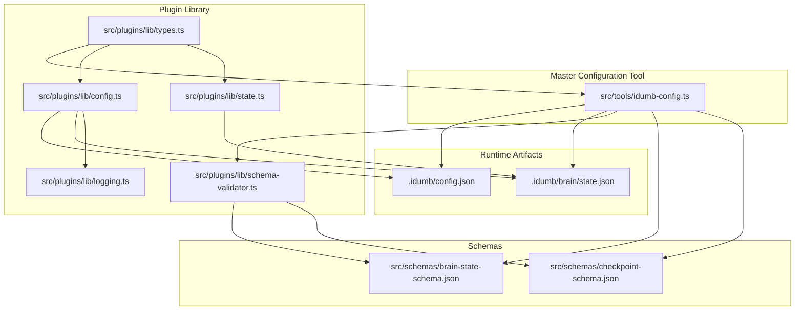
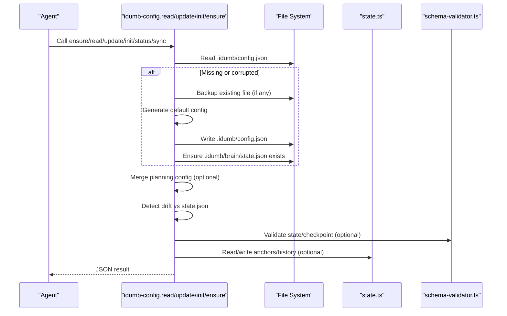
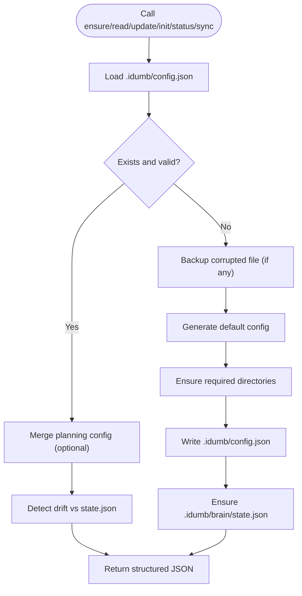
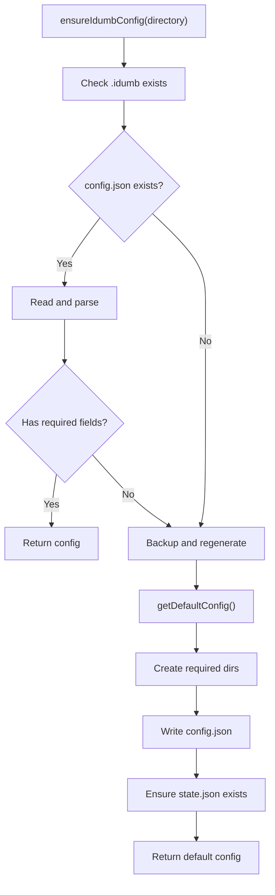
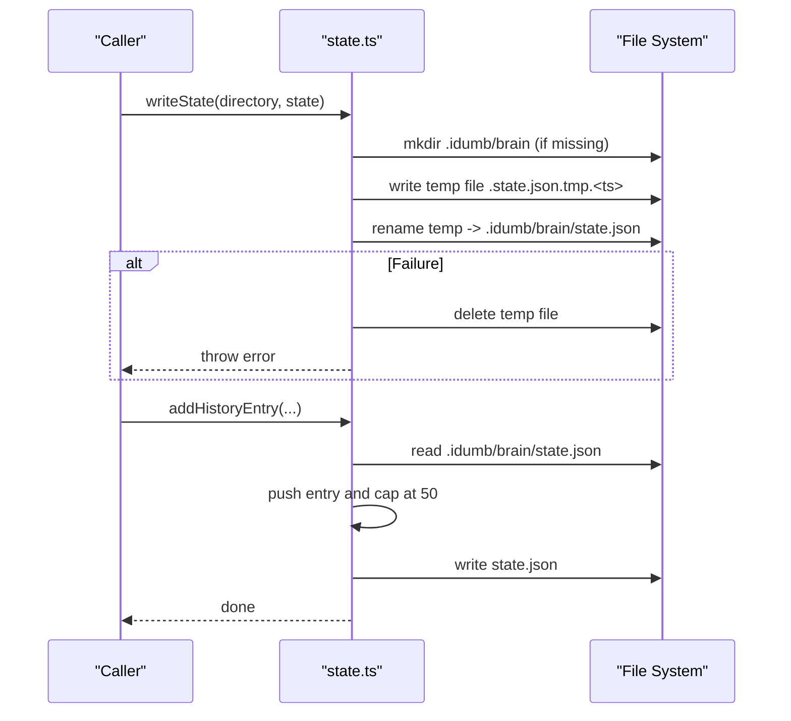
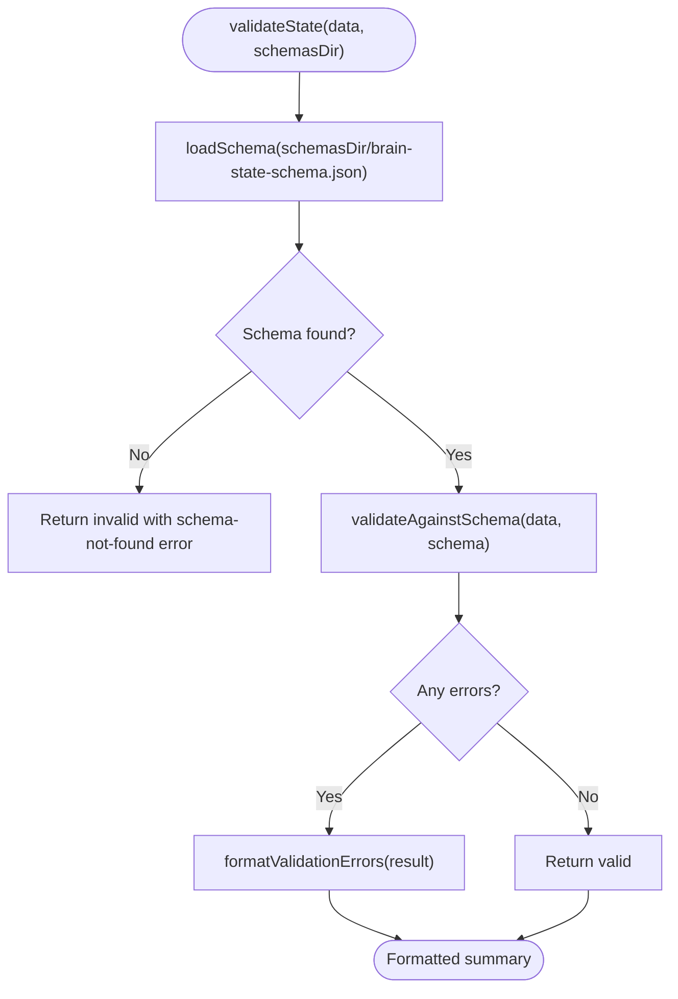
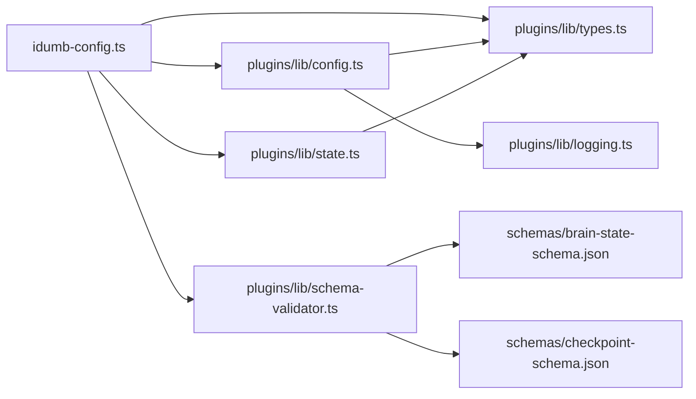

# Configuration Management

<cite>
**Referenced Files in This Document**
- [.idumb/config.json](file://.idumb/config.json)
- [src/tools/idumb-config.ts](file://src/tools/idumb-config.ts)
- [src/plugins/lib/config.ts](file://src/plugins/lib/config.ts)
- [src/plugins/lib/state.ts](file://src/plugins/lib/state.ts)
- [src/plugins/lib/schema-validator.ts](file://src/plugins/lib/schema-validator.ts)
- [src/plugins/lib/types.ts](file://src/plugins/lib/types.ts)
- [src/plugins/lib/logging.ts](file://src/plugins/lib/logging.ts)
- [src/schemas/brain-state-schema.json](file://src/schemas/brain-state-schema.json)
- [src/schemas/checkpoint-schema.json](file://src/schemas/checkpoint-schema.json)
- [src/config/completion-definitions.yaml](file://src/config/completion-definitions.yaml)
</cite>

## Table of Contents
1. [Introduction](#introduction)
2. [Project Structure](#project-structure)
3. [Core Components](#core-components)
4. [Architecture Overview](#architecture-overview)
5. [Detailed Component Analysis](#detailed-component-analysis)
6. [Dependency Analysis](#dependency-analysis)
7. [Performance Considerations](#performance-considerations)
8. [Troubleshooting Guide](#troubleshooting-guide)
9. [Conclusion](#conclusion)
10. [Appendices](#appendices)

## Introduction
This document explains iDumb’s configuration management system. It covers how configuration is loaded, validated, persisted, and integrated with state management and session artifacts. It also documents the configuration API surface, schema validation, enforcement checks, dynamic updates, inheritance and overrides, and practical procedures for backup, restore, and troubleshooting. Versioning, migration, and backward compatibility handling are included to ensure robust long-term operation.

## Project Structure
The configuration system spans two primary modules:
- Master configuration tool: defines the canonical schema and exposes tools for reading, updating, initializing, ensuring existence, and syncing with planning artifacts.
- Plugin configuration library: provides low-level helpers for path resolution, default generation, file I/O, and enforcement validation used across agents and tools.

**Diagram sources**
- [src/tools/idumb-config.ts](file://src/tools/idumb-config.ts#L1-L1024)
- [src/plugins/lib/config.ts](file://src/plugins/lib/config.ts#L1-L316)
- [src/plugins/lib/state.ts](file://src/plugins/lib/state.ts#L1-L189)
- [src/plugins/lib/schema-validator.ts](file://src/plugins/lib/schema-validator.ts#L1-L285)
- [src/plugins/lib/types.ts](file://src/plugins/lib/types.ts#L1-L282)
- [src/plugins/lib/logging.ts](file://src/plugins/lib/logging.ts#L1-L118)
- [src/schemas/brain-state-schema.json](file://src/schemas/brain-state-schema.json#L1-L112)
- [src/schemas/checkpoint-schema.json](file://src/schemas/checkpoint-schema.json#L1-L199)
- [.idumb/config.json](file://.idumb/config.json#L1-L123)

**Section sources**
- [src/tools/idumb-config.ts](file://src/tools/idumb-config.ts#L1-L1024)
- [src/plugins/lib/config.ts](file://src/plugins/lib/config.ts#L1-L316)
- [src/plugins/lib/state.ts](file://src/plugins/lib/state.ts#L1-L189)
- [src/plugins/lib/schema-validator.ts](file://src/plugins/lib/schema-validator.ts#L1-L285)
- [src/plugins/lib/types.ts](file://src/plugins/lib/types.ts#L1-L282)
- [src/plugins/lib/logging.ts](file://src/plugins/lib/logging.ts#L1-L118)
- [src/schemas/brain-state-schema.json](file://src/schemas/brain-state-schema.json#L1-L112)
- [src/schemas/checkpoint-schema.json](file://src/schemas/checkpoint-schema.json#L1-L199)
- [.idumb/config.json](file://.idumb/config.json#L1-L123)

## Core Components
- Master configuration tool: centralizes schema, default generation, and runtime operations (ensure, read, update, init, status, sync).
- Plugin configuration library: provides path helpers, default factories, file I/O, and enforcement validation.
- State management: reads/writes state.json with atomic writes and history anchoring.
- Schema validator: lightweight JSON Schema validation for state and checkpoints.
- Types: shared interfaces for configuration and state across modules.
- Logging: file-based logging with rotation to avoid console output in TUI contexts.

**Section sources**
- [src/tools/idumb-config.ts](file://src/tools/idumb-config.ts#L1-L1024)
- [src/plugins/lib/config.ts](file://src/plugins/lib/config.ts#L1-L316)
- [src/plugins/lib/state.ts](file://src/plugins/lib/state.ts#L1-L189)
- [src/plugins/lib/schema-validator.ts](file://src/plugins/lib/schema-validator.ts#L1-L285)
- [src/plugins/lib/types.ts](file://src/plugins/lib/types.ts#L1-L282)
- [src/plugins/lib/logging.ts](file://src/plugins/lib/logging.ts#L1-L118)

## Architecture Overview
The configuration system follows a single-source-of-truth model:
- The master configuration tool loads and validates the canonical configuration file.
- It optionally merges planning system settings and detects drift between planning artifacts and runtime state.
- Enforcement checks ensure required artifacts and governance settings are present and aligned.
- State management persists runtime context and anchors, integrating with configuration paths and timestamps.

**Diagram sources**
- [src/tools/idumb-config.ts](file://src/tools/idumb-config.ts#L528-L1023)
- [src/plugins/lib/config.ts](file://src/plugins/lib/config.ts#L178-L250)
- [src/plugins/lib/state.ts](file://src/plugins/lib/state.ts#L34-L101)
- [src/plugins/lib/schema-validator.ts](file://src/plugins/lib/schema-validator.ts#L211-L248)

## Detailed Component Analysis

### Master Configuration Tool
Responsibilities:
- Define the canonical configuration schema and default values.
- Ensure configuration exists at session start and auto-generate if missing.
- Merge planning system configuration and detect drift.
- Expose tools for reading, updating, initializing, ensuring, and syncing configuration.
- Enforce user-controlled overrides and reserved-key protection.

Key behaviors:
- Default generation based on experience level with derived automation settings.
- Atomic persistence with last-modified timestamps.
- Drift detection by comparing planning-derived status with state.json.
- Reserved-key protection to prevent overriding system-controlled keys.

**Diagram sources**
- [src/tools/idumb-config.ts](file://src/tools/idumb-config.ts#L445-L511)
- [src/tools/idumb-config.ts](file://src/tools/idumb-config.ts#L567-L629)

**Section sources**
- [src/tools/idumb-config.ts](file://src/tools/idumb-config.ts#L53-L199)
- [src/tools/idumb-config.ts](file://src/tools/idumb-config.ts#L252-L314)
- [src/tools/idumb-config.ts](file://src/tools/idumb-config.ts#L326-L415)
- [src/tools/idumb-config.ts](file://src/tools/idumb-config.ts#L445-L511)
- [src/tools/idumb-config.ts](file://src/tools/idumb-config.ts#L567-L629)
- [src/tools/idumb-config.ts](file://src/tools/idumb-config.ts#L652-L770)
- [src/tools/idumb-config.ts](file://src/tools/idumb-config.ts#L775-L846)
- [src/tools/idumb-config.ts](file://src/tools/idumb-config.ts#L852-L884)
- [src/tools/idumb-config.ts](file://src/tools/idumb-config.ts#L889-L925)
- [src/tools/idumb-config.ts](file://src/tools/idumb-config.ts#L931-L992)
- [src/tools/idumb-config.ts](file://src/tools/idumb-config.ts#L997-L1023)

### Plugin Configuration Library
Responsibilities:
- Provide path helpers for .idumb and brain directories.
- Generate default configuration and state with sensible defaults.
- Read/write configuration with robust error handling and backup on corruption.
- Validate enforcement settings at runtime and auto-recover missing artifacts.

Key behaviors:
- Path helpers for deterministic file locations.
- Default factory with experience-driven automation settings.
- Atomic write pattern for state persistence.
- Enforcement validation with warnings and auto-recovery.

**Diagram sources**
- [src/plugins/lib/config.ts](file://src/plugins/lib/config.ts#L178-L250)

**Section sources**
- [src/plugins/lib/config.ts](file://src/plugins/lib/config.ts#L20-L26)
- [src/plugins/lib/config.ts](file://src/plugins/lib/config.ts#L32-L133)
- [src/plugins/lib/config.ts](file://src/plugins/lib/config.ts#L143-L168)
- [src/plugins/lib/config.ts](file://src/plugins/lib/config.ts#L178-L250)
- [src/plugins/lib/config.ts](file://src/plugins/lib/config.ts#L261-L315)

### State Management
Responsibilities:
- Read/write state.json with atomic writes to prevent corruption.
- Maintain bounded history and anchors for context retention.
- Provide helpers for style anchors and history entries.

Key behaviors:
- Atomic write via temporary file then rename.
- History rotation to limit entries.
- Style anchor replacement per agent with JSON-serialized content.

**Diagram sources**
- [src/plugins/lib/state.ts](file://src/plugins/lib/state.ts#L51-L73)
- [src/plugins/lib/state.ts](file://src/plugins/lib/state.ts#L79-L101)

**Section sources**
- [src/plugins/lib/state.ts](file://src/plugins/lib/state.ts#L18-L24)
- [src/plugins/lib/state.ts](file://src/plugins/lib/state.ts#L34-L45)
- [src/plugins/lib/state.ts](file://src/plugins/lib/state.ts#L51-L73)
- [src/plugins/lib/state.ts](file://src/plugins/lib/state.ts#L79-L101)
- [src/plugins/lib/state.ts](file://src/plugins/lib/state.ts#L111-L149)
- [src/plugins/lib/state.ts](file://src/plugins/lib/state.ts#L174-L189)

### Schema Validation
Responsibilities:
- Validate runtime state and checkpoints against JSON Schemas.
- Lightweight validation without external dependencies, draft-07 compatible.
- Provide formatted error summaries and quick validity checks.

Key behaviors:
- Load schema from filesystem.
- Validate required properties and types.
- Support enums, patterns, min/max constraints, nested objects, and arrays.
- Return structured results with errors and warnings.

**Diagram sources**
- [src/plugins/lib/schema-validator.ts](file://src/plugins/lib/schema-validator.ts#L211-L248)
- [src/plugins/lib/schema-validator.ts](file://src/plugins/lib/schema-validator.ts#L162-L206)
- [src/plugins/lib/schema-validator.ts](file://src/plugins/lib/schema-validator.ts#L267-L284)

**Section sources**
- [src/plugins/lib/schema-validator.ts](file://src/plugins/lib/schema-validator.ts#L29-L39)
- [src/plugins/lib/schema-validator.ts](file://src/plugins/lib/schema-validator.ts#L41-L157)
- [src/plugins/lib/schema-validator.ts](file://src/plugins/lib/schema-validator.ts#L162-L206)
- [src/plugins/lib/schema-validator.ts](file://src/plugins/lib/schema-validator.ts#L211-L248)
- [src/plugins/lib/schema-validator.ts](file://src/plugins/lib/schema-validator.ts#L253-L262)
- [src/plugins/lib/schema-validator.ts](file://src/plugins/lib/schema-validator.ts#L267-L284)

### Types and Contracts
Responsibilities:
- Define shared interfaces for configuration, state, anchors, history, checkpoints, and governance rules.
- Ensure type consistency across tools and libraries.

Key behaviors:
- Inline configuration interface used by plugin library.
- State interface extended with output style tracking.
- Checkpoint interface for execution checkpoints.
- Governance rule interfaces for chain enforcement.

**Section sources**
- [src/plugins/lib/types.ts](file://src/plugins/lib/types.ts#L20-L51)
- [src/plugins/lib/types.ts](file://src/plugins/lib/types.ts#L60-L94)
- [src/plugins/lib/types.ts](file://src/plugins/lib/types.ts#L146-L176)
- [src/plugins/lib/types.ts](file://src/plugins/lib/types.ts#L185-L207)

### Logging
Responsibilities:
- Provide file-based logging with automatic rotation to avoid console output in TUI contexts.
- Rotate logs when size exceeds threshold and maintain archived copies.

**Section sources**
- [src/plugins/lib/logging.ts](file://src/plugins/lib/logging.ts#L36-L79)
- [src/plugins/lib/logging.ts](file://src/plugins/lib/logging.ts#L89-L117)

## Dependency Analysis
The configuration system exhibits clear separation of concerns:
- Master tool depends on plugin library for path resolution and enforcement.
- Plugin library depends on types for shared interfaces and logging for diagnostics.
- Schema validator is consumed by both master tool and state management.
- State management is independent but integrates with configuration paths and timestamps.

**Diagram sources**
- [src/tools/idumb-config.ts](file://src/tools/idumb-config.ts#L1-L1024)
- [src/plugins/lib/config.ts](file://src/plugins/lib/config.ts#L1-L316)
- [src/plugins/lib/state.ts](file://src/plugins/lib/state.ts#L1-L189)
- [src/plugins/lib/schema-validator.ts](file://src/plugins/lib/schema-validator.ts#L1-L285)
- [src/plugins/lib/types.ts](file://src/plugins/lib/types.ts#L1-L282)
- [src/plugins/lib/logging.ts](file://src/plugins/lib/logging.ts#L1-L118)
- [src/schemas/brain-state-schema.json](file://src/schemas/brain-state-schema.json#L1-L112)
- [src/schemas/checkpoint-schema.json](file://src/schemas/checkpoint-schema.json#L1-L199)

**Section sources**
- [src/tools/idumb-config.ts](file://src/tools/idumb-config.ts#L1-L1024)
- [src/plugins/lib/config.ts](file://src/plugins/lib/config.ts#L1-L316)
- [src/plugins/lib/state.ts](file://src/plugins/lib/state.ts#L1-L189)
- [src/plugins/lib/schema-validator.ts](file://src/plugins/lib/schema-validator.ts#L1-L285)
- [src/plugins/lib/types.ts](file://src/plugins/lib/types.ts#L1-L282)
- [src/plugins/lib/logging.ts](file://src/plugins/lib/logging.ts#L1-L118)
- [src/schemas/brain-state-schema.json](file://src/schemas/brain-state-schema.json#L1-L112)
- [src/schemas/checkpoint-schema.json](file://src/schemas/checkpoint-schema.json#L1-L199)

## Performance Considerations
- File I/O is synchronous and straightforward; ensure operations occur infrequently to minimize overhead.
- Atomic writes for state reduce corruption risk at the cost of extra disk operations; batch updates when possible.
- Schema validation is lightweight and draft-07 compatible; cache schema content if validating frequently.
- Logging rotation prevents unbounded growth; tune thresholds based on deployment needs.

[No sources needed since this section provides general guidance]

## Troubleshooting Guide
Common issues and resolutions:
- Corrupted configuration: The system automatically backs up the corrupted file and regenerates defaults. Inspect the backup and restore as needed.
- Missing state.json: The system can auto-create it when enforcement requires state presence.
- Drift between planning artifacts and runtime state: The system detects drift and marks it in status; reconcile by updating planning artifacts or configuration accordingly.
- Reserved keys: Updates attempting to change reserved keys are rejected with guidance on where to configure those settings.
- Schema validation failures: Use the formatted error summary to identify missing or invalid fields and correct them.

Operational tips:
- Use the ensure tool at session start to guarantee configuration availability.
- Use the status tool to inspect current hierarchy, phase, and drift indicators.
- Use the sync tool to align configuration with planning system settings.

**Section sources**
- [src/plugins/lib/config.ts](file://src/plugins/lib/config.ts#L198-L210)
- [src/plugins/lib/config.ts](file://src/plugins/lib/config.ts#L274-L287)
- [src/tools/idumb-config.ts](file://src/tools/idumb-config.ts#L652-L770)
- [src/tools/idumb-config.ts](file://src/tools/idumb-config.ts#L852-L884)
- [src/tools/idumb-config.ts](file://src/tools/idumb-config.ts#L889-L925)
- [src/plugins/lib/schema-validator.ts](file://src/plugins/lib/schema-validator.ts#L267-L284)

## Conclusion
iDumb’s configuration management system centers on a single-source-of-truth configuration file, robust enforcement, and tight integration with state and schema validation. It supports dynamic updates, planning system alignment, and safe recovery from corruption. The plugin library ensures consistent path handling and atomic persistence, while the master tool provides a cohesive API surface for agents and workflows.

[No sources needed since this section summarizes without analyzing specific files]

## Appendices

### Configuration API Reference
- read: Read configuration with optional section filter, merge planning config, detect drift, and return structured JSON.
- update: Update a configuration value by section and dot-notation key, with reserved-key protection and experience-triggered automation updates.
- init: Initialize configuration with defaults, apply overrides, detect planning system, and ensure required directories.
- ensure: Ensure configuration exists at session start, auto-generating if missing.
- status: Retrieve current hierarchy, phase, and drift status.
- sync: Align configuration with planning system settings.

**Section sources**
- [src/tools/idumb-config.ts](file://src/tools/idumb-config.ts#L652-L770)
- [src/tools/idumb-config.ts](file://src/tools/idumb-config.ts#L775-L846)
- [src/tools/idumb-config.ts](file://src/tools/idumb-config.ts#L931-L992)
- [src/tools/idumb-config.ts](file://src/tools/idumb-config.ts#L852-L884)
- [src/tools/idumb-config.ts](file://src/tools/idumb-config.ts#L889-L925)

### Schema Validation Reference
- validateState: Validate runtime state against brain-state-schema.json.
- validateCheckpoint: Validate checkpoints against checkpoint-schema.json.
- isValidState/isValidCheckpoint: Quick validity checks.
- formatValidationErrors: Human-readable error summaries.

**Section sources**
- [src/plugins/lib/schema-validator.ts](file://src/plugins/lib/schema-validator.ts#L211-L248)
- [src/plugins/lib/schema-validator.ts](file://src/plugins/lib/schema-validator.ts#L253-L262)
- [src/plugins/lib/schema-validator.ts](file://src/plugins/lib/schema-validator.ts#L267-L284)

### Practical Procedures

- Programmatic configuration manipulation:
  - Use the update tool to change user preferences, automation modes, and enforcement flags.
  - Experience-level changes propagate to automation settings automatically.

- Configuration backup and restore:
  - On corruption, the system creates a timestamped backup of the old configuration.
  - Restore by copying the backup to the expected location and restarting the session.

- Dynamic configuration updates:
  - After updating, the system refreshes lastModified and persists changes atomically.
  - Use ensure at session start to guarantee availability.

- Environment-specific overrides:
  - Use init with language and experience arguments to tailor defaults.
  - Use sync to align with planning system settings.

- Integration with state management and session persistence:
  - State is stored in state.json with atomic writes and bounded history.
  - Anchors preserve critical context; style anchors track agent output styles.

- Configuration versioning, migration, and backward compatibility:
  - The configuration includes a semantic version field.
  - Migration procedures should compare versions and apply transformations before reading.
  - Backward compatibility is maintained by treating unknown fields as warnings and preserving required fields.

**Section sources**
- [src/tools/idumb-config.ts](file://src/tools/idumb-config.ts#L747-L753)
- [src/plugins/lib/config.ts](file://src/plugins/lib/config.ts#L200-L209)
- [src/plugins/lib/state.ts](file://src/plugins/lib/state.ts#L51-L73)
- [src/plugins/lib/state.ts](file://src/plugins/lib/state.ts#L111-L149)
- [.idumb/config.json](file://.idumb/config.json#L2-L4)

### Inheritance Patterns and Environment Overrides
- Experience level drives automation mode and required-first tools.
- Planning system settings can override derived experience in sync operations.
- Paths in configuration define where artifacts live, enabling environment-specific overrides by changing path values.

**Section sources**
- [src/tools/idumb-config.ts](file://src/tools/idumb-config.ts#L252-L314)
- [src/tools/idumb-config.ts](file://src/tools/idumb-config.ts#L907-L913)
- [.idumb/config.json](file://.idumb/config.json#L86-L103)

### Completion-Driven Exit Criteria and Governance
- Completion definitions specify when workflows and loops exit, emphasizing evidence-based completion and stall escalation.
- These definitions inform governance decisions and can influence configuration behavior (e.g., required-first tools).

**Section sources**
- [src/config/completion-definitions.yaml](file://src/config/completion-definitions.yaml#L1-L990)