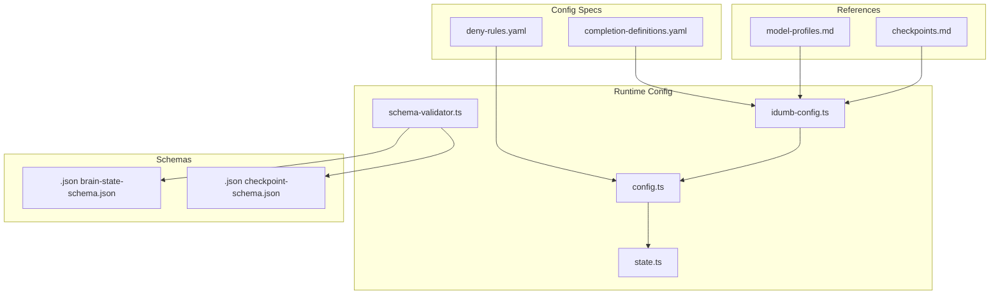
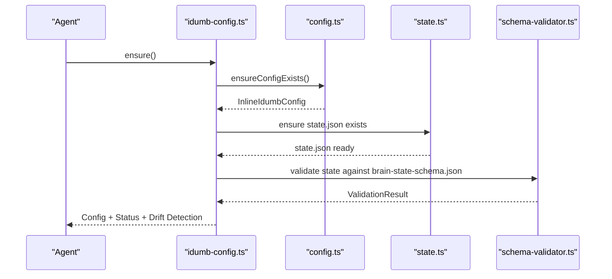
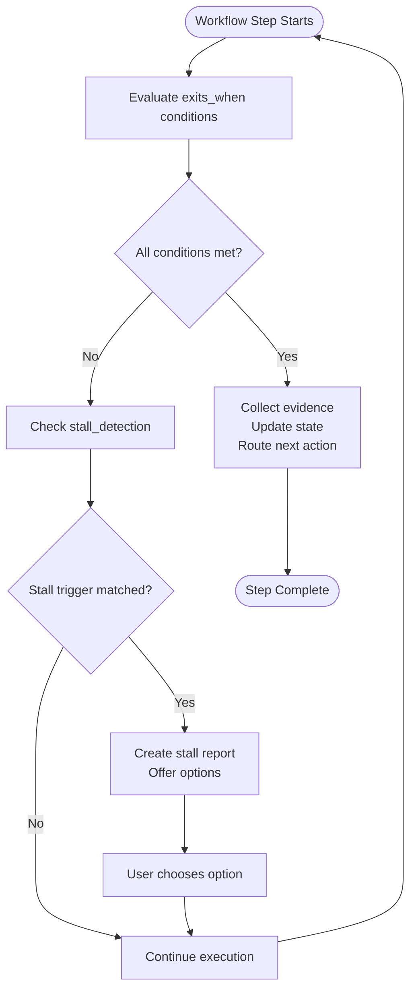
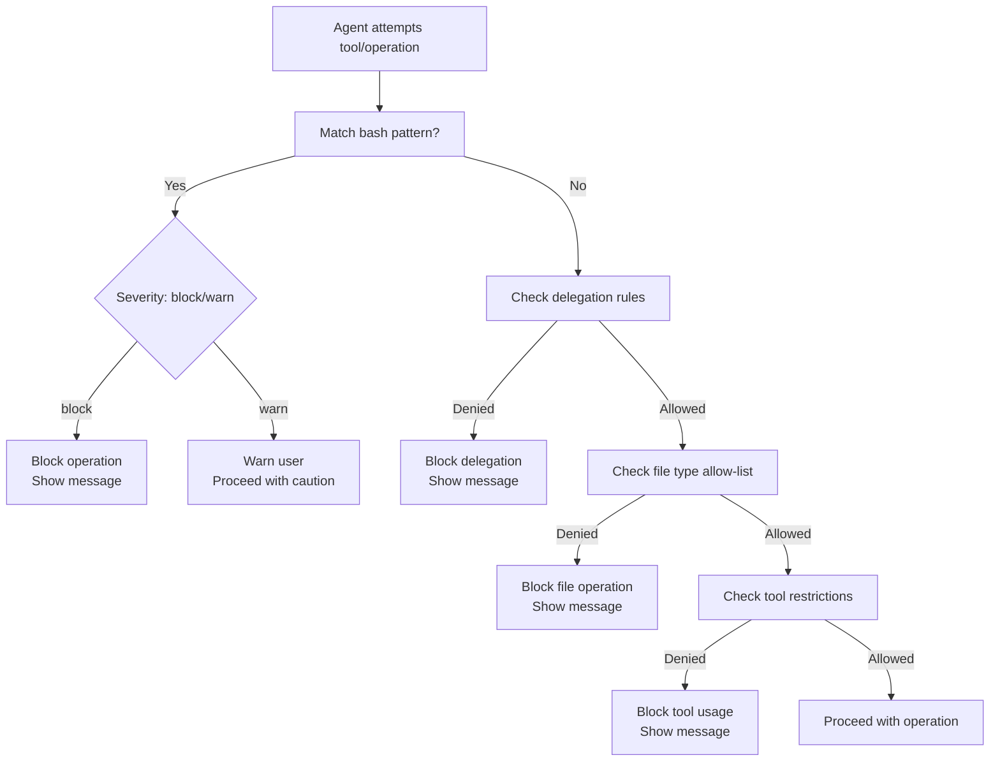
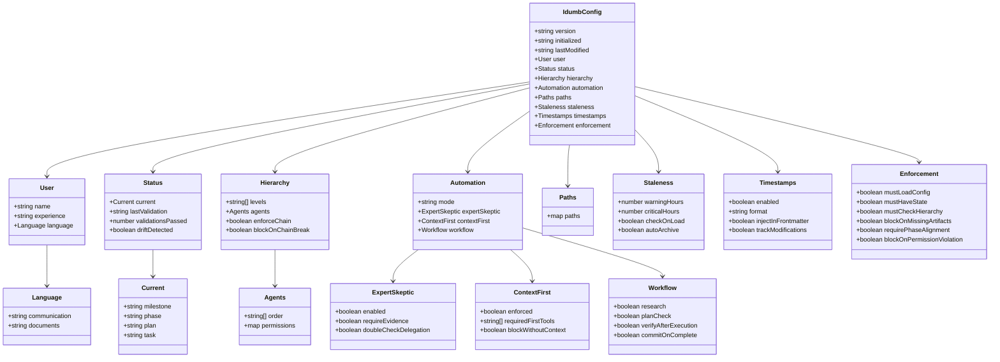
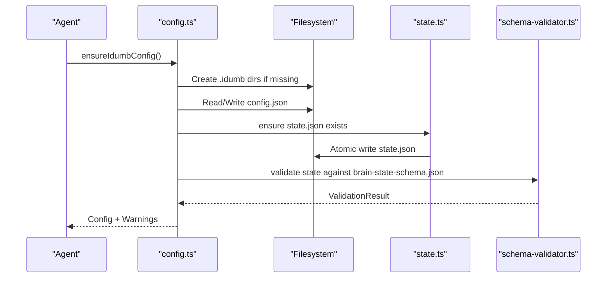
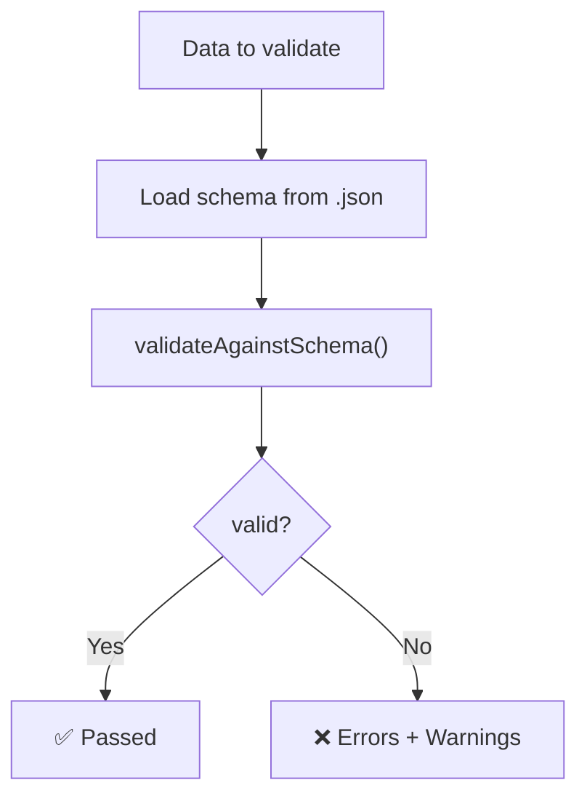
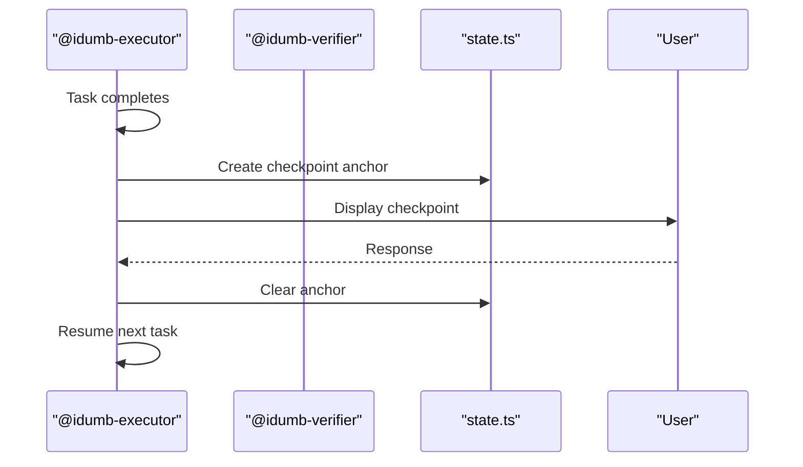
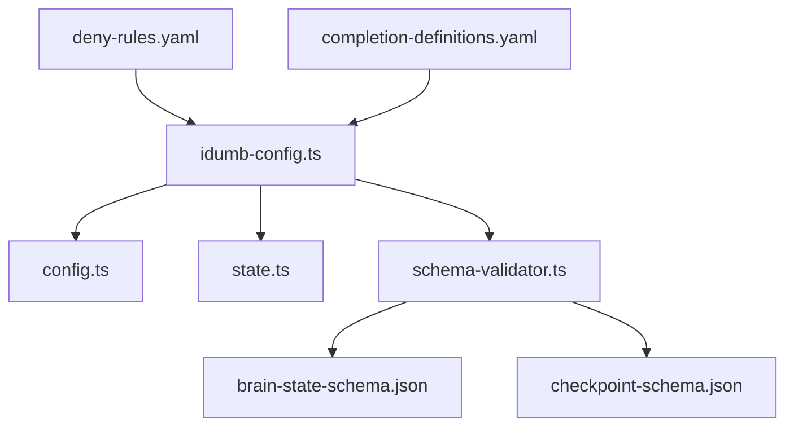

# Configuration System

<cite>
**Referenced Files in This Document**
- [completion-definitions.yaml](file://src/config/completion-definitions.yaml)
- [deny-rules.yaml](file://src/config/deny-rules.yaml)
- [idumb-config.ts](file://src/tools/idumb-config.ts)
- [config.ts](file://src/plugins/lib/config.ts)
- [state.ts](file://src/plugins/lib/state.ts)
- [schema-validator.ts](file://src/plugins/lib/schema-validator.ts)
- [brain-state-schema.json](file://src/schemas/brain-state-schema.json)
- [checkpoint-schema.json](file://src/schemas/checkpoint-schema.json)
- [model-profiles.md](file://src/references/model-profiles.md)
- [checkpoints.md](file://src/references/checkpoints.md)
- [index.ts](file://src/plugins/lib/index.ts)
</cite>

## Table of Contents
1. [Introduction](#introduction)
2. [Project Structure](#project-structure)
3. [Core Components](#core-components)
4. [Architecture Overview](#architecture-overview)
5. [Detailed Component Analysis](#detailed-component-analysis)
6. [Dependency Analysis](#dependency-analysis)
7. [Performance Considerations](#performance-considerations)
8. [Troubleshooting Guide](#troubleshooting-guide)
9. [Conclusion](#conclusion)
10. [Appendices](#appendices)

## Introduction
This document explains iDumb’s configuration system: how configuration files are structured, validated, inherited, and enforced; how completion-driven exit criteria and stall escalation are defined; how deny rules govern permissions and security; and how model profiles, language settings, and output formatting are configured. It also covers practical customization, environment-specific settings, validation and error handling, versioning and migration, and integration with external systems and CI/CD.

## Project Structure
The configuration system spans:
- YAML-based specification files for completion definitions and deny rules
- JSON schema files for runtime validation of state and checkpoints
- TypeScript modules for configuration generation, persistence, enforcement, and validation
- Markdown references for model profiles and checkpoint protocols

**Diagram sources**
- [completion-definitions.yaml](file://src/config/completion-definitions.yaml#L1-L990)
- [deny-rules.yaml](file://src/config/deny-rules.yaml#L1-L398)
- [idumb-config.ts](file://src/tools/idumb-config.ts#L1-L1024)
- [config.ts](file://src/plugins/lib/config.ts#L1-L316)
- [state.ts](file://src/plugins/lib/state.ts#L1-L189)
- [schema-validator.ts](file://src/plugins/lib/schema-validator.ts#L1-L285)
- [brain-state-schema.json](file://src/schemas/brain-state-schema.json#L1-L112)
- [checkpoint-schema.json](file://src/schemas/checkpoint-schema.json#L1-L199)
- [model-profiles.md](file://src/references/model-profiles.md#L1-L178)
- [checkpoints.md](file://src/references/checkpoints.md#L1-L479)

**Section sources**
- [completion-definitions.yaml](file://src/config/completion-definitions.yaml#L1-L990)
- [deny-rules.yaml](file://src/config/deny-rules.yaml#L1-L398)
- [idumb-config.ts](file://src/tools/idumb-config.ts#L1-L1024)
- [config.ts](file://src/plugins/lib/config.ts#L1-L316)
- [state.ts](file://src/plugins/lib/state.ts#L1-L189)
- [schema-validator.ts](file://src/plugins/lib/schema-validator.ts#L1-L285)
- [brain-state-schema.json](file://src/schemas/brain-state-schema.json#L1-L112)
- [checkpoint-schema.json](file://src/schemas/checkpoint-schema.json#L1-L199)
- [model-profiles.md](file://src/references/model-profiles.md#L1-L178)
- [checkpoints.md](file://src/references/checkpoints.md#L1-L479)

## Core Components
- Completion definitions: Define acceptance criteria and stall escalation for workflows and internal loops.
- Deny rules: Enforce security and operational policies per agent and tool.
- Master configuration: JSON configuration with user preferences, automation modes, hierarchy, paths, enforcement flags, timestamps, and staleness detection.
- State and checkpoints: JSON schemas and validators for runtime governance state and execution checkpoints.
- Model profiles: Guidance for matching agents to model tiers and thinking modes.
- Checkpoint protocol: Human-in-the-loop checkpoints and dynamic authentication gates.

**Section sources**
- [completion-definitions.yaml](file://src/config/completion-definitions.yaml#L1-L990)
- [deny-rules.yaml](file://src/config/deny-rules.yaml#L1-L398)
- [idumb-config.ts](file://src/tools/idumb-config.ts#L53-L415)
- [brain-state-schema.json](file://src/schemas/brain-state-schema.json#L1-L112)
- [checkpoint-schema.json](file://src/schemas/checkpoint-schema.json#L1-L199)
- [model-profiles.md](file://src/references/model-profiles.md#L1-L178)
- [checkpoints.md](file://src/references/checkpoints.md#L1-L479)

## Architecture Overview
The configuration system centers on a single-source-of-truth master configuration that agents load at session start. It integrates with:
- Planning system configuration (.planning/config.json) for mode/profile alignment
- State and checkpoint schemas for runtime validation
- Deny rules for permission enforcement
- Completion definitions for workflow termination and stall escalation

**Diagram sources**
- [idumb-config.ts](file://src/tools/idumb-config.ts#L445-L511)
- [config.ts](file://src/plugins/lib/config.ts#L178-L250)
- [state.ts](file://src/plugins/lib/state.ts#L34-L73)
- [schema-validator.ts](file://src/plugins/lib/schema-validator.ts#L211-L227)
- [brain-state-schema.json](file://src/schemas/brain-state-schema.json#L1-L112)

## Detailed Component Analysis

### Completion Definitions
Completion definitions specify:
- Purpose and acceptance criteria per workflow and internal loop
- Stall detection triggers and escalation actions
- Evidence collection and state updates on completion
- Universal stall handling principles and report format

Key patterns:
- exits_when with logical conditions (all_true, any_true)
- stall_detection with triggers, actions, and never clauses
- on_completion with evidence and state updates
- Large codebase handling and per-participant completion specs

**Diagram sources**
- [completion-definitions.yaml](file://src/config/completion-definitions.yaml#L33-L506)

**Section sources**
- [completion-definitions.yaml](file://src/config/completion-definitions.yaml#L1-L990)

### Deny Rules
Deny rules define:
- Bash command restrictions (block/warn), credential exposure, and wildcard deletions
- Agent-specific allows for safe operations
- Delegation restrictions and allowed targets
- File-type allowances scoped to meta/project scopes
- Tool restrictions per agent role
- First-tool requirements for context-first methodology
- Message templates for TUI-safe reporting

**Diagram sources**
- [deny-rules.yaml](file://src/config/deny-rules.yaml#L18-L398)

**Section sources**
- [deny-rules.yaml](file://src/config/deny-rules.yaml#L1-L398)

### Master Configuration (Single Source of Truth)
The master configuration defines:
- User preferences (name, experience level, languages)
- Governance status (current milestone/phase/plan/task, drift detection)
- Hierarchy control (levels, agent chain, permissions)
- Automation control (mode, expert-skeptic, context-first, workflow toggles)
- Paths (root, brain, output, modules)
- Staleness detection (warning/critical thresholds)
- Timestamps (format, frontmatter injection, modification tracking)
- Enforcement flags (must-load config, must-have state, hierarchy checks, permission enforcement)

**Diagram sources**
- [idumb-config.ts](file://src/tools/idumb-config.ts#L53-L199)

**Section sources**
- [idumb-config.ts](file://src/tools/idumb-config.ts#L53-L415)

### Configuration Persistence and Enforcement
- Auto-generation of .idumb/brain/config.json and state.json if missing
- Validation of required fields and enforcement flags
- Atomic write for state.json to prevent corruption
- Schema validation for state and checkpoints

**Diagram sources**
- [config.ts](file://src/plugins/lib/config.ts#L178-L250)
- [state.ts](file://src/plugins/lib/state.ts#L51-L73)
- [schema-validator.ts](file://src/plugins/lib/schema-validator.ts#L211-L227)

**Section sources**
- [config.ts](file://src/plugins/lib/config.ts#L178-L316)
- [state.ts](file://src/plugins/lib/state.ts#L34-L101)
- [schema-validator.ts](file://src/plugins/lib/schema-validator.ts#L162-L206)

### Schema Validation
- JSON Schema draft-07 compatible validation
- Built-in validation for state and checkpoints
- Error formatting for diagnostics

**Diagram sources**
- [schema-validator.ts](file://src/plugins/lib/schema-validator.ts#L162-L206)
- [brain-state-schema.json](file://src/schemas/brain-state-schema.json#L1-L112)
- [checkpoint-schema.json](file://src/schemas/checkpoint-schema.json#L1-L199)

**Section sources**
- [schema-validator.ts](file://src/plugins/lib/schema-validator.ts#L1-L285)
- [brain-state-schema.json](file://src/schemas/brain-state-schema.json#L1-L112)
- [checkpoint-schema.json](file://src/schemas/checkpoint-schema.json#L1-L199)

### Model Profiles and Output Formatting
- Model profiles map agents to cost/quality tiers and thinking modes
- Override rules for complexity and simplicity
- Output style tracking via anchors in state

**Diagram sources**
- [model-profiles.md](file://src/references/model-profiles.md#L1-L178)
- [state.ts](file://src/plugins/lib/state.ts#L111-L149)

**Section sources**
- [model-profiles.md](file://src/references/model-profiles.md#L1-L178)
- [state.ts](file://src/plugins/lib/state.ts#L111-L168)

### Checkpoints and Human-in-the-Loop
- Checkpoint types: human-verify, decision, human-action
- Execution protocol and authentication gates
- Anchor format and lifecycle

**Diagram sources**
- [checkpoints.md](file://src/references/checkpoints.md#L212-L249)
- [state.ts](file://src/plugins/lib/state.ts#L34-L73)

**Section sources**
- [checkpoints.md](file://src/references/checkpoints.md#L1-L479)
- [state.ts](file://src/plugins/lib/state.ts#L34-L101)

## Dependency Analysis
- idumb-config.ts depends on config.ts for default generation and state.ts for state.json management
- schema-validator.ts depends on schema JSON files for validation
- deny-rules.yaml is consumed by governance and enforcement modules
- completion-definitions.yaml informs workflow termination and stall handling across agents

**Diagram sources**
- [idumb-config.ts](file://src/tools/idumb-config.ts#L1-L1024)
- [config.ts](file://src/plugins/lib/config.ts#L1-L316)
- [state.ts](file://src/plugins/lib/state.ts#L1-L189)
- [schema-validator.ts](file://src/plugins/lib/schema-validator.ts#L1-L285)
- [brain-state-schema.json](file://src/schemas/brain-state-schema.json#L1-L112)
- [checkpoint-schema.json](file://src/schemas/checkpoint-schema.json#L1-L199)
- [deny-rules.yaml](file://src/config/deny-rules.yaml#L1-L398)
- [completion-definitions.yaml](file://src/config/completion-definitions.yaml#L1-L990)

**Section sources**
- [index.ts](file://src/plugins/lib/index.ts#L1-L131)
- [idumb-config.ts](file://src/tools/idumb-config.ts#L1-L1024)
- [config.ts](file://src/plugins/lib/config.ts#L1-L316)
- [state.ts](file://src/plugins/lib/state.ts#L1-L189)
- [schema-validator.ts](file://src/plugins/lib/schema-validator.ts#L1-L285)
- [brain-state-schema.json](file://src/schemas/brain-state-schema.json#L1-L112)
- [checkpoint-schema.json](file://src/schemas/checkpoint-schema.json#L1-L199)
- [deny-rules.yaml](file://src/config/deny-rules.yaml#L1-L398)
- [completion-definitions.yaml](file://src/config/completion-definitions.yaml#L1-L990)

## Performance Considerations
- Prefer model profiles aligned to task complexity to reduce token costs
- Use checkpoints sparingly and strategically to minimize human-in-the-loop overhead
- Keep state and checkpoint schemas minimal to reduce validation overhead
- Use atomic writes for state.json to avoid corruption and retries

## Troubleshooting Guide
Common issues and resolutions:
- Corrupted config.json: Auto-backup and regeneration occur when missing required fields; inspect backup files and reinitialize.
- Missing state.json: Auto-created with defaults when mustHaveState is enabled.
- Drift between config and state: Detected and flagged; synchronize from planning artifacts.
- Validation failures: Use schema-validator to diagnose; correct schema violations and re-run.
- Permission denials: Review deny-rules.yaml for specific messages and suggestions; adjust agent roles or tool usage accordingly.
- Stall escalations: Follow universal stall handling; create stall reports and choose among offered options.

**Section sources**
- [config.ts](file://src/plugins/lib/config.ts#L193-L210)
- [config.ts](file://src/plugins/lib/config.ts#L274-L287)
- [idumb-config.ts](file://src/tools/idumb-config.ts#L608-L629)
- [schema-validator.ts](file://src/plugins/lib/schema-validator.ts#L267-L284)
- [deny-rules.yaml](file://src/config/deny-rules.yaml#L1-L398)
- [completion-definitions.yaml](file://src/config/completion-definitions.yaml#L735-L792)

## Conclusion
iDumb’s configuration system is a robust, schema-driven framework that ensures consistent governance across workflows. Completion definitions and deny rules provide deterministic termination and strong security. The master configuration acts as the single source of truth, while schemas and validators maintain runtime integrity. Model profiles and checkpoints enable efficient, human-aware automation.

## Appendices

### Practical Examples and Best Practices
- Customize experience level to control automation behavior; it cascades to automation settings.
- Align planning system mode with iDumb experience for seamless operation.
- Use model profiles to optimize cost and performance per agent role.
- Configure language settings for communication and document generation.
- Set staleness thresholds to prevent drift and enable auto-archive.
- Enforce context-first methodology by ensuring required first tools are present.

**Section sources**
- [idumb-config.ts](file://src/tools/idumb-config.ts#L252-L314)
- [idumb-config.ts](file://src/tools/idumb-config.ts#L890-L925)
- [model-profiles.md](file://src/references/model-profiles.md#L1-L178)
- [checkpoints.md](file://src/references/checkpoints.md#L1-L479)

### Versioning, Migration, and Backward Compatibility
- Configuration and state schemas include version fields; validation enforces schema compliance.
- Migration strategies involve validating against schemas and updating fields as needed; backups are created on corruption.
- Enforcement settings are validated at startup; warnings are emitted for misconfigurations.

**Section sources**
- [brain-state-schema.json](file://src/schemas/brain-state-schema.json#L8-L12)
- [checkpoint-schema.json](file://src/schemas/checkpoint-schema.json#L5-L20)
- [config.ts](file://src/plugins/lib/config.ts#L261-L315)

### Integration with External Systems and CI/CD
- Planning system integration: Sync iDumb config with .planning/config.json to derive experience and automation mode.
- Authentication gates: Dynamic checkpoints handle CLI authentication failures; collect secrets and inject via CLI.
- Environment variables: Manage via CLI tools; avoid manual .env creation.

**Section sources**
- [idumb-config.ts](file://src/tools/idumb-config.ts#L890-L925)
- [checkpoints.md](file://src/references/checkpoints.md#L251-L274)
- [checkpoints.md](file://src/references/checkpoints.md#L291-L323)