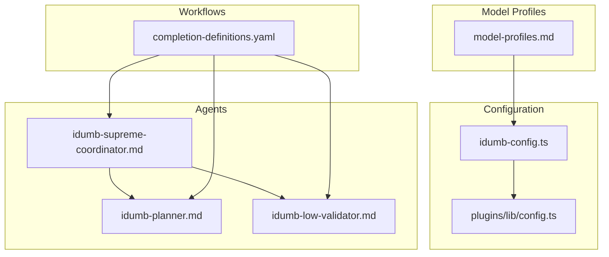
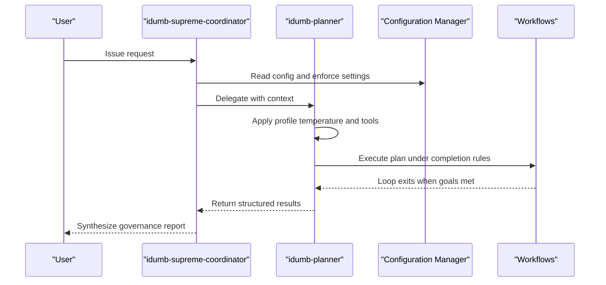
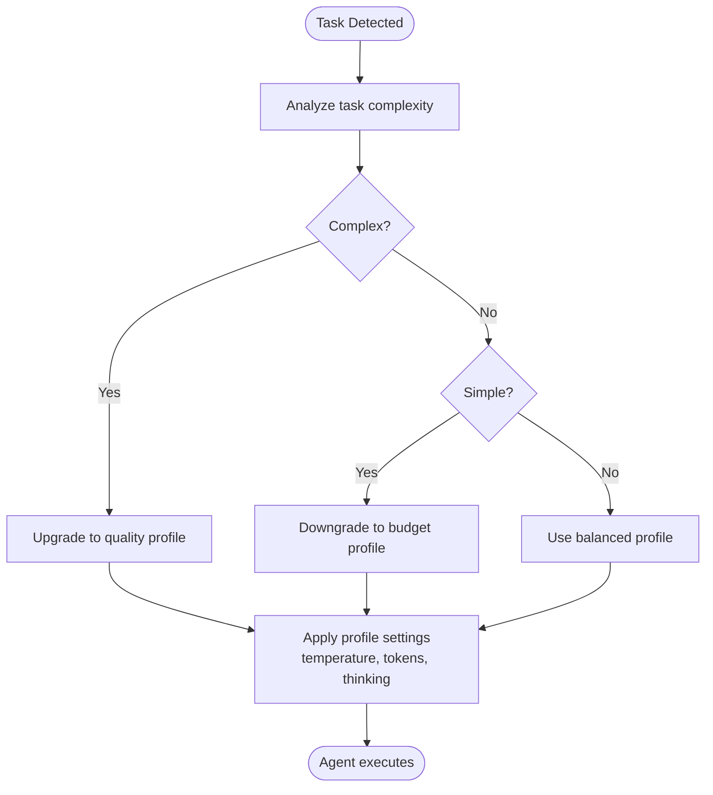
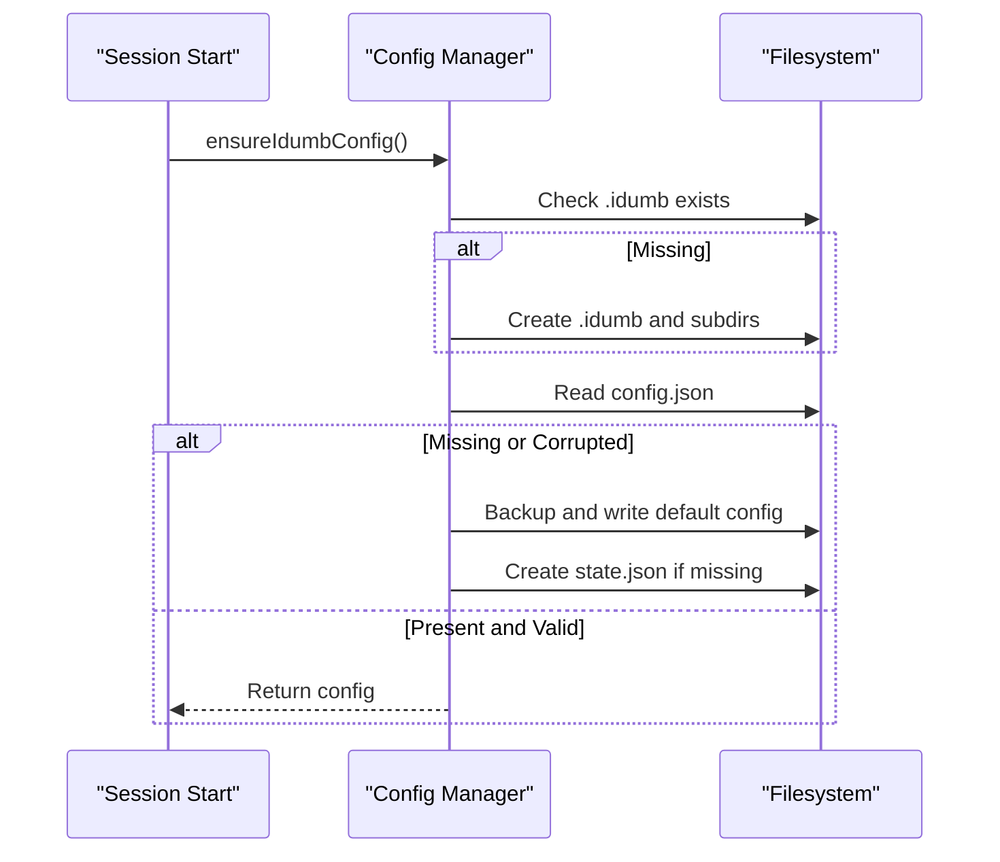
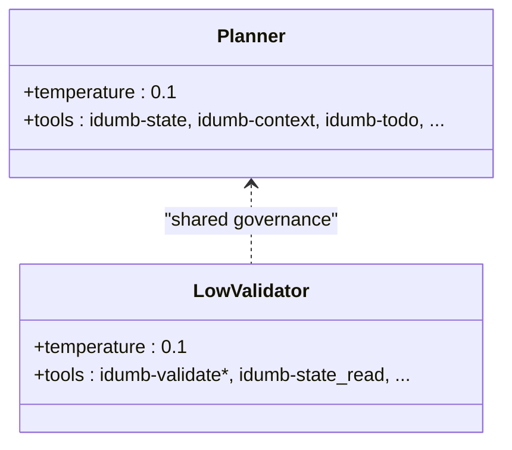
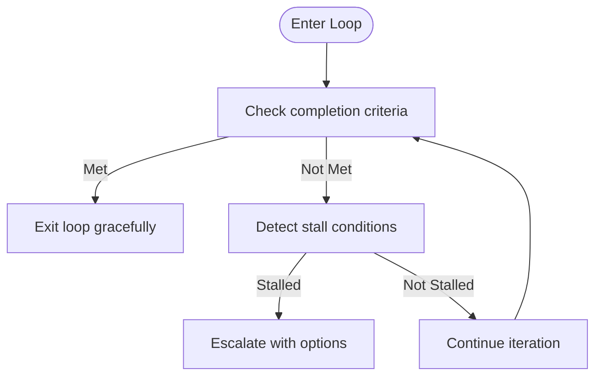
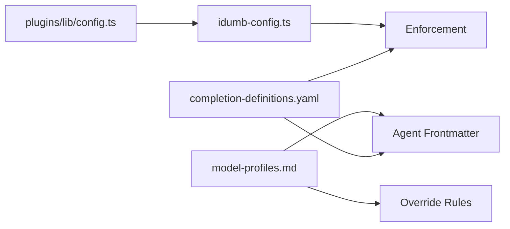

# Model Profiles

<cite>
**Referenced Files in This Document**
- [model-profiles.md](file://src/references/model-profiles.md)
- [completion-definitions.yaml](file://src/config/completion-definitions.yaml)
- [idumb-config.ts](file://src/tools/idumb-config.ts)
- [config.ts](file://src/plugins/lib/config.ts)
- [idumb-supreme-coordinator.md](file://src/agents/idumb-supreme-coordinator.md)
- [idumb-planner.md](file://src/agents/idumb-planner.md)
- [idumb-low-validator.md](file://src/agents/idumb-low-validator.md)
</cite>

## Table of Contents
1. [Introduction](#introduction)
2. [Project Structure](#project-structure)
3. [Core Components](#core-components)
4. [Architecture Overview](#architecture-overview)
5. [Detailed Component Analysis](#detailed-component-analysis)
6. [Dependency Analysis](#dependency-analysis)
7. [Performance Considerations](#performance-considerations)
8. [Troubleshooting Guide](#troubleshooting-guide)
9. [Conclusion](#conclusion)
10. [Appendices](#appendices)

## Introduction
This document explains iDumb’s model profiles configuration system. It covers how AI model selection is mapped to agent roles, how profiles tune temperature, token budgets, and thinking modes, and how override rules dynamically adjust profiles based on task complexity. It also documents cost/performance trade-offs, integration with the configuration management system, and state persistence mechanisms that ensure reliable model usage across workflows.

## Project Structure
The model profiles system is defined in a dedicated reference and integrated with the broader configuration and agent orchestration layers:
- Model profiles specification and guidelines
- Global configuration management and enforcement
- Agent frontmatter that encodes temperature and tool usage
- Workflow completion definitions that govern loop behavior and stall handling

**Diagram sources**
- [model-profiles.md](file://src/references/model-profiles.md#L1-L178)
- [idumb-config.ts](file://src/tools/idumb-config.ts#L1-L200)
- [config.ts](file://src/plugins/lib/config.ts#L1-L316)
- [idumb-supreme-coordinator.md](file://src/agents/idumb-supreme-coordinator.md#L1-L710)
- [idumb-planner.md](file://src/agents/idumb-planner.md#L1-L689)
- [idumb-low-validator.md](file://src/agents/idumb-low-validator.md#L1-L865)
- [completion-definitions.yaml](file://src/config/completion-definitions.yaml#L1-L990)

**Section sources**
- [model-profiles.md](file://src/references/model-profiles.md#L1-L178)
- [idumb-config.ts](file://src/tools/idumb-config.ts#L1-L200)
- [config.ts](file://src/plugins/lib/config.ts#L1-L316)
- [idumb-supreme-coordinator.md](file://src/agents/idumb-supreme-coordinator.md#L1-L710)
- [idumb-planner.md](file://src/agents/idumb-planner.md#L1-L689)
- [idumb-low-validator.md](file://src/agents/idumb-low-validator.md#L1-L865)
- [completion-definitions.yaml](file://src/config/completion-definitions.yaml#L1-L990)

## Core Components
- Model profiles reference: Defines three tiers (quality, balanced, budget), agent-to-profile mapping, thinking mode guidance, and cost optimization estimates.
- Configuration management: Ensures presence of .idumb/brain/config.json and enforces governance settings; exposes reserved keys that users cannot override.
- Agent frontmatter: Encodes temperature and tool usage that influence model behavior and context consumption.
- Workflow definitions: Define completion-driven loops and stall handling, which indirectly influence model usage patterns and resource allocation.

**Section sources**
- [model-profiles.md](file://src/references/model-profiles.md#L1-L178)
- [idumb-config.ts](file://src/tools/idumb-config.ts#L631-L633)
- [config.ts](file://src/plugins/lib/config.ts#L178-L250)
- [idumb-planner.md](file://src/agents/idumb-planner.md#L7-L35)
- [completion-definitions.yaml](file://src/config/completion-definitions.yaml#L1-L990)

## Architecture Overview
The model profiles system is layered:
- Policy layer: model-profiles.md defines mapping and rules.
- Configuration layer: idumb-config.ts and plugins/lib/config.ts manage persistent state and enforcement.
- Agent layer: agent frontmatter sets baseline temperature and tool usage.
- Workflow layer: completion-definitions.yaml governs loop exits and stall handling, which shape model usage cadence.

**Diagram sources**
- [idumb-supreme-coordinator.md](file://src/agents/idumb-supreme-coordinator.md#L269-L468)
- [idumb-planner.md](file://src/agents/idumb-planner.md#L434-L569)
- [idumb-config.ts](file://src/tools/idumb-config.ts#L605-L633)
- [completion-definitions.yaml](file://src/config/completion-definitions.yaml#L200-L377)

## Detailed Component Analysis

### Model Profiles Reference
- Profile tiers:
  - Quality: best models with extended thinking for synthesis and deep analysis.
  - Balanced: default quality with moderate temperature and thinking disabled.
  - Budget: fast, cheap models for simple validations and navigation.
- Agent-to-profile mapping: Guides which profile to use per agent role.
- Override rules: Automatically upgrade or downgrade based on task complexity signals.
- Thinking mode guidelines: Specifies when extended thinking is beneficial versus unnecessary.
- Cost optimization: Provides per-profile cost estimates and strategies.

**Diagram sources**
- [model-profiles.md](file://src/references/model-profiles.md#L95-L123)

**Section sources**
- [model-profiles.md](file://src/references/model-profiles.md#L8-L178)

### Configuration Management and State Persistence
- Ensures .idumb/brain/config.json exists and auto-generates defaults if missing.
- Enforces governance settings at session start and auto-creates state.json when required.
- Reserved keys are protected to prevent user overrides that could break model behavior.

**Diagram sources**
- [config.ts](file://src/plugins/lib/config.ts#L178-L250)

**Section sources**
- [config.ts](file://src/plugins/lib/config.ts#L178-L250)
- [idumb-config.ts](file://src/tools/idumb-config.ts#L605-L633)

### Agent Frontmatter and Temperature Settings
- Agents encode baseline temperature and tool usage in their frontmatter.
- Planner uses a lower temperature for structured reasoning and plan creation.
- Low-validator uses a conservative temperature for read-only checks.

**Diagram sources**
- [idumb-planner.md](file://src/agents/idumb-planner.md#L7-L35)
- [idumb-low-validator.md](file://src/agents/idumb-low-validator.md#L7-L44)

**Section sources**
- [idumb-planner.md](file://src/agents/idumb-planner.md#L7-L35)
- [idumb-low-validator.md](file://src/agents/idumb-low-validator.md#L7-L44)

### Workflow Completion and Model Usage Patterns
- Completion-driven loops exit when goals are met, not by arbitrary timers.
- Stall detection escalates to the user with full context, preventing wasted model usage.
- These rules indirectly influence how often and how long models are engaged.

**Diagram sources**
- [completion-definitions.yaml](file://src/config/completion-definitions.yaml#L735-L792)

**Section sources**
- [completion-definitions.yaml](file://src/config/completion-definitions.yaml#L1-L990)

## Dependency Analysis
- Model profiles reference informs agent frontmatter and override rules.
- Configuration management ensures consistent state and prevents conflicting user overrides.
- Workflows define the cadence of model usage and guardrails against excessive consumption.

**Diagram sources**
- [model-profiles.md](file://src/references/model-profiles.md#L1-L178)
- [idumb-config.ts](file://src/tools/idumb-config.ts#L605-L633)
- [config.ts](file://src/plugins/lib/config.ts#L256-L316)
- [completion-definitions.yaml](file://src/config/completion-definitions.yaml#L1-L990)

**Section sources**
- [model-profiles.md](file://src/references/model-profiles.md#L1-L178)
- [idumb-config.ts](file://src/tools/idumb-config.ts#L605-L633)
- [config.ts](file://src/plugins/lib/config.ts#L256-L316)
- [completion-definitions.yaml](file://src/config/completion-definitions.yaml#L1-L990)

## Performance Considerations
- Use budget tier for initial exploration and navigation to minimize token usage.
- Reserve quality tier for synthesis, planning, and deep analysis requiring extended thinking.
- Batch similar operations and progressively disclose context to reduce peak token consumption.
- Monitor drift and staleness to avoid redundant model calls due to outdated artifacts.

[No sources needed since this section provides general guidance]

## Troubleshooting Guide
- If model usage seems inconsistent, verify enforcement settings and reserved keys protection.
- If workflows stall frequently, review stall detection and escalation options in workflow definitions.
- If state drift is suspected, use drift detection and staleness thresholds to identify and resolve inconsistencies.

**Section sources**
- [idumb-config.ts](file://src/tools/idumb-config.ts#L605-L633)
- [completion-definitions.yaml](file://src/config/completion-definitions.yaml#L735-L792)
- [config.ts](file://src/plugins/lib/config.ts#L256-L316)

## Conclusion
iDumb’s model profiles system balances quality, speed, and cost by aligning agent roles with appropriate profiles, enabling dynamic overrides based on task complexity, and integrating with robust configuration and workflow governance. By leveraging reserved keys, enforcement, and completion-driven loops, the system ensures predictable, efficient, and safe model usage across diverse workflows.

[No sources needed since this section summarizes without analyzing specific files]

## Appendices

### Practical Examples
- Optimize for research: Start with budget for codebase exploration, then switch to quality for synthesis.
- Tune for planning: Use quality profile with extended thinking for roadmap and plan creation.
- Validate efficiently: Use budget for read-only checks; escalate to quality if validation reveals deeper issues.

**Section sources**
- [model-profiles.md](file://src/references/model-profiles.md#L159-L178)
- [idumb-planner.md](file://src/agents/idumb-planner.md#L279-L350)
- [idumb-low-validator.md](file://src/agents/idumb-low-validator.md#L497-L679)

### Implementing Custom Model Profiles
- Define a new profile in the profiles reference with model, temperature, max_tokens, and thinking settings.
- Map agents to the new profile using the agent-to-profile matrix.
- Add override rules for complexity or simplicity triggers as needed.
- Protect any user-facing configuration keys with reserved-key enforcement.

**Section sources**
- [model-profiles.md](file://src/references/model-profiles.md#L46-L123)
- [idumb-config.ts](file://src/tools/idumb-config.ts#L631-L633)
- [config.ts](file://src/plugins/lib/config.ts#L256-L316)