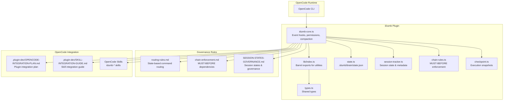
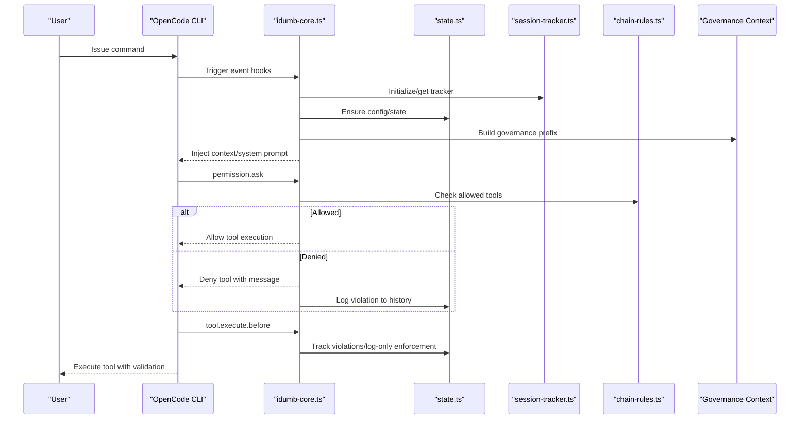
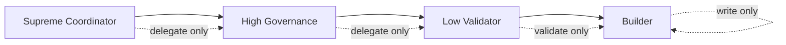
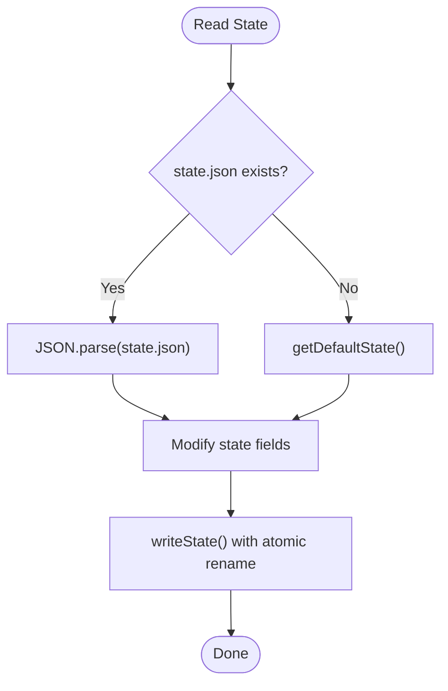
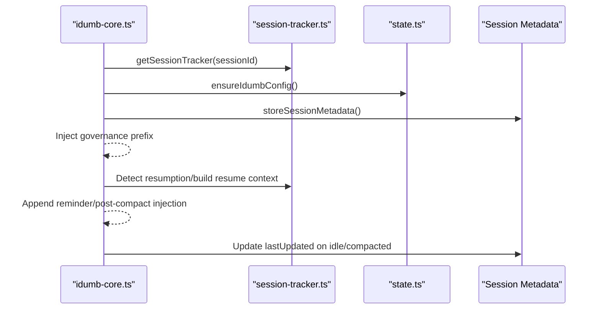
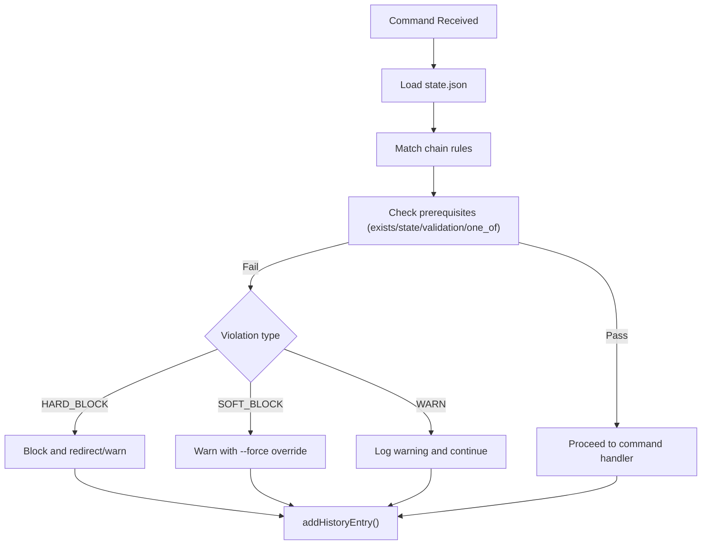
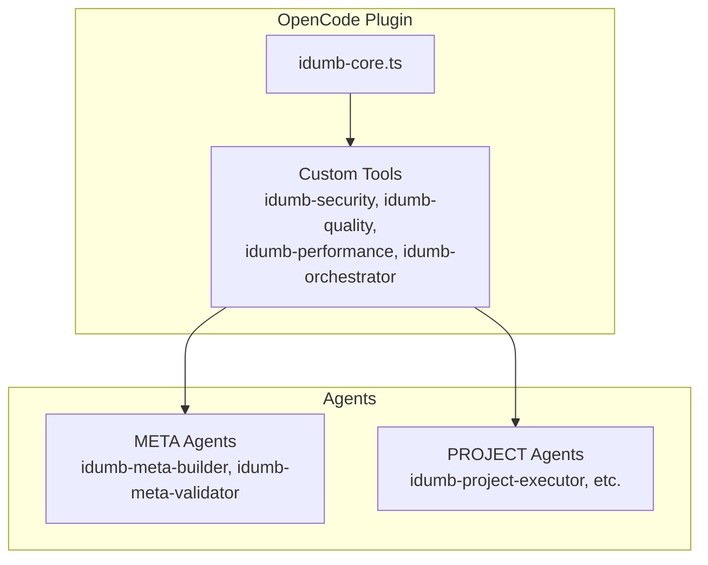
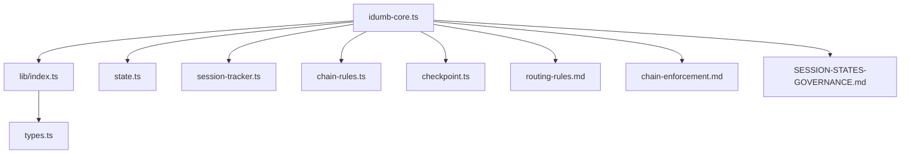

# Framework Overview

<cite>
**Referenced Files in This Document**
- [README.md](file://README.md)
- [AGENTS.md](file://AGENTS.md)
- [src/plugins/idumb-core.ts](file://src/plugins/idumb-core.ts)
- [src/plugins/lib/index.ts](file://src/plugins/lib/index.ts)
- [src/plugins/lib/types.ts](file://src/plugins/lib/types.ts)
- [src/plugins/lib/chain-rules.ts](file://src/plugins/lib/chain-rules.ts)
- [src/plugins/lib/session-tracker.ts](file://src/plugins/lib/session-tracker.ts)
- [src/plugins/lib/state.ts](file://src/plugins/lib/state.ts)
- [src/plugins/lib/checkpoint.ts](file://src/plugins/lib/checkpoint.ts)
- [src/router/routing-rules.md](file://src/router/routing-rules.md)
- [src/router/chain-enforcement.md](file://src/router/chain-enforcement.md)
- [src/router/SESSION-STATES-GOVERNANCE.md](file://src/router/SESSION-STATES-GOVERNANCE.md)
- [.plugin-dev/OPENCODE-INTEGRATION-PLAN.md](file://.plugin-dev/OPENCODE-INTEGRATION-PLAN.md)
- [.plugin-dev/SKILL-INTEGRATION-GUIDE.md](file://.plugin-dev/SKILL-INTEGRATION-GUIDE.md)
- [src/skills/idumb-governance/SKILL.md](file://src/skills/idumb-governance/SKILL.md)
- [src/skills/hierarchical-mindfulness/SKILL.md](file://src/skills/hierarchical-mindfulness/SKILL.md)
</cite>

## Table of Contents
1. [Introduction](#introduction)
2. [Project Structure](#project-structure)
3. [Core Components](#core-components)
4. [Architecture Overview](#architecture-overview)
5. [Detailed Component Analysis](#detailed-component-analysis)
6. [Dependency Analysis](#dependency-analysis)
7. [Performance Considerations](#performance-considerations)
8. [Troubleshooting Guide](#troubleshooting-guide)
9. [Conclusion](#conclusion)
10. [Appendices](#appendices)

## Introduction
iDumb is a hierarchical AI governance framework designed for OpenCode that ensures safe, controlled, and systematic code development through intelligent delegation and permission management. Its core philosophy centers on “Intelligent Delegation Using Managed Boundaries,” enforcing strict governance through a four-tier agent hierarchy, robust state and session management, and a comprehensive permission and chain enforcement system. The framework integrates tightly with OpenCode via a plugin architecture that intercepts session lifecycle events, enforces permissions, tracks governance history, and preserves context across compaction and resumption.

## Project Structure
The repository organizes governance logic, plugin hooks, and OpenCode integration under a clear separation of concerns:
- Core plugin and utilities live under src/plugins/lib and src/plugins/idumb-core.ts
- Governance routing and chain enforcement rules are defined in src/router
- Agent profiles, skills, and orchestration guidance are documented under src/agents, src/skills, and .plugin-dev
- The iDumb runtime state and artifacts are persisted under .idumb

**Diagram sources**
- [src/plugins/idumb-core.ts](file://src/plugins/idumb-core.ts#L1-L1092)
- [src/plugins/lib/index.ts](file://src/plugins/lib/index.ts#L1-L131)
- [src/plugins/lib/types.ts](file://src/plugins/lib/types.ts#L1-L282)
- [src/plugins/lib/state.ts](file://src/plugins/lib/state.ts#L1-L189)
- [src/plugins/lib/session-tracker.ts](file://src/plugins/lib/session-tracker.ts#L1-L385)
- [src/plugins/lib/chain-rules.ts](file://src/plugins/lib/chain-rules.ts#L1-L468)
- [src/plugins/lib/checkpoint.ts](file://src/plugins/lib/checkpoint.ts#L1-L357)
- [src/router/routing-rules.md](file://src/router/routing-rules.md#L1-L186)
- [src/router/chain-enforcement.md](file://src/router/chain-enforcement.md#L1-L257)
- [src/router/SESSION-STATES-GOVERNANCE.md](file://src/router/SESSION-STATES-GOVERNANCE.md#L1-L288)
- [.plugin-dev/OPENCODE-INTEGRATION-PLAN.md](file://.plugin-dev/OPENCODE-INTEGRATION-PLAN.md#L1-L331)
- [.plugin-dev/SKILL-INTEGRATION-GUIDE.md](file://.plugin-dev/SKILL-INTEGRATION-GUIDE.md#L1-L309)

**Section sources**
- [README.md](file://README.md#L1-L93)
- [AGENTS.md](file://AGENTS.md#L1-L368)

## Core Components
- iDumb Core Plugin: Central event hooks for session lifecycle, permission enforcement, compaction, and system prompt transformation. It orchestrates governance injection, violation tracking, and history logging.
- State Management: Atomic read/write of .idumb/brain/state.json with history and anchor tracking, plus style anchor management for output consistency.
- Session Tracker: In-memory session state with metadata persistence, resumption detection, and pending violation tracking.
- Chain Rules: MUST-BEFORE and SHOULD-BEFORE enforcement rules with pattern matching, prerequisite checking, and violation messaging.
- Checkpoint Manager: Execution snapshots with git integration, file change detection, and lifecycle operations.
- Governance Routing: State-based command routing and priority matrices guiding allowed, blocked, and auto-corrected commands.
- OpenCode Integration: Skills and tools for security, quality, performance, and orchestration validation, integrated via plugin hooks and TUI-safe patterns.

**Section sources**
- [src/plugins/idumb-core.ts](file://src/plugins/idumb-core.ts#L1-L1092)
- [src/plugins/lib/state.ts](file://src/plugins/lib/state.ts#L1-L189)
- [src/plugins/lib/session-tracker.ts](file://src/plugins/lib/session-tracker.ts#L1-L385)
- [src/plugins/lib/chain-rules.ts](file://src/plugins/lib/chain-rules.ts#L1-L468)
- [src/plugins/lib/checkpoint.ts](file://src/plugins/lib/checkpoint.ts#L1-L357)
- [src/router/routing-rules.md](file://src/router/routing-rules.md#L1-L186)
- [.plugin-dev/OPENCODE-INTEGRATION-PLAN.md](file://.plugin-dev/OPENCODE-INTEGRATION-PLAN.md#L1-L331)
- [.plugin-dev/SKILL-INTEGRATION-GUIDE.md](file://.plugin-dev/SKILL-INTEGRATION-GUIDE.md#L1-L309)

## Architecture Overview
The iDumb architecture enforces governance through layered hooks and stateful components:
- Event-driven governance: session.created, permission.ask, tool.execute.before, experimental.session.compacting, and event hooks manage lifecycle, permissions, and context preservation.
- Stateful runtime: .idumb/brain/state.json stores governance state, anchors, and history; anchors persist critical decisions across compaction.
- Session-aware orchestration: session-tracker manages session state, metadata, and resumption; governance prefixes and reminders are injected based on session states.
- Chain enforcement: chain-rules enforce MUST-BEFORE dependencies; routing rules govern allowed commands per state; violations are logged and handled according to severity.
- OpenCode integration: skills and tools are exposed via the plugin system, with pre-write validation and TUI-safe patterns.

**Diagram sources**
- [src/plugins/idumb-core.ts](file://src/plugins/idumb-core.ts#L130-L741)
- [src/plugins/lib/state.ts](file://src/plugins/lib/state.ts#L34-L101)
- [src/plugins/lib/session-tracker.ts](file://src/plugins/lib/session-tracker.ts#L97-L165)
- [src/plugins/lib/chain-rules.ts](file://src/plugins/lib/chain-rules.ts#L34-L118)

**Section sources**
- [src/plugins/idumb-core.ts](file://src/plugins/idumb-core.ts#L1-L1092)
- [src/router/SESSION-STATES-GOVERNANCE.md](file://src/router/SESSION-STATES-GOVERNANCE.md#L1-L288)

## Detailed Component Analysis

### Four-Tier Agent Hierarchy
iDumb enforces a strict delegation hierarchy aligned with the “Chain Cannot Break” principle:
- Supreme Coordinator: Orchestrates top-level planning and delegation; never executes.
- High Governance: Validates and orchestrates sub-agents.
- Low Validator: Read-only verification (grep, glob, tests).
- Builder: The ONLY agent that can write files.

**Diagram sources**
- [AGENTS.md](file://AGENTS.md#L116-L134)
- [src/router/chain-enforcement.md](file://src/router/chain-enforcement.md#L120-L160)

**Section sources**
- [AGENTS.md](file://AGENTS.md#L116-L134)
- [src/router/chain-enforcement.md](file://src/router/chain-enforcement.md#L120-L160)

### State Management System
- Atomic state persistence: readState/writeState with temporary file and rename for atomicity.
- History tracking: bounded history entries with timestamped actions.
- Anchor management: persistent anchors for decisions, context, and checkpoints; style anchors for output consistency.
- Default state factory: initializes versioned state with framework, phase, and governance counters.

**Diagram sources**
- [src/plugins/lib/state.ts](file://src/plugins/lib/state.ts#L34-L101)

**Section sources**
- [src/plugins/lib/state.ts](file://src/plugins/lib/state.ts#L1-L189)

### Session Tracking and Context Preservation
- Session lifecycle: created, idle, compacted, resumed, error events are handled with metadata updates and history logging.
- Governance injection: on session start or post-compaction, governance prefixes and reminders are injected; resumption prepends resume context.
- Session metadata: stores phase, governance level, language preferences, and timestamps; supports cleanup of stale sessions.

**Diagram sources**
- [src/plugins/idumb-core.ts](file://src/plugins/idumb-core.ts#L138-L341)
- [src/plugins/lib/session-tracker.ts](file://src/plugins/lib/session-tracker.ts#L204-L259)

**Section sources**
- [src/plugins/idumb-core.ts](file://src/plugins/idumb-core.ts#L138-L341)
- [src/plugins/lib/session-tracker.ts](file://src/plugins/lib/session-tracker.ts#L1-L385)
- [src/router/SESSION-STATES-GOVERNANCE.md](file://src/router/SESSION-STATES-GOVERNANCE.md#L1-L288)

### Permission Enforcement and Chain Rules
- Permission enforcement: permission.ask intercepts tool execution; allowed tools are determined by agent role; configurable blocking behavior; violations logged to history.
- Chain enforcement: MUST-BEFORE dependencies enforced via chain-rules; supports wildcard commands, placeholders, and one_of alternatives; violation handling includes HARD_BLOCK, SOFT_BLOCK, and WARN.
- Routing rules: state-based command routing with auto-corrections and priority matrices.

**Diagram sources**
- [src/plugins/lib/chain-rules.ts](file://src/plugins/lib/chain-rules.ts#L34-L118)
- [src/plugins/lib/chain-rules.ts](file://src/plugins/lib/chain-rules.ts#L183-L291)
- [src/router/routing-rules.md](file://src/router/routing-rules.md#L14-L118)

**Section sources**
- [src/plugins/idumb-core.ts](file://src/plugins/idumb-core.ts#L651-L741)
- [src/plugins/lib/chain-rules.ts](file://src/plugins/lib/chain-rules.ts#L1-L468)
- [src/router/chain-enforcement.md](file://src/router/chain-enforcement.md#L1-L257)
- [src/router/routing-rules.md](file://src/router/routing-rules.md#L1-L186)

### OpenCode Plugin Integration and Skills
- Plugin structure: idumb-core.ts exposes hooks for tool execution, session compaction, and event bus; tools and skills are integrated via the OpenCode plugin system.
- Skills integration: security, quality, performance, and orchestrator skills are available as tools; pre-write validation is integrated into write operations; TUI-safe patterns are enforced.
- Agent integration: META agents (idumb-meta-builder, idumb-meta-validator) and PROJECT agents leverage skills for validation and governance.

**Diagram sources**
- [.plugin-dev/OPENCODE-INTEGRATION-PLAN.md](file://.plugin-dev/OPENCODE-INTEGRATION-PLAN.md#L19-L63)
- [.plugin-dev/SKILL-INTEGRATION-GUIDE.md](file://.plugin-dev/SKILL-INTEGRATION-GUIDE.md#L17-L47)

**Section sources**
- [.plugin-dev/OPENCODE-INTEGRATION-PLAN.md](file://.plugin-dev/OPENCODE-INTEGRATION-PLAN.md#L1-L331)
- [.plugin-dev/SKILL-INTEGRATION-GUIDE.md](file://.plugin-dev/SKILL-INTEGRATION-GUIDE.md#L1-L309)
- [src/skills/idumb-governance/SKILL.md](file://src/skills/idumb-governance/SKILL.md#L1-L343)
- [src/skills/hierarchical-mindfulness/SKILL.md](file://src/skills/hierarchical-mindfulness/SKILL.md#L1-L357)

## Dependency Analysis
The core plugin depends on a set of cohesive utilities that encapsulate governance logic. The barrel export simplifies imports and reduces coupling.

**Diagram sources**
- [src/plugins/idumb-core.ts](file://src/plugins/idumb-core.ts#L19-L108)
- [src/plugins/lib/index.ts](file://src/plugins/lib/index.ts#L1-L131)

**Section sources**
- [src/plugins/lib/index.ts](file://src/plugins/lib/index.ts#L1-L131)
- [src/plugins/idumb-core.ts](file://src/plugins/idumb-core.ts#L1-L1092)

## Performance Considerations
- Memory management: session cleanup with TTL and LRU eviction to prevent memory leaks.
- Atomic state writes: minimize corruption risk and ensure consistent governance state.
- Async operations: skills and tools follow TUI-safe patterns to avoid blocking UI rendering.
- Context preservation: style anchors and anchors are injected conservatively to avoid exceeding compaction budgets.

[No sources needed since this section provides general guidance]

## Troubleshooting Guide
- Permission denials: review pending denials and violations; adjust agent permissions or tool usage; use guidance messages to satisfy prerequisites.
- Chain violations: consult chain-enforcement rules and buildChainBlockMessage/buildChainWarnMessage for corrective actions.
- Session resumption: verify metadata and active anchors; rebuild context if needed; confirm governance level and phase alignment.
- State corruption: rely on history entries and checkpoints; recreate state if necessary and preserve anchors.

**Section sources**
- [src/plugins/idumb-core.ts](file://src/plugins/idumb-core.ts#L651-L741)
- [src/plugins/lib/chain-rules.ts](file://src/plugins/lib/chain-rules.ts#L374-L467)
- [src/plugins/lib/session-tracker.ts](file://src/plugins/lib/session-tracker.ts#L269-L332)
- [src/plugins/lib/state.ts](file://src/plugins/lib/state.ts#L79-L101)

## Conclusion
iDumb’s hierarchical governance architecture ensures safe, controlled AI-assisted code development by enforcing strict delegation, managing state and sessions, and applying robust permission and chain enforcement. Its integration with OpenCode via a plugin system provides seamless validation, context preservation, and traceability across the development lifecycle. The framework’s emphasis on mindful delegation, session-awareness, and governance integrity makes it a reliable foundation for systematic, auditable code development.

## Appendices
- Governance philosophy and best practices: context-first, expert-skeptic mode, evidence-based results, and anchoring critical decisions.
- Hierarchical mindfulness: session state awareness, delegation depth tracking, and chain enforcement protocols.

**Section sources**
- [src/skills/idumb-governance/SKILL.md](file://src/skills/idumb-governance/SKILL.md#L15-L343)
- [src/skills/hierarchical-mindfulness/SKILL.md](file://src/skills/hierarchical-mindfulness/SKILL.md#L21-L357)