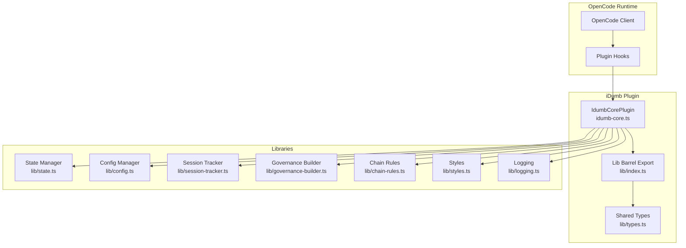
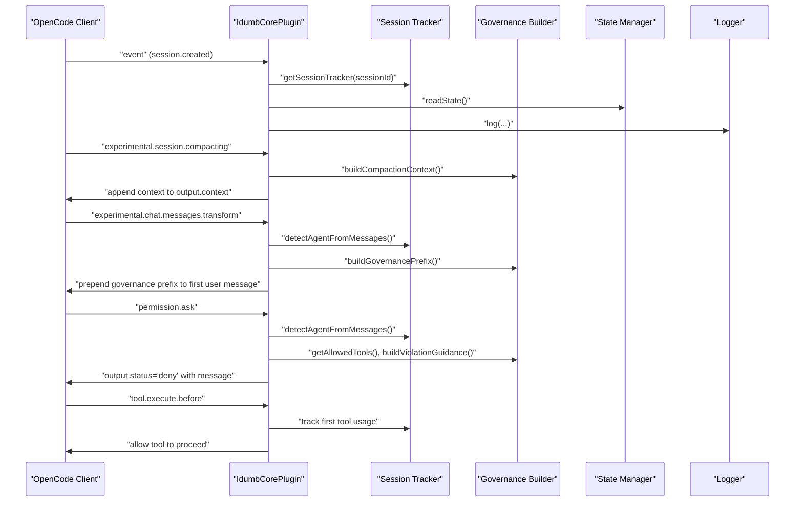
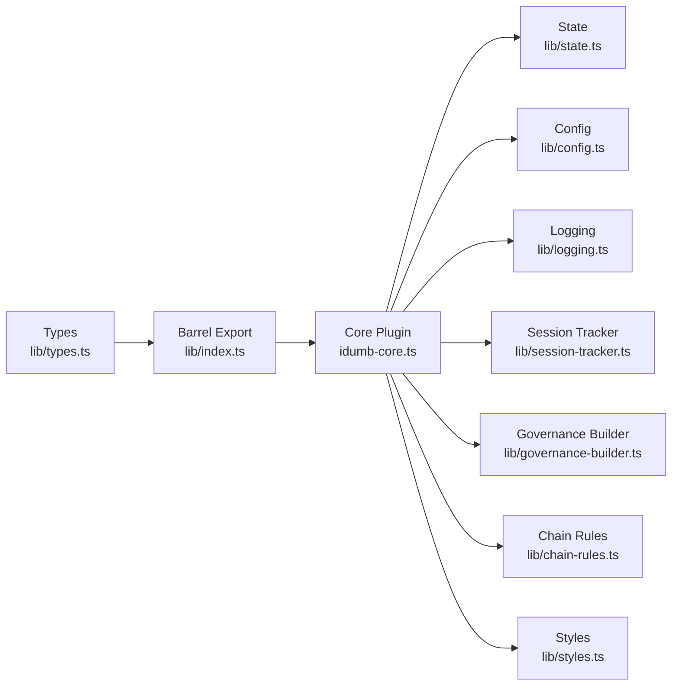

# OpenCode Plugin Integration

<cite>
**Referenced Files in This Document**
- [package.json](file://.opencode/package.json)
- [opencode.d.ts](file://src/types/opencode.d.ts)
- [idumb-core.ts](file://src/plugins/idumb-core.ts)
- [index.ts](file://src/plugins/lib/index.ts)
- [types.ts](file://src/plugins/lib/types.ts)
- [session-tracker.ts](file://src/plugins/lib/session-tracker.ts)
- [governance-builder.ts](file://src/plugins/lib/governance-builder.ts)
- [logging.ts](file://src/plugins/lib/logging.ts)
- [state.ts](file://src/plugins/lib/state.ts)
- [config.ts](file://src/plugins/lib/config.ts)
- [chain-rules.ts](file://src/plugins/lib/chain-rules.ts)
- [styles.ts](file://src/plugins/lib/styles.ts)
- [SESSION-STATES-GOVERNANCE.md](file://.opencode/router/SESSION-STATES-GOVERNANCE.md)
</cite>

## Table of Contents
1. [Introduction](#introduction)
2. [Project Structure](#project-structure)
3. [Core Components](#core-components)
4. [Architecture Overview](#architecture-overview)
5. [Detailed Component Analysis](#detailed-component-analysis)
6. [Dependency Analysis](#dependency-analysis)
7. [Performance Considerations](#performance-considerations)
8. [Troubleshooting Guide](#troubleshooting-guide)
9. [Conclusion](#conclusion)

## Introduction
This document explains the OpenCode plugin integration architecture used by iDumb. It details how iDumb integrates with the OpenCode ecosystem through plugin hooks, session lifecycle management, agent permission enforcement, and governance-aware message transformations. It also covers logging and governance builder integration patterns, bidirectional communication between iDumb and OpenCode, and security considerations that maintain governance boundaries.

## Project Structure
The integration centers around a core plugin that registers OpenCode plugin hooks and orchestrates governance, session tracking, and enforcement. Supporting libraries encapsulate state, configuration, logging, session metadata, governance building, chain rules, and style management.

**Diagram sources**
- [idumb-core.ts](file://src/plugins/idumb-core.ts#L130-L440)
- [index.ts](file://src/plugins/lib/index.ts#L1-L131)
- [types.ts](file://src/plugins/lib/types.ts#L1-L282)

**Section sources**
- [idumb-core.ts](file://src/plugins/idumb-core.ts#L1-L120)
- [index.ts](file://src/plugins/lib/index.ts#L1-L131)

## Core Components
- OpenCode plugin types and client contract: Extended TypeScript declarations for OpenCode’s plugin SDK, including plugin hooks, tool context, and client APIs.
- Core plugin: Registers and implements OpenCode plugin hooks for session lifecycle, compaction, system prompt transformation, message transformation, permission interception, and tool execution interception.
- Governance builder: Constructs governance prefixes, permission matrices, and post-compaction reminders.
- Session tracker: Manages in-memory session state, metadata persistence, resumption detection, and pending denials/violations.
- State and config: Read/write state and ensure presence of configuration with enforcement validation.
- Logging: File-based logging with rotation to avoid exposing logs in the TUI.
- Chain rules: Enforces command dependencies and builds guidance for prerequisites.
- Styles: Loads and caches output styles for consistent agent behavior.

**Section sources**
- [opencode.d.ts](file://src/types/opencode.d.ts#L10-L100)
- [idumb-core.ts](file://src/plugins/idumb-core.ts#L130-L741)
- [governance-builder.ts](file://src/plugins/lib/governance-builder.ts#L17-L139)
- [session-tracker.ts](file://src/plugins/lib/session-tracker.ts#L94-L117)
- [state.ts](file://src/plugins/lib/state.ts#L34-L73)
- [config.ts](file://src/plugins/lib/config.ts#L178-L250)
- [logging.ts](file://src/plugins/lib/logging.ts#L89-L117)
- [chain-rules.ts](file://src/plugins/lib/chain-rules.ts#L34-L118)
- [styles.ts](file://src/plugins/lib/styles.ts#L145-L165)

## Architecture Overview
The iDumb plugin integrates with OpenCode via a set of plugin hooks. The core plugin listens to OpenCode events and transforms messages and tool execution to enforce governance, manage sessions, and preserve context across compaction.

**Diagram sources**
- [idumb-core.ts](file://src/plugins/idumb-core.ts#L138-L378)
- [session-tracker.ts](file://src/plugins/lib/session-tracker.ts#L174-L194)
- [governance-builder.ts](file://src/plugins/lib/governance-builder.ts#L200-L346)
- [logging.ts](file://src/plugins/lib/logging.ts#L89-L117)

## Detailed Component Analysis

### OpenCode Plugin Types and Client Contract
- Plugin context and client expose session APIs (create, chat, prompt, todo, share, revert, summarize, messages), plus app logging.
- Plugin hooks include event, stop, experimental.session.compacting, tool.execute.before, tool.execute.after, and permission.ask.
- Tool context provides agent, sessionID, messageID, directory, and worktree.

**Section sources**
- [opencode.d.ts](file://src/types/opencode.d.ts#L57-L100)

### Core Plugin: Session Lifecycle and Governance Injection
- Session created: Initializes tracker, ensures config, stores metadata, initializes execution metrics and stall detection, sets active style, cleans stale sessions, validates enforcement settings.
- Permission replied: Logs and records denials/allowances in history.
- Session idle: Archives stats, updates metadata, cleans tracker while preserving metadata for resumption.
- Session compacted: Resets governance injection flag, updates metadata, logs compaction.
- Command executed: Tracks iDumb commands and clears style cache on style command.
- Session resumed: Reinitializes tracker and restores metadata.
- Error handling: Records errors in history and tracks in execution metrics.

**Section sources**
- [idumb-core.ts](file://src/plugins/idumb-core.ts#L138-L336)

### Compaction Hook and System Prompt Transformation
- Compaction hook: Builds governance context and appends it to output.context; preserves active style within budget.
- System transform: Injects output style instructions into the system prompt if a style is active and not already injected.

**Section sources**
- [idumb-core.ts](file://src/plugins/idumb-core.ts#L347-L440)

### Message Transformation: Session Start and Post-Compaction Recovery
- Session start detection: Identifies first user message and injects governance prefix built from agent role, config, and state.
- Post-compaction recovery: Detects compaction indicators and context loss; injects a reminder with recent actions, critical anchors, and next steps.
- Resumption handling: Prepends resume context before governance prefix when a session is resumed.

**Section sources**
- [idumb-core.ts](file://src/plugins/idumb-core.ts#L446-L645)
- [SESSION-STATES-GOVERNANCE.md](file://.opencode/router/SESSION-STATES-GOVERNANCE.md#L61-L176)

### Permission Interception: Tool Access Control
- permission.ask: Determines allowed tools per agent role, enforces configuration-driven blocking behavior, and records pending denials/violations. Denials are tracked for history and pattern analysis.

**Section sources**
- [idumb-core.ts](file://src/plugins/idumb-core.ts#L651-L741)
- [governance-builder.ts](file://src/plugins/lib/governance-builder.ts#L21-L139)

### Tool Execution Interception: First Tool Enforcement and File Modification Logging
- First tool enforcement: Logs warnings if the first tool used by an agent is not among required first tools; does not block.
- File modification logging: Logs warnings for edit/write operations by non-builder agents (except idumb-builder); does not block.

**Section sources**
- [idumb-core.ts](file://src/plugins/idumb-core.ts#L752-L800)

### Governance Builder Integration Patterns
- Allowed tools matrix: Defines tool permissions per agent category (META vs PROJECT) and role.
- Required first tools: Enforces initial tool usage per role.
- Governance prefix: Builds role-specific instructions, language enforcement, pending tasks, and stale state warnings.
- Post-compaction reminder: Recovers context after compaction with recent actions, critical anchors, and next steps.
- Compaction context: Provides governance context that survives compaction.

**Section sources**
- [governance-builder.ts](file://src/plugins/lib/governance-builder.ts#L17-L139)
- [governance-builder.ts](file://src/plugins/lib/governance-builder.ts#L200-L346)
- [governance-builder.ts](file://src/plugins/lib/governance-builder.ts#L466-L576)
- [governance-builder.ts](file://src/plugins/lib/governance-builder.ts#L581-L634)

### Session Management Integration
- In-memory tracker: Maintains per-session state including first tool usage, agent role, violation counts, governance injection flag, and style cache.
- Metadata persistence: Stores and loads session metadata with timestamps and phase info; supports resumption detection.
- Cleanup: Periodic cleanup of stale sessions and LRU eviction to cap memory usage.
- Resumption context: Builds resume context including idle duration, previous session timestamps, and active anchors.

**Section sources**
- [session-tracker.ts](file://src/plugins/lib/session-tracker.ts#L94-L117)
- [session-tracker.ts](file://src/plugins/lib/session-tracker.ts#L204-L259)
- [session-tracker.ts](file://src/plugins/lib/session-tracker.ts#L269-L280)
- [session-tracker.ts](file://src/plugins/lib/session-tracker.ts#L286-L332)
- [session-tracker.ts](file://src/plugins/lib/session-tracker.ts#L54-L88)

### Logging and Governance Builder Integration
- File-based logging with rotation prevents unbounded growth and avoids TUI exposure.
- Governance builder and core plugin use logging for audit trails, warnings, and informational messages.

**Section sources**
- [logging.ts](file://src/plugins/lib/logging.ts#L36-L79)
- [logging.ts](file://src/plugins/lib/logging.ts#L89-L117)
- [governance-builder.ts](file://src/plugins/lib/governance-builder.ts#L366-L379)

### Bidirectional Communication Patterns
- OpenCode to iDumb: Emits events (session lifecycle), permission replies, and tool execution lifecycle. iDumb responds by transforming messages, enforcing permissions, and injecting governance context.
- iDumb to OpenCode: Modifies output context during compaction, injects system prompt instructions, and sets permission outcomes (allow/deny) and message governance prefixes.

**Section sources**
- [idumb-core.ts](file://src/plugins/idumb-core.ts#L138-L378)
- [idumb-core.ts](file://src/plugins/idumb-core.ts#L446-L645)
- [idumb-core.ts](file://src/plugins/idumb-core.ts#L651-L741)

### Plugin Security Considerations and Governance Boundaries
- Scope-based permissions: META agents operate within .idumb/ and .opencode/; PROJECT agents operate on user code outside those directories.
- First tool enforcement: Ensures agents read state/config before acting.
- Permission interception: Blocks or warns based on agent role and configuration; denies escalate to higher governance tiers.
- Non-blocking logging: Violations are tracked without halting workflows unless explicitly configured.
- Language enforcement: Absolute priority that survives compaction.
- Session resumption: Preserves critical anchors and context to reduce drift.

**Section sources**
- [SESSION-STATES-GOVERNANCE.md](file://.opencode/router/SESSION-STATES-GOVERNANCE.md#L18-L56)
- [governance-builder.ts](file://src/plugins/lib/governance-builder.ts#L21-L139)
- [governance-builder.ts](file://src/plugins/lib/governance-builder.ts#L217-L232)
- [session-tracker.ts](file://src/plugins/lib/session-tracker.ts#L269-L280)

## Dependency Analysis
The core plugin depends on shared types and a barrel export for convenient imports. Libraries encapsulate state, config, logging, session tracking, governance building, chain rules, and styles.

**Diagram sources**
- [index.ts](file://src/plugins/lib/index.ts#L1-L131)
- [idumb-core.ts](file://src/plugins/idumb-core.ts#L19-L108)

**Section sources**
- [index.ts](file://src/plugins/lib/index.ts#L1-L131)
- [idumb-core.ts](file://src/plugins/idumb-core.ts#L19-L108)

## Performance Considerations
- In-memory session tracking: Efficient per-session state management with periodic cleanup and LRU eviction to cap memory usage.
- Atomic state writes: Uses temporary file then rename to prevent corruption and ensure durability.
- Log rotation: Prevents unbounded log growth and reduces I/O overhead.
- Style caching: Caches parsed style content in memory to avoid repeated file reads.
- Minimal modifications: Interceptors observe and track rather than altering tool outputs, reducing overhead.

[No sources needed since this section provides general guidance]

## Troubleshooting Guide
- Permission denied: Check agent role, allowed tools, and configuration enforcement settings. Review pending denials and violations recorded in history.
- Session not resuming: Verify metadata exists and idle duration falls within resumption window. Confirm governance injection flag reset on resume.
- Compaction issues: Ensure compaction context is injected and language enforcement persists. Review post-compaction reminder presence.
- Excessive logs: Confirm log rotation is functioning and log size thresholds are met.

**Section sources**
- [idumb-core.ts](file://src/plugins/idumb-core.ts#L651-L741)
- [session-tracker.ts](file://src/plugins/lib/session-tracker.ts#L269-L280)
- [logging.ts](file://src/plugins/lib/logging.ts#L36-L79)

## Conclusion
The iDumb OpenCode plugin integration leverages a robust set of hooks to govern agent behavior, manage sessions, and preserve context across compaction. Through a combination of in-memory session tracking, configuration-driven enforcement, and governance-aware message transformations, iDumb maintains strong governance boundaries while enabling flexible, bidirectional communication with OpenCode.