# State Management

<cite>
**Referenced Files in This Document**
- [src/plugins/lib/state.ts](file://src/plugins/lib/state.ts)
- [src/plugins/lib/checkpoint.ts](file://src/plugins/lib/checkpoint.ts)
- [src/plugins/lib/session-tracker.ts](file://src/plugins/lib/session-tracker.ts)
- [src/plugins/lib/governance-builder.ts](file://src/plugins/lib/governance-builder.ts)
- [src/plugins/lib/schema-validator.ts](file://src/plugins/lib/schema-validator.ts)
- [src/plugins/lib/types.ts](file://src/plugins/lib/types.ts)
- [src/plugins/lib/index.ts](file://src/plugins/lib/index.ts)
- [src/plugins/idumb-core.ts](file://src/plugins/idumb-core.ts)
- [src/tools/idumb-state.ts](file://src/tools/idumb-state.ts)
- [src/tools/idumb-context.ts](file://src/tools/idumb-context.ts)
- [src/tools/idumb-config.ts](file://src/tools/idumb-config.ts)
- [src/schemas/brain-state-schema.json](file://src/schemas/brain-state-schema.json)
- [src/schemas/checkpoint-schema.json](file://src/schemas/checkpoint-schema.json)
- [src/workflows/transition.md](file://src/workflows/transition.md)
</cite>

## Table of Contents
1. [Introduction](#introduction)
2. [Project Structure](#project-structure)
3. [Core Components](#core-components)
4. [Architecture Overview](#architecture-overview)
5. [Detailed Component Analysis](#detailed-component-analysis)
6. [Dependency Analysis](#dependency-analysis)
7. [Performance Considerations](#performance-considerations)
8. [Troubleshooting Guide](#troubleshooting-guide)
9. [Conclusion](#conclusion)
10. [Appendices](#appendices)

## Introduction
This document explains the state management system that serves as the single source of truth for governance in the iDumb framework. It covers how the IdumbState architecture persists governance context, how checkpoints capture execution snapshots, how session metadata supports resumption, and how context preservation ensures continuity across compaction. It also documents validation processes, schema enforcement, state update mechanisms, and recovery procedures for corrupted or inconsistent state data.

## Project Structure
The state management system spans several modules:
- Core state persistence and history in the state library
- Checkpoint management for execution snapshots
- Session tracking for runtime metadata and resumption
- Governance building for context and reminders
- Schema validation for state and checkpoints
- Tools for state inspection and updates
- Workflows orchestrating transitions and archival

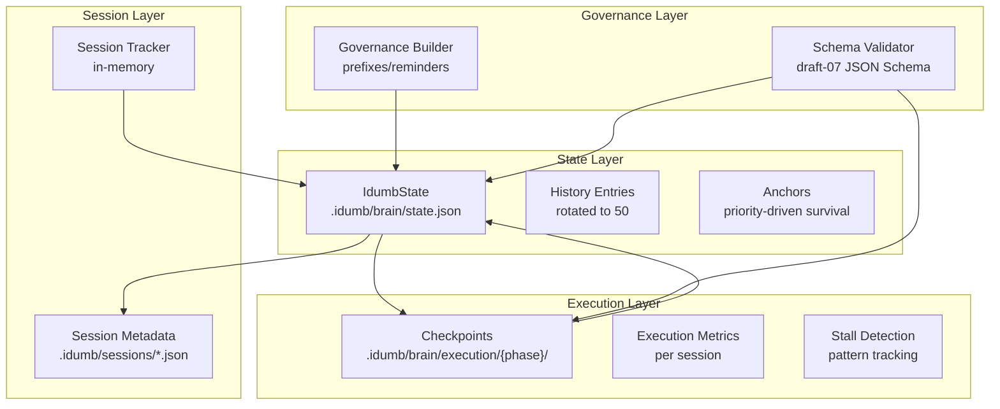

**Diagram sources**
- [src/plugins/lib/state.ts](file://src/plugins/lib/state.ts#L34-L101)
- [src/plugins/lib/checkpoint.ts](file://src/plugins/lib/checkpoint.ts#L123-L204)
- [src/plugins/lib/session-tracker.ts](file://src/plugins/lib/session-tracker.ts#L97-L117)
- [src/plugins/lib/governance-builder.ts](file://src/plugins/lib/governance-builder.ts#L200-L346)
- [src/plugins/lib/schema-validator.ts](file://src/plugins/lib/schema-validator.ts#L162-L262)

**Section sources**
- [src/plugins/lib/state.ts](file://src/plugins/lib/state.ts#L1-L189)
- [src/plugins/lib/checkpoint.ts](file://src/plugins/lib/checkpoint.ts#L1-L357)
- [src/plugins/lib/session-tracker.ts](file://src/plugins/lib/session-tracker.ts#L1-L385)
- [src/plugins/lib/governance-builder.ts](file://src/plugins/lib/governance-builder.ts#L1-L635)
- [src/plugins/lib/schema-validator.ts](file://src/plugins/lib/schema-validator.ts#L1-L285)
- [src/plugins/lib/types.ts](file://src/plugins/lib/types.ts#L1-L282)
- [src/plugins/lib/index.ts](file://src/plugins/lib/index.ts#L1-L131)

## Core Components
- IdumbState: The canonical governance state persisted in .idumb/brain/state.json, containing version, initialization timestamp, active framework, current phase, last validation, validation count, anchors, and history.
- Checkpoint: Execution snapshots capturing git state, file changes, tasks, metrics, and context anchors for recovery.
- Session Tracker: In-memory session state with activity tracking, violation counts, and governance injection flags.
- Governance Builder: Generates governance prefixes, post-compaction reminders, and compaction context to preserve critical instructions and anchors.
- Schema Validator: Validates state and checkpoints against JSON Schema (draft-07) to enforce structure and integrity.
- Tools: idumb-state, idumb-context, and idumb-config provide read/write operations, context classification, and master configuration management.

**Section sources**
- [src/plugins/lib/state.ts](file://src/plugins/lib/state.ts#L34-L188)
- [src/plugins/lib/checkpoint.ts](file://src/plugins/lib/checkpoint.ts#L123-L177)
- [src/plugins/lib/session-tracker.ts](file://src/plugins/lib/session-tracker.ts#L97-L117)
- [src/plugins/lib/governance-builder.ts](file://src/plugins/lib/governance-builder.ts#L200-L634)
- [src/plugins/lib/schema-validator.ts](file://src/plugins/lib/schema-validator.ts#L162-L262)
- [src/tools/idumb-state.ts](file://src/tools/idumb-state.ts#L62-L151)
- [src/tools/idumb-context.ts](file://src/tools/idumb-context.ts#L24-L166)
- [src/tools/idumb-config.ts](file://src/tools/idumb-config.ts#L445-L511)

## Architecture Overview
The state management architecture integrates persistence, validation, governance, and session tracking:

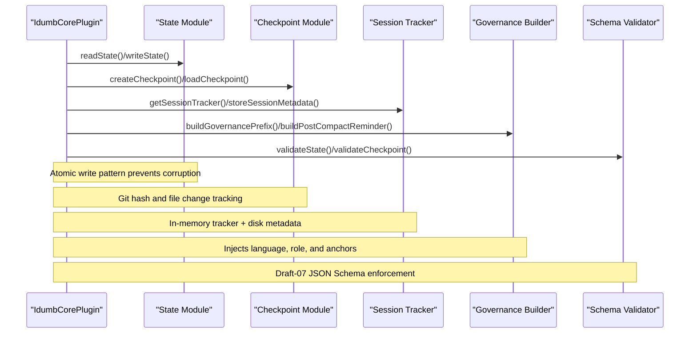

**Diagram sources**
- [src/plugins/idumb-core.ts](file://src/plugins/idumb-core.ts#L138-L341)
- [src/plugins/lib/state.ts](file://src/plugins/lib/state.ts#L51-L73)
- [src/plugins/lib/checkpoint.ts](file://src/plugins/lib/checkpoint.ts#L123-L204)
- [src/plugins/lib/session-tracker.ts](file://src/plugins/lib/session-tracker.ts#L204-L244)
- [src/plugins/lib/governance-builder.ts](file://src/plugins/lib/governance-builder.ts#L200-L346)
- [src/plugins/lib/schema-validator.ts](file://src/plugins/lib/schema-validator.ts#L162-L262)

## Detailed Component Analysis

### IdumbState Persistence and History
- Atomic write pattern: Writes to a temporary file then renames to state.json to prevent corruption.
- History rotation: Maintains a rolling window of up to 50 entries to bound growth.
- Anchor management: Supports style anchors and critical anchors with priority-driven retention during compaction.
- Default state factory: Provides initial structure with version, initialized timestamp, framework, phase, and empty anchors/history.

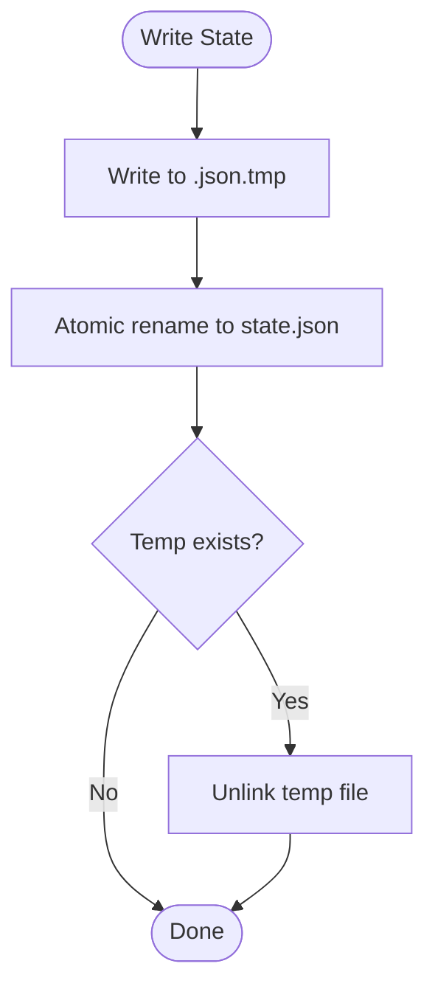

**Diagram sources**
- [src/plugins/lib/state.ts](file://src/plugins/lib/state.ts#L51-L73)

**Section sources**
- [src/plugins/lib/state.ts](file://src/plugins/lib/state.ts#L34-L101)
- [src/plugins/lib/state.ts](file://src/plugins/lib/state.ts#L174-L188)

### Checkpoint System
- Creation: Captures git hash, file changes, tasks, metrics, and context anchors; writes to .idumb/brain/execution/{phase}/ with unique IDs.
- Loading: Validates checkpoint age and marks as stale if older than 48 hours.
- Listing and retrieval: Lists checkpoints per phase and retrieves latest valid or most recent.
- Maintenance: Supports marking as corrupted and deletion with history logging.

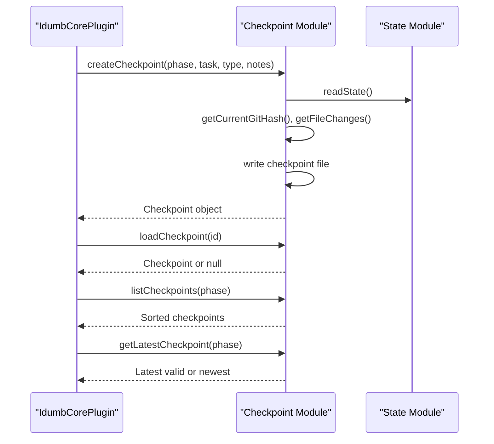

**Diagram sources**
- [src/plugins/lib/checkpoint.ts](file://src/plugins/lib/checkpoint.ts#L123-L204)
- [src/plugins/lib/checkpoint.ts](file://src/plugins/lib/checkpoint.ts#L209-L241)
- [src/plugins/lib/checkpoint.ts](file://src/plugins/lib/checkpoint.ts#L246-L292)

**Section sources**
- [src/plugins/lib/checkpoint.ts](file://src/plugins/lib/checkpoint.ts#L123-L204)
- [src/plugins/lib/checkpoint.ts](file://src/plugins/lib/checkpoint.ts#L209-L292)

### Session Tracking and Resumption
- In-memory session tracker: Tracks first tool usage, agent role, violation counts, governance injection flag, and activity timestamps.
- Metadata persistence: Stores session metadata in .idumb/sessions/*.json with creation, last update, phase, and language settings.
- Resumption detection: Determines if a session was idle for 1–48 hours and builds resume context including active anchors and phase.
- Pending denials and violations: Queues permission denials and validation results for output replacement.

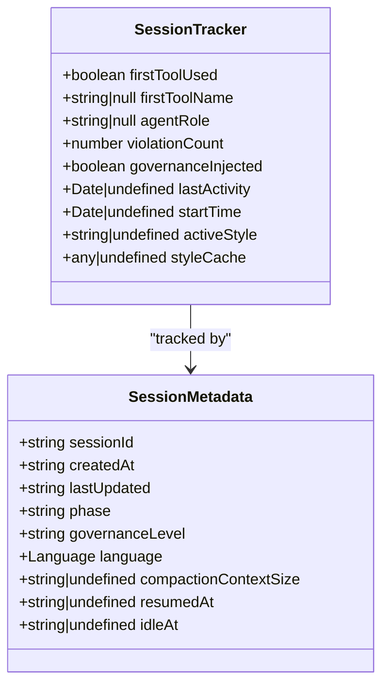

**Diagram sources**
- [src/plugins/lib/types.ts](file://src/plugins/lib/types.ts#L213-L245)
- [src/plugins/lib/session-tracker.ts](file://src/plugins/lib/session-tracker.ts#L97-L117)
- [src/plugins/lib/session-tracker.ts](file://src/plugins/lib/session-tracker.ts#L230-L244)

**Section sources**
- [src/plugins/lib/session-tracker.ts](file://src/plugins/lib/session-tracker.ts#L34-L117)
- [src/plugins/lib/session-tracker.ts](file://src/plugins/lib/session-tracker.ts#L204-L244)
- [src/plugins/lib/session-tracker.ts](file://src/plugins/lib/session-tracker.ts#L269-L332)

### Governance Context Preservation
- Governance prefix: Injects language enforcement, stale state warnings, pending tasks, and role-specific first-action requirements at session start or resumption.
- Post-compaction reminder: Re-injects critical anchors and recent actions after context truncation or compaction.
- Compaction context: Builds a concise context block for injection during experimental session compaction.

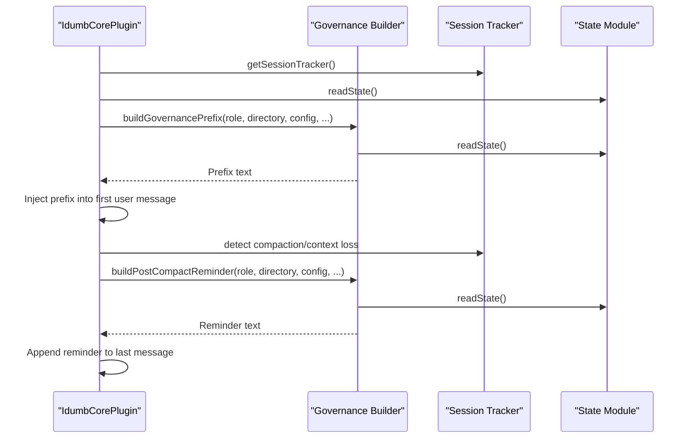

**Diagram sources**
- [src/plugins/lib/governance-builder.ts](file://src/plugins/lib/governance-builder.ts#L200-L346)
- [src/plugins/lib/governance-builder.ts](file://src/plugins/lib/governance-builder.ts#L466-L576)
- [src/plugins/lib/governance-builder.ts](file://src/plugins/lib/governance-builder.ts#L581-L634)

**Section sources**
- [src/plugins/lib/governance-builder.ts](file://src/plugins/lib/governance-builder.ts#L200-L346)
- [src/plugins/lib/governance-builder.ts](file://src/plugins/lib/governance-builder.ts#L466-L576)
- [src/plugins/lib/governance-builder.ts](file://src/plugins/lib/governance-builder.ts#L581-L634)

### Schema Validation and Enforcement
- State validation: Ensures state.json conforms to brain-state-schema.json with required fields, enums, and limits.
- Checkpoint validation: Ensures checkpoint objects conform to checkpoint-schema.json with date-time formats, patterns, and nested structures.
- Validation errors: Returns structured errors and warnings for diagnostics.

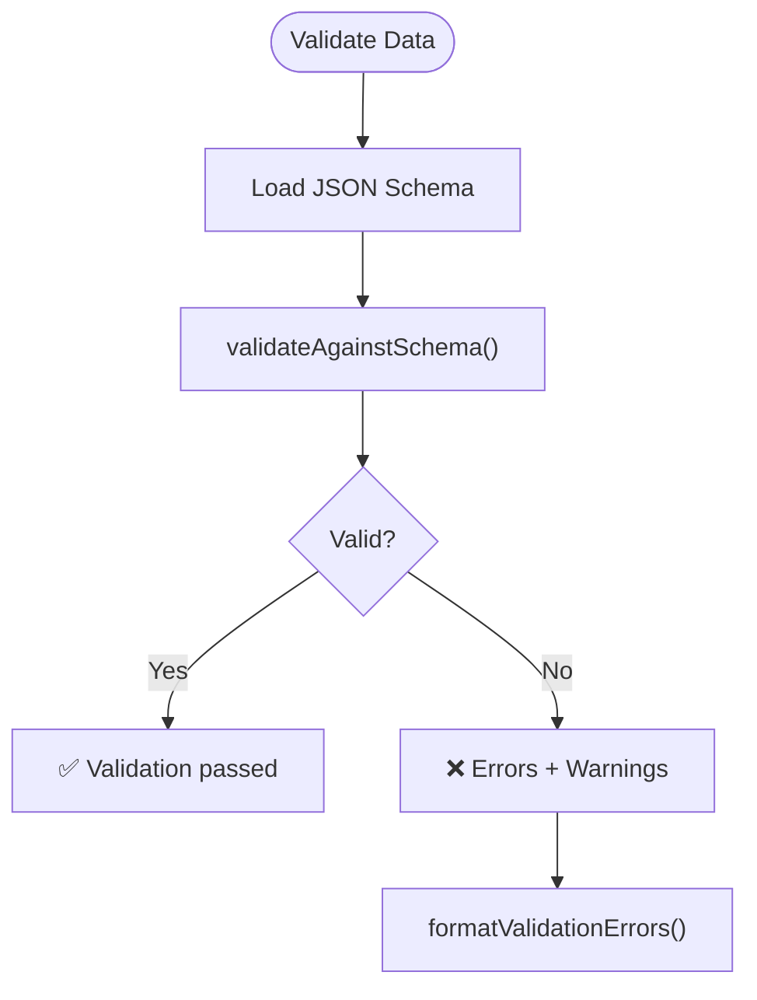

**Diagram sources**
- [src/plugins/lib/schema-validator.ts](file://src/plugins/lib/schema-validator.ts#L162-L206)
- [src/schemas/brain-state-schema.json](file://src/schemas/brain-state-schema.json#L1-L112)
- [src/schemas/checkpoint-schema.json](file://src/schemas/checkpoint-schema.json#L1-L199)

**Section sources**
- [src/plugins/lib/schema-validator.ts](file://src/plugins/lib/schema-validator.ts#L162-L262)
- [src/schemas/brain-state-schema.json](file://src/schemas/brain-state-schema.json#L1-L112)
- [src/schemas/checkpoint-schema.json](file://src/schemas/checkpoint-schema.json#L1-L199)

### State Update Mechanisms and Component Interactions
- Core plugin hooks: Intercepts session events, tool execution, permission requests, and command execution to update state and checkpoints.
- Tool integration: idumb-state exposes read, write, anchor, history, and session management operations.
- Validation and recovery: Uses schema validator to detect inconsistencies and logs history entries for auditability.

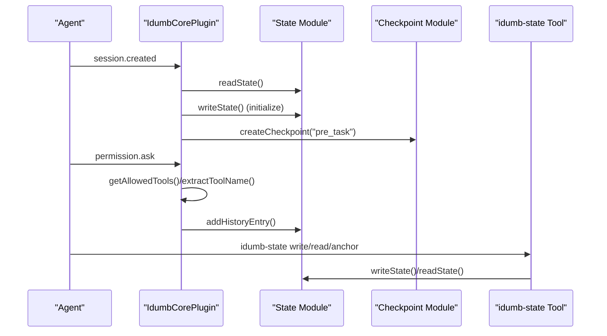

**Diagram sources**
- [src/plugins/idumb-core.ts](file://src/plugins/idumb-core.ts#L141-L189)
- [src/plugins/idumb-core.ts](file://src/plugins/idumb-core.ts#L651-L741)
- [src/tools/idumb-state.ts](file://src/tools/idumb-state.ts#L133-L152)

**Section sources**
- [src/plugins/idumb-core.ts](file://src/plugins/idumb-core.ts#L141-L189)
- [src/plugins/idumb-core.ts](file://src/plugins/idumb-core.ts#L651-L741)
- [src/tools/idumb-state.ts](file://src/tools/idumb-state.ts#L133-L152)

### Examples of State Transitions Throughout the Workflow
- Transition workflow updates state upon successful verification, archives artifacts, and prepares next phase context.
- Transition includes pass-rate validation, critical-blocked item checks, archival of planning and execution artifacts, roadmap shadow tracking, and state advancement.

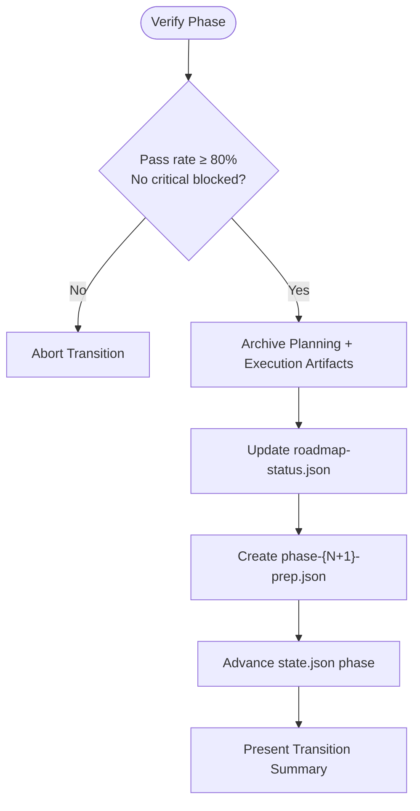

**Diagram sources**
- [src/workflows/transition.md](file://src/workflows/transition.md#L32-L140)
- [src/workflows/transition.md](file://src/workflows/transition.md#L442-L494)

**Section sources**
- [src/workflows/transition.md](file://src/workflows/transition.md#L32-L140)
- [src/workflows/transition.md](file://src/workflows/transition.md#L442-L494)

### State Recovery Procedures
- Corrupted checkpoints: Mark as corrupted and delete with history logging.
- Stale checkpoints: Automatically marked as stale after 48 hours.
- State recovery: Read operations return null or default state on missing/corrupted files; schema validation reports errors for diagnostics.
- Garbage collection: Purge old sessions and halt checkpoints; trim state history and anchors to configured limits.

**Section sources**
- [src/plugins/lib/checkpoint.ts](file://src/plugins/lib/checkpoint.ts#L297-L356)
- [src/plugins/lib/checkpoint.ts](file://src/plugins/lib/checkpoint.ts#L230-L236)
- [src/plugins/lib/state.ts](file://src/plugins/lib/state.ts#L34-L45)
- [src/tools/idumb-state.ts](file://src/tools/idumb-state.ts#L481-L594)

## Dependency Analysis
The state management system exhibits clear module boundaries and low coupling:

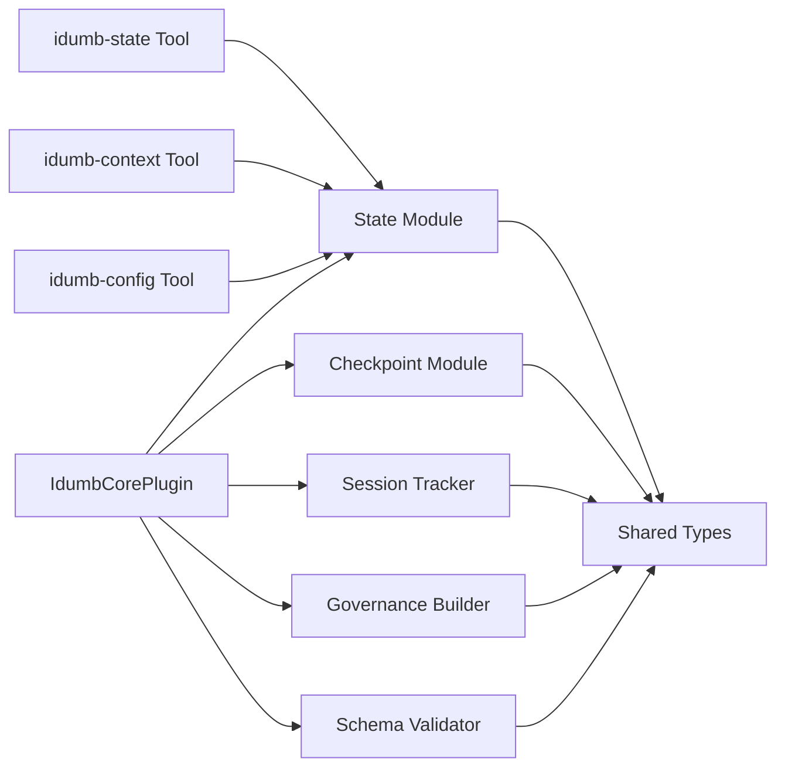

**Diagram sources**
- [src/plugins/idumb-core.ts](file://src/plugins/idumb-core.ts#L19-L108)
- [src/plugins/lib/index.ts](file://src/plugins/lib/index.ts#L14-L131)

**Section sources**
- [src/plugins/lib/index.ts](file://src/plugins/lib/index.ts#L1-L131)
- [src/plugins/idumb-core.ts](file://src/plugins/idumb-core.ts#L19-L108)

## Performance Considerations
- Atomic writes: Prevent corruption and reduce retries during concurrent access.
- In-memory session tracking: Minimizes disk I/O for session metadata; periodic cleanup evicts stale sessions.
- History and anchor limits: Caps growth to manageable sizes (50 entries, 20 anchors).
- Schema validation: Lightweight draft-07 validation avoids heavy external dependencies.

[No sources needed since this section provides general guidance]

## Troubleshooting Guide
Common issues and resolutions:
- State file missing or corrupted: Read operations fall back to defaults; use schema validation to diagnose structure problems.
- Checkpoint not found or stale: Use listCheckpoints to enumerate and getLatestCheckpoint to retrieve the most recent valid or newest checkpoint.
- Permission denials: Denials are queued and output replacement occurs in tool.execute.after; review history entries for patterns.
- Stale state warnings: Use isStateStale to compute hours since last validation and recommend running validation commands.

**Section sources**
- [src/plugins/lib/state.ts](file://src/plugins/lib/state.ts#L34-L45)
- [src/plugins/lib/checkpoint.ts](file://src/plugins/lib/checkpoint.ts#L246-L292)
- [src/plugins/lib/session-tracker.ts](file://src/plugins/lib/session-tracker.ts#L362-L384)
- [src/plugins/lib/schema-validator.ts](file://src/plugins/lib/schema-validator.ts#L267-L284)

## Conclusion
The iDumb state management system centralizes governance state, enforces structure through JSON Schema, preserves critical context across compaction, and supports robust recovery and auditing. Its modular design enables clear separation of concerns, while hooks in the core plugin integrate state updates seamlessly with agent workflows.

## Appendices

### Data Models
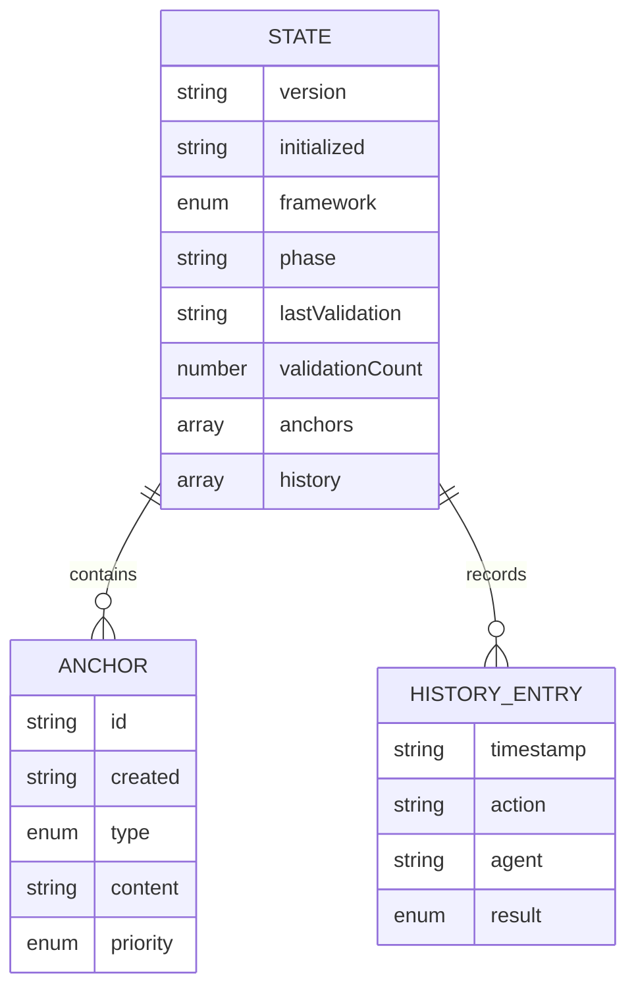

**Diagram sources**
- [src/plugins/lib/types.ts](file://src/plugins/lib/types.ts#L20-L51)
- [src/schemas/brain-state-schema.json](file://src/schemas/brain-state-schema.json#L54-L111)