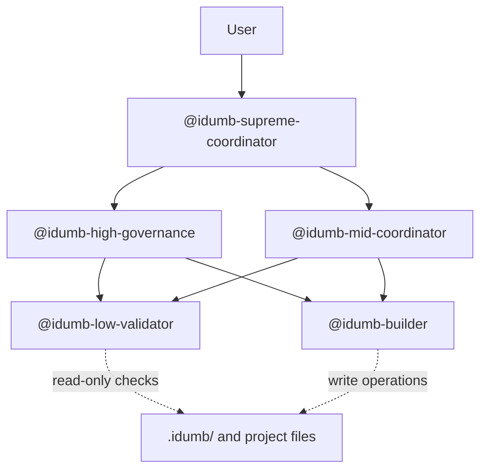

# Getting Started

<cite>
**Referenced Files in This Document**
- [README.md](file://README.md)
- [package.json](file://package.json)
- [install.js](file://bin/install.js)
- [init.md](file://src/commands/idumb/init.md)
- [config.md](file://src/commands/idumb/config.md)
- [status.md](file://src/commands/idumb/status.md)
- [help.md](file://src/commands/idumb/help.md)
- [idumb-supreme-coordinator.md](file://src/agents/idumb-supreme-coordinator.md)
- [idumb-high-governance.md](file://src/agents/idumb-high-governance.md)
- [idumb-mid-coordinator.md](file://src/agents/idumb-mid-coordinator.md)
- [idumb-low-validator.md](file://src/agents/idumb-low-validator.md)
- [idumb-builder.md](file://src/agents/idumb-builder.md)
</cite>

## Table of Contents
1. [Introduction](#introduction)
2. [Prerequisites and System Requirements](#prerequisites-and-system-requirements)
3. [Installation Methods](#installation-methods)
4. [Initial Setup](#initial-setup)
5. [Basic Configuration](#basic-configuration)
6. [Core Agent Hierarchy](#core-agent-hierarchy)
7. [Experience Levels and Language Options](#experience-levels-and-language-options)
8. [Basic Usage Patterns](#basic-usage-patterns)
9. [Common Workflows](#common-workflows)
10. [Troubleshooting](#troubleshooting)
11. [Next Steps](#next-steps)

## Introduction
iDumb is a hierarchical AI governance framework designed to ensure safe, controlled, and systematic code development through intelligent delegation and permission management. It establishes a four-tier agent hierarchy where higher-level agents orchestrate work while lower-level agents handle validation and file operations, enforcing strict chain rules and traceability.

Key capabilities include:
- Hierarchical governance with clear delegation boundaries
- Read-only validation and file-writing safeguards
- Structured project lifecycle support (init, research, planning, execution, validation)
- Configurable experience levels and language settings
- Audit-ready state and history tracking

**Section sources**
- [README.md](file://README.md#L1-L93)

## Prerequisites and System Requirements
- Node.js version 18 or higher is required for installation and runtime.
- A compatible terminal or shell environment to execute commands.
- Optional: Git for version control integration during file operations.

These requirements are enforced during installation and runtime to ensure consistent behavior across environments.

**Section sources**
- [package.json](file://package.json#L43-L45)
- [install.js](file://bin/install.js#L9-L16)

## Installation Methods

### Option A: Install via npx (recommended for quick trials)
- Local installation for the current project:
  - Command: `npx github:shynlee04/idumb-plugin --local`
- Global installation for all projects:
  - Command: `npx github:shynlee04/idumb-plugin --global`

### Option B: Manual installation
- Clone the repository:
  - Command: `git clone https://github.com/shynlee04/idumb-plugin.git`
- Navigate to the cloned directory and run the installer:
  - Command: `node idumb-plugin/bin/install.js --local`

The installer will:
- Prompt for language selection (English or Vietnamese)
- Guide you through selecting installation location (local or global)
- Copy framework assets into `.opencode/` (local) or `~/.config/opencode/` (global)
- Create governance directories under `.idumb/` for local installs
- Configure default settings and anchors

**Section sources**
- [README.md](file://README.md#L7-L17)
- [package.json](file://package.json#L6-L11)
- [install.js](file://bin/install.js#L166-L185)
- [install.js](file://bin/install.js#L256-L273)
- [install.js](file://bin/install.js#L556-L573)

## Initial Setup

### Step 1: Initialize iDumb in your project
Run the initialization command to set up governance structures and default configurations:
- Command: `/idumb:init`

This command detects your project type (greenfield, brownfield, or existing planning) and prepares the appropriate workflow. It also creates governance directories and anchors for traceability.

**Section sources**
- [init.md](file://src/commands/idumb/init.md#L8-L14)
- [init.md](file://src/commands/idumb/init.md#L36-L85)

### Step 2: Verify initialization
Check the current governance state and health:
- Command: `/idumb:status`

This read-only command displays initialization status, current phase, governance health, active anchors, and any stale context warnings.

**Section sources**
- [status.md](file://src/commands/idumb/status.md#L8-L12)
- [status.md](file://src/commands/idumb/status.md#L48-L73)

### Step 3: Run validation (optional but recommended)
Validate governance integrity and structure:
- Command: `/idumb:validate`

This runs a comprehensive validation hierarchy to ensure all governance artifacts are intact and aligned.

**Section sources**
- [help.md](file://src/commands/idumb/help.md#L302-L336)

## Basic Configuration

### View current configuration
- Command: `/idumb:config`

This displays all configuration sections including user preferences, hierarchy settings, automation controls, and enforcement rules.

### Modify configuration
- View and edit specific settings:
  - Command: `/idumb:config set <section.key> <value>`
- Set experience level:
  - Command: `/idumb:config experience <pro|guided|strict>`
- Set language preferences:
  - Command: `/idumb:config language <communication|documents> <en|vi|...>`
- Reset to defaults:
  - Command: `/idumb:config reset`

Configuration changes take effect immediately for new operations, with language changes applying to subsequent messages.

**Section sources**
- [config.md](file://src/commands/idumb/config.md#L18-L56)
- [config.md](file://src/commands/idumb/config.md#L75-L118)
- [config.md](file://src/commands/idumb/config.md#L155-L176)
- [config.md](file://src/commands/idumb/config.md#L232-L259)

## Core Agent Hierarchy

The iDumb framework enforces a strict four-tier delegation hierarchy:

- **Supreme Coordinator**: Orchestrates all requests and delegates to appropriate agents. Never executes directly.
- **High Governance**: Manages framework-level operations, validates changes, and coordinates builders.
- **Mid Coordinator**: Bridges governance and project execution, coordinating research, planning, and verification.
- **Low Validator**: Performs read-only validation checks on code, structure, and governance files.
- **Builder**: The only agent authorized to write files.

**Diagram sources**
- [idumb-supreme-coordinator.md](file://src/agents/idumb-supreme-coordinator.md#L75-L95)
- [idumb-high-governance.md](file://src/agents/idumb-high-governance.md#L73-L94)
- [idumb-mid-coordinator.md](file://src/agents/idumb-mid-coordinator.md#L66-L87)
- [idumb-low-validator.md](file://src/agents/idumb-low-validator.md#L46-L74)
- [idumb-builder.md](file://src/agents/idumb-builder.md#L88-L108)

**Section sources**
- [idumb-supreme-coordinator.md](file://src/agents/idumb-supreme-coordinator.md#L75-L95)
- [idumb-high-governance.md](file://src/agents/idumb-high-governance.md#L73-L94)
- [idumb-mid-coordinator.md](file://src/agents/idumb-mid-coordinator.md#L66-L87)
- [idumb-low-validator.md](file://src/agents/idumb-low-validator.md#L46-L74)
- [idumb-builder.md](file://src/agents/idumb-builder.md#L88-L108)

## Experience Levels and Language Options

### Experience Levels
- **pro**: User-driven with minimal guardrails; AI provides suggestions.
- **guided**: Balanced guidance with confirmation before actions (default).
- **strict**: Maximum governance with explicit approvals; blocks unsafe actions.

### Language Configuration
- Communication language: Controls AI response language.
- Documents language: Controls artifact language for new outputs.
- Both settings can be configured via `/idumb:config language`.

These settings influence how the system communicates and generates documentation, enabling multilingual workflows.

**Section sources**
- [README.md](file://README.md#L27-L39)
- [config.md](file://src/commands/idumb/config.md#L199-L212)

## Basic Usage Patterns

### Check system status
- Command: `/idumb:status`
- Purpose: Read-only health check displaying initialization state, phase, anchors, and recent history.

### View and adjust configuration
- Command: `/idumb:config`
- Purpose: View current settings, set experience level, configure languages, and reset defaults.

### Initialize governance
- Command: `/idumb:init`
- Purpose: Set up governance structure, detect project type, and prepare anchors and state.

### Get help and discover commands
- Command: `/idumb:help`
- Purpose: Show all commands, agent hierarchy, and quick-start guidance.

**Section sources**
- [status.md](file://src/commands/idumb/status.md#L8-L12)
- [config.md](file://src/commands/idumb/config.md#L18-L56)
- [init.md](file://src/commands/idumb/init.md#L8-L14)
- [help.md](file://src/commands/idumb/help.md#L8-L35)

## Common Workflows

### New Project Setup
1. Initialize governance: `/idumb:init`
2. Check status: `/idumb:status`
3. Create roadmap: `/idumb:roadmap`
4. Plan first phase: `/idumb:discuss-phase 1`, `/idumb:plan-phase 1`
5. Execute and validate: Follow phase execution with integrated validation

### Existing Project Integration
1. Initialize governance: `/idumb:init`
2. Map codebase: `/idumb:map-codebase`
3. Create project context: `/idumb:new-project`
4. Align with planning: `/idumb:status` and `/idumb:validate`

### Daily Governance
- Regular health checks: `/idumb:status`
- Integrity validation: `/idumb:validate`
- Configuration tuning: `/idumb:config experience strict` (for stricter controls)

**Section sources**
- [help.md](file://src/commands/idumb/help.md#L234-L301)
- [init.md](file://src/commands/idumb/init.md#L343-L400)

## Troubleshooting

### Initialization Issues
- Symptom: iDumb not initialized in project
  - Action: Run `/idumb:init` to set up governance structure
- Symptom: Missing state or config files
  - Action: Use `/idumb:status` to identify missing artifacts and `/idumb:validate` to repair

### Validation Failures
- Symptom: Validation reports failures
  - Action: Review validation output, address blocking issues, and rerun `/idumb:validate`

### Configuration Problems
- Symptom: Invalid configuration values
  - Action: Use `/idumb:config reset` to restore defaults, then reapply settings incrementally

### Language and Experience Settings
- Symptom: Unexpected language or automation behavior
  - Action: Adjust experience level with `/idumb:config experience <pro|guided|strict>` and language with `/idumb:config language communication <en|vi>`

**Section sources**
- [status.md](file://src/commands/idumb/status.md#L48-L73)
- [config.md](file://src/commands/idumb/config.md#L374-L381)

## Next Steps

- Explore the agent hierarchy and delegation patterns:
  - Command: `/idumb:help agents`
- Learn about available commands and categories:
  - Command: `/idumb:help commands`
- Dive deeper into governance concepts:
  - Reference: [README.md](file://README.md#L72-L84)

**Section sources**
- [help.md](file://src/commands/idumb/help.md#L179-L233)
- [help.md](file://src/commands/idumb/help.md#L134-L178)
- [README.md](file://README.md#L72-L84)