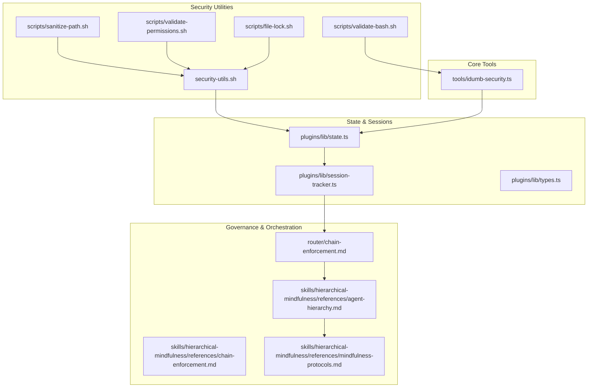
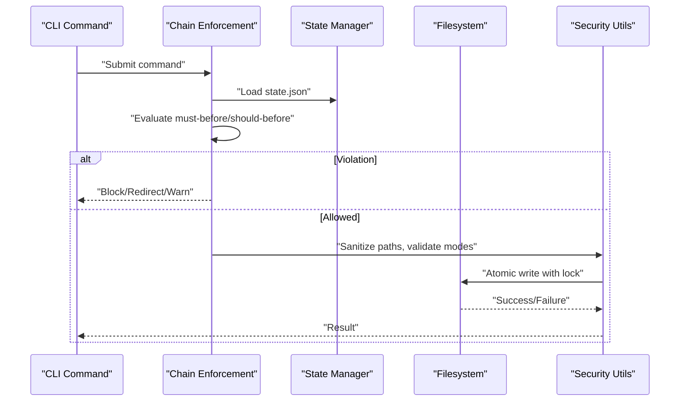
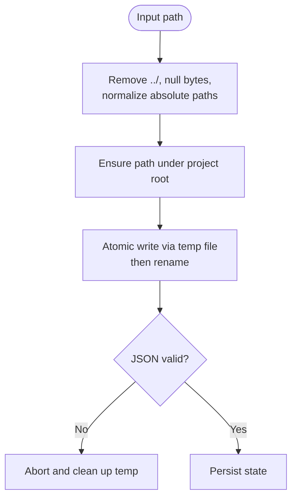
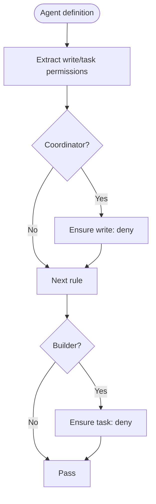
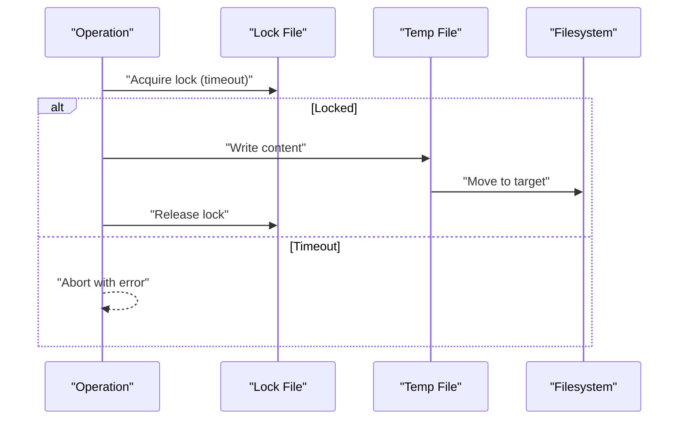
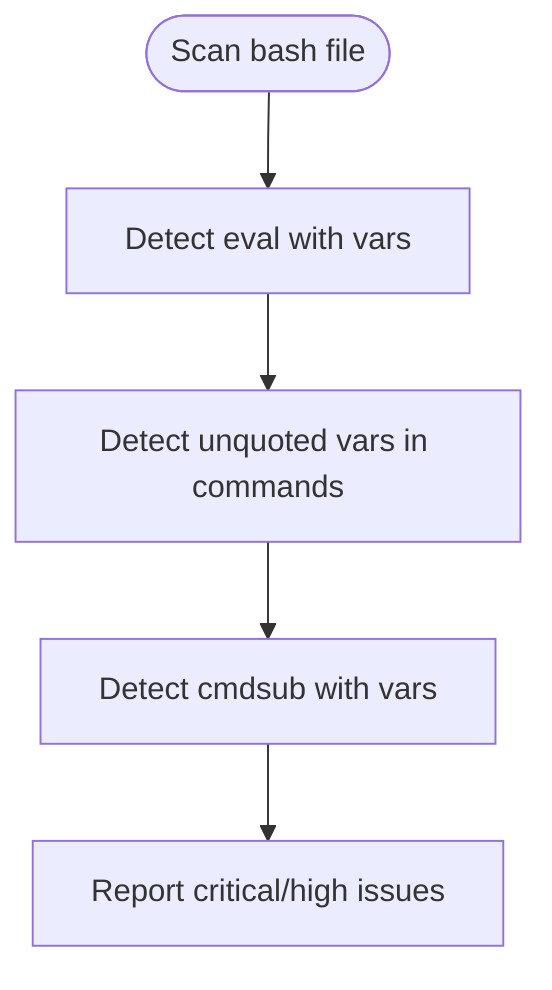
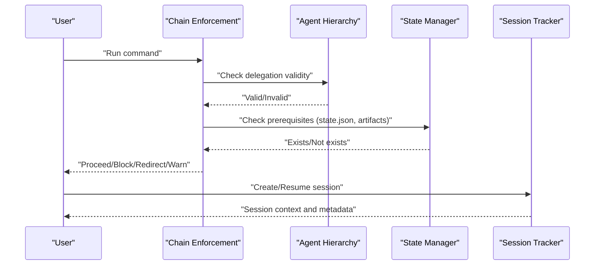
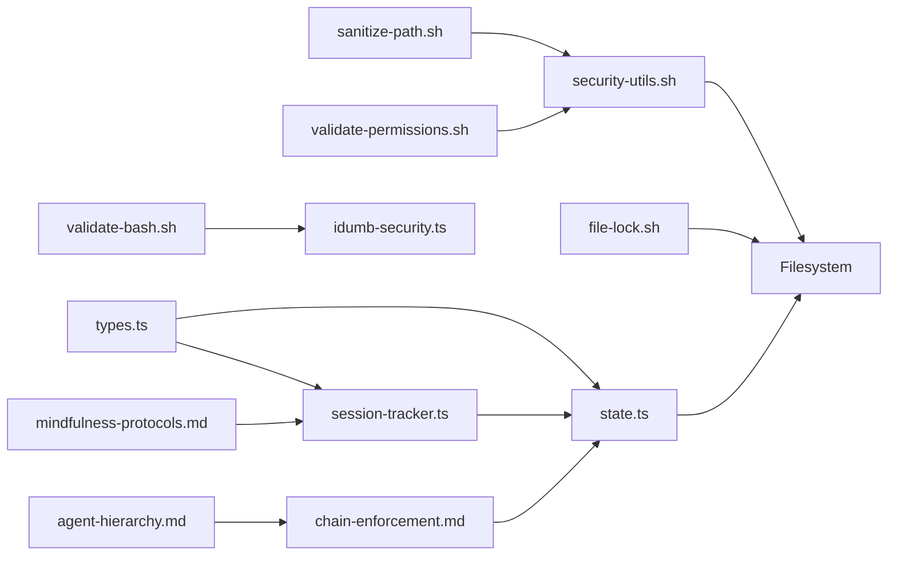

# Threat Models and Mitigations

<cite>
**Referenced Files in This Document**
- [security-utils.sh](file://src/security/security-utils.sh)
- [sanitize-path.sh](file://src/skills/idumb-security/scripts/sanitize-path.sh)
- [validate-permissions.sh](file://src/skills/idumb-security/scripts/validate-permissions.sh)
- [file-lock.sh](file://src/skills/idumb-security/scripts/file-lock.sh)
- [validate-bash.sh](file://src/skills/idumb-security/scripts/validate-bash.sh)
- [idumb-security.ts](file://src/tools/idumb-security.ts)
- [state.ts](file://src/plugins/lib/state.ts)
- [session-tracker.ts](file://src/plugins/lib/session-tracker.ts)
- [types.ts](file://src/plugins/lib/types.ts)
- [chain-enforcement.md](file://src/router/chain-enforcement.md)
- [chain-enforcement.md (reference)](file://src/skills/hierarchical-mindfulness/references/chain-enforcement.md)
- [agent-hierarchy.md](file://src/skills/hierarchical-mindfulness/references/agent-hierarchy.md)
- [mindfulness-protocols.md](file://src/skills/hierarchical-mindfulness/references/mindfulness-protocols.md)
</cite>

## Table of Contents
1. [Introduction](#introduction)
2. [Project Structure](#project-structure)
3. [Core Components](#core-components)
4. [Architecture Overview](#architecture-overview)
5. [Detailed Component Analysis](#detailed-component-analysis)
6. [Dependency Analysis](#dependency-analysis)
7. [Performance Considerations](#performance-considerations)
8. [Troubleshooting Guide](#troubleshooting-guide)
9. [Conclusion](#conclusion)
10. [Appendices](#appendices)

## Introduction
This document presents a comprehensive threat model for iDumb’s security architecture. It identifies potential attack vectors, threat actors, and risk assessments across path traversal, permission escalation, race conditions, and injection vulnerabilities. It explains mitigations for agent delegation, chain enforcement, and state management, and covers detection mechanisms, incident response, and hardening recommendations. Practical scenario analyses, implementation examples, and testing procedures are included, along with guidance for updating threat models, vulnerability assessments, and measuring security posture.

## Project Structure
The security architecture spans:
- Bash utilities for path sanitization, atomic writes, and permission validation
- TypeScript modules for state and session tracking with atomic persistence
- Chain enforcement rules governing command and phase execution
- Agent hierarchy and mindfulness protocols ensuring least privilege and traceability
- Security validation tooling for detecting injection, traversal, permissions, and race conditions

**Diagram sources**
- [security-utils.sh](file://src/security/security-utils.sh#L1-L239)
- [sanitize-path.sh](file://src/skills/idumb-security/scripts/sanitize-path.sh#L1-L37)
- [validate-permissions.sh](file://src/skills/idumb-security/scripts/validate-permissions.sh#L1-L45)
- [file-lock.sh](file://src/skills/idumb-security/scripts/file-lock.sh#L1-L52)
- [validate-bash.sh](file://src/skills/idumb-security/scripts/validate-bash.sh#L1-L51)
- [idumb-security.ts](file://src/tools/idumb-security.ts#L1-L359)
- [state.ts](file://src/plugins/lib/state.ts#L1-L189)
- [session-tracker.ts](file://src/plugins/lib/session-tracker.ts#L1-L385)
- [types.ts](file://src/plugins/lib/types.ts#L1-L282)
- [chain-enforcement.md](file://src/router/chain-enforcement.md#L1-L257)
- [chain-enforcement.md (reference)](file://src/skills/hierarchical-mindfulness/references/chain-enforcement.md#L1-L188)
- [agent-hierarchy.md](file://src/skills/hierarchical-mindfulness/references/agent-hierarchy.md#L1-L246)
- [mindfulness-protocols.md](file://src/skills/hierarchical-mindfulness/references/mindfulness-protocols.md#L1-L342)

**Section sources**
- [security-utils.sh](file://src/security/security-utils.sh#L1-L239)
- [state.ts](file://src/plugins/lib/state.ts#L1-L189)
- [session-tracker.ts](file://src/plugins/lib/session-tracker.ts#L1-L385)
- [chain-enforcement.md](file://src/router/chain-enforcement.md#L1-L257)
- [agent-hierarchy.md](file://src/skills/hierarchical-mindfulness/references/agent-hierarchy.md#L1-L246)
- [mindfulness-protocols.md](file://src/skills/hierarchical-mindfulness/references/mindfulness-protocols.md#L1-L342)

## Core Components
- Path sanitization and atomic file operations mitigate path traversal and race conditions during state writes.
- Chain enforcement prevents premature or out-of-order operations that could bypass governance.
- Agent hierarchy and mindfulness protocols enforce least privilege and maintain delegation integrity.
- Session tracking and state management provide audit trails and resilience against memory leaks and stale data.
- Security validation tooling detects injection, traversal, permission misuse, and race conditions in bash scripts.

**Section sources**
- [security-utils.sh](file://src/security/security-utils.sh#L18-L122)
- [state.ts](file://src/plugins/lib/state.ts#L47-L73)
- [session-tracker.ts](file://src/plugins/lib/session-tracker.ts#L47-L88)
- [chain-enforcement.md](file://src/router/chain-enforcement.md#L14-L118)
- [agent-hierarchy.md](file://src/skills/hierarchical-mindfulness/references/agent-hierarchy.md#L20-L192)
- [mindfulness-protocols.md](file://src/skills/hierarchical-mindfulness/references/mindfulness-protocols.md#L5-L123)
- [idumb-security.ts](file://src/tools/idumb-security.ts#L54-L162)

## Architecture Overview
The security architecture integrates runtime protections with governance controls:
- Runtime protections: atomic writes, path sanitization, file locking, JSON validation, and strict timestamp validation.
- Governance controls: chain enforcement rules, agent hierarchy, and mindfulness protocols.
- State and session management: atomic state persistence, session cleanup, and metadata storage.

**Diagram sources**
- [chain-enforcement.md](file://src/router/chain-enforcement.md#L194-L216)
- [state.ts](file://src/plugins/lib/state.ts#L47-L73)
- [security-utils.sh](file://src/security/security-utils.sh#L93-L122)

## Detailed Component Analysis

### Path Traversal Attacks
- Attack surface: unsanitized user-provided paths used to construct filesystem operations.
- Controls:
  - Path sanitization removes traversal sequences and normalizes absolute paths to project roots.
  - Atomic write ensures intermediate states are not exposed.
  - JSON validation prevents malformed artifacts from persisting.
- Mitigation examples:
  - Use the sanitization script for all dynamic path construction.
  - Prefer POSIX-safe operations and avoid shell expansions with untrusted input.
- Testing procedures:
  - Validate bash scripts for unsafe variable interpolation and command substitutions.
  - Run the security scanner to detect traversal patterns.

**Diagram sources**
- [sanitize-path.sh](file://src/skills/idumb-security/scripts/sanitize-path.sh#L7-L29)
- [security-utils.sh](file://src/security/security-utils.sh#L93-L122)
- [state.ts](file://src/plugins/lib/state.ts#L47-L73)

**Section sources**
- [sanitize-path.sh](file://src/skills/idumb-security/scripts/sanitize-path.sh#L1-L37)
- [security-utils.sh](file://src/security/security-utils.sh#L18-L33)
- [state.ts](file://src/plugins/lib/state.ts#L47-L73)
- [idumb-security.ts](file://src/tools/idumb-security.ts#L85-L107)
- [validate-bash.sh](file://src/skills/idumb-security/scripts/validate-bash.sh#L1-L51)

### Permission Escalation
- Attack surface: overly permissive agent permissions or unsafe sudo/chown usage.
- Controls:
  - Permission validation scripts enforce coordinator and builder permission matrices.
  - Strict mode blocks violations; standard mode warns and logs.
  - Mindfulness protocols require explicit delegation and return validation.
- Mitigation examples:
  - Enforce write: deny for coordinators; task: deny for builders.
  - Avoid world-writable permissions; use minimal required permissions.
- Testing procedures:
  - Run permission validation across agent definitions.
  - Scan for sudo/chown usage without validation.

**Diagram sources**
- [validate-permissions.sh](file://src/skills/idumb-security/scripts/validate-permissions.sh#L7-L34)
- [agent-hierarchy.md](file://src/skills/hierarchical-mindfulness/references/agent-hierarchy.md#L20-L27)

**Section sources**
- [validate-permissions.sh](file://src/skills/idumb-security/scripts/validate-permissions.sh#L1-L45)
- [agent-hierarchy.md](file://src/skills/hierarchical-mindfulness/references/agent-hierarchy.md#L20-L192)
- [mindfulness-protocols.md](file://src/skills/hierarchical-mindfulness/references/mindfulness-protocols.md#L30-L79)
- [idumb-security.ts](file://src/tools/idumb-security.ts#L109-L138)

### Race Conditions
- Attack surface: TOCTOU patterns and concurrent filesystem access.
- Controls:
  - Atomic writes with temporary files and rename.
  - File locking with timeouts for exclusive access.
  - Session cleanup to prevent resource exhaustion.
- Mitigation examples:
  - Use atomic_write and acquire_lock for sensitive operations.
  - Prefer mkdir -p and atomic renames to avoid races.
- Testing procedures:
  - Scan for TOCTOU patterns and directory-create then chmod sequences.
  - Validate bash scripts for unsafe concurrency patterns.

**Diagram sources**
- [security-utils.sh](file://src/security/security-utils.sh#L139-L183)
- [file-lock.sh](file://src/skills/idumb-security/scripts/file-lock.sh#L7-L44)

**Section sources**
- [security-utils.sh](file://src/security/security-utils.sh#L139-L183)
- [file-lock.sh](file://src/skills/idumb-security/scripts/file-lock.sh#L1-L52)
- [session-tracker.ts](file://src/plugins/lib/session-tracker.ts#L47-L88)
- [idumb-security.ts](file://src/tools/idumb-security.ts#L140-L162)

### Injection Vulnerabilities (Bash)
- Attack surface: unquoted variables, eval usage, command substitution with variables.
- Controls:
  - Security scanner detects injection patterns and suggests fixes.
  - Mindfulness protocols emphasize quoting and avoiding eval.
- Mitigation examples:
  - Quote variables; avoid eval; sanitize before command substitution.
- Testing procedures:
  - Run validate-bash.sh on scripts.
  - Use idumb-security scan to detect critical and high severity issues.

**Diagram sources**
- [idumb-security.ts](file://src/tools/idumb-security.ts#L54-L83)
- [validate-bash.sh](file://src/skills/idumb-security/scripts/validate-bash.sh#L7-L42)

**Section sources**
- [idumb-security.ts](file://src/tools/idumb-security.ts#L54-L83)
- [validate-bash.sh](file://src/skills/idumb-security/scripts/validate-bash.sh#L1-L51)
- [mindfulness-protocols.md](file://src/skills/hierarchical-mindfulness/references/mindfulness-protocols.md#L30-L79)

### Agent Delegation, Chain Enforcement, and State Management
- Threats: unauthorized delegation, skipped governance steps, stale state, and session hijacking.
- Controls:
  - Chain enforcement enforces MUST-BEFORE/SHOULD-BEFORE rules with actions (block, redirect, warn).
  - Agent hierarchy defines explicit delegation paths and capabilities.
  - State management uses atomic writes and bounded history to prevent corruption.
  - Session tracking maintains activity windows, cleanup policies, and metadata persistence.
- Mitigation examples:
  - Enforce strict governance levels; validate delegation requests and return formats.
  - Persist session metadata and detect resumptions; apply mindfulness protocols for stall detection.
- Testing procedures:
  - Validate chain rule compliance; review session metadata and state staleness.

**Diagram sources**
- [chain-enforcement.md](file://src/router/chain-enforcement.md#L194-L216)
- [agent-hierarchy.md](file://src/skills/hierarchical-mindfulness/references/agent-hierarchy.md#L173-L209)
- [state.ts](file://src/plugins/lib/state.ts#L34-L45)
- [session-tracker.ts](file://src/plugins/lib/session-tracker.ts#L204-L244)

**Section sources**
- [chain-enforcement.md](file://src/router/chain-enforcement.md#L14-L118)
- [chain-enforcement.md (reference)](file://src/skills/hierarchical-mindfulness/references/chain-enforcement.md#L1-L188)
- [agent-hierarchy.md](file://src/skills/hierarchical-mindfulness/references/agent-hierarchy.md#L1-L246)
- [mindfulness-protocols.md](file://src/skills/hierarchical-mindfulness/references/mindfulness-protocols.md#L124-L276)
- [state.ts](file://src/plugins/lib/state.ts#L34-L101)
- [session-tracker.ts](file://src/plugins/lib/session-tracker.ts#L204-L384)

## Dependency Analysis
The security architecture exhibits layered dependencies:
- Utilities depend on filesystem primitives and external tools (jq, flock).
- State and session modules depend on shared types and filesystem operations.
- Governance depends on state and session modules for enforcement.
- Security tooling scans utilities and scripts for vulnerabilities.

**Diagram sources**
- [security-utils.sh](file://src/security/security-utils.sh#L1-L239)
- [sanitize-path.sh](file://src/skills/idumb-security/scripts/sanitize-path.sh#L1-L37)
- [validate-permissions.sh](file://src/skills/idumb-security/scripts/validate-permissions.sh#L1-L45)
- [file-lock.sh](file://src/skills/idumb-security/scripts/file-lock.sh#L1-L52)
- [validate-bash.sh](file://src/skills/idumb-security/scripts/validate-bash.sh#L1-L51)
- [idumb-security.ts](file://src/tools/idumb-security.ts#L1-L359)
- [state.ts](file://src/plugins/lib/state.ts#L1-L189)
- [session-tracker.ts](file://src/plugins/lib/session-tracker.ts#L1-L385)
- [types.ts](file://src/plugins/lib/types.ts#L1-L282)
- [chain-enforcement.md](file://src/router/chain-enforcement.md#L1-L257)
- [agent-hierarchy.md](file://src/skills/hierarchical-mindfulness/references/agent-hierarchy.md#L1-L246)
- [mindfulness-protocols.md](file://src/skills/hierarchical-mindfulness/references/mindfulness-protocols.md#L1-L342)

**Section sources**
- [types.ts](file://src/plugins/lib/types.ts#L20-L94)
- [state.ts](file://src/plugins/lib/state.ts#L10-L73)
- [session-tracker.ts](file://src/plugins/lib/session-tracker.ts#L10-L244)
- [chain-enforcement.md](file://src/router/chain-enforcement.md#L194-L216)

## Performance Considerations
- Atomic writes and renames minimize contention and reduce I/O overhead compared to streaming writes.
- Session cleanup and bounded history prevent memory growth and improve responsiveness.
- JSON validation adds safety at the cost of CPU cycles; batching validation can mitigate overhead.
- Chain enforcement adds minimal latency but significantly reduces rework and error recovery costs.

[No sources needed since this section provides general guidance]

## Troubleshooting Guide
- Path traversal failures: verify sanitization and ensure paths remain under project roots.
- Permission violations: confirm agent definitions align with the hierarchy matrix; rerun permission validation.
- Race condition errors: ensure atomic_write and acquire_lock are used; check lock timeouts.
- Injection detections: quote variables, avoid eval, and sanitize before command substitution.
- Chain enforcement violations: follow redirects or run prerequisites; review chain.log for details.
- Stale state or sessions: refresh state, check staleness thresholds, and rebuild resume context.

**Section sources**
- [security-utils.sh](file://src/security/security-utils.sh#L93-L122)
- [validate-permissions.sh](file://src/skills/idumb-security/scripts/validate-permissions.sh#L1-L45)
- [idumb-security.ts](file://src/tools/idumb-security.ts#L168-L192)
- [chain-enforcement.md](file://src/router/chain-enforcement.md#L238-L253)
- [session-tracker.ts](file://src/plugins/lib/session-tracker.ts#L362-L384)

## Conclusion
iDumb’s security architecture combines runtime protections with strong governance controls. Path sanitization, atomic writes, and file locking mitigate critical attack vectors. Chain enforcement, agent hierarchy, and mindfulness protocols enforce least privilege and maintain integrity. State and session management provide auditability and resilience. The security validation tooling enables proactive detection and remediation. Together, these measures establish a robust, defense-in-depth posture aligned with secure design principles.

[No sources needed since this section summarizes without analyzing specific files]

## Appendices

### Practical Threat Scenario Analysis
- Scenario: Malicious input attempting path traversal during state write
  - Attack: Inject ../ sequences and absolute paths
  - Mitigation: Sanitize paths; atomic write; JSON validation
  - Evidence: Security scanner reports traversal patterns; state persists safely
- Scenario: Unauthorized permission change by self-healing logic
  - Attack: Attempt to grant write permissions to non-coordinators
  - Mitigation: validate_permission_change; strict governance levels
  - Evidence: Permission validation fails; change blocked
- Scenario: Race condition in concurrent state updates
  - Attack: Concurrent writers cause corruption
  - Mitigation: Atomic write with lock; session cleanup
  - Evidence: File lock acquisition succeeds; state remains consistent
- Scenario: Injection via bash script with eval and unquoted variables
  - Attack: Arbitrary command execution through eval
  - Mitigation: Avoid eval; quote variables; sanitize
  - Evidence: Security scanner flags eval and unquoted variables

**Section sources**
- [sanitize-path.sh](file://src/skills/idumb-security/scripts/sanitize-path.sh#L1-L37)
- [security-utils.sh](file://src/security/security-utils.sh#L93-L122)
- [validate-permissions.sh](file://src/skills/idumb-security/scripts/validate-permissions.sh#L1-L45)
- [file-lock.sh](file://src/skills/idumb-security/scripts/file-lock.sh#L1-L52)
- [idumb-security.ts](file://src/tools/idumb-security.ts#L54-L83)

### Security Testing Procedures
- Static analysis:
  - Run idumb-security scan for injection, traversal, permissions, and race conditions.
  - Execute validate-bash.sh on individual scripts.
- Dynamic checks:
  - Validate JSON files and timestamps.
  - Confirm atomic write behavior and lock acquisition.
- Governance audits:
  - Verify chain enforcement rules and delegation patterns.
  - Review session metadata and state staleness.

**Section sources**
- [idumb-security.ts](file://src/tools/idumb-security.ts#L247-L359)
- [validate-bash.sh](file://src/skills/idumb-security/scripts/validate-bash.sh#L1-L51)
- [security-utils.sh](file://src/security/security-utils.sh#L185-L200)
- [chain-enforcement.md](file://src/router/chain-enforcement.md#L194-L216)

### Threat Model Updates and Posture Measurement
- Updates:
  - Periodically review chain rules and agent hierarchy for evolving threats.
  - Incorporate feedback from repeated violations and security incidents.
- Posture measurement:
  - Track critical and high severity issues from security scans.
  - Monitor chain enforcement violations and remediation rates.
  - Measure session staleness and cleanup effectiveness.

**Section sources**
- [chain-enforcement.md](file://src/router/chain-enforcement.md#L238-L253)
- [session-tracker.ts](file://src/plugins/lib/session-tracker.ts#L362-L384)
- [idumb-security.ts](file://src/tools/idumb-security.ts#L287-L300)

### Best Practices and Compliance Validation
- Best practices:
  - Defense in depth: combine runtime protections with governance controls.
  - Least privilege: enforce strict agent permission matrices.
  - Secure defaults: use atomic operations and strict validation.
- Compliance:
  - Validate adherence to chain enforcement and agent hierarchy.
  - Maintain audit trails via chain.log and session metadata.
  - Regularly test and report security posture metrics.

**Section sources**
- [mindfulness-protocols.md](file://src/skills/hierarchical-mindfulness/references/mindfulness-protocols.md#L308-L342)
- [agent-hierarchy.md](file://src/skills/hierarchical-mindfulness/references/agent-hierarchy.md#L20-L192)
- [chain-enforcement.md](file://src/router/chain-enforcement.md#L238-L253)