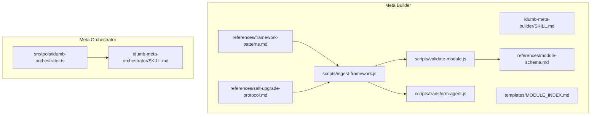
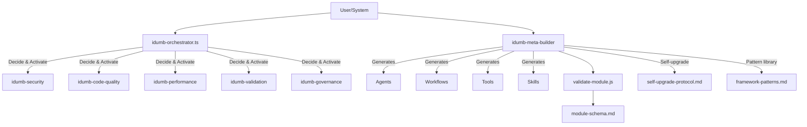
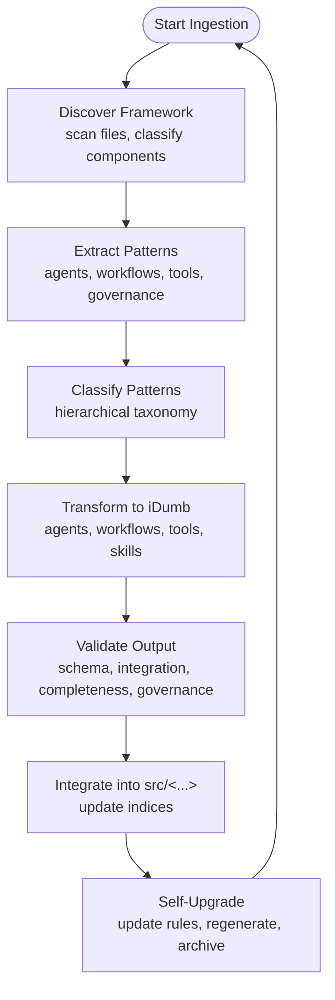
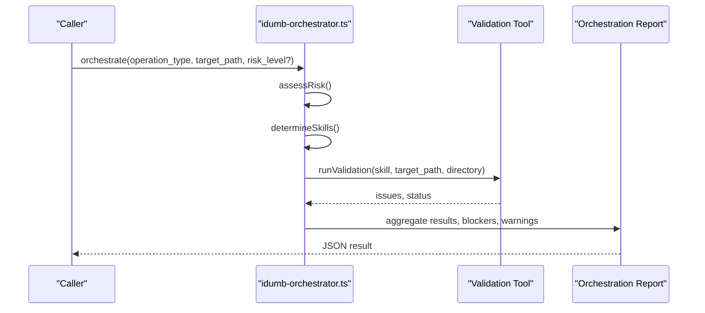
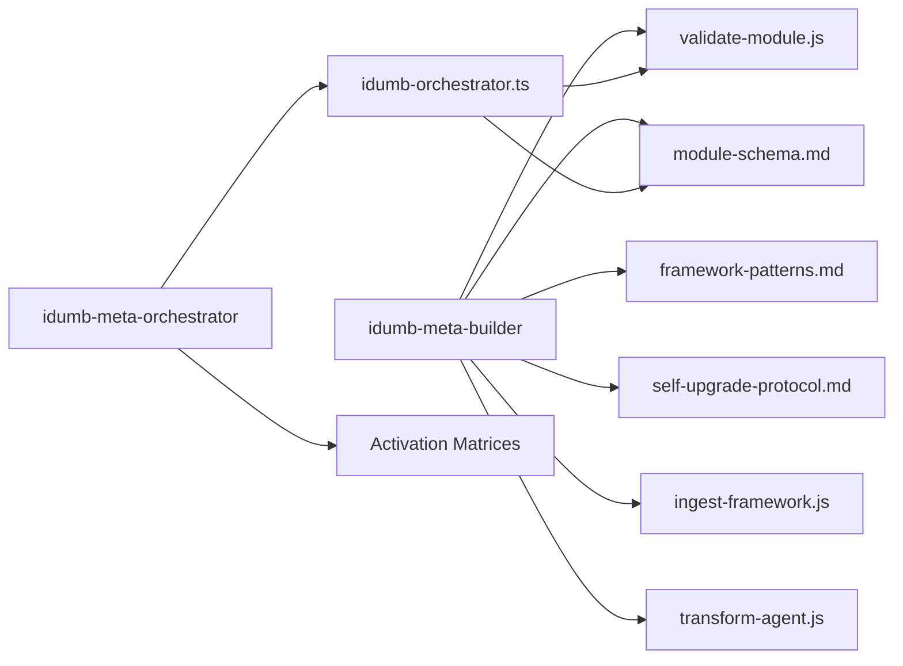

# Meta Framework Skills

<cite>
**Referenced Files in This Document**
- [SKILL.md](file://src/skills/idumb-meta-builder/SKILL.md)
- [module-schema.md](file://src/skills/idumb-meta-builder/references/module-schema.md)
- [framework-patterns.md](file://src/skills/idumb-meta-builder/references/framework-patterns.md)
- [self-upgrade-protocol.md](file://src/skills/idumb-meta-builder/references/self-upgrade-protocol.md)
- [validate-module.js](file://src/skills/idumb-meta-builder/scripts/validate-module.js)
- [ingest-framework.js](file://src/skills/idumb-meta-builder/scripts/ingest-framework.js)
- [transform-agent.js](file://src/skills/idumb-meta-builder/scripts/transform-agent.js)
- [MODULE_INDEX.md](file://src/skills/idumb-meta-builder/templates/MODULE_INDEX.md)
- [SKILL.md](file://src/skills/idumb-meta-orchestrator/SKILL.md)
- [idumb-orchestrator.ts](file://src/tools/idumb-orchestrator.ts)
</cite>

## Table of Contents
1. [Introduction](#introduction)
2. [Project Structure](#project-structure)
3. [Core Components](#core-components)
4. [Architecture Overview](#architecture-overview)
5. [Detailed Component Analysis](#detailed-component-analysis)
6. [Dependency Analysis](#dependency-analysis)
7. [Performance Considerations](#performance-considerations)
8. [Troubleshooting Guide](#troubleshooting-guide)
9. [Conclusion](#conclusion)
10. [Appendices](#appendices)

## Introduction
This document explains the meta framework skills that power iDumb’s ability to ingest, transform, and evolve from external meta-frameworks. It focuses on:
- idumb-meta-builder: the framework ingestion and transformation engine that converts external patterns into iDumb-compatible modules, agents, workflows, and tools, with self-upgrading capabilities.
- idumb-meta-orchestrator: the coordination layer that automatically activates appropriate validation and governance skills based on operation type, risk level, file type, and context.

The guide covers schema validation, transformation rules, self-upgrade protocols, activation matrices, integration points, and practical troubleshooting.

## Project Structure
The meta framework skills are implemented as:
- A skill package for idumb-meta-builder under src/skills/idumb-meta-builder, containing:
  - Skill documentation and usage workflows
  - Reference materials for module schema, framework patterns, and self-upgrade protocol
  - Scripts for ingestion, transformation, and validation
  - Templates for generated components
- A skill package for idumb-meta-orchestrator under src/skills/idumb-meta-orchestrator, containing:
  - Skill documentation with activation matrices and orchestration workflows
- An orchestrator tool under src/tools/idumb-orchestrator.ts that implements runtime coordination logic and decision-making.

**Diagram sources**
- [SKILL.md](file://src/skills/idumb-meta-builder/SKILL.md#L1-L466)
- [module-schema.md](file://src/skills/idumb-meta-builder/references/module-schema.md#L1-L377)
- [framework-patterns.md](file://src/skills/idumb-meta-builder/references/framework-patterns.md#L1-L391)
- [self-upgrade-protocol.md](file://src/skills/idumb-meta-builder/references/self-upgrade-protocol.md#L1-L477)
- [ingest-framework.js](file://src/skills/idumb-meta-builder/scripts/ingest-framework.js#L1-L593)
- [validate-module.js](file://src/skills/idumb-meta-builder/scripts/validate-module.js#L1-L401)
- [transform-agent.js](file://src/skills/idumb-meta-builder/scripts/transform-agent.js#L1-L157)
- [MODULE_INDEX.md](file://src/skills/idumb-meta-builder/templates/MODULE_INDEX.md#L1-L82)
- [SKILL.md](file://src/skills/idumb-meta-orchestrator/SKILL.md#L1-L377)
- [idumb-orchestrator.ts](file://src/tools/idumb-orchestrator.ts#L1-L527)

**Section sources**
- [SKILL.md](file://src/skills/idumb-meta-builder/SKILL.md#L1-L466)
- [SKILL.md](file://src/skills/idumb-meta-orchestrator/SKILL.md#L1-L377)
- [idumb-orchestrator.ts](file://src/tools/idumb-orchestrator.ts#L1-L527)

## Core Components
- idumb-meta-builder
  - Purpose: Ingest external meta-frameworks, extract and classify patterns, transform into iDumb components, validate, integrate, and evolve transformation rules.
  - Key assets: Module schema, framework patterns, self-upgrade protocol, ingestion pipeline, validators, and transformation scripts.
- idumb-meta-orchestrator
  - Purpose: Coordinate validation and governance skills based on operation type, risk level, and file type. Provides activation matrices and orchestration workflows for pre-write, pre-delegate, phase-transition, and continuous monitoring scenarios.

**Section sources**
- [SKILL.md](file://src/skills/idumb-meta-builder/SKILL.md#L1-L466)
- [module-schema.md](file://src/skills/idumb-meta-builder/references/module-schema.md#L1-L377)
- [framework-patterns.md](file://src/skills/idumb-meta-builder/references/framework-patterns.md#L1-L391)
- [self-upgrade-protocol.md](file://src/skills/idumb-meta-builder/references/self-upgrade-protocol.md#L1-L477)
- [ingest-framework.js](file://src/skills/idumb-meta-builder/scripts/ingest-framework.js#L1-L593)
- [validate-module.js](file://src/skills/idumb-meta-builder/scripts/validate-module.js#L1-L401)
- [transform-agent.js](file://src/skills/idumb-meta-builder/scripts/transform-agent.js#L1-L157)
- [SKILL.md](file://src/skills/idumb-meta-orchestrator/SKILL.md#L1-L377)
- [idumb-orchestrator.ts](file://src/tools/idumb-orchestrator.ts#L1-L527)

## Architecture Overview
The meta framework architecture connects the builder and orchestrator:

**Diagram sources**
- [idumb-orchestrator.ts](file://src/tools/idumb-orchestrator.ts#L1-L527)
- [SKILL.md](file://src/skills/idumb-meta-builder/SKILL.md#L1-L466)
- [validate-module.js](file://src/skills/idumb-meta-builder/scripts/validate-module.js#L1-L401)
- [module-schema.md](file://src/skills/idumb-meta-builder/references/module-schema.md#L1-L377)
- [framework-patterns.md](file://src/skills/idumb-meta-builder/references/framework-patterns.md#L1-L391)
- [self-upgrade-protocol.md](file://src/skills/idumb-meta-builder/references/self-upgrade-protocol.md#L1-L477)

## Detailed Component Analysis

### idumb-meta-builder: Framework Ingestion and Transformation
- Vision and workflow
  - Ingest → Classify → Transform → Validate → Integrate → Evolve
  - Uses a classification hierarchy and transformation mapping to preserve intent while adapting structure to iDumb’s governance model.
- Module schema validation
  - Defines required frontmatter fields, body sections, checkpoints, integration points, validation criteria, error handling, and versioning rules.
  - Provides coverage scoring and completeness checks.
- Framework patterns
  - Maintains a pattern library (e.g., BMAD, GSD) with entity, execution, state, and governance patterns.
  - Maps external patterns to iDumb equivalents (e.g., agent personas, workflow steps, checkpoints).
- Self-upgrade protocol
  - Collects feedback from validation and integration, updates transformation rules, merges similar rules, regenerates affected components, and archives outcomes.
  - Tracks confidence scores and automation thresholds to drive autonomous improvements.
- Scripts and templates
  - Ingestion pipeline: discover, extract, classify, transform, validate, integrate.
  - Validators: validate-module.js checks schema, integration, completeness, and governance layers.
  - Transformers: transform-agent.js maps external agent definitions to iDumb agents with hierarchy-aware permissions.
  - Templates: MODULE_INDEX.md and others standardize generated components.

**Diagram sources**
- [ingest-framework.js](file://src/skills/idumb-meta-builder/scripts/ingest-framework.js#L54-L540)
- [validate-module.js](file://src/skills/idumb-meta-builder/scripts/validate-module.js#L296-L392)
- [self-upgrade-protocol.md](file://src/skills/idumb-meta-builder/references/self-upgrade-protocol.md#L13-L355)

**Section sources**
- [SKILL.md](file://src/skills/idumb-meta-builder/SKILL.md#L135-L320)
- [module-schema.md](file://src/skills/idumb-meta-builder/references/module-schema.md#L5-L224)
- [framework-patterns.md](file://src/skills/idumb-meta-builder/references/framework-patterns.md#L5-L391)
- [self-upgrade-protocol.md](file://src/skills/idumb-meta-builder/references/self-upgrade-protocol.md#L5-L355)
- [ingest-framework.js](file://src/skills/idumb-meta-builder/scripts/ingest-framework.js#L54-L540)
- [validate-module.js](file://src/skills/idumb-meta-builder/scripts/validate-module.js#L105-L293)
- [transform-agent.js](file://src/skills/idumb-meta-builder/scripts/transform-agent.js#L40-L138)
- [MODULE_INDEX.md](file://src/skills/idumb-meta-builder/templates/MODULE_INDEX.md#L1-L82)

### idumb-meta-orchestrator: Coordination and Activation
- Role
  - Automatically activates validation and governance skills based on operation type, risk level, and file type.
  - Provides orchestration workflows for pre-write, pre-delegate, phase-transition, and continuous monitoring.
- Activation matrices
  - Operation type matrix: maps operations (write file, spawn agent, create command, create tool, phase transition, framework ingest, cleanup) to required skill activations.
  - Risk level matrix: escalates checks from low to critical.
  - File type matrix: prioritizes security for bash/shell files, quality for tools and agents, and validation for workflows and state.
- Decision-making
  - Risk assessment considers operation type, file extension, path sensitivity, and file size.
  - Skill selection follows deterministic matrices; pre-write and pre-delegate include quick checks for immediate safety.
- Integration points
  - Reads state and skill registry; writes orchestration reports and validation queues.
  - Coordinates idumb-security, idumb-code-quality, idumb-performance, idumb-validation, idumb-governance, hierarchical-mindfulness, idumb-project-validation, idumb-stress-test, and idumb-meta-builder.

**Diagram sources**
- [idumb-orchestrator.ts](file://src/tools/idumb-orchestrator.ts#L257-L343)
- [SKILL.md](file://src/skills/idumb-meta-orchestrator/SKILL.md#L54-L88)

**Section sources**
- [SKILL.md](file://src/skills/idumb-meta-orchestrator/SKILL.md#L36-L88)
- [idumb-orchestrator.ts](file://src/tools/idumb-orchestrator.ts#L56-L167)
- [idumb-orchestrator.ts](file://src/tools/idumb-orchestrator.ts#L173-L206)
- [idumb-orchestrator.ts](file://src/tools/idumb-orchestrator.ts#L212-L251)
- [idumb-orchestrator.ts](file://src/tools/idumb-orchestrator.ts#L257-L343)
- [idumb-orchestrator.ts](file://src/tools/idumb-orchestrator.ts#L345-L390)
- [idumb-orchestrator.ts](file://src/tools/idumb-orchestrator.ts#L392-L431)
- [idumb-orchestrator.ts](file://src/tools/idumb-orchestrator.ts#L433-L470)
- [idumb-orchestrator.ts](file://src/tools/idumb-orchestrator.ts#L472-L512)

### Activation Patterns by Risk and Operation
- High-risk operations (e.g., write file, spawn agent, phase transition, framework ingest)
  - Activate: security, quality, performance (where applicable)
  - Block on: critical issues; warn on: medium/low issues
- Medium-risk operations (e.g., create command)
  - Activate: security, quality
- Low-risk operations (e.g., create tool)
  - Activate: quality; optional performance
- File type-specific activation
  - Bash/shell files: prioritize security
  - Tools/commands: emphasize quality and validation
  - Workflows/state: emphasize validation and governance

**Section sources**
- [SKILL.md](file://src/skills/idumb-meta-orchestrator/SKILL.md#L59-L88)
- [idumb-orchestrator.ts](file://src/tools/idumb-orchestrator.ts#L134-L167)
- [idumb-orchestrator.ts](file://src/tools/idumb-orchestrator.ts#L173-L206)

### Integration Matrix for Skill Coordination
- idumb-meta-orchestrator coordinates:
  - idumb-security, idumb-code-quality, idumb-performance, idumb-validation, idumb-governance, hierarchical-mindfulness, idumb-project-validation, idumb-stress-test, idumb-meta-builder
- Integration points:
  - Reads: state.json, skill registry, agent definitions
  - Writes: orchestration reports, validation queue

**Section sources**
- [SKILL.md](file://src/skills/idumb-meta-orchestrator/SKILL.md#L36-L51)
- [SKILL.md](file://src/skills/idumb-meta-orchestrator/SKILL.md#L344-L372)

## Dependency Analysis
- idumb-meta-builder depends on:
  - Module schema for validation
  - Framework patterns for mapping
  - Self-upgrade protocol for evolution
  - Scripts for ingestion, transformation, and validation
- idumb-meta-orchestrator depends on:
  - Risk assessment and activation matrices
  - Tool exports for running validations
  - Integration with validation and governance skills

**Diagram sources**
- [module-schema.md](file://src/skills/idumb-meta-builder/references/module-schema.md#L1-L377)
- [framework-patterns.md](file://src/skills/idumb-meta-builder/references/framework-patterns.md#L1-L391)
- [self-upgrade-protocol.md](file://src/skills/idumb-meta-builder/references/self-upgrade-protocol.md#L1-L477)
- [ingest-framework.js](file://src/skills/idumb-meta-builder/scripts/ingest-framework.js#L1-L593)
- [transform-agent.js](file://src/skills/idumb-meta-builder/scripts/transform-agent.js#L1-L157)
- [validate-module.js](file://src/skills/idumb-meta-builder/scripts/validate-module.js#L1-L401)
- [idumb-orchestrator.ts](file://src/tools/idumb-orchestrator.ts#L1-L527)

**Section sources**
- [module-schema.md](file://src/skills/idumb-meta-builder/references/module-schema.md#L1-L377)
- [framework-patterns.md](file://src/skills/idumb-meta-builder/references/framework-patterns.md#L1-L391)
- [self-upgrade-protocol.md](file://src/skills/idumb-meta-builder/references/self-upgrade-protocol.md#L1-L477)
- [ingest-framework.js](file://src/skills/idumb-meta-builder/scripts/ingest-framework.js#L1-L593)
- [transform-agent.js](file://src/skills/idumb-meta-builder/scripts/transform-agent.js#L1-L157)
- [validate-module.js](file://src/skills/idumb-meta-builder/scripts/validate-module.js#L1-L401)
- [idumb-orchestrator.ts](file://src/tools/idumb-orchestrator.ts#L1-L527)

## Performance Considerations
- Prefer incremental escalation: start with fast checks (e.g., pre-write quick security) and escalate only if issues are detected.
- Use parallel execution for independent validations where possible.
- Optimize ingestion scans by limiting recursion depth and filtering file extensions early.
- Archive and retention policies reduce long-term storage overhead while preserving learnings.

[No sources needed since this section provides general guidance]

## Troubleshooting Guide
- Validation failures
  - Use validate-module.js to inspect schema, integration, completeness, and governance layers. Review reported issues and adjust module content accordingly.
- Self-upgrade issues
  - Consult self-upgrade-protocol to trace rule updates, confidence scores, and regeneration steps. Re-run transformations and compare diffs.
- Orchestration bottlenecks
  - Verify risk assessment factors and activation matrices. Use dry-run mode to preview validations before execution.
- Integration problems
  - Confirm that generated components adhere to module-schema and that integration points (agents, tools, commands) are correctly bound.

**Section sources**
- [validate-module.js](file://src/skills/idumb-meta-builder/scripts/validate-module.js#L296-L392)
- [self-upgrade-protocol.md](file://src/skills/idumb-meta-builder/references/self-upgrade-protocol.md#L13-L355)
- [idumb-orchestrator.ts](file://src/tools/idumb-orchestrator.ts#L257-L343)

## Conclusion
The meta framework skills enable iDumb to continuously learn from external meta-frameworks and evolve its own governance and component set. idumb-meta-builder provides robust ingestion, transformation, validation, and self-upgrade capabilities, while idumb-meta-orchestrator ensures appropriate validation and governance checks are applied consistently across operations and contexts. Together, they establish a scalable, evidence-based system for meta-learning and automated governance enhancement.

[No sources needed since this section summarizes without analyzing specific files]

## Appendices

### Practical Examples of Meta Skill Activation Scenarios
- Pre-write validation for a bash script
  - Trigger: pre-write hook
  - Activation: security (bash injection detection), quality (error handling)
  - Outcome: block on critical issues, warn on medium/low issues
- Pre-delegation for spawning a new agent
  - Trigger: pre-delegate hook
  - Activation: governance (hierarchy and permissions), security (directory permissions)
  - Outcome: allow or block based on validation results
- Phase transition validation
  - Trigger: phase boundary
  - Activation: comprehensive validation (security, quality, performance)
  - Outcome: create checkpoint anchor and proceed if ready

**Section sources**
- [idumb-orchestrator.ts](file://src/tools/idumb-orchestrator.ts#L345-L390)
- [idumb-orchestrator.ts](file://src/tools/idumb-orchestrator.ts#L392-L431)
- [idumb-orchestrator.ts](file://src/tools/idumb-orchestrator.ts#L433-L470)

### Configuration Requirements
- Module schema
  - Ensure required frontmatter fields and body sections are present and valid.
  - Follow naming conventions and versioning rules.
- Framework ingestion
  - Run discovery, extraction, classification, transformation, validation, and integration in order.
  - Keep validation reports and transformation logs for audit and self-upgrade.
- Orchestration
  - Configure risk levels and operation types according to activation matrices.
  - Use dry-run mode to plan validations before execution.

**Section sources**
- [module-schema.md](file://src/skills/idumb-meta-builder/references/module-schema.md#L267-L377)
- [ingest-framework.js](file://src/skills/idumb-meta-builder/scripts/ingest-framework.js#L517-L540)
- [idumb-orchestrator.ts](file://src/tools/idumb-orchestrator.ts#L257-L343)