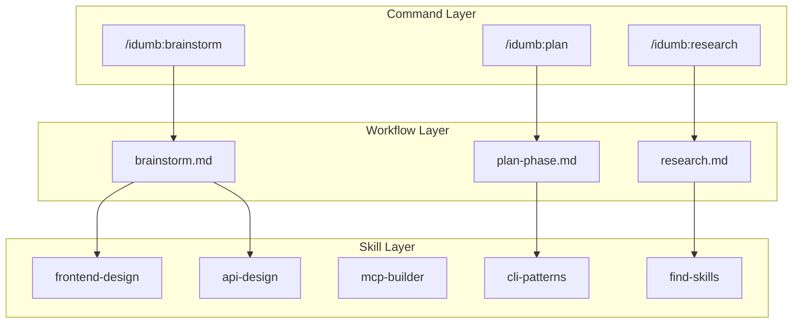
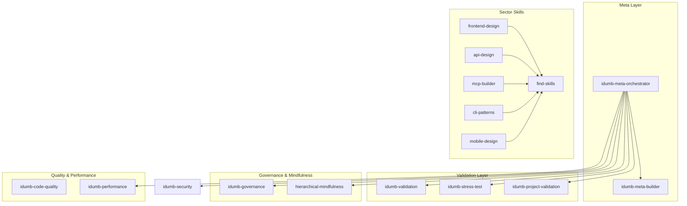
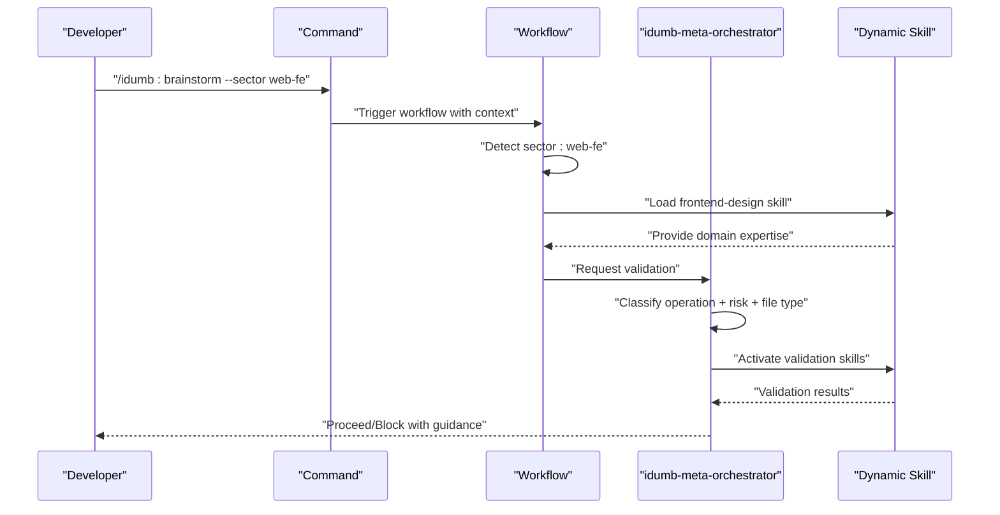
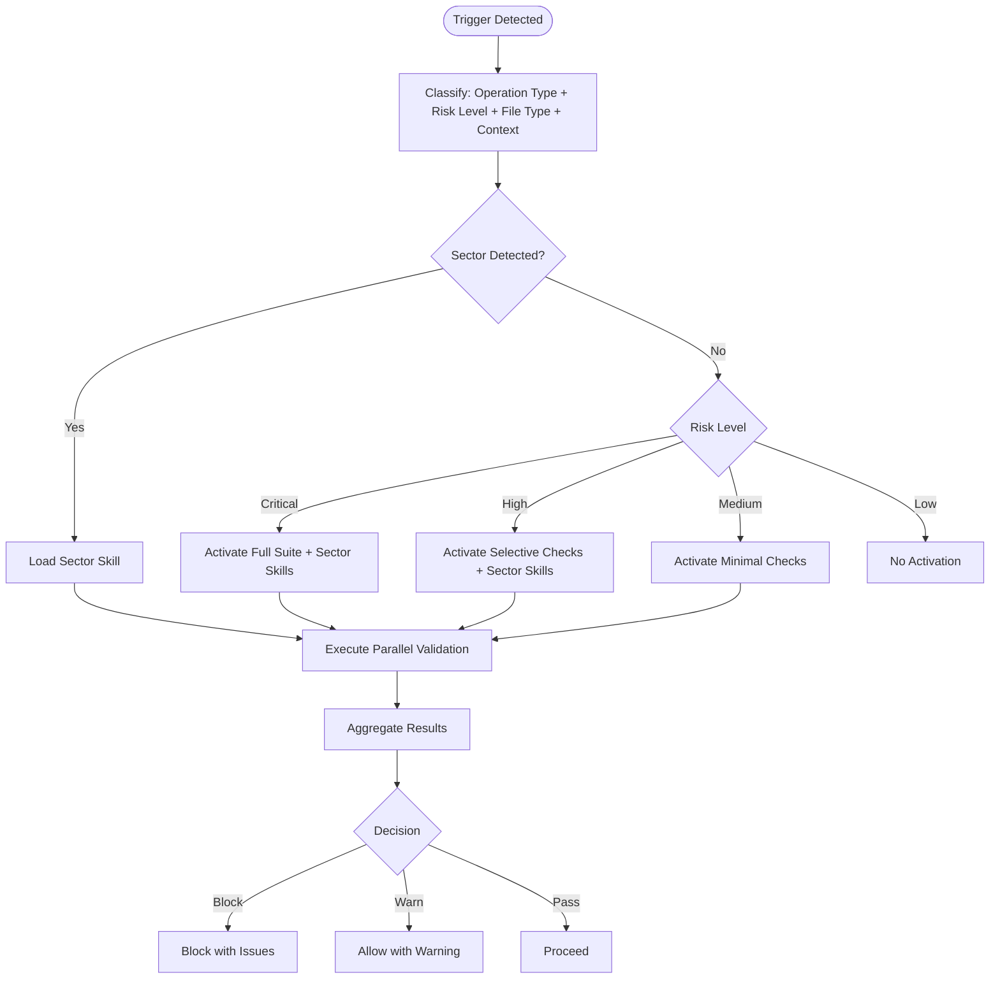
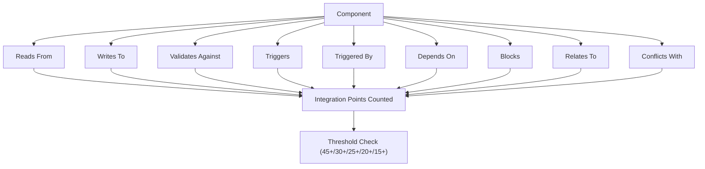
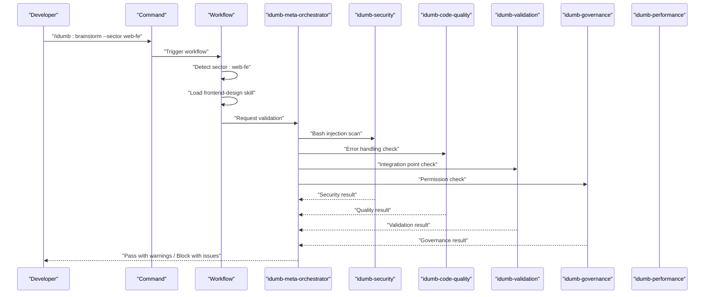
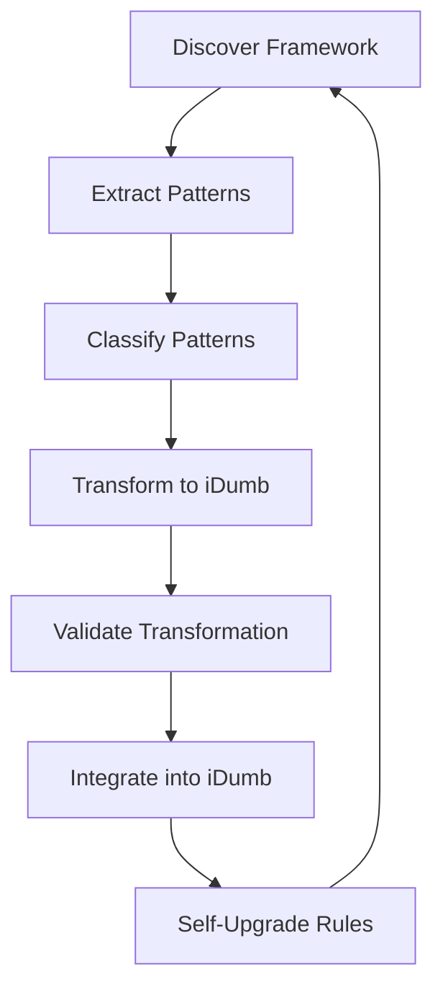
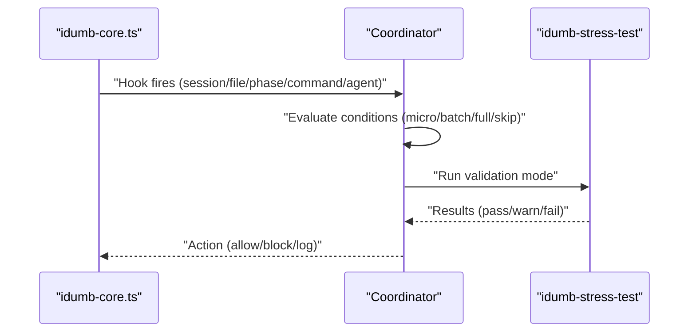
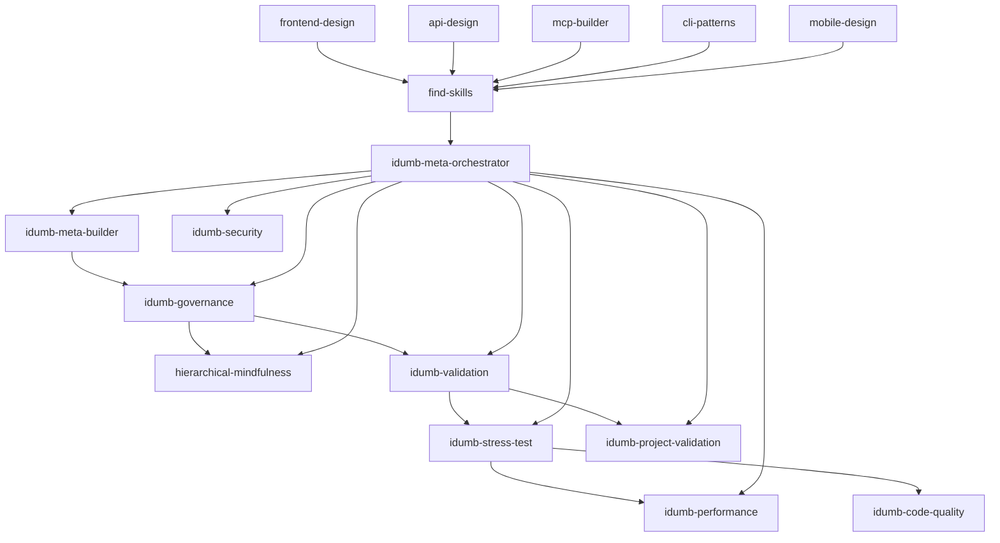

# Skill Architecture Overview

<cite>
**Referenced Files in This Document**
- [SKILL-ARCHITECTURE.md](file://src/skills/SKILL-ARCHITECTURE.md)
- [brainstorm.md](file://src/workflows/brainstorm.md)
- [idumb-meta-orchestrator/SKILL.md](file://src/skills/idumb-meta-orchestrator/SKILL.md)
- [idumb-validation/SKILL.md](file://src/skills/idumb-validation/SKILL.md)
- [idumb-stress-test/SKILL.md](file://src/skills/idumb-stress-test/SKILL.md)
- [idumb-governance/SKILL.md](file://src/skills/idumb-governance/SKILL.md)
- [idumb-code-quality/SKILL.md](file://src/skills/idumb-code-quality/SKILL.md)
- [idumb-performance/SKILL.md](file://src/skills/idumb-performance/SKILL.md)
- [hierarchical-mindfulness/SKILL.md](file://src/skills/hierarchical-mindfulness/SKILL.md)
- [idumb-project-validation/SKILL.md](file://src/skills/idumb-project-validation/SKILL.md)
- [idumb-meta-builder/SKILL.md](file://src/skills/idumb-meta-builder/SKILL.md)
- [integration-checklist.md](file://src/skills/idumb-meta-builder/references/integration-checklist.md)
- [integration-points-reference.md](file://src/skills/idumb-validation/references/integration-points-reference.md)
- [auto-activation-hooks.md](file://src/skills/idumb-stress-test/references/auto-activation-hooks.md)
- [module-schema.md](file://src/skills/idumb-meta-builder/references/module-schema.md)
- [validation-patterns.md](file://src/skills/idumb-meta-builder/references/validation-patterns.md)
- [frontend-design/SKILL.md](file://.agents/skills/frontend-design/SKILL.md)
- [find-skills/SKILL.md](file://.agents/skills/find-skills/SKILL.md)
</cite>

## Update Summary
**Changes Made**
- Added comprehensive three-layer architecture explanation (Commands → Workflows → Skills)
- Updated sector-based skill discovery system with detailed mappings
- Clarified that skills are domain expertise modules loaded dynamically by workflows
- Enhanced skill registry table with new sector-specific skills
- Updated activation patterns to reflect dynamic skill loading
- Added practical examples of skill discovery and loading workflows

## Table of Contents
1. [Introduction](#introduction)
2. [Three-Layer Architecture](#three-layer-architecture)
3. [Project Structure](#project-structure)
4. [Core Components](#core-components)
5. [Architecture Overview](#architecture-overview)
6. [Detailed Component Analysis](#detailed-component-analysis)
7. [Dependency Analysis](#dependency-analysis)
8. [Performance Considerations](#performance-considerations)
9. [Troubleshooting Guide](#troubleshooting-guide)
10. [Conclusion](#conclusion)
11. [Appendices](#appendices)

## Introduction
This document presents the iDumb skill architecture overview, detailing the foundational principles, the 10 complementary skills, non-overlapping design philosophy, integration thresholds, and activation patterns. The architecture now emphasizes a clear three-layer separation: Commands (user entry points), Workflows (execution logic), and Skills (domain expertise). It explains how the idumb-meta-orchestrator automatically coordinates validation across skills based on operation type, risk level, file type, and context. The system now includes sector-based skill discovery that maps technical domains to specialized skills like frontend-design, api-design, and mcp-builder. It also covers the integration point validation system, minimum point requirements, and practical activation scenarios, concluding with consolidation recommendations and maintenance guidelines.

## Three-Layer Architecture
The iDumb framework implements a clear three-layer architecture where each layer has distinct responsibilities:

### Command Layer
Commands serve as user-facing entry points that handle routing and parameter processing. They trigger workflows based on user intent and provide the initial context for skill loading.

### Workflow Layer  
Workflows contain the step-by-step execution logic and manage state transitions. They analyze the request context, detect required sectors, and dynamically load appropriate domain skills.

### Skill Layer
Skills represent domain expertise modules that provide specialized knowledge and capabilities. They are loaded dynamically by workflows based on detected sectors and user requirements.



**Diagram sources**
- [SKILL-ARCHITECTURE.md](file://src/skills/SKILL-ARCHITECTURE.md#L15-L47)
- [brainstorm.md](file://src/workflows/brainstorm.md#L88-L127)

**Section sources**
- [SKILL-ARCHITECTURE.md](file://src/skills/SKILL-ARCHITECTURE.md#L9-L47)

## Project Structure
The iDumb framework organizes governance, validation, security, performance, and meta capabilities into discrete skills. Each skill defines its purpose, integration points, activation rules, and validation layers. The meta-orchestrator coordinates activation across these skills to ensure context-aware, risk-based validation. The system now includes sector-based skill discovery that maps technical domains to specialized skills.



**Diagram sources**
- [SKILL-ARCHITECTURE.md](file://src/skills/SKILL-ARCHITECTURE.md#L77-L91)
- [brainstorm.md](file://src/workflows/brainstorm.md#L100-L124)

**Section sources**
- [SKILL-ARCHITECTURE.md](file://src/skills/SKILL-ARCHITECTURE.md#L73-L91)

## Core Components
The iDumb skill system comprises 10 complementary skills organized by domain and purpose, with sector-based specialization:

- **idumb-meta-orchestrator (META)**: Master coordinator that activates other skills based on context, operation type, and risk level.
- **idumb-security (SECURITY)**: Validates security posture (injection, traversal, permissions).
- **idumb-code-quality (CODE-QUALITY)**: Enforces error handling, cross-platform compatibility, and documentation.
- **idumb-performance (PERFORMANCE)**: Optimizes scanning efficiency, enforces iteration limits, and manages cleanup.
- **idumb-validation (VALIDATION)**: Iterative gap detection, integration completeness, and self-healing workflows.
- **idumb-governance (GOVERNANCE)**: Defines agent categories, delegation hierarchy, and state management.
- **hierarchical-mindfulness (MINDFULNESS)**: Maintains chain integrity, delegation depth, and session resumption.
- **idumb-project-validation (PROJECT)**: Validates user projects (greenfield/brownfield) without blocking development.
- **idumb-stress-test (META)**: Validates agent coordination, integration completeness, and regression prevention.
- **idumb-meta-builder (META)**: Ingests external frameworks and transforms them into iDumb-compatible governance patterns.

**Updated** Added sector-specific skills including frontend-design, api-design, mcp-builder, cli-patterns, mobile-design, and find-skills for dynamic skill discovery.

**Section sources**
- [SKILL-ARCHITECTURE.md](file://src/skills/SKILL-ARCHITECTURE.md#L77-L91)

## Architecture Overview
The idumb-meta-orchestrator serves as the central decision-maker, selecting which validation skills to activate depending on:
- Operation type (write, delegate, transition, cleanup)
- Risk level (Critical, High, Medium, Low)
- File type (.sh, .ts, .md)
- Context (phase boundaries, session state, resource usage)

The system now includes dynamic skill discovery where workflows detect sectors and load appropriate domain expertise skills. Higher risk operations trigger broader validation sets.



**Diagram sources**
- [SKILL-ARCHITECTURE.md](file://src/skills/SKILL-ARCHITECTURE.md#L39-L47)
- [brainstorm.md](file://src/workflows/brainstorm.md#L88-L127)

**Section sources**
- [SKILL-ARCHITECTURE.md](file://src/skills/SKILL-ARCHITECTURE.md#L179-L207)

## Detailed Component Analysis

### Skill Registry and Domain Coverage
The registry table defines each skill's package, primary domain, and integration threshold. The domain coverage matrix maps skills to their coverage areas, ensuring non-overlapping responsibilities with sector-based specialization.

```mermaid
table
title Enhanced Skill Registry with Sector Skills
"Skill" "Package" "Primary Domain" "Integration Threshold"
"idumb-meta-orchestrator" "META" "Coordination - activates other skills based on context" "30+"
"idumb-security" "SECURITY" "Security validation (injection, traversal, permissions)" "20+"
"idumb-code-quality" "CODE-QUALITY" "Error handling, cross-platform, documentation" "20+"
"idumb-performance" "PERFORMANCE" "Efficiency, cleanup, iteration limits" "15+"
"idumb-validation" "VALIDATION" "Integration points, gap detection, completeness" "25+"
"idumb-governance" "GOVERNANCE" "Hierarchy, delegation, state management" "25+"
"hierarchical-mindfulness" "MINDFULNESS" "Chain integrity, delegation depth" "20+"
"idumb-project-validation" "PROJECT" "Greenfield/brownfield, health checks" "20+"
"idumb-stress-test" "META" "Agent coordination, regression sweeps" "25+"
"idumb-meta-builder" "META" "Framework ingestion, transformation" "30+"
"frontend-design" "SECTOR" "UI patterns, components, styling" "20+"
"api-design" "SECTOR" "API patterns, architecture" "20+"
"mcp-builder" "SECTOR" "AI/ML agent patterns" "20+"
"cli-patterns" "SECTOR" "CLI UX patterns" "20+"
"mobile-design" "SECTOR" "Mobile app patterns" "20+"
"find-skills" "SECTOR" "Discover appropriate skill" "15+"
```

**Diagram sources**
- [SKILL-ARCHITECTURE.md](file://src/skills/SKILL-ARCHITECTURE.md#L77-L91)

```mermaid
table
title Enhanced Domain Coverage Matrix with Sector Skills
"Domain" "Skills" "Coverage"
"Security" "idumb-security, idumb-governance" "Bash injection, path traversal, permissions, secrets"
"Code Quality" "idumb-code-quality" "Error handling, cross-platform, documentation, standards"
"Performance" "idumb-performance" "Efficient scanning, cleanup policies, iteration limits"
"Integration" "idumb-validation, idumb-stress-test" "Integration points, gap detection, regression"
"Governance" "idumb-governance, hierarchical-mindfulness" "Hierarchy, delegation, chain integrity, state"
"Project" "idumb-project-validation" "Greenfield/brownfield, health monitoring"
"Coordination" "idumb-meta-orchestrator" "Context-aware skill activation"
"Meta" "idumb-meta-builder" "Framework ingestion and transformation"
"Web Frontend" "frontend-design, find-skills" "UI patterns, components, styling, responsive design"
"Web Backend" "api-design, find-skills" "API patterns, architecture, REST endpoints"
"AI/ML" "mcp-builder, find-skills" "Agent patterns, LLM integration, prompt engineering"
"CLI Applications" "cli-patterns, find-skills" "Command patterns, argument parsing, UX design"
"Mobile Apps" "mobile-design, find-skills" "Mobile patterns, touch interactions, platform-specific design"
"Skill Discovery" "find-skills" "Dynamic skill finding and installation"
```

**Diagram sources**
- [SKILL-ARCHITECTURE.md](file://src/skills/SKILL-ARCHITECTURE.md#L94-L106)

**Section sources**
- [SKILL-ARCHITECTURE.md](file://src/skills/SKILL-ARCHITECTURE.md#L77-L106)

### Sector-Based Skill Discovery System
The system now implements dynamic skill discovery that maps technical sectors to specialized skills:

#### Sector Detection Process
1. **Detect sector** from codebase analysis, user flags, or keyword extraction
2. **Map sector to skill** using predefined sector-to-skill mappings
3. **Check local skills** availability in the skills directory
4. **Discover missing skills** via find-skills pattern
5. **Load skill context** for domain-specific guidance

#### Sector-to-Skill Mapping
| Sector | Skill to Load | Expertise Provided |
|--------|---------------|-------------------|
| `web-fe` | `frontend-design` | UI patterns, components, styling |
| `web-be` | `api-design` | API patterns, architecture |
| `fullstack` | `frontend-design` + `api-design` | Full stack patterns |
| `aiml` | `mcp-builder` | AI/ML agent patterns |
| `cli` | `cli-patterns` | CLI UX patterns |
| `mobile` | `mobile-design` | Mobile app patterns |
| `unknown` | `find-skills` | Discover appropriate skill |

**Updated** Added comprehensive sector-based skill discovery system with mappings from technical domains to specialized skills.

**Section sources**
- [SKILL-ARCHITECTURE.md](file://src/skills/SKILL-ARCHITECTURE.md#L49-L70)
- [brainstorm.md](file://src/workflows/brainstorm.md#L100-L124)

### Non-Overlapping Design Philosophy
The architecture resolves potential overlaps by assigning distinct purposes:
- **idumb-validation** focuses on framework-level structure and integration completeness.
- **idumb-stress-test** focuses on runtime behavior and coordination.
- **idumb-governance** defines framework structure and permission matrices.
- **hierarchical-mindfulness** tracks session state and chain integrity during execution.
- **Sector skills** provide domain expertise without overlapping with governance functions.

```mermaid
flowchart TD
A["idumb-validation"] --> A1["Structure and integration completeness"]
A --> A2["Component has required integration points"]
A --> A3["Frontmatter schema is valid"]
A --> A4["Required fields present"]
B["idumb-stress-test"] --> B1["Runtime behavior and coordination"]
B --> B2["Agents spawn correctly"]
B --> B3["Delegation chains complete"]
B --> B4["No regressions introduced"]
C["idumb-governance"] --> C1["Governance system architecture"]
C --> C2["Agent category definitions"]
C --> C3["Permission matrix rules"]
C --> C4["State schema validation"]
D["hierarchical-mindfulness"] --> D1["Runtime delegation mindfulness"]
D --> D2["Delegation depth tracking"]
D --> D3["Session resumption protocols"]
D --> D4["Chain violation detection"]
E["Sector Skills"] --> E1["Domain expertise provision"]
E --> E2["Dynamic skill loading"]
E --> E3["Specialized knowledge modules"]
```



**Diagram sources**
- [SKILL-ARCHITECTURE.md](file://src/skills/SKILL-ARCHITECTURE.md#L109-L159)

**Section sources**
- [SKILL-ARCHITECTURE.md](file://src/skills/SKILL-ARCHITECTURE.md#L109-L159)

### Activation Patterns and Matrix
The idumb-meta-orchestrator defines activation matrices by operation type, risk level, and file type. Higher risk operations trigger broader validation sets. The system now includes dynamic skill loading based on detected sectors.



**Diagram sources**
- [SKILL-ARCHITECTURE.md](file://src/skills/SKILL-ARCHITECTURE.md#L179-L207)
- [brainstorm.md](file://src/workflows/brainstorm.md#L88-L127)

**Section sources**
- [SKILL-ARCHITECTURE.md](file://src/skills/SKILL-ARCHITECTURE.md#L179-L207)

### Integration Point Validation System
Each skill must meet minimum integration point thresholds:
- **META agents**: 30+ points (tools, commands, workflows, state files, other skills)
- **Validation skills**: 20+ points (read sources, write targets, validation rules, triggers)
- **Package skills**: 20+ points (package components, integration points, triggers)
- **Sector skills**: 15+ points (domain expertise, examples, references)

The idumb-meta-orchestrator integrates with state, skill registries, and agent definitions, writing governance reports and validation queues.



**Diagram sources**
- [SKILL-ARCHITECTURE.md](file://src/skills/SKILL-ARCHITECTURE.md#L211-L251)

**Section sources**
- [SKILL-ARCHITECTURE.md](file://src/skills/SKILL-ARCHITECTURE.md#L211-L251)

### Practical Activation Scenarios
Common activation scenarios include:
- **Pre-write validation**: Security, code quality, validation, governance checks before file writes.
- **Phase transition**: Full integration scan, stress test, performance check at phase boundaries.
- **Continuous monitoring**: Periodic resource usage, governance state consistency, drift detection.
- **Dynamic skill loading**: Sector detection triggering appropriate domain expertise skills.



**Diagram sources**
- [SKILL-ARCHITECTURE.md](file://src/skills/SKILL-ARCHITECTURE.md#L255-L292)

**Section sources**
- [SKILL-ARCHITECTURE.md](file://src/skills/SKILL-ARCHITECTURE.md#L255-L292)

### Meta-Builder and Framework Ingestion
The idumb-meta-builder ingests external frameworks, classifies patterns, transforms them into iDumb equivalents, validates the transformation, and integrates new components. It supports self-upgrade through feedback loops.



**Diagram sources**
- [idumb-meta-builder/SKILL.md](file://src/skills/idumb-meta-builder/SKILL.md#L135-L321)

**Section sources**
- [idumb-meta-builder/SKILL.md](file://src/skills/idumb-meta-builder/SKILL.md#L135-L321)
- [module-schema.md](file://src/skills/idumb-meta-builder/references/module-schema.md#L1-L377)
- [validation-patterns.md](file://src/skills/idumb-meta-builder/references/validation-patterns.md#L1-L389)

### Stress Test and Auto-Activation Hooks
The idumb-stress-test provides micro, batch, and full validation modes. Auto-activation hooks coordinate validation timing based on session, file, phase, command, and agent-spawn events.



**Diagram sources**
- [auto-activation-hooks.md](file://src/skills/idumb-stress-test/references/auto-activation-hooks.md#L131-L166)
- [auto-activation-hooks.md](file://src/skills/idumb-stress-test/references/auto-activation-hooks.md#L205-L246)

**Section sources**
- [auto-activation-hooks.md](file://src/skills/idumb-stress-test/references/auto-activation-hooks.md#L1-L329)

## Dependency Analysis
Skills depend on each other through integration points, governance rules, and the meta-orchestrator. The governance skill defines agent categories and permission matrices; the mindfulness skill enforces chain integrity; validation and stress tests ensure completeness and runtime behavior; performance and code quality optimize and standardize operations. Sector skills depend on the find-skills mechanism for dynamic discovery.



**Diagram sources**
- [SKILL-ARCHITECTURE.md](file://src/skills/SKILL-ARCHITECTURE.md#L77-L91)

**Section sources**
- [SKILL-ARCHITECTURE.md](file://src/skills/SKILL-ARCHITECTURE.md#L77-L91)

## Performance Considerations
- Risk-based activation reduces overhead by escalating checks only when needed.
- Parallel execution of selected validations improves throughput.
- Iteration limits and cleanup policies prevent resource accumulation and infinite loops.
- Continuous monitoring balances background checks with user productivity.
- Dynamic skill loading optimizes memory usage by loading only required domain expertise.
- Sector-based filtering reduces unnecessary skill activation.

## Troubleshooting Guide
Common issues and resolutions:
- **Permission violations**: Validate against governance rules and chain enforcement.
- **Integration gaps**: Use validation matrices to identify missing connections and propose fixes.
- **Drift detection**: Monitor schema and configuration drift; apply self-healing where possible.
- **Infinite loops**: Enforce delegation depth limits and detect circular references.
- **Skill loading failures**: Verify sector detection and skill availability in the skills directory.
- **Missing domain expertise**: Use find-skills to discover and install appropriate sector skills.

**Section sources**
- [SKILL-ARCHITECTURE.md](file://src/skills/SKILL-ARCHITECTURE.md#L322-L328)
- [find-skills/SKILL.md](file://.agents/skills/find-skills/SKILL.md#L58-L109)

## Conclusion
The iDumb skill architecture balances comprehensive validation with non-intrusive operation. The three-layer architecture (Commands → Workflows → Skills) provides clear separation of concerns with dynamic skill loading based on sector detection. The idumb-meta-orchestrator coordinates activation based on risk and context, while integration thresholds and validation layers ensure robust governance. The sector-based skill discovery system enables specialized domain expertise without duplicating functionality. The design philosophy emphasizes non-overlapping domains, defense-in-depth, and continuous self-improvement through meta-learning and self-upgrade.

## Appendices

### Consolidation Recommendations
- **No further consolidation needed**: Each skill has a distinct primary domain with clear separation between commands, workflows, and skills.
- **Cross-references exist for coordination**, not duplication, maintaining the three-layer architecture.
- **The meta-orchestrator prevents redundant checks** by managing activation and dynamic skill loading.
- **Sector skills complement rather than duplicate** governance functions.

**Section sources**
- [SKILL-ARCHITECTURE.md](file://src/skills/SKILL-ARCHITECTURE.md#L296-L318)

### Maintenance Guidelines
- **When adding new validation**: Add to the most specific skill, avoid duplication across the three-layer architecture.
- **When modifying skills**: Update integration point counts and sector mappings.
- **When adding new packages**: Follow the package naming convention (SECURITY, CODE-QUALITY, etc.) and ensure proper layer separation.
- **When triggers change**: Update the meta-orchestrator activation matrix and sector detection logic.
- **When adding sector skills**: Ensure proper integration with the find-skills discovery mechanism.
- **Follow three-layer separation**: Commands trigger workflows, workflows load domain skills, skills provide expertise.

**Section sources**
- [SKILL-ARCHITECTURE.md](file://src/skills/SKILL-ARCHITECTURE.md#L322-L328)