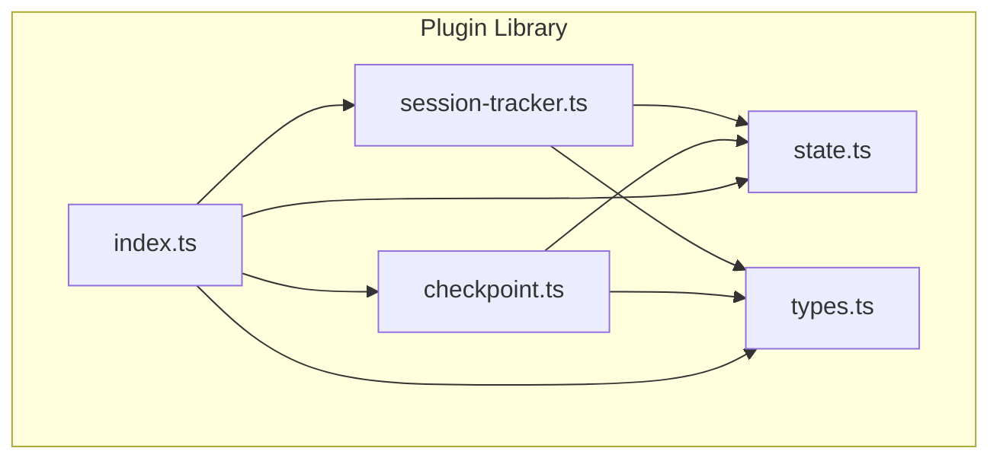
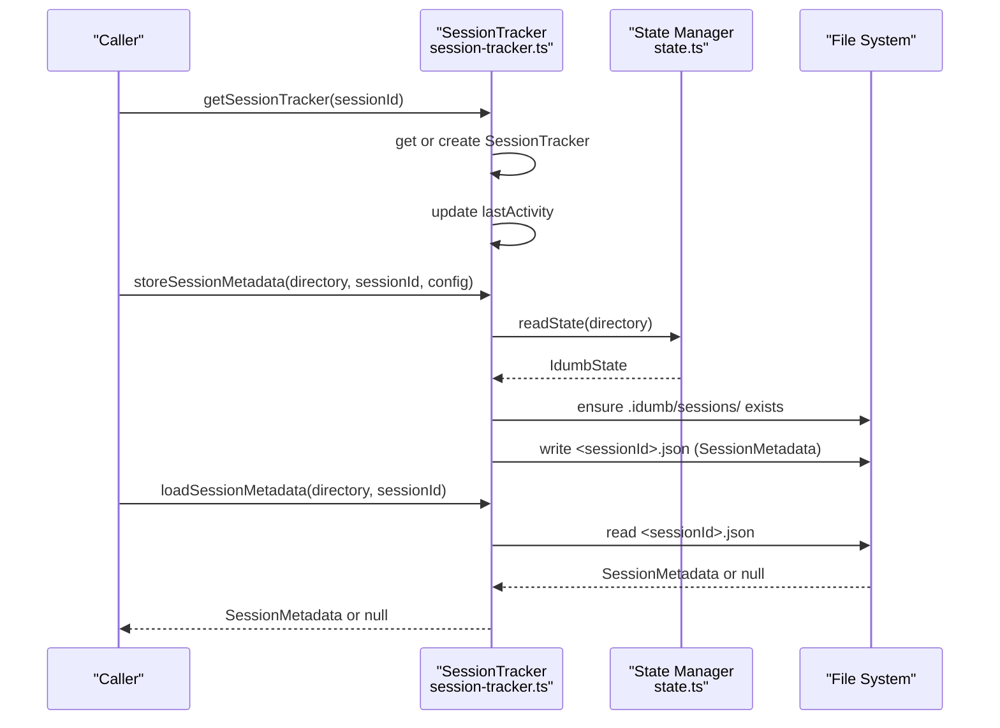
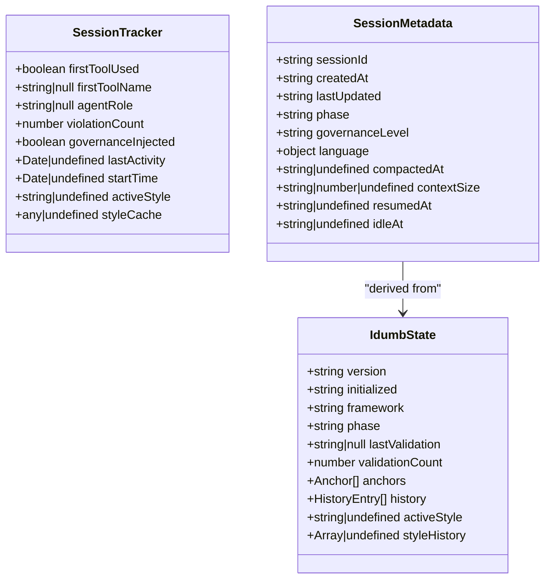
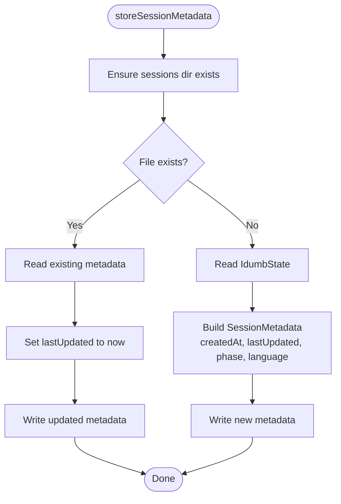
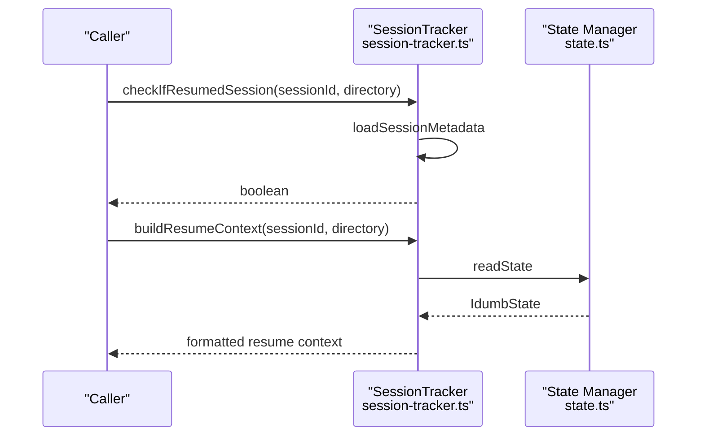
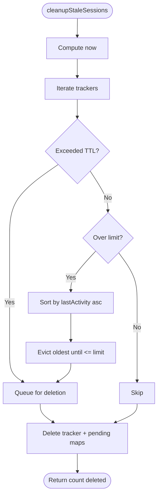
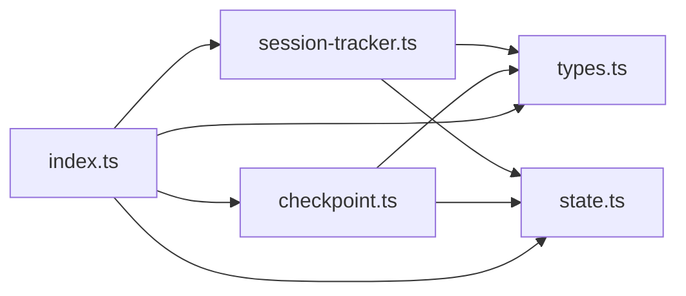

# Session Tracking

<cite>
**Referenced Files in This Document**
- [session-tracker.ts](file://src/plugins/lib/session-tracker.ts)
- [checkpoint.ts](file://src/plugins/lib/checkpoint.ts)
- [state.ts](file://src/plugins/lib/state.ts)
- [types.ts](file://src/plugins/lib/types.ts)
- [index.ts](file://src/plugins/lib/index.ts)
</cite>

## Table of Contents
1. [Introduction](#introduction)
2. [Project Structure](#project-structure)
3. [Core Components](#core-components)
4. [Architecture Overview](#architecture-overview)
5. [Detailed Component Analysis](#detailed-component-analysis)
6. [Dependency Analysis](#dependency-analysis)
7. [Performance Considerations](#performance-considerations)
8. [Troubleshooting Guide](#troubleshooting-guide)
9. [Conclusion](#conclusion)
10. [Appendices](#appendices)

## Introduction
This document describes iDumb’s session tracking system with a focus on long-term session lifecycle management and persistence. It explains the SessionRecord concept (as represented by SessionMetadata and SessionTracker), how sessions are created, updated, exported to persistent storage, listed and filtered, and how garbage collection cleans up stale sessions. It also covers integration with state management, checkpointing, and resumption detection to support extended brain storage workflows.

## Project Structure
The session tracking capability is implemented in a dedicated plugin library module and integrates with state management and checkpoint utilities.

**Diagram sources**
- [session-tracker.ts](file://src/plugins/lib/session-tracker.ts#L1-L385)
- [checkpoint.ts](file://src/plugins/lib/checkpoint.ts#L1-L357)
- [state.ts](file://src/plugins/lib/state.ts#L1-L189)
- [types.ts](file://src/plugins/lib/types.ts#L1-L282)
- [index.ts](file://src/plugins/lib/index.ts#L1-L131)

**Section sources**
- [session-tracker.ts](file://src/plugins/lib/session-tracker.ts#L1-L385)
- [checkpoint.ts](file://src/plugins/lib/checkpoint.ts#L1-L357)
- [state.ts](file://src/plugins/lib/state.ts#L1-L189)
- [types.ts](file://src/plugins/lib/types.ts#L1-L282)
- [index.ts](file://src/plugins/lib/index.ts#L1-L131)

## Core Components
- SessionTracker: In-memory session state used for runtime tracking (first tool usage, agent role, violation counts, governance flags, and timing).
- SessionMetadata: Persistent session metadata stored under .idumb/sessions/<sessionId>.json, including timestamps, phase, governance level, and language settings.
- State integration: Session metadata creation reads the current brain state to derive phase and governance context.
- Resumption detection: Utilities to detect resumed sessions and build resume context using persisted metadata and active anchors.
- Garbage collection: Automatic cleanup of stale sessions based on TTL and maximum session limits.

**Section sources**
- [types.ts](file://src/plugins/lib/types.ts#L213-L245)
- [session-tracker.ts](file://src/plugins/lib/session-tracker.ts#L34-L88)
- [session-tracker.ts](file://src/plugins/lib/session-tracker.ts#L204-L244)
- [session-tracker.ts](file://src/plugins/lib/session-tracker.ts#L269-L332)
- [state.ts](file://src/plugins/lib/state.ts#L34-L45)

## Architecture Overview
The session tracking system orchestrates in-memory tracking and persistent metadata storage, integrates with state management for context, and supports resumption and cleanup workflows.

**Diagram sources**
- [session-tracker.ts](file://src/plugins/lib/session-tracker.ts#L97-L117)
- [session-tracker.ts](file://src/plugins/lib/session-tracker.ts#L204-L244)
- [session-tracker.ts](file://src/plugins/lib/session-tracker.ts#L249-L259)
- [state.ts](file://src/plugins/lib/state.ts#L34-L45)

## Detailed Component Analysis

### SessionRecord and Lifecycle Tracking
- SessionRecord is represented by SessionMetadata for persistent attributes and SessionTracker for in-memory runtime state.
- SessionMetadata fields include identifiers, timestamps, phase, governance level, and language preferences. It also includes lifecycle markers such as compaction and resumption timestamps.
- SessionTracker fields include first tool usage flags, agent role, violation counters, governance injection flags, and timing fields for cleanup and style support.

**Diagram sources**
- [types.ts](file://src/plugins/lib/types.ts#L213-L245)
- [types.ts](file://src/plugins/lib/types.ts#L20-L51)

**Section sources**
- [types.ts](file://src/plugins/lib/types.ts#L213-L245)
- [types.ts](file://src/plugins/lib/types.ts#L20-L51)

### Session Creation and Modification
- getSessionTracker creates or retrieves an in-memory tracker and updates lastActivity on access.
- storeSessionMetadata writes SessionMetadata to .idumb/sessions/<sessionId>.json, updating lastUpdated if the file already exists, otherwise creating it with creation and update timestamps, derived phase, and language settings from state and config.

**Diagram sources**
- [session-tracker.ts](file://src/plugins/lib/session-tracker.ts#L204-L244)
- [state.ts](file://src/plugins/lib/state.ts#L34-L45)

**Section sources**
- [session-tracker.ts](file://src/plugins/lib/session-tracker.ts#L97-L117)
- [session-tracker.ts](file://src/plugins/lib/session-tracker.ts#L204-L244)

### Export to Long-Term Brain Storage
- Session metadata is exported via storeSessionMetadata to disk for long-term brain storage. The metadata includes timestamps, phase, governance level, and language preferences, enabling later resumption and auditability.
- Integration with state ensures phase and governance context are captured consistently.

**Section sources**
- [session-tracker.ts](file://src/plugins/lib/session-tracker.ts#L204-L244)
- [state.ts](file://src/plugins/lib/state.ts#L34-L45)

### Listing and Filtering Sessions
- The current implementation focuses on per-session metadata retrieval and resumption detection rather than listing/filtering multiple sessions. To list sessions, enumerate .idumb/sessions and filter by desired criteria (e.g., date ranges, status-derived heuristics) using loadSessionMetadata and in-memory logic.

**Section sources**
- [session-tracker.ts](file://src/plugins/lib/session-tracker.ts#L249-L259)

### Resumption Detection and Context Building
- checkIfResumedSession determines whether a session qualifies as resumed based on lastUpdated and a time window.
- buildResumeContext composes a human-readable resumption prompt using persisted metadata and active anchors from state.

**Diagram sources**
- [session-tracker.ts](file://src/plugins/lib/session-tracker.ts#L269-L280)
- [session-tracker.ts](file://src/plugins/lib/session-tracker.ts#L286-L332)
- [state.ts](file://src/plugins/lib/state.ts#L34-L45)

**Section sources**
- [session-tracker.ts](file://src/plugins/lib/session-tracker.ts#L269-L280)
- [session-tracker.ts](file://src/plugins/lib/session-tracker.ts#L286-L332)

### Garbage Collection Strategies
- cleanupStaleSessions removes sessions older than a configured TTL and evicts least-recently-active sessions beyond a maximum count. It also clears associated pending denials and violations.

**Diagram sources**
- [session-tracker.ts](file://src/plugins/lib/session-tracker.ts#L54-L88)

**Section sources**
- [session-tracker.ts](file://src/plugins/lib/session-tracker.ts#L47-L88)

### Agent Role Detection and Tool Name Extraction
- detectAgentFromMessages scans message parts to infer agent roles from content.
- extractToolName normalizes tool references to a canonical name for consistent tracking.

**Section sources**
- [session-tracker.ts](file://src/plugins/lib/session-tracker.ts#L174-L194)

### Integration with State Management
- readState and writeState provide atomic state persistence used by session metadata creation and by checkpoint operations.
- addHistoryEntry maintains bounded history for diagnostics and resumption cues.

**Section sources**
- [state.ts](file://src/plugins/lib/state.ts#L34-L45)
- [state.ts](file://src/plugins/lib/state.ts#L51-L73)
- [state.ts](file://src/plugins/lib/state.ts#L79-L101)

### Integration with Checkpointing
- Checkpoint operations rely on state for context and metrics; session metadata complements checkpoints by persisting session-level lifecycle and governance attributes.

**Section sources**
- [checkpoint.ts](file://src/plugins/lib/checkpoint.ts#L135-L139)
- [checkpoint.ts](file://src/plugins/lib/checkpoint.ts#L179-L183)

## Dependency Analysis
The session tracker depends on state management for context and on filesystem operations for metadata persistence. It exposes a barrel export for convenient consumption.

**Diagram sources**
- [session-tracker.ts](file://src/plugins/lib/session-tracker.ts#L10-L21)
- [checkpoint.ts](file://src/plugins/lib/checkpoint.ts#L10-L14)
- [index.ts](file://src/plugins/lib/index.ts#L77-L94)

**Section sources**
- [session-tracker.ts](file://src/plugins/lib/session-tracker.ts#L10-L21)
- [checkpoint.ts](file://src/plugins/lib/checkpoint.ts#L10-L14)
- [index.ts](file://src/plugins/lib/index.ts#L77-L94)

## Performance Considerations
- In-memory tracking uses a Map keyed by sessionId for O(1) access and updates.
- Cleanup runs in linear time relative to the number of tracked sessions; TTL and LRU eviction keep memory footprint bounded.
- Metadata writes are serialized per session and occur on demand (creation/update), minimizing I/O overhead.

[No sources needed since this section provides general guidance]

## Troubleshooting Guide
- Session metadata missing: loadSessionMetadata returns null if the file does not exist or parsing fails; verify the sessionId and sessions directory.
- Stale state warnings: isStateStale computes staleness from state timestamps and configurable thresholds; adjust staleness settings if frequent warnings occur.
- Resumption detection: checkIfResumedSession relies on lastUpdated; ensure storeSessionMetadata is invoked regularly to refresh timestamps.
- Garbage collection: cleanupStaleSessions deletes trackers and related pending maps; confirm TTL and max session limits align with expected workload.

**Section sources**
- [session-tracker.ts](file://src/plugins/lib/session-tracker.ts#L249-L259)
- [session-tracker.ts](file://src/plugins/lib/session-tracker.ts#L362-L384)
- [session-tracker.ts](file://src/plugins/lib/session-tracker.ts#L269-L280)
- [session-tracker.ts](file://src/plugins/lib/session-tracker.ts#L54-L88)

## Conclusion
iDumb’s session tracking system combines in-memory SessionTracker with persistent SessionMetadata to manage long-term session lifecycles. It supports resumption detection, integrates with state for context, and applies disciplined garbage collection to maintain performance. While direct listing and filtering are not implemented here, the modular design enables straightforward extension for broader session management needs.

[No sources needed since this section summarizes without analyzing specific files]

## Appendices

### Example Workflows

- Create or update session metadata
  - Call storeSessionMetadata with the project directory, sessionId, and user language configuration.
  - The function ensures the sessions directory exists and writes JSON metadata with createdAt and lastUpdated timestamps.

- Load session metadata
  - Call loadSessionMetadata with the directory and sessionId to retrieve persisted attributes.

- Detect resumed session
  - Call checkIfResumedSession to determine if a session was idle within the defined window.

- Build resume context
  - Call buildResumeContext to generate a contextual prompt including idle duration, previous session time, current phase, and active anchors.

- Perform garbage collection
  - Invoke cleanupStaleSessions to remove stale sessions and enforce the maximum session limit.

- Export and persistence patterns
  - Persist session metadata to .idumb/sessions/<sessionId>.json for long-term brain storage.
  - Integrate with state management for phase and governance context.

**Section sources**
- [session-tracker.ts](file://src/plugins/lib/session-tracker.ts#L204-L244)
- [session-tracker.ts](file://src/plugins/lib/session-tracker.ts#L249-L259)
- [session-tracker.ts](file://src/plugins/lib/session-tracker.ts#L269-L280)
- [session-tracker.ts](file://src/plugins/lib/session-tracker.ts#L286-L332)
- [session-tracker.ts](file://src/plugins/lib/session-tracker.ts#L54-L88)
- [state.ts](file://src/plugins/lib/state.ts#L34-L45)