# Verification Patterns

<cite>
**Referenced Files in This Document**
- [verification-patterns.md](file://src/references/verification-patterns.md)
- [idumb-verifier.md](file://src/agents/idumb-verifier.md)
- [idumb-low-validator.md](file://src/agents/idumb-low-validator.md)
- [idumb-integration-checker.md](file://src/agents/idumb-integration-checker.md)
- [verify-phase.md](file://src/workflows/verify-phase.md)
- [verification.md](file://src/templates/verification.md)
- [verification-report.md](file://src/templates/verification-report.md)
- [SKILL.md](file://src/skills/idumb-validation/SKILL.md)
- [idumb-validate.ts](file://src/tools/idumb-validate.ts)
- [validate-module.js](file://src/skills/idumb-meta-builder/scripts/validate-module.js)
- [VALIDATION-CHECKLIST-2026-02-02.md](file://docs/VALIDATION-CHECKLIST-2026-02-02.md)
</cite>

## Table of Contents
1. [Introduction](#introduction)
2. [Project Structure](#project-structure)
3. [Core Components](#core-components)
4. [Architecture Overview](#architecture-overview)
5. [Detailed Component Analysis](#detailed-component-analysis)
6. [Dependency Analysis](#dependency-analysis)
7. [Performance Considerations](#performance-considerations)
8. [Troubleshooting Guide](#troubleshooting-guide)
9. [Conclusion](#conclusion)
10. [Appendices](#appendices)

## Introduction
This document defines the comprehensive verification patterns for iDumb's artifact validation system. It establishes a four-level verification hierarchy (Exists, Substantive, Wired, Functional) and explains how each level validates different aspects of implementation quality. It also catalogs universal stub detection patterns, provides specific verification patterns for React/Next.js components, API routes, database schemas, TypeScript tools, and agent profiles, and details wiring verification patterns that trace connections between components, APIs, tools, and commands. Finally, it documents the automated verification script functionality, human verification triggers, and practical verification report formats and quality assurance checklists.

## Project Structure
The verification system is implemented across several layers:
- Agent orchestration and verification logic
- Automated validators and integration checkers
- Workflows that coordinate verification
- Templates for structured reporting
- Tools for governance and validation
- Skills and scripts for validation lifecycle and quality assurance

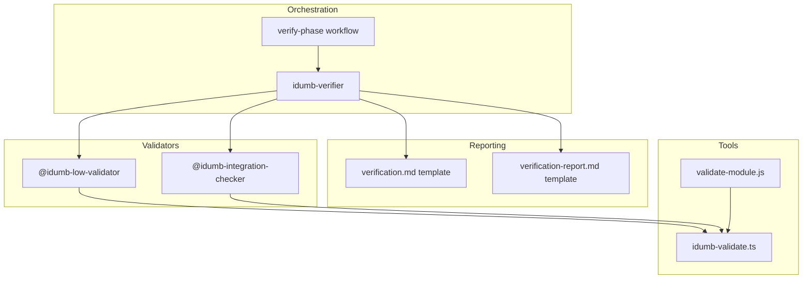

**Diagram sources**
- [idumb-verifier.md](file://src/agents/idumb-verifier.md#L1-L120)
- [idumb-low-validator.md](file://src/agents/idumb-low-validator.md#L1-L80)
- [idumb-integration-checker.md](file://src/agents/idumb-integration-checker.md#L1-L60)
- [verify-phase.md](file://src/workflows/verify-phase.md#L1-L60)
- [verification.md](file://src/templates/verification.md#L1-L60)
- [verification-report.md](file://src/templates/verification-report.md#L1-L60)
- [idumb-validate.ts](file://src/tools/idumb-validate.ts#L1-L60)
- [validate-module.js](file://src/skills/idumb-meta-builder/scripts/validate-module.js#L1-L40)

**Section sources**
- [idumb-verifier.md](file://src/agents/idumb-verifier.md#L1-L120)
- [idumb-low-validator.md](file://src/agents/idumb-low-validator.md#L1-L80)
- [idumb-integration-checker.md](file://src/agents/idumb-integration-checker.md#L1-L60)
- [verify-phase.md](file://src/workflows/verify-phase.md#L1-L60)
- [verification.md](file://src/templates/verification.md#L1-L60)
- [verification-report.md](file://src/templates/verification-report.md#L1-L60)
- [idumb-validate.ts](file://src/tools/idumb-validate.ts#L1-L60)
- [validate-module.js](file://src/skills/idumb-meta-builder/scripts/validate-module.js#L1-L40)

## Core Components
- Four-level verification hierarchy: Exists, Substantive, Wired, Functional
- Universal stub detection patterns for comments, placeholders, empty implementations, and hardcoded values
- Artifact-specific verification patterns for React/Next.js, API routes, database schemas, TypeScript tools, and agent profiles
- Wiring verification patterns for tracing component-to-API, API-to-database, agent-to-tool, and command-to-agent connections
- Automated verification scripts and human verification triggers
- Structured verification report formats and quality assurance checklists

**Section sources**
- [verification-patterns.md](file://src/references/verification-patterns.md#L1-L60)
- [idumb-verifier.md](file://src/agents/idumb-verifier.md#L125-L235)
- [idumb-low-validator.md](file://src/agents/idumb-low-validator.md#L371-L412)

## Architecture Overview
The verification architecture follows a goal-backward methodology:
- Start from the phase goal and derive observable truths
- Map truths to required artifacts and critical connections
- Execute four-level verification (Exists → Substantive → Wired → Functional)
- Delegate read-only checks to @idumb-low-validator and wiring checks to @idumb-integration-checker
- Generate structured verification reports with evidence and gaps

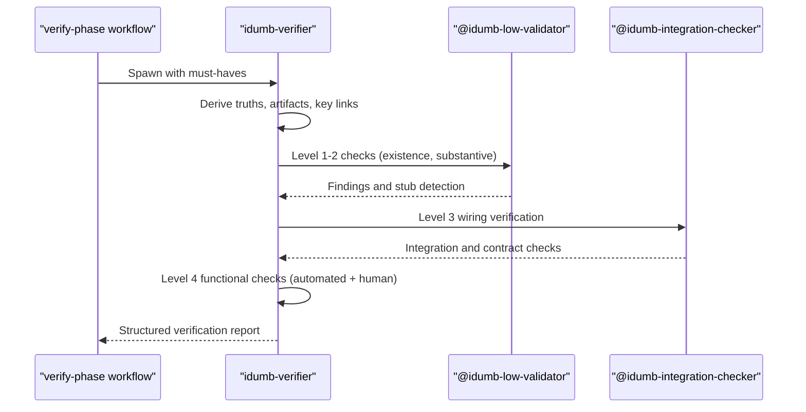

**Diagram sources**
- [verify-phase.md](file://src/workflows/verify-phase.md#L189-L250)
- [idumb-verifier.md](file://src/agents/idumb-verifier.md#L447-L506)
- [idumb-low-validator.md](file://src/agents/idumb-low-validator.md#L497-L530)
- [idumb-integration-checker.md](file://src/agents/idumb-integration-checker.md#L494-L542)

**Section sources**
- [verify-phase.md](file://src/workflows/verify-phase.md#L189-L250)
- [idumb-verifier.md](file://src/agents/idumb-verifier.md#L447-L506)
- [idumb-low-validator.md](file://src/agents/idumb-low-validator.md#L497-L530)
- [idumb-integration-checker.md](file://src/agents/idumb-integration-checker.md#L494-L542)

## Detailed Component Analysis

### Four-Level Verification Hierarchy
The four-level hierarchy ensures comprehensive validation:
- Level 1 (Exists): Artifact presence at expected path
- Level 2 (Substantive): Real implementation, not placeholder or stub
- Level 3 (Wired): Connected to the rest of the system (imports/usage, API consumers, etc.)
- Level 4 (Functional): Actually works when invoked (automated tests or human verification)

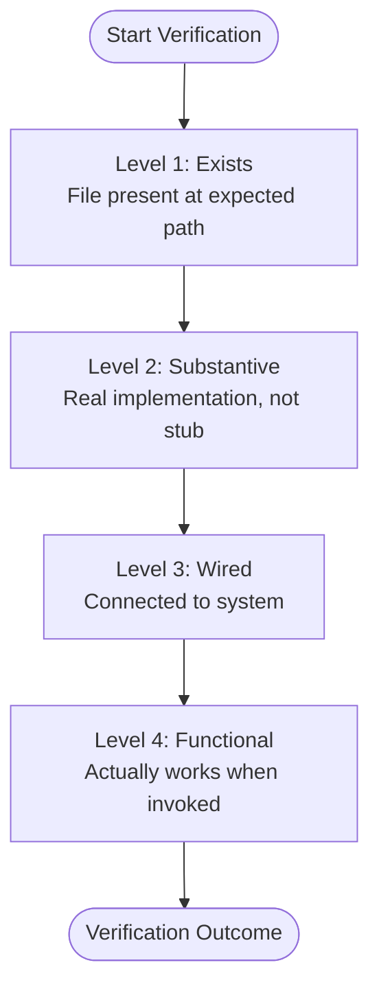

**Diagram sources**
- [idumb-verifier.md](file://src/agents/idumb-verifier.md#L125-L235)
- [verification-patterns.md](file://src/references/verification-patterns.md#L18-L33)

**Section sources**
- [idumb-verifier.md](file://src/agents/idumb-verifier.md#L125-L235)
- [verification-patterns.md](file://src/references/verification-patterns.md#L18-L33)

### Universal Stub Detection Patterns
Universal stub detection identifies placeholder code across all artifact types:
- Comment-based stubs: TODO, FIXME, XXX, HACK, PLACEHOLDER, and phrases like "implement later"
- Placeholder text in output: placeholder, lorem ipsum, coming soon, under construction, sample, example, test data, dummy
- Empty or trivial implementations: return null/undefined/{}[], pass, ..., nothing, console.log-only functions
- Hardcoded values where dynamic expected: hardcoded string IDs, counts, lengths, display values

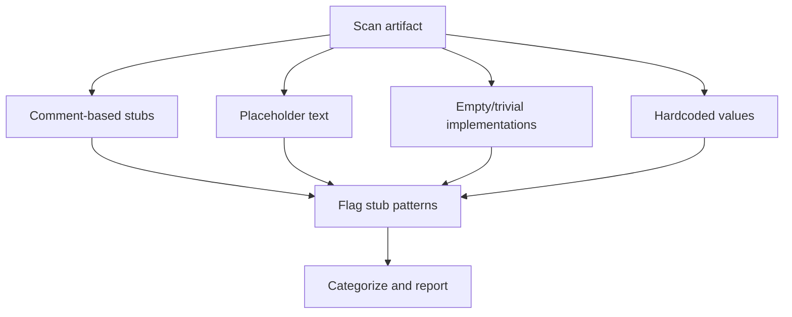

**Diagram sources**
- [verification-patterns.md](file://src/references/verification-patterns.md#L35-L73)
- [idumb-verifier.md](file://src/agents/idumb-verifier.md#L237-L324)

**Section sources**
- [verification-patterns.md](file://src/references/verification-patterns.md#L35-L73)
- [idumb-verifier.md](file://src/agents/idumb-verifier.md#L237-L324)

### React/Next.js Components Verification
React/Next.js component verification includes:
- Existence: file exists and exports a component
- Substantive: returns actual JSX, meaningful content, uses props/state, not static or stubs
- Wiring: imports dependencies, uses props, calls APIs/data-fetching methods
- Functional: renders visible content, interactive elements respond, data loads and displays, error states show appropriately

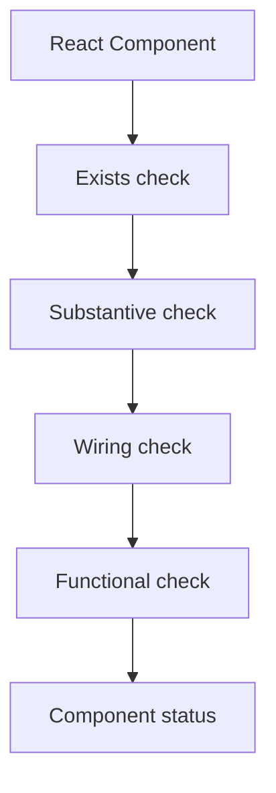

**Diagram sources**
- [verification-patterns.md](file://src/references/verification-patterns.md#L75-L131)
- [idumb-verifier.md](file://src/agents/idumb-verifier.md#L566-L612)

**Section sources**
- [verification-patterns.md](file://src/references/verification-patterns.md#L75-L131)
- [idumb-verifier.md](file://src/agents/idumb-verifier.md#L566-L612)

### API Routes Verification
API route verification includes:
- Existence: route file exists and exports HTTP method handlers
- Substantive: more than threshold lines, interacts with data source, has error handling, returns meaningful response
- Wiring: imports database/service clients, uses request body, validates input
- Functional: automated tests pass, curl responses valid

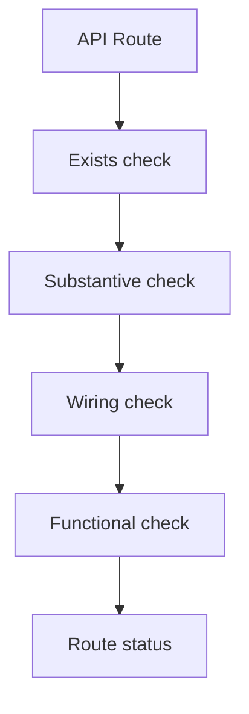

**Diagram sources**
- [verification-patterns.md](file://src/references/verification-patterns.md#L133-L198)
- [idumb-verifier.md](file://src/agents/idumb-verifier.md#L566-L612)

**Section sources**
- [verification-patterns.md](file://src/references/verification-patterns.md#L133-L198)
- [idumb-verifier.md](file://src/agents/idumb-verifier.md#L566-L612)

### Database Schema Verification
Schema verification includes:
- Existence: schema file exists and model/table defined
- Substantive: expected fields, relationships, diverse field types
- Wiring: migrations exist and applied, client generated
- Functional: schema validation passes, migrations successful

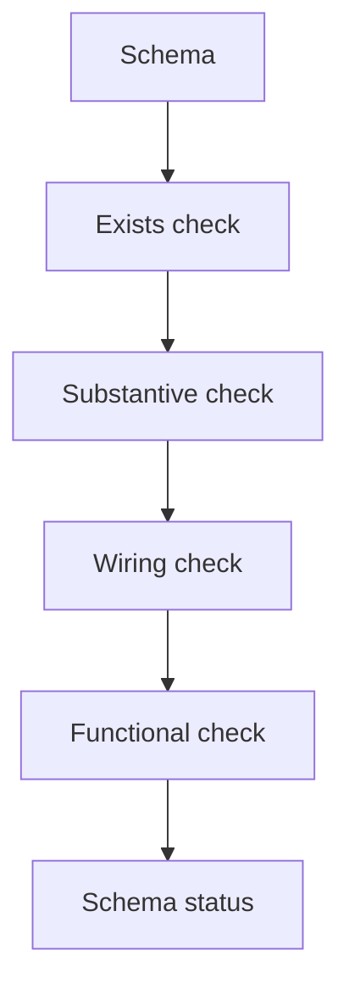

**Diagram sources**
- [verification-patterns.md](file://src/references/verification-patterns.md#L200-L255)

**Section sources**
- [verification-patterns.md](file://src/references/verification-patterns.md#L200-L255)

### TypeScript Tools Verification
Tool verification includes:
- Existence: tool file exists and exports tool wrapper
- Substantive: parameter schema, actual implementation, minimum lines
- Wiring: exported from tools index, used by at least one agent
- Functional: automated tests pass, tool executes without errors

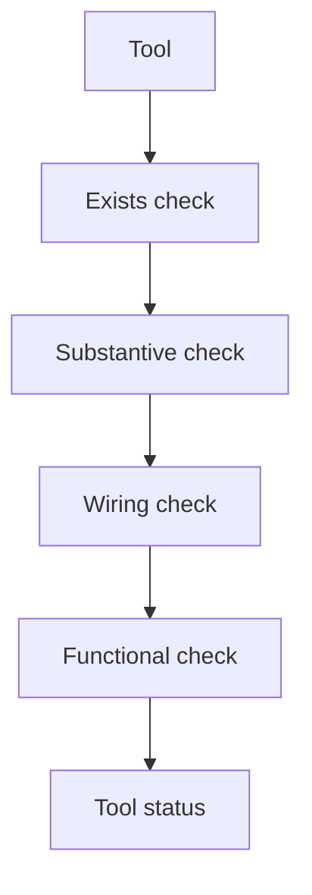

**Diagram sources**
- [verification-patterns.md](file://src/references/verification-patterns.md#L257-L291)
- [idumb-validate.ts](file://src/tools/idumb-validate.ts#L722-L754)

**Section sources**
- [verification-patterns.md](file://src/references/verification-patterns.md#L257-L291)
- [idumb-validate.ts](file://src/tools/idumb-validate.ts#L722-L754)

### Agent Profiles Verification
Agent profile verification includes:
- Existence: file exists and has YAML frontmatter
- Substantive: 4-field persona (Role, Identity, Communication Style, Principles)
- Wiring: referenced in commands, listed in config
- Functional: agent operates according to persona and permissions

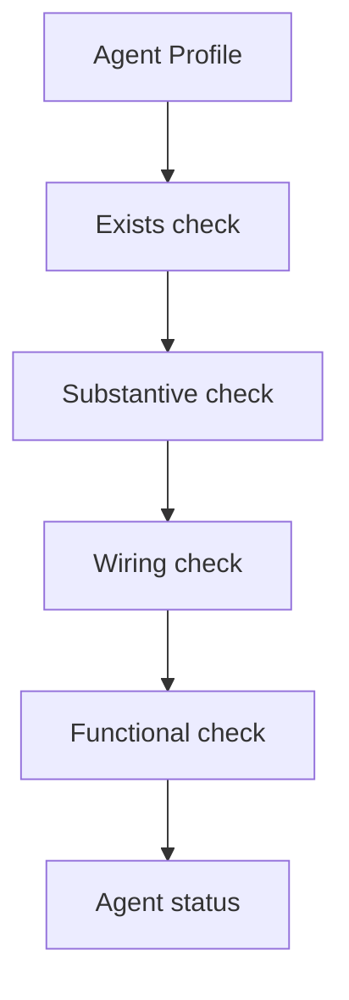

**Diagram sources**
- [verification-patterns.md](file://src/references/verification-patterns.md#L293-L347)

**Section sources**
- [verification-patterns.md](file://src/references/verification-patterns.md#L293-L347)

### Wiring Verification Patterns
Wiring verification ensures components actually communicate:
- Component → API: fetch/axios calls exist and response is used
- API → Database: database calls exist and awaited, result returned
- Agent → Tool: tool listed in frontmatter and used in workflow
- Command → Agent: agent specified and workflow triggers it

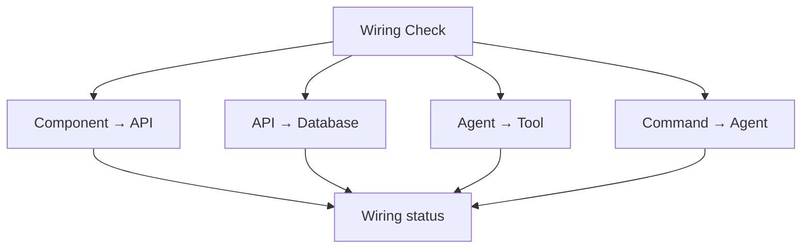

**Diagram sources**
- [verification-patterns.md](file://src/references/verification-patterns.md#L349-L409)
- [idumb-integration-checker.md](file://src/agents/idumb-integration-checker.md#L108-L258)

**Section sources**
- [verification-patterns.md](file://src/references/verification-patterns.md#L349-L409)
- [idumb-integration-checker.md](file://src/agents/idumb-integration-checker.md#L108-L258)

### Automated Verification Script Functionality
Automated verification scripts support:
- Existence checks: file presence
- Stub detection: universal patterns
- Wiring checks: component-to-API tracing
- Substantive checks: line counts and pattern matching
- Agent persona validation: 4-field completeness

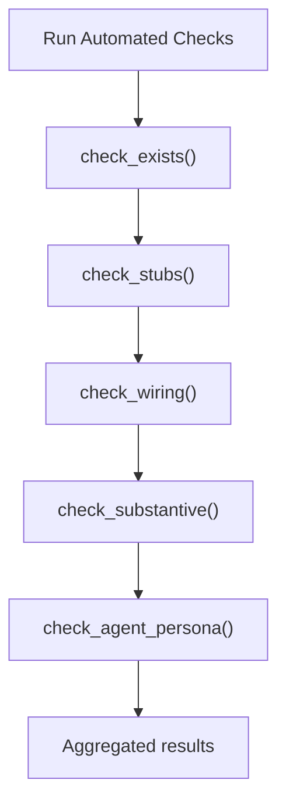

**Diagram sources**
- [verification-patterns.md](file://src/references/verification-patterns.md#L464-L511)
- [idumb-low-validator.md](file://src/agents/idumb-low-validator.md#L371-L412)

**Section sources**
- [verification-patterns.md](file://src/references/verification-patterns.md#L464-L511)
- [idumb-low-validator.md](file://src/agents/idumb-low-validator.md#L371-L412)

### Human Verification Triggers
Human verification is required for:
- Visual appearance and layout
- Interactive user flows
- Real-time behavior (WebSocket, SSE)
- External service integration
- Error message quality and clarity
- Performance feel and responsiveness
- Accessibility and mobile responsiveness

**Section sources**
- [verification-patterns.md](file://src/references/verification-patterns.md#L513-L549)
- [idumb-verifier.md](file://src/agents/idumb-verifier.md#L614-L651)

### Verification Report Formats and Quality Assurance Checklists
Verification reports include:
- Summary with pass rates and statuses
- Criteria results with evidence citations
- Evidence mapping and cross-reference with plan
- Recommendations and next actions
- YAML frontmatter with structured metadata

Quality assurance checklists:
- Component checklist: file existence, exports, JSX, no placeholders, props/state usage, event handlers, imports, usage
- API route checklist: file existence, handlers, substantive lines, database/service queries, meaningful responses, error handling, input validation, frontend calls
- Agent checklist: file existence, YAML frontmatter, 4-field persona, role/identity/style/principles, config listing, command references
- Tool checklist: file existence, tool wrapper export, parameter schema, substantive implementation, exports, agent usage
- Wiring checklist: component→API, API→database, agent→tool, command→agent, form→handler, state→render

**Section sources**
- [verification.md](file://src/templates/verification.md#L1-L171)
- [verification-report.md](file://src/templates/verification-report.md#L1-L159)
- [verification-patterns.md](file://src/references/verification-patterns.md#L411-L462)

## Dependency Analysis
The verification system relies on:
- Agent delegation: idumb-verifier spawns idumb-low-validator and idumb-integration-checker
- Tool integration: idumb-validate.ts provides governance and validation capabilities
- Workflow coordination: verify-phase.md orchestrates goal-backward verification
- Template-driven reporting: verification.md and verification-report.md standardize outputs

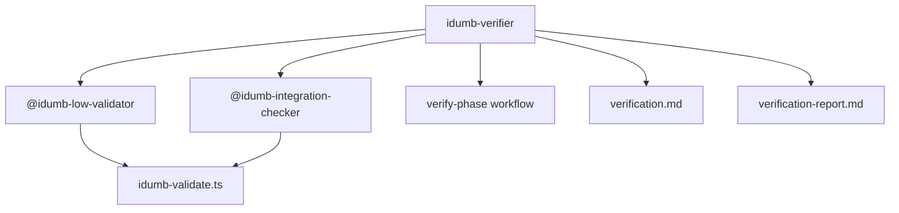

**Diagram sources**
- [idumb-verifier.md](file://src/agents/idumb-verifier.md#L1-L80)
- [idumb-low-validator.md](file://src/agents/idumb-low-validator.md#L1-L45)
- [idumb-integration-checker.md](file://src/agents/idumb-integration-checker.md#L1-L38)
- [verify-phase.md](file://src/workflows/verify-phase.md#L1-L20)
- [verification.md](file://src/templates/verification.md#L1-L26)
- [verification-report.md](file://src/templates/verification-report.md#L1-L26)
- [idumb-validate.ts](file://src/tools/idumb-validate.ts#L1-L20)

**Section sources**
- [idumb-verifier.md](file://src/agents/idumb-verifier.md#L1-L80)
- [idumb-low-validator.md](file://src/agents/idumb-low-validator.md#L1-L45)
- [idumb-integration-checker.md](file://src/agents/idumb-integration-checker.md#L1-L38)
- [verify-phase.md](file://src/workflows/verify-phase.md#L1-L20)
- [verification.md](file://src/templates/verification.md#L1-L26)
- [verification-report.md](file://src/templates/verification-report.md#L1-L26)
- [idumb-validate.ts](file://src/tools/idumb-validate.ts#L1-L20)

## Performance Considerations
- Use read-only tools to avoid side effects and maintain deterministic verification
- Prefer grep-based pattern matching for speed and scalability
- Limit scope to reduce execution time (e.g., targeted glob patterns)
- Cache results where appropriate to avoid redundant checks
- Use timeouts for long-running operations to prevent hangs

## Troubleshooting Guide
Common issues and resolutions:
- Missing artifacts: verify expected paths and file naming conventions
- Stub implementations: replace TODOs, remove placeholder text, implement substantive logic
- Orphaned components/APIs: ensure imports and usage exist, trace wiring with grep patterns
- Functional failures: run tests, check API responses, validate database connectivity
- Governance misalignment: verify iDumb state and planning system consistency

**Section sources**
- [idumb-verifier.md](file://src/agents/idumb-verifier.md#L653-L797)
- [idumb-low-validator.md](file://src/agents/idumb-low-validator.md#L595-L626)
- [idumb-integration-checker.md](file://src/agents/idumb-integration-checker.md#L673-L720)

## Conclusion
The iDumb verification system provides a robust, goal-backward methodology to ensure that completed work achieves phase goals rather than merely completing tasks. By enforcing a four-level verification hierarchy, detecting universal stub patterns, and validating wiring and functionality, the system minimizes false positives and ensures high-quality artifact delivery. Structured reporting and quality assurance checklists further enhance transparency and remediation.

## Appendices

### Validation Lifecycle and Quality Assurance
- Iterative gap detection: detect → assess → fix → re-validate → exit when PASS
- Integration point thresholds: 30+ for highest tier, 15+ for middle, 10+ for lowest
- Stall detection and escalation protocols to prevent infinite loops
- Quality assurance checklist covering structure, integration, behavior, and documentation

**Section sources**
- [SKILL.md](file://src/skills/idumb-validation/SKILL.md#L89-L119)
- [SKILL.md](file://src/skills/idumb-validation/SKILL.md#L450-L561)
- [SKILL.md](file://src/skills/idumb-validation/SKILL.md#L564-L607)
- [VALIDATION-CHECKLIST-2026-02-02.md](file://docs/VALIDATION-CHECKLIST-2026-02-02.md#L1-L162)