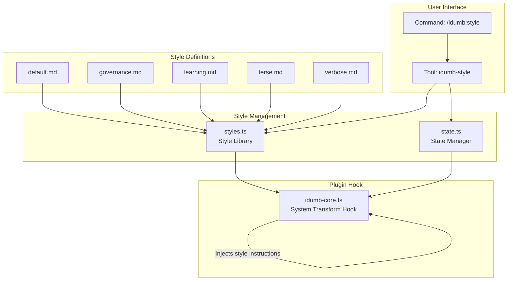
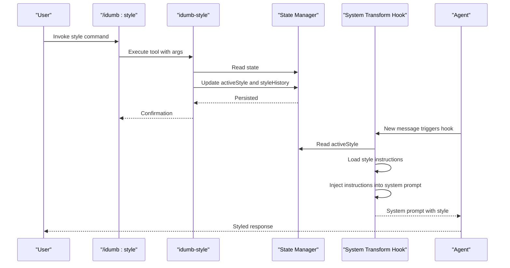
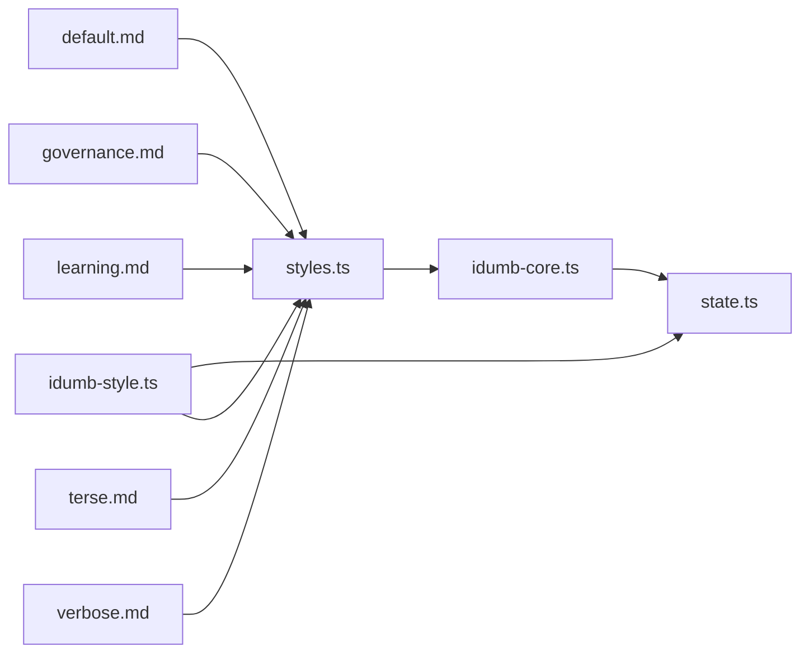

# Style Templates

<cite>
**Referenced Files in This Document**
- [styles.ts](file://src/plugins/lib/styles.ts)
- [idumb-style.ts](file://src/tools/idumb-style.ts)
- [idumb-core.ts](file://src/plugins/idumb-core.ts)
- [style.md](file://src/commands/idumb/style.md)
- [state.ts](file://src/plugins/lib/state.ts)
- [default.md](file://src/templates/styles/default.md)
- [governance.md](file://src/templates/styles/governance.md)
- [learning.md](file://src/templates/styles/learning.md)
- [terse.md](file://src/templates/styles/terse.md)
- [verbose.md](file://src/templates/styles/verbose.md)
- [SKILL.md](file://src/skills/output-style-enforcement/SKILL.md)
</cite>

## Table of Contents
1. [Introduction](#introduction)
2. [Project Structure](#project-structure)
3. [Core Components](#core-components)
4. [Architecture Overview](#architecture-overview)
5. [Detailed Component Analysis](#detailed-component-analysis)
6. [Dependency Analysis](#dependency-analysis)
7. [Performance Considerations](#performance-considerations)
8. [Troubleshooting Guide](#troubleshooting-guide)
9. [Conclusion](#conclusion)
10. [Appendices](#appendices)

## Introduction
This document explains iDumb’s output style templates and how they influence agent behavior. It covers the five built-in styles—default, governance, learning, terse, and verbose—detailing their formatting characteristics, tone, and emphasis. It also describes how to select, customize, and integrate styles with the agent system, and when to use each style for optimal communication effectiveness and user experience.

## Project Structure
The style system is implemented as a layered feature:
- Style definitions live as Markdown files with YAML frontmatter under a dedicated styles directory.
- A style library parses and caches these definitions.
- A CLI command and a tool manage style selection and persistence.
- A plugin hook injects active style instructions into the system prompt for each message.
- A state manager persists the active style and a style history.
- An enforcement skill provides guidance and reminders for style compliance.

**Diagram sources**
- [styles.ts](file://src/plugins/lib/styles.ts#L1-L179)
- [idumb-style.ts](file://src/tools/idumb-style.ts#L1-L196)
- [idumb-core.ts](file://src/plugins/idumb-core.ts#L384-L440)
- [state.ts](file://src/plugins/lib/state.ts#L107-L189)
- [default.md](file://src/templates/styles/default.md#L1-L12)
- [governance.md](file://src/templates/styles/governance.md#L1-L48)
- [learning.md](file://src/templates/styles/learning.md#L1-L34)
- [terse.md](file://src/templates/styles/terse.md#L1-L20)
- [verbose.md](file://src/templates/styles/verbose.md#L1-L34)

**Section sources**
- [styles.ts](file://src/plugins/lib/styles.ts#L1-L179)
- [idumb-style.ts](file://src/tools/idumb-style.ts#L1-L196)
- [idumb-core.ts](file://src/plugins/idumb-core.ts#L384-L440)
- [state.ts](file://src/plugins/lib/state.ts#L107-L189)
- [style.md](file://src/commands/idumb/style.md#L1-L170)

## Core Components
- Style Library: Loads, parses, and caches style definitions; provides listing and active-style loading.
- Style Tools: Programmatic operations to list, set, show details, and reset styles.
- Plugin Hook: Injects active style instructions into the system prompt per message.
- State Manager: Persists active style and maintains a style history.
- Style Definitions: Markdown files with YAML frontmatter defining each style’s behavior and instructions.

Key responsibilities:
- Style Library: Validates and parses style files; defaults to “default” when no custom styles exist.
- Tools: Enforce existence checks and persist changes to state.
- Hook: Idempotently injects active style instructions into the system prompt.
- State: Tracks active style and maintains a bounded history.

**Section sources**
- [styles.ts](file://src/plugins/lib/styles.ts#L145-L179)
- [idumb-style.ts](file://src/tools/idumb-style.ts#L23-L104)
- [idumb-core.ts](file://src/plugins/idumb-core.ts#L384-L440)
- [state.ts](file://src/plugins/lib/state.ts#L107-L189)

## Architecture Overview
The runtime flow for applying a style:
1. User invokes the style command or tool to change the active style.
2. The tool writes the new active style to state and records a style history entry.
3. On subsequent agent messages, the plugin hook reads the active style from state or session tracker.
4. The hook loads the style definition and injects its instructions into the system prompt, guarded by idempotency markers.
5. Agents process the system prompt and produce responses aligned with the selected style.

**Diagram sources**
- [style.md](file://src/commands/idumb/style.md#L63-L103)
- [idumb-style.ts](file://src/tools/idumb-style.ts#L54-L104)
- [state.ts](file://src/plugins/lib/state.ts#L107-L189)
- [idumb-core.ts](file://src/plugins/idumb-core.ts#L384-L440)

## Detailed Component Analysis

### Style Library (styles.ts)
Responsibilities:
- Define StyleConfig and StyleContent interfaces.
- Resolve styles directory path and ensure it exists.
- Parse style files with YAML frontmatter and fallback to raw content if no frontmatter.
- List available styles, including a default entry when none exist.
- Load active style from state and validate style existence.

Parsing behavior:
- If frontmatter exists, extract name, description, keep-coding-instructions, mode, and compatibility.
- If no frontmatter, treat entire file as instructions and default to global mode.

Default style behavior:
- When style name is “default”, return a minimal StyleContent with empty instructions.

Idempotency and caching:
- The plugin hook caches style content per session tracker to avoid repeated file parsing.

**Section sources**
- [styles.ts](file://src/plugins/lib/styles.ts#L16-L27)
- [styles.ts](file://src/plugins/lib/styles.ts#L33-L44)
- [styles.ts](file://src/plugins/lib/styles.ts#L50-L91)
- [styles.ts](file://src/plugins/lib/styles.ts#L122-L160)

### Style Tools (idumb-style.ts)
Capabilities:
- List available styles and highlight the current selection.
- Set the active style with validation and history recording.
- Show detailed information about a style, including instructions preview.
- Reset to default style and record the change.

Persistence:
- Reads and writes state.json to update activeStyle and append styleHistory entries.
- Limits history to 50 entries to prevent unbounded growth.

Error handling:
- Gracefully reports style not found and initialization errors.

**Section sources**
- [idumb-style.ts](file://src/tools/idumb-style.ts#L23-L48)
- [idumb-style.ts](file://src/tools/idumb-style.ts#L54-L104)
- [idumb-style.ts](file://src/tools/idumb-style.ts#L110-L146)
- [idumb-style.ts](file://src/tools/idumb-style.ts#L152-L189)

### Plugin Hook (idumb-core.ts)
Behavior:
- On each message, the hook resolves the active style from session tracker or state.
- Skips injection for the default style.
- Checks for idempotency using a unique marker to avoid duplicating style instructions.
- Loads style instructions via the style library and injects them into the system prompt.

Caching:
- Stores parsed style content in the session tracker to reduce file I/O.

Graceful degradation:
- Errors are logged and the hook continues without style injection.

**Section sources**
- [idumb-core.ts](file://src/plugins/idumb-core.ts#L384-L440)

### State Manager (state.ts)
Fields:
- activeStyle: Current active style name.
- styleHistory: Bounded list of style changes with timestamps.

Operations:
- Read/write state.json safely with atomic rename.
- Create and query style anchors for tracking agent-specific style usage.
- Maintain bounded history to limit memory footprint.

**Section sources**
- [state.ts](file://src/plugins/lib/state.ts#L107-L189)

### Command Definition (/idumb:style)
Usage:
- List styles, switch styles, show style details, and reset to default.
- Requires initialization and styles directory presence.

Format:
- Style files are Markdown with YAML frontmatter containing name, description, keep-coding-instructions, mode, and compatibility.

**Section sources**
- [style.md](file://src/commands/idumb/style.md#L20-L61)
- [style.md](file://src/commands/idumb/style.md#L63-L103)

### Enforcement Skill (output-style-enforcement)
Purpose:
- Provide guidance and reminders for style compliance.
- Detect missing sections, length deviations, and missing format elements.
- Inject reminders into subsequent messages without blocking agent responses.

Integration:
- Works with the system transform hook and state anchors.
- Configurable enforcement thresholds and reminder frequency.

**Section sources**
- [SKILL.md](file://src/skills/output-style-enforcement/SKILL.md#L15-L124)

## Dependency Analysis
The style system depends on:
- Style definitions (Markdown with YAML frontmatter).
- Style library for parsing and caching.
- Tools and state for persistence.
- Plugin hook for runtime injection.

**Diagram sources**
- [styles.ts](file://src/plugins/lib/styles.ts#L1-L179)
- [idumb-core.ts](file://src/plugins/idumb-core.ts#L384-L440)
- [idumb-style.ts](file://src/tools/idumb-style.ts#L1-L196)
- [state.ts](file://src/plugins/lib/state.ts#L107-L189)
- [default.md](file://src/templates/styles/default.md#L1-L12)
- [governance.md](file://src/templates/styles/governance.md#L1-L48)
- [learning.md](file://src/templates/styles/learning.md#L1-L34)
- [terse.md](file://src/templates/styles/terse.md#L1-L20)
- [verbose.md](file://src/templates/styles/verbose.md#L1-L34)

**Section sources**
- [styles.ts](file://src/plugins/lib/styles.ts#L1-L179)
- [idumb-core.ts](file://src/plugins/idumb-core.ts#L384-L440)
- [idumb-style.ts](file://src/tools/idumb-style.ts#L1-L196)
- [state.ts](file://src/plugins/lib/state.ts#L107-L189)

## Performance Considerations
- Caching: The hook caches parsed style content per session tracker to minimize file I/O.
- Idempotency: Unique markers prevent repeated injections, avoiding redundant prompt growth.
- History limits: Style history is bounded to prevent excessive memory usage.
- Graceful degradation: Hook failures do not break other plugins; the system continues without style injection.

[No sources needed since this section provides general guidance]

## Troubleshooting Guide
Common issues and resolutions:
- Style not found: Ensure the style file exists in the styles directory and the name matches exactly. Use the info action to verify availability.
- Not initialized: Run the initialization command before using style commands.
- Style changes not taking effect: Confirm the active style was updated in state and that the hook is running. The change takes effect on the next agent message.
- Corrupted style file: The system falls back to default behavior; fix or remove the problematic file.
- Excessive prompt growth: Idempotency markers prevent duplication; verify markers are present and unique.

**Section sources**
- [idumb-style.ts](file://src/tools/idumb-style.ts#L60-L104)
- [idumb-core.ts](file://src/plugins/idumb-core.ts#L384-L440)

## Conclusion
iDumb’s style templates provide a flexible, extensible way to control agent output formatting and tone. By combining Markdown-based definitions, a robust style library, and a plugin hook that injects instructions into the system prompt, the system ensures consistent, user-driven communication patterns. Choose a style that aligns with the task at hand, persist it via state, and rely on the enforcement skill to guide agents toward compliance.

[No sources needed since this section summarizes without analyzing specific files]

## Appendices

### Style Variants and Their Characteristics
- Default
  - Purpose: Standard iDumb behavior with no additional instructions.
  - Formatting: Neutral, concise, follows governance patterns.
  - Tone: Professional, neutral.
  - Content emphasis: Focused on task completion without extra elaboration.
  - Use cases: Routine tasks, when minimal output is preferred.

- Governance
  - Purpose: Enhanced governance reporting with structured evidence and recommendations.
  - Formatting: Status header, evidence table, sub-delegations table, state changes, recommendations.
  - Tone: Formal, transparent, accountable.
  - Content emphasis: Evidence-based reporting, traceability, and actionable next steps.
  - Use cases: Auditing, compliance reporting, stakeholder updates.

- Learning
  - Purpose: Educational mode focused on user understanding and skill development.
  - Formatting: Concept introduction, decision transparency, interactive elements, summaries.
  - Tone: Explainer-friendly, encouraging, supportive.
  - Content emphasis: Background, trade-offs, and learning outcomes.
  - Use cases: Teaching, onboarding, complex problem explanation.

- Terse
  - Purpose: Minimal output, action-focused responses.
  - Formatting: Bullet points, concise statements, one-line status.
  - Tone: Direct, efficient.
  - Content emphasis: Getting things done quickly.
  - Use cases: Scripted tasks, automation, quick fixes.

- Verbose
  - Purpose: Detailed explanations and reasoning chains.
  - Formatting: Headers, code blocks, inline comments, summarized command outputs.
  - Tone: Comprehensive, instructive.
  - Content emphasis: Full reasoning, context, and teach-as-you-go guidance.
  - Use cases: Deep analysis, documentation, training scenarios.

**Section sources**
- [default.md](file://src/templates/styles/default.md#L1-L12)
- [governance.md](file://src/templates/styles/governance.md#L1-L48)
- [learning.md](file://src/templates/styles/learning.md#L1-L34)
- [terse.md](file://src/templates/styles/terse.md#L1-L20)
- [verbose.md](file://src/templates/styles/verbose.md#L1-L34)

### Style Selection Criteria and Best Practices
- Choose governance for formal reporting and accountability.
- Choose learning for onboarding and education.
- Choose terse for automation and efficiency.
- Choose verbose for deep analysis and documentation.
- Keep default for neutral, standard behavior.
- Persist style changes via state to ensure continuity across messages.

**Section sources**
- [idumb-style.ts](file://src/tools/idumb-style.ts#L54-L104)
- [state.ts](file://src/plugins/lib/state.ts#L107-L189)

### Integration with the Agent System
- Runtime injection: The plugin hook injects active style instructions into the system prompt per message.
- Persistence: Active style and history are stored in state.json.
- Enforcement: The enforcement skill monitors compliance and provides reminders.

**Section sources**
- [idumb-core.ts](file://src/plugins/idumb-core.ts#L384-L440)
- [state.ts](file://src/plugins/lib/state.ts#L107-L189)
- [SKILL.md](file://src/skills/output-style-enforcement/SKILL.md#L15-L124)