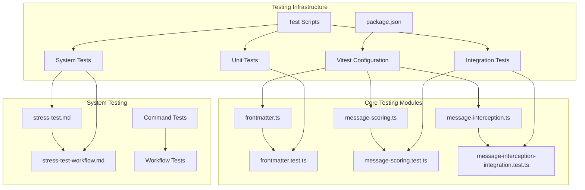
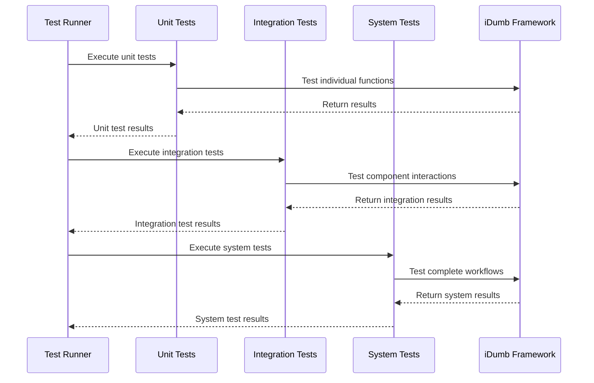
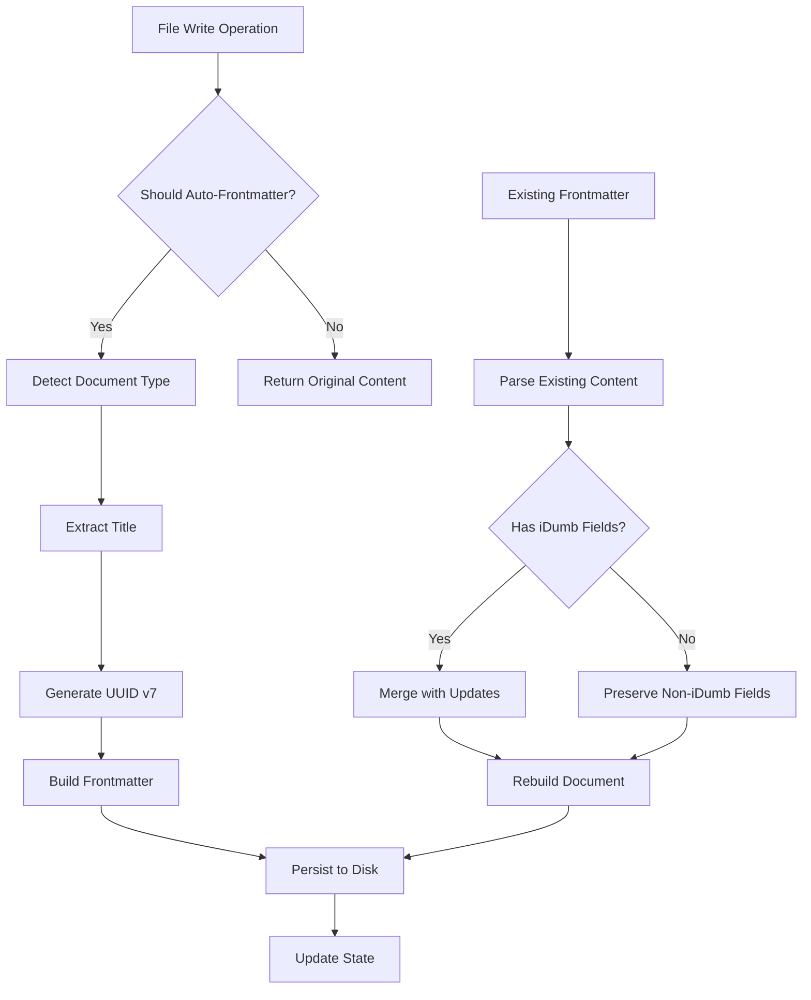
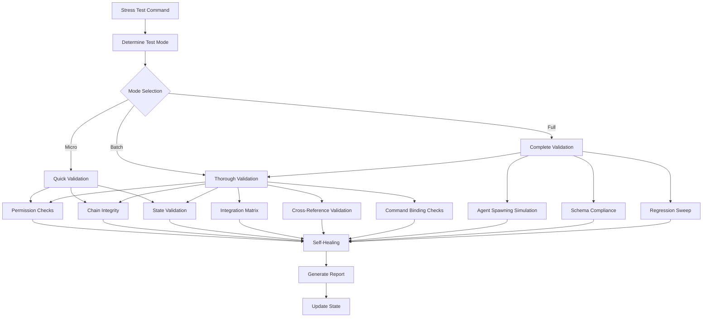
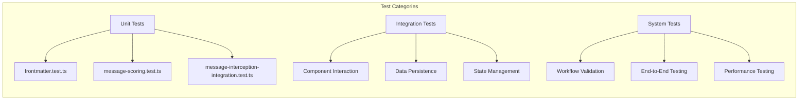
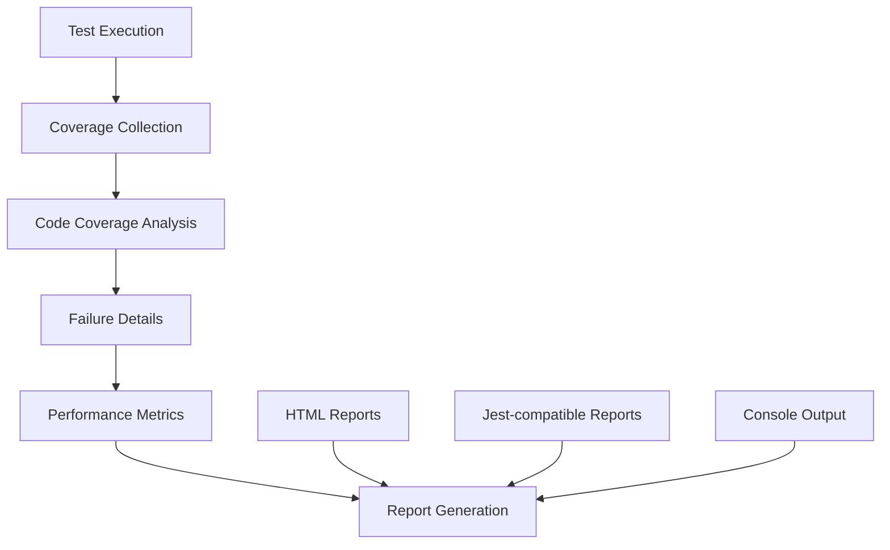
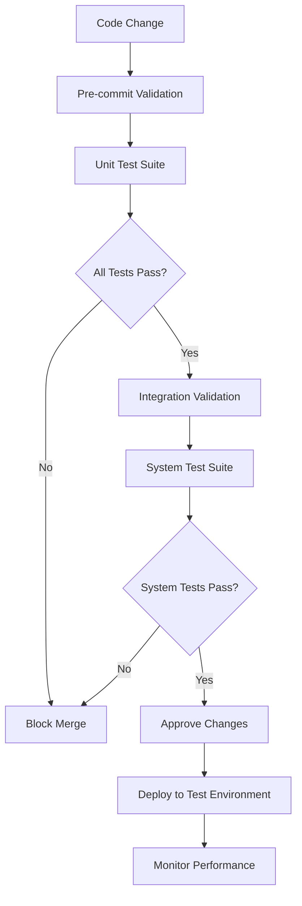

# Testing Guide

<cite>
**Referenced Files in This Document**
- [frontmatter.test.ts](file://src/plugins/lib/__tests__/frontmatter.test.ts)
- [message-scoring.test.ts](file://src/plugins/lib/__tests__/message-scoring.test.ts)
- [message-interception-integration.test.ts](file://src/plugins/lib/__tests__/message-interception-integration.test.ts)
- [frontmatter.ts](file://src/plugins/lib/frontmatter.ts)
- [message-scoring.ts](file://src/plugins/lib/message-scoring.ts)
- [stress-test.md](file://src/commands/idumb/stress-test.md)
- [stress-test-workflow.md](file://src/workflows/stress-test.md)
- [package.json](file://package.json)
</cite>

## Table of Contents
1. [Introduction](#introduction)
2. [Project Structure](#project-structure)
3. [Core Testing Components](#core-testing-components)
4. [Architecture Overview](#architecture-overview)
5. [Detailed Component Analysis](#detailed-component-analysis)
6. [Testing Infrastructure](#testing-infrastructure)
7. [Test Execution Guide](#test-execution-guide)
8. [Quality Assurance Framework](#quality-assurance-framework)
9. [Troubleshooting Guide](#troubleshooting-guide)
10. [Best Practices](#best-practices)
11. [Conclusion](#conclusion)

## Introduction

This Testing Guide provides comprehensive documentation for the iDumb framework's testing infrastructure and methodologies. The guide covers unit tests, integration tests, stress testing, and quality assurance processes that ensure the framework's reliability, consistency, and proper functioning across all components including frontmatter generation, message scoring, and system-wide validation.

The testing framework leverages Vitest for unit testing and Bash-based workflows for system-level validation, implementing a multi-layered approach to ensure comprehensive coverage of the iDumb meta-framework's functionality.

## Project Structure

The testing infrastructure is organized across several key areas within the iDumb framework:



**Diagram sources**
- [package.json](file://package.json#L16-L23)
- [frontmatter.ts](file://src/plugins/lib/frontmatter.ts#L1-L293)
- [message-scoring.ts](file://src/plugins/lib/message-scoring.ts#L1-L464)

The testing structure follows a modular approach with dedicated test files for each major component, ensuring maintainability and focused testing coverage.

**Section sources**
- [package.json](file://package.json#L16-L23)

## Core Testing Components

The testing framework consists of three primary categories of tests:

### Unit Tests
Focused on individual component functionality and edge cases
- Frontmatter auto-generation and validation
- Message scoring algorithms and purification logic
- Path detection and document type classification

### Integration Tests
Validate component interactions and data flow between modules
- Frontmatter injection with existing content preservation
- Message scoring persistence and decay mechanisms
- Flow indicator building and context purification

### System Tests
End-to-end validation of complete workflows and processes
- Stress testing across all framework components
- Integration matrix validation
- Self-healing and conflict detection

**Section sources**
- [frontmatter.test.ts](file://src/plugins/lib/__tests__/frontmatter.test.ts#L1-L320)
- [message-scoring.test.ts](file://src/plugins/lib/__tests__/message-scoring.test.ts#L1-L475)
- [message-interception-integration.test.ts](file://src/plugins/lib/__tests__/message-interception-integration.test.ts#L1-L296)

## Architecture Overview

The testing architecture implements a layered approach with clear separation of concerns:



**Diagram sources**
- [package.json](file://package.json#L20-L21)
- [stress-test.md](file://src/commands/idumb/stress-test.md#L1-L396)

The architecture ensures comprehensive coverage while maintaining test isolation and clear failure identification.

## Detailed Component Analysis

### Frontmatter Testing System

The frontmatter testing system validates automatic YAML frontmatter generation and injection for iDumb documents:



**Diagram sources**
- [frontmatter.ts](file://src/plugins/lib/frontmatter.ts#L75-L255)
- [frontmatter.test.ts](file://src/plugins/lib/__tests__/frontmatter.test.ts#L20-L320)

The system handles various scenarios including path detection, type inference, title extraction, and content preservation.

**Section sources**
- [frontmatter.ts](file://src/plugins/lib/frontmatter.ts#L75-L255)
- [frontmatter.test.ts](file://src/plugins/lib/__tests__/frontmatter.test.ts#L20-L320)

### Message Scoring and Purification Testing

The message scoring system implements context pollution prevention through sophisticated scoring algorithms:

```mermaid
flowchart TD
A[Message Received] --> B[Count Words]
B --> C{Word Count < 20?}
C --> |Yes| D[Contains File Context?]
C --> |No| E[Calculate Score]
D --> |No| F[Build Flow Indicator]
D --> |Yes| G[Skip Flow Indicator]
E --> H[Apply Decay]
H --> I[Update Accumulated Score]
I --> J{Threshold Reached?}
J --> |Warning (50)| K[Log Warning]
J --> |Purify (100)| L[Build Purification Context]
J --> |Emergency (150)| M[Halt Processing]
J --> |Normal (<50)| N[Continue Normal]
L --> O[Persist Score]
K --> O
N --> O
M --> P[Trigger Emergency Protocol]
```

**Diagram sources**
- [message-scoring.ts](file://src/plugins/lib/message-scoring.ts#L97-L388)
- [message-scoring.test.ts](file://src/plugins/lib/__tests__/message-scoring.test.ts#L26-L475)

The system includes sophisticated word counting that excludes code blocks, file context detection, and time-based score decay.

**Section sources**
- [message-scoring.ts](file://src/plugins/lib/message-scoring.ts#L97-L388)
- [message-scoring.test.ts](file://src/plugins/lib/__tests__/message-scoring.test.ts#L26-L475)

### Stress Testing Framework

The stress testing framework provides comprehensive validation across all iDumb framework components:



**Diagram sources**
- [stress-test.md](file://src/commands/idumb/stress-test.md#L55-L313)
- [stress-test-workflow.md](file://src/workflows/stress-test.md#L38-L432)

The framework supports three validation modes with progressively comprehensive checks and includes automated self-healing capabilities.

**Section sources**
- [stress-test.md](file://src/commands/idumb/stress-test.md#L55-L313)
- [stress-test-workflow.md](file://src/workflows/stress-test.md#L38-L432)

## Testing Infrastructure

The testing infrastructure is built on modern JavaScript testing frameworks with comprehensive coverage:

### Test Dependencies and Configuration

The project utilizes Vitest as the primary testing framework with the following key dependencies:

- **Vitest**: Modern testing framework with native ES modules support
- **Gray Matter**: YAML frontmatter parsing and serialization
- **UUID**: Version 7 UUID generation for time-ordered identifiers
- **TypeScript**: Full type safety across test suites

### Test Organization Structure

Tests are organized by functional area with clear separation between unit, integration, and system-level tests:



**Diagram sources**
- [package.json](file://package.json#L49-L56)

**Section sources**
- [package.json](file://package.json#L49-L56)

## Test Execution Guide

### Running Individual Test Suites

Each test category can be executed independently for focused development work:

#### Unit Test Execution
```bash
# Run all unit tests
npm test

# Watch mode for development
npm run test:watch

# Run specific test file
npx vitest run src/plugins/lib/__tests__/frontmatter.test.ts
```

#### Integration Test Execution
```bash
# Run integration tests
npx vitest run src/plugins/lib/__tests__/message-interception-integration.test.ts

# Run all integration tests
find src -name "*integration.test.ts" -exec npx vitest run {} \;
```

#### System Test Execution
```bash
# Run stress tests
/idumb:stress-test --full --report

# Run micro validation
/idumb:stress-test --micro

# Run batch validation
/idumb:stress-test --batch
```

### Test Coverage and Reporting

The testing framework provides comprehensive coverage reporting and detailed failure analysis:



**Diagram sources**
- [package.json](file://package.json#L20-L21)

**Section sources**
- [package.json](file://package.json#L20-L21)

## Quality Assurance Framework

The iDumb framework implements a comprehensive quality assurance system that ensures consistent standards across all components:

### Validation Criteria

Each test suite implements specific validation criteria:

#### Frontmatter Validation
- UUID v7 format compliance
- Required field presence
- Type detection accuracy
- Content preservation integrity

#### Message Scoring Validation
- Word count accuracy excluding code blocks
- File context detection precision
- Score calculation correctness
- Decay mechanism effectiveness

#### System Validation
- Agent coordination integrity
- Integration matrix thresholds
- Schema compliance verification
- Regression pattern detection

### Automated Quality Gates

The framework implements automated quality gates that prevent problematic changes from being merged:



**Diagram sources**
- [stress-test-workflow.md](file://src/workflows/stress-test.md#L369-L416)

**Section sources**
- [stress-test-workflow.md](file://src/workflows/stress-test.md#L369-L416)

## Troubleshooting Guide

### Common Test Issues and Solutions

#### Frontmatter Generation Failures
**Issue**: UUID validation errors in frontmatter tests
**Solution**: Verify UUID v7 format compliance and ensure proper timestamp handling

#### Message Scoring Inconsistencies
**Issue**: Score calculation variations between runs
**Solution**: Check for proper decay implementation and ensure consistent time handling

#### Integration Test Failures
**Issue**: Component interaction failures in integration tests
**Solution**: Verify proper mock setup and ensure test isolation

#### Stress Test Timeouts
**Issue**: System tests exceeding timeout limits
**Solution**: Optimize test data setup and reduce unnecessary operations

### Debugging Strategies

#### Test Isolation
Ensure tests don't share state by using proper cleanup procedures and isolated test environments.

#### Mock Management
Implement comprehensive mocking for external dependencies to maintain test stability.

#### Performance Monitoring
Monitor test execution times and optimize slow test suites to maintain development velocity.

**Section sources**
- [frontmatter.test.ts](file://src/plugins/lib/__tests__/frontmatter.test.ts#L165-L229)
- [message-scoring.test.ts](file://src/plugins/lib/__tests__/message-scoring.test.ts#L201-L393)

## Best Practices

### Test Design Principles

1. **Focused Test Scope**: Each test should validate a single aspect of functionality
2. **Clear Assertions**: Use descriptive assertion messages that explain expected vs actual behavior
3. **Proper Setup/Teardown**: Ensure test isolation through proper resource management
4. **Edge Case Coverage**: Include tests for boundary conditions and error scenarios

### Performance Optimization

1. **Test Parallelization**: Leverage Vitest's parallel execution capabilities for independent tests
2. **Mock External Dependencies**: Minimize I/O operations through effective mocking
3. **Test Data Management**: Use efficient test data structures and minimize memory usage

### Continuous Integration

1. **Automated Test Execution**: Integrate tests into CI/CD pipelines for automatic validation
2. **Coverage Monitoring**: Track and maintain minimum coverage thresholds
3. **Performance Baseline**: Establish performance baselines to detect regressions

## Conclusion

The iDumb framework's testing infrastructure provides comprehensive coverage across all functional areas while maintaining high standards for reliability, performance, and maintainability. The multi-layered testing approach ensures that critical functionality is validated at multiple levels, from individual components to complete system workflows.

The framework's commitment to automated testing, quality gates, and continuous validation positions it for sustained development velocity while maintaining high software quality standards. The extensive test coverage, combined with the stress testing capabilities and self-healing mechanisms, ensures that the framework remains robust and reliable across diverse usage scenarios.

Future enhancements to the testing infrastructure should focus on expanding browser-based testing capabilities, implementing property-based testing for complex algorithms, and enhancing the automated self-healing system with more sophisticated conflict resolution strategies.