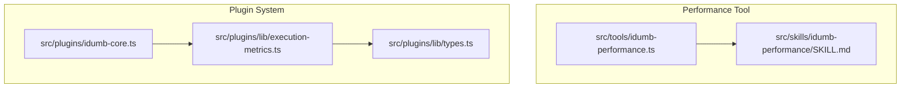
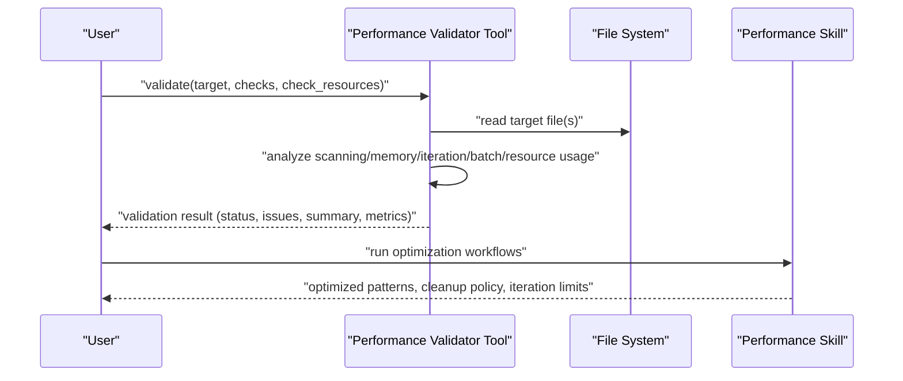
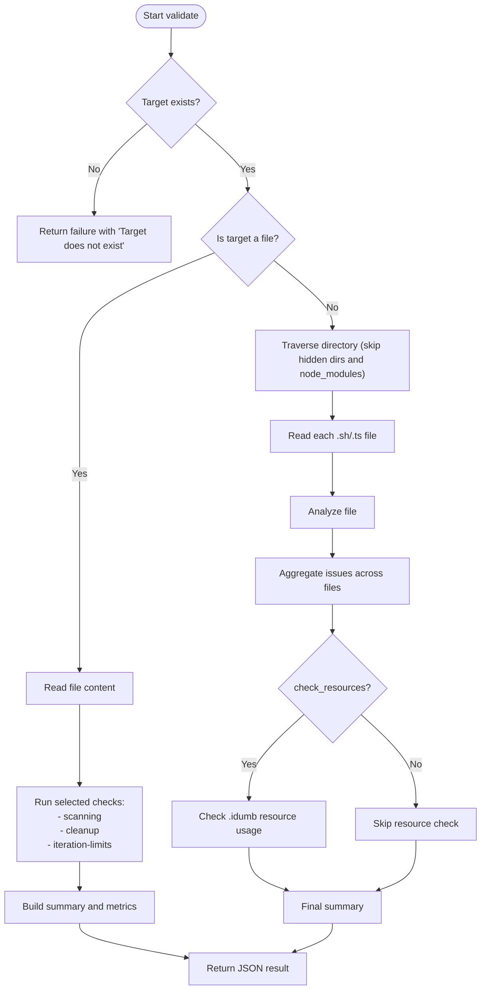
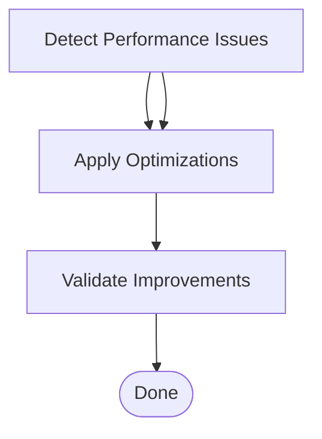
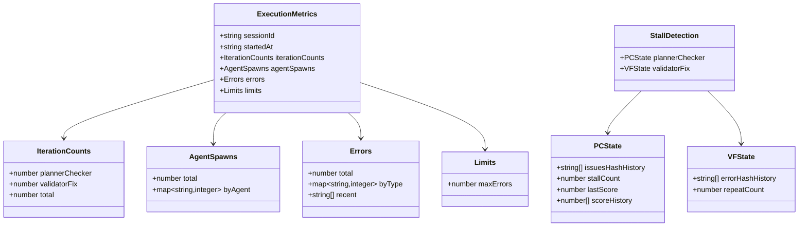
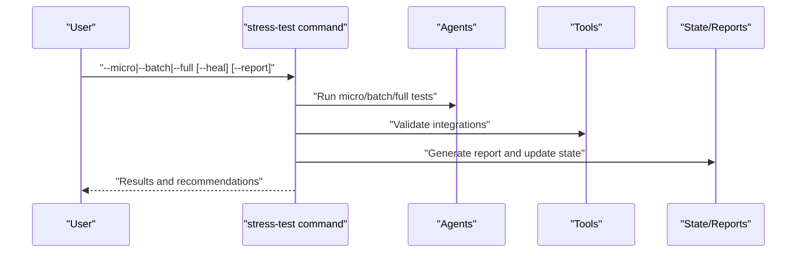
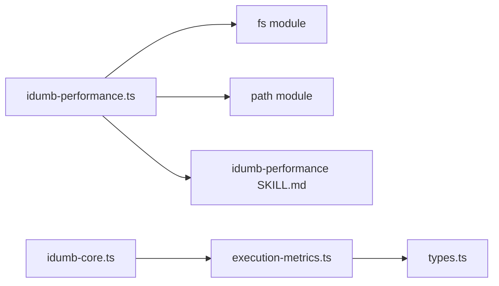

# Performance Tool

<cite>
**Referenced Files in This Document**
- [idumb-performance.ts](file://src/tools/idumb-performance.ts)
- [SKILL.md](file://src/skills/idumb-performance/SKILL.md)
- [execution-metrics.ts](file://src/plugins/lib/execution-metrics.ts)
- [idumb-core.ts](file://src/plugins/idumb-core.ts)
- [types.ts](file://src/plugins/lib/types.ts)
- [stress-test.md](file://src/commands/idumb/stress-test.md)
</cite>

## Table of Contents
1. [Introduction](#introduction)
2. [Project Structure](#project-structure)
3. [Core Components](#core-components)
4. [Architecture Overview](#architecture-overview)
5. [Detailed Component Analysis](#detailed-component-analysis)
6. [Dependency Analysis](#dependency-analysis)
7. [Performance Considerations](#performance-considerations)
8. [Troubleshooting Guide](#troubleshooting-guide)
9. [Conclusion](#conclusion)
10. [Appendices](#appendices)

## Introduction
This document describes the iDumb Performance Tool, a framework for performance monitoring, optimization, and efficiency analysis within the iDumb ecosystem. It covers:
- Performance validation for scanning efficiency, memory safety, iteration limits, and resource usage
- Execution metrics and stall detection for agent workflows
- Benchmarking and bottleneck identification
- Integration with performance skills and optimization workflows
- Practical guidance for implementing custom validators, configuring thresholds, and optimizing agent execution
- Data collection, visualization, and trend analysis approaches
- Debugging strategies and scaling considerations

## Project Structure
The performance tool spans two primary areas:
- A performance validation tool that statically inspects scripts and workspace artifacts for inefficiencies
- A plugin subsystem that tracks execution metrics, detects stalls, and supports emergency halts during agent workflows

**Diagram sources**
- [idumb-performance.ts](file://src/tools/idumb-performance.ts#L1-L533)
- [SKILL.md](file://src/skills/idumb-performance/SKILL.md#L1-L478)
- [idumb-core.ts](file://src/plugins/idumb-core.ts#L1-L800)
- [execution-metrics.ts](file://src/plugins/lib/execution-metrics.ts#L1-L373)
- [types.ts](file://src/plugins/lib/types.ts#L1-L282)

**Section sources**
- [idumb-performance.ts](file://src/tools/idumb-performance.ts#L1-L533)
- [SKILL.md](file://src/skills/idumb-performance/SKILL.md#L1-L478)
- [idumb-core.ts](file://src/plugins/idumb-core.ts#L1-L800)
- [execution-metrics.ts](file://src/plugins/lib/execution-metrics.ts#L1-L373)
- [types.ts](file://src/plugins/lib/types.ts#L1-L282)

## Core Components
- Performance Validator Tool: Performs static analysis of scripts and workspace artifacts to detect inefficient scanning, memory leaks, unbounded iterations, and resource waste. It produces structured results with severity, suggestions, and summary metrics.
- Performance Skill: Documents optimization patterns, cleanup policies, iteration limits, and resource monitoring targets. Provides scripts and templates for efficient scanning, cleanup, iteration validation, batch operations, and resource monitoring.
- Execution Metrics and Stall Detection: Tracks iteration counts, agent spawns, errors, and detects stalls in planner/checker and validator/fix phases. Supports emergency halt with checkpoint creation.

Key capabilities:
- Static performance validation for bash and TypeScript files
- Workspace resource usage monitoring (.idumb directory size and report counts)
- Iteration limit enforcement and detection
- Execution metrics persistence and stall detection
- Emergency halt with checkpointing for debugging

**Section sources**
- [idumb-performance.ts](file://src/tools/idumb-performance.ts#L314-L374)
- [SKILL.md](file://src/skills/idumb-performance/SKILL.md#L36-L252)
- [execution-metrics.ts](file://src/plugins/lib/execution-metrics.ts#L27-L164)

## Architecture Overview
The performance tool integrates with the iDumb plugin system to observe and track agent execution, while also providing standalone validation capabilities.

**Diagram sources**
- [idumb-performance.ts](file://src/tools/idumb-performance.ts#L380-L471)
- [SKILL.md](file://src/skills/idumb-performance/SKILL.md#L361-L412)

## Detailed Component Analysis

### Performance Validator Tool
Responsibilities:
- Static analysis of scripts for inefficient scanning patterns (e.g., multiple grep, find -exec grep)
- Memory leak detection (unbounded arrays, lack of cleanup)
- Iteration limit enforcement (unbounded loops, retry without limits)
- Batch operation inefficiencies (repeated file reads, redundant validations)
- Resource usage monitoring (.idumb directory size and report file counts)

Processing logic:
- Accepts target path, selected checks, and resource check flag
- Supports single-file and directory scans
- Aggregates issues and computes summary statistics and scores
- Returns structured JSON with status, issues, and metrics

**Diagram sources**
- [idumb-performance.ts](file://src/tools/idumb-performance.ts#L380-L471)
- [idumb-performance.ts](file://src/tools/idumb-performance.ts#L424-L446)

**Section sources**
- [idumb-performance.ts](file://src/tools/idumb-performance.ts#L314-L374)
- [idumb-performance.ts](file://src/tools/idumb-performance.ts#L380-L471)
- [idumb-performance.ts](file://src/tools/idumb-performance.ts#L473-L533)

### Performance Skill (Optimization Workflows)
The skill defines:
- Efficient file scanning patterns and targets
- Memory leak prevention and cleanup policies
- Iteration limit enforcement with templates
- Batch operation optimization
- Resource usage monitoring targets and scripts

Optimization workflow:
- Phase 1: Detect performance issues (static analysis and resource checks)
- Phase 2: Apply optimizations (combine scans, implement cleanup, add iteration limits)
- Phase 3: Validate improvements (before/after measurement, success criteria)

**Diagram sources**
- [SKILL.md](file://src/skills/idumb-performance/SKILL.md#L361-L412)

**Section sources**
- [SKILL.md](file://src/skills/idumb-performance/SKILL.md#L36-L252)
- [SKILL.md](file://src/skills/idumb-performance/SKILL.md#L361-L412)

### Execution Metrics and Stall Detection
The plugin subsystem tracks:
- Execution metrics: iteration counts, agent spawns, error totals, and recent errors
- Stall detection: planner/checker stall detection and validator/fix stall detection
- Emergency halt: creates checkpoints and logs halt reasons

**Diagram sources**
- [execution-metrics.ts](file://src/plugins/lib/execution-metrics.ts#L30-L164)
- [types.ts](file://src/plugins/lib/types.ts#L100-L140)

**Section sources**
- [execution-metrics.ts](file://src/plugins/lib/execution-metrics.ts#L27-L164)
- [types.ts](file://src/plugins/lib/types.ts#L96-L140)
- [idumb-core.ts](file://src/plugins/idumb-core.ts#L320-L336)

### Stress Testing Integration
The stress test command validates agent coordination, integration completeness, and regression prevention. It serves as a performance benchmarking baseline for the framework itself.

**Diagram sources**
- [stress-test.md](file://src/commands/idumb/stress-test.md#L1-L396)

**Section sources**
- [stress-test.md](file://src/commands/idumb/stress-test.md#L1-L396)

## Dependency Analysis
The performance tool depends on:
- File system APIs for reading content and traversing directories
- Static pattern matching for detecting performance issues
- Plugin execution metrics for runtime performance insights
- Skill documentation for optimization templates and policies

**Diagram sources**
- [idumb-performance.ts](file://src/tools/idumb-performance.ts#L13-L16)
- [idumb-core.ts](file://src/plugins/idumb-core.ts#L19-L108)
- [execution-metrics.ts](file://src/plugins/lib/execution-metrics.ts#L9-L13)
- [types.ts](file://src/plugins/lib/types.ts#L1-L8)

**Section sources**
- [idumb-performance.ts](file://src/tools/idumb-performance.ts#L13-L16)
- [idumb-core.ts](file://src/plugins/idumb-core.ts#L19-L108)
- [execution-metrics.ts](file://src/plugins/lib/execution-metrics.ts#L9-L13)
- [types.ts](file://src/plugins/lib/types.ts#L1-L8)

## Performance Considerations
- Scanning efficiency: Prefer single-pass, filtered scans with combined patterns and exclude directories to reduce I/O overhead.
- Memory safety: Implement bounded data structures, periodic cleanup, and avoid accumulating artifacts in .idumb without policies.
- Iteration limits: Enforce explicit iteration caps and exponential backoff for retries to prevent stalls.
- Batch operations: Cache frequently accessed data and avoid repeated file reads or validations.
- Resource monitoring: Monitor .idumb directory size and report counts; apply cleanup policies proactively.
- Execution metrics: Track iteration counts, agent spawns, and error rates; detect stalls to prevent infinite loops.
- Benchmarking: Use the stress test command to establish baselines and measure improvements after applying optimizations.

[No sources needed since this section provides general guidance]

## Troubleshooting Guide
Common issues and resolutions:
- Excessive .idumb size or report files: Run cleanup to remove old checkpoints and validation reports; adhere to resource limits.
- Unbounded loops or retries: Add iteration limits and backoff strategies; validate with dedicated iteration checks.
- Inefficient scanning patterns: Combine patterns, filter directories, and avoid find -exec grep.
- Stalls in workflows: Review stall detection triggers and adjust acceptance criteria; inspect recent errors and issue hashes.
- Emergency halts: Inspect generated checkpoints for context and use validation commands to recover.

**Section sources**
- [idumb-performance.ts](file://src/tools/idumb-performance.ts#L244-L308)
- [execution-metrics.ts](file://src/plugins/lib/execution-metrics.ts#L146-L164)
- [execution-metrics.ts](file://src/plugins/lib/execution-metrics.ts#L310-L372)

## Conclusion
The iDumb Performance Tool provides a comprehensive suite for detecting and resolving performance issues, monitoring resource usage, and ensuring robust agent execution. By combining static analysis, execution metrics, and structured optimization workflows, teams can maintain efficient, scalable, and debuggable systems.

[No sources needed since this section summarizes without analyzing specific files]

## Appendices

### Implementing Custom Performance Validators
- Define detection patterns for new performance categories (e.g., network calls, CPU-bound loops)
- Add severity and suggestion metadata
- Integrate with the validation pipeline and ensure directory traversal respects filters (e.g., skip hidden directories and node_modules)
- Return structured issues with location, line number, and estimated impact

**Section sources**
- [idumb-performance.ts](file://src/tools/idumb-performance.ts#L56-L124)
- [idumb-performance.ts](file://src/tools/idumb-performance.ts#L130-L189)
- [idumb-performance.ts](file://src/tools/idumb-performance.ts#L195-L232)
- [idumb-performance.ts](file://src/tools/idumb-performance.ts#L244-L308)

### Configuring Monitoring Thresholds
- Disk usage threshold: Adjust maximum .idumb size and report count limits as needed
- Error thresholds: Tune maximum error counts to balance responsiveness and stability
- Iteration thresholds: Set reasonable caps for loops and retries based on workload characteristics

**Section sources**
- [SKILL.md](file://src/skills/idumb-performance/SKILL.md#L313-L329)
- [execution-metrics.ts](file://src/plugins/lib/execution-metrics.ts#L48-L53)

### Optimizing Agent Execution
- Use execution metrics to identify bottlenecks and excessive agent spawns
- Apply stall detection strategies to prevent stalls in planner/checker and validator/fix phases
- Implement emergency halt with checkpointing for debugging and recovery

**Section sources**
- [execution-metrics.ts](file://src/plugins/lib/execution-metrics.ts#L176-L285)
- [idumb-core.ts](file://src/plugins/idumb-core.ts#L320-L336)

### Performance Data Collection, Visualization, and Trend Analysis
- Collect execution metrics and stall detection histories
- Persist metrics to disk for historical analysis
- Use trends to identify recurring issues and measure optimization impact

**Section sources**
- [execution-metrics.ts](file://src/plugins/lib/execution-metrics.ts#L74-L95)
- [execution-metrics.ts](file://src/plugins/lib/execution-metrics.ts#L210-L251)
- [execution-metrics.ts](file://src/plugins/lib/execution-metrics.ts#L256-L285)