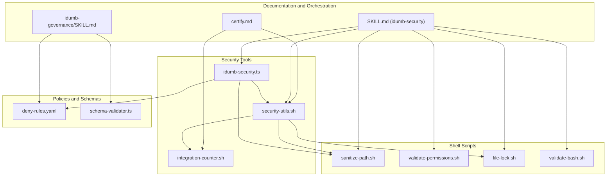
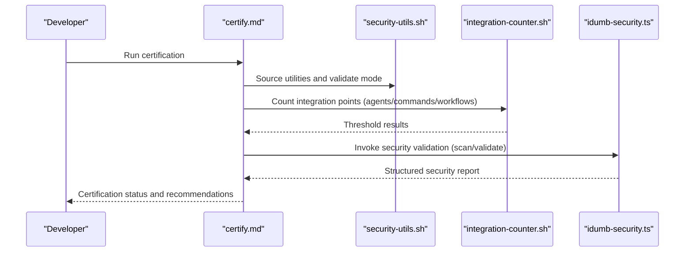
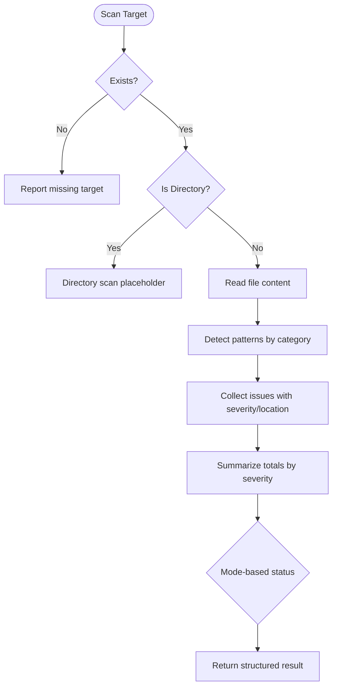
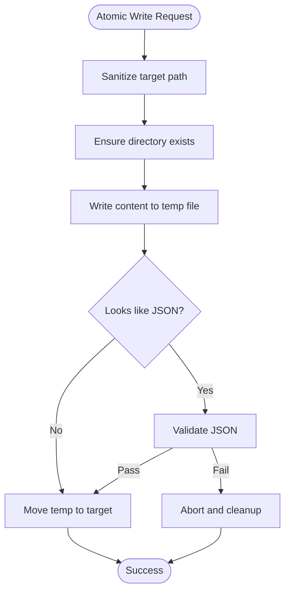
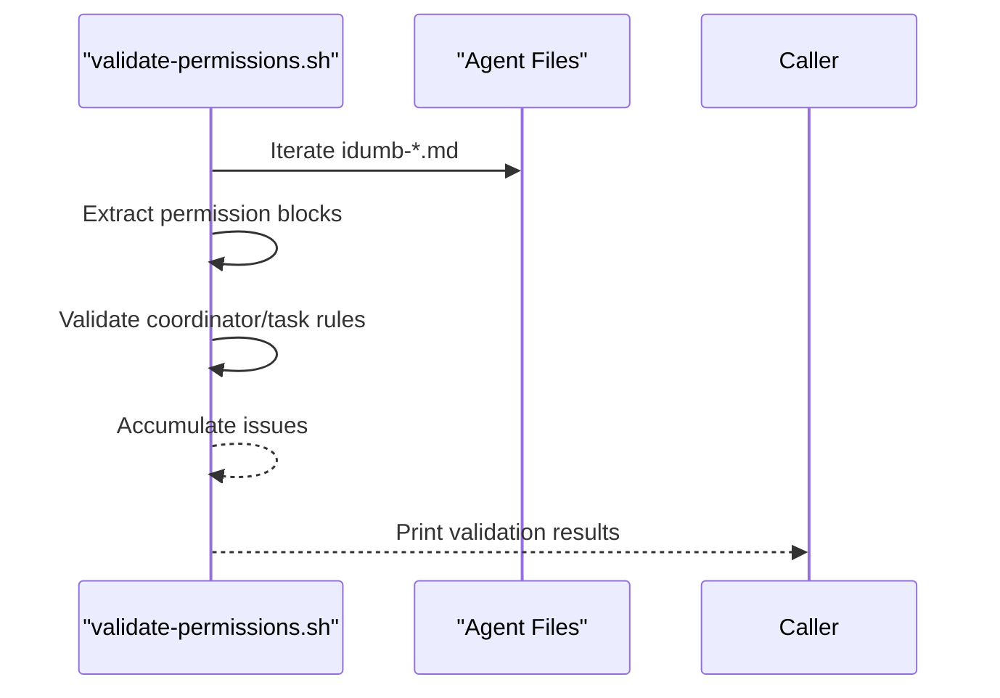
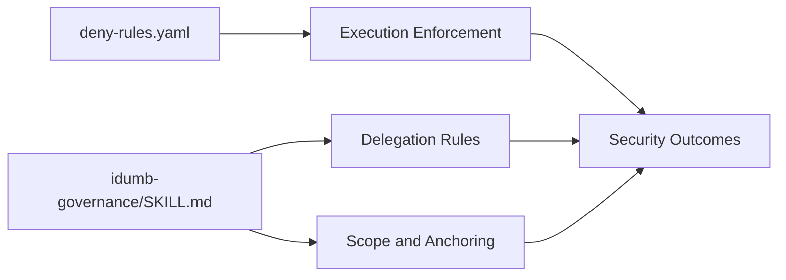
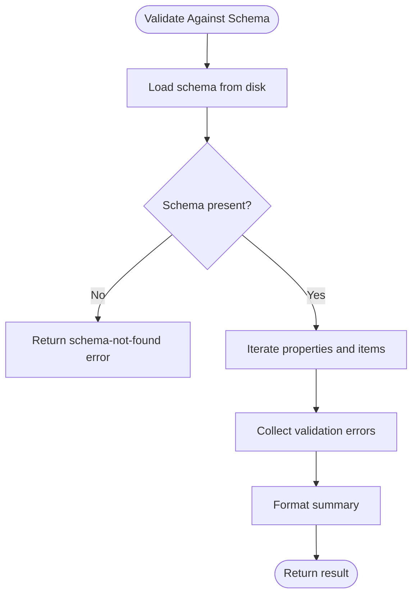
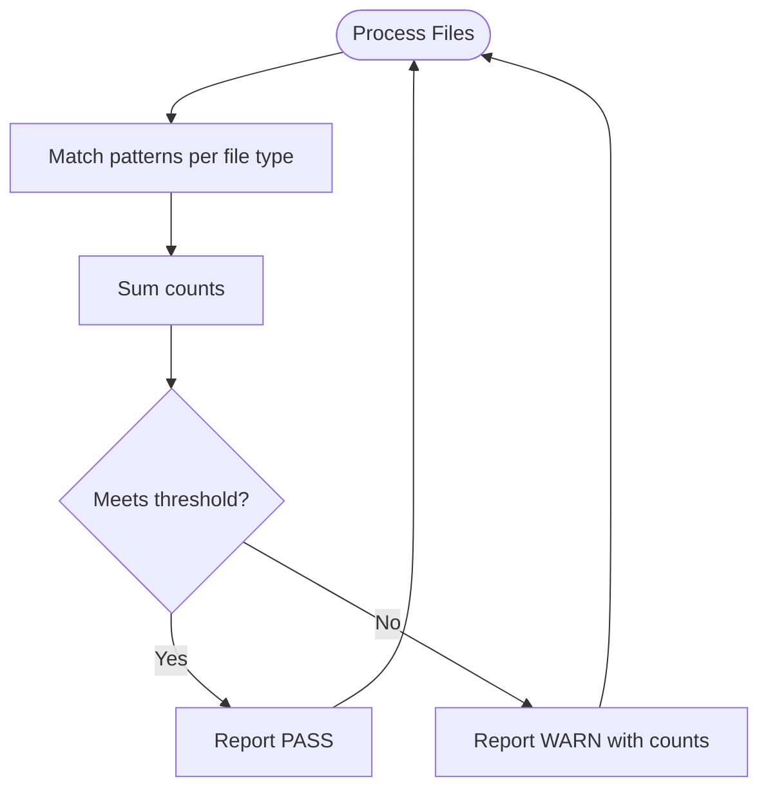
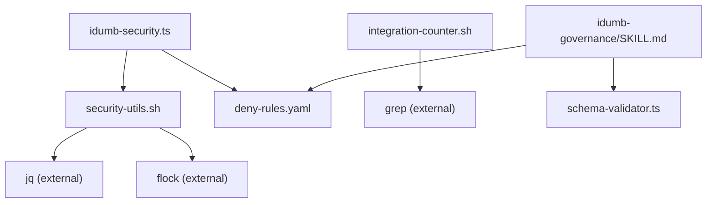

# Security Tool

<cite>
**Referenced Files in This Document**
- [idumb-security.ts](file://src/tools/idumb-security.ts)
- [security-utils.sh](file://src/security/security-utils.sh)
- [integration-counter.sh](file://src/security/integration-counter.sh)
- [sanitize-path.sh](file://src/skills/idumb-security/scripts/sanitize-path.sh)
- [validate-permissions.sh](file://src/skills/idumb-security/scripts/validate-permissions.sh)
- [file-lock.sh](file://src/skills/idumb-security/scripts/file-lock.sh)
- [validate-bash.sh](file://src/skills/idumb-security/scripts/validate-bash.sh)
- [SKILL.md](file://src/skills/idumb-security/SKILL.md)
- [deny-rules.yaml](file://src/config/deny-rules.yaml)
- [schema-validator.ts](file://src/plugins/lib/schema-validator.ts)
- [certify.md](file://src/commands/idumb/certify.md)
- [idumb-governance/SKILL.md](file://src/skills/idumb-governance/SKILL.md)
</cite>

## Table of Contents
1. [Introduction](#introduction)
2. [Project Structure](#project-structure)
3. [Core Components](#core-components)
4. [Architecture Overview](#architecture-overview)
5. [Detailed Component Analysis](#detailed-component-analysis)
6. [Dependency Analysis](#dependency-analysis)
7. [Performance Considerations](#performance-considerations)
8. [Troubleshooting Guide](#troubleshooting-guide)
9. [Conclusion](#conclusion)
10. [Appendices](#appendices)

## Introduction
This document describes the iDumb Security Tool suite that enforces security across the framework and user projects. It covers enforcement mechanisms for bash injection, path traversal, permission bypass, and race conditions; validation processes for scripts and state; path sanitization and permission verification; integration with shell utilities for filesystem protection; security scanning and compliance checks; and guidance for building custom validators, configuring policies, and integrating with external security tools. It also outlines monitoring, alerting, and incident response procedures, along with performance optimization and secure coding practices.

## Project Structure
The security tooling is organized around:
- A TypeScript tool for validating bash scripts and generating structured security results
- Shell utilities for path sanitization, atomic writes, permission validation, and integration counting
- Skill documentation that defines security categories, workflows, and operational modes
- Policy configuration for deny rules and governance
- Schema validation for state and checkpoints
- Governance skill that anchors security validation into the broader framework

**Diagram sources**
- [idumb-security.ts](file://src/tools/idumb-security.ts#L1-L359)
- [security-utils.sh](file://src/security/security-utils.sh#L1-L239)
- [integration-counter.sh](file://src/security/integration-counter.sh#L1-L152)
- [sanitize-path.sh](file://src/skills/idumb-security/scripts/sanitize-path.sh#L1-L37)
- [validate-permissions.sh](file://src/skills/idumb-security/scripts/validate-permissions.sh#L1-L45)
- [file-lock.sh](file://src/skills/idumb-security/scripts/file-lock.sh#L1-L52)
- [validate-bash.sh](file://src/skills/idumb-security/scripts/validate-bash.sh#L1-L51)
- [SKILL.md](file://src/skills/idumb-security/SKILL.md#L1-L337)
- [deny-rules.yaml](file://src/config/deny-rules.yaml#L1-L398)
- [schema-validator.ts](file://src/plugins/lib/schema-validator.ts#L1-L285)
- [certify.md](file://src/commands/idumb/certify.md#L52-L111)
- [idumb-governance/SKILL.md](file://src/skills/idumb-governance/SKILL.md#L1-L343)

**Section sources**
- [idumb-security.ts](file://src/tools/idumb-security.ts#L1-L359)
- [security-utils.sh](file://src/security/security-utils.sh#L1-L239)
- [integration-counter.sh](file://src/security/integration-counter.sh#L1-L152)
- [SKILL.md](file://src/skills/idumb-security/SKILL.md#L1-L337)

## Core Components
- Bash Security Validator (TypeScript): Scans files for injection, traversal, permissions, and race conditions; produces structured results with severity and suggestions.
- Shell Security Utilities: Provide path sanitization, safe directory creation, atomic writes, locking, JSON validation, and mode validation.
- Security Scripts: Standalone scripts for path sanitization, permission matrix validation, atomic file writes, and bash vulnerability scanning.
- Policy and Governance: Deny rules define what is blocked/warned; governance skill anchors validation and delegation.
- Schema Validation: Ensures state and checkpoints conform to schemas to prevent invalid state exploitation.
- Integration Counter: Counts integration points across agents/commands/workflows to maintain security posture.

**Section sources**
- [idumb-security.ts](file://src/tools/idumb-security.ts#L21-L48)
- [security-utils.sh](file://src/security/security-utils.sh#L18-L122)
- [sanitize-path.sh](file://src/skills/idumb-security/scripts/sanitize-path.sh#L7-L29)
- [validate-permissions.sh](file://src/skills/idumb-security/scripts/validate-permissions.sh#L7-L34)
- [file-lock.sh](file://src/skills/idumb-security/scripts/file-lock.sh#L7-L44)
- [validate-bash.sh](file://src/skills/idumb-security/scripts/validate-bash.sh#L7-L42)
- [deny-rules.yaml](file://src/config/deny-rules.yaml#L18-L301)
- [schema-validator.ts](file://src/plugins/lib/schema-validator.ts#L162-L206)

## Architecture Overview
The security toolchain integrates at three layers:
- Pre-write validation: bash validation, path sanitization, permission checks
- Agent delegation validation: parent-child delegation rules and permission scopes
- Continuous monitoring: integration point thresholds, schema validation, and governance anchoring

**Diagram sources**
- [certify.md](file://src/commands/idumb/certify.md#L52-L111)
- [security-utils.sh](file://src/security/security-utils.sh#L124-L137)
- [integration-counter.sh](file://src/security/integration-counter.sh#L42-L108)
- [idumb-security.ts](file://src/tools/idumb-security.ts#L247-L310)

## Detailed Component Analysis

### Bash Security Validator (idumb-security.ts)
- Purpose: Detects injection, traversal, permission bypass, and race conditions in bash scripts.
- Detection rules:
  - Injection: eval usage, nested variable expansion, unquoted variables, command substitution with variables
  - Traversal: explicit traversal sequences, cd with variables, file reads with variables
  - Permissions: world-writable permissions, sudo/chown without validation
  - Race conditions: TOCTOU checks, directory create then permissions change
- Execution modes: auto, strict, permissive; determines overall status based on severity counts
- Output: structured JSON with status, issues, summary, and scanned count

**Diagram sources**
- [idumb-security.ts](file://src/tools/idumb-security.ts#L194-L230)
- [idumb-security.ts](file://src/tools/idumb-security.ts#L254-L309)

**Section sources**
- [idumb-security.ts](file://src/tools/idumb-security.ts#L54-L162)
- [idumb-security.ts](file://src/tools/idumb-security.ts#L194-L309)

### Shell Security Utilities (security-utils.sh)
- Path sanitization: removes dangerous sequences and ensures relative paths
- Safe directory creation: validates and creates directories safely
- Atomic write with validation: writes to temp file then moves atomically; validates JSON when applicable
- Locking: acquisition/release with flock fallback; supports timeouts
- Mode validation: restricts allowed modes for security scans
- JSON validation: ensures generated JSON is well-formed
- Safe file operations: wrappers for read/write with safety checks

**Diagram sources**
- [security-utils.sh](file://src/security/security-utils.sh#L93-L122)

**Section sources**
- [security-utils.sh](file://src/security/security-utils.sh#L18-L122)
- [security-utils.sh](file://src/security/security-utils.sh#L139-L183)

### Security Scripts (standalone)
- sanitize-path.sh: Removes traversal sequences, null bytes, and normalizes absolute paths to project root
- validate-permissions.sh: Enforces permission matrix rules for agent files (e.g., coordinators must deny write)
- file-lock.sh: Atomic write with lock file and timeout to prevent race conditions
- validate-bash.sh: Scans for unsafe variable interpolation, unquoted variables, eval/source with variables

**Diagram sources**
- [validate-permissions.sh](file://src/skills/idumb-security/scripts/validate-permissions.sh#L7-L34)

**Section sources**
- [sanitize-path.sh](file://src/skills/idumb-security/scripts/sanitize-path.sh#L7-L29)
- [validate-permissions.sh](file://src/skills/idumb-security/scripts/validate-permissions.sh#L7-L34)
- [file-lock.sh](file://src/skills/idumb-security/scripts/file-lock.sh#L7-L44)
- [validate-bash.sh](file://src/skills/idumb-security/scripts/validate-bash.sh#L7-L42)

### Policy and Governance (deny-rules.yaml, idumb-governance/SKILL.md)
- Deny rules: Specific patterns for bash commands, delegation, file types, and tool usage; includes contextual messages and severities
- Governance: Defines META vs PROJECT scope, delegation patterns, validation protocols, and anchoring for critical decisions

**Diagram sources**
- [deny-rules.yaml](file://src/config/deny-rules.yaml#L18-L301)
- [idumb-governance/SKILL.md](file://src/skills/idumb-governance/SKILL.md#L49-L115)

**Section sources**
- [deny-rules.yaml](file://src/config/deny-rules.yaml#L1-L398)
- [idumb-governance/SKILL.md](file://src/skills/idumb-governance/SKILL.md#L1-L343)

### Schema Validation (schema-validator.ts)
- Validates state and checkpoints against JSON schemas
- Provides structured error and warning summaries
- Used to prevent invalid state that could be exploited

**Diagram sources**
- [schema-validator.ts](file://src/plugins/lib/schema-validator.ts#L28-L206)

**Section sources**
- [schema-validator.ts](file://src/plugins/lib/schema-validator.ts#L162-L206)

### Integration Point Counting (integration-counter.sh)
- Counts integration points across agents/commands/workflows using predefined patterns
- Validates thresholds and reports PASS/WARN outcomes
- Supports batch processing and optional verbosity

**Diagram sources**
- [integration-counter.sh](file://src/security/integration-counter.sh#L42-L108)

**Section sources**
- [integration-counter.sh](file://src/security/integration-counter.sh#L42-L148)

## Dependency Analysis
- idumb-security.ts depends on:
  - Local shell utilities for path sanitization and atomic writes
  - Policy rules for permission enforcement
  - Governance skill for delegation and scope
- Shell utilities depend on:
  - jq for JSON validation
  - flock for advisory locking (fallback available)
- Integration counter depends on:
  - grep for pattern matching
- Governance skill depends on:
  - Schema validator for state integrity
  - Deny rules for enforcement

**Diagram sources**
- [idumb-security.ts](file://src/tools/idumb-security.ts#L13-L15)
- [security-utils.sh](file://src/security/security-utils.sh#L94-L122)
- [integration-counter.sh](file://src/security/integration-counter.sh#L72-L76)
- [idumb-governance/SKILL.md](file://src/skills/idumb-governance/SKILL.md#L133-L148)
- [schema-validator.ts](file://src/plugins/lib/schema-validator.ts#L10-L11)

**Section sources**
- [idumb-security.ts](file://src/tools/idumb-security.ts#L13-L15)
- [security-utils.sh](file://src/security/security-utils.sh#L94-L122)
- [integration-counter.sh](file://src/security/integration-counter.sh#L72-L76)
- [schema-validator.ts](file://src/plugins/lib/schema-validator.ts#L10-L11)

## Performance Considerations
- Prefer scanning single files over recursive directory scans in idumb-security.ts to reduce overhead
- Use atomic writes to minimize contention and retries
- Limit pattern complexity in shell scripts to avoid expensive regex operations
- Cache schema loads and reuse validation results where feasible
- Use flock when available for efficient locking; fallback remains safe but slower

[No sources needed since this section provides general guidance]

## Troubleshooting Guide
Common issues and resolutions:
- File not found during validation: verify target path and working directory
- Invalid JSON generation: ensure content conforms to schema before atomic write
- Lock acquisition failures: increase timeout or reduce concurrent writers
- Permission denials: align agent capabilities with deny-rules.yaml and governance scope
- Integration threshold warnings: refactor components to meet security thresholds

**Section sources**
- [idumb-security.ts](file://src/tools/idumb-security.ts#L194-L203)
- [security-utils.sh](file://src/security/security-utils.sh#L111-L122)
- [security-utils.sh](file://src/security/security-utils.sh#L140-L170)
- [deny-rules.yaml](file://src/config/deny-rules.yaml#L18-L301)
- [integration-counter.sh](file://src/security/integration-counter.sh#L81-L108)

## Conclusion
The iDumb Security Tool provides a layered defense: static analysis of bash scripts, runtime safeguards for file operations, policy-driven enforcement, and governance anchoring. By combining automated scanning, atomic operations, and strict delegation rules, it minimizes risk while maintaining automation efficiency. Integrating these tools into CI/CD and developer workflows ensures continuous security validation and compliance.

[No sources needed since this section summarizes without analyzing specific files]

## Appendices

### Security Validation Workflow (Pre-Write and Pre-Delegate)
- Pre-write: validate bash, sanitize path, check permissions
- Pre-delegate: validate parent-child delegation and operation scope

**Section sources**
- [SKILL.md](file://src/skills/idumb-security/SKILL.md#L238-L275)

### Implementing Custom Security Validators
- Extend idumb-security.ts with new detection categories and severity mappings
- Add shell scripts for specialized checks and integrate via security-utils.sh
- Update deny-rules.yaml for policy enforcement and governance skill for scope

**Section sources**
- [idumb-security.ts](file://src/tools/idumb-security.ts#L54-L162)
- [security-utils.sh](file://src/security/security-utils.sh#L18-L122)
- [deny-rules.yaml](file://src/config/deny-rules.yaml#L18-L301)

### Configuring Security Policies
- Adjust deny-rules.yaml patterns and severities for your environment
- Align agent capabilities with project scope and delegation targets
- Use schema-validator.ts to ensure state integrity and prevent invalid states

**Section sources**
- [deny-rules.yaml](file://src/config/deny-rules.yaml#L18-L301)
- [schema-validator.ts](file://src/plugins/lib/schema-validator.ts#L162-L206)

### Integrating with External Security Tools
- Use validate-bash.sh for lightweight scanning in CI
- Combine integration-counter.sh with linting to track integration complexity
- Leverage governance skill to orchestrate external tool outputs into anchors and reports

**Section sources**
- [validate-bash.sh](file://src/skills/idumb-security/scripts/validate-bash.sh#L7-L42)
- [integration-counter.sh](file://src/security/integration-counter.sh#L42-L108)
- [idumb-governance/SKILL.md](file://src/skills/idumb-governance/SKILL.md#L168-L201)

### Security Monitoring, Alerting, and Incident Response
- Monitor integration thresholds and security scan results
- Use governance anchors to document incidents and remediations
- Enforce deny rules and validate schema to prevent state corruption

**Section sources**
- [integration-counter.sh](file://src/security/integration-counter.sh#L81-L108)
- [idumb-governance/SKILL.md](file://src/skills/idumb-governance/SKILL.md#L168-L201)
- [schema-validator.ts](file://src/plugins/lib/schema-validator.ts#L162-L206)

### Secure Coding Practices
- Quote variables and avoid eval
- Use atomic writes and locks for shared resources
- Sanitize paths and restrict permissions to least privilege
- Validate inputs and outputs against schemas

**Section sources**
- [idumb-security.ts](file://src/tools/idumb-security.ts#L54-L162)
- [security-utils.sh](file://src/security/security-utils.sh#L93-L122)
- [sanitize-path.sh](file://src/skills/idumb-security/scripts/sanitize-path.sh#L7-L29)
- [schema-validator.ts](file://src/plugins/lib/schema-validator.ts#L162-L206)