# Tool System

<cite>
**Referenced Files in This Document**
- [idumb-state.ts](file://src/tools/idumb-state.ts)
- [idumb-config.ts](file://src/tools/idumb-config.ts)
- [idumb-validate.ts](file://src/tools/idumb-validate.ts)
- [idumb-security.ts](file://src/tools/idumb-security.ts)
- [idumb-performance.ts](file://src/tools/idumb-performance.ts)
- [idumb-quality.ts](file://src/tools/idumb-quality.ts)
- [idumb-chunker.ts](file://src/tools/idumb-chunker.ts)
- [idumb-context.ts](file://src/tools/idumb-context.ts)
- [idumb-manifest.ts](file://src/tools/idumb-manifest.ts)
- [idumb-orchestrator.ts](file://src/tools/idumb-orchestrator.ts)
- [idumb-style.ts](file://src/tools/idumb-style.ts)
- [idumb-todo.ts](file://src/tools/idumb-todo.ts)
- [index-manager.ts](file://src/tools/lib/index-manager.ts)
- [bash-executors.ts](file://src/tools/lib/bash-executors.ts)
- [hierarchy-parsers.ts](file://src/tools/lib/hierarchy-parsers.ts)
</cite>

## Table of Contents
1. [Introduction](#introduction)
2. [Project Structure](#project-structure)
3. [Core Components](#core-components)
4. [Architecture Overview](#architecture-overview)
5. [Detailed Component Analysis](#detailed-component-analysis)
6. [Dependency Analysis](#dependency-analysis)
7. [Performance Considerations](#performance-considerations)
8. [Troubleshooting Guide](#troubleshooting-guide)
9. [Conclusion](#conclusion)
10. [Appendices](#appendices)

## Introduction
This document explains iDumb's utility toolkit and helper functions that power governance, validation, security, performance monitoring, and productivity workflows. The tool system centers on a plugin-based architecture using the OpenCode plugin framework, with state persistence, configuration management, hierarchical data processing, and integration points across agents, commands, and tools. It provides:
- State management for governance continuity
- Configuration as the single source of truth
- Validation suites for structure, schema, freshness, and alignment
- Security, quality, and performance validators
- Hierarchical data processing and indexing
- Context classification and manifest tracking
- Orchestration for automated validation workflows
- Style and TODO management for output formatting and task tracking

## Project Structure
The tool system is organized under src/tools with modular components:
- Core tools: state, config, validate, security, performance, quality, chunker, context, manifest, orchestrator, style, todo
- Shared libraries: index-manager, bash-executors, hierarchy-parsers
- Integration with OpenCode plugin framework via @opencode-ai/plugin

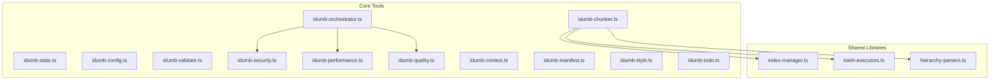

**Diagram sources**
- [idumb-state.ts](file://src/tools/idumb-state.ts#L1-L557)
- [idumb-config.ts](file://src/tools/idumb-config.ts#L1-L1024)
- [idumb-validate.ts](file://src/tools/idumb-validate.ts#L1-L1043)
- [idumb-security.ts](file://src/tools/idumb-security.ts#L1-L359)
- [idumb-performance.ts](file://src/tools/idumb-performance.ts#L1-L533)
- [idumb-quality.ts](file://src/tools/idumb-quality.ts#L1-L524)
- [idumb-chunker.ts](file://src/tools/idumb-chunker.ts#L1-L930)
- [idumb-context.ts](file://src/tools/idumb-context.ts#L1-L277)
- [idumb-manifest.ts](file://src/tools/idumb-manifest.ts#L1-L598)
- [idumb-orchestrator.ts](file://src/tools/idumb-orchestrator.ts#L1-L527)
- [idumb-style.ts](file://src/tools/idumb-style.ts#L1-L196)
- [idumb-todo.ts](file://src/tools/idumb-todo.ts#L1-L385)
- [index-manager.ts](file://src/tools/lib/index-manager.ts#L1-L373)
- [bash-executors.ts](file://src/tools/lib/bash-executors.ts#L1-L429)
- [hierarchy-parsers.ts](file://src/tools/lib/hierarchy-parsers.ts#L1-L567)

**Section sources**
- [idumb-state.ts](file://src/tools/idumb-state.ts#L1-L557)
- [idumb-config.ts](file://src/tools/idumb-config.ts#L1-L1024)
- [idumb-validate.ts](file://src/tools/idumb-validate.ts#L1-L1043)
- [idumb-security.ts](file://src/tools/idumb-security.ts#L1-L359)
- [idumb-performance.ts](file://src/tools/idumb-performance.ts#L1-L533)
- [idumb-quality.ts](file://src/tools/idumb-quality.ts#L1-L524)
- [idumb-chunker.ts](file://src/tools/idumb-chunker.ts#L1-L930)
- [idumb-context.ts](file://src/tools/idumb-context.ts#L1-L277)
- [idumb-manifest.ts](file://src/tools/idumb-manifest.ts#L1-L598)
- [idumb-orchestrator.ts](file://src/tools/idumb-orchestrator.ts#L1-L527)
- [idumb-style.ts](file://src/tools/idumb-style.ts#L1-L196)
- [idumb-todo.ts](file://src/tools/idumb-todo.ts#L1-L385)
- [index-manager.ts](file://src/tools/lib/index-manager.ts#L1-L373)
- [bash-executors.ts](file://src/tools/lib/bash-executors.ts#L1-L429)
- [hierarchy-parsers.ts](file://src/tools/lib/hierarchy-parsers.ts#L1-L567)

## Core Components
- State Management: Persistent governance state with anchors, history, and session lifecycle
- Configuration: Single-source-of-truth master configuration with enforcement flags and automation modes
- Validation Suite: Structure, schema, freshness, planning alignment, and integration point checks
- Security Validator: Bash injection, path traversal, permission bypass, race condition detection
- Performance Validator: Inefficient scanning, memory leaks, iteration limits, resource monitoring
- Quality Validator: Error handling, cross-platform compatibility, documentation completeness
- Chunker: Hierarchical parsing, indexing, sharding, and fast extraction with bash integration
- Context Classifier: Project type, framework detection, language patterns, CI/CD presence
- Manifest Tracker: Drift detection, conflict detection, git hash verification
- Orchestrator: Risk-based orchestration of validation skills across operations
- Style Manager: Output style selection and persistence
- TODO Manager: Hierarchical task tracking with governance prefixes

**Section sources**
- [idumb-state.ts](file://src/tools/idumb-state.ts#L1-L557)
- [idumb-config.ts](file://src/tools/idumb-config.ts#L1-L1024)
- [idumb-validate.ts](file://src/tools/idumb-validate.ts#L1-L1043)
- [idumb-security.ts](file://src/tools/idumb-security.ts#L1-L359)
- [idumb-performance.ts](file://src/tools/idumb-performance.ts#L1-L533)
- [idumb-quality.ts](file://src/tools/idumb-quality.ts#L1-L524)
- [idumb-chunker.ts](file://src/tools/idumb-chunker.ts#L1-L930)
- [idumb-context.ts](file://src/tools/idumb-context.ts#L1-L277)
- [idumb-manifest.ts](file://src/tools/idumb-manifest.ts#L1-L598)
- [idumb-orchestrator.ts](file://src/tools/idumb-orchestrator.ts#L1-L527)
- [idumb-style.ts](file://src/tools/idumb-style.ts#L1-L196)
- [idumb-todo.ts](file://src/tools/idumb-todo.ts#L1-L385)

## Architecture Overview
The tool system follows a layered architecture:
- Plugin Layer: Each tool is wrapped with tool() and exposes typed arguments and execution context
- Persistence Layer: State and configuration files (.idumb/brain/state.json, .idumb/config.json)
- Processing Layer: Shared libraries for hierarchical parsing, indexing, and bash-based extraction
- Orchestration Layer: Meta-orchestrator coordinates validation based on risk and operation type
- Integration Layer: OpenCode plugin framework and CLI commands

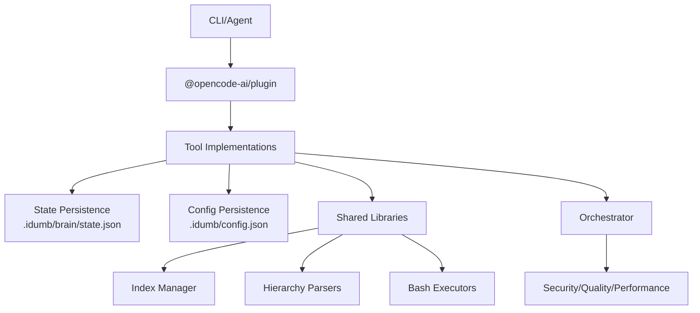

**Diagram sources**
- [idumb-state.ts](file://src/tools/idumb-state.ts#L80-L110)
- [idumb-config.ts](file://src/tools/idumb-config.ts#L445-L511)
- [idumb-orchestrator.ts](file://src/tools/idumb-orchestrator.ts#L257-L343)
- [index-manager.ts](file://src/tools/lib/index-manager.ts#L1-L373)
- [hierarchy-parsers.ts](file://src/tools/lib/hierarchy-parsers.ts#L1-L567)
- [bash-executors.ts](file://src/tools/lib/bash-executors.ts#L1-L429)

## Detailed Component Analysis

### State Management Tool (idumb-state)
Purpose: Read/write governance state, manage anchors, history, and session records.

Key capabilities:
- Read current state from .idumb/brain/state.json
- Update phase, framework, and validation counters
- Add anchors with priority and compact retention
- Record governance history events
- Manage session lifecycle with status tracking
- Purge old sessions and trim oversized state/history

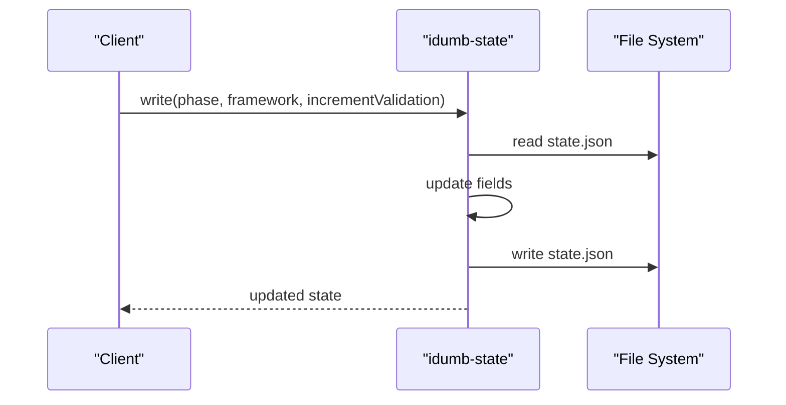

**Diagram sources**
- [idumb-state.ts](file://src/tools/idumb-state.ts#L90-L110)
- [idumb-state.ts](file://src/tools/idumb-state.ts#L61-L78)

**Section sources**
- [idumb-state.ts](file://src/tools/idumb-state.ts#L1-L557)

### Configuration Tool (idumb-config)
Purpose: Single-source-of-truth configuration with enforcement, automation modes, and planning integration.

Key capabilities:
- Ensure existence of .idumb/config.json with defaults
- Merge with planning system (STATE.md, ROADMAP.md) when present
- Detect drift between config and state
- Update user preferences, automation, and enforcement flags
- Prevent modification of protected sections and reserved keys

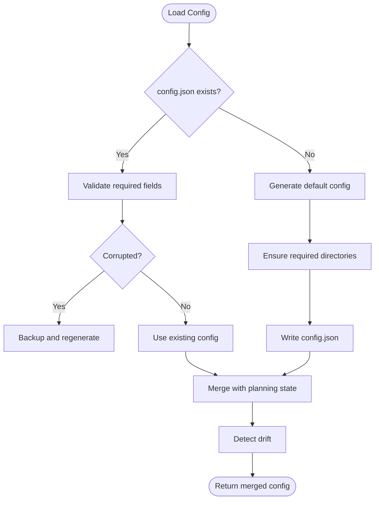

**Diagram sources**
- [idumb-config.ts](file://src/tools/idumb-config.ts#L445-L511)
- [idumb-config.ts](file://src/tools/idumb-config.ts#L567-L603)
- [idumb-config.ts](file://src/tools/idumb-config.ts#L608-L629)

**Section sources**
- [idumb-config.ts](file://src/tools/idumb-config.ts#L1-L1024)

### Validation Suite (idumb-validate)
Purpose: Comprehensive validation across structure, schema, freshness, planning alignment, and integration points.

Key capabilities:
- Structure: Verify .idumb/ directory, brain/, state.json, governance/
- Schema: Validate required fields and values in state.json
- Freshness: Check file ages and anchor staleness
- Planning Alignment: Align iDumb framework with planning system
- Integration Points: Validate agents, commands, tools exports and bindings
- Full Validation: Aggregate results across scopes

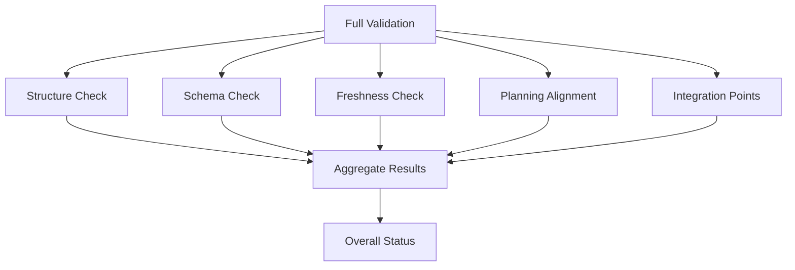

**Diagram sources**
- [idumb-validate.ts](file://src/tools/idumb-validate.ts#L401-L456)
- [idumb-validate.ts](file://src/tools/idumb-validate.ts#L28-L105)
- [idumb-validate.ts](file://src/tools/idumb-validate.ts#L107-L187)
- [idumb-validate.ts](file://src/tools/idumb-validate.ts#L189-L280)
- [idumb-validate.ts](file://src/tools/idumb-validate.ts#L282-L399)
- [idumb-validate.ts](file://src/tools/idumb-validate.ts#L462-L754)

**Section sources**
- [idumb-validate.ts](file://src/tools/idumb-validate.ts#L1-L1043)

### Security Validator (idumb-security)
Purpose: Detect security vulnerabilities in bash scripts.

Key capabilities:
- Injection detection (eval, unquoted variables, command substitution)
- Path traversal checks (.. sequences, cd with variables)
- Permission bypass (chmod 777, sudo, chown)
- Race conditions (TOCTOU patterns)
- Severity-based scoring and actionable suggestions

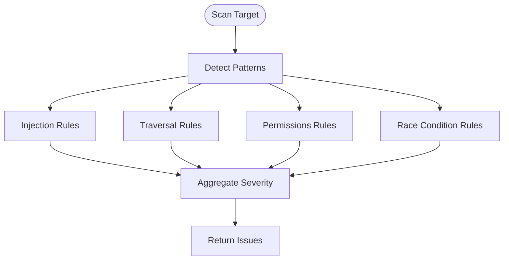

**Diagram sources**
- [idumb-security.ts](file://src/tools/idumb-security.ts#L168-L192)
- [idumb-security.ts](file://src/tools/idumb-security.ts#L54-L83)
- [idumb-security.ts](file://src/tools/idumb-security.ts#L85-L107)
- [idumb-security.ts](file://src/tools/idumb-security.ts#L109-L138)
- [idumb-security.ts](file://src/tools/idumb-security.ts#L140-L162)

**Section sources**
- [idumb-security.ts](file://src/tools/idumb-security.ts#L1-L359)

### Performance Validator (idumb-performance)
Purpose: Identify performance issues and resource misuse.

Key capabilities:
- Inefficient scanning patterns (grep chaining, find -exec)
- Memory leak risks (unbounded arrays, missing cleanup)
- Unbounded loops and iteration limits
- Resource monitoring (.idumb size, report counts)
- Severity-based scoring and impact estimates

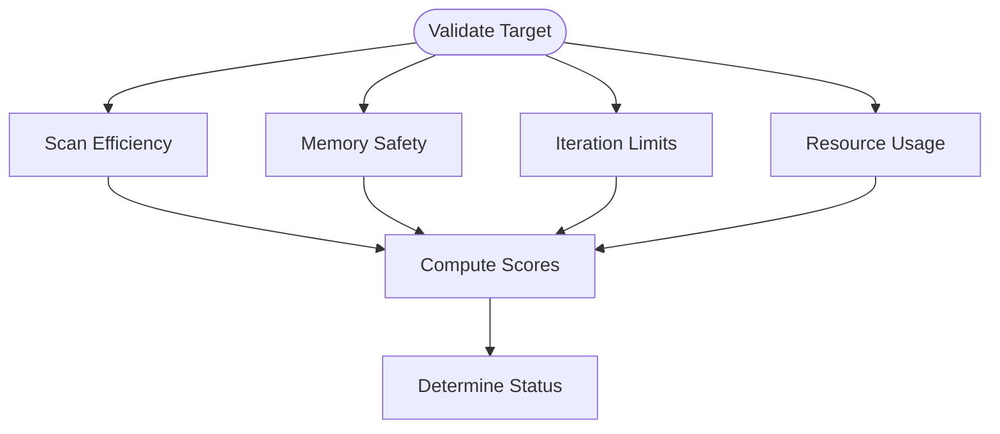

**Diagram sources**
- [idumb-performance.ts](file://src/tools/idumb-performance.ts#L91-L124)
- [idumb-performance.ts](file://src/tools/idumb-performance.ts#L154-L189)
- [idumb-performance.ts](file://src/tools/idumb-performance.ts#L212-L232)
- [idumb-performance.ts](file://src/tools/idumb-performance.ts#L244-L308)
- [idumb-performance.ts](file://src/tools/idumb-performance.ts#L314-L374)

**Section sources**
- [idumb-performance.ts](file://src/tools/idumb-performance.ts#L1-L533)

### Quality Validator (idumb-quality)
Purpose: Enforce code quality standards across error handling, cross-platform compatibility, and documentation.

Key capabilities:
- Error handling checks (missing set -e, error handlers, jq without error handling)
- Cross-platform compatibility (GNU vs BSD differences)
- Documentation completeness (JSDoc, tool descriptions, script headers)
- Severity-based scoring and suggestions

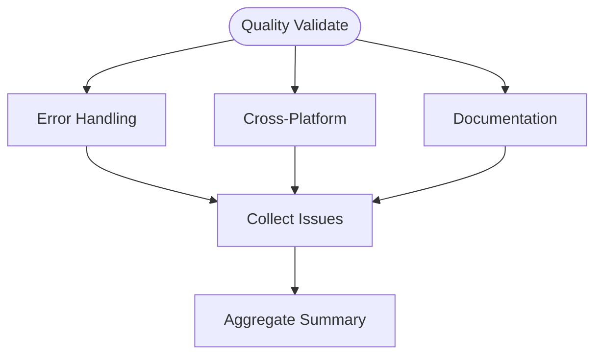

**Diagram sources**
- [idumb-quality.ts](file://src/tools/idumb-quality.ts#L83-L162)
- [idumb-quality.ts](file://src/tools/idumb-quality.ts#L199-L237)
- [idumb-quality.ts](file://src/tools/idumb-quality.ts#L243-L321)
- [idumb-quality.ts](file://src/tools/idumb-quality.ts#L339-L413)

**Section sources**
- [idumb-quality.ts](file://src/tools/idumb-quality.ts#L1-L524)

### Chunker Tool (idumb-chunker)
Purpose: Process hierarchical data efficiently with chunking, indexing, and fast extraction.

Key capabilities:
- Chunked reading for large files
- Hierarchical parsing (XML, YAML, JSON, Markdown)
- Index creation and querying
- Sharding for parallel processing
- Bash integration for fast extraction (jq, yq, xmllint)
- Insertion at hierarchy positions

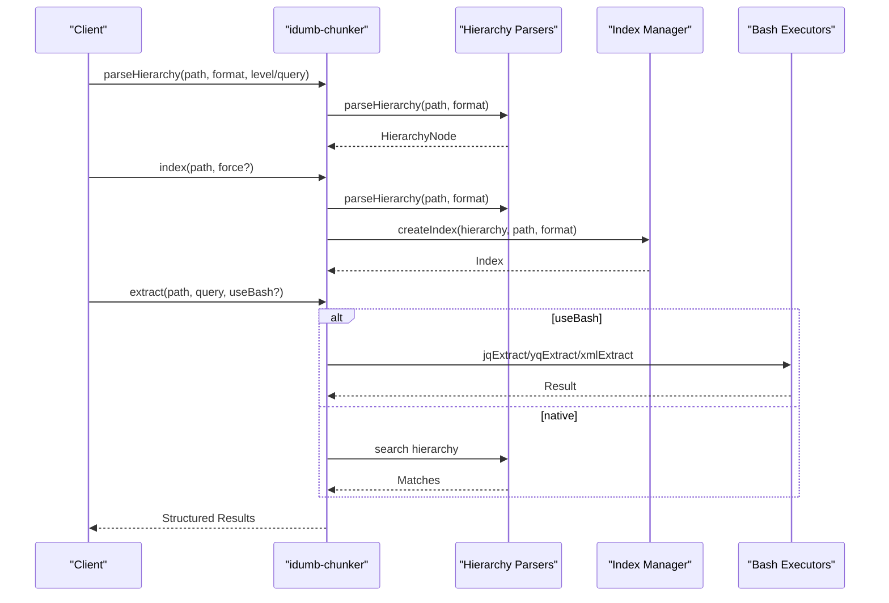

**Diagram sources**
- [idumb-chunker.ts](file://src/tools/idumb-chunker.ts#L454-L546)
- [idumb-chunker.ts](file://src/tools/idumb-chunker.ts#L591-L644)
- [idumb-chunker.ts](file://src/tools/idumb-chunker.ts#L646-L720)
- [hierarchy-parsers.ts](file://src/tools/lib/hierarchy-parsers.ts#L440-L463)
- [index-manager.ts](file://src/tools/lib/index-manager.ts#L111-L155)
- [bash-executors.ts](file://src/tools/lib/bash-executors.ts#L82-L126)

**Section sources**
- [idumb-chunker.ts](file://src/tools/idumb-chunker.ts#L1-L930)
- [hierarchy-parsers.ts](file://src/tools/lib/hierarchy-parsers.ts#L1-L567)
- [index-manager.ts](file://src/tools/lib/index-manager.ts#L1-L373)
- [bash-executors.ts](file://src/tools/lib/bash-executors.ts#L1-L429)

### Context Classifier (idumb-context)
Purpose: Classify project context, detect frameworks, and analyze codebase characteristics.

Key capabilities:
- Project type detection (app, library, monorepo)
- Framework detection (Planning, BMAD, both)
- Language identification via file extensions
- Tests and CI presence detection
- Summary generation for compaction

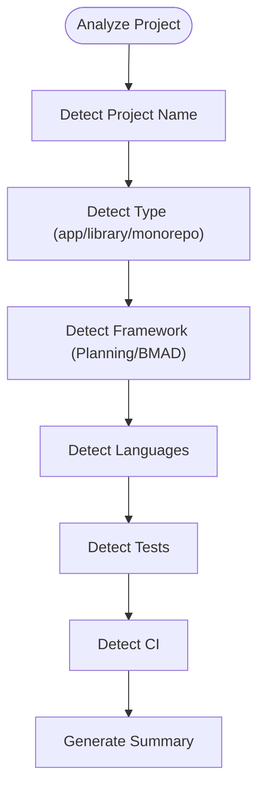

**Diagram sources**
- [idumb-context.ts](file://src/tools/idumb-context.ts#L23-L165)
- [idumb-context.ts](file://src/tools/idumb-context.ts#L168-L208)
- [idumb-context.ts](file://src/tools/idumb-context.ts#L210-L277)

**Section sources**
- [idumb-context.ts](file://src/tools/idumb-context.ts#L1-L277)

### Manifest Tracker (idumb-manifest)
Purpose: Monitor codebase drift, conflicts, and structural violations with git integration.

Key capabilities:
- Snapshot creation and updates
- Drift detection (added/removed/modified files)
- Conflict detection (naming, circular dependencies)
- Git hash verification for atomic commits
- Health assessment and recommendations

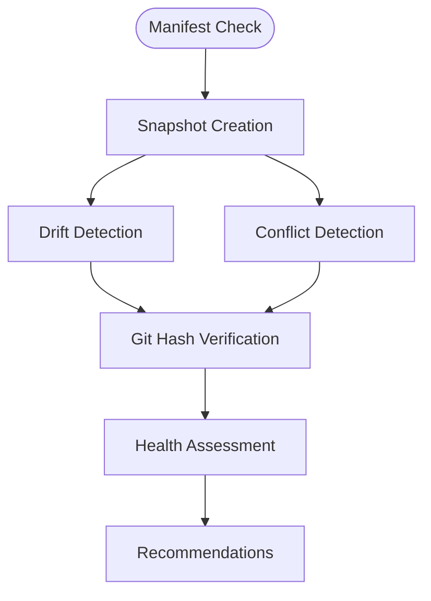

**Diagram sources**
- [idumb-manifest.ts](file://src/tools/idumb-manifest.ts#L370-L441)
- [idumb-manifest.ts](file://src/tools/idumb-manifest.ts#L443-L480)
- [idumb-manifest.ts](file://src/tools/idumb-manifest.ts#L482-L495)
- [idumb-manifest.ts](file://src/tools/idumb-manifest.ts#L497-L533)
- [idumb-manifest.ts](file://src/tools/idumb-manifest.ts#L535-L597)

**Section sources**
- [idumb-manifest.ts](file://src/tools/idumb-manifest.ts#L1-L598)

### Orchestrator (idumb-orchestrator)
Purpose: Coordinate validation skills based on operation type and risk level.

Key capabilities:
- Risk assessment (operation type, file type, path, size)
- Skill activation matrix (security, quality, performance)
- Pre-write and pre-delegate validation hooks
- Phase transition validation coordination

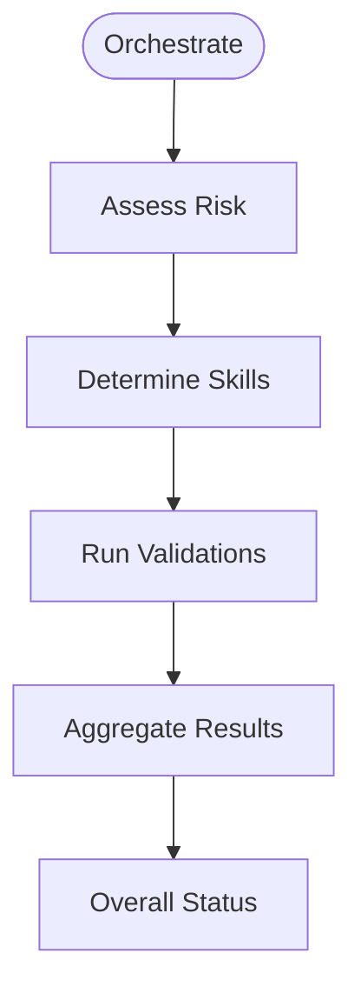

**Diagram sources**
- [idumb-orchestrator.ts](file://src/tools/idumb-orchestrator.ts#L56-L123)
- [idumb-orchestrator.ts](file://src/tools/idumb-orchestrator.ts#L134-L167)
- [idumb-orchestrator.ts](file://src/tools/idumb-orchestrator.ts#L257-L343)
- [idumb-orchestrator.ts](file://src/tools/idumb-orchestrator.ts#L345-L390)
- [idumb-orchestrator.ts](file://src/tools/idumb-orchestrator.ts#L392-L431)
- [idumb-orchestrator.ts](file://src/tools/idumb-orchestrator.ts#L433-L470)
- [idumb-orchestrator.ts](file://src/tools/idumb-orchestrator.ts#L472-L512)

**Section sources**
- [idumb-orchestrator.ts](file://src/tools/idumb-orchestrator.ts#L1-L527)

### Style Manager (idumb-style)
Purpose: Programmatic access to output style operations for consistent formatting.

Key capabilities:
- List available styles with current selection
- Set active style with history tracking
- Inspect style details and compatibility
- Reset to default style

**Section sources**
- [idumb-style.ts](file://src/tools/idumb-style.ts#L1-L196)

### TODO Manager (idumb-todo)
Purpose: Hierarchical task management aligned with governance protocols.

Key capabilities:
- Create tasks with hierarchical prefixes (P1, P2, V, B, GAP, BLOCKER, MAJOR, TEST)
- Update status, content, and priority
- Complete tasks with notes
- List and group by hierarchy
- Sync with OpenCode's TODO system

**Section sources**
- [idumb-todo.ts](file://src/tools/idumb-todo.ts#L1-L385)

## Dependency Analysis
The tool system exhibits clear separation of concerns:
- Core tools depend on shared libraries for hierarchical processing and bash integration
- Orchestrator coordinates validators without tight coupling
- State and config provide foundational persistence
- OpenCode plugin framework enables standardized tool interfaces

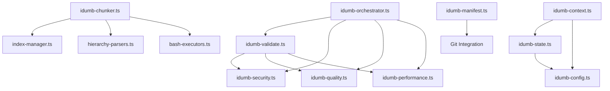

**Diagram sources**
- [idumb-state.ts](file://src/tools/idumb-state.ts#L1-L557)
- [idumb-config.ts](file://src/tools/idumb-config.ts#L1-L1024)
- [idumb-validate.ts](file://src/tools/idumb-validate.ts#L1-L1043)
- [idumb-security.ts](file://src/tools/idumb-security.ts#L1-L359)
- [idumb-performance.ts](file://src/tools/idumb-performance.ts#L1-L533)
- [idumb-quality.ts](file://src/tools/idumb-quality.ts#L1-L524)
- [idumb-chunker.ts](file://src/tools/idumb-chunker.ts#L1-L930)
- [idumb-orchestrator.ts](file://src/tools/idumb-orchestrator.ts#L1-L527)
- [idumb-manifest.ts](file://src/tools/idumb-manifest.ts#L1-L598)
- [idumb-context.ts](file://src/tools/idumb-context.ts#L1-L277)
- [index-manager.ts](file://src/tools/lib/index-manager.ts#L1-L373)
- [hierarchy-parsers.ts](file://src/tools/lib/hierarchy-parsers.ts#L1-L567)
- [bash-executors.ts](file://src/tools/lib/bash-executors.ts#L1-L429)

**Section sources**
- [idumb-state.ts](file://src/tools/idumb-state.ts#L1-L557)
- [idumb-config.ts](file://src/tools/idumb-config.ts#L1-L1024)
- [idumb-validate.ts](file://src/tools/idumb-validate.ts#L1-L1043)
- [idumb-security.ts](file://src/tools/idumb-security.ts#L1-L359)
- [idumb-performance.ts](file://src/tools/idumb-performance.ts#L1-L533)
- [idumb-quality.ts](file://src/tools/idumb-quality.ts#L1-L524)
- [idumb-chunker.ts](file://src/tools/idumb-chunker.ts#L1-L930)
- [idumb-orchestrator.ts](file://src/tools/idumb-orchestrator.ts#L1-L527)
- [idumb-manifest.ts](file://src/tools/idumb-manifest.ts#L1-L598)
- [idumb-context.ts](file://src/tools/idumb-context.ts#L1-L277)
- [index-manager.ts](file://src/tools/lib/index-manager.ts#L1-L373)
- [hierarchy-parsers.ts](file://src/tools/lib/hierarchy-parsers.ts#L1-L567)
- [bash-executors.ts](file://src/tools/lib/bash-executors.ts#L1-L429)

## Performance Considerations
- Chunked processing: Use idumb-chunker.read with appropriate chunk sizes to avoid context overflow
- Bash integration: Prefer jq, yq, xmllint for large files; fall back to native parsing when tools unavailable
- Index caching: Use idumb-chunker.index with force:false to leverage cached indexes
- Resource monitoring: Regularly run idumb-performance.monitor to prevent .idumb growth beyond 100MB
- Validation scope: Use targeted checks (e.g., idumb-validate.structure, idumb-validate.schema) to reduce overhead
- Orchestration: Employ idumb-orchestrator with risk-aware skill activation to minimize unnecessary validations

[No sources needed since this section provides general guidance]

## Troubleshooting Guide
Common issues and resolutions:
- State corruption: Regenerate .idumb/brain/state.json via idumb-config.ensureConfigExists
- Missing configuration: Run idumb-config.init to bootstrap defaults and detect planning system
- Stale context: Use idumb-validate.freshness to identify outdated files and anchors
- Security violations: Review idumb-security.validate output and apply suggested fixes
- Performance bottlenecks: Use idumb-performance.validate to identify scanning inefficiencies and resource issues
- Integration problems: Run idumb-validate.integrationPoints to check agent, command, and tool exports
- Manifest drift: Use idumb-manifest.drift and idumb-manifest.conflicts to diagnose structural issues
- Style issues: Use idumb-style.list and idumb-style.info to inspect and adjust output styles
- TODO synchronization: Use idumb-todo.sync to bridge with OpenCode's TODO system

**Section sources**
- [idumb-config.ts](file://src/tools/idumb-config.ts#L445-L511)
- [idumb-validate.ts](file://src/tools/idumb-validate.ts#L189-L280)
- [idumb-security.ts](file://src/tools/idumb-security.ts#L247-L310)
- [idumb-performance.ts](file://src/tools/idumb-performance.ts#L376-L471)
- [idumb-manifest.ts](file://src/tools/idumb-manifest.ts#L443-L495)
- [idumb-style.ts](file://src/tools/idumb-style.ts#L23-L104)
- [idumb-todo.ts](file://src/tools/idumb-todo.ts#L339-L374)

## Conclusion
iDumb's tool system provides a robust, extensible foundation for governance, validation, and productivity. Its plugin-based architecture, persistent state and configuration, and shared libraries enable efficient processing of hierarchical data, comprehensive security and quality checks, and seamless integration with agents and commands. By leveraging orchestration and targeted validations, teams can maintain high standards while scaling across projects and frameworks.

[No sources needed since this section summarizes without analyzing specific files]

## Appendices

### API Interfaces and Parameter Handling
- All tools use @opencode-ai/plugin tool() wrapper with typed arguments
- Context provides directory and agent metadata
- Parameters validated via tool.schema with optional/required descriptors
- Results returned as JSON strings for interoperability

**Section sources**
- [idumb-state.ts](file://src/tools/idumb-state.ts#L81-L110)
- [idumb-config.ts](file://src/tools/idumb-config.ts#L652-L681)
- [idumb-validate.ts](file://src/tools/idumb-validate.ts#L28-L105)
- [idumb-security.ts](file://src/tools/idumb-security.ts#L247-L310)
- [idumb-performance.ts](file://src/tools/idumb-performance.ts#L379-L471)
- [idumb-quality.ts](file://src/tools/idumb-quality.ts#L419-L482)
- [idumb-chunker.ts](file://src/tools/idumb-chunker.ts#L123-L168)
- [idumb-context.ts](file://src/tools/idumb-context.ts#L23-L165)
- [idumb-manifest.ts](file://src/tools/idumb-manifest.ts#L370-L441)
- [idumb-orchestrator.ts](file://src/tools/idumb-orchestrator.ts#L257-L343)
- [idumb-style.ts](file://src/tools/idumb-style.ts#L23-L104)
- [idumb-todo.ts](file://src/tools/idumb-todo.ts#L101-L139)

### Integration Patterns
- Orchestration: idumb-orchestrator coordinates validation skills based on risk and operation type
- Validation pipeline: idumb-validate integrates structure, schema, freshness, alignment, and integration checks
- Data processing: idumb-chunker leverages shared parsers and executors for hierarchical data
- Governance: idumb-state and idumb-config provide persistent state and configuration across agents

**Section sources**
- [idumb-orchestrator.ts](file://src/tools/idumb-orchestrator.ts#L1-L527)
- [idumb-validate.ts](file://src/tools/idumb-validate.ts#L1-L1043)
- [idumb-chunker.ts](file://src/tools/idumb-chunker.ts#L1-L930)
- [idumb-state.ts](file://src/tools/idumb-state.ts#L1-L557)
- [idumb-config.ts](file://src/tools/idumb-config.ts#L1-L1024)

### Development Guidelines and Custom Tool Creation
- Wrap functions with tool() and define schema-driven arguments
- Use context.directory for file operations and context.agent for provenance
- Implement idempotent operations and handle missing files gracefully
- Return JSON strings for consistent inter-tool communication
- Leverage shared libraries for parsing, indexing, and bash integration
- Follow naming conventions: idumb-<function>.ts for tool files

**Section sources**
- [idumb-state.ts](file://src/tools/idumb-state.ts#L81-L110)
- [idumb-config.ts](file://src/tools/idumb-config.ts#L652-L681)
- [idumb-chunker.ts](file://src/tools/idumb-chunker.ts#L1-L930)
- [index-manager.ts](file://src/tools/lib/index-manager.ts#L1-L373)
- [bash-executors.ts](file://src/tools/lib/bash-executors.ts#L1-L429)
- [hierarchy-parsers.ts](file://src/tools/lib/hierarchy-parsers.ts#L1-L567)

### Practical Examples
- Health check: Run idumb-validate with scope=all to assess overall system health
- Security audit: Execute idumb-security.validate on scripts with patterns=["all"]
- Performance review: Use idumb-performance.validate on build scripts and workflows
- Context analysis: Run idumb-context to detect project type and framework presence
- Manifest drift: Use idumb-manifest.drift to compare current state with snapshot
- Orchestration: Call idumb-orchestrator.orchestrate for risk-aware validation before file changes

**Section sources**
- [idumb-validate.ts](file://src/tools/idumb-validate.ts#L401-L456)
- [idumb-security.ts](file://src/tools/idumb-security.ts#L247-L310)
- [idumb-performance.ts](file://src/tools/idumb-performance.ts#L379-L471)
- [idumb-context.ts](file://src/tools/idumb-context.ts#L23-L165)
- [idumb-manifest.ts](file://src/tools/idumb-manifest.ts#L443-L480)
- [idumb-orchestrator.ts](file://src/tools/idumb-orchestrator.ts#L257-L343)

### Monitoring and Maintenance Procedures
- Regular validation: Schedule idumb-validate.structure and idumb-validate.schema checks
- Resource cleanup: Use idumb-performance.monitor and idumb-state.purgeOldSessions
- Security reviews: Periodic idumb-security.validate scans for critical and high severity issues
- Quality gates: Integrate idumb-quality.validate in CI pipelines
- Manifest snapshots: Run idumb-manifest.snapshot hourly or on significant changes

**Section sources**
- [idumb-validate.ts](file://src/tools/idumb-validate.ts#L1-L1043)
- [idumb-performance.ts](file://src/tools/idumb-performance.ts#L473-L520)
- [idumb-state.ts](file://src/tools/idumb-state.ts#L439-L553)
- [idumb-security.ts](file://src/tools/idumb-security.ts#L247-L310)
- [idumb-quality.ts](file://src/tools/idumb-quality.ts#L419-L482)
- [idumb-manifest.ts](file://src/tools/idumb-manifest.ts#L370-L441)

### Dependency Management and Version Compatibility
- Tool wrappers: All tools use @opencode-ai/plugin for consistent interfaces
- Shared libraries: index-manager, hierarchy-parsers, and bash-executors provide reusable functionality
- Configuration versioning: idumb-config maintains version and lastModified fields
- State versioning: idumb-state includes version and initialized timestamps
- Planning integration: idumb-config.syncStatusFromPlanning merges .planning/STATE.md when present

**Section sources**
- [idumb-config.ts](file://src/tools/idumb-config.ts#L517-L562)
- [idumb-state.ts](file://src/tools/idumb-state.ts#L13-L48)
- [idumb-config.ts](file://src/tools/idumb-config.ts#L567-L603)
- [index-manager.ts](file://src/tools/lib/index-manager.ts#L43-L53)
- [hierarchy-parsers.ts](file://src/tools/lib/hierarchy-parsers.ts#L17-L41)
- [bash-executors.ts](file://src/tools/lib/bash-executors.ts#L16-L31)