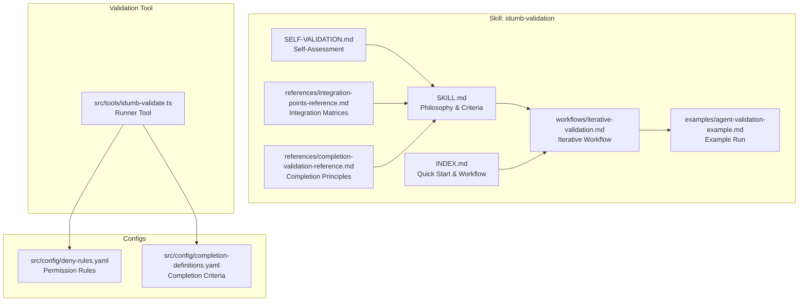
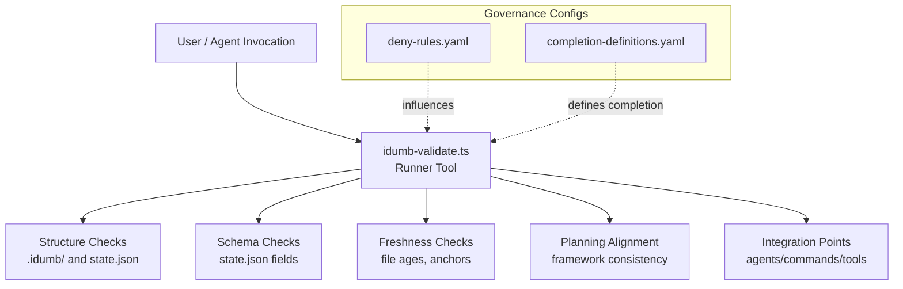
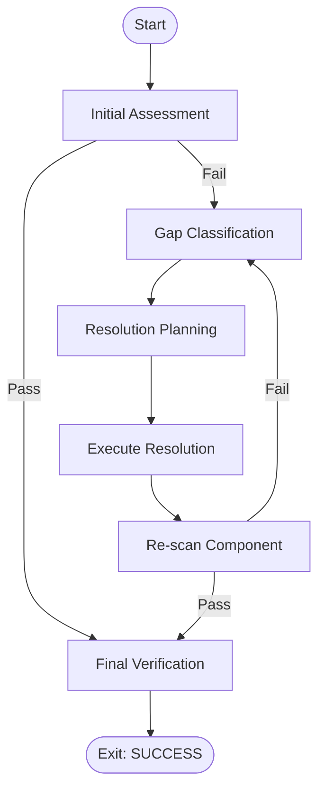
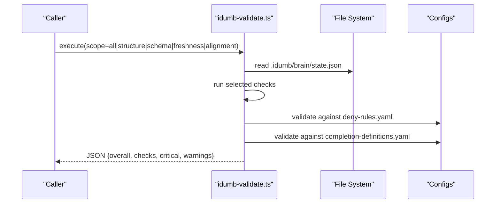
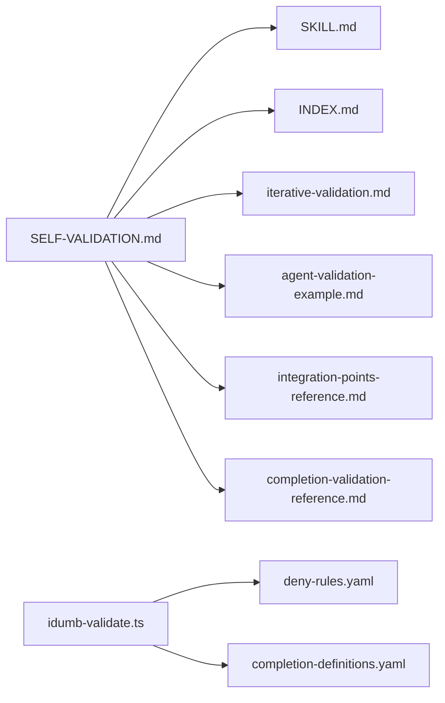

# Validation Tool

<cite>
**Referenced Files in This Document**
- [SKILL.md](file://src/skills/idumb-validation/SKILL.md)
- [INDEX.md](file://src/skills/idumb-validation/INDEX.md)
- [SELF-VALIDATION.md](file://src/skills/idumb-validation/SELF-VALIDATION.md)
- [iterative-validation.md](file://src/skills/idumb-validation/workflows/iterative-validation.md)
- [agent-validation-example.md](file://src/skills/idumb-validation/examples/agent-validation-example.md)
- [integration-points-reference.md](file://src/skills/idumb-validation/references/integration-points-reference.md)
- [completion-validation-reference.md](file://src/skills/idumb-validation/references/completion-validation-reference.md)
- [idumb-validate.ts](file://src/tools/idumb-validate.ts)
- [deny-rules.yaml](file://src/config/deny-rules.yaml)
- [completion-definitions.yaml](file://src/config/completion-definitions.yaml)
</cite>

## Table of Contents
1. [Introduction](#introduction)
2. [Project Structure](#project-structure)
3. [Core Components](#core-components)
4. [Architecture Overview](#architecture-overview)
5. [Detailed Component Analysis](#detailed-component-analysis)
6. [Dependency Analysis](#dependency-analysis)
7. [Performance Considerations](#performance-considerations)
8. [Troubleshooting Guide](#troubleshooting-guide)
9. [Conclusion](#conclusion)
10. [Appendices](#appendices)

## Introduction
This document describes the iDumb Validation Tool and the broader validation framework that ensures agent actions, permissions, and workflow compliance across the iDumb meta-framework. It explains the three-layer validation model (Structure, Integration, Behavior), the iterative gap detection lifecycle, and the completion-driven validation philosophy. It also covers integration with the idumb-validation skill system, custom validation workflows, validation contexts, evidence collection, and result interpretation. Guidance is included for implementing custom validators, extending validation rules, integrating with external validation services, optimizing performance, and debugging failures.

## Project Structure
The validation capability is centered around a dedicated skill with supporting references, examples, and a validation tool:
- Skill documentation defines validation philosophy, criteria, and workflows.
- References provide integration point matrices and completion-driven guidance.
- Examples demonstrate end-to-end validation runs.
- The validation tool performs structural, schema, freshness, and integration checks.

**Diagram sources**
- [SKILL.md](file://src/skills/idumb-validation/SKILL.md#L1-L720)
- [INDEX.md](file://src/skills/idumb-validation/INDEX.md#L1-L168)
- [SELF-VALIDATION.md](file://src/skills/idumb-validation/SELF-VALIDATION.md#L1-L210)
- [iterative-validation.md](file://src/skills/idumb-validation/workflows/iterative-validation.md#L1-L236)
- [agent-validation-example.md](file://src/skills/idumb-validation/examples/agent-validation-example.md#L1-L159)
- [integration-points-reference.md](file://src/skills/idumb-validation/references/integration-points-reference.md#L1-L247)
- [completion-validation-reference.md](file://src/skills/idumb-validation/references/completion-validation-reference.md#L1-L203)
- [idumb-validate.ts](file://src/tools/idumb-validate.ts#L1-L1043)
- [deny-rules.yaml](file://src/config/deny-rules.yaml#L1-L398)
- [completion-definitions.yaml](file://src/config/completion-definitions.yaml#L1-L990)

**Section sources**
- [SKILL.md](file://src/skills/idumb-validation/SKILL.md#L1-L720)
- [INDEX.md](file://src/skills/idumb-validation/INDEX.md#L1-L168)

## Core Components
- Validation Philosophy and Criteria
  - Completion-driven validation exits when purpose is achieved, not when counters expire.
  - Iterative gap detection: detect → assess → fix → re-validate → exit only when PASS.
  - Integration point thresholds: Highest tier (30+), Middle tier (15+), Lowest tier (10+).
- Three-Layer Validation Model
  - Layer 1: Structure – files exist, formats correct, required metadata present.
  - Layer 2: Integration – minimum connections documented and counted.
  - Layer 3: Behavior – works as intended, no regressions, structured results.
- Validation Categories
  - Agent, Tool, Command, Workflow, Schema, Configuration validations with category-specific checklists and thresholds.
- Iterative Workflow
  - Initial assessment → Gap classification → Resolution planning → Execute resolution → Final verification.
  - Stall detection and escalation protocols prevent silent failure.
- Evidence Requirements
  - Artifacts, state updates, and history entries are mandatory for every completion.

**Section sources**
- [SKILL.md](file://src/skills/idumb-validation/SKILL.md#L24-L116)
- [SKILL.md](file://src/skills/idumb-validation/SKILL.md#L120-L447)
- [iterative-validation.md](file://src/skills/idumb-validation/workflows/iterative-validation.md#L1-L236)
- [completion-validation-reference.md](file://src/skills/idumb-validation/references/completion-validation-reference.md#L1-L203)

## Architecture Overview
The validation architecture integrates skill-defined criteria with a modular validation tool and governance configurations. The tool supports:
- Structural checks (.idumb/ directory, state.json presence).
- Schema validation (state.json fields and types).
- Freshness checks (file ages, anchor staleness).
- Planning alignment checks (framework consistency).
- Integration point validation across agents, commands, and tools.

**Diagram sources**
- [idumb-validate.ts](file://src/tools/idumb-validate.ts#L29-L456)
- [deny-rules.yaml](file://src/config/deny-rules.yaml#L1-L398)
- [completion-definitions.yaml](file://src/config/completion-definitions.yaml#L1-L990)

## Detailed Component Analysis

### Validation Framework and Criteria
- Completion-Driven Principle
  - Workflows exit when purpose is achieved; stalls escalate with full context.
  - Prohibited patterns: max_iterations, max_retries, timeouts-as-exits, arbitrary limits.
- Integration Point Thresholds
  - Highest tier: 30+ connections; Middle tier: 15+; Lowest tier: 10+.
- Three-Layer Model
  - Structure: required files, formats, frontmatter, schema.
  - Integration: reads/writes, validations, triggers, dependencies, relations.
  - Behavior: permissions, delegation, state updates, structured returns.
- Category-Specific Checklists
  - Agents: required files, frontmatter fields, permission structure, forbidden patterns.
  - Tools: file naming, tool wrapper usage, exports, argument schemas, return format.
  - Commands: required sections, agent binding, usage and examples.
  - Workflows: required sections, prerequisites, steps, completion criteria, error handling.
  - Schemas: JSON schema properties, required fields, type definitions.
  - Configurations: versioning, metadata, rule definitions.

**Section sources**
- [SKILL.md](file://src/skills/idumb-validation/SKILL.md#L24-L116)
- [SKILL.md](file://src/skills/idumb-validation/SKILL.md#L120-L447)
- [completion-validation-reference.md](file://src/skills/idumb-validation/references/completion-validation-reference.md#L40-L65)

### Iterative Validation Workflow
- Phases
  - Initial Assessment: run comprehensive scans across components.
  - Gap Classification: severity, tier, fixability, gap types.
  - Resolution Planning: auto-fix, delegation-required, user-input-required.
  - Execute Resolution: apply fixes, re-validate, regression checks.
  - Final Verification: thresholds met, no regressions, evidence collected.
- Stall Detection and Escalation
  - Same output over cycles, no progress over cycles, fix failure repeats, dependency deadlocks.
  - Escalation options: accept partial, provide guidance, continue iteration, escalate.
- Evidence Artifacts
  - Initial assessment, gap classification, resolution plan, execution log, final report.

**Diagram sources**
- [iterative-validation.md](file://src/skills/idumb-validation/workflows/iterative-validation.md#L1-L236)

**Section sources**
- [iterative-validation.md](file://src/skills/idumb-validation/workflows/iterative-validation.md#L1-L236)

### Validation Tool: idumb-validate
- Capabilities
  - Structure: checks .idumb/ existence, brain/ subdirectories, state.json presence.
  - Schema: validates required fields and types in state.json.
  - Freshness: detects stale files and anchors.
  - Planning Alignment: verifies framework consistency with planning system.
  - Integration Points: parses YAML frontmatter, extracts permissions/delegations, validates exports and wrappers.
- Outputs
  - Structured JSON with overall status, check details, critical/warning lists.
  - Integration reports with pass/fail/warning counts and issue summaries.
- Usage
  - Scope-based execution: all, structure, schema, freshness, alignment.
  - Integration points validation across agents, commands, and tools.

**Diagram sources**
- [idumb-validate.ts](file://src/tools/idumb-validate.ts#L402-L456)
- [deny-rules.yaml](file://src/config/deny-rules.yaml#L1-L398)
- [completion-definitions.yaml](file://src/config/completion-definitions.yaml#L1-L990)

**Section sources**
- [idumb-validate.ts](file://src/tools/idumb-validate.ts#L29-L456)
- [idumb-validate.ts](file://src/tools/idumb-validate.ts#L539-L754)

### Integration Points Reference
- Agent: idumb-supreme-coordinator integrates with state, config, tools, commands, and governance.
- Tool: idumb-validate integrates with state/config, schemas, planning, and writes validation records.
- Config: completion-definitions.yaml integrates with all workflows and commands.
- Counting Methodology: unique connections across reads/writes/validates/triggers/blocks/relates; thresholds by tier; gap analysis and resolution options.

**Section sources**
- [integration-points-reference.md](file://src/skills/idumb-validation/references/integration-points-reference.md#L1-L247)

### Completion-Driven Validation Reference
- Principle: exit when purpose achieved; escalate on stall.
- Prohibited patterns: arbitrary iteration limits, retries-as-exits, timeouts-as-exits, arbitrary caps.
- Stall Detection: output hash unchanged, no progress signal, error repetition, user non-response.
- Evidence Requirements: artifacts, state updates, history entries.

**Section sources**
- [completion-validation-reference.md](file://src/skills/idumb-validation/references/completion-validation-reference.md#L1-L203)

### Agent Validation Example
- Scenario: validating a new agent profile.
- Execution: structure checks, integration point counts, behavior verification notes.
- Resolution: adds reads/writes/validations/triggers, updates tools and return format.
- Re-validation: integration points increase from 9 to 19; threshold met; status validated.

**Section sources**
- [agent-validation-example.md](file://src/skills/idumb-validation/examples/agent-validation-example.md#L1-L159)

## Dependency Analysis
- Skill Dependencies
  - idumb-validation skill references governance, hierarchical-mindfulness, and core tools.
  - Self-validation demonstrates integration with idumb-validate, idumb-state, idumb-config, idumb-context, and configuration files.
- Tool Dependencies
  - idumb-validate depends on deny-rules.yaml for permission enforcement and completion-definitions.yaml for completion criteria.
- Integration Dependencies
  - Integration matrices enumerate reads/writes/validates/triggers and dependencies across components.

**Diagram sources**
- [SELF-VALIDATION.md](file://src/skills/idumb-validation/SELF-VALIDATION.md#L1-L210)
- [SKILL.md](file://src/skills/idumb-validation/SKILL.md#L1-L720)
- [INDEX.md](file://src/skills/idumb-validation/INDEX.md#L1-L168)
- [iterative-validation.md](file://src/skills/idumb-validation/workflows/iterative-validation.md#L1-L236)
- [agent-validation-example.md](file://src/skills/idumb-validation/examples/agent-validation-example.md#L1-L159)
- [integration-points-reference.md](file://src/skills/idumb-validation/references/integration-points-reference.md#L1-L247)
- [completion-validation-reference.md](file://src/skills/idumb-validation/references/completion-validation-reference.md#L1-L203)
- [idumb-validate.ts](file://src/tools/idumb-validate.ts#L1-L1043)
- [deny-rules.yaml](file://src/config/deny-rules.yaml#L1-L398)
- [completion-definitions.yaml](file://src/config/completion-definitions.yaml#L1-L990)

**Section sources**
- [SELF-VALIDATION.md](file://src/skills/idumb-validation/SELF-VALIDATION.md#L99-L121)
- [idumb-validate.ts](file://src/tools/idumb-validate.ts#L1-L1043)

## Performance Considerations
- Scoping
  - Use scope parameters to limit checks to specific areas (structure, schema, freshness, alignment) for faster runs.
- Batch Processing
  - Aggregate results and avoid redundant filesystem reads by caching parsed state.json and configuration files during a single run.
- Caching Strategies
  - Cache integration point counts per component after initial scan; invalidate cache on file changes detected via freshness checks.
- Avoid Arbitrary Limits
  - Prefer completion-driven exits and stall detection over polling or timeout-based early exits.
- Parallelization
  - Where safe and deterministic, parallelize independent component validations (e.g., tools, commands) while respecting shared state dependencies.

[No sources needed since this section provides general guidance]

## Troubleshooting Guide
- Common Failures
  - Missing .idumb/ or state.json: ensure initialization completed.
  - Schema violations: missing required fields or invalid types in state.json.
  - Stale context: files older than configured threshold; refresh or re-run.
  - Planning misalignment: framework mismatch with detected planning system; reconcile via initialization.
- Gap Resolution
  - Use integration matrices to identify missing connections; add reads/writes/validations/triggers.
  - For agents, ensure permission structure avoids forbidden patterns and includes required fields.
- Debugging and Reporting
  - Review validation reports in governance storage; collect evidence artifacts and history entries.
  - On stall, follow escalation protocol: checkpoint, document attempts, present options to user.
- Error Handling
  - Prohibited patterns are actively rejected; replace with measurable exits_when conditions and stall detection.

**Section sources**
- [idumb-validate.ts](file://src/tools/idumb-validate.ts#L29-L456)
- [iterative-validation.md](file://src/skills/idumb-validation/workflows/iterative-validation.md#L145-L213)
- [completion-validation-reference.md](file://src/skills/idumb-validation/references/completion-validation-reference.md#L40-L65)

## Conclusion
The iDumb Validation Tool and framework enforce rigorous, completion-driven validation across agents, tools, commands, workflows, schemas, and configurations. By combining structured checks, integration point matrices, and iterative gap resolution with stall detection and escalation, the system ensures thoroughness without arbitrary limits. Adhering to evidence requirements and leveraging the provided tooling and references enables reliable, auditable, and extensible validation processes.

[No sources needed since this section summarizes without analyzing specific files]

## Appendices

### Implementing Custom Validators
- Extend the runner tool
  - Add new check functions with typed results and integrate into the scope-based executor.
  - Emit structured JSON with overall status and categorized issues.
- Integrate with governance rules
  - Validate against deny-rules.yaml for permissions and delegation constraints.
  - Align with completion-definitions.yaml for exit criteria and stall detection.
- Example patterns
  - Use YAML frontmatter extraction for agent validation.
  - Use export parsing for tool validation.
  - Use filesystem globbing for command and workflow validation.

**Section sources**
- [idumb-validate.ts](file://src/tools/idumb-validate.ts#L402-L456)
- [idumb-validate.ts](file://src/tools/idumb-validate.ts#L539-L754)
- [deny-rules.yaml](file://src/config/deny-rules.yaml#L1-L398)
- [completion-definitions.yaml](file://src/config/completion-definitions.yaml#L1-L990)

### Extending Validation Rules
- Permission Rules
  - Add specific deny patterns with contextual messages; avoid broad denies.
  - Define delegation allowances per agent and file-type allowances.
- Completion Criteria
  - Define measurable exits_when conditions for workflows and loops.
  - Include stall detection and escalation templates.
- Integration Point Matrices
  - Document reads/writes/validates/triggers and dependencies for new components.

**Section sources**
- [deny-rules.yaml](file://src/config/deny-rules.yaml#L1-L398)
- [completion-definitions.yaml](file://src/config/completion-definitions.yaml#L1-L990)
- [integration-points-reference.md](file://src/skills/idumb-validation/references/integration-points-reference.md#L1-L247)

### Integrating with External Validation Services
- API-based Validation
  - Wrap external service calls in tool wrappers; return structured JSON with evidence and status.
- Evidence Collection
  - Persist external validation results alongside local artifacts; update state and history.
- Compliance Checks
  - Map external service outputs to internal schema and completion criteria.

[No sources needed since this section provides general guidance]

### Validation Contexts, Evidence, and Interpretation
- Validation Contexts
  - Use skill documentation and integration matrices to interpret component roles and required connections.
- Evidence Collection
  - Maintain artifacts, state updates, and history entries for each validation cycle.
- Result Interpretation
  - Pass: all checks passed and thresholds met.
  - Warning: non-blocking issues or partial compliance.
  - Fail: critical issues remain unresolved.

**Section sources**
- [iterative-validation.md](file://src/skills/idumb-validation/workflows/iterative-validation.md#L215-L235)
- [completion-validation-reference.md](file://src/skills/idumb-validation/references/completion-validation-reference.md#L103-L120)