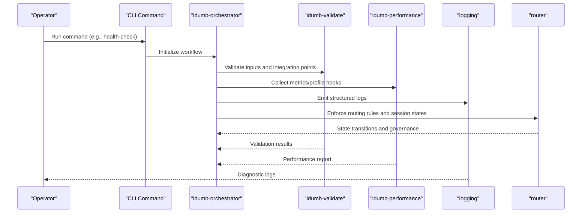
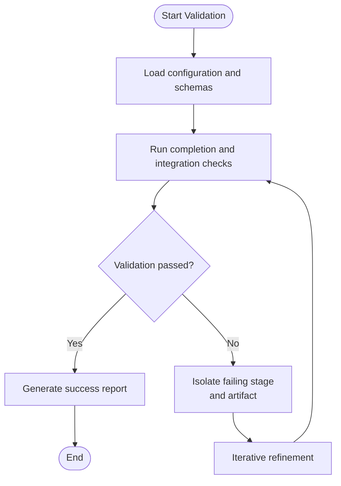
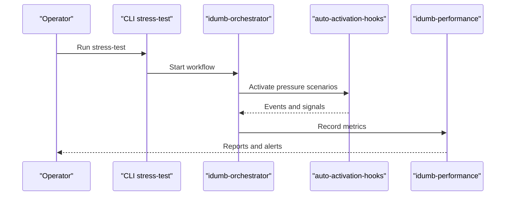
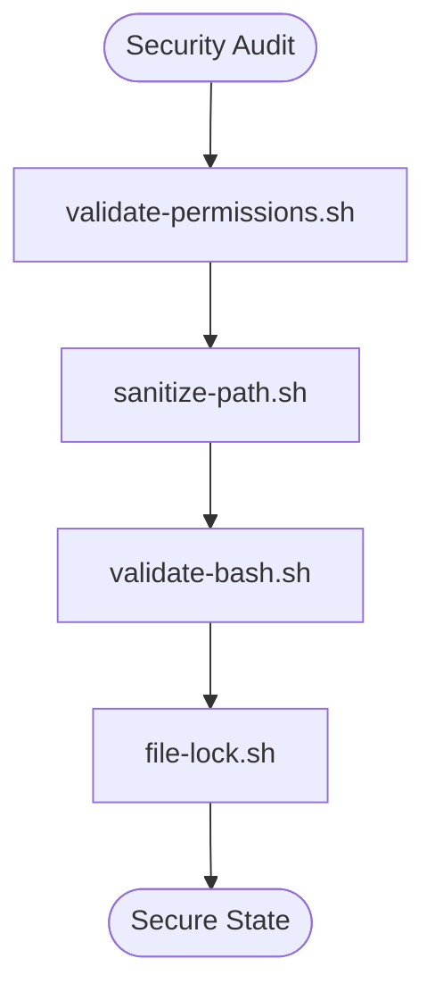
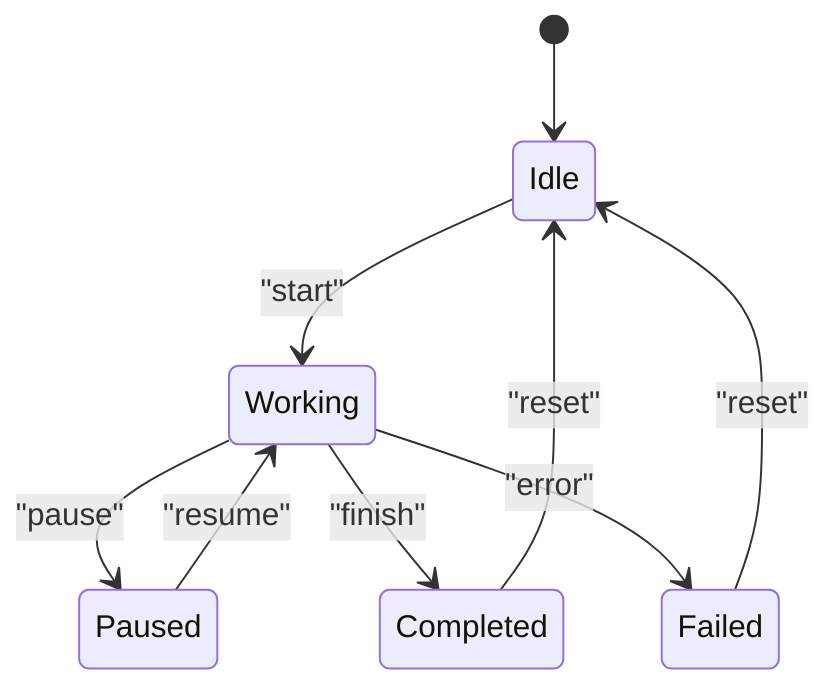
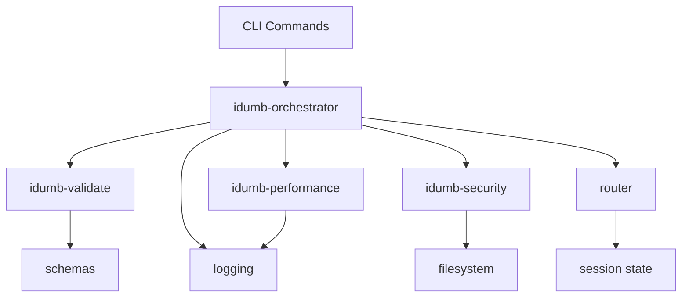

# Troubleshooting Guide

<cite>
**Referenced Files in This Document**
- [README.md](file://README.md)
- [src/plugins/lib/logging.ts](file://src/plugins/lib/logging.ts)
- [src/tools/idumb-performance.ts](file://src/tools/idumb-performance.ts)
- [src/skills/idumb-security/scripts/validate-permissions.sh](file://src/skills/idumb-security/scripts/validate-permissions.sh)
- [src/skills/idumb-security/scripts/sanitize-path.sh](file://src/skills/idumb-security/scripts/sanitize-path.sh)
- [src/skills/idumb-security/scripts/validate-bash.sh](file://src/skills/idumb-security/scripts/validate-bash.sh)
- [src/skills/idumb-security/scripts/file-lock.sh](file://src/skills/idumb-security/scripts/file-lock.sh)
- [src/skills/idumb-validation/references/completion-validation-reference.md](file://src/skills/idumb-validation/references/completion-validation-reference.md)
- [src/skills/idumb-validation/references/integration-points-reference.md](file://src/skills/idumb-validation/references/integration-points-reference.md)
- [src/skills/idumb-validation/workflows/iterative-validation.md](file://src/skills/idumb-validation/workflows/iterative-validation.md)
- [src/skills/idumb-stress-test/references/auto-activation-hooks.md](file://src/skills/idumb-stress-test/references/auto-activation-hooks.md)
- [src/skills/idumb-stress-test/workflows/stress-test-workflow.md](file://src/skills/idumb-stress-test/workflows/stress-test-workflow.md)
- [src/skills/hierarchical-mindfulness/references/session-tracking.md](file://src/skills/hierarchical-mindfulness/references/session-tracking.md)
- [src/skills/hierarchical-mindfulness/examples/resumed-session.md](file://src/skills/hierarchical-mindfulness/examples/resumed-session.md)
- [src/skills/hierarchical-mindfulness/examples/chain-recovery.md](file://src/skills/hierarchical-mindfulness/examples/chain-recovery.md)
- [src/schemas/brain-state-schema.json](file://src/schemas/brain-state-schema.json)
- [src/schemas/checkpoint-schema.json](file://src/schemas/checkpoint-schema.json)
- [src/router/routing-rules.md](file://src/router/routing-rules.md)
- [src/router/SESSION-STATES-GOVERNANCE.md](file://src/router/SESSION-STATES-GOVERNANCE.md)
- [src/commands/idumb/debug.md](file://src/commands/idumb/debug.md)
- [src/commands/idumb/health-check.md](file://src/commands/idumb/health-check.md)
- [src/commands/idumb/validate.md](file://src/commands/idumb/validate.md)
- [src/commands/idumb/status.md](file://src/commands/idumb/status.md)
- [src/commands/idumb/pre-flight.md](file://src/commands/idumb/pre-flight.md)
- [src/commands/idumb/stress-test.md](file://src/commands/idumb/stress-test.md)
- [src/commands/idumb/verify-work.md](file://src/commands/idumb/verify-work.md)
- [src/commands/idumb/config.md](file://src/commands/idumb/config.md)
- [src/commands/idumb/init.md](file://src/commands/idumb/init.md)
- [src/commands/idumb/map-codebase.md](file://src/commands/idumb/map-codebase.md)
- [src/commands/idumb/new-project.md](file://src/commands/idumb/new-project.md)
- [src/commands/idumb/plan-phase.md](file://src/commands/idumb/plan-phase.md)
- [src/commands/idumb/execute-phase.md](file://src/commands/idumb/execute-phase.md)
- [src/commands/idumb/discuss-phase.md](file://src/commands/idumb/discuss-phase.md)
- [src/commands/idumb/roadmap.md](file://src/commands/idumb/roadmap.md)
- [src/commands/idumb/research.md](file://src/commands/idumb/research.md)
- [src/commands/idumb/resume.md](file://src/commands/idumb/resume.md)
- [src/commands/idumb/style.md](file://src/commands/idumb/style.md)
- [src/commands/idumb/certify.md](file://src/commands/idumb/certify.md)
- [src/commands/idumb/help.md](file://src/commands/idumb/help.md)
- [src/tools/idumb-config.ts](file://src/tools/idumb-config.ts)
- [src/tools/idumb-state.ts](file://src/tools/idumb-state.ts)
- [src/tools/idumb-validate.ts](file://src/tools/idumb-validate.ts)
- [src/tools/idumb-security.ts](file://src/tools/idumb-security.ts)
- [src/tools/idumb-quality.ts](file://src/tools/idumb-quality.ts)
- [src/tools/idumb-performance.ts](file://src/tools/idumb-performance.ts)
- [src/tools/idumb-context.ts](file://src/tools/idumb-context.ts)
- [src/tools/idumb-orchestrator.ts](file://src/tools/idumb-orchestrator.ts)
- [src/tools/lib/bash-executors.ts](file://src/tools/lib/bash-executors.ts)
- [src/tools/lib/hierarchy-parsers.ts](file://src/tools/lib/hierarchy-parsers.ts)
- [src/tools/lib/index-manager.ts](file://src/tools/lib/index-manager.ts)
- [src/security/integration-counter.sh](file://src/security/integration-counter.sh)
</cite>

## Table of Contents
1. [Introduction](#introduction)
2. [Project Structure](#project-structure)
3. [Core Components](#core-components)
4. [Architecture Overview](#architecture-overview)
5. [Detailed Component Analysis](#detailed-component-analysis)
6. [Dependency Analysis](#dependency-analysis)
7. [Performance Considerations](#performance-considerations)
8. [Troubleshooting Guide](#troubleshooting-guide)
9. [Conclusion](#conclusion)
10. [Appendices](#appendices)

## Introduction
This troubleshooting guide provides a practical, step-by-step methodology for diagnosing and resolving issues in the iDumb framework. It covers systematic debugging, root cause analysis, validation and verification protocols, performance profiling, security and permissions, configuration errors, upgrade and compatibility concerns, and escalation pathways. The guide leverages the framework’s built-in commands, skills, tools, and schemas to ensure reproducible diagnostics and reliable resolutions.

## Project Structure
The iDumb framework organizes functionality into:
- Commands: CLI entry points for lifecycle operations (init, plan-phase, execute-phase, health-check, stress-test, validate, etc.).
- Skills: Reusable capabilities for validation, security, performance, stress testing, governance, and mindfulness.
- Tools: Orchestration, configuration, state, security, quality, performance, and context utilities.
- Plugins: Core libraries for logging, governance, session tracking, metrics, and schema validation.
- Schemas: JSON schemas for brain state and checkpoint structures.
- Router: Routing rules and session governance.
- Security: Scripts and utilities for path sanitization, permission validation, and Bash safety.

```mermaid
graph TB
subgraph "CLI Commands"
CMD_INIT["init"]
CMD_HEALTH["health-check"]
CMD_VALIDATE["validate"]
CMD_STATUS["status"]
CMD_STRESS["stress-test"]
CMD_DEBUG["debug"]
CMD_CONFIG["config"]
end
subgraph "Skills"
SKILL_VALID["idumb-validation"]
SKILL_SEC["idumb-security"]
SKILL_PERF["idumb-performance"]
SKILL_STRESS["idumb-stress-test"]
SKILL_MIND["hierarchical-mindfulness"]
end
subgraph "Tools"
TOOL_ORCH["idumb-orchestrator"]
TOOL_CONF["idumb-config"]
TOOL_STATE["idumb-state"]
TOOL_SEC["idumb-security"]
TOOL_PERF["idumb-performance"]
TOOL_VAL["idumb-validate"]
end
subgraph "Plugins"
PLUG_LOG["logging"]
PLUG_GOV["governance-builder"]
PLUG_SESS["session-tracker"]
PLUG_MET["execution-metrics"]
PLUG_SCHEMA["schema-validator"]
end
subgraph "Schemas"
SCHEMA_BRAIN["brain-state-schema.json"]
SCHEMA_CHKPT["checkpoint-schema.json"]
end
subgraph "Router"
ROUTE_RULES["routing-rules.md"]
ROUTE_GOVERN["SESSION-STATES-GOVERNANCE.md"]
end
CMD_INIT --> TOOL_ORCH
CMD_HEALTH --> TOOL_PERF
CMD_VALIDATE --> TOOL_VAL
CMD_STATUS --> TOOL_STATE
CMD_STRESS --> SKILL_STRESS
CMD_DEBUG --> SKILL_MIND
CMD_CONFIG --> TOOL_CONF
TOOL_ORCH --> SKILL_VALID
TOOL_ORCH --> SKILL_SEC
TOOL_ORCH --> SKILL_PERF
TOOL_ORCH --> SKILL_STRESS
TOOL_ORCH --> PLUG_LOG
TOOL_ORCH --> PLUG_GOV
TOOL_ORCH --> PLUG_SESS
TOOL_ORCH --> PLUG_MET
TOOL_ORCH --> PLUG_SCHEMA
TOOL_CONF --> SCHEMA_BRAIN
TOOL_CONF --> SCHEMA_CHKPT
TOOL_STATE --> ROUTE_GOVERN
TOOL_STATE --> ROUTE_RULES
```

**Diagram sources**
- [src/commands/idumb/init.md](file://src/commands/idumb/init.md)
- [src/commands/idumb/health-check.md](file://src/commands/idumb/health-check.md)
- [src/commands/idumb/validate.md](file://src/commands/idumb/validate.md)
- [src/commands/idumb/status.md](file://src/commands/idumb/status.md)
- [src/commands/idumb/stress-test.md](file://src/commands/idumb/stress-test.md)
- [src/commands/idumb/debug.md](file://src/commands/idumb/debug.md)
- [src/commands/idumb/config.md](file://src/commands/idumb/config.md)
- [src/tools/idumb-orchestrator.ts](file://src/tools/idumb-orchestrator.ts)
- [src/tools/idumb-validate.ts](file://src/tools/idumb-validate.ts)
- [src/tools/idumb-performance.ts](file://src/tools/idumb-performance.ts)
- [src/tools/idumb-state.ts](file://src/tools/idumb-state.ts)
- [src/tools/idumb-config.ts](file://src/tools/idumb-config.ts)
- [src/tools/idumb-security.ts](file://src/tools/idumb-security.ts)
- [src/plugins/lib/logging.ts](file://src/plugins/lib/logging.ts)
- [src/schemas/brain-state-schema.json](file://src/schemas/brain-state-schema.json)
- [src/schemas/checkpoint-schema.json](file://src/schemas/checkpoint-schema.json)
- [src/router/routing-rules.md](file://src/router/routing-rules.md)
- [src/router/SESSION-STATES-GOVERNANCE.md](file://src/router/SESSION-STATES-GOVERNANCE.md)

**Section sources**
- [README.md](file://README.md)
- [src/commands/idumb/init.md](file://src/commands/idumb/init.md)
- [src/commands/idumb/health-check.md](file://src/commands/idumb/health-check.md)
- [src/commands/idumb/validate.md](file://src/commands/idumb/validate.md)
- [src/commands/idumb/status.md](file://src/commands/idumb/status.md)
- [src/commands/idumb/stress-test.md](file://src/commands/idumb/stress-test.md)
- [src/commands/idumb/debug.md](file://src/commands/idumb/debug.md)
- [src/commands/idumb/config.md](file://src/commands/idumb/config.md)
- [src/tools/idumb-orchestrator.ts](file://src/tools/idumb-orchestrator.ts)
- [src/tools/idumb-validate.ts](file://src/tools/idumb-validate.ts)
- [src/tools/idumb-performance.ts](file://src/tools/idumb-performance.ts)
- [src/tools/idumb-state.ts](file://src/tools/idumb-state.ts)
- [src/tools/idumb-config.ts](file://src/tools/idumb-config.ts)
- [src/tools/idumb-security.ts](file://src/tools/idumb-security.ts)
- [src/plugins/lib/logging.ts](file://src/plugins/lib/logging.ts)
- [src/schemas/brain-state-schema.json](file://src/schemas/brain-state-schema.json)
- [src/schemas/checkpoint-schema.json](file://src/schemas/checkpoint-schema.json)
- [src/router/routing-rules.md](file://src/router/routing-rules.md)
- [src/router/SESSION-STATES-GOVERNANCE.md](file://src/router/SESSION-STATES-GOVERNANCE.md)

## Core Components
- Logging and observability: centralized logging utilities for structured logs and trace emission.
- Validation and verification: reusable patterns for completion validation and integration point checks.
- Stress testing and pressure workflows: automated load and resilience tests.
- Security utilities: permission checks, path sanitization, Bash validation, and file locking.
- Performance tooling: metrics collection and reporting hooks.
- State and governance: session tracking, routing rules, and state transitions.
- Configuration and schemas: brain state and checkpoint schemas for consistency.

Key implementation references:
- Logging: [src/plugins/lib/logging.ts](file://src/plugins/lib/logging.ts)
- Validation references: [src/skills/idumb-validation/references/completion-validation-reference.md](file://src/skills/idumb-validation/references/completion-validation-reference.md), [src/skills/idumb-validation/references/integration-points-reference.md](file://src/skills/idumb-validation/references/integration-points-reference.md)
- Stress test references: [src/skills/idumb-stress-test/references/auto-activation-hooks.md](file://src/skills/idumb-stress-test/references/auto-activation-hooks.md)
- Security scripts: [src/skills/idumb-security/scripts/validate-permissions.sh](file://src/skills/idumb-security/scripts/validate-permissions.sh), [src/skills/idumb-security/scripts/sanitize-path.sh](file://src/skills/idumb-security/scripts/sanitize-path.sh), [src/skills/idumb-security/scripts/validate-bash.sh](file://src/skills/idumb-security/scripts/validate-bash.sh), [src/skills/idumb-security/scripts/file-lock.sh](file://src/skills/idumb-security/scripts/file-lock.sh)
- Performance tooling: [src/tools/idumb-performance.ts](file://src/tools/idumb-performance.ts)
- State and routing: [src/skills/hierarchical-mindfulness/references/session-tracking.md](file://src/skills/hierarchical-mindfulness/references/session-tracking.md), [src/router/routing-rules.md](file://src/router/routing-rules.md), [src/router/SESSION-STATES-GOVERNANCE.md](file://src/router/SESSION-STATES-GOVERNANCE.md)
- Schemas: [src/schemas/brain-state-schema.json](file://src/schemas/brain-state-schema.json), [src/schemas/checkpoint-schema.json](file://src/schemas/checkpoint-schema.json)

**Section sources**
- [src/plugins/lib/logging.ts](file://src/plugins/lib/logging.ts)
- [src/skills/idumb-validation/references/completion-validation-reference.md](file://src/skills/idumb-validation/references/completion-validation-reference.md)
- [src/skills/idumb-validation/references/integration-points-reference.md](file://src/skills/idumb-validation/references/integration-points-reference.md)
- [src/skills/idumb-stress-test/references/auto-activation-hooks.md](file://src/skills/idumb-stress-test/references/auto-activation-hooks.md)
- [src/skills/idumb-security/scripts/validate-permissions.sh](file://src/skills/idumb-security/scripts/validate-permissions.sh)
- [src/skills/idumb-security/scripts/sanitize-path.sh](file://src/skills/idumb-security/scripts/sanitize-path.sh)
- [src/skills/idumb-security/scripts/validate-bash.sh](file://src/skills/idumb-security/scripts/validate-bash.sh)
- [src/skills/idumb-security/scripts/file-lock.sh](file://src/skills/idumb-security/scripts/file-lock.sh)
- [src/tools/idumb-performance.ts](file://src/tools/idumb-performance.ts)
- [src/skills/hierarchical-mindfulness/references/session-tracking.md](file://src/skills/hierarchical-mindfulness/references/session-tracking.md)
- [src/router/routing-rules.md](file://src/router/routing-rules.md)
- [src/router/SESSION-STATES-GOVERNANCE.md](file://src/router/SESSION-STATES-GOVERNANCE.md)
- [src/schemas/brain-state-schema.json](file://src/schemas/brain-state-schema.json)
- [src/schemas/checkpoint-schema.json](file://src/schemas/checkpoint-schema.json)

## Architecture Overview
The framework’s troubleshooting architecture integrates CLI commands, skills, tools, and plugins around shared schemas and governance rules. Diagnostics flow from command invocation to orchestration, validation, and observability.

**Diagram sources**
- [src/commands/idumb/health-check.md](file://src/commands/idumb/health-check.md)
- [src/tools/idumb-orchestrator.ts](file://src/tools/idumb-orchestrator.ts)
- [src/tools/idumb-validate.ts](file://src/tools/idumb-validate.ts)
- [src/tools/idumb-performance.ts](file://src/tools/idumb-performance.ts)
- [src/plugins/lib/logging.ts](file://src/plugins/lib/logging.ts)
- [src/router/routing-rules.md](file://src/router/routing-rules.md)
- [src/router/SESSION-STATES-GOVERNANCE.md](file://src/router/SESSION-STATES-GOVERNANCE.md)

## Detailed Component Analysis

### Logging and Observability
- Purpose: Provide structured, contextual logs for diagnosis and trace emission.
- Key behaviors: Log levels, correlation IDs, timestamps, and plugin-aware sinks.
- Typical issues: Missing log entries, unstructured output, or sink misconfiguration.
- Resolution steps:
  - Verify log level and sink configuration via the logging plugin.
  - Confirm orchestrator emits logs during command execution.
  - Cross-check with router and validator outputs for event alignment.

**Section sources**
- [src/plugins/lib/logging.ts](file://src/plugins/lib/logging.ts)

### Validation and Verification Protocols
- Completion validation: Reference patterns for validating completion outputs and integration points.
- Iterative validation workflow: Stepwise checks to isolate regressions.
- Typical issues: Schema mismatches, integration failures, or inconsistent outputs.
- Resolution steps:
  - Run the validate command to trigger idumb-validate.
  - Review completion-validation-reference and integration-points-reference for expected formats.
  - Use iterative-validation workflow to narrow failing stages.

**Diagram sources**
- [src/commands/idumb/validate.md](file://src/commands/idumb/validate.md)
- [src/tools/idumb-validate.ts](file://src/tools/idumb-validate.ts)
- [src/skills/idumb-validation/references/completion-validation-reference.md](file://src/skills/idumb-validation/references/completion-validation-reference.md)
- [src/skills/idumb-validation/references/integration-points-reference.md](file://src/skills/idumb-validation/references/integration-points-reference.md)
- [src/skills/idumb-validation/workflows/iterative-validation.md](file://src/skills/idumb-validation/workflows/iterative-validation.md)

**Section sources**
- [src/commands/idumb/validate.md](file://src/commands/idumb/validate.md)
- [src/tools/idumb-validate.ts](file://src/tools/idumb-validate.ts)
- [src/skills/idumb-validation/references/completion-validation-reference.md](file://src/skills/idumb-validation/references/completion-validation-reference.md)
- [src/skills/idumb-validation/references/integration-points-reference.md](file://src/skills/idumb-validation/references/integration-points-reference.md)
- [src/skills/idumb-validation/workflows/iterative-validation.md](file://src/skills/idumb-validation/workflows/iterative-validation.md)

### Stress Testing and Pressure Workflows
- Auto-activation hooks: Mechanisms to trigger tests under load.
- Stress-test workflow: Structured pressure testing procedure.
- Typical issues: Resource exhaustion, timeouts, or unstable states.
- Resolution steps:
  - Use the stress-test command to initiate the workflow.
  - Monitor performance metrics and logs.
  - Apply auto-activation hooks to simulate real-world triggers.

**Diagram sources**
- [src/commands/idumb/stress-test.md](file://src/commands/idumb/stress-test.md)
- [src/skills/idumb-stress-test/references/auto-activation-hooks.md](file://src/skills/idumb-stress-test/references/auto-activation-hooks.md)
- [src/skills/idumb-stress-test/workflows/stress-test-workflow.md](file://src/skills/idumb-stress-test/workflows/stress-test-workflow.md)
- [src/tools/idumb-performance.ts](file://src/tools/idumb-performance.ts)

**Section sources**
- [src/commands/idumb/stress-test.md](file://src/commands/idumb/stress-test.md)
- [src/skills/idumb-stress-test/references/auto-activation-hooks.md](file://src/skills/idumb-stress-test/references/auto-activation-hooks.md)
- [src/skills/idumb-stress-test/workflows/stress-test-workflow.md](file://src/skills/idumb-stress-test/workflows/stress-test-workflow.md)
- [src/tools/idumb-performance.ts](file://src/tools/idumb-performance.ts)

### Security and Permissions
- Permission validation: Ensures safe file and directory permissions.
- Path sanitization: Prevents injection and unsafe traversal.
- Bash validation: Validates shell scripts for safety.
- File locking: Prevents concurrent writes and race conditions.
- Typical issues: Permission denied, invalid paths, unsafe scripts, or lock contention.
- Resolution steps:
  - Run validate-permissions.sh to audit and fix permissions.
  - Use sanitize-path.sh to normalize and validate paths.
  - Validate Bash scripts with validate-bash.sh.
  - Acquire locks with file-lock.sh before mutating shared artifacts.

**Diagram sources**
- [src/skills/idumb-security/scripts/validate-permissions.sh](file://src/skills/idumb-security/scripts/validate-permissions.sh)
- [src/skills/idumb-security/scripts/sanitize-path.sh](file://src/skills/idumb-security/scripts/sanitize-path.sh)
- [src/skills/idumb-security/scripts/validate-bash.sh](file://src/skills/idumb-security/scripts/validate-bash.sh)
- [src/skills/idumb-security/scripts/file-lock.sh](file://src/skills/idumb-security/scripts/file-lock.sh)

**Section sources**
- [src/skills/idumb-security/scripts/validate-permissions.sh](file://src/skills/idumb-security/scripts/validate-permissions.sh)
- [src/skills/idumb-security/scripts/sanitize-path.sh](file://src/skills/idumb-security/scripts/sanitize-path.sh)
- [src/skills/idumb-security/scripts/validate-bash.sh](file://src/skills/idumb-security/scripts/validate-bash.sh)
- [src/skills/idumb-security/scripts/file-lock.sh](file://src/skills/idumb-security/scripts/file-lock.sh)

### State, Session Tracking, and Governance
- Session tracking: Monitors session continuity and recovery.
- Chain recovery and resumed sessions: Patterns for restoring interrupted work.
- Routing rules and session states governance: Enforce state transitions and constraints.
- Typical issues: Session loss, invalid state transitions, or governance violations.
- Resolution steps:
  - Inspect session-tracking references and examples.
  - Use chain-recovery and resumed-session patterns to restore state.
  - Validate routing rules and session governance to prevent violations.

**Diagram sources**
- [src/skills/hierarchical-mindfulness/references/session-tracking.md](file://src/skills/hierarchical-mindfulness/references/session-tracking.md)
- [src/skills/hierarchical-mindfulness/examples/resumed-session.md](file://src/skills/hierarchical-mindfulness/examples/resumed-session.md)
- [src/skills/hierarchical-mindfulness/examples/chain-recovery.md](file://src/skills/hierarchical-mindfulness/examples/chain-recovery.md)
- [src/router/routing-rules.md](file://src/router/routing-rules.md)
- [src/router/SESSION-STATES-GOVERNANCE.md](file://src/router/SESSION-STATES-GOVERNANCE.md)

**Section sources**
- [src/skills/hierarchical-mindfulness/references/session-tracking.md](file://src/skills/hierarchical-mindfulness/references/session-tracking.md)
- [src/skills/hierarchical-mindfulness/examples/resumed-session.md](file://src/skills/hierarchical-mindfulness/examples/resumed-session.md)
- [src/skills/hierarchical-mindfulness/examples/chain-recovery.md](file://src/skills/hierarchical-mindfulness/examples/chain-recovery.md)
- [src/router/routing-rules.md](file://src/router/routing-rules.md)
- [src/router/SESSION-STATES-GOVERNANCE.md](file://src/router/SESSION-STATES-GOVERNANCE.md)

### Configuration and Schemas
- Brain state schema: Defines expected structure for brain state artifacts.
- Checkpoint schema: Defines expected structure for checkpoints.
- Typical issues: Schema validation failures, missing fields, or type mismatches.
- Resolution steps:
  - Validate artifacts against brain-state-schema.json and checkpoint-schema.json.
  - Fix missing or mismatched fields.
  - Re-run validation after corrections.

**Section sources**
- [src/schemas/brain-state-schema.json](file://src/schemas/brain-state-schema.json)
- [src/schemas/checkpoint-schema.json](file://src/schemas/checkpoint-schema.json)

## Dependency Analysis
The troubleshooting ecosystem depends on cohesive coupling among commands, tools, skills, plugins, and schemas. Misalignment here often manifests as cascading failures.

**Diagram sources**
- [src/commands/idumb/health-check.md](file://src/commands/idumb/health-check.md)
- [src/tools/idumb-orchestrator.ts](file://src/tools/idumb-orchestrator.ts)
- [src/tools/idumb-validate.ts](file://src/tools/idumb-validate.ts)
- [src/tools/idumb-performance.ts](file://src/tools/idumb-performance.ts)
- [src/tools/idumb-security.ts](file://src/tools/idumb-security.ts)
- [src/plugins/lib/logging.ts](file://src/plugins/lib/logging.ts)
- [src/router/routing-rules.md](file://src/router/routing-rules.md)
- [src/schemas/brain-state-schema.json](file://src/schemas/brain-state-schema.json)
- [src/schemas/checkpoint-schema.json](file://src/schemas/checkpoint-schema.json)

**Section sources**
- [src/commands/idumb/health-check.md](file://src/commands/idumb/health-check.md)
- [src/tools/idumb-orchestrator.ts](file://src/tools/idumb-orchestrator.ts)
- [src/tools/idumb-validate.ts](file://src/tools/idumb-validate.ts)
- [src/tools/idumb-performance.ts](file://src/tools/idumb-performance.ts)
- [src/tools/idumb-security.ts](file://src/tools/idumb-security.ts)
- [src/plugins/lib/logging.ts](file://src/plugins/lib/logging.ts)
- [src/router/routing-rules.md](file://src/router/routing-rules.md)
- [src/schemas/brain-state-schema.json](file://src/schemas/brain-state-schema.json)
- [src/schemas/checkpoint-schema.json](file://src/schemas/checkpoint-schema.json)

## Performance Considerations
- Use performance tooling to collect metrics during normal and stress operations.
- Correlate logs with performance reports to identify hotspots.
- Tune orchestration and validation loops to reduce overhead.
- Monitor resource usage during long-running sessions and chain recovery.

[No sources needed since this section provides general guidance]

## Troubleshooting Guide

### Systematic Debugging Methodology
- Reproduce the issue under controlled conditions.
- Isolate the component: command, skill, tool, or plugin.
- Collect logs and metrics around the failure window.
- Validate configuration and schemas.
- Apply incremental fixes and retest.

**Section sources**
- [src/commands/idumb/debug.md](file://src/commands/idumb/debug.md)
- [src/plugins/lib/logging.ts](file://src/plugins/lib/logging.ts)
- [src/tools/idumb-performance.ts](file://src/tools/idumb-performance.ts)

### Root Cause Analysis Techniques
- Use session tracking and governance to reconstruct state.
- Apply chain recovery patterns to restore and inspect intermediate states.
- Validate routing rules to ensure state transitions align with expectations.

**Section sources**
- [src/skills/hierarchical-mindfulness/references/session-tracking.md](file://src/skills/hierarchical-mindfulness/references/session-tracking.md)
- [src/skills/hierarchical-mindfulness/examples/chain-recovery.md](file://src/skills/hierarchical-mindfulness/examples/chain-recovery.md)
- [src/router/SESSION-STATES-GOVERNANCE.md](file://src/router/SESSION-STATES-GOVERNANCE.md)

### Problem Isolation Procedures
- Health check: Run the health-check command to surface environment and runtime issues.
- Status: Inspect current state and recent transitions.
- Pre-flight: Validate prerequisites before executing higher-risk commands.

**Section sources**
- [src/commands/idumb/health-check.md](file://src/commands/idumb/health-check.md)
- [src/commands/idumb/status.md](file://src/commands/idumb/status.md)
- [src/commands/idumb/pre-flight.md](file://src/commands/idumb/pre-flight.md)

### Validation Patterns and Verification Protocols
- Use validate command to trigger idumb-validate.
- Review completion-validation-reference and integration-points-reference.
- Follow iterative-validation workflow to pinpoint failing stages.

**Section sources**
- [src/commands/idumb/validate.md](file://src/commands/idumb/validate.md)
- [src/tools/idumb-validate.ts](file://src/tools/idumb-validate.ts)
- [src/skills/idumb-validation/references/completion-validation-reference.md](file://src/skills/idumb-validation/references/completion-validation-reference.md)
- [src/skills/idumb-validation/references/integration-points-reference.md](file://src/skills/idumb-validation/references/integration-points-reference.md)
- [src/skills/idumb-validation/workflows/iterative-validation.md](file://src/skills/idumb-validation/workflows/iterative-validation.md)

### Quality Assurance Checks
- Use idumb-quality tool to enforce output styles and standards.
- Verify style preferences via the style command.
- Align outputs with template and style references.

**Section sources**
- [src/tools/idumb-quality.ts](file://src/tools/idumb-quality.ts)
- [src/commands/idumb/style.md](file://src/commands/idumb/style.md)

### Security-Related Issues
- Permission problems: Run validate-permissions.sh to audit and remediate.
- Path injection: Sanitize paths with sanitize-path.sh.
- Unsafe scripts: Validate with validate-bash.sh.
- Concurrent access: Use file-lock.sh to coordinate writes.

**Section sources**
- [src/skills/idumb-security/scripts/validate-permissions.sh](file://src/skills/idumb-security/scripts/validate-permissions.sh)
- [src/skills/idumb-security/scripts/sanitize-path.sh](file://src/skills/idumb-security/scripts/sanitize-path.sh)
- [src/skills/idumb-security/scripts/validate-bash.sh](file://src/skills/idumb-security/scripts/validate-bash.sh)
- [src/skills/idumb-security/scripts/file-lock.sh](file://src/skills/idumb-security/scripts/file-lock.sh)

### Configuration Errors
- Schema mismatches: Validate against brain-state-schema.json and checkpoint-schema.json.
- Incorrect paths or states: Use session tracking and governance references to correct.

**Section sources**
- [src/schemas/brain-state-schema.json](file://src/schemas/brain-state-schema.json)
- [src/schemas/checkpoint-schema.json](file://src/schemas/checkpoint-schema.json)
- [src/skills/hierarchical-mindfulness/references/session-tracking.md](file://src/skills/hierarchical-mindfulness/references/session-tracking.md)
- [src/router/routing-rules.md](file://src/router/routing-rules.md)

### Upgrade and Compatibility Problems
- Self-upgrade protocol: Follow idumb-meta-builder’s self-upgrade-protocol reference.
- Integration checklist: Use integration-checklist to verify compatibility post-upgrade.
- Transformation rules: Apply transformation-rules to migrate artifacts safely.

**Section sources**
- [src/skills/idumb-meta-builder/references/self-upgrade-protocol.md](file://src/skills/idumb-meta-builder/references/self-upgrade-protocol.md)
- [src/skills/idumb-meta-builder/references/integration-checklist.md](file://src/skills/idumb-meta-builder/references/integration-checklist.md)
- [src/skills/idumb-meta-builder/references/transformation-rules.md](file://src/skills/idumb-meta-builder/references/transformation-rules.md)

### Integration Challenges
- Use integration-points-reference to define and validate integration boundaries.
- Employ iterative-validation to confirm integration stability.
- Leverage auto-activation-hooks to simulate integration under load.

**Section sources**
- [src/skills/idumb-validation/references/integration-points-reference.md](file://src/skills/idumb-validation/references/integration-points-reference.md)
- [src/skills/idumb-validation/workflows/iterative-validation.md](file://src/skills/idumb-validation/workflows/iterative-validation.md)
- [src/skills/idumb-stress-test/references/auto-activation-hooks.md](file://src/skills/idumb-stress-test/references/auto-activation-hooks.md)

### Diagnostic Tools and Logging Analysis
- Enable structured logging via the logging plugin.
- Correlate logs with performance metrics.
- Use session tracking to reconstruct timelines.

**Section sources**
- [src/plugins/lib/logging.ts](file://src/plugins/lib/logging.ts)
- [src/tools/idumb-performance.ts](file://src/tools/idumb-performance.ts)
- [src/skills/hierarchical-mindfulness/references/session-tracking.md](file://src/skills/hierarchical-mindfulness/references/session-tracking.md)

### Performance Profiling Techniques
- Use idumb-performance to collect metrics.
- Profile before and after changes.
- Focus on hotspots identified by logs and metrics.

**Section sources**
- [src/tools/idumb-performance.ts](file://src/tools/idumb-performance.ts)

### Escalation Procedures and Support Resources
- Document issues with reproduction steps, logs, and metrics.
- Reference relevant troubleshooting sections in this guide.
- Consult framework documentation and community channels for further assistance.

[No sources needed since this section provides general guidance]

## Conclusion
This guide consolidates the iDumb framework’s built-in capabilities—logging, validation, security, performance, state tracking, and governance—into a repeatable troubleshooting methodology. By following the outlined procedures, operators can systematically isolate issues, apply targeted fixes, and maintain system reliability.

[No sources needed since this section summarizes without analyzing specific files]

## Appendices

### Quick Reference: Common Commands and Their Roles
- health-check: Environment and runtime diagnostics.
- validate: Structural and integration validation.
- status: Current state inspection.
- stress-test: Load and resilience testing.
- debug: Systematic debugging workflow.
- config: Configuration and schema validation.
- style: Output style enforcement.

**Section sources**
- [src/commands/idumb/health-check.md](file://src/commands/idumb/health-check.md)
- [src/commands/idumb/validate.md](file://src/commands/idumb/validate.md)
- [src/commands/idumb/status.md](file://src/commands/idumb/status.md)
- [src/commands/idumb/stress-test.md](file://src/commands/idumb/stress-test.md)
- [src/commands/idumb/debug.md](file://src/commands/idumb/debug.md)
- [src/commands/idumb/config.md](file://src/commands/idumb/config.md)
- [src/commands/idumb/style.md](file://src/commands/idumb/style.md)