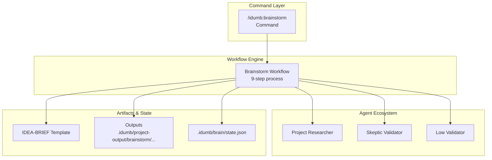
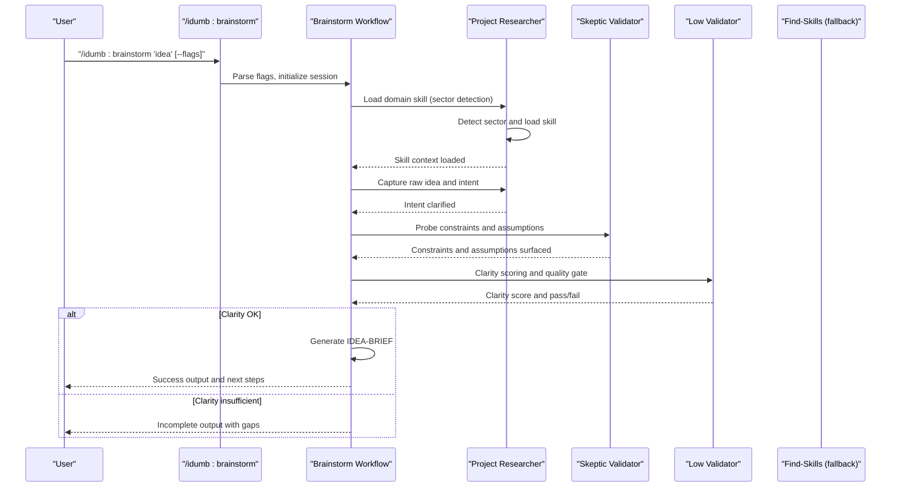
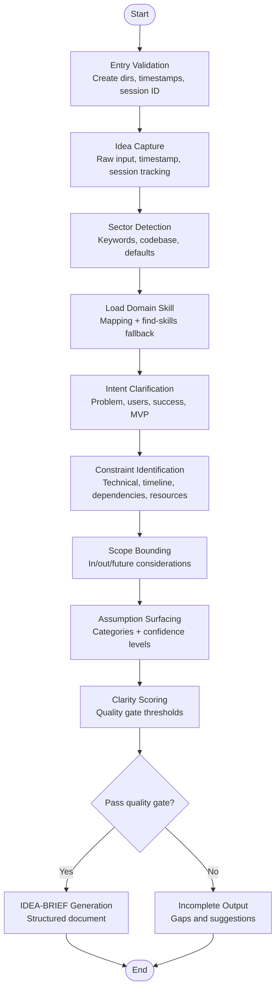
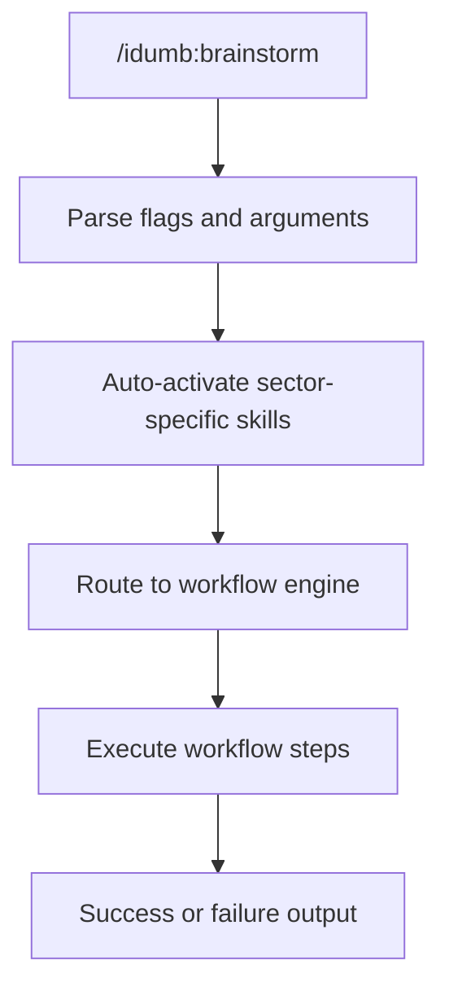
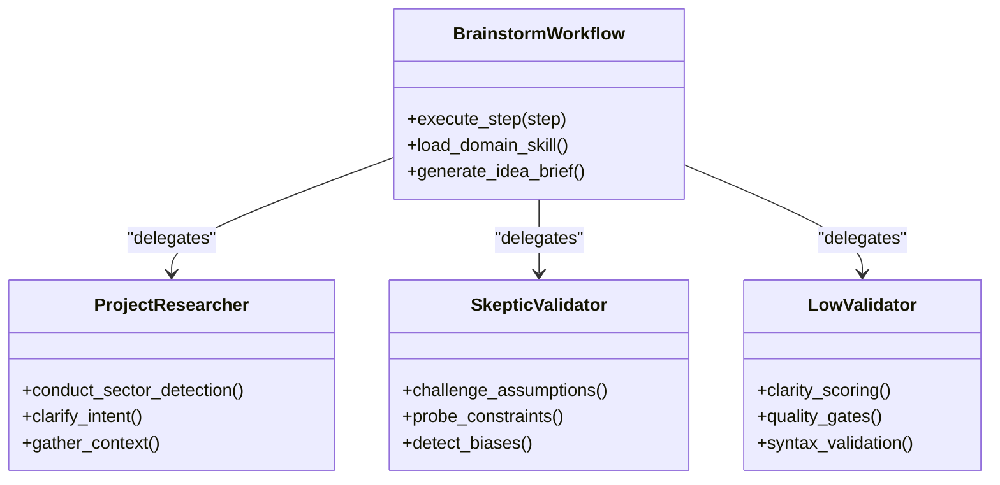
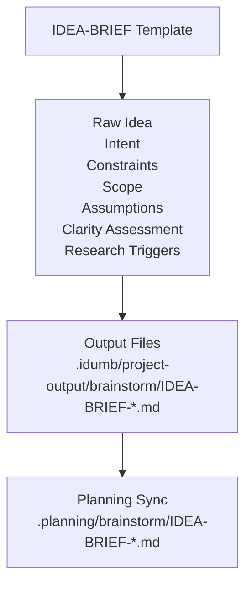
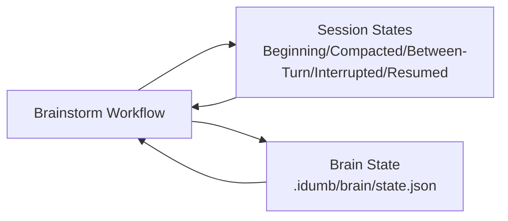
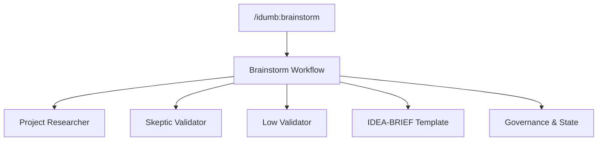

# Brainstorm Workflow

<cite>
**Referenced Files in This Document**
- [brainstorm.md](file://src/workflows/brainstorm.md)
- [brainstorm.md](file://src/commands/idumb/brainstorm.md)
- [IDEA-BRIEF.template.md](file://src/templates/brainstorm/IDEA-BRIEF.template.md)
- [idumb-project-researcher.md](file://src/agents/idumb-project-researcher.md)
- [idumb-skeptic-validator.md](file://src/agents/idumb-skeptic-validator.md)
- [idumb-low-validator.md](file://src/agents/idumb-low-validator.md)
- [SKILL.md](file://.agents/skills/brainstorming/SKILL.md)
- [SESSION-STATES-GOVERNANCE.md](file://src/router/SESSION-STATES-GOVERNANCE.md)
- [brain-state-schema.json](file://src/schemas/brain-state-schema.json)
- [idumb-state.ts](file://src/tools/idumb-state.ts)
</cite>

## Table of Contents
1. [Introduction](#introduction)
2. [Project Structure](#project-structure)
3. [Core Components](#core-components)
4. [Architecture Overview](#architecture-overview)
5. [Detailed Component Analysis](#detailed-component-analysis)
6. [Dependency Analysis](#dependency-analysis)
7. [Performance Considerations](#performance-considerations)
8. [Troubleshooting Guide](#troubleshooting-guide)
9. [Conclusion](#conclusion)

## Introduction
The Brainstorm Workflow is the first phase in the iDumb ideation pipeline. Its purpose is to transform vague ideas into clear, scoped project definitions by capturing raw intent, clarifying problems and success criteria, identifying constraints, bounding scope, surfacing assumptions, and generating an IDEA-BRIEF document. The workflow enforces quality gates to prevent proceeding with insufficient clarity and integrates with downstream research and roadmap workflows.

## Project Structure
The Brainstorm Workflow spans three main areas:
- Workflow definition: orchestrates the nine-step process and governs state transitions
- Command interface: exposes the /idumb:brainstorm command with flags and examples
- Templates and artifacts: IDEA-BRIEF template and output locations

**Diagram sources**
- [brainstorm.md](file://src/workflows/brainstorm.md#L61-L502)
- [brainstorm.md](file://src/commands/idumb/brainstorm.md#L1-L455)
- [IDEA-BRIEF.template.md](file://src/templates/brainstorm/IDEA-BRIEF.template.md#L1-L251)

**Section sources**
- [brainstorm.md](file://src/workflows/brainstorm.md#L1-L648)
- [brainstorm.md](file://src/commands/idumb/brainstorm.md#L1-L455)
- [IDEA-BRIEF.template.md](file://src/templates/brainstorm/IDEA-BRIEF.template.md#L1-L251)

## Core Components
- Workflow orchestration: defines the nine-step process, agent roles, and quality gates
- Command interface: exposes flags, examples, and routing to the workflow
- Agent ecosystem: specialized agents for research, validation, and quality assurance
- Templates and artifacts: IDEA-BRIEF template and output directories
- Governance and state: session state transitions and brain state schema

**Section sources**
- [brainstorm.md](file://src/workflows/brainstorm.md#L61-L502)
- [brainstorm.md](file://src/commands/idumb/brainstorm.md#L16-L32)
- [IDEA-BRIEF.template.md](file://src/templates/brainstorm/IDEA-BRIEF.template.md#L1-L251)
- [SESSION-STATES-GOVERNANCE.md](file://src/router/SESSION-STATES-GOVERNANCE.md#L59-L283)
- [brain-state-schema.json](file://src/schemas/brain-state-schema.json#L1-L112)

## Architecture Overview
The Brainstorm Workflow follows a progressive, stepwise execution model with built-in quality gates. It leverages domain expertise via skill loading, challenges assumptions through skeptical validation, and enforces clarity thresholds before allowing downstream progression.

**Diagram sources**
- [brainstorm.md](file://src/workflows/brainstorm.md#L61-L502)
- [brainstorm.md](file://src/commands/idumb/brainstorm.md#L95-L345)
- [idumb-project-researcher.md](file://src/agents/idumb-project-researcher.md#L1-L790)
- [idumb-skeptic-validator.md](file://src/agents/idumb-skeptic-validator.md#L1-L800)
- [idumb-low-validator.md](file://src/agents/idumb-low-validator.md#L1-L865)

## Detailed Component Analysis

### Workflow Execution Flow
The workflow is structured into nine steps, each with defined goals, agents, and deliverables. It includes entry validation, sector detection, skill loading, intent clarification, constraint identification, scope bounding, assumption surfacing, clarity scoring, and IDEA-BRIEF generation.

**Diagram sources**
- [brainstorm.md](file://src/workflows/brainstorm.md#L61-L502)

**Section sources**
- [brainstorm.md](file://src/workflows/brainstorm.md#L61-L502)

### Command Interface and Usage
The command interface provides flags for sector forcing, depth control, research skipping, and output format selection. It also documents auto-activated skills and the recommended next steps.

**Diagram sources**
- [brainstorm.md](file://src/commands/idumb/brainstorm.md#L60-L93)

**Section sources**
- [brainstorm.md](file://src/commands/idumb/brainstorm.md#L60-L93)

### Agent Roles and Responsibilities
- Project Researcher: Conducts sector detection, gathers context, and clarifies intent
- Skeptic Validator: Challenges assumptions and constraints to surface risks
- Low Validator: Enforces clarity scoring and quality gates

**Diagram sources**
- [idumb-project-researcher.md](file://src/agents/idumb-project-researcher.md#L1-L790)
- [idumb-skeptic-validator.md](file://src/agents/idumb-skeptic-validator.md#L1-L800)
- [idumb-low-validator.md](file://src/agents/idumb-low-validator.md#L1-L865)
- [brainstorm.md](file://src/workflows/brainstorm.md#L61-L502)

**Section sources**
- [idumb-project-researcher.md](file://src/agents/idumb-project-researcher.md#L1-L790)
- [idumb-skeptic-validator.md](file://src/agents/idumb-skeptic-validator.md#L1-L800)
- [idumb-low-validator.md](file://src/agents/idumb-low-validator.md#L1-L865)

### IDEA-BRIEF Template and Output
The IDEA-BRIEF template captures raw ideas, intent statements, constraints, scope definitions, assumptions, clarity assessments, and research triggers. Outputs are generated under project-output and synchronized to planning directories.

**Diagram sources**
- [IDEA-BRIEF.template.md](file://src/templates/brainstorm/IDEA-BRIEF.template.md#L1-L251)

**Section sources**
- [IDEA-BRIEF.template.md](file://src/templates/brainstorm/IDEA-BRIEF.template.md#L1-L251)

### Governance and Session State Integration
The workflow interacts with session state tracking and brain state governance. Session states influence how context is maintained and resumed, while brain state schema ensures consistent governance data structures.

**Diagram sources**
- [SESSION-STATES-GOVERNANCE.md](file://src/router/SESSION-STATES-GOVERNANCE.md#L59-L283)
- [brain-state-schema.json](file://src/schemas/brain-state-schema.json#L1-L112)
- [idumb-state.ts](file://src/tools/idumb-state.ts#L265-L313)

**Section sources**
- [SESSION-STATES-GOVERNANCE.md](file://src/router/SESSION-STATES-GOVERNANCE.md#L59-L283)
- [brain-state-schema.json](file://src/schemas/brain-state-schema.json#L1-L112)
- [idumb-state.ts](file://src/tools/idumb-state.ts#L265-L313)

## Dependency Analysis
The Brainstorm Workflow depends on:
- Command layer for invocation and flag parsing
- Agent ecosystem for specialized tasks
- Templates for standardized output
- Governance and state for session and brain state management

**Diagram sources**
- [brainstorm.md](file://src/commands/idumb/brainstorm.md#L1-L455)
- [brainstorm.md](file://src/workflows/brainstorm.md#L1-L648)
- [IDEA-BRIEF.template.md](file://src/templates/brainstorm/IDEA-BRIEF.template.md#L1-L251)
- [SESSION-STATES-GOVERNANCE.md](file://src/router/SESSION-STATES-GOVERNANCE.md#L1-L288)

**Section sources**
- [brainstorm.md](file://src/commands/idumb/brainstorm.md#L1-L455)
- [brainstorm.md](file://src/workflows/brainstorm.md#L1-L648)
- [IDEA-BRIEF.template.md](file://src/templates/brainstorm/IDEA-BRIEF.template.md#L1-L251)
- [SESSION-STATES-GOVERNANCE.md](file://src/router/SESSION-STATES-GOVERNANCE.md#L1-L288)

## Performance Considerations
- Progressive disclosure: Each step focuses the model on a single concern, reducing cognitive load
- JIT skill loading: Domain skills are loaded only when needed, minimizing startup overhead
- Read-only validations: Low Validator performs checks without side effects, ensuring minimal resource usage
- Output templating: Standardized templates reduce variability and speed up generation

## Troubleshooting Guide
Common issues and resolutions:
- No idea provided: The workflow blocks with an error requiring a valid idea
- Sector detection failed: Use the --sector flag to force sector detection
- Skill not found for sector: The workflow attempts to discover skills via find-skills
- Clarity score too low: The workflow returns an incomplete status with missing areas and iteration suggestions

**Section sources**
- [brainstorm.md](file://src/commands/idumb/brainstorm.md#L431-L441)
- [brainstorm.md](file://src/workflows/brainstorm.md#L381-L391)

## Conclusion
The Brainstorm Workflow establishes a disciplined foundation for project ideation by capturing raw intent, clarifying problems and success criteria, identifying constraints, bounding scope, surfacing assumptions, and enforcing clarity thresholds. Its integration with domain skills, skeptical validation, and governance state ensures robust, reproducible outputs that feed seamlessly into downstream research and roadmap workflows.