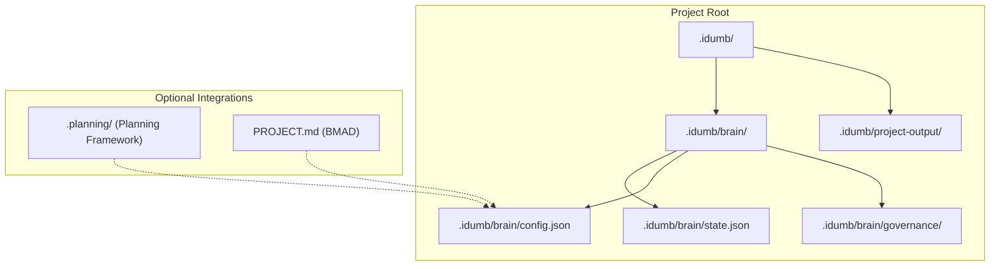
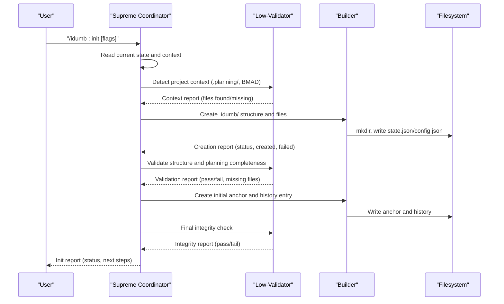
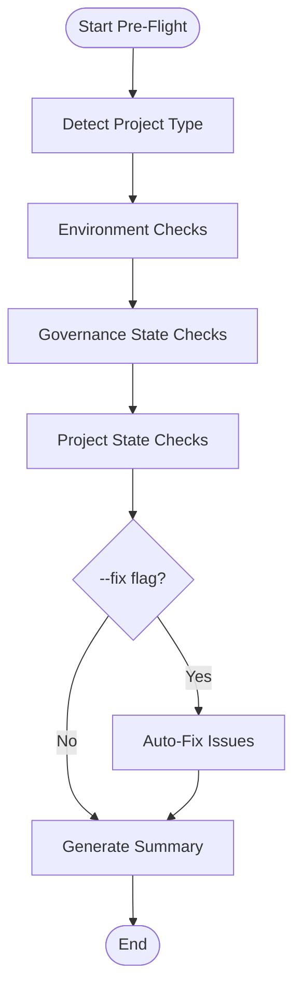
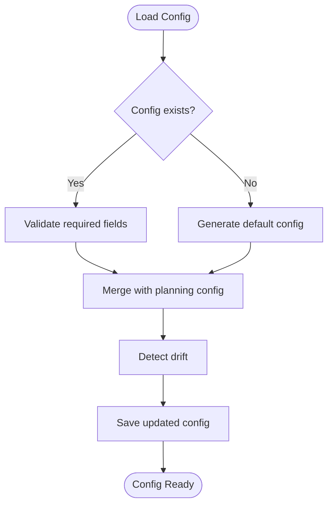
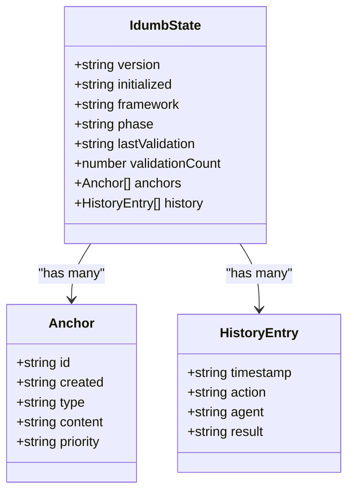
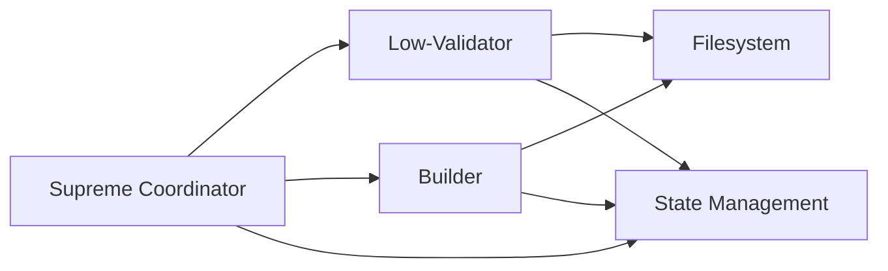
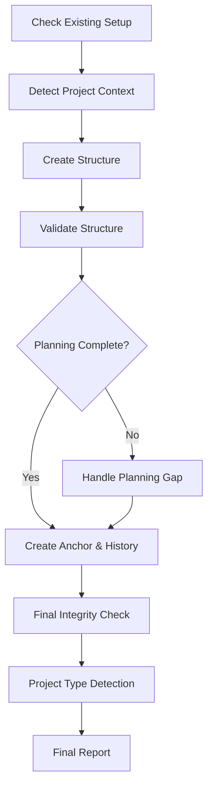
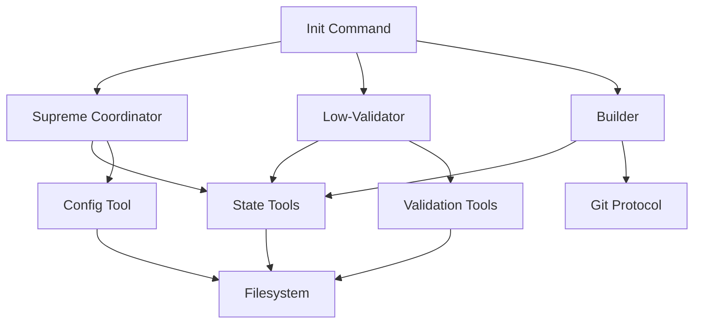

# Init Workflow

<cite>
**Referenced Files in This Document**
- [init.md](file://src/commands/idumb/init.md)
- [pre-flight.md](file://src/commands/idumb/pre-flight.md)
- [idumb-config.ts](file://src/tools/idumb-config.ts)
- [idumb-state.ts](file://src/tools/idumb-state.ts)
- [state.ts](file://src/plugins/lib/state.ts)
- [logging.ts](file://src/plugins/lib/logging.ts)
- [idumb-supreme-coordinator.md](file://src/agents/idumb-supreme-coordinator.md)
- [idumb-low-validator.md](file://src/agents/idumb-low-validator.md)
- [idumb-builder.md](file://src/agents/idumb-builder.md)
- [completion-definitions.yaml](file://src/config/completion-definitions.yaml)
- [chain-rules.ts](file://src/plugins/lib/chain-rules.ts)
- [idumb-validate.ts](file://src/tools/idumb-validate.ts)
</cite>

## Table of Contents
1. [Introduction](#introduction)
2. [Project Structure](#project-structure)
3. [Core Components](#core-components)
4. [Architecture Overview](#architecture-overview)
5. [Detailed Component Analysis](#detailed-component-analysis)
6. [Dependency Analysis](#dependency-analysis)
7. [Performance Considerations](#performance-considerations)
8. [Troubleshooting Guide](#troubleshooting-guide)
9. [Conclusion](#conclusion)

## Introduction
This document explains the Init workflow that establishes the iDumb governance framework for a project. It covers environment preparation, configuration validation, state initialization, prerequisite checking, dependency resolution, system readiness verification, and integration with external systems. The workflow emphasizes governance-aligned delegation, atomic state transitions, and comprehensive integrity checks.

## Project Structure
The Init workflow orchestrates creation of the iDumb governance structure under `.idumb/` and initializes both runtime state and master configuration. It integrates with optional external planning frameworks and BMAD indicators to determine project type and next steps.

**Diagram sources**
- [init.md](file://src/commands/idumb/init.md#L141-L221)
- [idumb-config.ts](file://src/tools/idumb-config.ts#L372-L391)

**Section sources**
- [init.md](file://src/commands/idumb/init.md#L1-L684)

## Core Components
- Init command specification: Defines the end-to-end Init workflow, flags, project type detection, and governance delegation chain.
- Pre-flight validation: Validates environment readiness, governance state, and project health before Init.
- Configuration tool: Generates and validates the master configuration, merges with external planning config, and enforces governance rules.
- State management: Creates and maintains the governance state, anchors, and history with atomic persistence.
- Agent roles: Supreme Coordinator (orchestration), Low-Validator (read-only checks), Builder (atomic file operations).

**Section sources**
- [init.md](file://src/commands/idumb/init.md#L44-L75)
- [pre-flight.md](file://src/commands/idumb/pre-flight.md#L25-L51)
- [idumb-config.ts](file://src/tools/idumb-config.ts#L53-L199)
- [idumb-state.ts](file://src/tools/idumb-state.ts#L14-L49)

## Architecture Overview
The Init workflow follows a governance-aligned delegation model with strict separation of concerns:

**Diagram sources**
- [init.md](file://src/commands/idumb/init.md#L87-L460)
- [idumb-supreme-coordinator.md](file://src/agents/idumb-supreme-coordinator.md#L144-L197)
- [idumb-low-validator.md](file://src/agents/idumb-low-validator.md#L497-L679)
- [idumb-builder.md](file://src/agents/idumb-builder.md#L547-L700)

## Detailed Component Analysis

### Environment Preparation and Pre-Flight Validation
Pre-flight validation ensures the environment is ready before Init:
- Detects project type (greenfield/brownfield/existing planning) using file counts and git state.
- Verifies environment readiness (Node.js, Git, OpenCode presence).
- Checks governance state existence and validity.
- Assesses project state (uncommitted changes, branch status, conflicts).
- Supports auto-fix mode to initialize missing governance state and create required directories.

**Diagram sources**
- [pre-flight.md](file://src/commands/idumb/pre-flight.md#L53-L305)

**Section sources**
- [pre-flight.md](file://src/commands/idumb/pre-flight.md#L53-L305)

### Configuration Validation and Master Config Generation
The configuration tool enforces the single source of truth and governs behavior:
- Loads or auto-generates the master configuration with default values.
- Merges with optional planning configuration and detects drift.
- Enforces reserved keys and protected sections.
- Updates automation settings based on experience level.
- Provides read and update capabilities with validation.

**Diagram sources**
- [idumb-config.ts](file://src/tools/idumb-config.ts#L445-L530)

**Section sources**
- [idumb-config.ts](file://src/tools/idumb-config.ts#L434-L530)

### State Initialization and Persistence
State management ensures atomic, recoverable governance state:
- Creates default state with version, initialization timestamp, framework type, and empty anchors/history.
- Provides read/write operations with atomic write patterns to prevent corruption.
- Maintains history and anchors with retention policies.
- Supports session lifecycle and garbage collection.

**Diagram sources**
- [idumb-state.ts](file://src/tools/idumb-state.ts#L14-L38)
- [state.ts](file://src/plugins/lib/state.ts#L174-L188)

**Section sources**
- [idumb-state.ts](file://src/tools/idumb-state.ts#L55-L79)
- [state.ts](file://src/plugins/lib/state.ts#L30-L73)

### Governance Delegation Chain and Agent Roles
The Init workflow strictly follows the governance hierarchy:
- Supreme Coordinator orchestrates, never executes directly.
- Low-Validator performs read-only validation checks.
- Builder executes atomic file operations with evidence trails.

**Diagram sources**
- [idumb-supreme-coordinator.md](file://src/agents/idumb-supreme-coordinator.md#L144-L197)
- [idumb-low-validator.md](file://src/agents/idumb-low-validator.md#L128-L176)
- [idumb-builder.md](file://src/agents/idumb-builder.md#L147-L190)

**Section sources**
- [idumb-supreme-coordinator.md](file://src/agents/idumb-supreme-coordinator.md#L144-L197)
- [idumb-low-validator.md](file://src/agents/idumb-low-validator.md#L128-L176)
- [idumb-builder.md](file://src/agents/idumb-builder.md#L147-L190)

### Init Workflow Execution Steps
The Init command defines a structured, governance-aligned process:

1. **Existing Setup Check**: Detects prior initialization and handles force reinitialization with archival.
2. **Project Context Detection**: Scans for .planning/ and BMAD indicators to determine integration scope.
3. **Structure Creation**: Creates .idumb/ directory structure and initializes state.json/config.json.
4. **Structure Validation**: Verifies created files and required planning integration completeness.
5. **Planning Gap Handling**: Guides user to complete planning or proceeds without integration.
6. **Initial Anchor and History**: Records governance checkpoint and history entry.
7. **Final Integrity Check**: Validates state, config, and required artifacts.
8. **Project Type Detection**: Counts source files to classify greenfield/brownfield/existing planning.
9. **Guidance and Next Steps**: Provides tailored recommendations based on project type.
10. **Final Report**: Summarizes status, created structure, framework integration, and next steps.

**Diagram sources**
- [init.md](file://src/commands/idumb/init.md#L87-L460)

**Section sources**
- [init.md](file://src/commands/idumb/init.md#L87-L460)

### Parameter Validation and Error Handling
Init supports flags for customization and robust error handling:
- Flags: --greenfield, --brownfield, --no-planning, --force, --user, --language.
- Error codes and resolutions for common issues (already initialized, directory creation, invalid JSON, planning incomplete, integrity check failures, state write failures).
- Retry logic with escalation to user after max retries.

**Section sources**
- [init.md](file://src/commands/idumb/init.md#L44-L75)
- [init.md](file://src/commands/idumb/init.md#L606-L617)

### Integration with External Systems
Init integrates with external systems to enrich governance:
- Planning framework (.planning/): Detects and synchronizes with existing planning state.
- BMAD indicators (PROJECT.md, _bmad-output/): Detects BMAD presence for framework alignment.
- Git: Commits governance changes with conventional messages and tracks state changes.

**Section sources**
- [init.md](file://src/commands/idumb/init.md#L111-L139)
- [idumb-config.ts](file://src/tools/idumb-config.ts#L567-L603)
- [idumb-builder.md](file://src/agents/idumb-builder.md#L333-L441)

## Dependency Analysis
Init workflow relies on several subsystems and their interdependencies:

**Diagram sources**
- [init.md](file://src/commands/idumb/init.md#L87-L460)
- [idumb-supreme-coordinator.md](file://src/agents/idumb-supreme-coordinator.md#L144-L197)
- [idumb-low-validator.md](file://src/agents/idumb-low-validator.md#L497-L679)
- [idumb-builder.md](file://src/agents/idumb-builder.md#L547-L700)
- [idumb-config.ts](file://src/tools/idumb-config.ts#L648-L770)

**Section sources**
- [completion-definitions.yaml](file://src/config/completion-definitions.yaml#L35-L61)
- [chain-rules.ts](file://src/plugins/lib/chain-rules.ts#L232-L267)
- [idumb-validate.ts](file://src/tools/idumb-validate.ts#L958-L1000)

## Performance Considerations
- Atomic state writes: Uses temporary file and rename to prevent corruption and ensure fast, reliable persistence.
- Minimal footprint: Low-Validator operates read-only with no side effects, reducing overhead.
- Garbage collection: Automatic trimming of history and anchors to manage storage growth.
- Logging rotation: Prevents unbounded log growth with rotation and archiving.
- Validation batching: Pre-flight and validation tools run targeted checks to minimize startup time.

**Section sources**
- [state.ts](file://src/plugins/lib/state.ts#L47-L73)
- [logging.ts](file://src/plugins/lib/logging.ts#L36-L79)
- [idumb-state.ts](file://src/tools/idumb-state.ts#L547-L595)

## Troubleshooting Guide
Common initialization failures and solutions:
- Already initialized: Use --force to reinitialize and archive existing state.
- Cannot create directories: Check file permissions and available disk space.
- Invalid JSON created: Review syntax errors and retry initialization.
- Planning incomplete: Complete planning setup first or proceed without planning integration.
- Integrity check failed: Review failed checks, fix issues, and retry.
- State write failed: Verify disk space and permissions; ensure .idumb/brain directory is writable.

Escalation procedures:
- Max retries: After three consecutive failures, escalate to user for manual intervention.
- Audit trail: Use state history and validation reports to diagnose issues.
- Logging: Inspect plugin logs for rotation and error details.

**Section sources**
- [init.md](file://src/commands/idumb/init.md#L606-L617)
- [logging.ts](file://src/plugins/lib/logging.ts#L85-L117)

## Conclusion
The Init workflow establishes a robust, governance-aligned foundation for iDumb projects. By enforcing delegation, atomic state transitions, and comprehensive validation, it ensures system readiness, integration with external frameworks, and sustainable state management. The structured approach, clear error handling, and performance-conscious design provide a reliable entry point for all iDumb-governed projects.