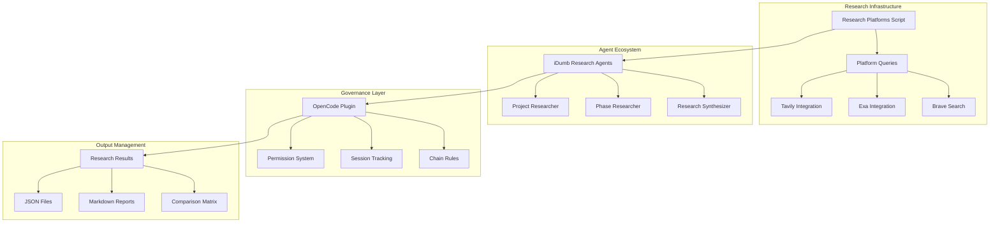
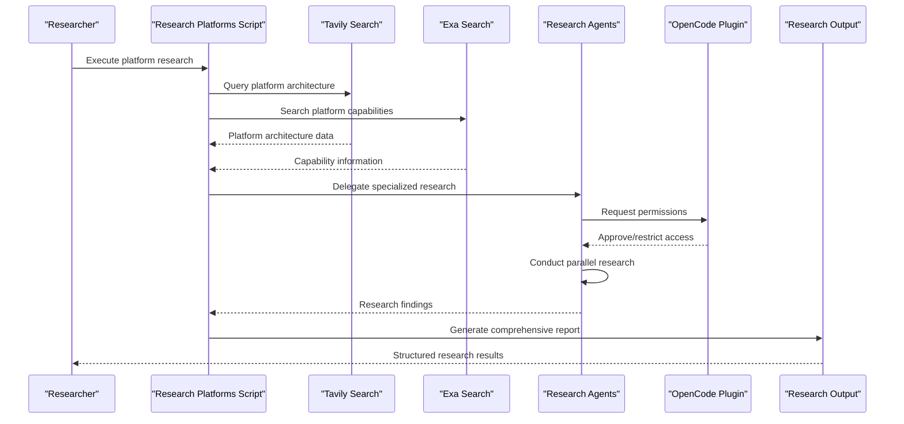
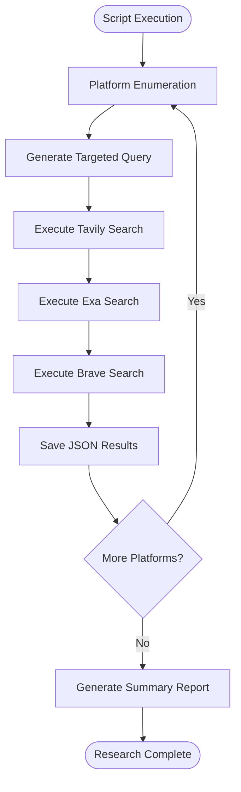
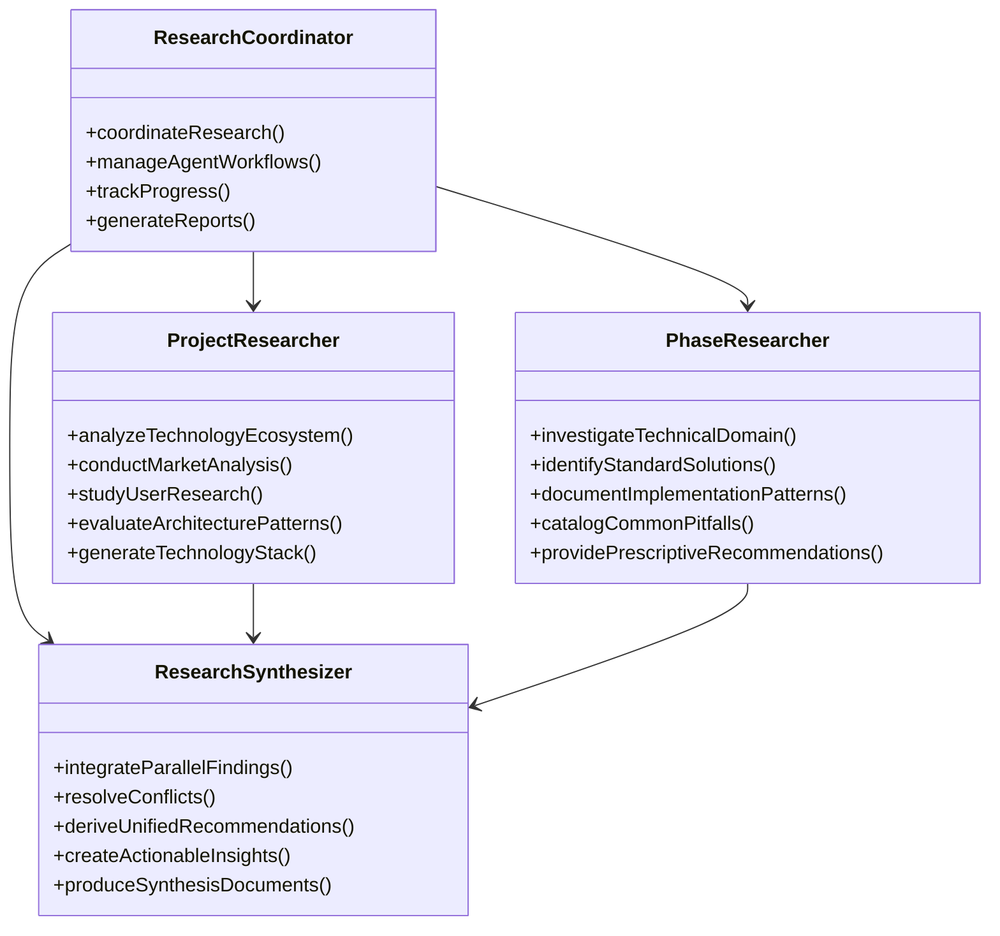
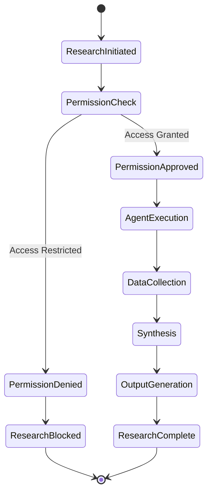
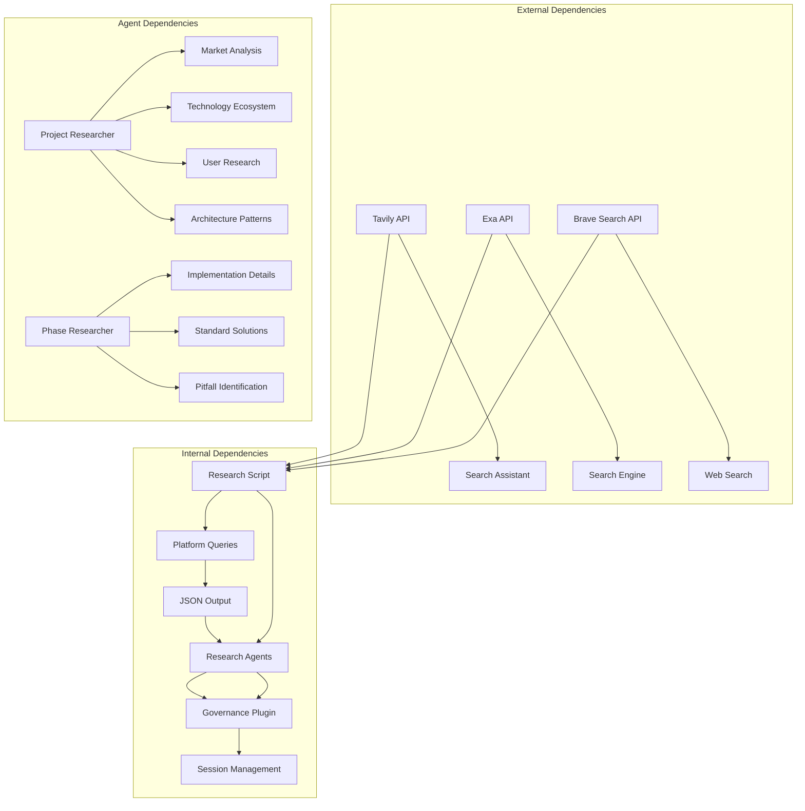

# Research Platforms Script

<cite>
**Referenced Files in This Document**
- [research-platforms.sh](file://scripts/research-platforms.sh)
- [README.md](file://README.md)
- [research.md](file://src/commands/idumb/research.md)
- [research.md](file://src/workflows/research.md)
- [idumb-project-researcher.md](file://src/agents/idumb-project-researcher.md)
- [idumb-phase-researcher.md](file://src/agents/idumb-phase-researcher.md)
- [idumb-research-synthesizer.md](file://src/agents/idumb-research-synthesizer.md)
- [idumb-smart-tasks.ts](file://src/tools/idumb-smart-tasks.ts)
- [idumb-core.ts](file://src/plugins/idumb-core.ts)
- [SKILL.md](file://.agents/skills/web-search/SKILL.md)
- [MCP-SERVER-INTEGRATION-RESEARCH-2026-02-04.md](file://.plugin-dev/research/MCP-SERVER-INTEGRATION-RESEARCH-2026-02-04.md)
- [MCP-INTEGRATION-SUMMARY-2026-02-04.md](file://.plugin-dev/research/MCP-INTEGRATION-SUMMARY-2026-02-04.md)
</cite>

## Table of Contents
1. [Introduction](#introduction)
2. [Project Structure](#project-structure)
3. [Core Components](#core-components)
4. [Architecture Overview](#architecture-overview)
5. [Detailed Component Analysis](#detailed-component-analysis)
6. [Dependency Analysis](#dependency-analysis)
7. [Performance Considerations](#performance-considerations)
8. [Troubleshooting Guide](#troubleshooting-guide)
9. [Conclusion](#conclusion)

## Introduction

The Research Platforms Script is a strategic framework designed to analyze and compare leading AI agent development platforms: OpenCode, Claude Code, Cursor, and Windsurf. This comprehensive research system integrates multiple research methodologies, agent-based workflows, and intelligent platform comparison to provide actionable insights for AI agent development and deployment.

The script serves as both a standalone research tool and an integral part of the broader iDumb hierarchical governance framework, which emphasizes safe, controlled, and systematic code development through agent delegation and permission management. By systematically evaluating these platforms, teams can make informed decisions about which development environments best suit their AI agent projects.

## Project Structure

The research platform ecosystem is built around several interconnected components that work together to provide comprehensive platform analysis:

**Diagram sources**
- [research-platforms.sh](file://scripts/research-platforms.sh#L1-L71)
- [idumb-core.ts](file://src/plugins/idumb-core.ts#L145-L1215)

The system is organized into distinct layers that handle different aspects of the research process, from platform querying to agent-based analysis and governance enforcement.

**Section sources**
- [research-platforms.sh](file://scripts/research-platforms.sh#L1-L71)
- [README.md](file://README.md#L1-L93)

## Core Components

### Research Platforms Script

The central research component that orchestrates platform analysis across multiple AI development environments. This bash script provides a systematic approach to gathering information about competing platforms while maintaining reproducible research processes.

**Key Features:**
- **Multi-platform Coverage**: Targets OpenCode, Claude Code, Cursor, and Windsurf platforms
- **Structured Query System**: Uses specific search queries optimized for platform architecture discovery
- **Automated Output Management**: Creates organized JSON output files for each platform
- **Research Workflow Integration**: Provides standardized research outputs compatible with iDumb workflows

**Section sources**
- [research-platforms.sh](file://scripts/research-platforms.sh#L1-L71)

### iDumb Research Agent System

The iDumb framework provides three specialized research agents that work in parallel to analyze different aspects of AI development platforms:

#### Project Researcher Agent
Focuses on comprehensive domain research covering technology ecosystems, market landscapes, user needs, and competitive positioning. This agent conducts broad surveys of platform capabilities and ecosystem maturity.

#### Phase Researcher Agent  
Targets specific implementation details and phase-specific research needs. This agent focuses on practical implementation patterns, technical feasibility, and integration considerations for specific development phases.

#### Research Synthesizer Agent
Integrates findings from multiple researchers to create unified, actionable insights. This agent resolves conflicts between different research perspectives and produces comprehensive synthesis reports.

**Section sources**
- [idumb-project-researcher.md](file://src/agents/idumb-project-researcher.md#L1-L790)
- [idumb-phase-researcher.md](file://src/agents/idumb-phase-researcher.md#L1-L796)
- [idumb-research-synthesizer.md](file://src/agents/idumb-research-synthesizer.md#L1-L735)

### OpenCode Plugin Integration

The research system leverages the OpenCode plugin architecture for seamless integration with the broader iDumb governance framework. This integration provides:

- **Permission Enforcement**: Ensures research activities comply with organizational governance rules
- **Session Management**: Maintains context and continuity across research sessions
- **Tool Interception**: Monitors and logs research tool usage for audit trails
- **Chain Rule Compliance**: Enforces proper research workflow sequences

**Section sources**
- [idumb-core.ts](file://src/plugins/idumb-core.ts#L145-L1215)

## Architecture Overview

The research platform system follows a sophisticated multi-layered architecture that combines automated platform querying with intelligent agent-based analysis:

**Diagram sources**
- [research-platforms.sh](file://scripts/research-platforms.sh#L16-L30)
- [idumb-core.ts](file://src/plugins/idumb-core.ts#L739-L829)

The architecture ensures that research activities are both comprehensive and governed by established protocols, maintaining consistency and reliability across different research scenarios.

## Detailed Component Analysis

### Platform Query System

The research script implements a systematic approach to platform discovery through targeted queries designed to extract specific architectural and capability information:

**Diagram sources**
- [research-platforms.sh](file://scripts/research-platforms.sh#L16-L30)

Each platform receives a customized query designed to elicit specific information about architecture, agent capabilities, plugin systems, and documentation structure.

### Agent-Based Research Coordination

The iDumb research system coordinates multiple specialized agents to provide comprehensive platform analysis:

**Diagram sources**
- [idumb-project-researcher.md](file://src/agents/idumb-project-researcher.md#L1-L790)
- [idumb-phase-researcher.md](file://src/agents/idumb-phase-researcher.md#L1-L796)
- [idumb-research-synthesizer.md](file://src/agents/idumb-research-synthesizer.md#L1-L735)

### Governance Integration

The research system maintains strict governance compliance through the OpenCode plugin integration:

**Diagram sources**
- [idumb-core.ts](file://src/plugins/idumb-core.ts#L739-L829)

The governance layer ensures that all research activities comply with organizational policies while maintaining operational flexibility for research workflows.

**Section sources**
- [research.md](file://src/commands/idumb/research.md#L1-L99)
- [research.md](file://src/workflows/research.md#L1-L746)

## Dependency Analysis

The research platform system exhibits a well-structured dependency hierarchy that enables modular functionality and maintainable architecture:

**Diagram sources**
- [MCP-SERVER-INTEGRATION-RESEARCH-2026-02-04.md](file://.plugin-dev/research/MCP-SERVER-INTEGRATION-RESEARCH-2026-02-04.md#L376-L579)
- [SKILL.md](file://.agents/skills/web-search/SKILL.md#L1-L151)

The dependency structure ensures that the system can adapt to changing external API availability while maintaining internal consistency and reliability.

**Section sources**
- [MCP-INTEGRATION-SUMMARY-2026-02-04.md](file://.plugin-dev/research/MCP-INTEGRATION-SUMMARY-2026-02-04.md#L64-L115)

## Performance Considerations

The research platform system is designed with several performance optimization strategies:

### Parallel Processing Architecture
The system leverages parallel execution capabilities to maximize research throughput while maintaining quality standards. Each platform research can be executed concurrently, reducing overall research time.

### Intelligent Query Optimization
Queries are specifically crafted to minimize unnecessary API calls and optimize for relevant information retrieval. This approach reduces costs and improves response times.

### Caching and State Management
The system maintains research state across sessions, enabling incremental improvements and reducing redundant processing of similar queries.

### Resource Management
Built-in rate limiting and resource allocation ensure sustainable operation without overwhelming external APIs or consuming excessive computational resources.

## Troubleshooting Guide

### Common Issues and Solutions

**API Key Configuration**
- **Problem**: External API integrations failing due to missing credentials
- **Solution**: Configure API keys in the secrets directory and ensure proper file permissions
- **Prevention**: Regular validation of API connectivity before research execution

**Permission Denial**
- **Problem**: Research agents unable to access required tools or resources
- **Solution**: Review governance configuration and adjust agent permissions as needed
- **Prevention**: Regular audit of permission settings and chain rule compliance

**Output Generation Failures**
- **Problem**: Research results not properly formatted or saved
- **Solution**: Verify output directory permissions and disk space availability
- **Prevention**: Automated validation of output generation before completion

**Session State Corruption**
- **Problem**: Research session interruptions or corrupted state
- **Solution**: Implement session recovery mechanisms and state validation
- **Prevention**: Regular checkpoint creation and state monitoring

**Section sources**
- [idumb-core.ts](file://src/plugins/idumb-core.ts#L335-L351)

## Conclusion

The Research Platforms Script represents a comprehensive solution for analyzing and comparing AI agent development platforms. By combining systematic platform querying with intelligent agent-based analysis and robust governance integration, the system provides actionable insights for informed decision-making.

The modular architecture ensures scalability and maintainability while the parallel processing capabilities enable efficient research execution. The integration with the iDumb governance framework provides essential controls and oversight for research activities.

Key strengths of the system include:
- **Comprehensive Platform Coverage**: Systematic analysis of major AI agent development platforms
- **Governance Integration**: Built-in compliance and oversight mechanisms
- **Parallel Processing**: Efficient utilization of multiple research streams
- **Flexible Output Formats**: Multiple output formats for different use cases
- **Robust Error Handling**: Comprehensive error detection and recovery mechanisms

The research system provides a solid foundation for organizations evaluating AI agent development platforms and can be extended to accommodate new platforms and evolving research requirements.