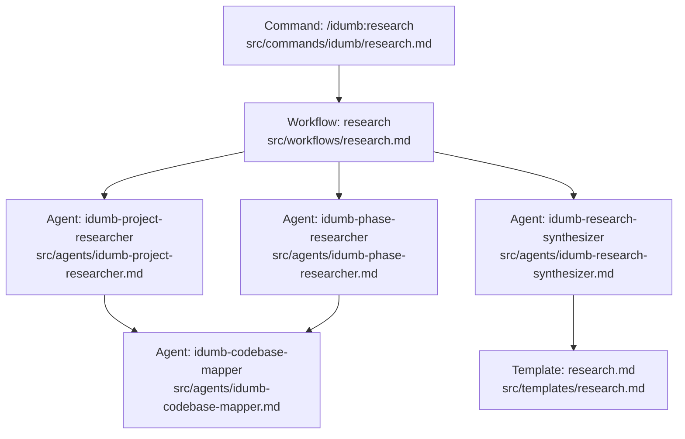
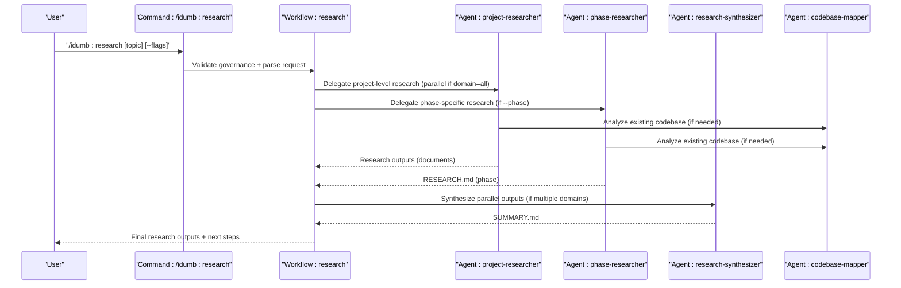
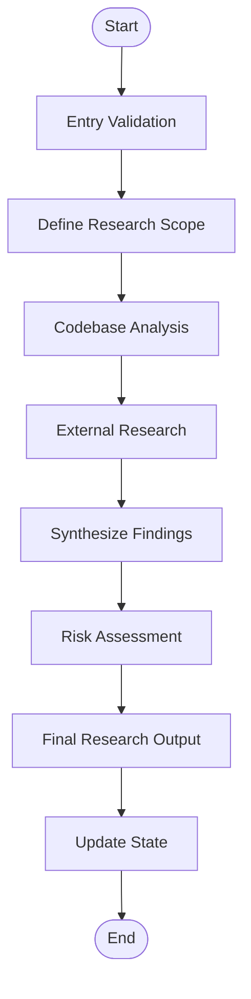
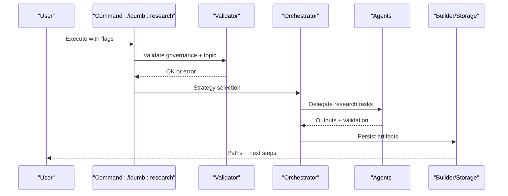
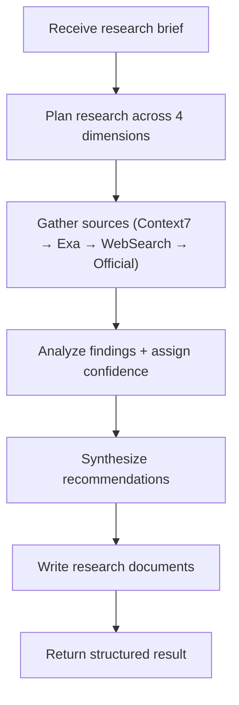
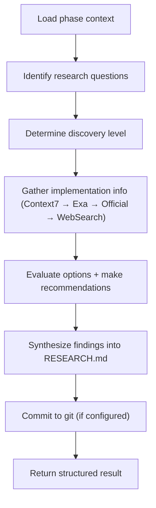
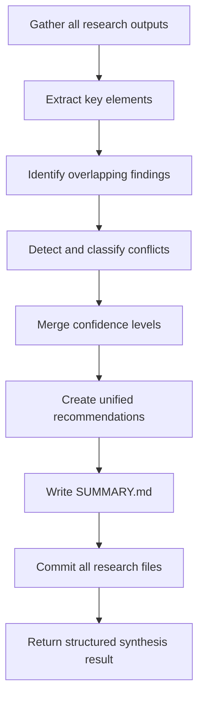
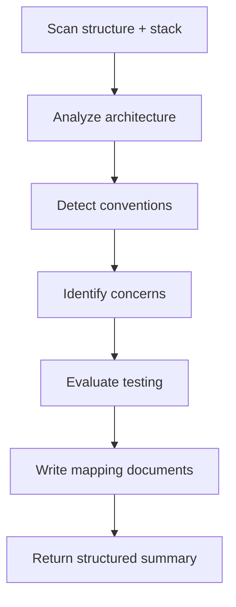
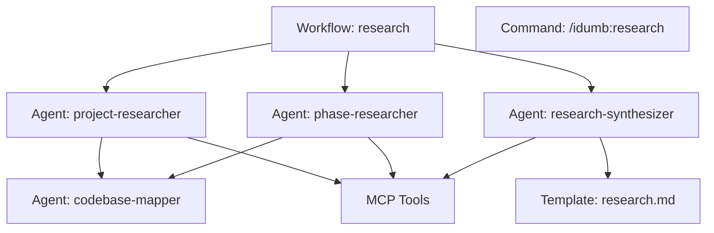

# Research Workflow

<cite>
**Referenced Files in This Document**
- [research.md](file://src/workflows/research.md)
- [research.md](file://src/commands/idumb/research.md)
- [idumb-project-researcher.md](file://src/agents/idumb-project-researcher.md)
- [idumb-phase-researcher.md](file://src/agents/idumb-phase-researcher.md)
- [idumb-research-synthesizer.md](file://src/agents/idumb-research-synthesizer.md)
- [idumb-codebase-mapper.md](file://src/agents/idumb-codebase-mapper.md)
- [research.md](file://src/templates/research.md)
- [OPENCODE-PLUGIN-ARCHITECTURE-RESEARCH-2026-02-04.md](file://docs/research/OPENCODE-PLUGIN-ARCHITECTURE-RESEARCH-2026-02-04.md)
- [loop-termination-triggers-detection-2026-02-04.md](file://docs/research/loop-termination-triggers-detection-2026-02-04.md)
- [MCP-SERVER-INTEGRATION-RESEARCH-2026-02-04.md](file://.plugin-dev/research/MCP-SERVER-INTEGRATION-RESEARCH-2026-02-04.md)
- [idumb-smart-tasks.ts](file://src/tools/idumb-smart-tasks.ts)
- [idumb-performance.ts](file://src/tools/idumb-performance.ts)
</cite>

## Table of Contents
1. [Introduction](#introduction)
2. [Project Structure](#project-structure)
3. [Core Components](#core-components)
4. [Architecture Overview](#architecture-overview)
5. [Detailed Component Analysis](#detailed-component-analysis)
6. [Dependency Analysis](#dependency-analysis)
7. [Performance Considerations](#performance-considerations)
8. [Troubleshooting Guide](#troubleshooting-guide)
9. [Conclusion](#conclusion)
10. [Appendices](#appendices)

## Introduction
This document explains the Research Workflow used to gather domain knowledge, validate approaches, and produce actionable intelligence before planning. It covers methodology, data collection, analysis, synthesis, and output formatting. It also details integration with external research tools, codebase mapping, contextual analysis, and knowledge discovery patterns. Practical examples demonstrate execution, configuration, and result interpretation, along with optimization, quality assurance, and the relationship between research outcomes and downstream workflow phases.

## Project Structure
The Research Workflow spans three layers:
- Workflow orchestration defines the end-to-end process and governance rules
- Agent subsystems execute specialized research modes (project-level, phase-level, synthesis)
- Templates and tools standardize output formats and enforce quality gates

**Diagram sources**
- [research.md](file://src/workflows/research.md#L1-L746)
- [research.md](file://src/commands/idumb/research.md#L1-L469)
- [idumb-project-researcher.md](file://src/agents/idumb-project-researcher.md#L1-L790)
- [idumb-phase-researcher.md](file://src/agents/idumb-phase-researcher.md#L1-L796)
- [idumb-research-synthesizer.md](file://src/agents/idumb-research-synthesizer.md#L1-L735)
- [idumb-codebase-mapper.md](file://src/agents/idumb-codebase-mapper.md#L1-L495)
- [research.md](file://src/templates/research.md#L1-L297)

**Section sources**
- [research.md](file://src/workflows/research.md#L1-L746)
- [research.md](file://src/commands/idumb/research.md#L1-L469)

## Core Components
- Research Workflow (orchestration): Defines philosophy, entry checks, execution flow, synthesis, risk assessment, output formatting, and governance chaining
- Research Command (/idumb:research): Parses parameters, validates governance state, selects research strategy, delegates to agents, collects outputs, and stores artifacts
- Research Agents:
  - Project Researcher: Surveys technology, market, user, and architecture ecosystems; produces domain-focused documents
  - Phase Researcher: Focused research for specific phases; produces RESEARCH.md aligned with planning
  - Research Synthesizer: Integrates parallel outputs into unified, actionable synthesis
  - Codebase Mapper: Produces structural, stack, architecture, convention, concern, and testing documents for existing codebases
- Templates and Standards: Enforce consistent output structure and quality gates

**Section sources**
- [research.md](file://src/workflows/research.md#L12-L746)
- [research.md](file://src/commands/idumb/research.md#L12-L469)
- [idumb-project-researcher.md](file://src/agents/idumb-project-researcher.md#L1-L790)
- [idumb-phase-researcher.md](file://src/agents/idumb-phase-researcher.md#L1-L796)
- [idumb-research-synthesizer.md](file://src/agents/idumb-research-synthesizer.md#L1-L735)
- [idumb-codebase-mapper.md](file://src/agents/idumb-codebase-mapper.md#L1-L495)
- [research.md](file://src/templates/research.md#L1-L297)

## Architecture Overview
The Research Workflow integrates internal and external sources, applies a strict verification protocol, and produces standardized outputs for downstream planning and execution.

**Diagram sources**
- [research.md](file://src/commands/idumb/research.md#L134-L305)
- [research.md](file://src/workflows/research.md#L423-L553)
- [idumb-project-researcher.md](file://src/agents/idumb-project-researcher.md#L423-L567)
- [idumb-phase-researcher.md](file://src/agents/idumb-phase-researcher.md#L429-L542)
- [idumb-research-synthesizer.md](file://src/agents/idumb-research-synthesizer.md#L422-L553)
- [idumb-codebase-mapper.md](file://src/agents/idumb-codebase-mapper.md#L280-L376)

## Detailed Component Analysis

### Research Workflow Orchestration
- Philosophy and principles emphasize skeptical verification, multiple-source validation, time-boxed discovery, and actionable outputs
- Entry checks validate governance state, topic specificity, and tool availability
- Execution flow includes scope definition, codebase analysis, external research, synthesis, risk assessment, final documentation, and state updates
- Source hierarchy prioritizes Context7 and official documentation, with verification protocols for WebSearch and blog posts
- Output artifact format enforces required sections and quality criteria

**Diagram sources**
- [research.md](file://src/workflows/research.md#L27-L525)

**Section sources**
- [research.md](file://src/workflows/research.md#L12-L746)

### Research Command (/idumb:research)
- Validates governance state and topic specificity
- Parses flags for domain, phase, ecosystem inclusion, depth, sources, and output format
- Determines research strategy: project-wide parallel domains, single domain, or phase-specific
- Delegates to specialized agents, collects and validates outputs, synthesizes when needed, stores artifacts, and reports results

**Diagram sources**
- [research.md](file://src/commands/idumb/research.md#L134-L305)

**Section sources**
- [research.md](file://src/commands/idumb/research.md#L12-L469)

### Project Researcher
- Conducts comprehensive domain research across technology, market, user, and architecture dimensions
- Uses MCP tools in priority order: Context7, Exa, Brave, Tavily, WebFetch
- Emphasizes broad-first, then deep research; multiple-source verification; honest reporting of gaps and uncertainties
- Produces structured documents (PROJECT-RESEARCH.md, STACK.md, FEATURES.md, ARCHITECTURE.md, PITFALLS.md, MARKET.md)

**Diagram sources**
- [idumb-project-researcher.md](file://src/agents/idumb-project-researcher.md#L423-L567)

**Section sources**
- [idumb-project-researcher.md](file://src/agents/idumb-project-researcher.md#L1-L790)

### Phase Researcher
- Focused research for specific phases; prescriptive output (RESEARCH.md) for planning
- Applies discovery level protocol (skip, quick verification, standard research, deep dive)
- Uses Context7, Exa, WebFetch, and WebSearch with verification protocol
- Emphasizes “don’t hand-roll” existing solutions and documents pitfalls

**Diagram sources**
- [idumb-phase-researcher.md](file://src/agents/idumb-phase-researcher.md#L429-L542)

**Section sources**
- [idumb-phase-researcher.md](file://src/agents/idumb-phase-researcher.md#L1-L796)

### Research Synthesizer
- Integrates parallel research outputs into unified, actionable synthesis
- Extracts key findings, resolves conflicts (apparent, priority, true), merges confidence levels, and creates SUMMARY.md
- Provides roadmap implications, research flags, and confidence assessments

**Diagram sources**
- [idumb-research-synthesizer.md](file://src/agents/idumb-research-synthesizer.md#L422-L553)

**Section sources**
- [idumb-research-synthesizer.md](file://src/agents/idumb-research-synthesizer.md#L1-L735)

### Codebase Mapper
- Produces six structured documents for existing codebases: STRUCTURE.md, STACK.md, ARCHITECTURE.md, CONVENTIONS.md, CONCERNS.md, TESTING.md
- Emphasizes evidence-based analysis, file paths, and patterns over recommendations
- Integrates with planning and execution workflows

**Diagram sources**
- [idumb-codebase-mapper.md](file://src/agents/idumb-codebase-mapper.md#L280-L376)

**Section sources**
- [idumb-codebase-mapper.md](file://src/agents/idumb-codebase-mapper.md#L1-L495)

### Research Output Formatting and Templates
- Templates enforce consistent structure and quality gates for research outputs
- Research Command and Synthesizer both leverage templates to ensure required sections and quality criteria

**Section sources**
- [research.md](file://src/templates/research.md#L1-L297)
- [research.md](file://src/commands/idumb/research.md#L307-L407)
- [idumb-research-synthesizer.md](file://src/agents/idumb-research-synthesizer.md#L313-L421)

### Practical Examples and Parameter Configuration
- Example invocations:
  - Quick technical research: /idumb:research "authentication libraries" --domain=tech --depth=quick
  - Deep market research: /idumb:research "SaaS pricing models" --domain=market --depth=deep
  - Phase-specific research: /idumb:research "API design patterns" --phase=02-01
  - Ecosystem research: /idumb:research "React state management" --ecosystem
  - Full research (all domains): /idumb:research "user onboarding best practices"
- Flags:
  - --domain: tech | market | user | competitor | all
  - --phase: Phase ID like 01, 02-01
  - --ecosystem: Boolean
  - --depth: quick | standard | deep
  - --sources: 1–20
  - --output: markdown | json

**Section sources**
- [research.md](file://src/commands/idumb/research.md#L82-L132)

### Integration with External Research Tools and Databases
- MCP tools used by agents:
  - Context7: resolve-library-id, query-docs
  - Exa: web-search, get-code-context, company-research
  - Brave: web-search
  - Tavily: search, extract, crawl, research
  - WebFetch: official docs extraction
- Research Command auto-activates skills for research writing and codebase chunking to manage large contexts

**Section sources**
- [idumb-project-researcher.md](file://src/agents/idumb-project-researcher.md#L321-L421)
- [idumb-phase-researcher.md](file://src/agents/idumb-phase-researcher.md#L238-L324)
- [MCP-SERVER-INTEGRATION-RESEARCH-2026-02-04.md](file://.plugin-dev/research/MCP-SERVER-INTEGRATION-RESEARCH-2026-02-04.md#L533-L1772)
- [research.md](file://src/commands/idumb/research.md#L36-L61)

### Knowledge Discovery Patterns and Contextual Analysis
- Cross-domain synthesis identifies overlapping findings, resolves conflicts, and derives roadmap implications
- Codebase mapping provides structural, architectural, and convention context for planning and execution
- Real-world research reports demonstrate integration patterns and best practices

**Section sources**
- [idumb-research-synthesizer.md](file://src/agents/idumb-research-synthesizer.md#L127-L255)
- [idumb-codebase-mapper.md](file://src/agents/idumb-codebase-mapper.md#L134-L240)
- [OPENCODE-PLUGIN-ARCHITECTURE-RESEARCH-2026-02-04.md](file://docs/research/OPENCODE-PLUGIN-ARCHITECTURE-RESEARCH-2026-02-04.md#L1-L800)
- [loop-termination-triggers-detection-2026-02-04.md](file://docs/research/loop-termination-triggers-detection-2026-02-04.md#L1-L800)

## Dependency Analysis
The Research Workflow exhibits tight coupling among agents and tools, with clear separation of concerns:
- Workflow orchestrates strategy and governance
- Agents specialize in research modes and verification
- Templates and tools enforce quality and consistency
- External tools provide authoritative and current information

**Diagram sources**
- [research.md](file://src/workflows/research.md#L527-L534)
- [research.md](file://src/commands/idumb/research.md#L134-L305)
- [idumb-project-researcher.md](file://src/agents/idumb-project-researcher.md#L1-L790)
- [idumb-phase-researcher.md](file://src/agents/idumb-phase-researcher.md#L1-L796)
- [idumb-research-synthesizer.md](file://src/agents/idumb-research-synthesizer.md#L1-L735)
- [idumb-codebase-mapper.md](file://src/agents/idumb-codebase-mapper.md#L1-L495)
- [research.md](file://src/templates/research.md#L1-L297)

**Section sources**
- [research.md](file://src/workflows/research.md#L721-L741)
- [research.md](file://src/commands/idumb/research.md#L421-L455)

## Performance Considerations
- Time-boxed discovery prevents scope creep; partial research can be saved and resumed
- Parallel agent execution reduces total research time for multi-domain topics
- Codebase chunking and smart task generation optimize handling of large codebases
- Performance validation tools detect scanning inefficiencies, resource usage, and iteration limits

**Section sources**
- [research.md](file://src/workflows/research.md#L639-L679)
- [idumb-smart-tasks.ts](file://src/tools/idumb-smart-tasks.ts#L204-L241)
- [idumb-performance.ts](file://src/tools/idumb-performance.ts#L173-L350)

## Troubleshooting Guide
Common issues and resolutions:
- Topic too vague: Provide specific research question with context
- Research timeout: Increase timeout or reduce depth to quick
- Insufficient sources: Broaden search terms or enable ecosystem flag
- Governance not initialized: Run /idumb:init first
- Phase not found: Verify phase ID exists in .planning/phases/

**Section sources**
- [research.md](file://src/commands/idumb/research.md#L409-L419)

## Conclusion
The Research Workflow transforms uncertainty into actionable intelligence through systematic methodology, rigorous verification, and standardized outputs. By integrating internal codebase analysis, external research, and synthesis, it ensures decisions are informed, risks are identified, and knowledge is preserved for subsequent planning and execution phases.

## Appendices

### Research Methodology and Verification Protocol
- Source hierarchy: Context7 and official docs → verified WebSearch → multiple sources → skepticism for blogs/social
- Verification protocol: Claim → source, multi-source for critical decisions, test claims, date checks, authority checks
- Confidence levels: High (Context7/official), Medium (verified WebSearch), Low (single/unverified), Unverified (training data)

**Section sources**
- [research.md](file://src/workflows/research.md#L536-L576)
- [idumb-project-researcher.md](file://src/agents/idumb-project-researcher.md#L270-L319)
- [idumb-phase-researcher.md](file://src/agents/idumb-phase-researcher.md#L326-L382)

### Research Scope Definition and Filtering
- Scope boundaries: In/out-of-scope, depth (surface/medium/deep), time budget, success criteria
- Information filtering: Freshness requirements by source type, multi-source verification, conflict documentation and resolution
- Relevance assessment: Confidence levels, actionable recommendations, risk implications

**Section sources**
- [research.md](file://src/workflows/research.md#L64-L121)
- [research.md](file://src/workflows/research.md#L559-L576)

### Research Output Formatting and Knowledge Preservation
- Artifact format: Frontmatter, required sections, quality criteria, and storage paths
- Knowledge preservation: Backups, git commits (when configured), and structured metadata for traceability

**Section sources**
- [research.md](file://src/workflows/research.md#L578-L612)
- [idumb-research-synthesizer.md](file://src/agents/idumb-research-synthesizer.md#L523-L547)

### Relationship Between Research Findings and Subsequent Workflow Phases
- Roadmap creation: Executive summary, key findings, roadmap implications, research flags
- Planning: Phase-specific RESEARCH.md informs standard stack, architecture patterns, pitfalls, and don’t hand-roll items
- Execution: Codebase documents (structure, stack, architecture, conventions, concerns, testing) guide implementation

**Section sources**
- [idumb-project-researcher.md](file://src/agents/idumb-project-researcher.md#L62-L75)
- [idumb-phase-researcher.md](file://src/agents/idumb-phase-researcher.md#L150-L166)
- [idumb-research-synthesizer.md](file://src/agents/idumb-research-synthesizer.md#L110-L125)