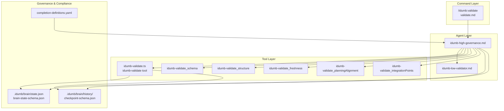
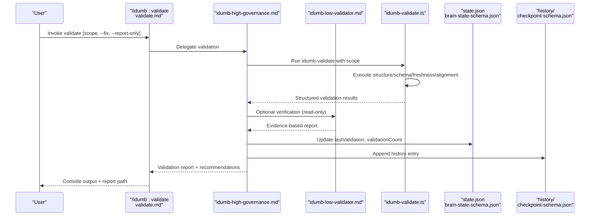
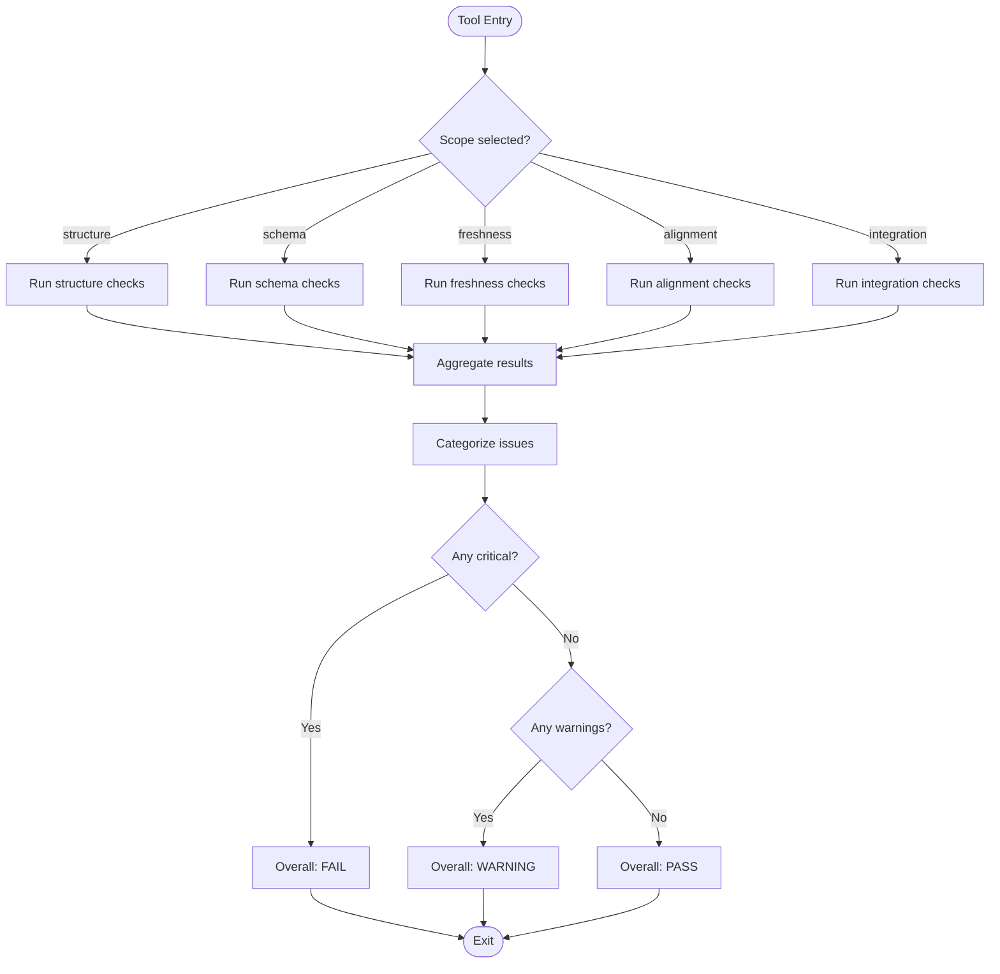
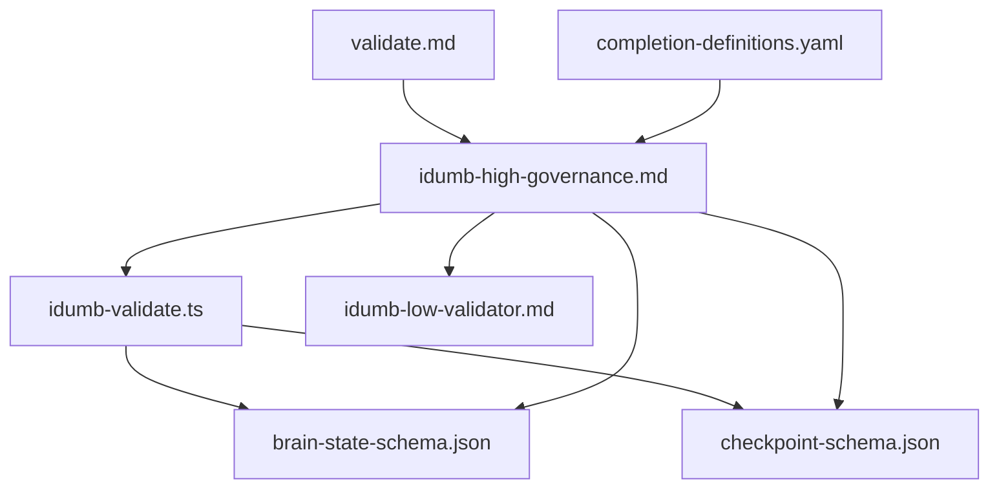

# Validate Workflow

<cite>
**Referenced Files in This Document**
- [validate.md](file://src/commands/idumb/validate.md)
- [idumb-validate.ts](file://src/tools/idumb-validate.ts)
- [SKILL.md](file://src/skills/idumb-validation/SKILL.md)
- [iterative-validation.md](file://src/skills/idumb-validation/workflows/iterative-validation.md)
- [completion-validation-reference.md](file://src/skills/idumb-validation/references/completion-validation-reference.md)
- [integration-points-reference.md](file://src/skills/idumb-validation/references/integration-points-reference.md)
- [idumb-low-validator.md](file://src/agents/idumb-low-validator.md)
- [idumb-high-governance.md](file://src/agents/idumb-high-governance.md)
- [completion-definitions.yaml](file://src/config/completion-definitions.yaml)
- [brain-state-schema.json](file://src/schemas/brain-state-schema.json)
- [checkpoint-schema.json](file://src/schemas/checkpoint-schema.json)
- [verification-report.md](file://src/templates/verification-report.md)
- [validate-module.js](file://src/skills/idumb-meta-builder/scripts/validate-module.js)
- [agent-validation-example.md](file://src/skills/idumb-validation/examples/agent-validation-example.md)
</cite>

## Table of Contents
1. [Introduction](#introduction)
2. [Project Structure](#project-structure)
3. [Core Components](#core-components)
4. [Architecture Overview](#architecture-overview)
5. [Detailed Component Analysis](#detailed-component-analysis)
6. [Dependency Analysis](#dependency-analysis)
7. [Performance Considerations](#performance-considerations)
8. [Troubleshooting Guide](#troubleshooting-guide)
9. [Conclusion](#conclusion)
10. [Appendices](#appendices)

## Introduction
This document explains the Validate workflow in the iDumb meta-framework, focusing on acceptance criteria evaluation, quality assurance processes, and governance integration. It covers validation methodology, acceptance testing, compliance checking, and governance review. It also details validation criteria, scoring mechanisms, decision-making processes, reporting, artifact generation, and stakeholder communication. Practical examples, parameter configuration, and result interpretation are included, along with integration points to QA and compliance systems and guidance on optimization and troubleshooting.

## Project Structure
The Validate workflow spans command-level orchestration, tool-level validators, agent-based enforcement, and governance state management. The following diagram maps the key components and their relationships.

**Diagram sources**
- [validate.md](file://src/commands/idumb/validate.md#L1-L518)
- [idumb-validate.ts](file://src/tools/idumb-validate.ts#L1-L1043)
- [idumb-low-validator.md](file://src/agents/idumb-low-validator.md#L1-L865)
- [idumb-high-governance.md](file://src/agents/idumb-high-governance.md#L1-L717)
- [brain-state-schema.json](file://src/schemas/brain-state-schema.json#L1-L112)
- [checkpoint-schema.json](file://src/schemas/checkpoint-schema.json#L1-L199)
- [completion-definitions.yaml](file://src/config/completion-definitions.yaml#L1-L990)

**Section sources**
- [validate.md](file://src/commands/idumb/validate.md#L1-L518)
- [idumb-validate.ts](file://src/tools/idumb-validate.ts#L1-L1043)
- [idumb-low-validator.md](file://src/agents/idumb-low-validator.md#L1-L865)
- [idumb-high-governance.md](file://src/agents/idumb-high-governance.md#L1-L717)
- [brain-state-schema.json](file://src/schemas/brain-state-schema.json#L1-L112)
- [checkpoint-schema.json](file://src/schemas/checkpoint-schema.json#L1-L199)
- [completion-definitions.yaml](file://src/config/completion-definitions.yaml#L1-L990)

## Core Components
- Command-level orchestration: The `/idumb:validate` command defines the full validation hierarchy, including structure, schema, freshness, alignment, and integrity checks. It also manages fix application, state updates, report generation, and anchoring critical findings.
- Tool-level validators: The `idumb-validate` tool and specialized tools (`idumb-validate_*`) implement granular checks and return structured results consumed by higher layers.
- Agent enforcement: The low-validator agent performs read-only checks and evidence-based reporting; the high-governance agent coordinates validation, builds, and verification.
- Governance and compliance: The brain state schema governs validation metadata; completion definitions define exit criteria and stall detection; checkpoints preserve state for recovery.

**Section sources**
- [validate.md](file://src/commands/idumb/validate.md#L1-L518)
- [idumb-validate.ts](file://src/tools/idumb-validate.ts#L1-L1043)
- [idumb-low-validator.md](file://src/agents/idumb-low-validator.md#L1-L865)
- [idumb-high-governance.md](file://src/agents/idumb-high-governance.md#L1-L717)
- [brain-state-schema.json](file://src/schemas/brain-state-schema.json#L1-L112)
- [completion-definitions.yaml](file://src/config/completion-definitions.yaml#L1-L990)

## Architecture Overview
The Validate workflow follows a completion-driven model: it executes checks until all are performed and results are documented, then updates governance state and creates artifacts. The sequence below maps the end-to-end flow.

**Diagram sources**
- [validate.md](file://src/commands/idumb/validate.md#L53-L328)
- [idumb-validate.ts](file://src/tools/idumb-validate.ts#L401-L456)
- [idumb-low-validator.md](file://src/agents/idumb-low-validator.md#L497-L679)
- [idumb-high-governance.md](file://src/agents/idumb-high-governance.md#L252-L437)
- [brain-state-schema.json](file://src/schemas/brain-state-schema.json#L27-L36)

**Section sources**
- [validate.md](file://src/commands/idumb/validate.md#L53-L328)
- [idumb-validate.ts](file://src/tools/idumb-validate.ts#L401-L456)
- [idumb-low-validator.md](file://src/agents/idumb-low-validator.md#L497-L679)
- [idumb-high-governance.md](file://src/agents/idumb-high-governance.md#L252-L437)

## Detailed Component Analysis

### Command: /idumb:validate
- Purpose: Execute the complete validation hierarchy and update governance state.
- Scope options: all, structure, schema, freshness, alignment, integrity.
- Validation levels: Structure (Critical), Schema (Critical), Freshness (Warning), Alignment (Warning), Integrity (Critical).
- Execution phases:
  - Initialize validation and prepare report directory.
  - Delegate to high governance for orchestration.
  - Run structure, schema, freshness, alignment, and integrity checks.
  - Synthesize results, optionally apply fixes (--fix), update state, create report, and anchor critical findings.
- Success criteria: All checks executed, results documented, state updated, report created, critical findings anchored.

**Section sources**
- [validate.md](file://src/commands/idumb/validate.md#L1-L518)

### Tool: idumb-validate and Specialized Validators
- idumb-validate: Runs scoped checks and aggregates results with pass/fail/warning statuses.
- idumb-validate_structure: Ensures required directories and files exist.
- idumb-validate_schema: Validates state.json/config.json against required fields and types.
- idumb-validate_freshness: Flags stale context (>48h).
- idumb-validate_planningAlignment: Aligns iDumb state with planning artifacts when present.
- idumb-validate_integrationPoints: Validates integration points across agents, commands, and tools.

**Diagram sources**
- [idumb-validate.ts](file://src/tools/idumb-validate.ts#L28-L456)

**Section sources**
- [idumb-validate.ts](file://src/tools/idumb-validate.ts#L28-L456)

### Validation Methodology and Acceptance Testing
- Completion-driven: Validation completes when all checks are executed and documented, not by arbitrary limits.
- Evidence-based: Each claim must have supporting evidence; findings are reported with specific details.
- Acceptance criteria:
  - All checks executed.
  - Results documented with severity and recommendations.
  - State updated with validation timestamp and count.
  - Reports generated and history entries logged.
- Integration thresholds: Minimum integration points per tier (Highest: 30+, Middle: 15+, Lowest: 10+).

**Section sources**
- [SKILL.md](file://src/skills/idumb-validation/SKILL.md#L24-L116)
- [completion-validation-reference.md](file://src/skills/idumb-validation/references/completion-validation-reference.md#L1-L203)
- [integration-points-reference.md](file://src/skills/idumb-validation/references/integration-points-reference.md#L1-L247)

### Quality Assurance and Compliance Systems Integration
- Governance state: Updated with lastValidation timestamp and validationCount; anchors created for critical findings.
- Compliance checking: Uses completion definitions to define exit criteria and stall detection; prohibits arbitrary iteration limits.
- Checkpoints: Captured via checkpoint schema for recovery and state management.
- Templates: Verification report template guides structured documentation of acceptance criteria and gaps.

**Section sources**
- [validate.md](file://src/commands/idumb/validate.md#L286-L328)
- [completion-definitions.yaml](file://src/config/completion-definitions.yaml#L454-L474)
- [checkpoint-schema.json](file://src/schemas/checkpoint-schema.json#L1-L199)
- [verification-report.md](file://src/templates/verification-report.md#L1-L240)

### Decision-Making and Scoring Mechanisms
- Scoring:
  - Layered validation (schema, integration completeness, governance) with scores per layer.
  - Coverage score computed from required sections and governance state operations.
- Decision logic:
  - Overall status determined by presence of critical failures; warnings downgrade pass to warning.
  - If critical issues found, create anchors and recommend fixes; otherwise, proceed with recommendations.

**Section sources**
- [validate-module.js](file://src/skills/idumb-meta-builder/scripts/validate-module.js#L295-L392)
- [validate.md](file://src/commands/idumb/validate.md#L241-L296)

### Validation Reporting and Artifact Generation
- Reports:
  - Validation report JSON in .idumb/brain/governance/validations/.
  - Console output with summary and recommendations.
  - Verification report template for phase goals and acceptance criteria.
- Artifacts:
  - Evidence of checks, state changes, and history entries.
  - Anchors for critical findings to support fix planning.

**Section sources**
- [validate.md](file://src/commands/idumb/validate.md#L304-L328)
- [verification-report.md](file://src/templates/verification-report.md#L1-L240)

### Examples of Validation Execution
- Command invocation: `/idumb:validate [scope] [--fix] [--report-only]`
- Parameter configuration:
  - scope: all | structure | schema | freshness | alignment | integrity
  - --fix: attempt auto-repairs for fixable issues
  - --report-only: report without updating state
- Result interpretation:
  - PASS: no critical failures; may include warnings.
  - WARNING: critical issues not present but warnings exist.
  - FAIL: critical failures found; requires intervention.

**Section sources**
- [validate.md](file://src/commands/idumb/validate.md#L16-L518)

### Relationship Between Validation and Project Completion Phases
- Validation integrates with execution and verification phases:
  - Pre-execution: Validate structure and schema before phase execution.
  - During execution: Use checkpoints and state updates to track progress.
  - Post-execution: Verification validates acceptance criteria; validation ensures governance integrity.
- Completion definitions enforce measurable exit criteria and stall escalation.

**Section sources**
- [completion-definitions.yaml](file://src/config/completion-definitions.yaml#L317-L414)
- [verification-report.md](file://src/templates/verification-report.md#L189-L227)

## Dependency Analysis
The validation system exhibits layered dependencies across commands, tools, agents, and governance schemas.

**Diagram sources**
- [validate.md](file://src/commands/idumb/validate.md#L74-L93)
- [idumb-validate.ts](file://src/tools/idumb-validate.ts#L401-L456)
- [idumb-low-validator.md](file://src/agents/idumb-low-validator.md#L49-L74)
- [idumb-high-governance.md](file://src/agents/idumb-high-governance.md#L142-L206)
- [brain-state-schema.json](file://src/schemas/brain-state-schema.json#L1-L112)
- [checkpoint-schema.json](file://src/schemas/checkpoint-schema.json#L1-L199)
- [completion-definitions.yaml](file://src/config/completion-definitions.yaml#L1-L990)

**Section sources**
- [validate.md](file://src/commands/idumb/validate.md#L74-L93)
- [idumb-validate.ts](file://src/tools/idumb-validate.ts#L401-L456)
- [idumb-low-validator.md](file://src/agents/idumb-low-validator.md#L49-L74)
- [idumb-high-governance.md](file://src/agents/idumb-high-governance.md#L142-L206)
- [brain-state-schema.json](file://src/schemas/brain-state-schema.json#L1-L112)
- [checkpoint-schema.json](file://src/schemas/checkpoint-schema.json#L1-L199)
- [completion-definitions.yaml](file://src/config/completion-definitions.yaml#L1-L990)

## Performance Considerations
- Parallelization: Tools can execute checks in parallel where safe to reduce runtime.
- Early exit: Critical failures short-circuit further processing to minimize wasted computation.
- Streaming output: Tools avoid console.log to prevent TUI pollution; use structured JSON for machine readability.
- Resource limits: Freshness and alignment checks bound file system scans; consider excluding large directories when appropriate.

[No sources needed since this section provides general guidance]

## Troubleshooting Guide
Common issues and remedies:
- Missing .idumb/ structure: Run initialization to create required directories and files.
- Invalid JSON or missing required fields: Use schema validation to identify missing keys and correct types.
- Stale context (>48h): Archive or refresh stale files; consider --fix to auto-archive.
- Planning alignment mismatch: Ensure iDumb framework matches planning system; synchronize via configuration.
- Critical findings: Review validation report, create anchors, and apply recommended fixes.

Verification steps:
- Confirm validation recorded in state.json (lastValidation, validationCount).
- Verify report created in .idumb/brain/governance/validations/.
- Check history updated with validation action.

**Section sources**
- [validate.md](file://src/commands/idumb/validate.md#L472-L483)
- [idumb-validate.ts](file://src/tools/idumb-validate.ts#L189-L280)

## Conclusion
The Validate workflow in iDumb ensures governance integrity through a completion-driven, evidence-based approach. It integrates tightly with state management, compliance definitions, and checkpointing to maintain reliability and traceability. By adhering to acceptance criteria, applying scoring mechanisms, and generating comprehensive reports, the system supports robust quality assurance and governance review across project lifecycle phases.

## Appendices

### Appendix A: Validation Execution Checklist
- [ ] Validation started event logged
- [ ] Structure validation completed
- [ ] Schema validation completed
- [ ] Freshness validation completed
- [ ] Alignment validation completed (if applicable)
- [ ] Integrity validation completed
- [ ] Results synthesized
- [ ] Fixes applied (if --fix flag)
- [ ] State updated with validation timestamp
- [ ] Validation count incremented
- [ ] Report file created
- [ ] Critical findings anchored
- [ ] Summary displayed to user

**Section sources**
- [validate.md](file://src/commands/idumb/validate.md#L439-L485)

### Appendix B: Iterative Validation Workflow
- Initial assessment: Run comprehensive checks and save results.
- Gap classification: Categorize by severity and fixability.
- Resolution planning: Prioritize and plan fixes; delegate where required.
- Execution: Apply fixes, re-validate, and track progress.
- Final verification: Ensure all critical gaps resolved and integration thresholds met.

**Section sources**
- [iterative-validation.md](file://src/skills/idumb-validation/workflows/iterative-validation.md#L1-L236)

### Appendix C: Agent Validation Example
- Scenario: Validating a new agent profile.
- Execution: Structure, integration, behavior checks with gap identification.
- Resolution: Add missing integration points and update return format.
- Re-validation: Confirms threshold met and status validated.

**Section sources**
- [agent-validation-example.md](file://src/skills/idumb-validation/examples/agent-validation-example.md#L1-L159)