# Workflow Customization

<cite>
**Referenced Files in This Document**
- [continuous-validation.md](file://src/workflows/continuous-validation.md)
- [discuss-phase.md](file://src/workflows/discuss-phase.md)
- [execute-phase.md](file://src/workflows/execute-phase.md)
- [plan-phase.md](file://src/workflows/plan-phase.md)
- [research.md](file://src/workflows/research.md)
- [stress-test.md](file://src/workflows/stress-test.md)
- [verify-phase.md](file://src/workflows/verify-phase.md)
- [idumb-core.ts](file://src/plugins/idumb-core.ts)
- [idumb-orchestrator.ts](file://src/tools/idumb-orchestrator.ts)
- [idumb-state.ts](file://src/tools/idumb-state.ts)
- [routing-rules.md](file://src/router/routing-rules.md)
</cite>

## Table of Contents
1. [Introduction](#introduction)
2. [Project Structure](#project-structure)
3. [Core Components](#core-components)
4. [Architecture Overview](#architecture-overview)
5. [Detailed Component Analysis](#detailed-component-analysis)
6. [Dependency Analysis](#dependency-analysis)
7. [Performance Considerations](#performance-considerations)
8. [Troubleshooting Guide](#troubleshooting-guide)
9. [Conclusion](#conclusion)
10. [Appendices](#appendices)

## Introduction
This document explains how to customize, extend, and operate the iDumb workflow system. It covers:
- Modifying workflows and triggers
- Parameter configuration and environment-aware behavior
- Creating custom workflows aligned with governance patterns
- Extension points via plugins and tools
- Monitoring, status tracking, and progress reporting
- Debugging, troubleshooting, and performance optimization
- Testing, validation, and quality assurance
- Maintenance, updates, and version management
- Scaling and resource management strategies

## Project Structure
The workflow system centers around Markdown-based workflow definitions under src/workflows, orchestrated by OpenCode plugins and tools. Governance state is persisted in .idumb/brain/state.json and managed by idumb-state. Plugins enforce permissions, session lifecycle, and context anchoring. Routing rules govern allowed commands per state.

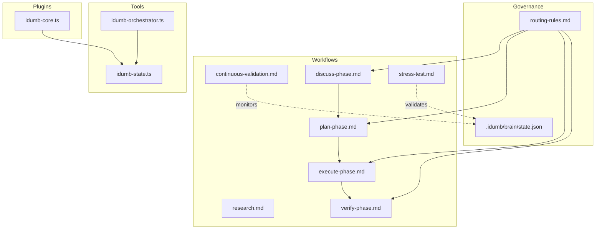

**Diagram sources**
- [continuous-validation.md](file://src/workflows/continuous-validation.md#L1-L420)
- [discuss-phase.md](file://src/workflows/discuss-phase.md#L1-L554)
- [execute-phase.md](file://src/workflows/execute-phase.md#L1-L729)
- [plan-phase.md](file://src/workflows/plan-phase.md#L1-L839)
- [research.md](file://src/workflows/research.md#L1-L746)
- [stress-test.md](file://src/workflows/stress-test.md#L1-L432)
- [verify-phase.md](file://src/workflows/verify-phase.md#L1-L986)
- [idumb-core.ts](file://src/plugins/idumb-core.ts#L1-L1092)
- [idumb-orchestrator.ts](file://src/tools/idumb-orchestrator.ts#L1-L527)
- [idumb-state.ts](file://src/tools/idumb-state.ts#L1-L599)
- [routing-rules.md](file://src/router/routing-rules.md#L1-L186)

**Section sources**
- [continuous-validation.md](file://src/workflows/continuous-validation.md#L1-L420)
- [discuss-phase.md](file://src/workflows/discuss-phase.md#L1-L554)
- [execute-phase.md](file://src/workflows/execute-phase.md#L1-L729)
- [plan-phase.md](file://src/workflows/plan-phase.md#L1-L839)
- [research.md](file://src/workflows/research.md#L1-L746)
- [stress-test.md](file://src/workflows/stress-test.md#L1-L432)
- [verify-phase.md](file://src/workflows/verify-phase.md#L1-L986)
- [idumb-core.ts](file://src/plugins/idumb-core.ts#L1-L1092)
- [idumb-orchestrator.ts](file://src/tools/idumb-orchestrator.ts#L1-L527)
- [idumb-state.ts](file://src/tools/idumb-state.ts#L1-L599)
- [routing-rules.md](file://src/router/routing-rules.md#L1-L186)

## Core Components
- Workflows define purpose, philosophy, entry checks, execution flow, agent spawning, checkpoints, deviation handling, output artifacts, chain rules, success criteria, and integration points.
- Plugins enforce permissions, session lifecycle, and inject governance context. They also track execution metrics and stall detection.
- Tools manage state, orchestrate validation skills, and provide hooks for pre-write and delegation validation.
- Routing rules govern allowed commands based on governance state.

Key customization areas:
- Workflow YAML sections (activation_triggers, loop_controller, chain_rules)
- Plugin hooks for session events, permission enforcement, and compaction
- Tool arguments for risk-aware orchestration and pre-delegation checks
- State anchors and history for traceability and recovery

**Section sources**
- [continuous-validation.md](file://src/workflows/continuous-validation.md#L37-L100)
- [discuss-phase.md](file://src/workflows/discuss-phase.md#L334-L396)
- [execute-phase.md](file://src/workflows/execute-phase.md#L364-L392)
- [plan-phase.md](file://src/workflows/plan-phase.md#L390-L452)
- [research.md](file://src/workflows/research.md#L527-L534)
- [stress-test.md](file://src/workflows/stress-test.md#L361-L367)
- [idumb-core.ts](file://src/plugins/idumb-core.ts#L130-L341)
- [idumb-orchestrator.ts](file://src/tools/idumb-orchestrator.ts#L257-L343)
- [idumb-state.ts](file://src/tools/idumb-state.ts#L132-L152)
- [routing-rules.md](file://src/router/routing-rules.md#L14-L118)

## Architecture Overview
The system integrates workflows, plugins, tools, and governance state into a cohesive pipeline:
- Workflows describe execution logic and governance expectations.
- Plugins intercept sessions, enforce permissions, and inject context.
- Tools provide state management, orchestration, and validation hooks.
- Routing rules ensure commands are executed in the correct state and order.

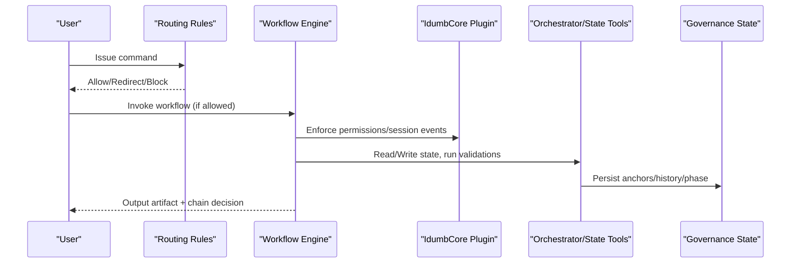

**Diagram sources**
- [routing-rules.md](file://src/router/routing-rules.md#L14-L118)
- [idumb-core.ts](file://src/plugins/idumb-core.ts#L130-L341)
- [idumb-orchestrator.ts](file://src/tools/idumb-orchestrator.ts#L257-L343)
- [idumb-state.ts](file://src/tools/idumb-state.ts#L132-L152)

## Detailed Component Analysis

### Continuous Validation Workflow
Purpose: Real-time and batch validation coordinated by triggers and a decision loop.
Key customization points:
- Activation triggers: micro/batch/time/commit events mapped to actions
- Coordinator decision logic: mode selection based on changed files, elapsed time, and trigger type
- Loop controller: iteration behavior, stall prevention, and max iterations
- Chain rules: pass/warn/fail outcomes and next steps

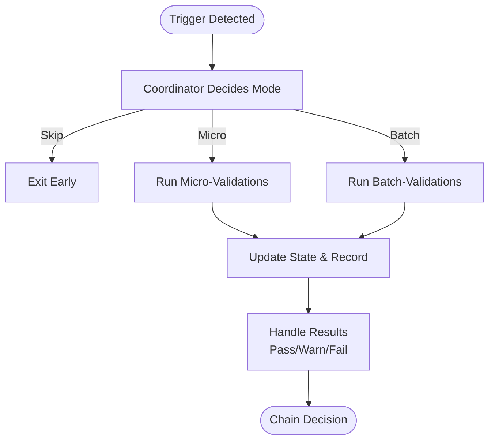

**Diagram sources**
- [continuous-validation.md](file://src/workflows/continuous-validation.md#L102-L152)
- [continuous-validation.md](file://src/workflows/continuous-validation.md#L212-L302)
- [continuous-validation.md](file://src/workflows/continuous-validation.md#L366-L389)

Customization examples:
- Add new micro-trigger patterns to detect file/command changes
- Adjust coordinator thresholds (e.g., minutes since last validation)
- Tune loop_controller to increase/decrease iteration frequency

**Section sources**
- [continuous-validation.md](file://src/workflows/continuous-validation.md#L37-L100)
- [continuous-validation.md](file://src/workflows/continuous-validation.md#L126-L152)
- [continuous-validation.md](file://src/workflows/continuous-validation.md#L212-L302)
- [continuous-validation.md](file://src/workflows/continuous-validation.md#L366-L389)

### Discuss-Phase Workflow
Purpose: Collaborative discovery to define phase goals, scope, constraints, and dependencies.
Key customization points:
- Interactive protocol: opening, partial answers, “I don’t know,” interruptions
- Agent spawning: researchers and validators after context creation
- Chain rules: auto-proceed to plan-phase or prompt user for edits

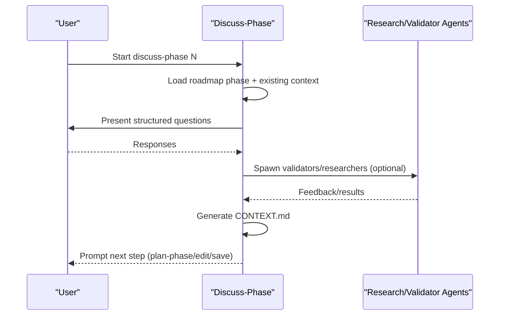

**Diagram sources**
- [discuss-phase.md](file://src/workflows/discuss-phase.md#L67-L120)
- [discuss-phase.md](file://src/workflows/discuss-phase.md#L176-L210)
- [discuss-phase.md](file://src/workflows/discuss-phase.md#L334-L341)
- [discuss-phase.md](file://src/workflows/discuss-phase.md#L433-L448)

Customization examples:
- Extend interactive protocol with domain-specific prompts
- Add new agent spawns for specialized validators
- Modify chain rules to auto-proceed based on user-defined flags

**Section sources**
- [discuss-phase.md](file://src/workflows/discuss-phase.md#L16-L24)
- [discuss-phase.md](file://src/workflows/discuss-phase.md#L342-L396)
- [discuss-phase.md](file://src/workflows/discuss-phase.md#L433-L448)

### Plan-Phase Workflow
Purpose: Transform goals into validated execution plans with tasks, dependencies, and acceptance criteria.
Key customization points:
- Conditional research spawn: freshness checks and user overrides
- Planner and plan-checker agents: iterative validation with retry limits
- Planning checkpoints and deviation handling
- Output artifact: PLAN.md with frontmatter and sections

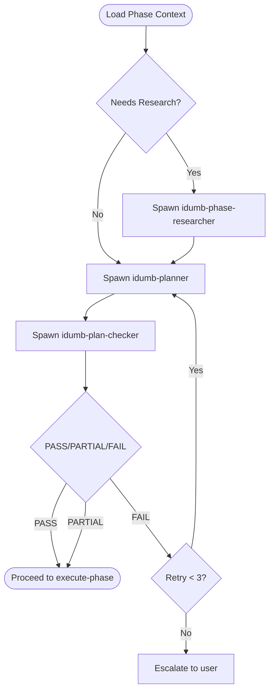

**Diagram sources**
- [plan-phase.md](file://src/workflows/plan-phase.md#L133-L165)
- [plan-phase.md](file://src/workflows/plan-phase.md#L194-L242)
- [plan-phase.md](file://src/workflows/plan-phase.md#L250-L296)
- [plan-phase.md](file://src/workflows/plan-phase.md#L302-L353)

Customization examples:
- Adjust research freshness thresholds
- Modify validation rubric and retry logic
- Tune task atomicity and dependency graph constraints

**Section sources**
- [plan-phase.md](file://src/workflows/plan-phase.md#L25-L40)
- [plan-phase.md](file://src/workflows/plan-phase.md#L133-L165)
- [plan-phase.md](file://src/workflows/plan-phase.md#L250-L296)
- [plan-phase.md](file://src/workflows/plan-phase.md#L302-L353)

### Execute-Phase Workflow
Purpose: Execute tasks with validation checkpoints, dependency integrity, and deviation handling.
Key customization points:
- Agent delegation: builder and low-validator per task
- Checkpoint protocol: creation, resume, rollback
- Deviation handling: task failure, unexpected changes, dependency failure, plan obsolescence
- Output artifact: SUMMARY.md with metrics and remediation

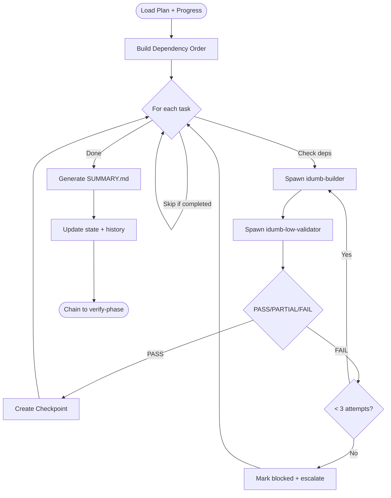

**Diagram sources**
- [execute-phase.md](file://src/workflows/execute-phase.md#L165-L273)
- [execute-phase.md](file://src/workflows/execute-phase.md#L394-L469)
- [execute-phase.md](file://src/workflows/execute-phase.md#L471-L543)
- [execute-phase.md](file://src/workflows/execute-phase.md#L606-L655)

Customization examples:
- Adjust retry limits and timeouts per task
- Customize checkpoint schema and resume logic
- Add custom deviation handlers for domain-specific constraints

**Section sources**
- [execute-phase.md](file://src/workflows/execute-phase.md#L24-L38)
- [execute-phase.md](file://src/workflows/execute-phase.md#L394-L469)
- [execute-phase.md](file://src/workflows/execute-phase.md#L471-L543)
- [execute-phase.md](file://src/workflows/execute-phase.md#L606-L655)

### Verify-Phase Workflow
Purpose: Goal-backward verification to ensure outcomes, not just task completion.
Key customization points:
- Goal-backward methodology: extract criteria, gather evidence, spawn validators
- Skeptic review for critical phases
- Output artifact: VERIFICATION.md with ratings and recommendations

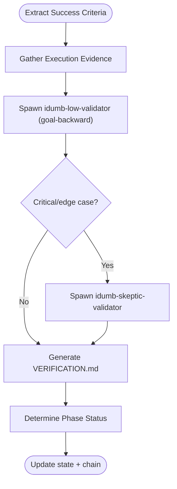

**Diagram sources**
- [verify-phase.md](file://src/workflows/verify-phase.md#L94-L132)
- [verify-phase.md](file://src/workflows/verify-phase.md#L189-L250)
- [verify-phase.md](file://src/workflows/verify-phase.md#L302-L361)
- [verify-phase.md](file://src/workflows/verify-phase.md#L445-L480)

Customization examples:
- Extend goal-backward search patterns for domain-specific evidence
- Add custom validator agents for specialized verification
- Adjust pass-rate thresholds and status determination rules

**Section sources**
- [verify-phase.md](file://src/workflows/verify-phase.md#L24-L38)
- [verify-phase.md](file://src/workflows/verify-phase.md#L535-L588)
- [verify-phase.md](file://src/workflows/verify-phase.md#L628-L661)
- [verify-phase.md](file://src/workflows/verify-phase.md#L741-L745)

### Stress-Test Workflow
Purpose: Comprehensive framework validation with agent coordination, integration thresholds, regression sweep, and conflict detection.
Key customization points:
- Mode selection: micro/batch/full based on conditions
- Agent coordination tests, integration matrix thresholds, regression checks
- Self-healing and report generation

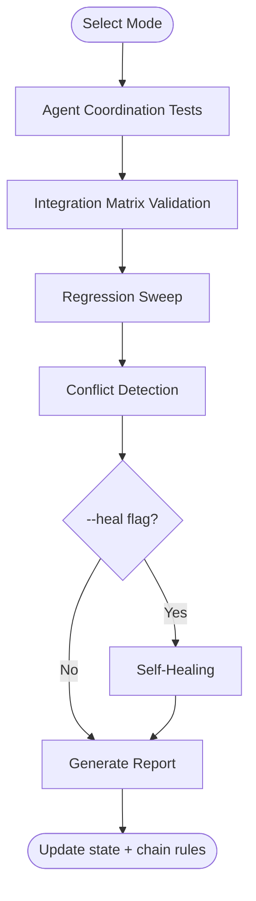

**Diagram sources**
- [stress-test.md](file://src/workflows/stress-test.md#L38-L63)
- [stress-test.md](file://src/workflows/stress-test.md#L68-L132)
- [stress-test.md](file://src/workflows/stress-test.md#L133-L187)
- [stress-test.md](file://src/workflows/stress-test.md#L290-L311)
- [stress-test.md](file://src/workflows/stress-test.md#L313-L358)

Customization examples:
- Adjust integration thresholds per component type
- Add new conflict detection heuristics
- Extend self-healing to include automated fixes

**Section sources**
- [stress-test.md](file://src/workflows/stress-test.md#L15-L23)
- [stress-test.md](file://src/workflows/stress-test.md#L369-L399)
- [stress-test.md](file://src/workflows/stress-test.md#L401-L416)

### Research Workflow
Purpose: Systematic research with multi-source verification, synthesis, risk assessment, and RESEARCH.md output.
Key customization points:
- Research methodology: source hierarchy, freshness requirements, verification protocol
- Agent spawning: project/phase-specific researchers and synthesizers
- Output artifact: RESEARCH.md with frontmatter and sections

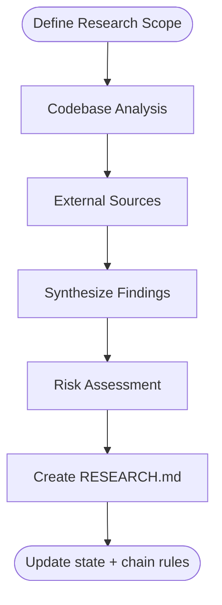

**Diagram sources**
- [research.md](file://src/workflows/research.md#L64-L121)
- [research.md](file://src/workflows/research.md#L124-L182)
- [research.md](file://src/workflows/research.md#L185-L257)
- [research.md](file://src/workflows/research.md#L260-L335)
- [research.md](file://src/workflows/research.md#L338-L382)
- [research.md](file://src/workflows/research.md#L386-L489)
- [research.md](file://src/workflows/research.md#L492-L524)

Customization examples:
- Add new external source integrations
- Modify synthesis logic for domain-specific conflicts
- Adjust risk matrix and confidence assignments

**Section sources**
- [research.md](file://src/workflows/research.md#L16-L25)
- [research.md](file://src/workflows/research.md#L536-L576)
- [research.md](file://src/workflows/research.md#L578-L612)
- [research.md](file://src/workflows/research.md#L614-L679)

### Plugin Integration (IdumbCore)
Purpose: Enforce permissions, manage session lifecycle, inject governance context, and track execution metrics.
Key customization points:
- Event hooks: session.created/idle/compacted/resumed/error
- Permission enforcement: deny/log based on allowed tools
- System prompt transformation: output style injection
- Messages transformation: governance prefix and post-compaction reminders

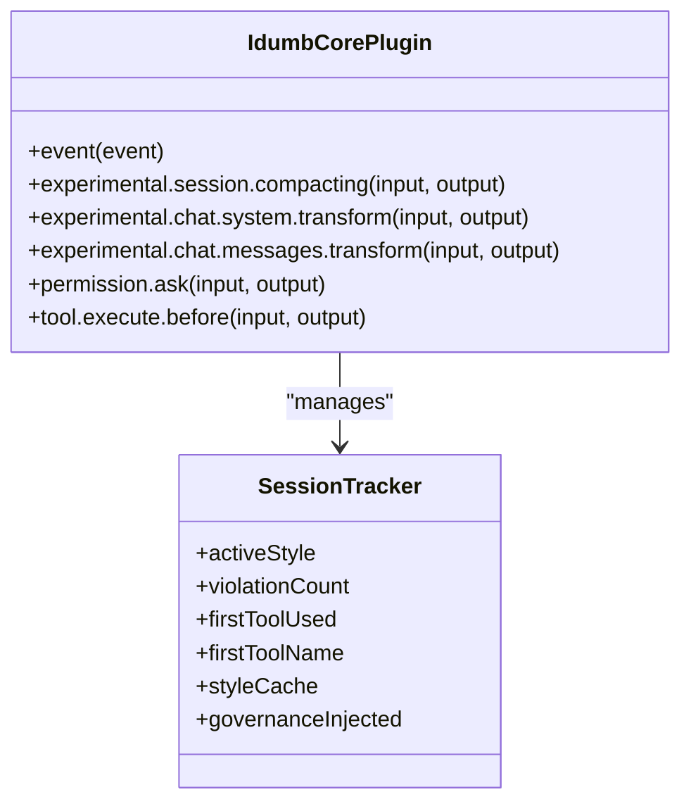

**Diagram sources**
- [idumb-core.ts](file://src/plugins/idumb-core.ts#L130-L341)
- [idumb-core.ts](file://src/plugins/idumb-core.ts#L446-L645)
- [idumb-core.ts](file://src/plugins/idumb-core.ts#L651-L741)
- [idumb-core.ts](file://src/plugins/idumb-core.ts#L752-L800)

Customization examples:
- Extend permission enforcement with new tool categories
- Add new session lifecycle behaviors
- Customize style injection and compaction context

**Section sources**
- [idumb-core.ts](file://src/plugins/idumb-core.ts#L130-L341)
- [idumb-core.ts](file://src/plugins/idumb-core.ts#L446-L645)
- [idumb-core.ts](file://src/plugins/idumb-core.ts#L651-L741)
- [idumb-core.ts](file://src/plugins/idumb-core.ts#L752-L800)

### Tool Integration (Orchestrator, State)
Purpose: Orchestrate validation skills by operation type and risk; manage governance state and session records.
Key customization points:
- Orchestration: risk assessment, skill activation matrix, dry-run planning
- State management: read/write anchors/history, session records, purging

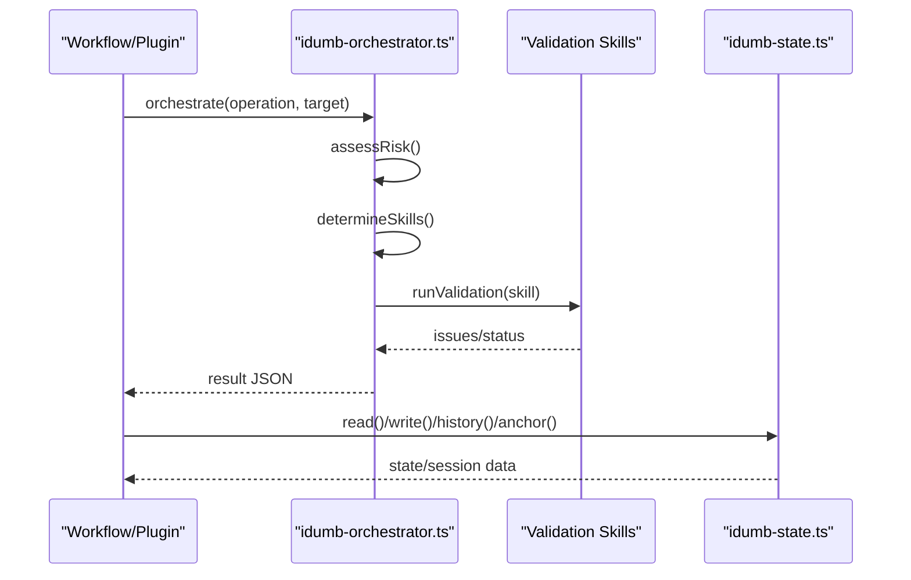

**Diagram sources**
- [idumb-orchestrator.ts](file://src/tools/idumb-orchestrator.ts#L257-L343)
- [idumb-orchestrator.ts](file://src/tools/idumb-orchestrator.ts#L472-L512)
- [idumb-state.ts](file://src/tools/idumb-state.ts#L82-L130)
- [idumb-state.ts](file://src/tools/idumb-state.ts#L132-L152)
- [idumb-state.ts](file://src/tools/idumb-state.ts#L154-L192)

Customization examples:
- Add new operation types and risk factors
- Extend skill activation rules
- Add new state anchors and history entries

**Section sources**
- [idumb-orchestrator.ts](file://src/tools/idumb-orchestrator.ts#L56-L123)
- [idumb-orchestrator.ts](file://src/tools/idumb-orchestrator.ts#L134-L167)
- [idumb-orchestrator.ts](file://src/tools/idumb-orchestrator.ts#L257-L343)
- [idumb-state.ts](file://src/tools/idumb-state.ts#L132-L152)
- [idumb-state.ts](file://src/tools/idumb-state.ts#L154-L192)

### Routing Rules
Purpose: Control allowed commands based on governance state and auto-correct missteps.
Key customization points:
- State-based routing: detect conditions and map to allowed/blocked commands
- Priority matrix: categorize commands by criticality
- Auto-corrections: redirect and warn on common missteps

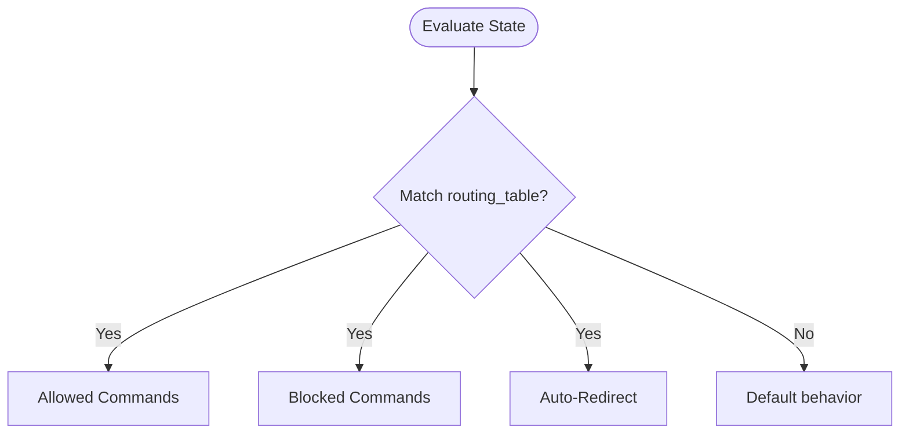

**Diagram sources**
- [routing-rules.md](file://src/router/routing-rules.md#L14-L118)
- [routing-rules.md](file://src/router/routing-rules.md#L120-L150)
- [routing-rules.md](file://src/router/routing-rules.md#L152-L175)

Customization examples:
- Add new state detection conditions
- Expand allowed commands per state
- Introduce new auto-correction triggers

**Section sources**
- [routing-rules.md](file://src/router/routing-rules.md#L14-L118)
- [routing-rules.md](file://src/router/routing-rules.md#L120-L150)
- [routing-rules.md](file://src/router/routing-rules.md#L152-L175)

## Dependency Analysis
Workflows depend on:
- Governance state (.idumb/brain/state.json) for phase tracking and validation timestamps
- Agent artifacts (CONTEXT.md, PLAN.md, SUMMARY.md, VERIFICATION.md) for inter-phase continuity
- Plugin hooks for permission enforcement and context injection
- Tools for orchestration and state persistence

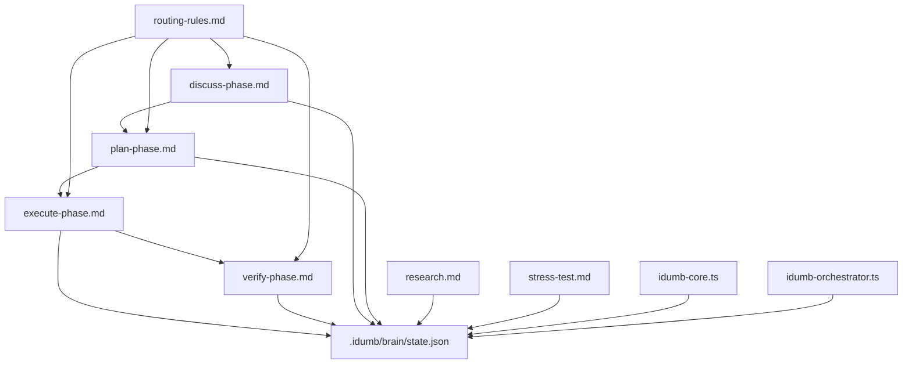

**Diagram sources**
- [discuss-phase.md](file://src/workflows/discuss-phase.md#L298-L331)
- [plan-phase.md](file://src/workflows/plan-phase.md#L357-L387)
- [execute-phase.md](file://src/workflows/execute-phase.md#L336-L362)
- [verify-phase.md](file://src/workflows/verify-phase.md#L445-L480)
- [idumb-core.ts](file://src/plugins/idumb-core.ts#L130-L341)
- [idumb-orchestrator.ts](file://src/tools/idumb-orchestrator.ts#L257-L343)
- [routing-rules.md](file://src/router/routing-rules.md#L14-L118)

**Section sources**
- [discuss-phase.md](file://src/workflows/discuss-phase.md#L531-L549)
- [plan-phase.md](file://src/workflows/plan-phase.md#L697-L725)
- [execute-phase.md](file://src/workflows/execute-phase.md#L697-L725)
- [verify-phase.md](file://src/workflows/verify-phase.md#L741-L745)
- [idumb-core.ts](file://src/plugins/idumb-core.ts#L130-L341)
- [idumb-orchestrator.ts](file://src/tools/idumb-orchestrator.ts#L257-L343)
- [routing-rules.md](file://src/router/routing-rules.md#L14-L118)

## Performance Considerations
- Micro vs batch validation: use micro for frequent, lightweight checks; batch for thorough validation after significant changes.
- Iteration limits and stall detection: prevent infinite loops and detect regressions in planning/checker stalls.
- Execution timeouts: tune per-task estimates and validator timeouts to balance speed and accuracy.
- State pruning: anchors/history trimming keeps state manageable.
- Pre-write validation: catch critical issues early to avoid expensive rework.

[No sources needed since this section provides general guidance]

## Troubleshooting Guide
Common issues and resolutions:
- Permission denials: review allowed tools and enforcement settings; use permission.ask hook logs.
- Session compaction: rely on post-compaction reminders and context recovery; preserve anchors for critical context.
- Execution halts: inspect checkpoints, blocked tasks, and deviation logs; use rollback protocol when needed.
- Validation failures: leverage stress-test and continuous-validation reports; apply self-healing selectively.
- State corruption: use idumb-state history and anchors to reconstruct context; purge old sessions periodically.

**Section sources**
- [idumb-core.ts](file://src/plugins/idumb-core.ts#L651-L741)
- [execute-phase.md](file://src/workflows/execute-phase.md#L444-L469)
- [stress-test.md](file://src/workflows/stress-test.md#L290-L311)
- [idumb-state.ts](file://src/tools/idumb-state.ts#L481-L595)

## Conclusion
The iDumb workflow system offers robust customization and extension mechanisms:
- Workflows encode governance, validation, and chaining logic
- Plugins enforce permissions and inject context
- Tools orchestrate validation and manage state
- Routing rules ensure safe, state-appropriate command execution

By leveraging these components, teams can tailor workflows to domain needs, integrate third-party tools, monitor progress, debug effectively, and scale operations safely.

[No sources needed since this section summarizes without analyzing specific files]

## Appendices

### Workflow Modification Options
- Edit YAML sections: activation_triggers, loop_controller, chain_rules
- Adjust thresholds and timeouts in execution flows
- Add new agent spawns and validation steps
- Extend output artifacts with domain-specific sections

**Section sources**
- [continuous-validation.md](file://src/workflows/continuous-validation.md#L37-L100)
- [discuss-phase.md](file://src/workflows/discuss-phase.md#L334-L341)
- [execute-phase.md](file://src/workflows/execute-phase.md#L364-L392)
- [plan-phase.md](file://src/workflows/plan-phase.md#L390-L452)
- [verify-phase.md](file://src/workflows/verify-phase.md#L482-L533)

### Parameter Configuration
- Risk-aware orchestration: operation_type, target_path, risk_level, dry_run
- State management: phase, framework, lastValidation, incrementValidation
- Session management: create/modify/export/list sessions with filters

**Section sources**
- [idumb-orchestrator.ts](file://src/tools/idumb-orchestrator.ts#L257-L271)
- [idumb-state.ts](file://src/tools/idumb-state.ts#L132-L152)
- [idumb-state.ts](file://src/tools/idumb-state.ts#L277-L313)

### Custom Workflow Creation
Steps:
- Define purpose, philosophy, and success criteria
- Implement execution flow with checkpoints and deviation handling
- Configure agent spawning and chain rules
- Add integration points and output artifacts
- Wire into routing rules and state updates

**Section sources**
- [discuss-phase.md](file://src/workflows/discuss-phase.md#L16-L24)
- [plan-phase.md](file://src/workflows/plan-phase.md#L25-L40)
- [execute-phase.md](file://src/workflows/execute-phase.md#L24-L38)
- [verify-phase.md](file://src/workflows/verify-phase.md#L24-L38)
- [research.md](file://src/workflows/research.md#L16-L25)
- [stress-test.md](file://src/workflows/stress-test.md#L15-L23)

### Extension Points and Third-Party Integration
- Plugin hooks: session events, permission.ask, tool.execute.before
- Tool integrations: orchestrate validation skills, pre-write checks, delegation validation
- Routing rules: state-based command gating and auto-corrections

**Section sources**
- [idumb-core.ts](file://src/plugins/idumb-core.ts#L130-L341)
- [idumb-orchestrator.ts](file://src/tools/idumb-orchestrator.ts#L257-L343)
- [routing-rules.md](file://src/router/routing-rules.md#L14-L118)

### Monitoring, Status Tracking, and Progress Reporting
- Continuous validation: micro/batch modes, coordinator decisions, loop controller
- Execution checkpoints: task-level progress, git hash snapshots, deviation logs
- State anchors and history: traceability and recovery
- Stress-test reports: pass/fail/partials with scores

**Section sources**
- [continuous-validation.md](file://src/workflows/continuous-validation.md#L366-L389)
- [execute-phase.md](file://src/workflows/execute-phase.md#L394-L469)
- [idumb-state.ts](file://src/tools/idumb-state.ts#L154-L221)
- [stress-test.md](file://src/workflows/stress-test.md#L313-L358)

### Debugging, Troubleshooting, and Performance Optimization
- Use idumb:debug and workflow-specific prompts
- Inspect anchors/history for context
- Apply self-healing selectively
- Tune timeouts and retry limits
- Monitor stall detection and iteration metrics

**Section sources**
- [execute-phase.md](file://src/workflows/execute-phase.md#L471-L543)
- [stress-test.md](file://src/workflows/stress-test.md#L290-L311)
- [idumb-state.ts](file://src/tools/idumb-state.ts#L481-L595)

### Testing Methodologies, Validation Approaches, and QA Practices
- Continuous validation: real-time and scheduled checks
- Stress testing: comprehensive framework validation
- Goal-backward verification: evidence-based pass/fail
- Plan validation: iterative checks with retries
- Research synthesis: multi-source verification and risk assessment

**Section sources**
- [continuous-validation.md](file://src/workflows/continuous-validation.md#L102-L152)
- [stress-test.md](file://src/workflows/stress-test.md#L38-L63)
- [verify-phase.md](file://src/workflows/verify-phase.md#L94-L132)
- [plan-phase.md](file://src/workflows/plan-phase.md#L250-L296)
- [research.md](file://src/workflows/research.md#L260-L335)

### Maintenance, Updates, and Version Management
- Workflow version fields and GSD versions
- State migration and pruning policies
- Anchors/history rotation for long-term sustainability

**Section sources**
- [continuous-validation.md](file://src/workflows/continuous-validation.md#L2-L8)
- [discuss-phase.md](file://src/workflows/discuss-phase.md#L7-L9)
- [execute-phase.md](file://src/workflows/execute-phase.md#L7-L9)
- [plan-phase.md](file://src/workflows/plan-phase.md#L7-L9)
- [research.md](file://src/workflows/research.md#L7-L9)
- [stress-test.md](file://src/workflows/stress-test.md#L7-L9)
- [verify-phase.md](file://src/workflows/verify-phase.md#L7-L9)
- [idumb-state.ts](file://src/tools/idumb-state.ts#L481-L595)

### Scaling, Performance Optimization, and Resource Management
- Use micro validation for high-frequency changes
- Optimize task estimates and dependency graphs
- Leverage checkpoints and resume to minimize rework
- Trim state and purge old sessions regularly

**Section sources**
- [continuous-validation.md](file://src/workflows/continuous-validation.md#L80-L100)
- [execute-phase.md](file://src/workflows/execute-phase.md#L139-L155)
- [idumb-state.ts](file://src/tools/idumb-state.ts#L481-L595)