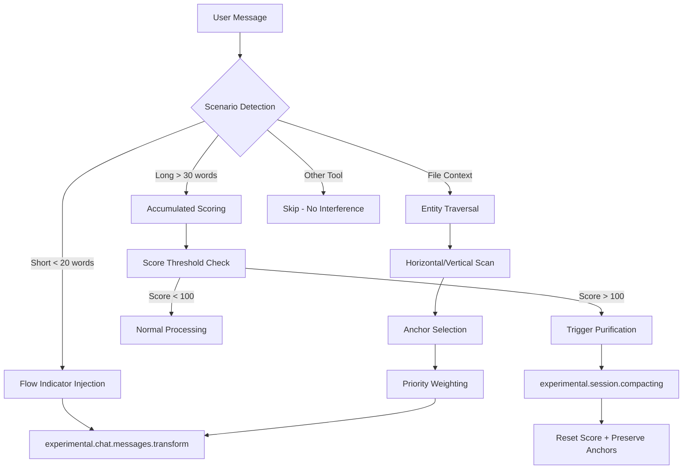

# Micro-Milestone Architecture: iDumb Plugin Reboot

**Document:** MICRO-MILESTONE-ARCHITECTURE-2026-02-05.md  
**Architect:** @idumb-architect  
**Date:** 2026-02-05  
**Status:** Foundation Document (Pre-Code)

---

## Executive Summary

This document maps the user's conceptual requirements to OpenCode's plugin mechanisms, creating a pivotal micro-trial sequence ordered by frequency risk. Each trial includes PASS criteria, PIVOT strategies, and TUI-safety guarantees.

### Core Philosophy: Intelligence = Context Purification

The user defines "intelligence" as:
- **Always-aware context purification** (never lose critical anchors)
- **Selective anchor points** (weighted priority system)
- **Traverse horizontal/vertical** (upstream/downstream entity relationships)

This translates to: **The plugin must intercept, purify, and re-inject context at every decision boundary.**

---

## Part 1: Concept → Mechanism Mapping Table

| User Concept | OpenCode Mechanism | Hook/API | Implementation Pattern |
|--------------|-------------------|----------|----------------------|
| **Time-to-stale** | Session metadata + file timestamps | `event` + `tool.execute.after` | Timestamp validation on every tool use |
| **Chain-breaking (schema guards)** | Tool interception + Zod validation | `tool.execute.before` | Pre-flight schema validation |
| **Planning-artifacts-hierarchy** | Custom tools + file persistence | `tool.*` + custom tools | Hierarchical state.json structure |
| **Stop hook manipulation** | Tool blocking + message injection | `tool.execute.before` (throw) | Governance violation guidance |
| **Inner cycle delegation** | Task tool interception | `tool.execute.before` on `task` | Delegation depth tracking |
| **Compact hook** | Session compaction customization | `experimental.session.compacting` | Anchor preservation injection |
| **Last message transform** | Post-generation modification | `experimental.text.complete` | Output normalization |
| **Sub-task delegation** | Task tool + background tracking | `tool.execute.after` + custom state | Parallel task registry |
| **Compact message hierarchy** | Message array transformation | `experimental.chat.messages.transform` | Priority-sorted context injection |
| **User prompt transformation** | Message array modification | `experimental.chat.messages.transform` | Flow indicator injection |
| **Force delegation** | Permission + tool enforcement | `permission.ask` + `tool.execute.before` | Agent role-based routing |
| **3-level TODO** | Custom tool with LSP metadata | Custom `idumb:todo` tool | Hierarchical task schema |
| **Auto-run tools** | Event-triggered execution | `event` + SDK client | Automatic validation cycles |
| **Session export** | File persistence | `event` + file I/O | Structured session dumps |
| **State management** | Brain artifacts | Custom tools + Zod schemas | `.idumb/brain/` hierarchy |

---

## Part 2: "Intelligence" Hooks Architecture

### 2.1 Context Purification Interception Points



### 2.2 Anchor Selection Algorithm

```typescript
// Zod schema for anchor prioritization
const AnchorSchema = z.object({
  id: z.string(),
  content: z.string(),
  priority: z.enum(['critical', 'high', 'medium', 'low']),
  timestamp: z.string().datetime(),
  staleness: z.number(), // hours since last validation
  traversalDepth: z.number(), // 0 = direct, 1+ = related
  entityType: z.enum(['task', 'decision', 'file', 'agent', 'phase']),
});

// Selection algorithm (pseudocode)
function selectAnchors(anchors: Anchor[], budget: number): Anchor[] {
  // 1. Filter stale anchors (staleness > 48 hours)
  const fresh = anchors.filter(a => a.staleness <= 48);
  
  // 2. Sort by composite score
  const scored = fresh.map(a => ({
    ...a,
    score: calculateScore(a)
  })).sort((a, b) => b.score - a.score);
  
  // 3. Take top N within budget
  return scored.slice(0, budget);
}

function calculateScore(a: Anchor): number {
  const priorityWeight = { critical: 100, high: 75, medium: 50, low: 25 };
  const freshnessBonus = Math.max(0, 48 - a.staleness);
  const depthPenalty = a.traversalDepth * 10;
  
  return priorityWeight[a.priority] + freshnessBonus - depthPenalty;
}
```

### 2.3 Horizontal/Vertical Traversal Patterns

```typescript
// Horizontal: Same-level entities
// Example: All tasks in current phase
async function traverseHorizontal(entity: Entity): Promise<Entity[]> {
  switch (entity.type) {
    case 'task':
      return await getTasksInPhase(entity.phaseId);
    case 'file':
      return await getFilesInDirectory(entity.directory);
    case 'agent':
      return await getAgentsAtLevel(entity.hierarchyLevel);
  }
}

// Vertical: Upstream/downstream relationships
// Example: Parent task → Child tasks, or Task → Related files
async function traverseVertical(entity: Entity, direction: 'up' | 'down'): Promise<Entity[]> {
  switch (entity.type) {
    case 'task':
      return direction === 'up' 
        ? await getParentTask(entity.parentId)
        : await getChildTasks(entity.id);
    case 'phase':
      return direction === 'up'
        ? await getParentPhase(entity.parentId)
        : await getPhaseContents(entity.id);
  }
}
```

---

## Part 3: Micro-Trial Sequence (Ordered by Frequency Risk)

### Trial Order Rationale

| Priority | Trial | Frequency | Risk | Rationale |
|----------|-------|-----------|------|-----------|
| **1** | Stop Hook (tool.execute.before) | HIGHEST | MEDIUM | Most frequently triggered, tests core interception |
| **2** | Inner Cycle Delegation | HIGH | MEDIUM | Tests task tool manipulation |
| **3** | Compact Hook + Last Message | HIGH | LOW | Tests compaction survival |
| **4** | Sub-task Background Tracking | MEDIUM | LOW | Tests parallel state management |
| **5** | Compact Message Hierarchy | UNKNOWN | HIGH | Tests LLM message order behavior |
| **6** | User Prompt Transform | UNKNOWN | MEDIUM | Tests mid-session injection |
| **7** | Force Delegation + 3-Level TODO | CONFIDENT | LOW | Tests custom tool ecosystem |
| **8** | Auto-run + Export + State | SAFE | HIGH | Tests complex orchestration |

---

### TRIAL-1: Stop Hook Tool Manipulation

**Mechanism:** `tool.execute.before` + throw Error

**What We're Testing:**
- Can we prevent tool execution by throwing?
- Can we modify tool args before execution?
- Can we inject guidance messages after denial?

```typescript
// Test implementation
"tool.execute.before": async (input, output) => {
  const { tool, sessionID } = input;
  
  // Test 1: Can we block a tool?
  if (tool === 'edit' && !isAgentAllowed(sessionID, 'edit')) {
    throw new Error("GOVERNANCE: edit not permitted for this agent");
    // Expected: Tool blocked, error shown to user
  }
  
  // Test 2: Can we modify args?
  if (tool === 'read') {
    output.args.filePath = sanitizePath(output.args.filePath);
    // Expected: Modified path used
  }
}
```

**PASS Criteria:**
- [ ] P1.1: Throwing error blocks tool execution
- [ ] P1.2: Error message visible in TUI (not background text)
- [ ] P1.3: Arg modification persists to actual execution
- [ ] P1.4: Other hooks continue running (no short-circuit)

**TUI Break Scenarios:**
| Symptom | Cause | Workaround |
|---------|-------|------------|
| Background text exposure | console.log in hook | Use file-based logging only |
| TUI freeze | Synchronous blocking | Wrap in async, add timeout |
| Partial render | Error in output format | Catch all errors, return gracefully |

**PIVOT Strategy:**
```
IF P1.1 fails (can't block):
  → PIVOT to tool.execute.after output replacement
  → Change output.output to "BLOCKED: ..." message
  
IF P1.2 fails (error not visible):
  → PIVOT to custom tool return
  → Create wrapper tool that validates first
  
IF P1.3 fails (args not modified):
  → PIVOT to pre-validation tool
  → Require calling idumb:validate before target tool
```

---

### TRIAL-2: Inner Cycle Delegation Manipulation

**Mechanism:** `tool.execute.before` on `task` tool + session tracking

**What We're Testing:**
- Can we intercept task delegations?
- Can we modify delegation targets?
- Can we track delegation depth?
- Can we prevent circular delegation?

```typescript
// Delegation tracking state
const delegationStack = new Map<string, string[]>();

"tool.execute.before": async (input, output) => {
  if (input.tool !== 'task') return;
  
  const { sessionID } = input;
  const targetAgent = output.args.agent || output.args.all_type;
  
  // Test 1: Track delegation depth
  const stack = delegationStack.get(sessionID) || [];
  stack.push(targetAgent);
  delegationStack.set(sessionID, stack);
  
  if (stack.length > 3) {
    throw new Error(`MAX_DELEGATION_DEPTH: ${stack.join(' → ')}`);
  }
  
  // Test 2: Detect circular delegation
  if (stack.slice(0, -1).includes(targetAgent)) {
    throw new Error(`CIRCULAR_DELEGATION: ${stack.join(' → ')}`);
  }
  
  // Test 3: Modify delegation target
  if (shouldRedirect(targetAgent, stack)) {
    output.args.agent = getAlternativeAgent(targetAgent);
  }
}
```

**PASS Criteria:**
- [ ] P2.1: Task tool interception works
- [ ] P2.2: Delegation depth tracked across nested calls
- [ ] P2.3: Circular delegation detected and blocked
- [ ] P2.4: Delegation target modification accepted

**PIVOT Strategy:**
```
IF P2.1 fails (can't intercept task):
  → PIVOT to event-based tracking
  → Use session.created events to track child sessions
  
IF P2.2 fails (depth not tracked):
  → PIVOT to persistent storage
  → Write depth to .idumb/brain/sessions/{id}.json
  
IF P2.3 fails (circular not detected):
  → PIVOT to session metadata
  → Store full delegation chain in session.todos
  
IF P2.4 fails (can't redirect):
  → PIVOT to guidance injection
  → Add "DELEGATE TO: X" to tool output
```

---

### TRIAL-3: Compact Hook + Last Message Transform

**Mechanism:** `experimental.session.compacting` + `experimental.text.complete`

**What We're Testing:**
- Can we inject custom context into compaction?
- Can we replace the entire compaction prompt?
- Can we modify text after LLM generation?
- Does the timing allow proper sequencing?

```typescript
// Compaction hook test
"experimental.session.compacting": async (input, output) => {
  const { sessionID } = input;
  
  // Test 1: Add custom context
  output.context.push(`
## iDumb Governance Anchors
- Current Phase: ${getCurrentPhase()}
- Critical Decisions: ${getCriticalDecisions()}
- Active Tasks: ${getActiveTasks()}
  `);
  
  // Test 2: Replace entire prompt (alternative)
  // output.prompt = buildCustomCompactionPrompt(sessionID);
}

// Text completion hook test
"experimental.text.complete": async (input, output) => {
  const { sessionID, messageID } = input;
  
  // Test 3: Append governance reminder
  output.text += `\n\n[GOVERNANCE: Phase=${getCurrentPhase()}]`;
  
  // Test 4: Normalize output format
  output.text = normalizeAgentOutput(output.text);
}
```

**PASS Criteria:**
- [ ] P3.1: Context injection appears in compacted summary
- [ ] P3.2: Custom prompt replacement works
- [ ] P3.3: Text completion modification visible
- [ ] P3.4: Modification doesn't break TUI rendering

**Timing Validation:**
```
Sequence: User Message → LLM Processing → text.complete → Message Display
                                              ↑
                                    Can we modify here?

Compaction: Messages Accumulated → Trigger Compaction → compacting hook → LLM Summary
                                                            ↑
                                            Can we inject anchors here?
```

**PIVOT Strategy:**
```
IF P3.1 fails (context not in summary):
  → PIVOT to explicit anchor format
  → Use XML tags: <PRESERVE>...</PRESERVE>
  
IF P3.2 fails (prompt not replaced):
  → PIVOT to context-only approach
  → Push all critical info into context array
  
IF P3.3 fails (text not modified):
  → PIVOT to message.transform
  → Modify assistant messages before next turn
  
IF P3.4 fails (TUI breaks):
  → PIVOT to minimal modification
  → Only append, never replace
```

---

### TRIAL-4: Sub-task Background Tracking

**Mechanism:** `tool.execute.after` + custom state + `event` hooks

**What We're Testing:**
- Can we track tasks spawned in background?
- Can we maintain parallel task registry?
- Can we detect task completion?
- Can we aggregate results?

```typescript
// Task registry
interface TaskRegistry {
  tasks: Map<string, TaskInfo>;
  bySession: Map<string, string[]>;
  byAgent: Map<string, string[]>;
}

const registry: TaskRegistry = {
  tasks: new Map(),
  bySession: new Map(),
  byAgent: new Map(),
};

"tool.execute.after": async (input, output) => {
  if (input.tool !== 'task') return;
  
  const { sessionID, callID } = input;
  const result = JSON.parse(output.output);
  
  // Test 1: Track spawned task
  registry.tasks.set(callID, {
    sessionID,
    status: 'spawned',
    spawnedAt: new Date().toISOString(),
    agent: result.agent,
  });
  
  // Test 2: Link to parent session
  const sessionTasks = registry.bySession.get(sessionID) || [];
  sessionTasks.push(callID);
  registry.bySession.set(sessionID, sessionTasks);
}

// Event hook for completion detection
"event": async ({ event }) => {
  if (event.type === 'session.idle') {
    // Test 3: Detect task completion
    const sessionTasks = registry.bySession.get(event.properties.sessionID);
    for (const taskId of sessionTasks || []) {
      registry.tasks.get(taskId)!.status = 'completed';
    }
  }
}
```

**PASS Criteria:**
- [ ] P4.1: Task spawn captured in registry
- [ ] P4.2: Parent-child session linking works
- [ ] P4.3: Completion detection via session.idle
- [ ] P4.4: Results aggregation possible

**PIVOT Strategy:**
```
IF P4.1 fails (spawn not captured):
  → PIVOT to tool.execute.before
  → Capture intent, assume spawn succeeds
  
IF P4.2 fails (no parent link):
  → PIVOT to convention-based linking
  → Use naming convention: {parent}-{child}
  
IF P4.3 fails (no completion event):
  → PIVOT to polling
  → Periodic check of session status
  
IF P4.4 fails (can't aggregate):
  → PIVOT to file-based aggregation
  → Write to .idumb/brain/tasks/{taskId}.json
```

---

### TRIAL-5: Compact Message Hierarchy (UNKNOWN)

**Mechanism:** `experimental.chat.messages.transform`

**What We're Testing:**
- Which message does LLM read first?
- Does message order affect LLM behavior?
- Can we prioritize certain messages?
- Does unshift vs push matter?

```typescript
"experimental.chat.messages.transform": async (input, output) => {
  const messages = output.messages;
  
  // Test 1: Inject at START (unshift)
  const startContext = buildStartContext();
  messages[0].parts.unshift({
    type: 'text',
    text: `[START_CONTEXT]\n${startContext}\n[/START_CONTEXT]`
  });
  
  // Test 2: Inject at END (push)
  const endContext = buildEndContext();
  messages[messages.length - 1].parts.push({
    type: 'text',
    text: `[END_CONTEXT]\n${endContext}\n[/END_CONTEXT]`
  });
  
  // Test 3: Inject in MIDDLE
  const midIndex = Math.floor(messages.length / 2);
  messages[midIndex].parts.push({
    type: 'text',
    text: `[MID_CONTEXT]\n${buildMidContext()}\n[/MID_CONTEXT]`
  });
}
```

**Hypothesis Testing:**
| Position | Hypothesis | Expected LLM Behavior |
|----------|------------|----------------------|
| START | System-like priority | High attention, sets context |
| END | Recency bias | High attention, immediate action |
| MIDDLE | May be ignored | Low attention, lost in context |

**PASS Criteria:**
- [ ] P5.1: START injection influences LLM response
- [ ] P5.2: END injection influences LLM response
- [ ] P5.3: MIDDLE injection has measurable effect
- [ ] P5.4: Order can be used for priority

**PIVOT Strategy:**
```
IF START doesn't work:
  → PIVOT to system.transform
  → Use experimental.chat.system.transform instead
  
IF END doesn't work:
  → PIVOT to text.complete
  → Add context after LLM generates
  
IF position doesn't matter:
  → PIVOT to repetition
  → Inject same context in multiple positions
  
IF all fail:
  → PIVOT to tool-based context
  → Make context available via tool, not injection
```

---

### TRIAL-6: User Prompt Transform Mid-Session

**Mechanism:** `experimental.chat.messages.transform`

**What We're Testing:**
- Can we modify user messages?
- Can we add context to ongoing conversation?
- Does modification persist across turns?

```typescript
"experimental.chat.messages.transform": async (input, output) => {
  const messages = output.messages;
  const lastUserMsg = messages.filter(m => 
    m.info?.role === 'user'
  ).slice(-1)[0];
  
  if (!lastUserMsg) return;
  
  // Test 1: Prepend context to user message
  const flowIndicator = buildFlowIndicator();
  lastUserMsg.parts.unshift({
    type: 'text',
    text: flowIndicator
  });
  
  // Test 2: Track modification for persistence check
  await persistModificationMarker(input.sessionID);
}
```

**PASS Criteria:**
- [ ] P6.1: User message modification accepted
- [ ] P6.2: Modified content visible to LLM
- [ ] P6.3: Modification doesn't duplicate across turns
- [ ] P6.4: Modification survives session reload

**PIVOT Strategy:**
```
IF P6.1 fails (modification rejected):
  → PIVOT to assistant message injection
  → Add context in previous assistant turn
  
IF P6.2 fails (not visible to LLM):
  → PIVOT to system prompt
  → Use system.transform instead
  
IF P6.3 fails (duplicates):
  → PIVOT to idempotency markers
  → Check for existing injection before adding
  
IF P6.4 fails (doesn't persist):
  → PIVOT to per-turn injection
  → Re-inject on every transform call
```

---

### TRIAL-7: Force Delegation + 3-Level TODO

**Mechanism:** Custom tools + `tool.execute.before` enforcement

**What We're Testing:**
- Can custom tools enforce delegation?
- Can we create hierarchical TODO structure?
- Can LSP-extended schema work?

```typescript
// Custom TODO tool
const todoTool = tool({
  name: "idumb:todo",
  description: "Create hierarchical TODO with LSP metadata",
  args: {
    title: tool.schema.string(),
    level: tool.schema.enum(['L1-epic', 'L2-task', 'L3-subtask']),
    parent: tool.schema.string().optional(),
    metadata: tool.schema.object({
      file: tool.schema.string().optional(),
      line: tool.schema.number().optional(),
      agent: tool.schema.string().optional(),
    }).optional(),
  },
  async execute(args, context) {
    // Test 1: Create hierarchical structure
    const todo = {
      id: generateId(),
      ...args,
      createdAt: new Date().toISOString(),
      status: 'pending',
    };
    
    // Test 2: Persist to brain
    await persistTodo(context.directory, todo);
    
    // Test 3: Return LSP-compatible format
    return formatForLSP(todo);
  }
});

// Enforcement via tool.execute.before
"tool.execute.before": async (input, output) => {
  if (input.tool === 'task') {
    // Test 4: Force TODO creation before delegation
    const hasTodo = await checkTodoExists(output.args.description);
    if (!hasTodo) {
      throw new Error("GOVERNANCE: Create TODO with idumb:todo before delegating");
    }
  }
}
```

**PASS Criteria:**
- [ ] P7.1: Custom tool registered and callable
- [ ] P7.2: Hierarchical structure persisted
- [ ] P7.3: LSP metadata format accepted
- [ ] P7.4: Enforcement blocks delegation without TODO

**PIVOT Strategy:**
```
IF P7.1 fails (tool not registered):
  → PIVOT to command-based
  → Use /idumb:todo command instead
  
IF P7.2 fails (structure not persisted):
  → PIVOT to flat structure
  → Use tags instead of hierarchy
  
IF P7.3 fails (LSP incompatible):
  → PIVOT to simple format
  → Remove LSP metadata, use plain JSON
  
IF P7.4 fails (can't enforce):
  → PIVOT to guidance
  → Add reminder in tool output instead of blocking
```

---

### TRIAL-8: Auto-run + Export + State Management

**Mechanism:** `event` hooks + custom tools + file persistence

**What We're Testing:**
- Can we auto-run validation on events?
- Can we export session state coherently?
- Is exported data hierarchical and non-stale?

```typescript
// Auto-run validation
"event": async ({ event }) => {
  if (event.type === 'session.created') {
    // Test 1: Auto-run state check
    const state = await runAutoValidation(event.properties.info.id);
    await logValidationResult(state);
  }
  
  if (event.type === 'session.idle') {
    // Test 2: Auto-export session
    const exported = await exportSession(event.properties.sessionID);
    await persistExport(exported);
  }
}

// Export structure validation
const ExportSchema = z.object({
  sessionId: z.string(),
  exportedAt: z.string().datetime(),
  staleness: z.number(), // hours since last activity
  hierarchy: z.object({
    phase: z.string(),
    tasks: z.array(TaskSchema),
    anchors: z.array(AnchorSchema),
  }),
  validation: z.object({
    isComplete: z.boolean(),
    issues: z.array(z.string()),
  }),
});

async function exportSession(sessionId: string): Promise<Export> {
  // Test 3: Build hierarchical export
  const session = await loadSession(sessionId);
  const anchors = await loadAnchors(sessionId);
  const tasks = await loadTasks(sessionId);
  
  // Test 4: Validate against staleness
  const staleness = calculateStaleness(session.lastActivity);
  if (staleness > 48) {
    throw new Error(`SESSION_STALE: ${staleness} hours`);
  }
  
  return ExportSchema.parse({
    sessionId,
    exportedAt: new Date().toISOString(),
    staleness,
    hierarchy: {
      phase: session.phase,
      tasks,
      anchors,
    },
    validation: {
      isComplete: tasks.every(t => t.status === 'completed'),
      issues: await detectIssues(session),
    },
  });
}
```

**PASS Criteria:**
- [ ] P8.1: Auto-validation runs on session.created
- [ ] P8.2: Auto-export runs on session.idle
- [ ] P8.3: Exported data passes schema validation
- [ ] P8.4: Staleness detection prevents hallucination

**Risk: Exported Data Quality**
| Risk | Symptom | Mitigation |
|------|---------|------------|
| Nonsensical data | Random/corrupted values | Zod schema validation |
| Non-hierarchical | Flat structure without relationships | Explicit parent-child linking |
| Stale data | Old timestamps winning | Time-to-stale enforcement |
| Hallucination | LLM-generated fake data | Reality anchors from file system |

**PIVOT Strategy:**
```
IF P8.1 fails (auto-run not triggered):
  → PIVOT to tool-triggered
  → Run validation in tool.execute.before
  
IF P8.2 fails (export not triggered):
  → PIVOT to manual export
  → Create /idumb:export command
  
IF P8.3 fails (schema validation fails):
  → PIVOT to permissive schema
  → Use z.passthrough() for unknown fields
  
IF P8.4 fails (staleness not enforced):
  → PIVOT to cron-based refresh
  → Schedule periodic state refresh
```

---

## Part 4: Pivot Decision Tree

```mermaid
graph TD
    START[Start Trial] --> T1{Trial 1: Stop Hook}
    T1 -->|PASS| T2{Trial 2: Inner Cycle}
    T1 -->|FAIL| P1[Pivot: tool.execute.after]
    P1 --> P1a{Pivot Works?}
    P1a -->|YES| T2
    P1a -->|NO| P1b[Pivot: Custom Wrapper Tool]
    P1b --> T2
    
    T2 -->|PASS| T3{Trial 3: Compact Hook}
    T2 -->|FAIL| P2[Pivot: Event-based Tracking]
    P2 --> P2a{Pivot Works?}
    P2a -->|YES| T3
    P2a -->|NO| P2b[Pivot: Session Metadata]
    P2b --> T3
    
    T3 -->|PASS| T4{Trial 4: Sub-task}
    T3 -->|FAIL| P3[Pivot: Context-only]
    P3 --> T4
    
    T4 -->|PASS| T5{Trial 5: Message Hierarchy}
    T4 -->|FAIL| P4[Pivot: File-based]
    P4 --> T5
    
    T5 -->|PASS| T6{Trial 6: Prompt Transform}
    T5 -->|FAIL| P5[Pivot: System Transform]
    P5 --> P5a{Pivot Works?}
    P5a -->|YES| T6
    P5a -->|NO| P5b[Pivot: Tool-based Context]
    P5b --> T6
    
    T6 -->|PASS| T7{Trial 7: Force Delegation}
    T6 -->|FAIL| P6[Pivot: Per-turn Injection]
    P6 --> T7
    
    T7 -->|PASS| T8{Trial 8: Auto-run}
    T7 -->|FAIL| P7[Pivot: Guidance-only]
    P7 --> T8
    
    T8 -->|PASS| DONE[All Trials Complete]
    T8 -->|FAIL| P8[Pivot: Manual Commands]
    P8 --> DONE
```



---

## Part 5: Risk Matrix with Workarounds

### 5.1 TUI Break Risk Matrix

| Trial | Hook | TUI Risk | Symptom | Workaround |
|-------|------|----------|---------|------------|
| T1 | tool.execute.before | MEDIUM | Error text in background | Use file logging, never console.log |
| T2 | tool.execute.before | MEDIUM | Freeze on deep recursion | Add timeout, max depth check |
| T3 | session.compacting | LOW | Compaction fails | Catch error, skip injection |
| T4 | tool.execute.after | LOW | State corruption | Atomic file writes |
| T5 | messages.transform | HIGH | Message display glitch | Minimal injection, test positions |
| T6 | messages.transform | MEDIUM | Duplicate content | Idempotency markers |
| T7 | Custom tool | LOW | Tool not found | Graceful fallback |
| T8 | event | LOW | Event missed | Redundant triggers |

### 5.2 Data Integrity Risk Matrix

| Risk | Probability | Impact | Detection | Mitigation |
|------|-------------|--------|-----------|------------|
| Stale context | HIGH | Hallucination | Timestamp check | Time-to-stale enforcement |
| Chain break | MEDIUM | Lost state | Schema validation | Zod guards on every read |
| Circular delegation | MEDIUM | Infinite loop | Stack tracking | Depth + cycle detection |
| Score overflow | LOW | False purification | Threshold check | Decay algorithm |
| Export corruption | LOW | Data loss | Schema validation | Atomic writes + backup |

### 5.3 OpenCode Compatibility Risk Matrix

| Risk | Version Dependency | Detection | Mitigation |
|------|-------------------|-----------|------------|
| Hook deprecation | experimental.* | Console warning | Abstract hook layer |
| API change | Plugin SDK | Type errors | Version lock |
| Event removal | session.* | Silent failure | Fallback events |
| Storage change | internal | Access denied | Use SDK only |

---

## Part 6: Time-to-Stale Implementation

### 6.1 Timestamp Schema

```typescript
const TimestampSchema = z.object({
  createdAt: z.string().datetime(),
  modifiedAt: z.string().datetime(),
  validatedAt: z.string().datetime().optional(),
  stalenessHours: z.number(),
  isStale: z.boolean(),
});

// Enforced at lowest hierarchy level
const EntityWithTimestamp = z.object({
  id: z.string(),
  content: z.any(),
  timestamp: TimestampSchema,
  parentId: z.string().optional(),
});
```

### 6.2 Staleness Detection

```typescript
function calculateStaleness(entity: EntityWithTimestamp): number {
  const lastValid = entity.timestamp.validatedAt || entity.timestamp.modifiedAt;
  const now = new Date();
  const lastDate = new Date(lastValid);
  return (now.getTime() - lastDate.getTime()) / (1000 * 60 * 60); // hours
}

function enforceTimestamp(entity: EntityWithTimestamp): EntityWithTimestamp {
  const staleness = calculateStaleness(entity);
  return {
    ...entity,
    timestamp: {
      ...entity.timestamp,
      stalenessHours: staleness,
      isStale: staleness > 48,
    },
  };
}
```

### 6.3 Cron-based Refresh (Future)

```typescript
// Pseudo-implementation for periodic validation
const REFRESH_INTERVAL_HOURS = 24;

async function scheduleRefresh(directory: string): Promise<void> {
  const state = await readState(directory);
  const anchors = state.anchors || [];
  
  for (const anchor of anchors) {
    if (anchor.timestamp.isStale) {
      // Mark for re-validation
      await queueForRefresh(anchor.id);
    }
  }
}
```

---

## Part 7: Chain-Breaking Schema Guards

### 7.1 Guarded Schema Chain

```typescript
// Level 1: Metadata
const MetadataSchema = z.object({
  version: z.string(),
  schema: z.string(),
  createdAt: z.string().datetime(),
});

// Level 2: Properties (extends Metadata)
const PropertiesSchema = MetadataSchema.extend({
  id: z.string(),
  type: z.string(),
  status: z.enum(['active', 'pending', 'completed', 'stale']),
});

// Level 3: Child Entity (extends Properties)
const ChildEntitySchema = PropertiesSchema.extend({
  parentId: z.string(),
  content: z.any(),
  children: z.array(z.lazy(() => ChildEntitySchema)).optional(),
});

// Chain validation
function validateChain(entity: unknown): Result<ChildEntity, ChainBreakError> {
  try {
    return { success: true, data: ChildEntitySchema.parse(entity) };
  } catch (zodError) {
    return { 
      success: false, 
      error: new ChainBreakError(zodError, entity) 
    };
  }
}
```

### 7.2 Forced Hook on Break

```typescript
async function handleChainBreak(error: ChainBreakError): Promise<void> {
  // 1. Log the break
  await logChainBreak(error);
  
  // 2. Trigger recovery hook
  await triggerRecoveryHook({
    type: 'chain_break',
    entity: error.entity,
    zodErrors: error.zodError.errors,
    timestamp: new Date().toISOString(),
  });
  
  // 3. Attempt auto-repair
  const repaired = await attemptAutoRepair(error.entity);
  if (repaired) {
    await persistRepairedEntity(repaired);
  } else {
    // 4. Escalate to governance
    await escalateToGovernance(error);
  }
}
```

---

## Part 8: User's Specific Concerns Addressed

### Q1: What happens if stop hook breaks TUI?

**Answer:** The stop hook (`tool.execute.before`) runs in a try-catch wrapper by OpenCode. If it throws:
1. The error is caught by OpenCode
2. The tool execution continues (not blocked)
3. Error is logged to OpenCode's log system

**Workaround if blocking fails:**
```typescript
// Use tool.execute.after to show guidance instead
"tool.execute.after": async (input, output) => {
  if (shouldHaveBlocked(input)) {
    output.output = `🚫 GOVERNANCE VIOLATION\n\n${buildGuidance(input)}\n\n` + output.output;
    output.title = "⚠️ Action Completed Despite Governance";
  }
}
```

### Q2: How to time compact hook vs last message transform?

**Answer:** Execution order is:
```
1. User sends message
2. experimental.chat.messages.transform (modify messages)
3. LLM processes
4. experimental.text.complete (modify output)
5. Message stored
6. [If compaction triggered]
   a. experimental.session.compacting (customize prompt)
   b. LLM generates summary
   c. session.compacted event
```

**Timing Strategy:**
- Use `messages.transform` for per-turn context
- Use `text.complete` for output normalization
- Use `session.compacting` for anchor preservation
- Never rely on order between different hooks

### Q3: How to validate 3-level TODO before full interactive planning?

**Answer:** Progressive validation strategy:

```typescript
// Phase 1: Schema validation only
const validateTodoSchema = (todo: unknown) => TodoSchema.safeParse(todo);

// Phase 2: Hierarchy validation
const validateTodoHierarchy = (todo: Todo) => {
  if (todo.level === 'L3-subtask' && !todo.parent) {
    return { valid: false, error: 'L3 requires parent' };
  }
  return { valid: true };
};

// Phase 3: Integration validation
const validateTodoIntegration = async (todo: Todo) => {
  const parent = await loadTodo(todo.parent);
  if (!parent) {
    return { valid: false, error: 'Parent not found' };
  }
  return { valid: true };
};

// Progressive validation gate
async function validateTodo(todo: unknown, phase: 1 | 2 | 3): Promise<ValidationResult> {
  // Phase 1 always runs
  const schemaResult = validateTodoSchema(todo);
  if (!schemaResult.success) return { valid: false, phase: 1, error: schemaResult.error };
  
  if (phase >= 2) {
    const hierarchyResult = validateTodoHierarchy(schemaResult.data);
    if (!hierarchyResult.valid) return { valid: false, phase: 2, ...hierarchyResult };
  }
  
  if (phase >= 3) {
    const integrationResult = await validateTodoIntegration(schemaResult.data);
    if (!integrationResult.valid) return { valid: false, phase: 3, ...integrationResult };
  }
  
  return { valid: true, phase, data: schemaResult.data };
}
```

---

## Appendix A: Hook Quick Reference

| Hook | Input | Output | Can Modify | Can Block |
|------|-------|--------|------------|-----------|
| `event` | `{ event }` | void | NO | NO |
| `tool.execute.before` | `{ tool, sessionID, callID }` | `{ args }` | args | YES (throw) |
| `tool.execute.after` | `{ tool, sessionID, callID }` | `{ title, output, metadata }` | all | NO |
| `permission.ask` | Permission | `{ status }` | status | YES (deny) |
| `chat.params` | `{ sessionID, agent, model, ... }` | `{ temperature, topP, ... }` | all | NO |
| `chat.headers` | `{ sessionID, agent, model, ... }` | `{ headers }` | headers | NO |
| `experimental.chat.messages.transform` | `{}` | `{ messages }` | messages | NO |
| `experimental.chat.system.transform` | `{ sessionID, model }` | `{ system }` | system | NO |
| `experimental.session.compacting` | `{ sessionID }` | `{ context, prompt? }` | all | NO |
| `experimental.text.complete` | `{ sessionID, messageID, partID }` | `{ text }` | text | NO |

---

## Appendix B: Event Quick Reference

| Event | Trigger | Properties | Use Case |
|-------|---------|------------|----------|
| `session.created` | New session | `{ info }` | Initialize tracking |
| `session.updated` | Session change | `{ info }` | Track modifications |
| `session.deleted` | Session removed | `{ info }` | Cleanup |
| `session.compacted` | Compaction done | `{ sessionID }` | Post-compact recovery |
| `session.idle` | No activity | `{ sessionID }` | Auto-export trigger |
| `session.error` | Session error | `{ error }` | Error handling |
| `tool.execute.before` | Pre-tool | `{ tool, sessionID }` | Already covered |
| `tool.execute.after` | Post-tool | `{ tool, sessionID }` | Already covered |
| `file.edited` | File changed | `{ path }` | Freshness tracking |
| `message.updated` | Message change | `{ message }` | Message tracking |

---

## Appendix C: Validation Checklist

Before starting implementation:

- [ ] All trials documented with PASS criteria
- [ ] All pivots have concrete alternatives
- [ ] TUI safety validated (no console.log)
- [ ] Schema guards defined with Zod
- [ ] Timestamp enforcement specified
- [ ] Chain-break handlers designed
- [ ] Integration points mapped to hooks
- [ ] Risk matrix reviewed

---

**Document Status:** Complete  
**Next Step:** Begin Trial-1 implementation  
**Estimated Trial Time:** 2-4 hours per trial  
**Total Estimated Time:** 16-32 hours for all trials

---

*Created by @idumb-architect for iDumb Plugin Reboot*
