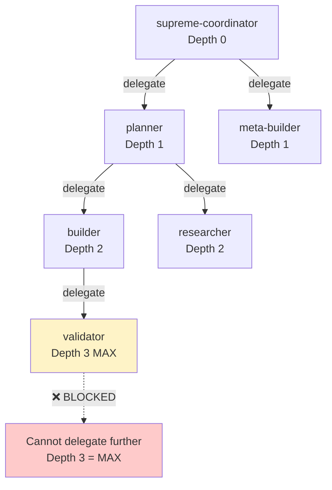
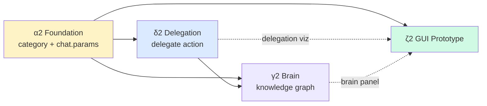

# Phase 1b Master Plan n3 — Deep Verification, Hierarchy Redesign & GUI Prototype

**Status:** DRAFT — Pending review  
**Date:** 2026-02-07 (n3 — supersedes n2's execution plan, preserves entity model)  
**Prerequisite:** Phase 0 ✅ + n2 β-execution ✅ (idumb_scan, idumb_codemap, 3 schemas)  
**Build Order:** Fix foundation gaps → Hierarchy redesign → GUI skeleton → Wire hooks  

---

## I. Architecture Verification Audit — What Actually Works Right Now

> [!CAUTION]
> n2 was executed partially. This section documents what EXISTS vs what was PLANNED but doesn't work.

### ✅ What Works

| Component | Status | Evidence |
|-----------|--------|----------|
| `idumb_task` — 12 actions + absorbed status | ✅ Working | 54 tests pass, `action=status` shows full governance view |
| `idumb_anchor` — add/list | ✅ Working | 16 tests (compaction), anchor scoring + staleness |
| `idumb_scan` — 5 scan actions | ✅ Built, untested live | 0 type errors, persists to `project-map.json` |
| `idumb_codemap` — 5 code analysis actions | ✅ Built, untested live | 0 type errors, persists to `codemap.json` |
| Entity schemas: `brain.ts`, `project-map.ts`, `codemap.ts` | ✅ Created | Barrel-exported, typecheck clean |
| Tool-gate: blocks `write`/`edit` without active task | ✅ Working | 16 tests, auto-inherit from store |
| Compaction hook: anchor injection | ✅ Unit-tested | Not live-verified (experimental hook) |
| Message-transform: DCP pruning | ✅ Unit-tested | Not live-verified (experimental hook) |
| `idumb_init`: scan + scaffold + greeting | ✅ Working | 60 tests |
| Persistence: StateManager + disk I/O | ✅ Working | 45 tests, debounced save |

### ❌ What Doesn't Work / Doesn't Exist

| Gap | Impact | Where Plan Says It Should Be |
|-----|--------|------------------------------|
| **Tasks REQUIRE epicId** — no standalone tasks | 🔴 CRITICAL — can't delegate without epic, can't do ad-hoc work | `task.ts:91` — `createTask(epicId, name)` has mandatory `epicId` |
| **No `delegate` action** on `idumb_task` | 🔴 CRITICAL — delegation planned in n1/n2 but never implemented | n1 δ-4, n2 §II |
| **No `chat.params` hook** registered | 🔴 HIGH — agent identity unknown, can't auto-assign | n1 α-1, index.ts has no `chat.params` handler |
| **No `idumb_brain` tool** | 🟡 MEDIUM — knowledge graph schema exists but no tool | n2 §II Tool 3 — planned, slot taken by `idumb_init` |
| **AGENTS.md stale** | 🟡 MEDIUM — still lists `status.ts` (removed), missing scan/codemap | AGENTS.md line 62 |
| **No auto-triggers** on hooks | 🟡 MEDIUM — scan on session start, codemap on writes — not wired | n2 §III, β-3/β-4 |
| **No `PlanningArtifact` schema** | 🟡 MEDIUM — planned in n2 §I Group 4, not created | n2 ε-1 |
| **No `SessionRecord` schema** | 🟡 LOW — trajectory tracking, later phase | n2 ε-3 |
| **No GUI** | 🟡 PLANNED | n2 Phase ζ (stretch) |

### ⚠️ The Epic Problem (User's Key Insight)

The user correctly identified that epics are too rigid:

```
Current: Epic("Build Auth") → Task("Login form") → Subtask("Add validation")
         ↑ ONLY development-style work

Needed:  WorkStream("Research Phase") → Task("Vector DB evaluation") → Subtask("Compare Pinecone vs Weaviate")
         WorkStream("Spec-Kit Dev") → Task("Define API contract") → Subtask("Write OpenAPI schema")
         WorkStream("Maintenance") → Task("Fix stale references") → Subtask("Update AGENTS.md")
         WorkStream("Ad-hoc") → Task("Quick fix CSS") → NO subtask needed
```

**Root cause:** `EpicStatus` only has `planned|active|completed|deferred|abandoned`. There's no **category** or **type** field. Every "epic" is treated identically regardless of whether it's research, development, governance, or maintenance.

---

## II. Full Entity-Relationship Map — How Everything Connects

> [!IMPORTANT]
> This is the visualization the user requested. Every arrow = data dependency or reference relationship.

### A. Schema → Tool → Hook → Agent Relationships

```mermaid
graph TB
    subgraph "SCHEMAS (src/schemas/)"
        TS[task.ts<br/>Epic→Task→Subtask]
        AS[anchor.ts<br/>Anchor scoring]
        CS[config.ts<br/>IdumbConfig]
        BS[brain.ts<br/>BrainEntry + Store]
        PM[project-map.ts<br/>ProjectMap + drift]
        CM[codemap.ts<br/>CodeMapStore + FileMap]
    end
    
    subgraph "TOOLS (src/tools/)"
        TT[idumb_task<br/>12 actions]
        AT[idumb_anchor<br/>add/list]
        IT[idumb_init<br/>scan/scaffold/greeting]
        ST[idumb_scan<br/>5 actions]
        CT[idumb_codemap<br/>5 actions]
    end
    
    subgraph "HOOKS (src/hooks/)"
        TG[tool-gate.ts<br/>blocks write/edit]
        CO[compaction.ts<br/>anchor injection]
        SY[system.ts<br/>governance reminder]
        MT[message-transform.ts<br/>DCP pruning]
    end
    
    subgraph "PERSISTENCE (.idumb/brain/)"
        PH[hook-state.json]
        PT[tasks.json]
        PPM[project-map.json]
        PCM[codemap.json]
    end
    
    subgraph "AGENTS (deployed via templates.ts)"
        MB[idumb-meta-builder<br/>3-phase orchestrator]
        SC[supreme-coordinator]
        BU[builder]
        VA[validator]
        SK[skills-creator]
    end

    %% Schema → Tool
    TS --> TT
    AS --> AT
    CS --> IT
    PM --> ST
    CM --> CT
    BS -.->|NOT CONNECTED<br/>no brain tool| TT

    %% Tool → Persistence
    TT --> PT
    ST --> PPM
    CT --> PCM
    
    %% Hook → Schema
    TG -->|reads TaskStore| TS
    CO -->|reads Anchors| AS
    SY -->|reads Config| CS
    MT -->|EXEMPT_TOOLS list| TT
    MT -->|EXEMPT_TOOLS list| AT
    MT -->|EXEMPT_TOOLS list| ST
    MT -->|EXEMPT_TOOLS list| CT
    
    %% Hook → Persistence
    TG --> PH
    CO --> PH
    
    %% Agent → Tool (permissions)
    MB -->|all tools| TT
    MB -->|all tools| IT
    SC -.->|planned| TT
    BU -.->|planned| TT
    VA -.->|planned read-only| TT
    
    style BS stroke-dasharray:5 5,stroke:#f59e0b
    style SC stroke-dasharray:5 5
    style BU stroke-dasharray:5 5
    style VA stroke-dasharray:5 5
    style SK stroke-dasharray:5 5
```



### B. What's MISSING From the Graph (Dotted Lines)

| Missing Connection | Required For | Priority |
|-------------------|-------------|----------|
| `brain.ts` → `idumb_brain` tool | Knowledge graph queries/writes | Phase γ (next) |
| `chat.params` hook → `SessionState.capturedAgent` | Agent identity for auto-assign | Phase α (prerequisite) |
| `event` hook → `idumb_scan(incremental)` | Auto-scan on session start | Phase β-3 |
| `tool.execute.after` → `idumb_codemap(scan)` | Auto-update code map on writes | Phase β-4 |
| Agent profiles → tool visibility matrix | Per-agent permissions | Phase δ |
| Task → Delegation chain | Cross-agent task handoff | Phase δ |
| PlanningArtifact schema → brain entries | Planning lifecycle management | Phase ε |

---

## III. Hierarchy Redesign — Epic → WorkStream

> [!WARNING]
> This is a BREAKING CHANGE to the task schema. Existing `tasks.json` files will need migration.

### Current vs Proposed

```diff
 export interface TaskEpic {
     id: string
     name: string
     status: EpicStatus
+    category: WorkStreamCategory        // NEW: what kind of work
+    governanceLevel: GovernanceLevel     // NEW: how strict
+    requiredArtifacts: ArtifactType[]    // NEW: what must exist before completion
+    permissions: ToolPermissionSet       // NEW: which tools/actions allowed
     createdAt: number
     modifiedAt: number
     tasks: Task[]
 }

+export type WorkStreamCategory = 
+  | "development"    // feature/bugfix — needs impl plan, tests, code review
+  | "research"       // investigation — needs research doc, synthesis, evidence
+  | "governance"     // framework/rules — needs spec, validation, deployment
+  | "maintenance"    // cleanup/refactor — needs before/after evidence
+  | "spec-kit"       // specification work — needs API contract, schema defs
+  | "ad-hoc"         // quick fix — minimal governance, just evidence

+export type GovernanceLevel = "strict" | "balanced" | "minimal"
```

### Category → Rules Matrix

| Category | Required Artifacts | Evidence Level | Delegation Allowed | Can Skip Subtasks |
|----------|-------------------|----------------|-------------------|-------------------|
| `development` | implementation_plan + tests | High: file paths + test results + git hash | Yes, to builder/validator | No |
| `research` | research_doc + synthesis | Medium: sources + key findings | Yes, to research-synthesizer | Yes |
| `governance` | spec + validation_report | High: validation evidence | Yes, to validator only | No |
| `maintenance` | before/after evidence | Low: description + files changed | No (self-contained) | Yes |
| `spec-kit` | api_contract + schema_defs | Medium: schema + examples | Yes, to builder | No |
| `ad-hoc` | any description | Minimal | No | Yes (no subtasks needed) |

### Category → Agent Permission Matrix

| Category | coordinator | builder | validator | researcher | meta-builder |
|----------|------------|---------|-----------|------------|-------------|
| `development` | ✅ create/delegate | ✅ start/complete | ✅ validate | ❌ | ❌ |
| `research` | ✅ create/delegate | ❌ | ❌ | ✅ all | ❌ |
| `governance` | ✅ create/delegate | ❌ | ✅ validate | ❌ | ✅ all |
| `maintenance` | ✅ create | ✅ start/complete | ❌ | ❌ | ❌ |
| `spec-kit` | ✅ create/delegate | ✅ start/complete | ✅ validate | ❌ | ❌ |
| `ad-hoc` | ✅ all | ✅ all | ❌ | ❌ | ❌ |

---

## IV. Delegation Architecture — Who Can Delegate What to Whom

> [!IMPORTANT]
> Delegation is NOT just "assign task to agent." It's a schema-regulated handoff with:
> - Context transfer (what the delegate needs to know)
> - Evidence requirements (what must be returned)
> - Permission boundaries (what tools the delegate can use)
> - Chain tracking (who delegated to whom, depth limit)

### Delegation Schema

```typescript
interface DelegationRecord {
  id: string
  fromAgent: string           // chat.params captured name
  toAgent: string             // target agent
  
  // What
  taskId: string              // which task is being delegated  
  context: string             // what the delegate needs to know
  expectedOutput: string      // what must be returned
  
  // Permissions (scoped to this delegation)
  allowedTools: string[]      // subset of tools
  allowedActions: string[]    // subset of actions within tools
  maxDepth: number            // remaining delegation depth (starts at 3)
  
  // Lifecycle
  status: "pending" | "accepted" | "completed" | "rejected" | "expired"
  createdAt: number
  completedAt?: number
  expiresAt: number           // auto-expire stale delegations
  
  // Result (filled by delegate)
  result?: {
    evidence: string
    filesModified: string[]
    testsRun: string
    brainEntriesCreated: string[]
  }
}
```

### Delegation Chain Rules



**Rules:**
1. Max depth = 3 (coordinator → planner → builder → validator STOP)
2. Cannot delegate UP (builder cannot delegate to coordinator)
3. Cannot delegate to SELF
4. Cross-category delegation requires coordinator approval
5. Delegation expires after 30 min if not accepted (prevents zombie tasks)

---

## V. Plugin Architecture — SDK Constraints & Multi-Plugin

### OpenCode Plugin SDK Facts (Verified)

| Question | Answer | Evidence |
|----------|--------|----------|
| Can a plugin load tools? | Yes — `tool: Record<string, ToolDef>` in plugin return | SDK type `Plugin.tool` |
| Is tool count limited to 5? | **Documented convention, not hard SDK limit** | No `MAX_TOOLS` constant in SDK source |
| Can we register multiple plugins? | Yes — `opencode.json` `plugin: string[]` | deploy.ts reads/writes this array |
| Do hooks from multiple plugins compose? | Unknown — likely runs in order | Needs live verification |
| Can plugins share state? | No — each plugin gets its own scope | State via disk files only |
| Do subagent tool calls fire hooks? | **NO** (PP-01) | Known platform constraint |

### Plugin Architecture Decision

```
CURRENT: 1 plugin (idumb-v2) → 5 tools + 5 hooks
         All tools visible to all agents (controlled by .md frontmatter)

OPTION A (Recommended): 1 plugin, 5 tools with nested actions
  Pros: Simple, single state, single hook pipeline
  Cons: 5-tool ceiling

OPTION B: 2 plugins (idumb-governance + idumb-intelligence)
  Pros: Separate concerns, >5 tools total
  Cons: No shared state, hook ordering unknown, complexity
  
DECISION: Stay with Option A. 5 tools × 5-12 actions each = 25-60 capabilities.
          Revisit only if we hit a genuine ceiling.
```

---

## VI. GUI Skeleton — Interactive Dashboard Prototype

> [!TIP]
> The GUI reads from `.idumb/brain/` JSON files. It does NOT modify them — it's read-only visualization with commenting only.

### Tech Stack

| Layer | Technology | Why |
|-------|-----------|-----|
| Framework | Vite + React 19 | Fast dev, HMR, TypeScript native |
| UI | Shadcn/ui + Tailwind CSS v4 | User requirement, premium components |
| State | File-system watching + React Query | Read JSON, auto-refresh on change |
| Charts | Recharts or D3 for dependency graphs | Relationship visualization |
| Layout | Dashboard layout with collapsible panels | Multi-panel simultaneous view |

### Dashboard Panels

```
┌─────────────────────────────────────────────────────────────────┐
│ iDumb Dashboard                                    [Settings ⚙] │
├──────────────────┬──────────────────┬───────────────────────────┤
│ TASK HIERARCHY   │ CODE MAP         │ BRAIN/KNOWLEDGE           │
│                  │                  │                           │
│ ▼ Epic: Build    │ src/             │ [arch] Auth uses JWT ✅   │
│   ▼ Task: Login  │  ├── hooks/      │ [decision] PostgreSQL 🟡 │
│     ☑ Add form   │  │   ├ tool-gate │ [pattern] Hook factory ✅│
│     ☐ Add valid. │  │   └ system    │ [gotcha] PP-01 subagent ⚠│
│     ☐ Write test │  ├── schemas/    │                           │
│   ○ Task: Signup │  └── tools/      │ Confidence: ████░░ 67%   │
│                  │                  │ Stale: 2 entries          │
├──────────────────┴──────────────────┴───────────────────────────┤
│ DEPENDENCY GRAPH                    │ DRIFT / SCAN              │
│                                     │                           │
│  task.ts ←── tool-gate.ts           │ + 3 new files             │
│     ↑                               │ - 1 deleted               │
│  brain.ts ←── (not connected)       │ ~ 5 modified              │
│                                     │ Last scan: 2min ago       │
├─────────────────────────────────────┴───────────────────────────┤
│ PLANNING ARTIFACTS (lifecycle)       DELEGATION CHAIN            │
│                                                                  │
│ ● impl_plan-n3.md [ACTIVE]         coordinator ──→ builder      │
│ ○ impl_plan-n2.md [SUPERSEDED]       └──→ validator [PENDING]   │
│ ✗ impl_plan-n1.md [ABANDONED]                                    │
└──────────────────────────────────────────────────────────────────┘
```

### GUI Implementation Plan

| # | Task | Dependencies |
|---|------|-------------|
| GUI-1 | Create `packages/dashboard/` with Vite + React + Shadcn + Tailwind | None |
| GUI-2 | File watcher service — reads `.idumb/brain/*.json` | Schemas (brain, project-map, codemap, tasks) |
| GUI-3 | Task Hierarchy Panel — tree view with status indicators | GUI-1, `tasks.json` |
| GUI-4 | Code Map Panel — file tree with comment counts | GUI-1, `codemap.json` |
| GUI-5 | Brain Panel — knowledge entries with confidence bars | GUI-1, `brain.ts` schema + brain JSON |
| GUI-6 | Dependency Graph Panel — D3/Recharts force graph | GUI-4, codemap data |
| GUI-7 | Drift Panel — scan results with diff indicators | GUI-1, `project-map.json` |
| GUI-8 | Planning Artifacts Panel — lifecycle timeline | GUI-1, PlanningArtifact schema (needs creation) |
| GUI-9 | Delegation Chain Panel — agent flow visualization | GUI-1, DelegationRecord schema (needs creation) |
| GUI-10 | Export/comment system — user annotations on artifacts | GUI-8 |

---

## VII. Revised Phase Plan — What To Build Next

> [!IMPORTANT]
> **Build order changed.** User wants hierarchy fix BEFORE more tools. GUI can start in parallel.

### Phase 1b-α2: Foundation Fixes (1 session)

**Goal:** Fix what's broken before building more.

| # | Task | Why | Files |
|---|------|-----|-------|
| α2-1 | Register `chat.params` hook → capture agent name | Can't do delegation without agent identity | [index.ts](file:///Users/apple/Documents/coding-projects/idumb/v2/src/index.ts), [persistence.ts](file:///Users/apple/Documents/coding-projects/idumb/v2/src/lib/persistence.ts) |
| α2-2 | Add `category: WorkStreamCategory` to TaskEpic | Fix epic rigidity (the core problem) | [task.ts](file:///Users/apple/Documents/coding-projects/idumb/v2/src/schemas/task.ts) |
| α2-3 | Add `governanceLevel` to TaskEpic | Different categories need different strictness | [task.ts](file:///Users/apple/Documents/coding-projects/idumb/v2/src/schemas/task.ts) |
| α2-4 | Update `createEpic()` to accept category + governance level | Factory must produce categorized epics | [task.ts](file:///Users/apple/Documents/coding-projects/idumb/v2/src/schemas/task.ts) |
| α2-5 | Update `idumb_task create_epic` to require `category` arg | Tool enforces category on creation | [task.ts](file:///Users/apple/Documents/coding-projects/idumb/v2/src/tools/task.ts) |
| α2-6 | Update AGENTS.md — remove stale `status.ts`, add scan/codemap | Ground truth maintenance | [AGENTS.md](file:///Users/apple/Documents/coding-projects/idumb/v2/AGENTS.md) |
| α2-7 | Migrate TaskStore version `1.0.0` → `2.0.0` with backward compat | Existing tasks.json must still load | [task.ts](file:///Users/apple/Documents/coding-projects/idumb/v2/src/schemas/task.ts) |

**Success:** Epics have categories, agent identity captured, AGENTS.md accurate.

---

### Phase 1b-δ2: Delegation Schema + Action (1-2 sessions)

**Goal:** Tasks can be delegated between agents with tracked handoff.

| # | Task | Why | Files |
|---|------|-----|-------|
| δ2-1 | Create `DelegationRecord` schema | Track who→whom→what→status | [NEW] `src/schemas/delegation.ts` |
| δ2-2 | Add `delegate` action to `idumb_task` | Agent calls `idumb_task action=delegate task_id=X to_agent=Y` | [task.ts](file:///Users/apple/Documents/coding-projects/idumb/v2/src/tools/task.ts) |
| δ2-3 | Persist delegations to `.idumb/brain/delegations/` | Survives session restarts (PP-01 workaround) | [NEW] `src/lib/delegation.ts` |
| δ2-4 | Add `delegatedTo` + `parentTaskId` to Task interface | Track delegation chain on tasks | [task.ts](file:///Users/apple/Documents/coding-projects/idumb/v2/src/schemas/task.ts) |
| δ2-5 | Max depth=3 enforcement | Prevent runaway delegation | [task.ts](file:///Users/apple/Documents/coding-projects/idumb/v2/src/tools/task.ts) |
| δ2-6 | Category-aware delegation rules | Research can't delegate to builder | `delegation.ts` + `task.ts` tool |

**Success:** Delegation round-trip works: create → delegate → complete → parent reads result.

---

### Phase 1b-γ2: Brain Tool (1-2 sessions)

**Goal:** Replace `idumb_init` slot with `idumb_brain` knowledge graph tool.

| # | Task | Why | Files |
|---|------|-----|-------|
| γ2-1 | Implement `idumb_brain` with 6 actions: query, write, link, stale, purge, tree | Knowledge graph | [NEW] `src/tools/brain.ts` |
| γ2-2 | Replace `idumb_init` in tool registry with `idumb_brain` | Free slot for brain | [index.ts](file:///Users/apple/Documents/coding-projects/idumb/v2/src/index.ts), [tools/index.ts](file:///Users/apple/Documents/coding-projects/idumb/v2/src/tools/index.ts) |
| γ2-3 | Move init's functionality to `event` hook + CLI only | Init doesn't need a tool slot | [event handler in index.ts] |
| γ2-4 | Wire compaction hook → inject top brain entries | Brain survives compaction | [compaction.ts](file:///Users/apple/Documents/coding-projects/idumb/v2/src/hooks/compaction.ts) |
| γ2-5 | Wire `tool.execute.after` → auto-extract learnings on task complete | Auto-populate brain | Tool-gate after hook |
| γ2-6 | Confidence decay: entries lose confidence over time | Prevent stale knowledge | `brain.ts` schema already has this |

**Success:** Brain queries work, entries survive compaction, auto-populated from task evidence.

---

### Phase 1b-ζ2: GUI Prototype (2-3 sessions, can parallelize)

**Goal:** Interactive dashboard reading from `.idumb/brain/` files.

| # | Task | Why |
|---|------|-----|
| ζ2-1 | Scaffold: `packages/dashboard/` with Vite + React + Shadcn + Tailwind | Base project |
| ζ2-2 | Task Hierarchy Panel — tree view with categories, status, assignee | Core visualization |
| ζ2-3 | Brain Panel — knowledge entries with confidence, relationships | Knowledge graph view |
| ζ2-4 | Scan/Drift Panel — project scan results, new/deleted/modified | Drift monitoring |
| ζ2-5 | Code Map Panel — file tree with function/class counts | Code structure view |
| ζ2-6 | Dependency Graph — D3 force-directed graph of imports | Relationship viz |

**Success:** Dashboard renders live data from `.idumb/brain/` JSON files.

---

## VIII. Real-Life Test Cases

### TC-n3-1: WorkStream Categories End-to-End

**When I use:**
1. `idumb_task action=create_epic name="Evaluate Vector DBs" category=research`
2. `idumb_task action=create_task name="Compare Pinecone vs Weaviate"`
3. `idumb_task action=start task_id=<task>`
4. Try to delegate to `builder`

**I expect:**
1. Epic created with `category: "research"`
2. Task created under research epic
3. Delegation to `builder` → **BLOCKED**: "Research tasks cannot be delegated to builder. Use researcher or research-synthesizer."
4. Delegation to `researcher` → **ALLOWED**

**It proves:**
- Category-aware delegation rules work
- Research work has different governance than development
- The hierarchy is flexible, not just BMAD-style epics

### TC-n3-2: Delegation Chain with Depth Limit

**When I use:**
1. Coordinator creates epic + task, delegates to planner (depth 1)
2. Planner delegates to builder (depth 2)  
3. Builder delegates to validator (depth 3)
4. Validator tries to delegate further

**I expect:**
1-3. All succeed with chain tracked in `.idumb/brain/delegations/`
4. **BLOCKED**: "Max delegation depth (3) reached. Cannot delegate further."

**It proves:** Depth enforcement prevents runaway chains, delegation records persist to disk for PP-01 workaround.

### TC-n3-3: GUI Renders Live Data

**When I use:**
1. `npm run dev` in `packages/dashboard/`
2. Run `idumb_scan action=full` in a terminal
3. Create a task and start it
4. Watch the dashboard

**I expect:**
1. Dashboard loads with empty/skeleton panels
2. Scan panel populates with project structure + frameworks
3. Task panel shows the new task in the hierarchy
4. Both update within 2 seconds of file change

**It proves:** File-system watching works, JSON parsing is correct, panels render real data.

---

## IX. Dependencies Between Phases



**α2 is the gate.** Everything depends on category + agent identity.  
**ζ2 can start in parallel** with α2 (scaffold + basic panels use existing JSON files).

---

## Verification Plan

### Automated Tests
- `npm run typecheck` → 0 errors after each phase
- `npm test` → 204+ tests (no regressions + new tests)
- New test suites: delegation, category rules, brain CRUD

### Live Verification
- Deploy plugin → verify `chat.params` captures agent name
- Create research epic → verify different rules apply
- Delegate task → verify disk record created + result read
- Run GUI → verify live updates from file changes

### Manual Verification
- Create tasks across all 6 categories → verify different governance
- Attempt invalid delegations → verify blocks with helpful messages
- Trigger compaction → verify brain entries survive
