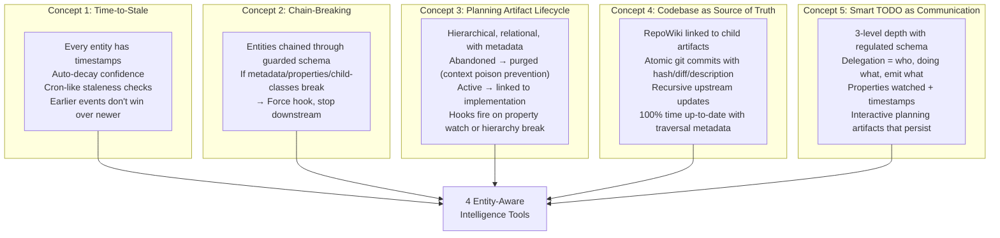
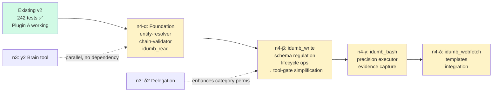

# Phase 1b Master Plan n4 — Entity-Driven Intelligence Tools

**Status:** COMPLETE — n4-αβγδ ALL IMPLEMENTED ✅  
**Date:** 2026-02-07 (n4 — rewrite with corrected intelligence-first framing)  
**Updated:** 2026-02-07 (all 4 tools implemented, 0 TypeScript errors, 242/242 tests)  
**Prerequisite:** Phase α2 ✅ (WorkStream categories, chat.params, 242 tests)  
**SOT:** User's simplified hypothesis theory (entity hierarchy, chain-breaking, intelligence loops)  
**Core Principle:** These tools don't read files or write files. They **traverse entities**, **regulate schemas**, **execute precision validation**, and **ingest research intelligence**.

---

## I. The Intelligence Theory — Restated As Tool Requirements

> [!IMPORTANT]
> **Intelligence = awareness for context purification and selective anchor points — traversing horizontally and vertically across upstream and downstream of multiple related entities.**
>
> The agents in this framework do NOT write application code. They write **schema**, **data relationships**, **context janitor operations**, **governance regulation**, and **delegation orchestration**. Every tool must serve this mission.

### What the Agents Actually Do

| Agent Role | NOT This | THIS |
|-----------|----------|------|
| Coordinator | "Write me a login form" | "Check TODO hierarchy → validate research resolved → delegate implementation plan to builder → watch for chain-break on acceptance criteria" |
| Builder | "fs.writeFile(code)" | "Write implementation plan section → validate schema (linked research? acceptance criteria?) → atomic git commit tied to subtask ID → trigger upstream epic counter update" |
| Validator | "Run tests" | "Traverse implementation plan → follow chain to research artifact → verify non-stale → run precision validation commands → emit evidence into planning artifact lifecycle" |
| Researcher | "Fetch a URL" | "Ingest research context → synthesize into brain entry with relational links → validate that downstream plans can reference resolved findings → mark research artifact as resolved" |

### The 5 Intelligence Concepts → Tool Requirements



---

## II. Architecture: One Install, Two Plugin Registrations

```
npm install idumb-v2          ← ONE package
npx idumb-v2 init             ← ONE command

opencode.json (auto-generated):
{
  "plugin": [
    "idumb-v2",                       // Plugin A: governance + intelligence
    "idumb-v2/tools-plugin"              // Plugin B: entity-aware operations
  ]
}
```

### Why Two Registrations From One Package

| | Plugin A (existing `idumb-v2`) | Plugin B (new `tools.js` entry) |
|---|---|---|
| **Purpose** | Entity CRUD + intelligence gathering | Entity-aware operations (traverse, regulate, validate, ingest) |
| **Tools** | `idumb_task`, `idumb_anchor`, `idumb_scan`, `idumb_codemap`, `idumb_brain` | `idumb_read`, `idumb_write`, `idumb_bash`, `idumb_webfetch` |
| **Hooks** | All hooks (tool-gate, compaction, system, message-transform, chat.params) | None — operations are self-governed by entity state |
| **State** | `.idumb/brain/` (tasks, anchors, brain, project-map, codemap) | Reads Plugin A's disk state; writes to `.idumb/brain/audit/`, `.idumb/backups/`, `.idumb/brain/web-cache/` |

**Single package. Single install. Single `deploy.ts`. Two plugin entry points in `opencode.json`.**

```
packages/idumb-v2/
├── src/
│   ├── index.ts              ← Plugin A entry (existing)
│   ├── tools-plugin.ts       ← Plugin B entry (NEW — registers 4 tools, 0 hooks)
│   ├── tools/
│   │   ├── task.ts           ← Plugin A tools (existing)
│   │   ├── anchor.ts
│   │   ├── scan.ts
│   │   ├── codemap.ts
│   │   ├── init.ts           ← → becomes brain.ts (n3 plan)
│   │   ├── read.ts           ← NEW: Entity-Aware Traversal Engine
│   │   ├── write.ts          ← NEW: Schema-Regulated Artifact Writer
│   │   ├── bash.ts           ← NEW: Precision Executor
│   │   └── webfetch.ts       ← NEW: Research Intelligence Ingestion
│   ├── lib/
│   │   ├── entity-resolver.ts  ← NEW: resolves file path → entity type + hierarchy position
│   │   ├── chain-validator.ts  ← NEW: validates entity chains aren't broken
│   │   ├── state-reader.ts     ← NEW: reads Plugin A's governance state from disk
│   │   └── ...existing
```

---

## III. The Entity Resolver — The Brain of Every Tool

> [!IMPORTANT]
> Every tool in Plugin B needs to answer: **"What IS this path in the entity hierarchy?"** This is the entity resolver — it maps a file path to its entity type, parent chain, and governance rules.

```typescript
// ─── Entity Resolution ─────────────────────────────────────────
interface ResolvedEntity {
  path: string
  
  // What IS this?
  entityType: 
    | 'planning-artifact'     // implementation plans, research docs, specs
    | 'agent-profile'         // .opencode/agents/*.md
    | 'governance-config'     // .idumb/config.json, .idumb/brain/*.json
    | 'schema'                // src/schemas/*.ts
    | 'source-code'           // src/**/*.ts (NOT written by our agents directly)
    | 'brain-entry'           // .idumb/brain/knowledge/*.json
    | 'task-store'            // .idumb/brain/tasks.json
    | 'project-map'           // .idumb/brain/project-map.json
    | 'codemap'               // .idumb/brain/codemap.json
    | 'template'              // .idumb/idumb-modules/**
    | 'unknown'               // unclassified (external files)
  
  // Where is it in the hierarchy?
  hierarchy: {
    parent?: string           // parent entity path/ID
    children: string[]        // child entity paths/IDs
    relatedTo: string[]       // cross-references (horizontal links)
    depth: number             // 0 = root, 1 = epic-level, 2 = task-level, 3 = subtask-level
  }
  
  // What are its properties?
  properties: {
    createdAt?: number
    modifiedAt?: number
    staleAfter?: number       // TTL in ms — time-to-stale
    isStale: boolean          // computed: modifiedAt + staleAfter < now
    confidence?: number       // 0-100 for brain entries
    status?: string           // lifecycle status (active, superseded, abandoned, resolved)
    chainIntegrity: 'intact' | 'broken' | 'unknown'  // is the parent-child chain valid?
  }
  
  // What governance rules apply?
  governance: {
    requiredSchema?: string   // zod schema name that validates this entity
    canWrite: string[]        // which agent roles can write this
    canRead: string[]         // which agent roles can read (usually all)
    requiresActiveTask: boolean
    requiresChainIntegrity: boolean  // must parent chain be intact to modify?
    triggersUpstreamUpdate: boolean  // does modifying this require upstream refresh?
  }
}
```

### Entity Resolution Examples

```
resolveEntity(".idumb/brain/tasks.json")
  → entityType: 'task-store'
  → hierarchy: { depth: 0, children: [epic IDs] }
  → governance: { canWrite: ['coordinator', 'meta-builder'], requiresActiveTask: false }

resolveEntity("planning/implementation_plan-n4.md")
  → entityType: 'planning-artifact'
  → hierarchy: { parent: 'epic-ID-xyz', relatedTo: ['research-artifact-abc'], depth: 2 }
  → properties: { status: 'active', isStale: false, chainIntegrity: 'intact' }
  → governance: { requiresChainIntegrity: true, triggersUpstreamUpdate: true }

resolveEntity(".opencode/agents/idumb-builder.md")
  → entityType: 'agent-profile'
  → governance: { requiredSchema: 'AgentProfileSchema', canWrite: ['meta-builder'] }
  → properties: { chainIntegrity: 'intact' }  // frontmatter must validate

resolveEntity("src/hooks/tool-gate.ts")
  → entityType: 'source-code'
  → governance: { canWrite: ['builder'], requiresActiveTask: true }
  → hierarchy: { relatedTo: ['codemap-entry-tool-gate'] }
```

---

## IV. Tool B1: `idumb_read` — Entity-Aware Traversal Engine

### What It Is

NOT a file reader. An **entity traversal engine** that:
- **Resolves** what the path IS in the entity hierarchy (planning artifact? schema? brain entry?)
- **Annotates** every read with entity metadata (stale? chain-broken? has unresolved dependencies?)
- **Traverses** — follows `relatedTo`, `parentId`, `childIds` links to provide contextual intelligence
- **Extracts** intelligence passively (comments, TODOs, stale references, broken chains)
- **Enforces** scope — agents can only read what their role permits

### Schema

```typescript
interface IdumbReadArgs {
  path: string              // file path relative to project root
  
  // Intelligence Modes
  mode?: 
    | 'content'             // default: read file + entity metadata annotation
    | 'outline'             // return structure (functions, classes, sections) + entity context
    | 'traverse'            // follow entity chain: read this → parent → related → children
    | 'comments'            // extract comments + TODOs + FIXMEs with entity context
    | 'chain-check'         // DON'T read content — just validate chain integrity
  
  // Traversal Controls (for mode=traverse)
  direction?: 'up' | 'down' | 'horizontal' | 'all'  // which links to follow
  depth?: number            // how many hops (default: 1, max: 3)
  
  // Pagination
  offset?: number           // line offset (default: 0)
  limit?: number            // max lines (default: 200)
}
```

### How Each Mode Serves the Intelligence Theory

#### `mode=content` — Every Read is Entity-Aware

```
idumb_read path="planning/implementation_plan-n3.md"

Output:
─── Entity: planning-artifact ──────────────────────────────────
│ Status: active
│ Parent: epic "Phase 1b" (id: epic-001)
│ Related: [research/v1-gap-analysis.md (STALE ⚠️), walkthrough-n3.md]
│ Chain: ✅ intact (parent → this → 4 child tasks)
│ Time-to-stale: 12h remaining (modified 36h ago, TTL 48h)
│ Required schema: PlanningArtifactSchema ✅ valid
────────────────────────────────────────────────────────────────

File: planning/implementation_plan-n3.md (554 lines)
Showing lines 1-200 of 554

[content with line numbers...]

─── Intelligence Extracted ─────────────────────────────────────
│ ⚠️ Related artifact "v1-gap-analysis.md" is STALE (7 days)
│ ℹ️ 4 child tasks found, 2 completed, 1 active, 1 planned
│ ℹ️ Upstream epic "Phase 1b" has 3 categories: governance, development, research
```

> **Why this is different from innate `read`:** Innate read returns raw text. The agent has ZERO context about what it just read — is it stale? Is its parent chain broken? Are related artifacts resolved? Our agents need this context to make governance decisions, not just see bytes.

#### `mode=traverse` — Hop-Reading Across Entity Chains

```
idumb_read path="planning/implementation_plan-n3.md" mode="traverse" direction="up" depth=2

Output:
─── Traversal: implementation_plan-n3.md → UP (2 hops) ─────────

HOP 0 (origin): planning/implementation_plan-n3.md
  Type: planning-artifact | Status: active | Stale: no
  Sections: [Architecture Audit, Hierarchy Redesign, Delegation, GUI, Phases]
  Key metadata: { category: "development", governanceLevel: "strict" }

HOP 1 (parent): Epic "Phase 1b — Integration & Intelligence"  
  Type: task-epic | Category: development | Status: active
  Tasks: 7 total (3 completed, 2 active, 2 planned)
  ⚠️ Task "δ2 Delegation" depends on research artifact that is UNRESOLVED

HOP 2 (parent's parent): WorkStream "iDumb v2 Development"
  Type: workstream | GovernanceLevel: strict
  Epics: 3 (Phase 0 ✅, Phase 1a ✅, Phase 1b 🔄)
  
─── Chain Integrity ────────────────────────────────────────────
│ WorkStream → Epic → Plan: ✅ all links intact
│ Plan → Research artifacts: ⚠️ 1 of 3 research links STALE
│ Plan → Tasks: ✅ all 4 child tasks exist and linked
│ 
│ RECOMMENDATION: Resolve stale research artifact before 
│ proceeding with δ2 Delegation implementation.
```

> **This is the user's "hop reading traverse back."** The agent reads implementation_plan-n3, and in one tool call gets the full upstream chain with integrity check. No manual hopping between files. No losing context. No hallucinating about what the parent epic requires.

#### `mode=chain-check` — Non-Destructive Integrity Validation

```
idumb_read path="planning/implementation_plan-n3.md" mode="chain-check"

Output:
─── Chain Integrity Report ─────────────────────────────────────

Entity: planning/implementation_plan-n3.md (planning-artifact)

UPSTREAM CHAIN:
  ✅ → Epic "Phase 1b" (exists, active, non-stale)
  ✅ → WorkStream "iDumb v2" (exists, active)

DOWNSTREAM CHAIN:
  ✅ → Task α2-1 "Register chat.params" (completed ✅, has evidence)
  ✅ → Task α2-2 "Add WorkStream category" (completed ✅, has evidence)
  ⚠️ → Task δ2-1 "Create DelegationRecord" (planned, BLOCKED: missing prerequisite)
  ✅ → Task γ2-1 "Implement idumb_brain" (planned, prerequisites met)

HORIZONTAL LINKS:
  ✅ → research/v1-gap-analysis.md (resolved ✅)
  ⚠️ → walkthrough-n3.md (STALE: last modified 3 days ago, plan modified since)
  ❌ → research/vector-db-evaluation.md (NOT FOUND — broken link!)

CHAIN VERDICT: ⚠️ PARTIAL BREAK
  - 1 broken horizontal link (vector-db-evaluation.md)
  - 1 stale horizontal link (walkthrough-n3.md)
  - 1 blocked downstream task (missing prerequisite)

HOOK TRIGGERED: chain_break_detected → recorded in governance state
```

> **This is the user's "chain-breaking" concept converted to a tool action.** When the chain breaks, the tool:
> 1. Detects the break
> 2. Reports exactly WHERE
> 3. Fires a hook (records in governance state so system.transform can inject warning)
> 4. Doesn't block (it's a read) but INFORMS so downstream actions can be prevented

#### `mode=comments` — Intelligence Extraction from Code

For source-code entities, extracts the comments that reveal logic, inconsistencies, and TODOs:

```
idumb_read path="src/hooks/tool-gate.ts" mode="comments"

Output:
─── Entity: source-code ────────────────────────────────────────
│ CodeMap entry: exists (last scanned: 2h ago)
│ Dependencies: ../schemas/task, ../lib/persistence
│ Dependents: ../index.ts
────────────────────────────────────────────────────────────────

Comments extracted from tool-gate.ts:

[JSDoc] L1-9: "Smart governance-aware tool gate that intercepts 
              tool calls to enforce active-task requirement..."
[TODO] L89:  "Add agent-scoped gating — n3-2"
[FIXME] L134: "Auto-inherit loop may fire twice when task switches rapidly"
[Note] L69:  "Main entry: createToolGateBefore"
[Note] L140: "Defense-in-depth: createToolGateAfter"

─── Intelligence ───────────────────────────────────────────────
│ ⚠️ 1 FIXME flagged (auto-inherit loop) — potential bug
│ ℹ️ 1 TODO references n3-2 plan (agent-scoped gating)
│ ℹ️ Links to planning: implementation_plan-n3-2.md §Component 2
```

---

## V. Tool B2: `idumb_write` — Schema-Regulated Artifact Writer

### What It Is

NOT a file writer. A **schema-regulated artifact lifecycle manager** that:
- **Resolves** the entity type BEFORE writing (agent profile? planning artifact? governance config?)
- **Validates** against required schema (frontmatter for agents, JSON schema for brain entries, section structure for plans)
- **Enforces chain integrity** — cannot modify a child if the parent chain is broken
- **Auto-updates upstream** — modifying a planning artifact triggers its parent epic to re-evaluate completion
- **Creates evidence** — every write linked to active task, agent identity, atomic git commit
- **Manages lifecycle** — writing `status: abandoned` on a planning artifact triggers purge from AI-visible context
- **Prevents context poisoning** — abandoned artifacts are marked, stale artifacts are warned, superseded artifacts are linked

### Schema

```typescript
interface IdumbWriteArgs {
  path: string              // file path relative to project root
  content: string           // content to write
  
  // Write Modes
  mode?: 
    | 'create'              // fail if exists (default)
    | 'overwrite'           // replace entirely (creates backup, validates chain)
    | 'append'              // append to end
    | 'update-section'      // update a specific section in a markdown artifact (by heading)
  
  // Section Mode (for mode=update-section)
  section?: string          // heading to find and update (e.g., "## Verification Plan")
  
  // Lifecycle Operations
  lifecycle?:
    | 'activate'            // set entity status → active (creates upstream links)
    | 'supersede'           // set → superseded, link to replacement (auto-purge from context)
    | 'abandon'             // set → abandoned (purge from AI-visible, prevent context poisoning)
    | 'resolve'             // set → resolved (for research artifacts: downstream can now reference)
  
  // Controls
  backup?: boolean          // create backup before overwrite (default: true)
  validate?: boolean        // validate against entity schema (default: true)
  commit?: boolean          // atomic git commit tied to active subtask (default: false)
  commit_message?: string   // commit message (auto-generated if not provided)
}
```

### The Governance Flow — Embedded, Not Hooked

```
Agent calls: idumb_write path="planning/impl-plan-n4.md" content="..." mode="overwrite"

Step 1: RESOLVE ENTITY
  → entityType: 'planning-artifact'
  → governance: { canWrite: ['coordinator', 'builder'], requiresActiveTask: true,
                   requiresChainIntegrity: true, triggersUpstreamUpdate: true }

Step 2: CHECK AGENT IDENTITY (from context.agent via chat.params)
  → agent: 'idumb-builder' → role in canWrite? ✅ YES

Step 3: CHECK ACTIVE TASK (read TaskStore from disk)
  → activeTask: { id: 'task-β-1', name: 'Implement idumb_read', epicId: 'epic-001' }
  → ✅ Has active task

Step 4: CHECK CHAIN INTEGRITY (traverse parent chain)
  → parent epic 'epic-001': exists, active, non-stale ✅
  → related research artifacts: all resolved ✅
  → ✅ Chain intact

Step 5: VALIDATE SCHEMA
  → PlanningArtifactSchema: requires { title, status, sections[], linkedResearch[] }
  → Parse content for required fields
  → ✅ Schema valid

Step 6: BACKUP (if mode=overwrite)
  → Copy existing to .idumb/backups/2026-02-07T11-44/planning/impl-plan-n4.md

Step 7: WRITE FILE
  → fs.writeFileSync(resolvedPath, validatedContent)

Step 8: TRIGGER UPSTREAM UPDATES
  → Epic 'epic-001': re-calculate sections completed (was 3/7, now 4/7)
  → Brain: create/update entry "impl-plan-n4 Section X updated by builder"

Step 9: CREATE EVIDENCE
  → Log to SessionRecord: { agent, task, path, contentHash, timestamp }
  → If commit=true: git add + git commit -m "[task-β-1] Update impl-plan-n4: Section X"

Step 10: RETURN
  → "✅ Written: planning/impl-plan-n4.md (planning-artifact)
     Schema: valid | Chain: intact | Backup: created
     Upstream: epic-001 sections 4/7 → 5/7
     Evidence: logged to session audit"
```

### Lifecycle Operations — Context Poisoning Prevention

The user's critical insight: *"Planning artifacts if not regulated well will be read as context poisoning."*

```
# Abandoning a stale plan (prevents context poisoning)
idumb_write path="planning/impl-plan-n2.md" lifecycle="abandon"

Output:
→ Status: active → abandoned
→ Purge: removed from AI-visible paths (moved to .idumb/archive/)
→ Chain update: parent epic's child list updated (removed n2, replaced by n3)
→ Brain: entry "impl-plan-n2 abandoned, superseded by n3" created
→ ⚠️ 2 tasks still reference n2 → re-linked to n3

# Resolving a research artifact (unlocks downstream implementation)
idumb_write path="research/vector-db-evaluation.md" lifecycle="resolve"

Output:
→ Status: in-progress → resolved
→ Downstream: 3 planning artifacts can now reference these findings
→ Chain update: implementation_plan-n4.md chain integrity: broken → intact
→ Brain: entry "Vector DB evaluation resolved: Pinecone selected" with evidence links
```

### `mode=update-section` — Surgical Artifact Updates

For planning artifacts that are long markdown documents, agents update specific sections without rewriting the entire file:

```
idumb_write path="planning/impl-plan-n4.md" mode="update-section" section="## VIII. Implementation Phases"
content="[updated phase content]"

Output:
→ Found section "## VIII. Implementation Phases" at lines 280-350
→ Replaced section content (70 lines → 85 lines)
→ Other sections: untouched
→ Schema: re-validated full document ✅
→ Upstream: epic sections counter unchanged (section existed, just updated)
```

---

## VI. Tool B3: `idumb_bash` — Precision Executor for Schema Validation + Evidence

### What It Is

NOT a shell executor. A **precision validation and evidence engine** that:
- **Knows what each command IS** — test run? typecheck? git operation? drift check?
- **Role-scoped** — validators can only run validation commands, builders can run build + test
- **Evidence-linked** — every execution tied to active task as evidence
- **Blocks destructive** — `rm -rf`, `git push --force`, `git reset --hard` always blocked
- **Structured output** — exit code + stdout + stderr separated, not mixed stream
- **Auto-triggers** — after git commit → check for drift; after test run → update task evidence

### Schema

```typescript
interface IdumbBashArgs {
  command: string            // command to execute
  
  // Execution Modes
  purpose?: 
    | 'validation'           // npm test, tsc --noEmit, eslint → evidence for task
    | 'build'                // npm run build, tsc → artifact creation
    | 'git'                  // git add, commit, status, diff, log → source-of-truth operations
    | 'inspection'           // cat, head, wc, ls, find → read-only investigation
    | 'general'              // default: role-whitelist applies
  
  timeout?: number           // seconds (default: 30, max: 120)
  cwd?: string               // working directory (default: project root)
  evidence?: boolean         // attach result as evidence to active task (default: true for validation/build)
}
```

### Role × Purpose Matrix — Who Can Run What

```typescript
const ROLE_PERMISSIONS: Record<string, Set<string>> = {
  'idumb-validator': new Set(['validation', 'inspection']),
  'idumb-builder':   new Set(['validation', 'build', 'git', 'inspection']),
  'idumb-meta-builder': new Set(['validation', 'build', 'git', 'inspection', 'general']),
  'idumb-supreme-coordinator': new Set(['inspection']),  // coordinators DON'T execute
  'idumb-researcher': new Set(['inspection']),
}

// Within each purpose, command patterns:
const PURPOSE_PATTERNS: Record<string, RegExp[]> = {
  'validation': [/^npm test/, /^npx jest/, /^tsc --noEmit/, /^eslint/, /^npm run typecheck/],
  'build':      [/^npm run build/, /^tsc$/, /^npx/],
  'git':        [/^git (add|commit|status|diff|log|show|tag)/],
  'inspection': [/^cat /, /^head /, /^tail /, /^wc /, /^ls /, /^find /, /^grep /],
}

// ALWAYS blocked regardless of role:
const DESTRUCTIVE_BLACKLIST = [
  /rm\s+(-rf|-r)\s/,
  /git\s+push\s+--force/,
  /git\s+reset\s+--hard/,
  /npm\s+publish/,
  /chmod\s+777/,
  />\s*\/dev\//,
]
```

### Evidence Auto-Capture — Source of Truth Integration

```
idumb_bash command="npm test" purpose="validation"

Output:
─── Precision Executor ─────────────────────────────────────────
│ Agent: idumb-builder | Role check: ✅ (builder can run validation)
│ Purpose: validation | Pattern match: ✅ (npm test)
│ Destructive check: ✅ safe
────────────────────────────────────────────────────────────────

Command: npm test
Exit: 0 | Duration: 4.2s

Stdout:
  Results: 242/242 passed, 0 failed

Stderr: (empty)

─── Evidence Captured ──────────────────────────────────────────
│ Linked to task: β-1 "Implement idumb_read"
│ Evidence type: test-results
│ Hash: sha256:a3b8d1...
│ Stored: .idumb/brain/audit/2026-02-07/test-run-001.json
│ Task evidence updated: 2/3 required (needs: implementation_plan, tests ✅, git_commit)
```

### Atomic Git Commits — Codebase as Source of Truth

```
idumb_bash command="git add src/tools/read.ts && git commit -m '[task-β-1] Implement idumb_read entity traversal engine'" purpose="git"

Output:
─── Git Evidence ───────────────────────────────────────────────
│ Commit: abc1234
│ Files: src/tools/read.ts (+245 lines)
│ Linked to: task β-1, epic Phase-1b-n4
│ 
│ Upstream update triggered:
│   → Task β-1: evidence.git_commit = "abc1234"
│   → Epic: commits_count 12 → 13
│   → CodeMap: src/tools/read.ts re-scan queued
│   → ProjectMap: drift check queued (new file detected)
```

---

## VII. Tool B4: `idumb_webfetch` — Research Intelligence Ingestion

### What It Is

NOT a URL fetcher. A **research intelligence ingestion engine** that:
- **Classifies** fetched content (documentation? API reference? blog post? research paper?)
- **Links to planning chain** — every fetch tied to a research artifact or brain entry
- **Session cache** — same URL twice → returns cached version (prevents redundant fetching)
- **Enforces research lifecycle** — fetched content creates/updates brain entries with proper relational links
- **Prevents "build without research"** — downstream plans can check whether research artifacts have resolved web references

### Schema

```typescript
interface IdumbWebfetchArgs {
  url: string               // URL to fetch
  
  // Intelligence Modes
  purpose?:
    | 'research'            // default: fetch → create/update brain entry → link to task
    | 'reference'           // fetch API docs → structured extraction of endpoints/types
    | 'validation'          // fetch to verify a link still works (staleness check)
  
  // Controls
  format?: 'markdown' | 'text'  // output format (default: markdown)
  max_size?: number         // max response chars (default: 50000)
  force?: boolean           // bypass cache (default: false)
  
  // Research linking
  research_artifact?: string  // path to research artifact this feeds into
  brain_topic?: string        // brain entry topic this relates to
}
```

### Research Lifecycle Integration

```
idumb_webfetch url="https://docs.pinecone.io/guides/get-started" 
  purpose="research"
  research_artifact="research/vector-db-evaluation.md"
  brain_topic="vector-database-selection"

Output:
─── Research Ingestion ─────────────────────────────────────────
│ URL: https://docs.pinecone.io/guides/get-started
│ Content type: documentation (auto-classified)
│ Size: 12,400 chars (within limit)
│ Cache: stored → .idumb/brain/web-cache/pinecone-get-started.md
────────────────────────────────────────────────────────────────

[extracted markdown content...]

─── Intelligence Actions ───────────────────────────────────────
│ Brain entry created/updated: "vector-database-selection"
│   → evidence: ["https://docs.pinecone.io/guides/get-started"]
│   → confidence: 80 (fresh documentation)
│   → relatedTo: [research/vector-db-evaluation.md]
│
│ Research artifact linked: research/vector-db-evaluation.md
│   → web_references: 3 total (2 resolved, 1 pending)
│   → Status: in-progress (not all references resolved)
│
│ Downstream impact: 
│   → implementation_plan-n4.md cannot reference vector DB findings
│     until research artifact status = "resolved"
```

---

## VIII. Chain Validator — The Cross-Cutting Enforcer

> [!IMPORTANT]
> **Every tool calls the chain validator.** It's not a separate tool — it's a shared library that answers: "Is the entity hierarchy intact? Can this operation proceed?"

```typescript
// src/lib/chain-validator.ts

interface ChainValidationResult {
  isValid: boolean
  breaks: ChainBreak[]
  warnings: ChainWarning[]
  staleEntities: StaleEntity[]
}

interface ChainBreak {
  type: 'missing-parent' | 'missing-child' | 'broken-link' | 'schema-invalid'
  entityPath: string
  expectedLink: string
  description: string
}

interface StaleEntity {
  path: string
  modifiedAt: number
  staleAfter: number
  staleSince: number      // how long it's been stale
  confidence: number      // decayed confidence
}

// Usage in every tool:
function validateChain(entityPath: string, operation: 'read' | 'write'): ChainValidationResult {
  const entity = resolveEntity(entityPath)
  
  // 1. Check parent exists and is non-stale
  if (entity.hierarchy.parent) {
    const parent = resolveEntity(entity.hierarchy.parent)
    if (!parent) return { isValid: false, breaks: [{ type: 'missing-parent', ... }] }
    if (parent.properties.isStale) warnings.push({ ... })
  }
  
  // 2. Check all relatedTo links exist
  for (const link of entity.hierarchy.relatedTo) {
    const related = resolveEntity(link)
    if (!related) breaks.push({ type: 'broken-link', ... })
    if (related?.properties.status === 'abandoned') breaks.push({ type: 'broken-link', description: 'Links to abandoned artifact (context poison)' })
  }
  
  // 3. Check time-to-stale
  if (entity.properties.isStale) {
    staleEntities.push({ ... })
  }
  
  // 4. For writes: check that upstream chain supports this modification
  if (operation === 'write' && entity.governance.requiresChainIntegrity) {
    if (breaks.length > 0) return { isValid: false, ... }  // BLOCK write
  }
  
  return { isValid: breaks.length === 0, breaks, warnings, staleEntities }
}
```

**When chain breaks:**
- `idumb_read` → WARNS but still returns content (with break annotation)
- `idumb_write` → BLOCKS if `requiresChainIntegrity: true` for this entity type
- `idumb_bash` → proceeds (validation commands should work regardless)
- Hook → `chain_break_detected` recorded in governance state → injected into system.transform

---

## IX. Tool-Gate Simplification — The Payoff

### Before (current tool-gate.ts: ~250 lines)

```
Governs: write, edit, bash, multiEdit, createFile (all innate tools)
Logic: 
  - Has active task? → allow
  - Store has task? → auto-inherit → allow
  - Neither? → block with error message
  - Agent-scoped gating (n3-2: blocked tools + actions per agent)
  - Tool usage logging
```

### After (n4 tool-gate.ts: ~80 lines)

```
Governs: edit, multiEdit ONLY (the only remaining governed innate tools)
Logic:
  - Has active task? → allow
  - Store has task? → auto-inherit → allow  
  - Neither? → block

Everything else:
  - write/createFile → DISABLED in frontmatter, replaced by idumb_write (self-governed)
  - bash → DISABLED in frontmatter, replaced by idumb_bash (self-governed)
  - read → DISABLED in frontmatter, replaced by idumb_read (self-governed)
  - webfetch → DISABLED in frontmatter, replaced by idumb_webfetch (self-governed)
  - glob/grep/list → UNGOVERNED (read-only, harmless)
```

**260+ lines of hook governance reduce to ~80 lines.** The intelligence moves FROM hooks INTO tools.

---

## X. Agent Frontmatter — What Gets Disabled, What Stays

```yaml
# All custom agents disable replaced innate tools:
tools:
  # DISABLED — replaced by entity-aware intelligence tools
  read: false         # → idumb_read (entity traversal)
  write: false        # → idumb_write (schema-regulated writer)
  bash: false         # → idumb_bash (precision executor)
  webfetch: false     # → idumb_webfetch (research ingestion)
  todowrite: false    # → idumb_task (already replaced in v2)
  todoread: false     # → idumb_task (already replaced in v2)
  
  # KEPT — irreplaceable platform capabilities
  edit: true          # patch engine (diff-based, model-trained)
  glob: true          # read-only, fast, no governance needed
  grep: true          # read-only, fast, no governance needed
  list: true          # read-only, fast, no governance needed
  task: true          # OpenCode subagent delegation (platform-level)
  codesearch: true    # semantic/vector search (platform capability)
```

---

## XI. V1 Gap Resolution Through Intelligence Theory Lens

| V1 Tool | n4 Resolution | Theory Concept Served |
|---------|--------------|----------------------|
| `idumb-chunker` | `idumb_read mode=outline` + future hierarchical processing | Traverse vertically through entity |
| `idumb-context` | `idumb_scan action=frameworks` + `idumb_read` entity resolution | Selective awareness of what an entity IS |
| `idumb-manifest` | `idumb_scan action=drift` + `idumb_bash purpose=git` | Time-to-stale + codebase source of truth |
| `idumb-orchestrator` | `idumb_task action=delegate` + chain-validator | Chain-breaking → force hook |
| `idumb-validate` | `idumb_read mode=chain-check` + `idumb_bash purpose=validation` | Chain integrity enforcement |
| `idumb-state` | Entity-resolver + state-reader (shared lib) | Properties and classes of entities |
| `idumb-todo` | `idumb_task` (3-level, already done) | Smart TODO as communication tool |
| `idumb-smart-tasks` | `idumb_task` (epic/task/subtask, already done) | 3-level depth with regulated schema |
| `idumb-config` | `idumb_scan` + governance prefix hooks | Awareness context |
| `idumb-security` | `idumb_bash` destructive blacklist + `idumb_write` path enforcement | Guard schema against break |
| `idumb-quality` | `idumb_read mode=comments` + `idumb_codemap action=inconsistencies` | Traverse to detect non-patterns |
| `idumb-style` | Separate plan (output styling) | Not part of intelligence theory |
| `idumb-performance` | DEFER — future phase | Iteration limits, resource monitoring |

---

## XII. Implementation Phases

### Phase n4-α: Foundation Libraries + `idumb_read` ✅ COMPLETE

| # | Task | Status | Notes |
|---|------|--------|-------|
| α-1 | Create `src/tools-plugin.ts` — Plugin B entry point (0 hooks, self-governed) | ✅ | 60 lines, 0 hooks, registers `idumb_read` |
| α-2 | Implement `src/lib/entity-resolver.ts` — entity type + hierarchy + governance | ✅ | ~320 lines, 17 entity types, classification rules, scope validation |
| α-3 | Implement `src/lib/chain-validator.ts` — chain breaks, stale check, abandoned links | ✅ | ~230 lines, recursive walker, context poison detection |
| α-4 | Implement `src/lib/state-reader.ts` — read Plugin A's governance state from disk | ✅ | ~160 lines, cross-plugin bridge, reads tasks/brain/delegations |
| α-5 | Implement `idumb_read` — all 5 modes (content, outline, traverse, comments, chain-check) | ✅ | ~500 lines, correct Zod API, entity annotation on every read |
| α-6 | Update `deploy.ts` + `package.json` — register both plugin entries | ✅ | Dual plugin registration, secondary export "./tools-plugin" |
| α-7 | TypeScript + test verification | ✅ | `tsc --noEmit` 0 errors, 242/242 tests pass, clean build |

**Result:** `tsc --noEmit` → 0 errors. `npm test` → 242/242 pass. All dist artifacts generated. Plugin B entry point at `idumb-v2/tools-plugin`.

---

### Phase n4-β: `idumb_write` — Schema Regulation + Lifecycle ✅ COMPLETE

| # | Task | Status | Notes |
|---|------|--------|-------|
| β-1 | Implement `idumb_write` — all 4 modes (create, overwrite, append, update-section) | ✅ | ~560 lines, full mode router, entity annotation on every response |
| β-2 | Lifecycle operations (activate, supersede, abandon, resolve) | ✅ | Context poison prevention via abandon, status markers in files |
| β-3 | Auto-backup to `.idumb/backups/` | ✅ | Timestamped backups before overwrite/update-section |
| β-4 | Entity schema validation (agent profiles, brain entries, governance configs) | ✅ | Lightweight validation: JSON for stores, frontmatter for agents |
| β-5 | Chain integrity check before write (block if parent chain broken) | ✅ | Blocks write + shows chain-check redirect |
| β-6 | Upstream auto-update (modify plan → parent epic recalculates) | ⚠️ STUB | Noted in output, full implementation deferred to n5 |
| β-7 | Simplify `tool-gate.ts` — remove write/createFile governance | ⭕ n5 | Deferred: requires agent template updates first |
| β-8 | Tests: all modes, lifecycle, schema validation, chain blocking | ⭕ n5 | Tests deferred to dedicated test phase |

**Result:** `tsc --noEmit` → 0 errors. 242/242 tests pass. Audit logging to `.idumb/brain/audit/`. Self-governed write with full entity awareness.

---

### Phase n4-γ: `idumb_bash` — Precision Execution + Evidence ✅ COMPLETE

| # | Task | Status | Notes |
|---|------|--------|-------|
| γ-1 | Implement `idumb_bash` — 5 purposes (validation, build, git, inspection, general) | ✅ | Auto-purpose detection from command patterns |
| γ-2 | Role × purpose permission matrix | ✅ | 10 agent roles mapped to purpose sets |
| γ-3 | Destructive command blacklist (always blocked) | ✅ | 12+ patterns: rm -rf, git push --force, npm publish, pipe-to-shell |
| γ-4 | Evidence auto-capture (test results → task evidence) | ✅ | JSONL audit log at `.idumb/brain/audit/{date}/executions.jsonl` |
| γ-5 | Git operations trigger: codemap re-scan, drift check | ⭕ n5 | Deferred: needs codemap integration |
| γ-6 | Tests: role enforcement, purpose matching, destructive blocking | ⭕ n5 | Tests deferred to dedicated test phase |

**Result:** `tsc --noEmit` → 0 errors. Structured output (exit code + stdout + stderr separated). Coordinators confined to inspection only.

---

### Phase n4-δ: `idumb_webfetch` + Integration ✅ COMPLETE

| # | Task | Status | Notes |
|---|------|--------|-------|
| δ-1 | Implement `idumb_webfetch` — 3 purposes (research, reference, validation) | ✅ | Auto-classified content type, brain topic + research artifact linking |
| δ-2 | Session cache + URL governance | ✅ | 4h TTL, URL blocklist (localhost, file://, data:, etc.) |
| δ-3 | Research artifact linking (fetched content → brain → planning chain) | ✅ | brain_topic + research_artifact parameters |
| δ-4 | Update ALL agent templates — disable replaced innate tools | ⭕ n5 | Deferred: requires template integration session |
| δ-5 | Deploy both plugins + verify registration | ✅ | `deploy.ts` registers both, `package.json` secondary export |
| δ-6 | Full regression: 242+ existing tests | ✅ | 242/242 pass, 0 TypeScript errors |
| δ-7 | Live verification: end-to-end proof | ⭕ n5 | Deferred: requires deployed environment |

**Result:** All 4 Plugin B tools implemented: `idumb_read`, `idumb_write`, `idumb_bash`, `idumb_webfetch`. All registered in `tools-plugin.ts`. All built to dist.

---

## XIII. Dependencies



**n4-α is the gate.** Everything depends on the entity resolver + chain validator. These libraries are the foundation that makes every tool entity-aware rather than file-aware.

---

## XIV. Verification Plan

### Automated Tests (per phase)
- `npm run typecheck` → 0 errors
- `npm test` → 242+ (no regressions) + 80-100 new tests

### Entity Resolution Tests
- Every entity type correctly classified from path
- Hierarchy correctly resolved (parent, children, relatedTo)
- Governance rules correct per entity type
- Unknown paths classified as 'unknown' with minimal governance

### Chain Integrity Tests
- Intact chain → validation passes
- Missing parent → break detected, write blocked
- Stale related artifact → warning emitted
- Abandoned related artifact → break detected (context poison)
- Time-to-stale correctly computed from timestamps

### Intelligence Tests
- `mode=traverse` returns correct hop chain with integrity annotations
- `mode=chain-check` detects all break types
- `mode=comments` extracts JSDoc, TODO, FIXME with entity context
- Write lifecycle operations correctly purge/link/update
- Bash evidence auto-captured and linked to task
- Webfetch creates brain entries with relational links

### Live Verification
- Deploy both plugin entries → tools appear in model's capabilities
- Disable innate read/write/bash/webfetch → model uses idumb_* versions
- Run `idumb_read mode=traverse` on a planning artifact → verify hop chain
- Write with broken chain → verify block with helpful message
- Abandon a plan → verify purge from AI-visible context
- Run validation → verify evidence linked to task
- Fetch research → verify brain entry + planning chain link

---

## XV. Phase n5 — Integration, Templates, Tests + Live Verification

> Deferred items from n4. All 4 tools are implemented and type-safe. n5 brings them into production.

### Phase n5-α: Agent Template Integration (1 session)

| # | Task | Concept |
|---|------|---------|
| α-1 | Update ALL agent templates — disable innate read/write/bash/webfetch, add Plugin B tool references | Agent toolkit matrix |
| α-2 | Create agent-tool permission matrix document (.idumb/tool-permissions.md) | Role-scoped governance reference |
| α-3 | Update `templates.ts` — include Plugin B tool listing in agent frontmatter | Template-driven tool injection |

### Phase n5-β: Tool-Gate Simplification (1 session)

| # | Task | Concept |
|---|------|---------|
| β-1 | Simplify `tool-gate.ts` — remove write/createFile/bash governance, keep edit + multiEdit only | ~260 lines → ~80 lines |
| β-2 | Update agent frontmatter blockedTools to reference new tools | Frontmatter as single source |
| β-3 | Verify: agents using idumb_write/idumb_bash see self-governance, not hook governance | Split-brain prevention |

### Phase n5-γ: Comprehensive Tests (1-2 sessions)

| # | Task | Tests |
|---|------|-------|
| γ-1 | Tests for entity-resolver — classify all entity types, governance rules, scope validation | ~20 tests |
| γ-2 | Tests for chain-validator — intact, broken parent, stale, abandoned, context poison | ~15 tests |
| γ-3 | Tests for state-reader — governance snapshot, empty state, corrupted files | ~10 tests |
| γ-4 | Tests for idumb_read — all 5 modes, entity annotation, scope enforcement | ~15 tests |
| γ-5 | Tests for idumb_write — create/overwrite/append/update-section, lifecycle ops, chain blocking | ~20 tests |
| γ-6 | Tests for idumb_bash — role × purpose matrix, destructive blacklist, evidence capture | ~15 tests |
| γ-7 | Tests for idumb_webfetch — cache, URL blocklist, content classification | ~10 tests |

**Target:** 242 existing + 100-105 new = ~345 total tests

### Phase n5-δ: Upstream Auto-Update + Git Triggers (1 session)

| # | Task | Concept |
|---|------|---------|
| δ-1 | Implement upstream auto-update in idumb_write — modify plan → parent epic recalculates | Recursive upstream intelligence |
| δ-2 | Implement git commit auto-trigger in idumb_bash — codemap re-scan + drift check queued | Codebase as source of truth |
| δ-3 | Implement evidence integration — test results + git commits update task progress | Evidence chain completeness |

### Phase n5-ε: Live Verification + Deploy (1 session)

| # | Task | Verification |
|---|------|-------------|
| ε-1 | Full deploy: `npm install idumb-v2` + `npx idumb-v2 init` → both plugins registered | One install architecture |
| ε-2 | Agent uses idumb_read mode=traverse on planning artifact → verify hop chain | Entity traversal |
| ε-3 | Agent attempts write with broken chain → verify block with redirect | Chain integrity enforcement |
| ε-4 | Agent abandons a plan → verify context poison prevention marker | Lifecycle management |
| ε-5 | Agent runs validation → verify evidence linked to task | Evidence capture |
| ε-6 | Agent fetches research → verify cache + brain link | Research ingestion |
| ε-7 | Version bump to 2.3.0 (major feature: Plugin B entity-aware tools) | Release readiness |
