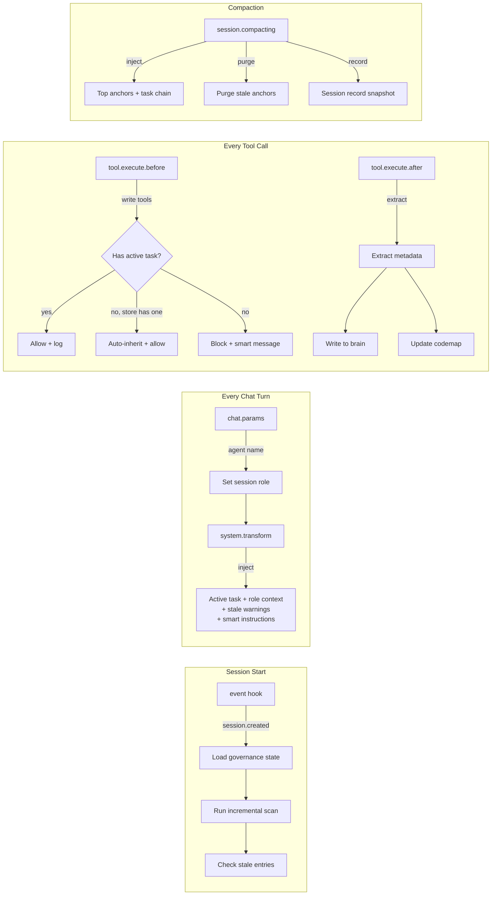

# Phase 1b Master Plan v3 — Entity-Driven Intelligence Architecture

**Status:** APPROVED v3.1 — User decisions incorporated  
**Date:** 2026-02-07 (Updated with user feedback)  
**Prerequisite:** Phase 0 (Smart TODO) ✅ — 204/204 tests, 0 type errors  
**SOT:** User's simplified hypothesis theory + v1 plugin analysis + OpenCode SDK hooks  
**Build Order:** β-first (scan+codemap showcase) → then α → γ → δ → ε  
**Ground Truth:** [AGENTS.md v3.0.0](file:///Users/apple/Documents/coding-projects/idumb/v2/AGENTS.md)

---

## Why v3: What Was Wrong With v2

> [!CAUTION]
> **The v2 plan was governance-heavy and intelligence-light.** It relied on blocking as the primary mechanism — which the user correctly identified as "the worst mechanism." The meta-builder repeatedly failed because it had no smart context, no auto-tools, and no way to gain intelligence from the system.

| v2 Problem | v3 Fix |
|------------|--------|
| Only 4 governance tools (task, anchor, status, init) | 7 tools across 4 tiers: intelligence, processing, governance, validation |
| Blocking as primary mechanism | Auto-context injection + schema-structured intelligence as primary |
| v1 had 14 tools + 3 lib helpers — v2 dropped ALL of them | Selectively reintroduce: chunker, context-scanner, manifest-watcher, codemap |
| No automatic triggers — everything requires agent action | Hooks auto-trigger scanning, context loading, staleness detection |
| `.idumb/` structure is flat files with no hierarchy or relationships | Entity model with types, properties, parent-child chains, timestamps |
| Outputs are confusing raw JSON — not helpful for AI reasoning | Structured natural-language chains that boost context traversal |

---

## I. Entity Model — Types, Properties, Hierarchies

> [!IMPORTANT]
> Entities are NOT just files. They have **types**, **properties**, **parent-child relationships**, **timestamps**, and **watched properties** that trigger events. When an AI reads these, it gains layers of context and relationship — it doesn't just see data, it sees chains of reasoning.

### Group 1: Governance & Status Layer

**Location:** `.idumb/brain/state/`  
**Purpose:** Schema-regulated exports that agents consume for context, not just for blocking.

```typescript
// ─── Entity: GovernanceState ────────────────────────────────────
interface GovernanceState {
  // Properties — all watched for staleness
  activeEpic: EpicRef | null           // Epic → Task → Subtask chain
  activeTask: TaskRef | null           // Currently executing
  sessionRole: AgentRole               // From chat.params
  delegationChain: DelegationLink[]    // Who → Whom → What → Status
  
  // Auto-computed on every hook fire
  toolUsageLog: ToolUseEntry[]         // What tools, when, by whom
  writeCount: number                   // Session write counter
  lastCompactionAt: number             // Time of last compaction
  
  // Triggers
  onStale(threshold: ms): void         // Auto-fire when no progress
  onChainBreak(): void                 // Fire when parent-child chain breaks
  onCompactionN(n: number): void       // Fire after N compactions
}

// ─── Entity: Anchor (enhanced) ──────────────────────────────────
interface Anchor {
  id: string
  type: 'decision' | 'context' | 'checkpoint' | 'attention'
  priority: 'critical' | 'high' | 'normal'
  content: string
  
  // NEW: Relationship + staleness
  source: { file: string, line?: number, taskId?: string }
  relatedTo: string[]                  // IDs of related anchors/tasks
  createdAt: number
  staleSince?: number                  // Auto-set by watcher
  purgedAt?: number                    // When auto-purged
}
```

**What makes this different from v2:** Anchors aren't just stored — they're **related** to tasks, **timestamped**, and **auto-purged** when stale. The governance state isn't just "active task" — it's a full chain with tool usage and delegation history that agents can **traverse**.

---

### Group 2: Brain — Knowledge Graph

**Location:** `.idumb/brain/knowledge/`  
**Purpose:** RepoWiki + CodeMap + Synthesized Knowledge — the long-term memory that withstands compaction.

```typescript
// ─── Entity: BrainEntry ─────────────────────────────────────────
interface BrainEntry {
  id: string
  type: 'architecture' | 'decision' | 'pattern' | 'tech-stack' | 
        'research' | 'codebase-fact' | 'convention' | 'gotcha'
  
  // Content
  title: string
  content: string                      // Natural-language summary
  evidence: string[]                   // File paths, line refs, git hashes
  
  // Hierarchy + Relationships
  parentId?: string                    // Part of a larger entry
  childIds: string[]                   // Sub-entries
  relatedTo: string[]                  // Cross-references
  supersedes?: string                  // Which entry this replaces
  
  // Staleness + Lifecycle
  createdAt: number
  modifiedAt: number
  staleAfter: number                   // TTL in ms
  confidence: number                   // 0-100, decays over time
  source: 'anchor' | 'task-evidence' | 'git-commit' | 
          'scan' | 'manual' | 'research'
  
  // Auto-computed
  accessCount: number                  // How often queried
  lastAccessedAt: number
}

// ─── Entity: CodeMapEntry ───────────────────────────────────────
interface CodeMapEntry {
  file: string
  hash: string                         // Git hash for change detection
  comments: CommentBlock[]             // Extracted JSDoc + inline comments
  exports: ExportSignature[]           // Public API surface
  dependencies: string[]               // What this file imports
  dependents: string[]                 // What imports this file
  lastScannedAt: number
}

interface CommentBlock {
  line: number
  type: 'jsdoc' | 'inline' | 'todo' | 'fixme' | 'hack' | 'note'
  content: string
  relatedFunction?: string
}
```

**The user's key insight:** "No AI can understand anything from tons of confusing output." The brain MUST be **hierarchical**, **relational**, and **timestamped**. Without these → fast-tracking tools gain nothing from the brain. Entries that are stale get decayed confidence. Entries that are superseded get linked to their replacement. When an AI queries the brain, it traverses relationships — not just keyword-matches.

---

### Group 3: Project Documents

**Location:** `.idumb/brain/project-map/`  
**Purpose:** First-init scan output — the structured understanding of what this project IS.

```typescript
// ─── Entity: ProjectMap ─────────────────────────────────────────
interface ProjectMap {
  // Structure (from init scan)
  rootStructure: DirectoryNode         // Depth 2-3 tree
  frameworksDetected: FrameworkEntry[] // Name, version, config path
  governanceDetected: GovernanceEntry[]// BMAD, GSD, Agent-OS etc.
  
  // Documents hierarchy
  documents: DocumentEntry[]           // PRDs, specs, ADRs, research
  documentRelations: Relation[]        // Which docs reference which
  
  // Tech stack synthesis
  techStack: TechEntry[]               // Language, framework, version, evidence
  dependencies: DependencyGraph        // package.json → lock file → actual usage
  
  // Lifecycle
  lastFullScanAt: number
  lastIncrementalAt: number
  driftDetections: DriftEntry[]        // Changes since last scan
}

interface DocumentEntry {
  path: string
  type: 'prd' | 'spec' | 'adr' | 'research' | 'plan' | 'config' | 'readme'
  title: string
  sections: string[]                   // Heading hierarchy
  linkedTo: string[]                   // Other doc paths it references
  staleIndicators: string[]            // Outdated references found
  lastModified: number
}
```

**The user's key insight:** "First init will tell a lot of story. If not instructed how agents scan smartly, they should ignore what doesn't start the hierarchy." The project map is NOT a flat file listing — it's a **typed, hierarchical understanding** where docs are **classified**, **relationship-linked**, and **staleness-checked**.

---

### Group 4: Session Workflows & Planning Artifacts

**Location:** `.idumb/brain/sessions/` + `.idumb/brain/plans/`  
**Purpose:** Trajectory tracking, context-anchoring, and delegation communication.

```typescript
// ─── Entity: PlanningArtifact ───────────────────────────────────
interface PlanningArtifact {
  id: string
  type: 'implementation-plan' | 'research' | 'spike-result' | 
        'validation-report' | 'delegation-report'
  status: 'active' | 'superseded' | 'abandoned' | 'completed'
  
  // Content
  title: string
  path: string                         // File location
  sections: PlanSection[]              // Parsed heading structure
  
  // Relationships
  parentPlanId?: string                // Which plan spawned this
  childPlanIds: string[]               // Sub-plans
  taskIds: string[]                    // Which tasks this plan covers
  supersededBy?: string                // Newer version's ID
  
  // Lifecycle — the user's critical concept
  createdAt: number
  implementedAt?: number               // When code changes started
  validatedAt?: number                 // When validation passed
  purgedAt?: number                    // When abandoned (context-poison prevention)
}

// ─── Entity: SessionRecord ──────────────────────────────────────
interface SessionRecord {
  sessionId: string
  startedAt: number
  agentRole: string
  
  // What happened
  toolsUsed: ToolUseEntry[]
  filesModified: string[]
  tasksCompleted: string[]
  delegationsIssued: DelegationLink[]
  
  // Context chain
  compactionCount: number
  anchorsSurvived: string[]            // Which anchors made it through
  brainEntriesCreated: string[]        // What was learned
}
```

**The user's key insight:** "Planning artifacts if not regulated well will be read as context poisoning." Abandoned plans MUST be purged. Active plans MUST link to their implementation. The session record captures what ACTUALLY happened — not what was planned — so the next session can traverse the trajectory.

---

## II. Tool Architecture — Smart, Not Just Blocking

> [!WARNING]
> **OpenCode hard limit: 5 custom tools maximum.**
> V1 had 14 tools and hit this limit by combining them into a meta-orchestrator.
> V3 strategy: **5 exposed tools** with internal sub-functions + **hooks as auto-triggers**.

### The 5 Tools (OpenCode-Visible)

| Tool | Tier | Replaces (v1) | Auto-trigger? |
|------|------|---------------|--------------|
| `idumb_task` | Governance | idumb-smart-tasks, idumb-todo | No — agent-called |
| `idumb_scan` | Intelligence | idumb-context, idumb-manifest, idumb-validate | **Yes** — on session start, after N writes |
| `idumb_brain` | Processing | idumb-state (partial), NEW knowledge graph | No — agent-called for read/write |
| `idumb_codemap` | Processing | NEW (user's comment-scanner idea) | **Yes** — after file writes |
| `idumb_anchor` | Governance | (existing, enhanced) | No — agent-called |

> [!NOTE]
> `idumb_status` and `idumb_init` absorbed into `idumb_task action=status` and hooks respectively. This frees 2 slots for `idumb_scan` and `idumb_codemap`.

---

### Tool 1: `idumb_task` (Enhanced — Existing)

**What it does now that it didn't before:**
- **Auto-assignee:** Reads `chat.params` captured agent name → sets `task.assignee` automatically
- **Delegation tracking:** `action=delegate` → writes to `brain/delegations/`, tracks chain
- **Time-to-stale:** Tasks older than `staleAfter` auto-emit warnings into system prompt
- **Chain integrity:** `action=complete` checks all subtasks + prerequisite chain
- **Status absorbed:** `action=status` replaces the separate `idumb_status` tool

**Schema:**
```typescript
type TaskAction = 
  | 'create_epic' | 'create_task' | 'create_subtask' 
  | 'start' | 'complete' | 'delegate' | 'validate'
  | 'status' | 'list'  // absorbed from idumb_status
```

---

### Tool 2: `idumb_scan` (NEW — Intelligence Engine)

**What it does:** Automatic project scanner that produces structured, hierarchical intelligence.

**Actions:**
```typescript
type ScanAction = 
  | 'full'              // Full project scan (on init, manual trigger)
  | 'incremental'       // Scan only changed files (auto after writes)
  | 'drift'             // Detect drift from last scan
  | 'frameworks'        // Framework/tech-stack detection only
  | 'documents'         // Scan docs/ hierarchy with relationship linking
```

**What it produces:** NOT raw output. Structured `ProjectMap` entries with:
- Classified document types (PRD, spec, ADR, research)
- Framework detection with version + config path evidence
- Drift entries: what changed since last scan
- Relationship links: which docs reference which others
- Stale indicators: outdated references in docs

**Replaces from v1:** `idumb-context` (classify), `idumb-manifest` (drift/hash), `idumb-validate` (structure check)

**Auto-triggers via hooks:**
- [event](file:///Users/apple/Documents/coding-projects/idumb/v2/src/index.ts#51-61) (session created) → run `incremental` scan
- `tool.execute.after` (every N writes) → run `drift` check

---

### Tool 3: `idumb_brain` (NEW — Knowledge Graph)

**What it does:** Read/write/query the knowledge graph with relationship traversal.

**Actions:**
```typescript
type BrainAction = 
  | 'query'             // Search by topic → returns related chain
  | 'write'             // Add new entry with relationships
  | 'link'              // Create relationship between entries
  | 'stale'             // List stale entries (confidence decayed)
  | 'purge'             // Remove abandoned/stale entries
  | 'tree'              // Show hierarchy of entries by type
```

**What makes it intelligent:**
- `query("auth")` doesn't just keyword-match — it follows `relatedTo` links to find the decision chain
- Entries have `confidence` that decays over time (`createdAt + staleAfter` → auto-decay)
- `supersedes` relationship prevents stale entries from poisoning context
- `source` tracking: every entry knows WHERE it came from (anchor, task, git, scan)

**Auto-populated by hooks:**
- `tool.execute.after` on task completion → extract learning → write entry
- Anchor creation of type `decision` → auto-create brain entry
- Git commit messages → parsed for architecture decisions

---

### Tool 4: `idumb_codemap` (NEW — Comment Scanner + Code Structure)

**What it does:** The user's novel tool idea — scans code comments to build intelligence.

> [!TIP]
> "Nowadays when people use AI to code, sometimes tracing the comments and JSDoc will spot flaws very effectively. Because if you read enough depth, logics within a huge lengthy file can be found." — User

**Actions:**
```typescript
type CodemapAction = 
  | 'scan'              // Scan file/directory for comments + exports
  | 'diff'              // Compare current vs last scan (what changed?)
  | 'inconsistencies'   // Detect logic contradictions in comments
  | 'todos'             // Extract TODO/FIXME/HACK with context
  | 'graph'             // Show dependency graph (imports/exports)
```

**What it produces:**
- `CommentBlock[]` — extracted JSDoc, inline comments, grouped by function
- `ExportSignature[]` — public API surface with types
- Inconsistency detection: "Function X says 'handles auth' but imports nothing from auth module"
- TODO/FIXME extraction with file, line, context (smarter than grep)
- Dependency graph: who imports whom, circular deps

**Auto-triggers:**
- `tool.execute.after` on file write → re-scan that file
- On session start → scan recently modified files

---

### Tool 5: `idumb_anchor` (Enhanced — Existing)

**Enhanced with:**
- `relatedTo` — relationship links to other anchors, tasks, brain entries
- `staleSince` — auto-set when source file/task changes
- `purgedAt` — auto-purge mechanism on compaction
- Schema validation before create (prevent garbage anchors)

---

## III. Hook Architecture — Intelligence Injection, Not Just Blocking

> [!IMPORTANT]
> Hooks are NOT gates. They are **event sources** that produce intelligence. The meta-builder failed because we only used hooks to BLOCK — instead of INFORMING.

### Hook Flow Diagram



### Hook Details

| Hook | v2 Role (blocking) | v3 Role (intelligence) |
|------|---------------------|------------------------|
| [event](file:///Users/apple/Documents/coding-projects/idumb/v2/src/index.ts#51-61) | Log only | **Session bootstrap**: load state, run incremental scan, check stale brain entries, emit warnings |
| `chat.params` | NOT registered | **Role detection + context loading**: capture agent name, load role-specific instructions from brain |
| `tool.execute.before` | Block writes | **Smart gate + context**: block if no task, BUT also inject "you are working on X, related context: Y" into the block message |
| `tool.execute.after` | Defense-in-depth | **Auto-extraction**: extract file paths, changes from tool output → write to codemap and brain → track tool usage per session |
| `experimental.session.compacting` | Anchor injection | **Brain injection**: inject top brain entries (not just anchors), active task chain, delegation status, recent decisions |
| `experimental.chat.system.transform` | Governance reminder | **Role-specific intelligence**: inject role permissions, active task context, stale warnings, smart instructions based on what agent is DOING |
| `experimental.chat.messages.transform` | DCP pruning | **Context janitor**: truncate stale tool outputs, merge redundant scan results, keep trajectory readable |
| `command.execute.before` | NOT registered | **Workflow tracking**: intercept commands to track workflow state, auto-link to active task |

---

## IV. Data Flow — How Entities Gain Intelligence

```
Session Start
    │
    ├─[event hook]─→ Load GovernanceState from disk
    │                 Run idumb_scan(incremental) 
    │                 Check brain for stale entries → emit warnings  
    │
    ├─[chat.params]─→ Capture agent role → Load role-specific brain context
    │
    ├─[system.transform]─→ Inject: active task + role + stale warnings + instructions
    │
Agent Works
    │
    ├─[tool.execute.before]─→ Gate writes (existing) + context injection
    │
    ├─[Agent calls idumb_task]─→ Create/complete/delegate tasks
    │   └─→ On complete: extract evidence → write to brain
    │   └─→ On delegate: write delegation record → track chain
    │
    ├─[Agent calls idumb_brain]─→ Query knowledge graph for relevant context
    │   └─→ Follow relatedTo links → traverse hierarchy
    │
    ├─[Agent calls idumb_scan]─→ Get project intelligence
    │   └─→ Framework detection, document hierarchy, drift
    │
    ├─[Agent calls idumb_codemap]─→ Scan code comments + structure
    │   └─→ Extract JSDoc, detect inconsistencies, build dep graph
    │
    ├─[tool.execute.after]─→ Auto-extract: file paths, changes
    │   └─→ Update codemap for modified files
    │   └─→ Write tool usage to session record
    │   └─→ Every N writes: trigger idumb_scan(drift)
    │
Compaction Hits
    │
    ├─[session.compacting]─→ Inject top brain entries + task chain
    │                         Purge stale anchors
    │                         Snapshot session record
    │
    └─→ Agent resumes with: active task context + survived knowledge
```

---

## V. What the Meta-Builder ACTUALLY Does in Steps 2 and 3

> [!CAUTION]
> This is the acid test. If our entity model + tools can't support what the meta-builder needs in Phase 2 (deep scan + agent creation) and Phase 3 (intelligence + handoff), the plan is wrong.

### Phase 2: What the AI Agent Actually Does

1. **Deep Architecture Read** — needs `idumb_scan(full)` + `idumb_codemap(scan)`
   - Scan project structure, detect frameworks, classify documents
   - Scan code comments to understand architecture patterns
   - Build dependency graph from imports/exports
   - Output: `ProjectMap` + `CodeMapEntry[]` written to brain

2. **Create 4 Agent Profiles** — needs `idumb_task` (already fixed with bootstrap) + write access
   - Read reference profiles from `.idumb/idumb-modules/agents/`
   - Adapt system prompts to detected project context (from scan results)
   - Set tools/permissions per profile hierarchy
   - Write to `.opencode/agents/`

3. **Create Project Commands** — needs write access + project context from scan
   - Generate project-specific commands based on detected tech stack
   - Link commands to detected workflows (BMAD, GSD, etc.)

**What v2 lacked for Phase 2:** No scan tool, no codemap tool, no way to gain structured project intelligence. The meta-builder was writing blind.

### Phase 3: What the AI Agent Actually Does

1. **Full Intelligence Report** — needs `idumb_brain(write)` + scan results
   - Synthesize all Phase 1+2 findings into brain entries
   - Create relationship links between tech-stack, architecture, frameworks
   - Score confidence based on evidence depth

2. **Skill Discovery** — needs `idumb_codemap(graph)` + `idumb_scan(documents)`
   - Use dependency graph to identify skill opportunities
   - Cross-reference with detected governance frameworks
   - Generate skill templates

3. **Handoff to Coordinator** — needs `idumb_task(delegate)` + brain entries
   - Create delegation record: meta-builder → supreme-coordinator
   - Write handoff context to brain
   - Set bootstrap task as completed with evidence

**What v2 lacked for Phase 3:** No brain tool, no way to persist intelligence across sessions, no delegation mechanism that actually works.

---

## VI. Implementation Phases — Build Order

### Phase 1b-α: Foundation + Tool Slots (1-2 sessions)

**Goal:** Free tool slots, register missing hooks, establish entity schemas.

| # | Task | Why |
|---|------|-----|
| α-1 | Merge `idumb_status` into `idumb_task action=status` | Frees tool slot |
| α-2 | Merge `idumb_init` into `event` hook auto-trigger | Frees tool slot |
| α-3 | Register `chat.params` hook → capture agent role | Enables role-based context |
| α-4 | Register `command.execute.before` hook | Enables workflow tracking |
| α-5 | Create entity schemas: `BrainEntry`, `CodeMapEntry`, `ProjectMap`, `PlanningArtifact`, `SessionRecord` | Schema-first |
| α-6 | Live-verify 3 experimental hooks | Required for downstream |

**Success:** 2 tool slots freed, 2 new hooks registered, entity schemas created.

---

### Phase 1b-β: Scan + CodeMap Tools (2-3 sessions)

**Goal:** Give agents the ability to gain project intelligence automatically.

| # | Task | Why |
|---|------|-----|
| β-1 | Implement `idumb_scan` with actions: full, incremental, drift, frameworks, documents | Primary intelligence tool |
| β-2 | Implement `idumb_codemap` with actions: scan, diff, inconsistencies, todos, graph | User's comment-scanner idea |
| β-3 | Wire `event` hook to auto-trigger `idumb_scan(incremental)` on session start | Auto-intelligence |
| β-4 | Wire `tool.execute.after` to auto-trigger `idumb_codemap(scan)` after file writes | Auto-update codemap |
| β-5 | Write `ProjectMap` and `CodeMapEntry[]` to `.idumb/brain/` | Persist intelligence |

**Success:** Meta-builder Phase 2 can deep-scan with structured tools instead of blind reads.

---

### Phase 1b-γ: Brain + Knowledge Graph (2-3 sessions)

**Goal:** Long-term memory that withstands compaction and prevents context poisoning.

| # | Task | Why |
|---|------|-----|
| γ-1 | Implement `idumb_brain` with actions: query, write, link, stale, purge, tree | Knowledge graph tool |
| γ-2 | Implement relationship traversal: `query("auth")` follows `relatedTo` chain | Intelligence boost |
| γ-3 | Implement confidence decay: `createdAt + staleAfter` → auto-lower confidence | Prevent stale context |
| γ-4 | Implement `supersedes` relationship: old entries linked to replacements | Context-poison prevention |
| γ-5 | Wire compaction hook to inject top brain entries (not just anchors) | Survive compaction |
| γ-6 | Wire `tool.execute.after` to auto-extract learnings on task completion | Auto-populate brain |

**Success:** Meta-builder Phase 3 can write intelligence to brain, query it, and hand off to coordinator with persistent knowledge.

---

### Phase 1b-δ: Enhanced Task + Delegation (2 sessions)

**Goal:** Smart task management with delegation chains and time-to-stale.

| # | Task | Why |
|---|------|-----|
| δ-1 | Add `delegate` action to `idumb_task` with disk-persisted delegation records | PP-01 workaround |
| δ-2 | Add `time-to-stale` enforcement: auto-warn when task exceeds threshold | User's intelligence concept |
| δ-3 | Add `prerequisites` to Task schema with chain-break detection | Prevent out-of-order execution |
| δ-4 | Auto-assignee from `chat.params` captured agent name | Zero-friction role tracking |
| δ-5 | Enhanced `system.transform` → inject role-specific instructions based on agent name | Intelligence injection |

**Success:** Delegation works across sessions, stale tasks are flagged, chain integrity is maintained.

---

### Phase 1b-ε: Planning Artifacts + Session Tracking (2-3 sessions)

**Goal:** Persistent planning artifacts with lifecycle, relationship linking, and auto-purging.

| # | Task | Why |
|---|------|-----|
| ε-1 | Implement `PlanningArtifact` entity with status lifecycle: active → completed/superseded/abandoned | Prevent context poisoning |
| ε-2 | Auto-purge abandoned plans from AI-visible paths | User's critical concept |
| ε-3 | Session record tracking: tools used, files modified, tasks completed per session | Trajectory for debugging |
| ε-4 | Link plans → tasks → brain entries bidirectionally | Full relationship graph |
| ε-5 | Wire `experimental.chat.messages.transform` to prune stale plan references from chat history | Context janitor |

**Success:** Plans have lifecycle, stale plans are purged, next session can traverse the trajectory.

---

## VII. The 5-Tool Budget + Nesting Strategy

> [!IMPORTANT]
> **User decision:** "You can NEST tools in tools. Make things more structured. Which agents use which tools while not having to expose all tools to all."

### Tool Slot Allocation

| Slot | v2 Tool | v3 Tool | Change |
|------|---------|---------|--------|
| 1 | `idumb_task` | `idumb_task` (enhanced: +delegate, +status, +stale) | Absorbs `idumb_status` |
| 2 | `idumb_anchor` | `idumb_anchor` (enhanced: +relations, +staleness) | Same slot, smarter |
| 3 | `idumb_status` | `idumb_scan` (replaces status with intelligence) | **FREED → NEW** |
| 4 | `idumb_init` | `idumb_brain` (replaces init with knowledge graph) | **FREED → NEW** |
| 5 | *(empty)* | `idumb_codemap` (comment scanner + code structure) | **NEW** |

### Nesting Strategy — Sub-Actions Within Tools

Each tool uses `action` param to namespace sub-capabilities. This lets us expose 5 tools but provide 25+ capabilities:

| Tool | Sub-Actions (nested) |
|------|---------------------|
| `idumb_task` | `create_epic`, `create_task`, `create_subtask`, `start`, `complete`, `delegate`, `validate`, `status`, `list`, `defer`, `abandon`, `branch` |
| `idumb_scan` | `full`, `incremental`, `drift`, `frameworks`, `documents` |
| `idumb_brain` | `query`, `write`, `link`, `stale`, `purge`, `tree` |
| `idumb_codemap` | `scan`, `diff`, `inconsistencies`, `todos`, `graph` |
| `idumb_anchor` | `add`, `list`, `update`, `remove` |

### Per-Agent Tool Visibility

Not all agents see all tools. Controlled via agent `.md` profiles:

| Agent Role | Tools Visible | Rationale |
|------------|---------------|----------|
| `supreme-coordinator` | All 5 | Needs full orchestration |
| `meta-builder` | `idumb_task`, `idumb_scan`, `idumb_brain`, `idumb_codemap` | Init phase needs all intelligence tools, not anchor |
| `builder` | `idumb_task`, `idumb_anchor`, `idumb_codemap` | Day-to-day work: tasks + context anchoring + code scanning |
| `validator` | `idumb_task` (read-only actions), `idumb_brain` (query only) | Read-only validation |

**How `idumb_init` goes away:** The init command's work moves to the `event` hook (auto-trigger on first session) and the `idumb_scan(full)` tool (manual trigger). The CLI `npx idumb-v2 init` still runs deploy.ts for file setup — but the OpenCode-side tool slot is freed.

---

## VIII. User Decisions (Resolved ✅)

### ✅ Decision 1: Tool Nesting + Per-Agent Visibility
**Answer:** Nest sub-actions within tools. Control per-agent visibility via `.md` profiles. See Section VII above.

### ✅ Decision 2: Trigger Architecture
**Answer:** Much richer than simple session-start triggers. The system watches for intelligent signals:

| Trigger | What Fires | Why |
|---------|-----------|-----|
| **Session start** | `idumb_scan(incremental)` | Load fresh context |
| **Compaction** (can fire many times!) | Brain injection + anchor purge + session snapshot | **Key for context-poisoning prevention** — compaction is where context gets destroyed |
| **3× consecutive user cancels** | Hallucination alert → emit warning into system prompt | If user cancels 3 times → AI is likely hallucinating, increase governance strictness |
| **N events within N time (frequency)** | Configurable alert | Detect runaway loops, repetitive tool calls |
| **Last AI assistant message** | Auto-export with schema to `.idumb/brain/sessions/exports/` | Structured capture of AI's final state per turn |
| **4× exports accumulated** | Trigger synthesis → write to brain | Don't synthesize every turn — batch to 4, then produce knowledge entry |

### ✅ Decision 3: Brain Persistence
**Answer:** JSON first. But stress-test with AI agents reading it — check if incremental reading prevents context pollution. May upgrade to SQLite later if JSON proves too noisy.

### ✅ Decision 4: Priority Order  
**Answer:** β-first (scan + codemap) as the showcase. Then α → γ → δ → ε.

**Revised build order:** β → α → γ → δ → ε

---

## Verification Plan

### Automated Tests
- `npm run typecheck` → 0 errors after each phase
- `npm test` → 204+ tests (no regressions + new tests per phase)
- New tests per tool: scan, codemap, brain, enhanced task/anchor

### Live Verification
- Re-run meta-builder after Phase β → confirm it can deep-scan with `idumb_scan`
- Re-run meta-builder after Phase γ → confirm it can write to brain and hand off
- Compaction test: verify brain entries survive compaction via hook injection
- Role test: verify `chat.params` captures agent name and injects role context
- **Hallucination detection test:** Cancel 3 times → verify system injects warning
- **Synthesis test:** Generate 4 last-message exports → verify brain synthesis fires
- **Context pollution test:** AI reads brain JSON incrementally → verify no context poisoning
