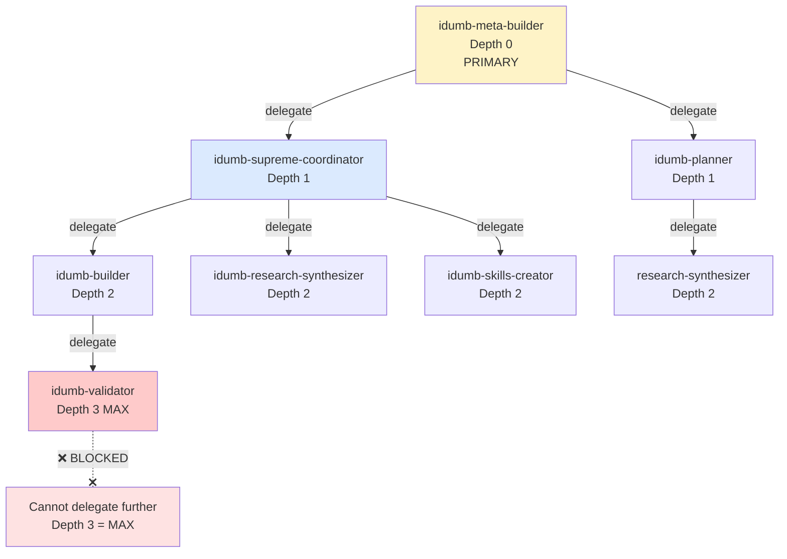
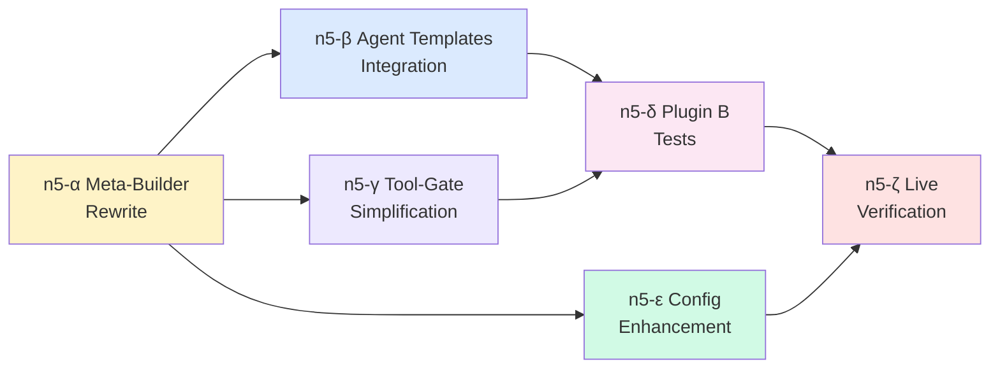

# Phase 1b Master Plan n5 — Agent Ecosystem Integration

**Status:** DRAFT — Pending review  
**Date:** 2026-02-07  
**Supersedes:** n3 (Hierarchy Redesign), n3-2 (Tool Discoverability), n4 §XV (deferred items)  
**Prerequisite:** n4 ✅ (all 4 Plugin B tools implemented, 242/242 tests, 0 TypeScript errors)  
**Core Principle:** The Meta-Builder does NOT build. It **orchestrates**. It creates tasks, delegates to specialists, and tracks every status variable until the entire chain resolves.

---

## I. The Genesis — Init Is the Entry Point of Everything

> [!IMPORTANT]
> `npx idumb-v2 init` is the Big Bang. Nothing exists before it. Everything flows from it.

### What Init Creates Today (Already Working ✅)

```
npx idumb-v2 init
     │
     ├── Interactive CLI prompts:
     │   ├── 📌 Scope: project-level or global?
     │   ├── 🌐 Communication language: English / Tiếng Việt
     │   ├── 📝 Document language: English / Tiếng Việt
     │   ├── 🎯 Experience level: beginner / guided / expert
     │   └── 🏛️ Governance mode: balanced / strict / autonomous
     │
     ├── Creates .idumb/ folder tree:
     │   ├── .idumb/config.json          ← THE CONFIGURATION (read by everything)
     │   ├── .idumb/anchors/             ← context anchors (survive compaction)
     │   ├── .idumb/brain/               ← tasks, knowledge, audit, cache
     │   │   ├── tasks.json              ← pre-bootstrapped with active task
     │   │   ├── hook-state.json         ← session state, agent capture
     │   │   ├── audit/                  ← write + bash + fetch audit logs
     │   │   ├── web-cache/              ← webfetch session cache
     │   │   └── delegations.json        ← delegation records
     │   ├── .idumb/governance/          ← project-specific governance rules
     │   ├── .idumb/idumb-modules/       ← templates, schemas, profiles (READ-ONLY reference)
     │   │   ├── README.md
     │   │   ├── agents/                 ← sub-agent profile templates
     │   │   │   ├── supreme-coordinator-profile.md
     │   │   │   ├── builder-profile.md
     │   │   │   ├── validator-profile.md
     │   │   │   └── skills-creator-profile.md
     │   │   ├── schemas/                ← agent contract, entity schemas
     │   │   │   └── agent-contract.md
     │   │   ├── commands/               ← command templates
     │   │   │   └── command-template.md
     │   │   ├── workflows/              ← workflow templates
     │   │   │   └── workflow-template.md
     │   │   └── skills/                 ← protocol templates
     │   │       ├── delegation-protocol.md
     │   │       └── governance-protocol.md
     │   ├── .idumb/modules/             ← project-specific modules
     │   ├── .idumb/project-core/        ← project intelligence artifacts
     │   ├── .idumb/project-output/      ← generated output
     │   └── .idumb/sessions/            ← session history
     │
     ├── Deploys to .opencode/ (or global):
     │   ├── agents/idumb-meta-builder.md    ← THE top-level orchestrator
     │   └── commands/
     │       ├── idumb-init.md
     │       ├── idumb-settings.md
     │       ├── idumb-status.md
     │       └── idumb-delegate.md
     │
     └── Updates opencode.json:
         ├── Plugin A: "idumb-v2"               ← governance + intelligence hooks
         └── Plugin B: "idumb-v2/tools-plugin"   ← entity-aware operation tools
```

### Config.json — The Constitution

```jsonc
// .idumb/config.json — ALL behavior derives from here
{
  "version": "1.0.0",
  "installedAt": "2026-02-07T12:00:00.000Z",
  "scope": "project",

  "user": {
    "experienceLevel": "guided",       // beginner | guided | expert
    "language": {
      "communication": "en",           // en | vi (agent speaks this)
      "documents": "en"                // en | vi (generated artifacts in this)
    }
  },

  "governance": {
    "mode": "balanced"                  // balanced | strict | autonomous
    // balanced: recommend + guide at decision boundaries, allow full completion
    // strict: incremental validation at ALL nodes, gate-pass required
    // autonomous: "you take the wheel" — AI decides, minimal intervention
  },

  "detection": {                        // snapshot of what init found
    "governance": ["bmad"],             // detected governance frameworks
    "tech": ["typescript", "nextjs"],   // detected tech stack
    "packageManager": "npm",
    "hasMonorepo": false,
    "existingAgentDirs": [".opencode/agents"],
    "existingCommandDirs": [".opencode/commands"],
    "conflicts": [],
    "gaps": []
  },

  "paths": {
    "root": ".idumb/",
    "config": ".idumb/config.json",
    "anchors": ".idumb/anchors/",
    "brain": ".idumb/brain/",
    "governance": ".idumb/governance/",
    "modules": ".idumb/idumb-modules/",
    "projectModules": ".idumb/modules/",
    "projectCore": ".idumb/project-core/",
    "projectOutput": ".idumb/project-output/",
    "sessions": ".idumb/sessions/"
  }
}
```

### What Init Needs to Change (n5)

| Change | Why | Impact |
|--------|-----|--------|
| Deploy `.idumb/brain/audit/` directory | Plugin B tools write audit logs here | `deploy.ts` mkdir |
| Deploy `.idumb/brain/web-cache/` directory | `idumb_webfetch` caches here | `deploy.ts` mkdir |
| Deploy `.idumb/backups/` directory | `idumb_write` stores backups here | `deploy.ts` mkdir |
| Add `enforcement` section to config schema | Governance mode needs granular settings | `config.ts` schema |
| Add `requiredFirstTools` to config | Configurable "must call before anything" list | `config.ts` schema |

---

## II. The Meta-Builder — Pure Orchestrator, Zero Implementation

> [!CAUTION]
> **The meta-builder does NOT write application code. It does NOT create files directly. It creates TASKS and DELEGATES.**
>
> Current meta-builder (n3 design) tries to do everything: scan, create agents, write files, form intelligence.
> New meta-builder (n5 design) does ONE thing: **orchestrate** — read state, decide what needs doing, create tasks, delegate to specialists, track completion.

### The Architectural Shift

```
CURRENT (n3 meta-builder):
──────────────────────────
Meta-Builder Phase 1 → [reads config, scans project, presents greeting]      ← DOES work itself
Meta-Builder Phase 2 → [creates agents, writes files, produces report]       ← DOES work itself
Meta-Builder Phase 3 → [deep scan, modifies templates, installs skills]      ← DOES work itself

NEW (n5 meta-builder):
──────────────────────
Meta-Builder → [reads config]
             → [creates Epic: "Project Initialization"]
             → [creates Task: "Project Scan"] → delegates to self (Phase 1 scan is read-only)
             → [creates Task: "Agent Hierarchy Setup"] → delegates to builder via coordinator
             → [creates Task: "Intelligence Formation"] → delegates to researcher + builder
             → [tracks ALL task status, reports to user, requests approvals]
             → NEVER touches a write tool directly (except idumb_task)
```

### What the Meta-Builder DOES

| Action | Tool Used | Entity Type |
|--------|-----------|-------------|
| Read config.json | `idumb_read mode=content` | governance-config |
| Scan project | `idumb_scan action=full` + `idumb_codemap action=scan` | project-map, codemap |
| Create epic | `idumb_task action=create_epic` | task-store |
| Create tasks | `idumb_task action=create_task` | task-store |
| Delegate work | `idumb_task action=delegate` | delegation-store |
| Track status | `idumb_task action=status` + `idumb_task action=list` | task-store |
| Add evidence | `idumb_task action=evidence` | task-store |
| Add anchor | `idumb_anchor action=add` | anchor |
| Present greeting | plain text output (no tool needed) | — |

### What the Meta-Builder DOES NOT DO

| Blocked Action | Why | Who Does It Instead |
|---------------|-----|---------------------|
| `write` / `idumb_write` | Not a writer — orchestrator | idumb-builder |
| `edit` / `multiEdit` | Not an editor | idumb-builder |
| `bash` / `idumb_bash purpose=build` | Not a builder | idumb-builder |
| `idumb_bash purpose=validation` | Not a validator | idumb-validator |
| `idumb_webfetch` | Not a researcher | idumb-research-synthesizer |
| Create agent files directly | Not a file writer | idumb-builder (via delegation) |
| Install skills directly | Not a skills maker | idumb-skills-creator (via delegation) |

### Meta-Builder Governance Mode Behavior

| Mode | Greeting Style | Delegation Style | Status Tracking |
|------|---------------|-----------------|-----------------|
| **balanced** | Professional, evidence-cited, warm. Present choices before proceeding. | Delegate with clear context, expected output, and acceptance criteria. Wait for completion. Report intermediate progress. | Show task tree, active/pending/completed counts, delegation chain depth. |
| **strict** | Formal, exhaustive, citation-heavy. Every claim backed by file:line evidence. | Delegate with strict evidence requirements. Each subtask must emit evidence before parent proceeds. Validation gates at every transition. | Show full audit trail, evidence chain, gate-pass status at each node. |
| **autonomous** | Brief, confident, action-oriented. Minimal questions, maximum execution. | Delegate aggressively, allow sub-agents to decide approach. Accept completion with minimal evidence. Trust the chain. | Show progress percentage, blocked items only, minimal overhead. |

---

## III. The Agent Hierarchy — The Team

> [!IMPORTANT]
> Every agent below is deployed to `.opencode/agents/` by the meta-builder's initialization flow.
> They READ their profiles from `.idumb/idumb-modules/agents/` and ADAPT to the project context.
> The `.idumb/idumb-modules/` folder is a READ-ONLY reference library — agents never modify it.

### Agent × Tool Permission Matrix

```
                        Plugin A Tools                    Plugin B Tools
                    ┌────────────────────────────┐   ┌──────────────────────────────────────┐
Agent               │ task  anchor scan codemap  │   │ read   write  bash         webfetch  │
────────────────────┼────────────────────────────┼───┼──────────────────────────────────────┤
meta-builder        │ ALL   add    ALL  ALL      │   │ ✅     ❌     inspection   ❌        │
supreme-coordinator │ ALL*  add    -    -        │   │ ✅     ❌     inspection   ❌        │
builder             │ CRUD  add    incr scan     │   │ ✅     ✅     build+val+git ❌       │
validator           │ read  list   -    todos    │   │ ✅     ❌     validation    ❌       │
skills-creator      │ CRUD  add    -    -        │   │ ✅     ✅     inspection   ✅        │
research-synth      │ CRUD  add    -    -        │   │ ✅     ✅     inspection   ✅        │
planner             │ CRUD  add    scan scan     │   │ ✅     ✅     inspection   ✅        │
roadmapper          │ read  add    full scan     │   │ ✅     ❌     inspection   ✅        │
────────────────────┴────────────────────────────┴───┴──────────────────────────────────────┘

* supreme-coordinator: ALL task actions MINUS create_epic (only meta-builder creates epics)
```

### Agent Role Definitions

#### 1. `idumb-meta-builder` — The Orchestrator (PRIMARY)

**Identity:** Top-level governance orchestrator. First agent to run. Controls the entire lifecycle.

**Philosophy:** "I don't build. I don't research. I don't validate. I CREATE TASKS and I DELEGATE TO SPECIALISTS. I am the brain that knows WHAT needs doing and WHO should do it. I track every variable until the chain resolves."

**Entry Flow (per session):**
1. Read `.idumb/config.json` → understand governance mode, language, experience level
2. Check `idumb_task action=status` → what's the current state of everything?
3. If first run: Execute Greeting Protocol (see §IV below)
4. If continuing: Resume delegation chain, report status to user

**Innate Tool Config:**
```yaml
tools:
  read: true       # Still needs innate read for non-entity files
  write: false     # BLOCKED — delegate to builder
  edit: false      # BLOCKED — delegate to builder
  bash: false      # BLOCKED — delegate to builder/validator
  webfetch: false  # BLOCKED — delegate to researcher
```

**Plugin Tool Access:**
- `idumb_task` — ALL actions (create_epic, delegate, status, list, etc.)
- `idumb_scan` — ALL actions (project intelligence)
- `idumb_codemap` — ALL actions (code structure analysis)
- `idumb_anchor` — add, list (save decisions that survive compaction)
- `idumb_read` — ALL modes (entity-aware traversal for checking state)
- `idumb_write` — ❌ BLOCKED (delegate to builder)
- `idumb_bash` — inspection ONLY (cat, ls, find — never build commands)
- `idumb_webfetch` — ❌ BLOCKED (delegate to research-synthesizer)

---

#### 2. `idumb-supreme-coordinator` — The Delegation Router (SUBAGENT)

**Identity:** Meta delegation and orchestration at 1st level. Routes work to appropriate agents.

**Philosophy:** "I receive complex work requests from the meta-builder. I decompose them into delegatable units. I route each unit to the correct specialist. I manage the delegation chain and ensure no depth violations."

**Key Capabilities:**
- Decompose multi-step work into parallel/sequential sub-tasks
- Route to correct agent based on WorkStream category rules
- Manage delegation depth (max 3: coordinator → builder/researcher → validator)
- Detect when delegations stall (30-min expiry check)
- Report aggregated status back to meta-builder

**Plugin Tool Access:**
- `idumb_task` — ALL actions EXCEPT `create_epic` (only meta-builder creates epics)
- `idumb_anchor` — add (save routing decisions)
- `idumb_read` — ALL modes (check entity state before routing)
- `idumb_bash` — inspection ONLY

---

#### 3. `idumb-builder` — The Implementer (SUBAGENT)

**Identity:** Code writer, task executor, command creator, workflow builder. The one who actually touches files.

**Philosophy:** "I receive delegated tasks with clear scope and acceptance criteria. I write code, create agents, build commands, run tests. Everything I create goes through entity-regulated channels — I use `idumb_write` (not raw `write`), `idumb_bash` (not raw `bash`). Every modification creates evidence linked to my assigned task."

**Key Capabilities:**
- Write source code, agent templates, commands, workflows
- Create sub-tasks for complex work, delegate validation to validator
- Run builds, tests, type checks (purpose: build + validation)
- Git operations (add, commit, status, diff)
- Read and adapt module templates from `.idumb/idumb-modules/`

**Innate Tool Config:**
```yaml
tools:
  read: true       # Needs innate read for source files
  write: false     # BLOCKED — uses idumb_write
  edit: true       # Needs edit for modifying existing source
  bash: false      # BLOCKED — uses idumb_bash
  webfetch: false  # BLOCKED — delegate to researcher
```

**Plugin Tool Access:**
- `idumb_task` — create_task, add_subtask, start, complete, evidence, delegate (to validator)
- `idumb_scan` — incremental (detect drift after writes)
- `idumb_codemap` — scan (re-map after code changes)
- `idumb_anchor` — add (save implementation decisions)
- `idumb_read` — ALL modes (check entities before modifying)
- `idumb_write` — ALL modes + lifecycle (entity-regulated writes)
- `idumb_bash` — validation + build + git purposes

---

#### 4. `idumb-validator` — The Quality Gate (SUBAGENT)

**Identity:** Read-only validation engine. Tests, type checks, gap detection, evidence production.

**Philosophy:** "I receive validation requests. I run tests, type checks, linting. I traverse entity chains and verify completeness. I NEVER write code — I only produce evidence. I am the gate that either passes or blocks."

**Key Capabilities:**
- Run `npm test`, `tsc --noEmit`, `eslint` (via `idumb_bash purpose=validation`)
- Traverse entity chains (`idumb_read mode=chain-check`)
- Detect stale artifacts, missing evidence, broken chains
- Produce structured validation reports as evidence
- Block completion if acceptance criteria not met

**Innate Tool Config:**
```yaml
tools:
  read: true       # Read-only — always allowed
  write: false     # BLOCKED — validator never writes
  edit: false      # BLOCKED — validator never edits
  bash: false      # BLOCKED — uses idumb_bash (validation only)
  webfetch: false  # BLOCKED — not a researcher
```

**Plugin Tool Access:**
- `idumb_task` — evidence only (submit validation results)
- `idumb_codemap` — todos (find outstanding work markers)
- `idumb_anchor` — list (check existing decisions)
- `idumb_read` — ALL modes (entity-aware traversal for validation)
- `idumb_write` — ❌ BLOCKED
- `idumb_bash` — validation + inspection ONLY
- `idumb_webfetch` — ❌ BLOCKED

---

#### 5. `idumb-skills-creator` — The Skill Artisan (SUBAGENT)

**Identity:** Skill discovery, evaluation, and creation specialist.

**Philosophy:** "I find existing skills on skills.sh that solve the team's needs. When no existing skill fits, I create custom skills following the iDumb skill contract. Every skill I produce is schema-regulated and evidence-backed."

**Key Capabilities:**
- Search skills.sh registry: `npx skills find [query]`
- Install existing skills: `npx skills add [owner/repo@skill]`
- Evaluate skill quality and relevance
- Create custom skills following `.idumb/idumb-modules/schemas/agent-contract.md`
- Write skill files to `.opencode/skills/`

**Plugin Tool Access:**
- `idumb_task` — create_task, add_subtask, start, complete, evidence
- `idumb_anchor` — add (save skill evaluation decisions)
- `idumb_read` — ALL modes (read existing skills, templates)
- `idumb_write` — create mode only (new skill files)
- `idumb_bash` — inspection (npx skills find/check)
- `idumb_webfetch` — research purpose (evaluate skills.sh pages)

---

#### 6. `idumb-research-synthesizer` — The Knowledge Engine (SUBAGENT)

**Identity:** Research ingestion, analysis, and synthesis specialist.

**Philosophy:** "I receive research tasks. I fetch references, analyze documentation, synthesize findings into structured brain entries. I link everything to the planning chain so downstream builders have resolved context."

**Key Capabilities:**
- Fetch and classify web content (documentation, API references, blog posts)
- Create/update brain entries with relational links
- Synthesize multiple sources into coherent research artifacts
- Mark research as "resolved" so downstream tasks can proceed
- Validate that fetched references are current (link checking)

**Plugin Tool Access:**
- `idumb_task` — create_task, add_subtask, start, complete, evidence
- `idumb_anchor` — add (save research decisions)
- `idumb_read` — ALL modes (read existing research, chain-check)
- `idumb_write` — create + append (research artifacts, brain entries)
- `idumb_bash` — inspection only
- `idumb_webfetch` — ALL purposes (the primary researcher)

---

#### 7. `idumb-planner` — The Strategy Architect (SUBAGENT)

**Identity:** Implementation plan creator and refinement specialist.

**Philosophy:** "I receive high-level goals and produce detailed, phased implementation plans. My plans follow regulated schemas with acceptance criteria, evidence requirements, and dependency chains. Every plan I create is a living artifact tracked through the planning lifecycle."

**Plugin Tool Access:**
- `idumb_task` — create_task, add_subtask, start, complete, evidence
- `idumb_read` — ALL modes
- `idumb_write` — create + overwrite + update-section (planning artifacts)
- `idumb_bash` — inspection only
- `idumb_webfetch` — reference purpose (verify technical approaches)

---

### Delegation Chain Rules



**Rules:**
1. Max delegation depth = 3 (meta-builder → coordinator/planner → builder/researcher → validator STOP)
2. Cannot delegate UP (builder cannot delegate to coordinator)
3. Cannot delegate to SELF
4. Cross-category delegation requires coordinator approval
5. Delegations expire after 30 min if not accepted (prevents zombie tasks)
6. Only meta-builder can create epics (new WorkStreams)

---

## IV. The Greeting Protocol — Absolutely Stunning First Contact

> [!IMPORTANT]
> The greeting is the user's first experience with iDumb. It must be extraordinary.
> Config-driven: language, governance mode, and experience level shape every word.

### Phase 1: Silent Reconnaissance (Tools Only, No Output Yet)

Before saying a single word, the meta-builder executes:

```
idumb_read path=".idumb/config.json" mode=content
                → Understand governance mode, language, experience level
                
idumb_scan action="full"
                → Detect frameworks, tech stack, package manager, directory structure
                
idumb_codemap action="scan"
                → Map code structure, function counts, test coverage indicators
                
idumb_read path="package.json" mode=content
                → Exact dependency versions, scripts, package metadata
                
idumb_read path="opencode.json" mode=content
                → Current plugin configuration, existing agents
                
idumb_bash command="ls -la .opencode/agents/ 2>/dev/null" purpose=inspection
                → Existing agent configurations
                
idumb_bash command="ls -la .claude/ 2>/dev/null" purpose=inspection
                → Check for Claude-specific configs
                
idumb_bash command="find . -maxdepth 2 -name '_bmad' -o -name '.gsd' -o -name '.spec-kit'" purpose=inspection
                → Detect governance frameworks
```

### Phase 1: The Greeting (To User)

**Structure (adapted by governance mode + language + experience):**

1. **The Hook** — A punchy, project-aware opening
   - "I can see you're building a [detected framework] application with [tech stack]."
   - "Your codebase has [X] files across [Y] modules — [greenfield/brownfield] territory."

2. **Framework Intelligence** — What governance frameworks are detected
   - "I detected [BMAD/GSD/Spec-Kit] governance in your project."
   - "Here's the hierarchy of documents and artifacts I found: [list with file paths]."
   - "These form the following regulation chain: [visual hierarchy]."

3. **Tech Stack Report** — With specific evidence
   - "TypeScript 5.x + Next.js 15.x (from `package.json:devDependencies`)"
   - "[X] test files, [Y] config files, [Z] documentation files"
   - "Package manager: [npm/yarn/pnpm] (detected from [lockfile])"

4. **Gap & Drift Analysis** — Honest assessment
   - "⚠️ I found [N] potential issues:"
   - " — Stale artifact: `planning/old-plan.md` (last modified 14 days ago)"
   - " — Missing: no `.gitignore` entry for `.idumb/brain/` (AI state could leak to git)"
   - " — Unregulated: 3 agent files without proper frontmatter schema"

5. **The Promise** — What Phase 2 will bring
   - "In Phase 2, I'll perform deep architecture analysis and create your agent team:"
   - "  → Supreme Coordinator (orchestration)"
   - "  → Builder (implementation)"
   - "  → Validator (quality gates)"
   - "  → Skills Creator (skill discovery + creation)"
   - "  → Research Synthesizer (knowledge engine)"

6. **Permission Awareness** — Transparent about needs
   - "I'll need the following permissions during Phase 2: [list]"
   - Edge case: "⚠️ Your global config blocks `[permission]`. To proceed, update `opencode.json` to set `[key]` to `allow` or `ask`. Here's the exact change: ..."

7. **The Menu** — User choice (config-driven options)
   - "Choose how to proceed:"
   - "  [1] Full initialization (recommended) — create all agents + commands + intelligence"
   - "  [2] Agents only — create agent hierarchy, skip intelligence formation"
   - "  [3] Scan only — show detailed analysis, no modifications"
   - "  [4] Custom — let me know what you want"

**⛔ STOP. Wait for user approval.**

### Phase 2: Deep Scan + Agent Delegation

**The meta-builder creates tasks and delegates — it does NOT write files itself.**

```
1. idumb_task action="create_epic" name="Project Initialization" category="governance"
2. idumb_task action="create_task" name="Agent Hierarchy Creation" epic_id=<epic>
3. idumb_task action="start" task_id=<task>
4. idumb_task action="delegate"
     task_id=<task>
     to_agent="idumb-supreme-coordinator"
     context="Create the following agent files in .opencode/agents/: [list]
              Reference profiles in .idumb/idumb-modules/agents/
              Adapt to detected project: [framework], [tech stack]
              Use idumb_write for all file creation."
     expected_output="Agent files created in .opencode/agents/. Evidence: file list + content validation."
```

The supreme-coordinator then:
- Sub-delegates to builder for actual file creation
- Builder uses `idumb_write mode=create` to create each agent file
- Builder uses `idumb_read` to read profile templates from `.idumb/idumb-modules/agents/`
- Builder adds evidence for each created file
- Coordinator validates all agents were created correctly
- Reports completion back to meta-builder

**The meta-builder tracks:**
- Total tasks: [N] created, [M] delegated, [K] completed
- Active delegation chain: who is doing what right now
- Pending approvals: what needs user decision
- Blocked items: what can't proceed and why

### Phase 3: Intelligence Formation (Delegated)

```
idumb_task action="create_task" name="Codebase Intelligence" epic_id=<epic>
idumb_task action="delegate" 
    to_agent="idumb-supreme-coordinator"
    context="Deep codebase analysis and intelligence formation.
             Sub-tasks:
             1. Research — find relevant skills via skills.sh (delegate to skills-creator)
             2. Code analysis — detailed module mapping (delegate to builder with idumb_codemap)
             3. Governance — populate .idumb/governance/ with project rules (delegate to builder)
             4. Project core — populate .idumb/project-core/ with intelligence (delegate to researcher)
             5. Validation — verify all artifacts are complete (delegate to validator)"
```

---

## V. Implementation Phases

### Phase n5-α: Meta-Builder Rewrite (1-2 sessions)

> Rewrite `getMetaBuilderAgent()` in `templates.ts` to embody the pure orchestrator pattern.

| # | Task | File | Impact |
|---|------|------|--------|
| α-1 | Rewrite meta-builder system prompt — pure orchestrator, zero writes | `templates.ts:getMetaBuilderAgent()` | ~300 lines → ~400 lines (more delegation protocol) |
| α-2 | Add Plugin B tool references to tool listing | `templates.ts:getMetaBuilderAgent()` | Add idumb_read, block idumb_write/bash/webfetch |
| α-3 | Rewrite Phase 1 (Greeting) — config-driven, governance-mode-aware | `templates.ts:getMetaBuilderAgent()` | Greeting adapts to balanced/strict/autonomous |
| α-4 | Rewrite Phase 2 (Deep Scan) — delegation-first, no direct writes | `templates.ts:getMetaBuilderAgent()` | Creates tasks + delegates instead of writing files |
| α-5 | Rewrite Phase 3 (Intelligence) — full delegation chain | `templates.ts:getMetaBuilderAgent()` | Delegates to coordinator → builder/researcher/skills |
| α-6 | Add "blocked tool" guidance — what to do when trying blocked action | `templates.ts:getMetaBuilderAgent()` | Self-regulation: redirect to correct agent |
| α-7 | Add status reporting protocol — how to present delegation status | `templates.ts:getMetaBuilderAgent()` | Structured table: tasks × status × agent × evidence |

**Verification:**
- `tsc --noEmit` → 0 errors
- `npm test` → 242/242 pass (no regressions)
- Deploy to test project → meta-builder outputs greeting, creates tasks, delegates

---

### Phase n5-β: Sub-Agent Template Integration (1-2 sessions)

> Update all sub-agent profile templates to use Plugin B tools instead of innate tools.

| # | Task | File | Impact |
|---|------|------|--------|
| β-1 | Rewrite supreme-coordinator profile — delegation router with Plugin B tools | `templates.ts:SUPREME_COORDINATOR_PROFILE` | Add idumb_read, block write/bash/webfetch |
| β-2 | Rewrite builder profile — implementer with entity-regulated writes | `templates.ts:BUILDER_PROFILE` | Add idumb_read, idumb_write, idumb_bash |
| β-3 | Rewrite validator profile — quality gate with precision validation | `templates.ts:VALIDATOR_PROFILE` | Add idumb_read, idumb_bash (validation only) |
| β-4 | Rewrite skills-creator profile — skills.sh integration | `templates.ts:SKILLS_CREATOR_PROFILE` | Add idumb_webfetch, idumb_write, idumb_bash |
| β-5 | Create research-synthesizer profile template | `templates.ts:RESEARCH_SYNTH_PROFILE` | NEW — research engine with idumb_webfetch |
| β-6 | Create planner profile template | `templates.ts:PLANNER_PROFILE` | NEW — strategy with idumb_read + idumb_write |
| β-7 | Create roadmapper profile template | `templates.ts:ROADMAPPER_PROFILE` | NEW — high-level analysis + research |
| β-8 | Deploy all profiles to `.idumb/idumb-modules/agents/` | `deploy.ts` | Add writeIfNew calls for new profiles |
| β-9 | Create tool-permissions-matrix.md in `.idumb/idumb-modules/schemas/` | `templates.ts` | Reference doc for all agents |

**Verification:**
- `tsc --noEmit` → 0 errors
- `npm test` → 242/242 pass
- Each profile has correct tool × permission declarations

---

### Phase n5-γ: Tool-Gate Simplification (1 session)

> With Plugin B tools handling write/bash/webfetch governance, remove redundant gates from tool-gate.ts.

| # | Task | File | Impact |
|---|------|------|--------|
| γ-1 | Remove `write`/`createFile` governance from tool-gate.ts | `hooks/tool-gate.ts` | ~260 lines → ~120 lines |
| γ-2 | Remove `bash` governance (Plugin B handles via role × purpose matrix) | `hooks/tool-gate.ts` | Simplify further |
| γ-3 | Keep `edit`/`multiEdit` governance (innate tool, not replaced) | `hooks/tool-gate.ts` | Still needs active task check |
| γ-4 | Update agent-scoped plugin tool gating for Plugin B tools | `hooks/tool-gate.ts` | Add idumb_write, idumb_bash, idumb_webfetch to matrix |
| γ-5 | Update tool-gate tests for new scope | `tests/tool-gate.test.ts` | Adjust existing 16 tests + add ~10 new |

**Verification:**
- `tsc --noEmit` → 0 errors
- `npm test` → all pass (adjusted tests + new tests)
- Write via `idumb_write` → Plugin B governance applies
- Write via `edit` → tool-gate governance applies (still active)

---

### Phase n5-δ: Plugin B Tool Tests (1-2 sessions)

> Comprehensive tests for all 4 entity-aware tools + 3 core libraries.

| # | Task | Target | Tests |
|---|------|--------|-------|
| δ-1 | entity-resolver tests — classify all entity types, governance rules, scope validation | `tests/entity-resolver.test.ts` | ~20 tests |
| δ-2 | chain-validator tests — intact, broken parent, stale, abandoned, context poison | `tests/chain-validator.test.ts` | ~15 tests |
| δ-3 | state-reader tests — governance snapshot, empty state, corrupted files | `tests/state-reader.test.ts` | ~10 tests |
| δ-4 | idumb_read tests — all 5 modes, entity annotation, scope enforcement | `tests/read.test.ts` | ~15 tests |
| δ-5 | idumb_write tests — 4 write modes, 4 lifecycle ops, chain blocking, backup | `tests/write.test.ts` | ~20 tests |
| δ-6 | idumb_bash tests — role × purpose matrix, destructive blacklist, evidence capture | `tests/bash.test.ts` | ~15 tests |
| δ-7 | idumb_webfetch tests — cache, URL blocklist, content classification | `tests/webfetch.test.ts` | ~10 tests |

**Target:** 242 existing + 105 new = **~347 total tests**

---

### Phase n5-ε: Config Enhancement + Settings Command (1 session)

> Enhance config schema with enforcement settings and make /idumb-settings fully functional.

| # | Task | File | Impact |
|---|------|------|--------|
| ε-1 | Add `enforcement` section to IdumbConfig | `schemas/config.ts` | requiredFirstTools, blockedCommands, gatePassRequired |
| ε-2 | Add `agentTeam` section to IdumbConfig | `schemas/config.ts` | List of deployed agents + their roles |
| ε-3 | Enhance /idumb-settings command — runtime config changes | `templates.ts:getSettingsCommand()` | Change language, governance mode, experience level |
| ε-4 | Validate enforcement settings at session start (system hook) | `hooks/system.ts` | Check enforcement.* when governance prefix is built |
| ε-5 | Config migration v1.0.0 → v1.1.0 with backward compat | `schemas/config.ts` | Existing configs load cleanly |

---

### Phase n5-ζ: Live Verification + End-to-End (1 session)

> The final proof: deploy, run, and verify the full agent ecosystem.

| # | Task | Verification |
|---|------|-------------|
| ζ-1 | Fresh project: `npm install idumb-v2` → `npx idumb-v2 init` → verify full scaffold | Init creates everything |
| ζ-2 | Run `/idumb-init` → meta-builder reads config, presents greeting | Config-driven greeting |
| ζ-3 | Approve Phase 2 → meta-builder creates tasks, delegates to coordinator | Delegation chain appears |
| ζ-4 | Coordinator routes to builder → builder creates agent files via `idumb_write` | Entity-regulated writes |
| ζ-5 | Builder delegates validation to validator → validator runs `idumb_bash purpose=validation` | Role-restricted execution |
| ζ-6 | Research task → research-synthesizer uses `idumb_webfetch` → creates brain entry | Research lifecycle |
| ζ-7 | Check audit logs: `.idumb/brain/audit/` has entries for writes, executions, fetches | Evidence chain |
| ζ-8 | Attempt blocked action: meta-builder tries `idumb_write` → governance block | Self-governance |
| ζ-9 | Version bump to v2.3.0 → publish | Release |

---

## VI. Edge Cases & Platform Guardrails

### Permission Blocks

| Scenario | Detection | Resolution |
|----------|-----------|------------|
| User has `bash: deny` globally | Meta-builder can't run any `idumb_bash` | Present: "Your global config blocks bash. Set `permissions.bash: ask` in opencode.json to allow governed execution." |
| User has `write: deny` for subagents | Builder can't use innate `edit` for minor changes | Present: "Your subagent permissions block writes. Builder uses `idumb_write` (plugin tool, not controlled by innate permissions), but innate `edit` requires `write: allow` for the builder agent." |
| User has no `task:` permissions set | Delegation fails silently | Meta-builder checks task permissions exist before delegating. Auto-suggest correct permission declaration. |

### The PP-01 Problem (Subagent Hooks Don't Fire)

Plugin hooks (`tool.execute.before/after`) do NOT fire for subagent tool calls. This means:

| What Works | What Doesn't |
|-----------|-------------|
| Plugin B tools' self-governance (entity-resolver, chain-validator) — these run inside the tool execution, not via hooks | tool-gate.ts hook for innate tools — only fires for primary agent |
| Agent system prompt boundaries (self-regulation) | Hook-based governance for subagents |
| idumb_write/idumb_bash/idumb_webfetch governance | tool.execute.before blocking for subagents |

**Mitigation:** Plugin B tools are SELF-GOVERNED — their governance is embedded in the tool code itself via entity-resolver + chain-validator + state-reader. This bypasses PP-01 completely. For innate tools (edit), agents must self-regulate via system prompt boundaries.

### Greenfield vs Brownfield

| Type | Detection | Meta-Builder Behavior |
|------|-----------|----------------------|
| Greenfield | No `src/`, no `package.json`, <10 files | "Your project is a blank canvas. I'll set up the full governance structure from scratch." |
| Brownfield (Clean) | Has `package.json`, `src/`, tests, but no governance frameworks | "You have a solid codebase. I'll layer governance on top without disrupting your existing structure." |
| Brownfield (Complex) | Has BMAD, GSD, or other governance + existing agents | "You're already using [framework]. I'll integrate iDumb governance alongside it, respecting your existing hierarchy." |
| Brownfield (Messy) | Stale artifacts, broken chains, orphaned files, conflicting configs | "I found [N] issues that need attention before full initialization. Let me present them..." |

---

## VII. Dependencies Between n5 Phases



**n5-α is the gate.** Everything depends on the meta-builder orchestrator rewrite.  
**n5-γ can parallelize** with n5-β (independent code paths).  
**n5-δ must wait** for β and γ (tests verify the integrated system).  
**n5-ζ is the capstone** — everything must pass before live verification.

---

## VIII. Success Criteria — How We Know It Works

### Quantitative

| Metric | Target |
|--------|--------|
| TypeScript errors | 0 |
| Test count | ≥345 (242 existing + 103 new) |
| Test pass rate | 100% |
| Plugin B tools registered | 4 (read, write, bash, webfetch) |
| Agent profiles deployed | 7 (meta-builder + 6 sub-agents) |
| tool-gate.ts line count | ≤120 (from ~260) |

### Qualitative

| Behavior | Evidence |
|----------|---------|
| Meta-builder never writes directly | Grep `write` calls in meta-builder template → 0 |
| Every delegation creates audit trail | `.idumb/brain/audit/` populated after delegation flow |
| Validator cannot write | `idumb_write` call from validator → governance block |
| Builder uses entity-regulated writes | All writes go through `idumb_write` → entity annotation in output |
| Research creates brain entries | `idumb_webfetch` + `brain_topic` → brain entry linked to task |
| Destructive commands always blocked | `rm -rf`, `git push --force` → permanent block regardless of agent |

---

## IX. What This Plan Consolidates

| From Plan | Ideas Kept | Ideas Changed | Ideas Dropped |
|-----------|-----------|---------------|---------------|
| **n3** (Hierarchy Redesign) | WorkStream categories ✅ (already implemented), delegation chain rules, agent permission matrix, GUI design (deferred to n6) | Epic → WorkStream naming (kept as-is), delegation schema (simplified), brain tool (deferred) | GUI prototype (not in n5 scope), force-directed graphs |
| **n3-2** (Tool Discoverability) | Tool description enhancement, agent-scoped gating, delegation awareness in agent prompts | Moved from hook-based gating to self-governed Plugin B tools | Action-level gating in tool-gate (Plugin B handles this internally) |
| **n4** (Entity-Driven Tools) | All 4 tools (read, write, bash, webfetch), entity-resolver, chain-validator, state-reader, audit logging | n4 §XV deferred items now have concrete implementation plan | None — n4 is fully preserved and extended |

---

## X. The Big Picture — From Init to Intelligence

```
User runs: npx idumb-v2 init
  │
  ├── CLI creates .idumb/ + config.json + agents + plugins
  │
  ├── User opens OpenCode, runs /idumb-init
  │
  ├── Meta-Builder reads config.json
  │   ├── Detects: governance mode, language, experience
  │   ├── Scans: frameworks, tech stack, gaps
  │   └── Presents: stunning greeting (config-driven)
  │
  ├── User approves Phase 2
  │
  ├── Meta-Builder creates Epic: "Project Initialization"
  │   ├── Task: "Agent Hierarchy" → delegates to coordinator
  │   │   └── Coordinator → delegates to builder
  │   │       └── Builder creates agents via idumb_write
  │   │           └── Builder delegates validation to validator
  │   │               └── Validator runs tsc --noEmit via idumb_bash
  │   │
  │   ├── Task: "Skill Discovery" → delegates to skills-creator
  │   │   └── Skills-creator searches skills.sh via idumb_bash
  │   │       └── Installs relevant skills, creates custom ones
  │   │
  │   ├── Task: "Research Formation" → delegates to research-synthesizer
  │   │   └── Researcher fetches via idumb_webfetch
  │   │       └── Creates brain entries linked to task
  │   │
  │   └── Task: "Governance Setup" → delegates to builder
  │       └── Builder writes governance rules via idumb_write
  │           └── Validator validates governance schema
  │
  └── Meta-Builder reports: all tasks complete, evidence audit clean
      └── Hands off to supreme-coordinator for ongoing work
```

**The result:** A self-governing, evidence-tracked, delegation-chained agent ecosystem — where every action is audited, every write is entity-regulated, every research finding is brain-linked, and the meta-builder sees EVERYTHING but touches NOTHING.
