# 🧠 Intelligence Gap Analysis: Vision vs. Current Implementation

> Ground-truth audit of iDumb v2 — what's built, what's missing, what's needed to make agents less dumb.  
> Every claim verified against source code. No document trusted blindly.

---

## 1. Your 4-Group Entity Model — Where Each Lives Today

Your vision describes 4 entity groups, each requiring its own tools + activation mechanisms. Here's the reality:

### Group 1: Governance ([.idumb/config.json](file:///Users/apple/Documents/coding-projects/idumb/v2/.idumb/config.json), [.idumb/brain/hook-state.json](file:///Users/apple/Documents/coding-projects/idumb/v2/.idumb/brain/hook-state.json))

| Concept | Status | Where It Lives | What's Missing |
|---------|--------|----------------|----------------|
| Stop hook (μ1) | ✅ Working | [hooks/tool-gate.ts](file:///Users/apple/Documents/coding-projects/idumb/v2/src/hooks/tool-gate.ts) | Nothing — this works |
| Task enforcement | ✅ Working | [tools/task.ts](file:///Users/apple/Documents/coding-projects/idumb/v2/src/tools/task.ts) + [persistence.ts](file:///Users/apple/Documents/coding-projects/idumb/v2/src/lib/persistence.ts) | Nothing — 54 tests |
| Agent capture (`chat.params`) | ✅ Working | `hooks/system-hook.ts` → [persistence.ts](file:///Users/apple/Documents/coding-projects/idumb/v2/src/lib/persistence.ts) | Only captures name, no role/hierarchy |
| Config schema | ✅ Exists | [schemas/config.ts](file:///Users/apple/Documents/coding-projects/idumb/v2/src/schemas/config.ts) | ⚠️ **0 tests**, never validated at runtime |
| **Time-to-stale enforcement** | ❌ **Not built** | — | No cron, no timestamp watcher, no property staleness |
| **Auto-script triggers** | ❌ **Not built** | — | No file watchers, no event-based script execution |

### Group 2: Brain (`.idumb/brain/`)

| Concept | Status | Where It Lives | What's Missing |
|---------|--------|----------------|----------------|
| Task store | ✅ Working | `brain/tasks.json` | Good — 3-level (epic → task → subtask) |
| Brain entries | ⚠️ Schema only | `schemas/brain.ts` | **0 tests**, `idumb_init` creates template but no CRUD tool |
| Anchors (compaction) | ✅ Working | `hooks/compaction-hook.ts` | Works but anchors are session-only, not persisted cross-session |
| Codemap | ⚠️ Tool exists | `tools/codemap.ts` + `schemas/codemap.ts` | **0 tests**, writes to `brain/codemap.json` but nothing reads it automatically |
| **RepoWiki** | ❌ **Not built** | — | No wiki, no git-commit-linked source-of-truth document |
| **Chain-linked brain entries** | ❌ **Not built** | — | Brain entries exist as flat JSON, no parent-child or upstream links |

### Group 3: Project Documents (`.idumb/idumb-modules/`)

| Concept | Status | Where It Lives | What's Missing |
|---------|--------|----------------|----------------|
| Module templates | ✅ Templates exist | `idumb-modules/workflows/`, `schemas/`, `commands/` | Created by `idumb_init` but are just `.md` templates |
| Project map | ⚠️ Schema only | `schemas/project-map.ts` | **0 tests**, `idumb_scan` writes it but nothing consumes it automatically |
| **Planning artifacts w/ lifecycle** | ❌ **Not built** | — | No implementation plan, no walkthrough, no artifact versioning |
| **Artifact hierarchy & relations** | ❌ **Not built** | — | No parent-child linking between planning docs |
| **Stale artifact purging** | ❌ **Not built** | — | Abandoned plans persist as context poison |
| **Tech stack docs** | ❌ **Not built** | — | No synthesized-knowledge-as-static-relational-database |

### Group 4: Session Workflows

| Concept | Status | Where It Lives | What's Missing |
|---------|--------|----------------|----------------|
| Delegation schema | ✅ Working | `schemas/delegation.ts` | 38 tests — solid |
| Session tracking | ⚠️ Partial | `persistence.ts` → `capturedAgent` | Only stores agent name, not full delegation chain |
| Compaction context | ✅ Working | `hooks/compaction-hook.ts` | Properly preserves governance context on compaction |
| **3-level TODO with delegation** | ❌ **Partial** | `schemas/task.ts` has 3 levels | Schema has epic→task→subtask but no delegation per level, no "which agent, doing what" |
| **Interactive planning tools** | ❌ **Not built** | — | No Antigravity-style task list, impl plan, walkthrough |
| **Cross-session trajectory** | ❌ **Not built** | — | Session state is volatile, no persistence between opencode sessions |

---

## 2. Intelligence Mechanisms — What's Built vs. What You Described

### 2a. Time-to-Stale → Enforcing Stamp

**Your Vision**: Running auto-script or enforcing agent to include timestamps as a property in every entity at the lowest hierarchy of the watched schema. Base reasoning against stale data. Use cron for repetitiveness.

**Current Reality**:
- `TaskStore` has `createdAt` and `updatedAt` timestamps on tasks ✅
- **But**: Nothing reads these timestamps to enforce staleness
- **But**: No cron mechanism exists (OpenCode SDK has no cron hook)
- **But**: No "stale data wins less" logic in any decision path
- `BrainEntry` has timestamps ✅ but same problem — nothing watches them
- `ProjectMap` has `lastScan` timestamp ✅ but nothing auto-triggers re-scan

**Gap**: The timestamps exist in schemas but are **purely decorative**. No enforcement mechanism reads them. The SDK doesn't support native cron — this would need to be implemented via `tool.execute.before` hook checking elapsed time on every tool call (piggyback pattern).

### 2b. Chain-Breaking → Guarded Schema with Metadata + Hooks

**Your Vision**: Entities chained through guarded schema. If any break → forced hook.

**Current Reality**:
- `chain-validator.ts` (301 lines) ✅ EXISTS and is sophisticated:
  - `validateChain()` — validates entity chains
  - `formatChainValidation()` — formats break reports
- `entity-resolver.ts` (546 lines) ✅ resolves paths to entity types + hierarchy
- **But**: Chain validation is **only called during `idumb_read` and `idumb_write`** tool execution
- **But**: No automatic hook fires when a chain breaks — it's reactive, not proactive
- **But**: No upstream propagation — if a child entity breaks chain, parent doesn't know

**Gap**: The chain-breaking machinery is built but **passive**. It validates on-demand when tools run, but doesn't proactively detect breaks. The SDK's `tool.execute.before` hook could be extended to run chain validation on every write, but currently doesn't.

### 2c. Planning Artifacts Hierarchy + Lifecycle

**Your Vision**: Hierarchical, relational planning artifacts with metadata, lifecycle management, upstream artifact updating when downstream changes.

**Current Reality**:
- `schemas/brain.ts` has `BrainEntry` with `parentId`, `relatedIds`, `tags` ✅
- **But**: These fields are never populated by any tool
- `schemas/project-map.ts` has `ProjectMap` with structure ✅
- **But**: It's a flat scan result, not a relational artifact graph
- No implementation plan artifacts
- No walkthrough artifacts  
- No artifact versioning or lifecycle states (draft → active → abandoned → purged)

**Gap**: The **schema supports hierarchy** (parentId, relatedIds) but **no tool creates or manages** these relationships. The entire planning-artifact-lifecycle concept is aspirational.

### 2d. Codebase as Source of Truth → RepoWiki

**Your Vision**: Like Qoder's `.qoder/repowiki/en/meta/repowiki-metadata.json` — linked to child artifacts, atomic git commits, diff changes, implementation plans linked back.

**Current Reality**:
- `idumb_codemap` scans code structure and writes `brain/codemap.json` ✅
- `idumb_scan` scans project structure and writes project map ✅  
- **But**: Neither produces a wiki-like document
- **But**: No git integration (no commit hash tracking, no diff linking)
- **But**: No linkage from code changes back to planning artifacts
- `code-quality.ts` (702 lines) exists ✅ — scans for god files, long functions, TODO debt, console.logs, missing tests
- **But**: It's never called automatically, not even exported

**Gap**: The scanning infrastructure exists but produces **JSON data dumps**, not a navigable knowledge base. No git integration at all.

### 2e. All-in-One Delegation Smart TODO

**Your Vision**: 3-level depth, metadata with regulated schema (LSP extended), coordinator/orchestrator agents enforced to never execute first (check TODO first), delegation tracking per agent, interactive planning.

**Current Reality**:
- Task schema has 3 levels ✅: Epic → Task → Subtask  
- `createDelegation()` in delegation schema ✅ — assigns agent, tracks status
- `findDelegation()` ✅ — finds delegations by agent
- **But**: `idumb_task` tool only creates/updates tasks, doesn't enforce "check before execute"
- **But**: The `tool.execute.before` hook only checks for active task existence, doesn't enforce "plan first"
- **But**: No "emit expected data when delegate" enforcement
- **But**: No "emit last assistant's messages" capture
- **But**: No interactive TODO (no comments, no user feedback loop)
- **But**: Delegation schema is tested (38 tests) but never used by any tool — it's orphaned

**Gap**: The delegation schema is fully built and tested but **no tool exposes it**. The task tool doesn't use delegation. The smart TODO is a schema without a UI or activation mechanism.

---

## 3. SDK Capabilities — What's Available but Unused

### 15 SDK Hooks — v2 Uses 7

| Hook | Used | Purpose | Intelligence Potential |
|------|------|---------|----------------------|
| `event` | ✅ | Logs events | Could trigger chain validation on file events |
| `tool.execute.before` | ✅ | Task enforcement | Could enforce time-to-stale, auto-scan, chain checks |
| `tool.execute.after` | ✅ | Post-tool logging | Could auto-update upstream artifacts after writes |
| `experimental.session.compacting` | ✅ | Context preservation | Could prune stale anchors |
| `experimental.chat.system.transform` | ✅ | System prompt injection | Could inject entity awareness per agent role |
| `experimental.chat.messages.transform` | ⚠️ | Empty input from SDK | Currently useless due to SDK limitation |
| `chat.params` | ✅ | Agent name capture | Could capture full agent hierarchy |
| **`chat.message`** | ❌ | **Intercepts every user/assistant message** | **Could auto-capture agent reasoning, emit trajectory** |
| **`command.execute.before`** | ❌ | **Intercepts slash commands** | **Could inject governance before /agent switches** |
| **`permission.ask`** | ❌ | **Auto-allow/deny tool permissions** | **Could auto-approve governed tools, deny ungoverned ones** |
| **`shell.env`** | ❌ | **Inject env variables** | **Could inject `.idumb` paths, agent context** |
| **`config`** | ❌ | **Runtime configuration** | **Could provide default model/agent configs** |
| **`chat.headers`** | ❌ | **HTTP headers to LLM** | Limited use |
| **`experimental.text.complete`** | ❌ | **Tab-completion for text** | Could auto-complete entity references |
| **(tool from PluginInput)** | ❌ | **PluginInput.client** | **Full OpenCode API client — read sessions, messages programmatically** |

### PluginInput — Completely Unused

```typescript
PluginInput = {
  client: OpenCodeClient    // ← FULL API: sessions, messages, models
  project: string           // ← project path
  $: BunShell              // ← execute shell commands from hooks
  serverUrl: string        // ← OpenCode server URL
}
```

**None of these are used.** The `client` alone could power:
- Cross-session brain persistence
- Agent trajectory capture via session history
- Automatic delegation status updates
- RepoWiki generation from session transcripts

---

## 4. The Real Gap Map

```mermaid
graph TD
    subgraph "✅ BUILT & WORKING (242 tests)"
        A[Stop Hook μ1] --> B[Task Enforcement]
        B --> C[Persistence Layer]
        C --> D[Compaction Hook]
        D --> E[System Prompt Injection]
        E --> F[Delegation Schema]
    end
    
    subgraph "⚠️ BUILT BUT ORPHANED (0 tests, unused)"
        G[Chain Validator 301 lines]
        H[Entity Resolver 546 lines]
        I[State Reader 190 lines]
        J[Code Quality Scanner 702 lines]
        K[Delegation schema 38 tests but no tool]
        L[Brain Schema parentId/relatedIds]
        M[idumb_status tool not exported]
    end
    
    subgraph "❌ NOT BUILT (your vision)"
        N[Time-to-stale enforcement]
        O[Automatic chain-break hooks]
        P[RepoWiki + git integration]
        Q[Planning artifact lifecycle]
        R[Interactive TODO delegation]
        S[Cross-session trajectory]
        T[Auto-script triggers / cron]
        U[Upstream artifact propagation]
        V[Context purification / stale purge]
        W[Agent hierarchy enforcement]
    end
    
    G -.->|"needs activation"| O
    H -.->|"needs activation"| O
    I -.->|"needs consumer"| R
    J -.->|"needs export"| P
    K -.->|"needs tool"| R
    L -.->|"needs CRUD"| Q
```



---

## 5. Priority Implementation Path

Based on: what's already built (reuse first), what the SDK supports (exploit before extending), and what makes agents "less dumb" fastest.

### Phase 1: Activate What's Already Built (~2 weeks)

These are **configuration/wiring changes**, not new code:

1. **Export `idumb_status`** — it exists, just wire it into the plugin entries
2. **Export `code-quality.ts`** — 702 lines ready, just needs a tool wrapper 
3. **Wire chain validation into `tool.execute.before`** — the validator exists, just call it on every write
4. **Connect delegation schema to `idumb_task`** — delegation is tested, just needs exposure
5. **Hook `chat.message`** — capture every message for trajectory/reasoning trail
6. **Hook `permission.ask`** — auto-approve governed tools to reduce friction

### Phase 2: Build the Missing Engines (~4 weeks)

These need new code but leverage existing schemas:

1. **Time-to-stale enforcer** — piggyback on `tool.execute.before`, check timestamps, emit warnings
2. **Brain CRUD tool** — `idumb_brain` to create/link/traverse brain entries (schema exists, tool doesn't)
3. **Planning artifact lifecycle** — states (draft→active→abandoned→purged), linked to tasks
4. **Upstream propagation** — when child entity changes, mark parent as "needs review" via chain-validator
5. **Use `PluginInput.client`** — read session history for cross-session brain persistence

### Phase 3: Build the Vision (~6 weeks)

These are the "on steroid" features:

1. **RepoWiki generator** — combine codemap + code-quality + git log into navigable wiki  
2. **Interactive TODO** — 3-level with delegation, comments, linked artifacts
3. **Context purification** — auto-prune stale anchors, abandoned plans from system prompt
4. **Agent hierarchy enforcement** — coordinator must plan before delegate can execute
5. **Tech stack document** — synthesized from codemap + dependencies, auto-updated

---

## 6. The Brutal Summary

| Category | Lines Written | Actually Working | Intelligence Value |
|----------|:---:|:---:|:---:|
| Governance hooks | ~800 | ✅ 100% | ★★★★☆ |
| Task management | ~1200 | ✅ 100% | ★★★★☆ |
| Entity resolution | ~1050 | ⚠️ 0% tested, types-only | ★★★★★ (if activated) |
| Chain validation | ~300 | ⚠️ 0% tested, types-only | ★★★★★ (if activated) |
| Code quality | ~700 | ⚠️ 0% tested, not exported | ★★★☆☆ |
| Delegation | ~400 | ✅ Schema tested, orphaned | ★★★★★ (if tool exists) |
| Brain entries | ~300 | ⚠️ Schema only | ★★★★☆ (if CRUD tool exists) |
| Self-governed tools | ~2200 | ⚠️ 0% tested | ★★★★★ (if validated) |
| **Time-to-stale** | **0** | ❌ | ★★★★★ |
| **RepoWiki** | **0** | ❌ | ★★★★★ |
| **Planning lifecycle** | **0** | ❌ | ★★★★★ |
| **Interactive TODO** | **0** | ❌ | ★★★★★ |
| **Cross-session memory** | **0** | ❌ | ★★★★★ |

> **Bottom line**: You have ~2,700 lines of sophisticated intelligence code (`entity-resolver` + `chain-validator` + `state-reader` + `code-quality` + `delegation schema`) that compiles perfectly but has **never been activated in production**. The path from "dumb" to "intelligent" is primarily a **wiring problem**, not a building problem — at least for Phase 1.

> The bigger gap is Phase 2-3: the lifecycle, traversal, and automation mechanisms that don't exist yet. Those require new code, new SDK hook usage, and new tools. But they can all be built on top of what's already there.
