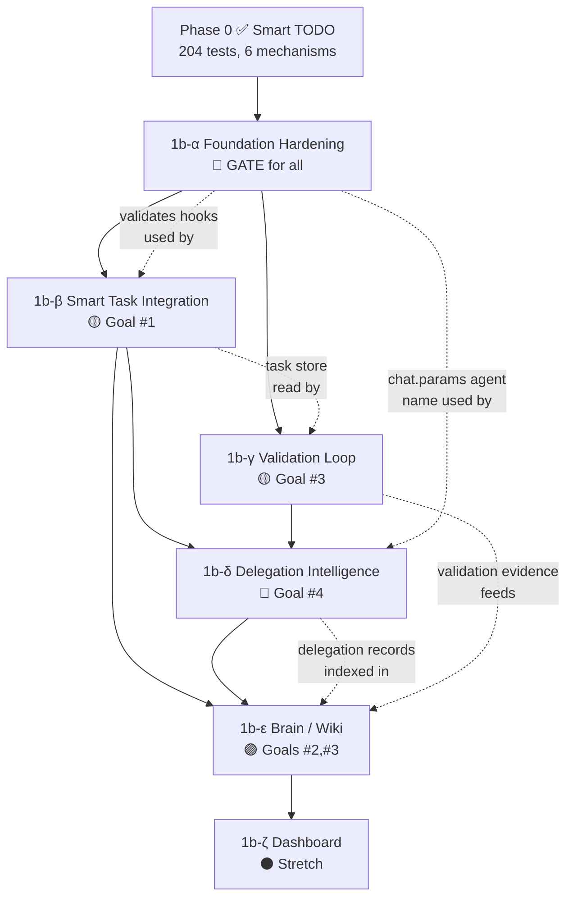

# Phase 1b Master Plan — Integration & Intelligence

**Status:** DRAFT v2 — AGENTS.md updated, plan iterated, pending final review  
**Date:** 2026-02-07  
**Prerequisite:** Phase 0 (Smart TODO) ✅ — 204/204 tests, 0 type errors  
**SOT:** [STRATEGIC-PLANNING-PROMPT.md](file:///Users/apple/Documents/coding-projects/idumb/v2/STRATEGIC-PLANNING-PROMPT.md)  
**SDK Truth:** [Hooks interface](file:///Users/apple/Documents/coding-projects/idumb/v2/node_modules/@opencode-ai/plugin/dist/index.d.ts#L108-L220) — 13 hooks verified  
**Ground Truth (updated):** [AGENTS.md v3.0.0](file:///Users/apple/Documents/coding-projects/idumb/v2/AGENTS.md) — reflects Phase 0 completion, 204 tests, full pipeline diagram

---

## SDK-Verified Hook Registry (Ground Truth)

> [!CAUTION]
> All plans MUST reference hooks from this table. Do NOT assume hooks exist without checking here first.

| Hook | Input | Output | Status |
|------|-------|--------|--------|
| [event](file:///Users/apple/Documents/coding-projects/idumb/v2/src/index.ts#51-61) | `{ event: Event }` | void | ✅ Validated |
| `chat.message` | `{ sessionID, agent?, model?, messageID?, variant? }` | `{ message, parts }` | **NOT REGISTERED** — available but unused |
| `chat.params` | `{ sessionID, agent, model, provider, message }` | `{ temperature, topP, topK, options }` | **NOT REGISTERED** — agent name available here |
| `tool.execute.before` | `{ tool, sessionID, callID }` | `{ args }` | ✅ Validated |
| `tool.execute.after` | `{ tool, sessionID, callID }` | `{ title, output, metadata }` | ✅ Validated |
| `command.execute.before` | `{ command, sessionID, arguments }` | `{ parts }` | **NOT REGISTERED** — could intercept commands |
| `experimental.session.compacting` | `{ sessionID }` | `{ context: string[], prompt? }` | ⚠️ Unit-tested, not live-verified |
| `experimental.chat.system.transform` | `{ sessionID?, model }` | `{ system: string[] }` | ⚠️ Registered, not live-verified |
| `experimental.chat.messages.transform` | `{}` (empty!) | `{ messages: { info, parts }[] }` | ⚠️ Registered, not live-verified |
| `experimental.text.complete` | `{ sessionID, messageID, partID }` | `{ text }` | **NOT REGISTERED** — text completion injection |
| `permission.ask` | `Permission` | `{ status }` | **NOT REGISTERED** — could auto-allow |
| `config` | `Config` | void | **NOT REGISTERED** |
| `shell.env` | `{ cwd }` | `{ env }` | **NOT REGISTERED** |

> [!IMPORTANT]
> **Key discovery:** `chat.params` has a mandatory `agent` field and fires BEFORE `tool.execute.before`. This solves the role detection race (GAP-ANALYSIS §1.2) without waiting for `chat.message`. Must register in Phase 1b-α.

---

## Existing Pipeline (What's Already Built and Working)

> [!IMPORTANT]
> Phase 1b integrates INTO the existing pipeline. It does NOT replace or duplicate it.

### The Init → Config → Meta-Builder → Agents Flow

```
npx idumb-v2 init  (CLI: interactive prompts for language/governance/experience/scope)
    │
    ├── config.json created ──→ .idumb/config.json (read FIRST on every session)
    │   ├── language: "en" | "vi"
    │   ├── governance: "balanced" | "strict" | "autonomous"
    │   ├── experience: "beginner" | "guided" | "expert"
    │   └── scope: "project" | "global"
    │
    ├── Plugin hook registration ──→ opencode.json (plugin path auto-added)
    │   ├── tool.execute.before (tool-gate.ts — blocks write without task)
    │   ├── tool.execute.after (defense-in-depth)
    │   ├── experimental.session.compacting (anchor injection)
    │   ├── experimental.chat.system.transform (governance inject — UNVERIFIED)
    │   └── experimental.chat.messages.transform (DCP pruning — UNVERIFIED)
    │
    ├── Agents deployed ──→ .opencode/agents/
    │   └── idumb-meta-builder.md (3-phase orchestrator, full permissions)
    │
    ├── Commands deployed ──→ .opencode/commands/
    │   ├── idumb-init.md (routes to meta-builder, Phase 1 greeting)
    │   ├── idumb-settings.md (routes to meta-builder, config editor)
    │   └── idumb-status.md (routes to meta-builder, governance overview)
    │
    ├── Module templates deployed ──→ .idumb/idumb-modules/
    │   ├── agents/supreme-coordinator-profile.md (read-only reference)
    │   ├── agents/builder-profile.md
    │   ├── agents/validator-profile.md
    │   ├── agents/skills-creator-profile.md
    │   ├── schemas/agent-contract.md (OpenCode YAML frontmatter spec)
    │   ├── commands/command-template.md
    │   └── workflows/workflow-template.md
    │
    └── Meta-builder runs 3 phases in OpenCode:
        Phase 1: Greeting (read-only → findings → menu → STOP)
        Phase 2: Deep scan + create 4 agents in .opencode/agents/ → STOP
        Phase 3: Full intelligence + skill discovery + handoff to coordinator
```

### What This Means for Phase 1b

| Existing Component | Phase 1b Integration | Phase |
|----|----|----||
| Coordinator uses `todowrite`/`todoread` | β-1/β-2 transparently redirect to Smart TODO | β |
| 4 sub-agent profiles in [templates.ts](file:///Users/apple/Documents/coding-projects/idumb/v2/src/templates.ts) | δ-5 enhances, NOT recreates these | δ |
| [config.json](file:///Users/apple/Documents/coding-projects/idumb/v2/tsconfig.json) → governance mode | α-2 default role uses governance mode | α |
| Meta-builder Phase 2 creates agents | γ-4 validator profile ENHANCES existing template | γ |
| Agent contract schema in idumb-modules | δ-1 hierarchy schema extends, doesn't conflict | δ |
| Skills-creator profile uses skills.sh | ε-6 coordinator reads brain BEFORE delegating | ε |
| `.idumb/` tree scaffolded by init | All phases write INTO existing tree (brain/, governance/) | ALL |

---

## Dependency Graph (Cross-Phase Relationships)



**Reading the graph:** Solid arrows = hard dependency. Dotted arrows = data flow relationship.

---

# Phase 1b-α: Foundation Hardening

**Priority:** 🔴 CRITICAL — gate for all subsequent phases  
**Effort:** 1–2 sessions  
**Relationships:** ← Phase 0 | → ALL phases depend on this

---

## α Plan

Fix 4 critical gaps from [GAP-ANALYSIS.md](file:///Users/apple/Documents/coding-projects/idumb/v2/GAP-ANALYSIS.md) + register 2 new SDK hooks that unlock downstream features.

| What | Why | Relationship |
|------|-----|-------------|
| Register `chat.params` hook | Captures `agent` name before tool calls = role detection | → β (assignee auto-detect), → δ (hierarchy enforcement) |
| Default role to `builder` not `meta` | PP-02: First tool call before `chat.message` = allow-all race | → α (prerequisite for safe testing) |
| Live-verify 3 experimental hooks | PP-07: May not fire in real OpenCode | → β,γ,ε (features depend on hooks working) |
| Spike compaction anchor survival | μ2: Unproven hypothesis | → ε (brain depends on anchor durability) |

## α Task List

| # | Task | Requirement | Files | Sequential? |
|---|------|-------------|-------|-------------|
| α-1 | Register `chat.params` hook in [index.ts](file:///Users/apple/Documents/coding-projects/idumb/v2/src/index.ts) — capture `agent` to [SessionState](file:///Users/apple/Documents/coding-projects/idumb/v2/src/lib/persistence.ts#26-30) | SDK confirms: `input.agent` is mandatory, fires before `tool.execute.before` | [index.ts](file:///Users/apple/Documents/coding-projects/idumb/v2/src/index.ts), [persistence.ts](file:///Users/apple/Documents/coding-projects/idumb/v2/src/lib/persistence.ts) | Can start immediately |
| α-2 | Default role to `builder` when `chat.params` hasn't fired yet | PP-02 fix: change `agentRole \|\| "meta"` → `agentRole \|\| "builder"` | [tool-gate.ts](file:///Users/apple/Documents/coding-projects/idumb/v2/src/hooks/tool-gate.ts) | After α-1 |
| α-3 | Live-verify `experimental.session.compacting` fires | Check [.opencode/idumb/logs/hook-verification.log](file:///Users/apple/Documents/coding-projects/idumb/v2/.opencode/idumb/logs/hook-verification.log) | Manual test | After build |
| α-4 | Live-verify `experimental.chat.system.transform` fires | Same log check | Manual test | Parallel with α-3 |
| α-5 | Live-verify `experimental.chat.messages.transform` fires | Note: SDK input is `{}` (empty!) — our hook may mishandle | Manual test | Parallel with α-3 |
| α-6 | Spike: 3 anchors → trigger compaction → verify LLM references ≥1 | μ2 hypothesis test | Manual test + log analysis | After α-3 confirms hook fires |
| α-7 | Write SPIKE-RESULTS.md (DP-01: only AFTER testing) | Document which hooks fire, which don't, pivot decisions | [NEW] planning/SPIKE-RESULTS.md | Last |

## α Success Criteria + Dependencies

| Criterion | Depends On |
|-----------|-----------|
| `npm run typecheck` → 0 errors | — |
| `npm test` → 204+ pass (no regressions + new `chat.params` test) | α-1, α-2 |
| `chat.params` captures agent name before first tool call | α-1 (must register hook) |
| All 3 experimental hooks confirmed firing OR documented as non-functional | α-3,4,5 (live testing required) |
| Compaction spike: LLM references ≥1/3 anchors post-compaction | α-6 (requires α-3 to pass) |
| SPIKE-RESULTS.md written with evidence | α-7 (requires all manual tests) |

**Pivot Criteria:**

| If... | Then... |
|-------|---------|
| `experimental.session.compacting` doesn't fire | Try `output.prompt` replacement instead of `output.context.push()` |
| `experimental.chat.system.transform` doesn't fire | Use `tool.execute.after` to inject governance reminder into every tool response |
| `experimental.chat.messages.transform` doesn't fire | Skip DCP pruning — rely on compaction instead |
| Anchor survival < 30% | Increase budget 2000→4000 chars OR switch to XML format |

---

## α Real-Life Test Cases

### TC-α1: Agent Name Capture via `chat.params`

**When I use** OpenCode with iDumb plugin installed and start any session where an agent responds:

**I expect:**
1. [.opencode/idumb/logs/hook-verification.log](file:///Users/apple/Documents/coding-projects/idumb/v2/.opencode/idumb/logs/hook-verification.log) shows `HOOK FIRED: chat.params { agent: "Build" }` (or whichever agent name)
2. The very next `tool.execute.before` log entry shows the captured agent name in session state
3. The agent name appears in `idumb_status` output under `SESSION`

**It proves:**
- `chat.params` fires BEFORE `tool.execute.before` (SDK guarantee: `agent` is mandatory)
- Role detection race (GAP §1.2) is eliminated — no more defaulting to `meta`
- Phase 1b-β auto-assignee (β-3) has a working data source
- Phase 1b-δ hierarchy enforcement has agent identity at tool-call time

### TC-α2: Tool-Gate Default Role Safety

**When I use** OpenCode with the plugin and an agent makes its very first tool call (write/edit) before `chat.params` has fired (edge case, e.g. tool call in system prompt evaluation):

**I expect:**
1. Tool-gate defaults to `builder` role (NOT `meta`)
2. Write is BLOCKED because `builder` without active task is blocked
3. Block message says: `GOVERNANCE BLOCK: write denied`

**It proves:**
- PP-02 is fixed — no allow-all window at session start
- Even in the race-condition edge case, governance is enforced
- The priority chain is: `chat.params agent` → default `builder` → never `meta`

### TC-α3: Compaction Anchor Survival (Spike)

**When I use:**
1. `idumb_task action=create_epic name="Spike Test"`
2. `idumb_task action=create_task name="Test anchors"`
3. `idumb_task action=start task_id=<task-id>`
4. `idumb_anchor add type=decision priority=critical content="Always use PostgreSQL for persistence"`
5. `idumb_anchor add type=context priority=high content="Auth module uses JWT with 15min expiry"`
6. `idumb_anchor add type=context priority=normal content="Readme needs updating"`
7. Continue chatting until compaction triggers (or `/compact`)
8. Ask: "What database are we using and why?"

**I expect:**
1. LLM answer references "PostgreSQL" (the critical anchor)
2. Possibly references "JWT" (the high anchor)
3. May NOT reference "Readme" (normal priority, may be pruned)
4. [.opencode/idumb/logs/hook-verification.log](file:///Users/apple/Documents/coding-projects/idumb/v2/.opencode/idumb/logs/hook-verification.log) shows `HOOK FIRED: experimental.session.compacting`

**It proves:**
- The compaction hook fires in live OpenCode
- `output.context.push()` actually injects into post-compaction prompt
- Priority-based anchor selection works (critical > high > normal)
- Phase 1b-ε brain can rely on anchor data surviving compaction
- The μ2 hypothesis from STRATEGIC-PLANNING-PROMPT.md is validated

---

# Phase 1b-β: Smart Task Deep Integration

**Priority:** 🟡 HIGH — Goal #1 (replace OpenCode TODOs)  
**Effort:** 2–3 sessions  
**Relationships:** ← α (needs live hook verification + `chat.params`) | → δ (task store feeds delegation), → ε (task evidence feeds brain)

---

## β Plan

| What | Why | Relationship |
|------|-----|-------------|
| Intercept `todowrite`/`todoread` in tool-gate | Replace OpenCode's flat TODO with Smart TODO hierarchy | → γ (validation loop operates on these tasks) |
| Auto-assign agent from `chat.params` captured name | Tasks know which agent created them | ← α-1 (`chat.params` registered), → δ (delegation uses assignee) |
| Add `prerequisites` to Task schema | Block task start if dependencies incomplete | → γ (validation checks prerequisites) |
| Inject active task chain into compaction + system hooks | Agents always know current task state | ← α-3,4 (hooks must fire) |

> [!WARNING]
> `todowrite` interception: If this breaks agent workflows (agents can't create normal TODOs), make it configurable. Default: ON but with escape hatch `idumb_task action=bypass`.

## β Task List

| # | Task | Requirement | Files |
|---|------|-------------|-------|
| β-1 | Intercept `todowrite` in `tool.execute.before` → redirect to `idumb_task(create_task)` | Map: `todowrite({content})` → `idumb_task({action:"create_task", name:content})` | [tool-gate.ts](file:///Users/apple/Documents/coding-projects/idumb/v2/src/hooks/tool-gate.ts) |
| β-2 | Intercept `todoread` → redirect to `idumb_task(status)` | Return formatted task hierarchy | [tool-gate.ts](file:///Users/apple/Documents/coding-projects/idumb/v2/src/hooks/tool-gate.ts) |
| β-3 | Auto-assign agent name from `chat.params` captured `agent` on task create/start | `task.assignee = sessionState.capturedAgent` | [task.ts tool](file:///Users/apple/Documents/coding-projects/idumb/v2/src/tools/task.ts), [persistence.ts](file:///Users/apple/Documents/coding-projects/idumb/v2/src/lib/persistence.ts) |
| β-4 | Add `prerequisites: string[]` field to Task schema | Optional array of task IDs that must be `completed` before this task can `start` | [task.ts schema](file:///Users/apple/Documents/coding-projects/idumb/v2/src/schemas/task.ts) |
| β-5 | Block `start` action if prerequisites incomplete | Check all prerequisite task IDs are status=`completed` | [task.ts tool](file:///Users/apple/Documents/coding-projects/idumb/v2/src/tools/task.ts) |
| β-6 | Inject active task chain into compaction context | On compaction: push `"Active: Epic X → Task Y (3/5 subtasks)"` | [compaction.ts](file:///Users/apple/Documents/coding-projects/idumb/v2/src/hooks/compaction.ts) |
| β-7 | Inject task context into system prompt (if hook fires per α) | Agents always see current epic/task/subtask state | [system.ts](file:///Users/apple/Documents/coding-projects/idumb/v2/src/hooks/system.ts) |

## β Success Criteria + Dependencies

| Criterion | Depends On |
|-----------|-----------|
| `todowrite` intercepted → creates idumb task instead | α (hooks verified), β-1 |
| `todoread` returns Smart TODO hierarchy | β-2 |
| Agent name auto-assigned on task create | α-1 (`chat.params`), β-3 |
| Prerequisites block `start` if deps incomplete | β-4, β-5 |
| Compaction context includes active task chain | α-3 (compaction hook fires), β-6 |
| 204+ tests pass + new tests for β-1→β-5 | All β tasks |

## β Real-Life Test Cases

### TC-β1: TODO Interception End-to-End

**When I use** OpenCode with iDumb plugin and ask the agent: "Create a TODO to refactor the login form"

**I expect:**
1. Agent calls `todowrite` (OpenCode's built-in) — tool-gate intercepts
2. Instead of creating a flat OpenCode TODO, it creates an `idumb_task` with `name="refactor the login form"` under the active epic
3. `idumb_status` shows the task in the hierarchy tree
4. `.idumb/brain/tasks.json` contains the new task

**It proves:**
- TODO interception works transparently — agent doesn't know it's using Smart TODO
- The mapping `todowrite(content)` → `idumb_task(create_task, name)` is correct
- Zero-friction migration from OpenCode's flat TODOs to hierarchical governance
- Phase 1b-γ validation loop will operate on these intercepted tasks

### TC-β2: Agent Auto-Assignee

**When I use** OpenCode with the [Build](file:///Users/apple/Documents/coding-projects/idumb/v2/src/templates.ts#14-232) agent and create a task:

**I expect:**
1. `chat.params` fires with `agent: "Build"`
2. Task is created with `assignee: "Build"` automatically
3. `idumb_status` shows: `🔄 Refactor login [Build]`

**It proves:**
- `chat.params` → `SessionState.capturedAgent` → `task.assignee` pipeline works
- No manual `idumb_task action=assign` needed
- Phase 1b-δ delegation tracking can identify which agent owns each task

---

# Phase 1b-γ: Validation Loop (μ4)

**Priority:** 🟡 HIGH — Core intelligence mechanism  
**Effort:** 2 sessions  
**Relationships:** ← α (needs hooks), ← β (operates on task store) | → δ (validation evidence feeds delegation), → ε (evidence feeds brain)

---

## γ Plan

| What | Why | Relationship |
|------|-----|-------------|
| Track `validationState` on each Task | Loop count, gaps, validator report | → ε (validation history stored in brain) |
| Self-check checklist injection on complete | Force re-examination from subtask names | ← β-4 (subtasks define checklist) |
| [validate](file:///Users/apple/Documents/coding-projects/idumb/v2/src/schemas/task.ts#192-222) action on `idumb_task` | Explicit trigger for validation cycle | ← Phase 0 (complete action already blocks) |
| Max 3 loop with user escalation | Prevent infinite validation loops | → δ (escalation triggers delegation) |
| Evidence quality heuristic | Score: length, file refs, test mentions | → ε (confidence scoring in brain) |

> [!NOTE]
> γ-4 (validator agent profile) is governance via [.md](file:///Users/apple/Documents/coding-projects/idumb/v2/CLAUDE.md) file, NOT hooks. This works around PP-01 (subagent hooks don't fire). The validator is instructed in its profile to read task state and produce gap reports.

## γ Task List

| # | Task | Requirement | Files |
|---|------|-------------|-------|
| γ-1 | Add `validationState` to Task interface | `{ loopCount: number, gaps: string[], lastCheckAt: number }` | [task.ts schema](file:///Users/apple/Documents/coding-projects/idumb/v2/src/schemas/task.ts) |
| γ-2 | On `complete` action: inject self-check checklist from subtask names | Build markdown checklist, append to response before marking complete | [task.ts tool](file:///Users/apple/Documents/coding-projects/idumb/v2/src/tools/task.ts) |
| γ-3 | Add [validate](file:///Users/apple/Documents/coding-projects/idumb/v2/src/schemas/task.ts#192-222) action to `idumb_task` | Agent triggers: `idumb_task action=validate target_id=<task>` → returns gap analysis | [task.ts tool](file:///Users/apple/Documents/coding-projects/idumb/v2/src/tools/task.ts) |
| γ-4 | Create `idumb-validator` agent profile | Read-only, analysis-focused. Reads task store, produces gap reports. | [NEW] .opencode/agents/ via templates.ts |
| γ-5 | Max 3 loop enforcement with user escalation | `loopCount >= 3` → "Validation incomplete. Review manually." | [task.ts tool](file:///Users/apple/Documents/coding-projects/idumb/v2/src/tools/task.ts) |
| γ-6 | Evidence quality heuristic scoring | Score 0-100: length>50 (+20), file paths (+30), test results (+30), line numbers (+20) | [task.ts schema](file:///Users/apple/Documents/coding-projects/idumb/v2/src/schemas/task.ts) |

## γ Success Criteria + Dependencies

| Criterion | Depends On |
|-----------|-----------|
| `complete` without evidence → blocked with checklist | Phase 0 (already implemented), γ-2 (enhanced) |
| [validate](file:///Users/apple/Documents/coding-projects/idumb/v2/src/schemas/task.ts#192-222) action returns structured gap report | γ-3 |
| Loop count increments on each validation attempt | γ-1, γ-5 |
| After 3 failed loops → escalation message | γ-5 |
| Evidence quality score calculated | γ-6 |
| All tests pass + new γ tests | All γ tasks |

## γ Real-Life Test Case

### TC-γ1: Validation Loop Catches Real Gap

**When I use:**
1. Create epic + task with 3 subtasks: "Add form", "Add validation", "Write tests"
2. Start the task
3. Complete subtask "Add form" with evidence
4. Try to complete the TASK without completing the other 2 subtasks

**I expect:**
1. BLOCKED: "Task has 2 pending subtasks: Add validation, Write tests"
2. Self-check checklist injected: `☐ Add validation ☐ Write tests`
3. `validationState.loopCount` incremented to 1

**Then when I** complete all subtasks but provide weak evidence ("done"):

**I expect:**
1. Evidence quality score is LOW (short text, no file paths, no test results)
2. Response includes: "⚠️ Evidence quality: 20/100. Consider adding: file paths, test results"
3. `validationState.loopCount` incremented to 2

**It proves:**
- Multi-layer validation catches both structural gaps (pending subtasks) and quality gaps (weak evidence)
- Loop counting works across multiple attempts
- The system forces genuine re-examination, not rubber-stamping
- Phase 1b-ε brain receives high-quality evidence (quality-gated)

---

# Phase 1b-δ: Delegation Intelligence

**Priority:** 🔵 ADVANCED — Goal #4  
**Effort:** 3–4 sessions  
**Relationships:** ← β (task store), ← γ (validation evidence), ← α (`chat.params`) | → ε (delegation records indexed in brain)

---

## δ Plan

| What | Why | Relationship |
|------|-----|-------------|
| Agent hierarchy schema | Define roles, permissions, delegation rules | ← `idumb-governance` skill (hierarchy already defined) |
| `delegatedTo` + `parentTaskId` on Task | Track delegation chains | ← β (Task schema), → ε (brain indexes chains) |
| Disk-persisted delegation tracking | PP-01 workaround: write to `.idumb/brain/delegations/` | → ε (brain reads delegation results) |
| `delegate` action on `idumb_task` | Explicit delegation: which agent, which task, what context | ← α (`chat.params` identifies agent) |
| Delegation skill for subagents | PP-01: subagents load governance via skill, not hooks | ← `idumb-governance` skill |
| Max depth=3 enforcement | Prevent runaway delegation chains | γ (validation catches deep chains) |

> [!CAUTION]
> PP-01 is HARD: Hooks do NOT fire for subagent tool calls. Delegation governance relies entirely on agent [.md](file:///Users/apple/Documents/coding-projects/idumb/v2/CLAUDE.md) profiles and skills. This is a fundamental platform constraint — no workaround exists until OpenCode adds subagent hook support.

## δ Task List

| # | Task | Requirement | Files |
|---|------|-------------|-------|
| δ-1 | Define hierarchy schema | `{ role, allowedActions[], canDelegateTo[], evidenceReqs }` — extends existing `SUPREME_COORDINATOR_PROFILE` permissions model | [NEW] src/schemas/hierarchy.ts |
| δ-2 | Add `delegatedTo`, `parentTaskId` to Task | Track delegation chain on tasks | [task.ts schema](file:///Users/apple/Documents/coding-projects/idumb/v2/src/schemas/task.ts) |
| δ-3 | Delegation disk persistence | Write `.idumb/brain/delegations/{id}.json` on delegate action — uses existing `.idumb/` tree from init | [NEW] src/lib/delegation.ts |
| δ-4 | Add `delegate` action to `idumb_task` | Args: `task_id`, `to_agent`, `context` | [task.ts tool](file:///Users/apple/Documents/coding-projects/idumb/v2/src/tools/task.ts) |
| δ-5 | **ENHANCE** existing 4 agent profile templates | Add delegation protocol + hierarchy awareness to existing `SUPREME_COORDINATOR_PROFILE`, `BUILDER_PROFILE`, `VALIDATOR_PROFILE`, `SKILLS_CREATOR_PROFILE` in [templates.ts](file:///Users/apple/Documents/coding-projects/idumb/v2/src/templates.ts) — DO NOT recreate from scratch | [templates.ts](file:///Users/apple/Documents/coding-projects/idumb/v2/src/templates.ts) |
| δ-6 | Create delegation skill for subagents | PP-01 workaround: subagents load governance via SKILL.md, not hooks. Uses skills.sh format from existing `SKILLS_CREATOR_PROFILE` | [NEW] skill template in templates.ts |
| δ-7 | Delegation result reader | Parent reads child result from `.idumb/brain/delegations/{id}.json` | [delegation.ts](file:///Users/apple/Documents/coding-projects/idumb/v2/src/lib/delegation.ts) |
| δ-8 | Max depth=3 enforcement | Block delegation if chain already 3 deep | [task.ts tool](file:///Users/apple/Documents/coding-projects/idumb/v2/src/tools/task.ts) |

## δ Success Criteria + Dependencies

| Criterion | Depends On |
|-----------|-----------|
| Hierarchy schema defines 4 roles with permissions | δ-1 |
| Delegation creates disk record | δ-3 (needs `.idumb/brain/` exists from init) |
| Parent reads child delegation result | δ-3, δ-7 |
| Max depth=3 enforced | δ-8, δ-2 (chain tracking) |
| Subagent receives governance skill | δ-6 (profile-based, not hook-based) |
| All tests pass + new delegation tests | All δ tasks |

## δ Real-Life Test Case

### TC-δ1: Delegation Tracking Round-Trip

**When I use:**
1. Create epic "Build auth" with task "Login form"
2. Start task as `Build` agent (auto-assigned via `chat.params`)
3. `idumb_task action=delegate task_id=<task> to_agent=validator context="Check form accessibility"`

**I expect:**
1. `.idumb/brain/delegations/<delegation-id>.json` created with: `{ fromAgent: "Build", toAgent: "validator", taskId, context, status: "pending" }`
2. Task shows `delegatedTo: "validator"` in status
3. When validator completes, parent reads result from disk

**It proves:**
- PP-01 workaround works: delegation is tracked on DISK not in hooks
- Parent-child task linking via `parentTaskId`
- The delegation skill (δ-6) gives subagents enough context to self-govern
- Phase 1b-ε brain can index delegation history

---

# Phase 1b-ε: Brain / Wiki Schema

**Priority:** 🟣 MEDIUM — Goals #2, #3  
**Effort:** 2–3 sessions  
**Relationships:** ← β (task evidence), ← γ (validated evidence), ← δ (delegation results) | → ζ (dashboard reads brain)

---

## ε Plan

| What | Why | Relationship |
|------|-----|-------------|
| Brain schema with validation | `{ id, type, content, source, confidence, relatedTo[] }` | ← γ (evidence quality → confidence), → ζ (dashboard renders) |
| Auto-populate from anchors + task evidence | When anchor consumed or task completed, write brain entry | ← Phase 0 (anchor system), ← β (task completion) |
| `idumb_brain` tool (read-only query) | Agents query: `idumb_brain query="auth"` → relevant entries | **Tool count: 5 of 5 MAX (DO-08)** |
| Relationship graph between entries | Entries link to related entries | → ζ (graph visualization) |

> [!IMPORTANT]
> Adding `idumb_brain` fills the 5-tool maximum (DO-08). If a 6th tool is ever needed, `idumb_status` must merge into `idumb_task action=status` to free a slot. **Sequential decision: evaluate after implementing ε-4.**

## ε Task List

| # | Task | Requirement | Files |
|---|------|-------------|-------|
| ε-1 | Brain entry schema | `{ id, type, content, source, createdAt, confidence, relatedTo[] }` | [NEW] src/schemas/brain.ts |
| ε-2 | Brain persistence | Read/write `.idumb/brain/knowledge.json` via StateManager | [persistence.ts](file:///Users/apple/Documents/coding-projects/idumb/v2/src/lib/persistence.ts), [NEW] src/lib/brain.ts |
| ε-3 | Auto-populate from anchor decisions | On anchor of type `decision` → create brain entry | [compaction.ts](file:///Users/apple/Documents/coding-projects/idumb/v2/src/hooks/compaction.ts), brain.ts |
| ε-4 | Auto-populate from task completion evidence | On task complete with quality score > 50 → extract learning | [task.ts tool](file:///Users/apple/Documents/coding-projects/idumb/v2/src/tools/task.ts), brain.ts |
| ε-5 | `idumb_brain` tool | Read-only query: `idumb_brain query="topic"` → returns matching entries | [NEW] src/tools/brain.ts |
| ε-6 | Supreme-coordinator profile reads brain | Agent `.md` instructs: "Before planning, query `idumb_brain`" | templates.ts |
| ε-7 | Relationship graph | Entries can reference related entries via `relatedTo: string[]` | brain.ts schema |

## ε Success Criteria + Dependencies

| Criterion | Depends On |
|-----------|-----------|
| Brain schema validates entries | ε-1 |
| Auto-populate from anchors | ε-3 (needs anchor system from Phase 0) |
| Auto-populate from task evidence | ε-4 (needs γ evidence quality scoring) |
| `idumb_brain` query returns relevant entries | ε-5 |
| Tool count ≤ 5 | ε-5 (verify DO-08) |

---

# Phase 1b-ζ: Interactive Dashboard (Stretch)

**Priority:** ⚫ LOW — Goal #5  
**Effort:** 3–5 sessions  
**Relationships:** ← ALL previous phases | → user-facing visualization

Deferred until α→ε stable. See original plan for details.

---

## Subagent Output Prompts

> [!NOTE]
> These are ready-to-use prompts for specialist subagents to create the commands, skills, and agent profiles needed. Each prompt specifies controlled values, relationships, schema requirements, and quality criteria.

### Prompt 1: Create `idumb-validator` Agent Profile (for γ-4)

```
Create an OpenCode agent profile at .opencode/agents/idumb-validator.md with these exact specifications:

Format: YAML frontmatter + markdown body (OpenCode format)
---
name: idumb-validator
description: "Read-only validation agent. Analyzes task completion evidence and produces gap reports."
model: default
mode: all
hidden: true
tools:
  "*": false
  idumb_task: true
  idumb_status: true
  idumb_anchor: true
  Read: true
  Glob: true
  Grep: true
permissions:
  allow:
    - "cat *"
    - "ls *"
    - "grep *"
    - "npm test"
    - "npm run typecheck"
  deny:
    - "rm *"
    - "mv *"
    - "git push *"
---

Role: VALIDATOR (Level 3 in idumb hierarchy)
Context: Read-only agent that validates work quality
Requirements:
- NEVER write or edit files
- ALWAYS check idumb_status before validating
- Return structured evidence: { check, status, evidence, details }
- Score evidence quality: length>50, file paths, test results, line numbers
- Report gaps as actionable items with specific fix suggestions

Relationships:
- Reports TO: idumb-high-governance (Level 2)
- Receives FROM: idumb-builder (Level 4) via delegation
- Reads: task store, anchors, source files
- Writes: NOTHING (read-only)
```

### Prompt 2: Create `idumb-delegation` Skill (for δ-6)

```
Create an OpenCode skill at .agents/skills/idumb-delegation/SKILL.md with these specifications:

---
name: idumb-delegation
description: "Governance context for delegated subagents. Read this before executing delegated work."
---

Content requirements:
1. How to read your delegation context from .idumb/brain/delegations/<id>.json
2. The 4-role hierarchy: supreme-coordinator > planner > builder > validator
3. Permission matrix per role (which tools allowed)
4. Evidence requirements: what must be returned to parent
5. Return format: { action, files[], status, changes, evidence }
6. Rules: NEVER modify outside scope, ALWAYS check task state, ALWAYS provide evidence

Schema references:
- Task: { id, epicId, name, status, assignee, evidence, subtasks[] }
- Delegation record: { id, fromAgent, toAgent, taskId, context, status, result? }
- Evidence quality: score 0-100 based on length, file refs, test mentions
```

### Prompt 3: Create `chat.params` Hook Handler (for α-1)

```
Create a hook handler function createChatParamsHook in src/hooks/ that:

SDK contract (from @opencode-ai/plugin Hooks interface line 136-147):
Input: { sessionID: string, agent: string, model: Model, provider: ProviderContext, message: UserMessage }
Output: { temperature: number, topP: number, topK: number, options: Record<string, any> }

Implementation:
1. Capture input.agent name into SessionState via stateManager
2. Add `capturedAgent: string | null` field to SessionState in persistence.ts
3. Log: verifyLog.info("HOOK FIRED: chat.params", { agent: input.agent, sessionID: input.sessionID })
4. Do NOT modify output (no temperature/topP changes)
5. TUI safety: NO console.log, use file logger only
6. try/catch wrapper (P3: graceful degradation)

Integration points:
- persistence.ts: Add capturedAgent to SessionState
- index.ts: Register "chat.params" hook alongside existing hooks
- tool-gate.ts: Read capturedAgent from session state for role detection
```

---

## AGENTS.md Updates ✅ DONE

> [!TIP]
> `AGENTS.md` updated to v3.0.0 on 2026-02-07. Corrected test count (204/204), added task.ts schema + tests, full pipeline diagram, integration points table, available-but-unregistered hooks table, α→ζ roadmap, ~7500 LOC total.

---

## TODO (Task Tracker)

- [x] Phase 0 complete — 204/204 tests, 0 type errors
- [x] Integration verification — walkthrough.md confirmed all wiring
- [x] AGENTS.md updated to v3.0.0
- [/] Phase 1b planning — this document
  - [x] Read skills, ground truth, SDK Hooks interface
  - [x] Identified existing pipeline integration points
  - [x] Read full templates.ts (867 LOC) and deploy.ts (250 LOC)
  - [x] Write restructured plan v2 with pipeline integration
  - [ ] User review of this plan
- [ ] Phase 1b-α execution (BLOCKED: awaiting plan approval)

---

## Next-In-Line Agent Instructions

When a new session continues from this plan:

1. **Read** this file (`implementation_plan.md`) — it is the SOT for Phase 1b
2. **Read** [AGENTS.md](file:///Users/apple/Documents/coding-projects/idumb/v2/AGENTS.md) — verify it's been updated
3. **Run** `npm run typecheck && npm test` — confirm 204/204 baseline
4. **Start Phase 1b-α** — begin with α-1 (register `chat.params` hook)
5. **Schema-first**: create/modify `schemas/` types BEFORE tool implementations
6. **Test each task**: run `npm test` after each α task completes
7. **Live test after α-1→α-2**: build plugin, install in OpenCode, verify TC-α1 and TC-α2
8. **Spike test α-6**: only after confirming hooks fire
9. **Write SPIKE-RESULTS.md last** (DP-01: document only after testing)
10. **Update this plan**: mark α tasks as complete, document any pivots

**Prompt for next agent:**
> "Continue Phase 1b-α from implementation_plan.md. Start with α-1: register `chat.params` hook using the SDK schema from Hooks interface line 136-147. Schema-first: add `capturedAgent` to `SessionState` in persistence.ts before creating the hook handler. After α-1 and α-2, do a live test build and verify TC-α1."
