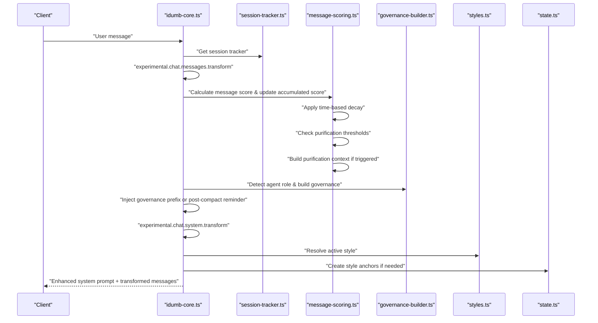
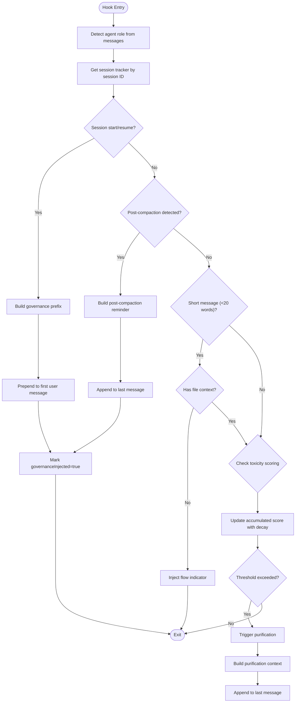
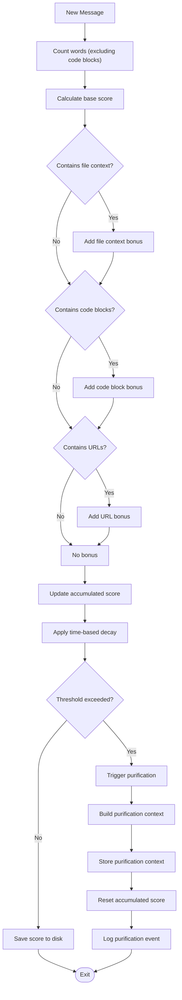
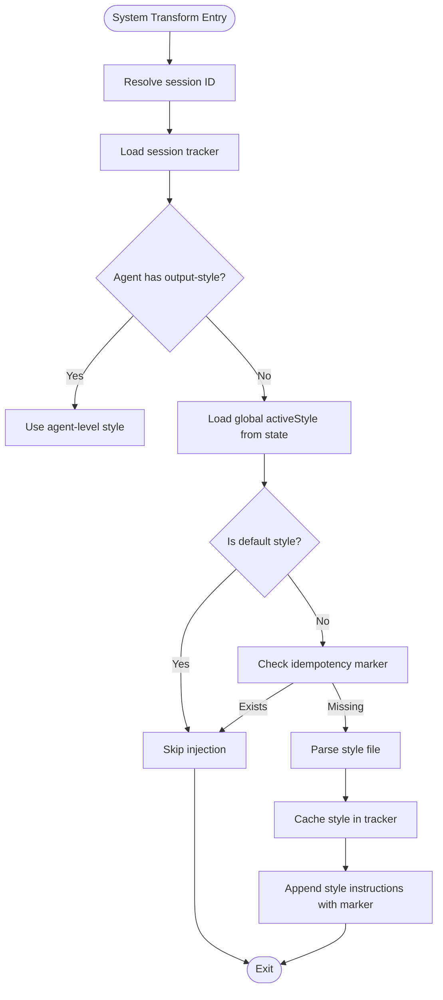
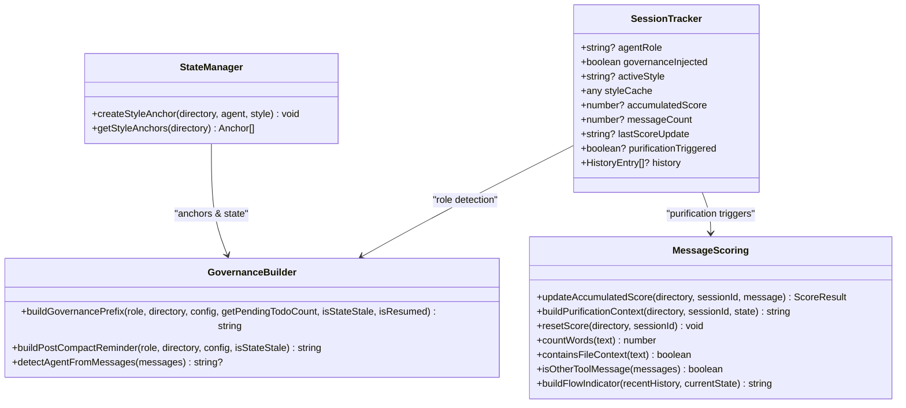
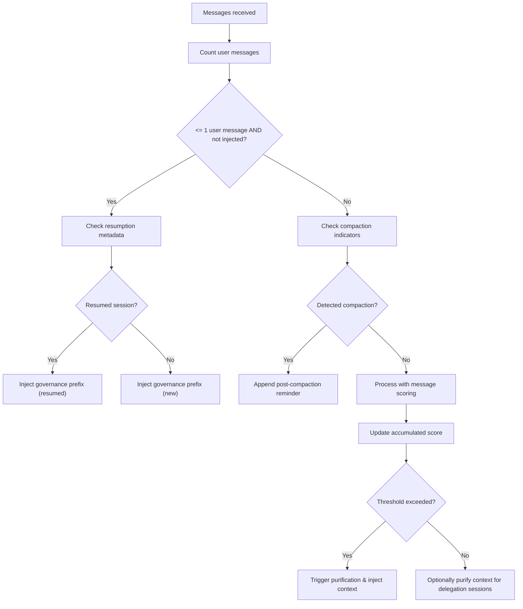
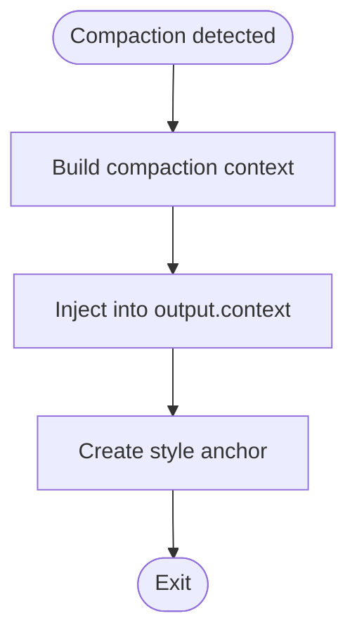
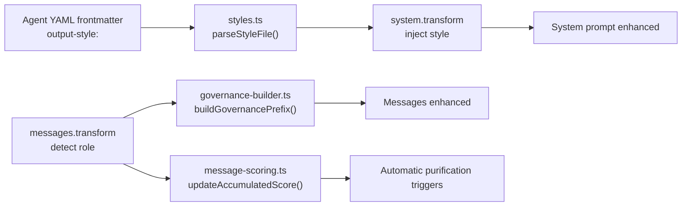
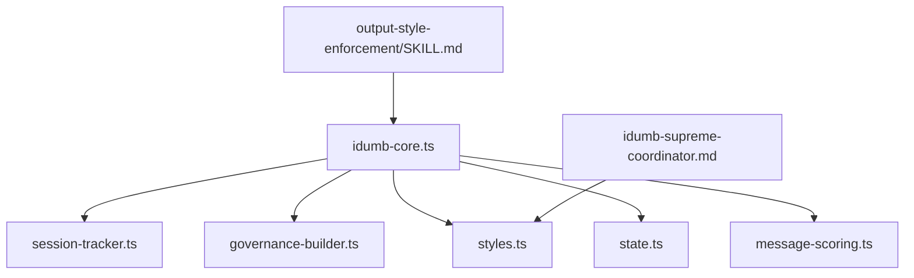
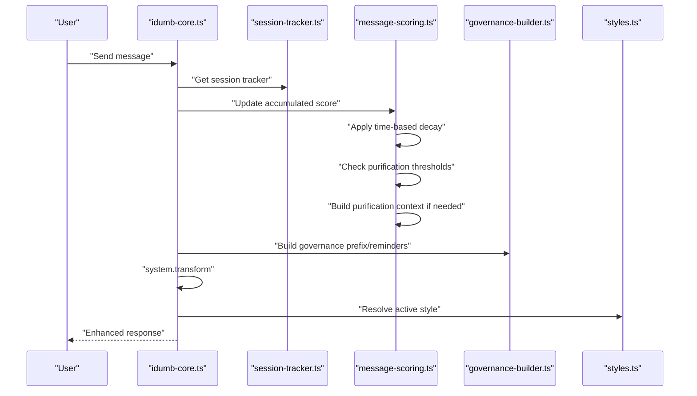

# Message Transform Hooks

<cite>
**Referenced Files in This Document**
- [idumb-core.ts](file://src/plugins/idumb-core.ts)
- [session-tracker.ts](file://src/plugins/lib/session-tracker.ts)
- [governance-builder.ts](file://src/plugins/lib/governance-builder.ts)
- [styles.ts](file://src/plugins/lib/styles.ts)
- [state.ts](file://src/plugins/lib/state.ts)
- [message-scoring.ts](file://src/plugins/lib/message-scoring.ts)
- [IMPLEMENTATION-GUIDE.md](file://docs/IMPLEMENTATION-GUIDE.md)
- [NEW-SESSION-VALIDATION.md](file://.plugin-dev/research/NEW-SESSION-VALIDATION.md)
- [MESSAGE-INTERCEPTION-SPEC.md](file://.plugin-dev/research/MESSAGE-INTERCEPTION-SPEC.md)
- [SESSION-STATES-RESEARCH-2026-02-04.md](file://.plugin-dev/research/SESSION-STATES-RESEARCH-2026-02-04.md)
- [checkpoint.ts](file://src/plugins/lib/checkpoint.ts)
- [idumb-supreme-coordinator.md](file://src/agents/idumb-supreme-coordinator.md)
- [output-style-enforcement/SKILL.md](file://src/skills/output-style-enforcement/SKILL.md)
</cite>

## Update Summary
**Changes Made**
- Added comprehensive documentation for the Message Context Purification System integration
- Updated the experimental.chat.messages.transform hook to include automatic purification triggers
- Documented accumulated scoring with time-based decay functionality
- Added purification context building and injection mechanisms
- Enhanced session start detection with purification capabilities
- Added flow indicator injection for short messages
- Updated scoring thresholds to WARNING: 50, PURIFY: 100, EMERGENCY: 150

## Table of Contents
1. [Introduction](#introduction)
2. [Project Structure](#project-structure)
3. [Core Components](#core-components)
4. [Architecture Overview](#architecture-overview)
5. [Detailed Component Analysis](#detailed-component-analysis)
6. [Dependency Analysis](#dependency-analysis)
7. [Performance Considerations](#performance-considerations)
8. [Troubleshooting Guide](#troubleshooting-guide)
9. [Conclusion](#conclusion)
10. [Appendices](#appendices)

## Introduction
This document explains iDumb's message transformation hooks with a focus on two experimental hooks:
- experimental.chat.messages.transform: injects governance and context-aware reminders into chat messages, now enhanced with automatic purification triggers and flow indicator injection
- experimental.chat.system.transform: injects output style instructions into the system prompt

The system now includes a comprehensive Message Context Purification System that prevents context pollution through automatic detection, accumulated scoring with time-based decay, and intelligent purification triggers. It covers the governance injection mechanism, session start detection, post-compaction recovery patterns, message transformation pipeline, system prompt modification, and output style injection. Practical examples demonstrate implementing custom message transformers, handling session resumption, and managing context preservation across compaction events. It also documents the relationship between message transforms and agent role detection, including how different agent types receive tailored governance instructions.

## Project Structure
The message transformation system spans several modules:
- Plugin core registers and orchestrates hooks
- Session tracker maintains per-session state
- Governance builder constructs role-specific governance content
- Styles library manages output style definitions and injection
- State manager persists anchors and active style
- Message scoring system provides context purification capabilities
- Agent files define role-specific output styles
- Skills provide enforcement and remediation guidance

```mermaid
graph TB
subgraph "Plugin Layer"
CORE["idumb-core.ts<br/>Registers hooks"]
TRACKER["session-tracker.ts<br/>Per-session state"]
GOV["governance-builder.ts<br/>Governance builders"]
STYLES["styles.ts<br/>Style parsing & caching"]
STATE["state.ts<br/>Persistent state anchors"]
SCORE["message-scoring.ts<br/>Context purification system"]
END
subgraph "Agents & Skills"
AG_SCOORD["idumb-supreme-coordinator.md<br/>Agent YAML frontmatter"]
SK_ENF["output-style-enforcement/SKILL.md<br/>Style enforcement guidance"]
END
CORE --> TRACKER
CORE --> GOV
CORE --> STYLES
CORE --> STATE
CORE --> SCORE
AG_SCOORD --> STYLES
SK_ENF --> CORE
```

**Diagram sources**
- [idumb-core.ts](file://src/plugins/idumb-core.ts#L450-L650)
- [session-tracker.ts](file://src/plugins/lib/session-tracker.ts#L94-L117)
- [governance-builder.ts](file://src/plugins/lib/governance-builder.ts#L200-L346)
- [styles.ts](file://src/plugins/lib/styles.ts#L145-L165)
- [state.ts](file://src/plugins/lib/state.ts#L111-L149)
- [message-scoring.ts](file://src/plugins/lib/message-scoring.ts#L1-L464)
- [idumb-supreme-coordinator.md](file://src/agents/idumb-supreme-coordinator.md#L63-L72)
- [output-style-enforcement/SKILL.md](file://src/skills/output-style-enforcement/SKILL.md#L1-L71)

**Section sources**
- [idumb-core.ts](file://src/plugins/idumb-core.ts#L450-L650)
- [session-tracker.ts](file://src/plugins/lib/session-tracker.ts#L94-L117)
- [governance-builder.ts](file://src/plugins/lib/governance-builder.ts#L200-L346)
- [styles.ts](file://src/plugins/lib/styles.ts#L145-L165)
- [state.ts](file://src/plugins/lib/state.ts#L111-L149)
- [message-scoring.ts](file://src/plugins/lib/message-scoring.ts#L1-L464)
- [idumb-supreme-coordinator.md](file://src/agents/idumb-supreme-coordinator.md#L63-L72)
- [output-style-enforcement/SKILL.md](file://src/skills/output-style-enforcement/SKILL.md#L1-L71)

## Core Components
- experimental.chat.messages.transform: Detects session start and compaction, injects governance prefixes and post-compaction reminders, and now includes automatic purification triggers with accumulated scoring and time-based decay.
- experimental.chat.system.transform: Injects output style instructions into the system prompt, with idempotent markers and agent-level overrides.
- Session tracker: Maintains agent role, governance injection state, and per-session caches.
- Governance builder: Provides role-specific governance content and post-compaction reminders.
- Styles library: Parses style definitions, caches content, and resolves active style.
- State anchors: Persist critical context across compaction and resumption.
- Message scoring system: Provides context purification through word count detection, flow indicators, and accumulated scoring with decay.

**Section sources**
- [idumb-core.ts](file://src/plugins/idumb-core.ts#L450-L650)
- [session-tracker.ts](file://src/plugins/lib/session-tracker.ts#L94-L117)
- [governance-builder.ts](file://src/plugins/lib/governance-builder.ts#L200-L346)
- [styles.ts](file://src/plugins/lib/styles.ts#L145-L165)
- [state.ts](file://src/plugins/lib/state.ts#L111-L149)
- [message-scoring.ts](file://src/plugins/lib/message-scoring.ts#L1-L464)

## Architecture Overview
The message transformation pipeline integrates with OpenCode's hook system and now includes the Message Context Purification System. The sequence below shows how hooks interact with session state, governance, and purification mechanisms:



**Diagram sources**
- [idumb-core.ts](file://src/plugins/idumb-core.ts#L450-L650)
- [session-tracker.ts](file://src/plugins/lib/session-tracker.ts#L94-L117)
- [message-scoring.ts](file://src/plugins/lib/message-scoring.ts#L266-L388)
- [governance-builder.ts](file://src/plugins/lib/governance-builder.ts#L200-L346)
- [styles.ts](file://src/plugins/lib/styles.ts#L145-L165)
- [state.ts](file://src/plugins/lib/state.ts#L111-L149)

## Detailed Component Analysis

### Message Transform Hook: experimental.chat.messages.transform
Purpose:
- Detect session start and resumption
- Detect post-compaction contexts
- Inject governance prefixes and post-compaction reminders
- Automatically trigger context purification based on accumulated scoring
- Inject flow indicators for short messages
- Optionally purify context for delegation sessions

Key behaviors:
- Agent role detection from messages
- Session ID extraction and tracker access
- Session start detection via user message count and governance flag
- Post-compaction detection via keywords and message count
- Message scoring and purification triggers with time-based decay
- Flow indicator injection for short messages (< 20 words)
- Injection strategies:
  - Prepend governance prefix to the first user message
  - Append post-compaction reminder to the last message
  - Inject purification context when thresholds are exceeded
  - Inject flow indicators for short messages without file context
  - Optionally prepend purified context for delegation sessions



**Diagram sources**
- [idumb-core.ts](file://src/plugins/idumb-core.ts#L450-L650)
- [message-scoring.ts](file://src/plugins/lib/message-scoring.ts#L266-L388)
- [session-tracker.ts](file://src/plugins/lib/session-tracker.ts#L94-L117)
- [governance-builder.ts](file://src/plugins/lib/governance-builder.ts#L200-L346)
- [NEW-SESSION-VALIDATION.md](file://.plugin-dev/research/NEW-SESSION-VALIDATION.md#L619-L670)

**Section sources**
- [idumb-core.ts](file://src/plugins/idumb-core.ts#L450-L650)
- [message-scoring.ts](file://src/plugins/lib/message-scoring.ts#L266-L388)
- [session-tracker.ts](file://src/plugins/lib/session-tracker.ts#L94-L117)
- [governance-builder.ts](file://src/plugins/lib/governance-builder.ts#L200-L346)
- [NEW-SESSION-VALIDATION.md](file://.plugin-dev/research/NEW-SESSION-VALIDATION.md#L619-L670)

### Message Scoring and Purification System
The Message Context Purification System prevents context pollution through multiple layers of detection and intervention:

**Scoring Thresholds:**
- WARNING: 50 points - Log warning
- PURIFY: 100 points - Inject purification context
- EMERGENCY: 150 points - Emergency halt

**Score Calculation Factors:**
- Word count scoring (divided by 10, plus bonuses for >100 and >200 words)
- File context detection (patterns like filename.ext, paths, Read: outputs)
- Code block scoring (each code block adds 3 points)
- URL detection (each URL adds 2 points)

**Time-Based Decay:**
- 10% decay per hour elapsed since last update
- Applied automatically when loading existing scores
- Ensures scores don't accumulate indefinitely

**Purification Triggers:**
- Automatic purification when score reaches 100+
- Context preservation through critical anchors and recent history
- Session state checkpoint creation before purification



**Diagram sources**
- [message-scoring.ts](file://src/plugins/lib/message-scoring.ts#L266-L388)
- [message-scoring.ts](file://src/plugins/lib/message-scoring.ts#L417-L463)

**Section sources**
- [message-scoring.ts](file://src/plugins/lib/message-scoring.ts#L21-L49)
- [message-scoring.ts](file://src/plugins/lib/message-scoring.ts#L266-L388)
- [message-scoring.ts](file://src/plugins/lib/message-scoring.ts#L417-L463)

### Flow Indicator System
The system now includes intelligent flow indicators for short messages to maintain context continuity:

**Short Message Detection:**
- Messages with < 20 words are considered short
- Excludes messages with file context patterns
- Uses recent history and current state for context building

**Flow Indicator Features:**
- Current phase information
- Recent activity history (last 3 actions)
- Continuation cues for seamless conversation flow
- Agent-specific context when available

**Section sources**
- [idumb-core.ts](file://src/plugins/idumb-core.ts#L670-L694)
- [message-scoring.ts](file://src/plugins/lib/message-scoring.ts#L171-L202)

### System Transform Hook: experimental.chat.system.transform
Purpose:
- Inject output style instructions into the system prompt
- Respect idempotency and agent-level overrides
- Cache style content per session

Resolution order:
- Agent-level style from YAML frontmatter (if present)
- Global activeStyle from state.json (if not default)
- Default behavior (no extra instructions)



**Diagram sources**
- [idumb-core.ts](file://src/plugins/idumb-core.ts#L384-L445)
- [styles.ts](file://src/plugins/lib/styles.ts#L145-L165)
- [state.ts](file://src/plugins/lib/state.ts#L111-L149)

**Section sources**
- [idumb-core.ts](file://src/plugins/idumb-core.ts#L384-L445)
- [styles.ts](file://src/plugins/lib/styles.ts#L145-L165)
- [state.ts](file://src/plugins/lib/state.ts#L111-L149)

### Governance Injection Mechanism
- Role detection: Scans messages for agent identifiers to infer role.
- Prefix building: Constructs role-specific governance content including language enforcement, first-action requirements, and phase context.
- Reminder building: Creates post-compaction reminders that include language enforcement, recent history, critical anchors, and recommended next steps.
- Purification integration: Incorporates purification context into governance prefixes when purification triggers are activated.



**Diagram sources**
- [session-tracker.ts](file://src/plugins/lib/session-tracker.ts#L94-L117)
- [governance-builder.ts](file://src/plugins/lib/governance-builder.ts#L200-L346)
- [message-scoring.ts](file://src/plugins/lib/message-scoring.ts#L331-L388)
- [state.ts](file://src/plugins/lib/state.ts#L111-L149)

**Section sources**
- [session-tracker.ts](file://src/plugins/lib/session-tracker.ts#L94-L117)
- [governance-builder.ts](file://src/plugins/lib/governance-builder.ts#L200-L346)
- [message-scoring.ts](file://src/plugins/lib/message-scoring.ts#L331-L388)
- [state.ts](file://src/plugins/lib/state.ts#L111-L149)

### Session Start Detection and Resumption
- Session start: Determined by user message count and governance flag; optionally augmented by resumption detection.
- Resumption: Detected by session metadata indicating recent idle periods.
- Context purification: For non-delegation sessions, accumulated score and manual triggers can prompt context purification.
- Purification integration: Governance prefixes now incorporate purification context when purification has been triggered.



**Diagram sources**
- [session-tracker.ts](file://src/plugins/lib/session-tracker.ts#L269-L280)
- [governance-builder.ts](file://src/plugins/lib/governance-builder.ts#L200-L346)
- [message-scoring.ts](file://src/plugins/lib/message-scoring.ts#L331-L388)
- [NEW-SESSION-VALIDATION.md](file://.plugin-dev/research/NEW-SESSION-VALIDATION.md#L619-L670)

**Section sources**
- [session-tracker.ts](file://src/plugins/lib/session-tracker.ts#L269-L280)
- [governance-builder.ts](file://src/plugins/lib/governance-builder.ts#L200-L346)
- [message-scoring.ts](file://src/plugins/lib/message-scoring.ts#L331-L388)
- [NEW-SESSION-VALIDATION.md](file://.plugin-dev/research/NEW-SESSION-VALIDATION.md#L619-L670)

### Post-Compaction Recovery Patterns
- Detection: Keywords, context-loss indicators, and message count thresholds.
- Recovery: Injects reminders that preserve language enforcement, recent history, critical anchors, and recommended next steps.
- Anchors: Style anchors are created to persist style across compaction.
- Purification integration: Recovery reminders now include purification context when purification has been triggered.



**Diagram sources**
- [idumb-core.ts](file://src/plugins/idumb-core.ts#L622-L645)
- [state.ts](file://src/plugins/lib/state.ts#L111-L149)

**Section sources**
- [idumb-core.ts](file://src/plugins/idumb-core.ts#L622-L645)
- [state.ts](file://src/plugins/lib/state.ts#L111-L149)

### Relationship Between Message Transforms and Agent Role Detection
- Agent role detection occurs in both hooks to tailor governance and reminders.
- Agent YAML frontmatter defines expected output styles; system transform can use agent-level overrides.
- Enforcement skill provides remediation guidance when output deviates from expected style.
- Message scoring system provides context purification triggers that are role-independent.



**Diagram sources**
- [idumb-supreme-coordinator.md](file://src/agents/idumb-supreme-coordinator.md#L63-L72)
- [styles.ts](file://src/plugins/lib/styles.ts#L50-L91)
- [idumb-core.ts](file://src/plugins/idumb-core.ts#L450-L650)
- [governance-builder.ts](file://src/plugins/lib/governance-builder.ts#L200-L346)
- [message-scoring.ts](file://src/plugins/lib/message-scoring.ts#L331-L388)

**Section sources**
- [idumb-supreme-coordinator.md](file://src/agents/idumb-supreme-coordinator.md#L63-L72)
- [styles.ts](file://src/plugins/lib/styles.ts#L50-L91)
- [idumb-core.ts](file://src/plugins/idumb-core.ts#L450-L650)
- [governance-builder.ts](file://src/plugins/lib/governance-builder.ts#L200-L346)
- [message-scoring.ts](file://src/plugins/lib/message-scoring.ts#L331-L388)

### Practical Examples

- Implementing a custom message transformer:
  - Register experimental.chat.messages.transform in the plugin
  - Detect agent role and session ID
  - Inject governance prefix at session start
  - Append post-compaction reminder when compaction is detected
  - Process messages through the scoring system for purification triggers
  - Inject flow indicators for short messages without file context
  - Optionally purify context for delegation sessions

- Handling session resumption:
  - Use session metadata to detect resumption
  - Inject resumption context into the first user message
  - Ensure language enforcement and critical anchors are preserved
  - Incorporate purification context if purification has been triggered

- Managing context preservation across compaction:
  - Create style anchors to persist style across compaction
  - Inject compaction context into output.context
  - Rebuild reminders with recent history and critical anchors
  - Handle purification context injection when purification triggers are activated

- Integrating with the purification system:
  - Monitor accumulated scores with time-based decay
  - Trigger purification at 100+ points
  - Build purification context with critical anchors and recent history
  - Reset scores after purification
  - Log purification events for audit trails

**Section sources**
- [IMPLEMENTATION-GUIDE.md](file://docs/IMPLEMENTATION-GUIDE.md#L104-L335)
- [session-tracker.ts](file://src/plugins/lib/session-tracker.ts#L269-L280)
- [state.ts](file://src/plugins/lib/state.ts#L111-L149)
- [idumb-core.ts](file://src/plugins/idumb-core.ts#L622-L645)
- [message-scoring.ts](file://src/plugins/lib/message-scoring.ts#L331-L388)

## Dependency Analysis
The hooks depend on:
- Session tracker for per-session state and caching
- Governance builder for role-specific content
- Styles library for style parsing and caching
- State manager for anchors and active style
- Message scoring system for context purification
- Agent YAML frontmatter for agent-level style configuration
- Skills for enforcement guidance



**Diagram sources**
- [idumb-core.ts](file://src/plugins/idumb-core.ts#L450-L650)
- [session-tracker.ts](file://src/plugins/lib/session-tracker.ts#L94-L117)
- [governance-builder.ts](file://src/plugins/lib/governance-builder.ts#L200-L346)
- [styles.ts](file://src/plugins/lib/styles.ts#L145-L165)
- [state.ts](file://src/plugins/lib/state.ts#L111-L149)
- [message-scoring.ts](file://src/plugins/lib/message-scoring.ts#L1-L464)
- [idumb-supreme-coordinator.md](file://src/agents/idumb-supreme-coordinator.md#L63-L72)
- [output-style-enforcement/SKILL.md](file://src/skills/output-style-enforcement/SKILL.md#L1-L71)

**Section sources**
- [idumb-core.ts](file://src/plugins/idumb-core.ts#L450-L650)
- [session-tracker.ts](file://src/plugins/lib/session-tracker.ts#L94-L117)
- [governance-builder.ts](file://src/plugins/lib/governance-builder.ts#L200-L346)
- [styles.ts](file://src/plugins/lib/styles.ts#L145-L165)
- [state.ts](file://src/plugins/lib/state.ts#L111-L149)
- [message-scoring.ts](file://src/plugins/lib/message-scoring.ts#L1-L464)
- [idumb-supreme-coordinator.md](file://src/agents/idumb-supreme-coordinator.md#L63-L72)
- [output-style-enforcement/SKILL.md](file://src/skills/output-style-enforcement/SKILL.md#L1-L71)

## Performance Considerations
- Minimize repeated parsing: Cache style content in the session tracker.
- Avoid excessive injections: Use idempotency markers to prevent redundant system prompt modifications.
- Keep injection sizes reasonable: Prepend governance prefixes and append reminders carefully to avoid exceeding token limits.
- Use efficient detection: Keywords and message count thresholds reduce overhead.
- Optimize scoring calculations: Word count exclusion of code blocks reduces computational overhead.
- Implement time-based decay efficiently: Apply decay only when loading existing scores.
- Manage file I/O: Ensure score files are written asynchronously to avoid blocking the main thread.
- Flow indicator caching: Cache recent history to avoid recomputation for multiple short messages.

## Troubleshooting Guide
Common issues and resolutions:
- Governance not injected:
  - Verify agent role detection and session ID extraction
  - Confirm session start conditions and governance flag
- Post-compaction reminder missing:
  - Check compaction detection logic and message indicators
  - Ensure language enforcement and critical anchors are present
- Style instructions not applied:
  - Confirm activeStyle resolution order and idempotency markers
  - Validate agent-level output-style configuration
- Session resumption context incorrect:
  - Verify session metadata and resumption detection logic
  - Ensure resumption context is prepended to the first user message
- Purification not triggering:
  - Check message scoring calculations and threshold values
  - Verify time-based decay is working correctly
  - Ensure score files are being written to disk
- Purification context missing:
  - Confirm purification context building function is being called
  - Verify critical anchors and recent history are being captured
  - Check that purification context is being injected into messages
- Flow indicators not appearing:
  - Verify short message detection logic (< 20 words)
  - Check file context exclusion patterns
  - Ensure recent history is available in session tracker
- Threshold misclassification:
  - Review scoring calculation factors
  - Check word count exclusions for code blocks
  - Verify time-based decay application

**Section sources**
- [idumb-core.ts](file://src/plugins/idumb-core.ts#L450-L650)
- [session-tracker.ts](file://src/plugins/lib/session-tracker.ts#L269-L280)
- [governance-builder.ts](file://src/plugins/lib/governance-builder.ts#L200-L346)
- [styles.ts](file://src/plugins/lib/styles.ts#L145-L165)
- [state.ts](file://src/plugins/lib/state.ts#L111-L149)
- [message-scoring.ts](file://src/plugins/lib/message-scoring.ts#L266-L388)

## Conclusion
iDumb's message transformation hooks provide a robust framework for governance injection, session state awareness, and output style enforcement, now enhanced with comprehensive context purification capabilities. The integration of the Message Context Purification System ensures that context pollution is prevented through automatic detection, accumulated scoring with time-based decay, and intelligent purification triggers. The addition of flow indicator injection for short messages enhances conversation continuity while maintaining context integrity. By combining role detection, session tracking, context preservation, and purification mechanisms, the system ensures consistent behavior across session starts, resumptions, compaction events, and context contamination scenarios. Agent-level customization and enforcement skills further refine output quality and adherence to expected formats.

## Appendices

### Hook Integration Flow


**Diagram sources**
- [idumb-core.ts](file://src/plugins/idumb-core.ts#L450-L650)
- [session-tracker.ts](file://src/plugins/lib/session-tracker.ts#L94-L117)
- [message-scoring.ts](file://src/plugins/lib/message-scoring.ts#L266-L388)
- [governance-builder.ts](file://src/plugins/lib/governance-builder.ts#L200-L346)
- [styles.ts](file://src/plugins/lib/styles.ts#L145-L165)

### Session States and Context Recovery
- Session states: Beginning, Between-Turn, Executing, Stale, Stopped, Custom
- Context recovery: Detect compaction or new-session indicators and inject reminders with recent history and critical anchors
- Purification integration: Incorporate purification context into recovery mechanisms

**Section sources**
- [SESSION-STATES-RESEARCH-2026-02-04.md](file://.plugin-dev/research/SESSION-STATES-RESEARCH-2026-02-04.md#L278-L357)
- [idumb-core.ts](file://src/plugins/idumb-core.ts#L450-L650)
- [message-scoring.ts](file://src/plugins/lib/message-scoring.ts#L417-L463)

### Message Scoring Configuration
**Threshold Levels:**
- WARNING: 50 points - Log warning
- PURIFY: 100 points - Inject purification context
- EMERGENCY: 150 points - Emergency halt

**Score Calculation Factors:**
- Word count: Base score divided by 10
- Bonus thresholds: +5 for >100 words, +10 for >200 words
- File context: +3 per file pattern detected
- Code blocks: +3 per code block
- URLs: +2 per URL detected

**Time-Based Decay:**
- Rate: 10% per hour
- Application: Automatic when loading existing scores
- Minimum: 0 points (never negative)

**Section sources**
- [message-scoring.ts](file://src/plugins/lib/message-scoring.ts#L21-L49)
- [message-scoring.ts](file://src/plugins/lib/message-scoring.ts#L266-L388)
- [message-scoring.ts](file://src/plugins/lib/message-scoring.ts#L304-L322)

### Flow Indicator Configuration
**Short Message Detection:**
- Threshold: < 20 words
- Exclusions: File context patterns (filenames, paths, code blocks)
- Purpose: Maintain conversation flow without context loss

**Flow Indicator Features:**
- Current phase information
- Recent activity (last 3 actions)
- Agent-specific context
- Continuation cues

**Section sources**
- [idumb-core.ts](file://src/plugins/idumb-core.ts#L670-L694)
- [message-scoring.ts](file://src/plugins/lib/message-scoring.ts#L171-L202)