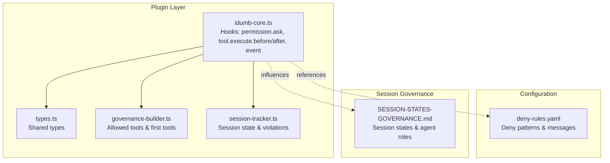
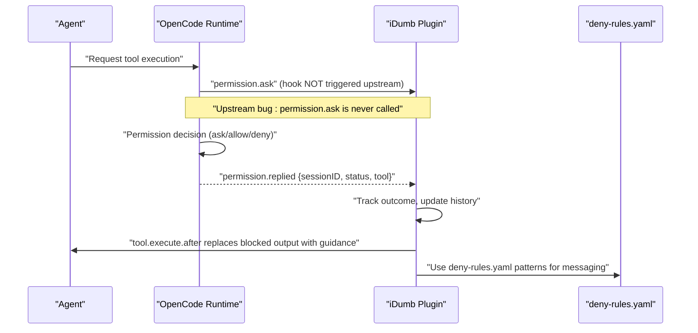
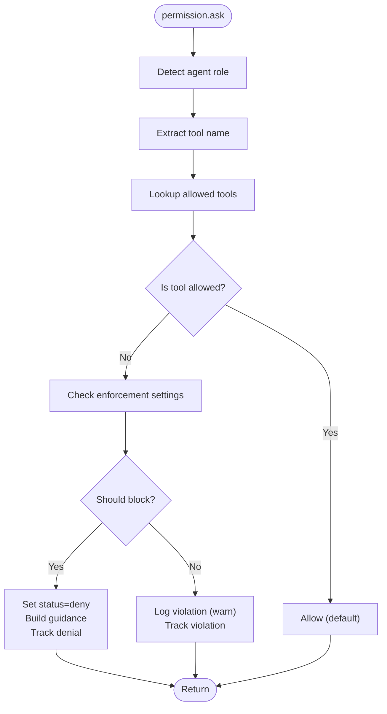
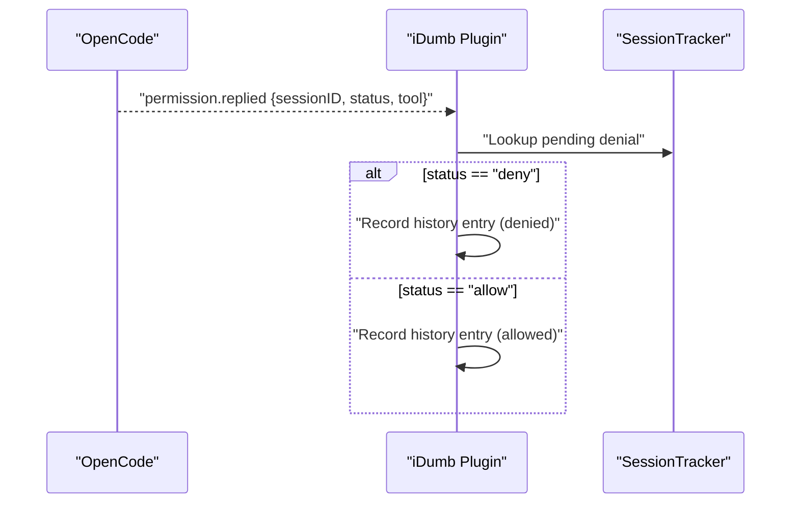
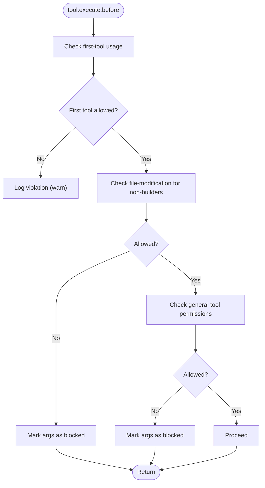
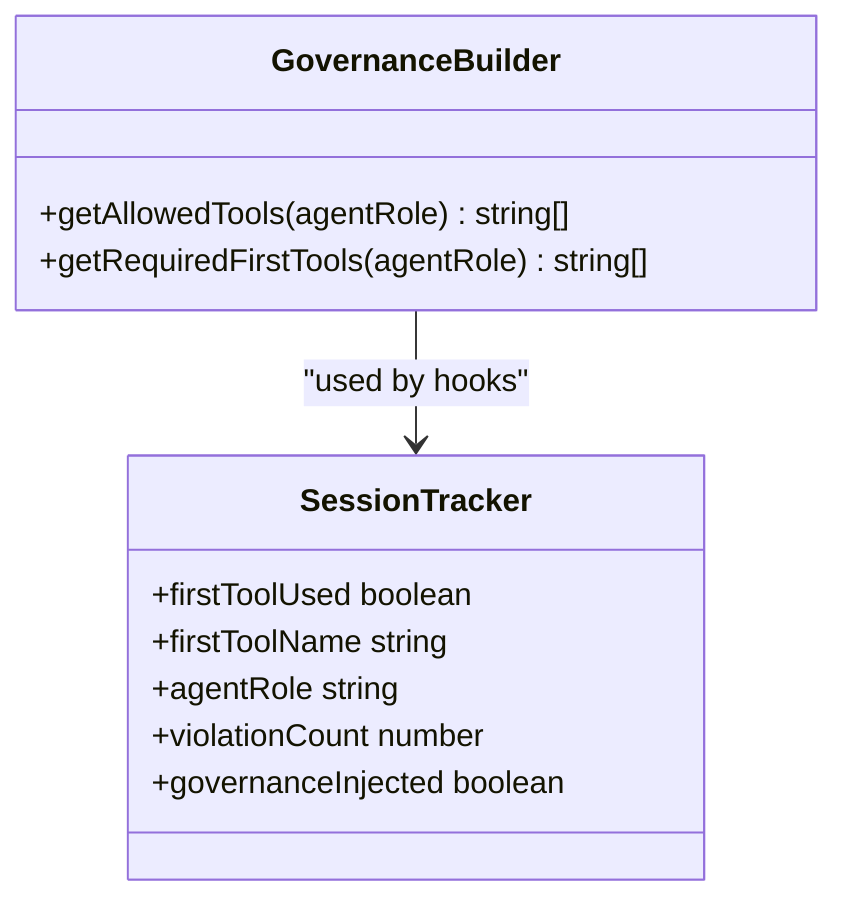
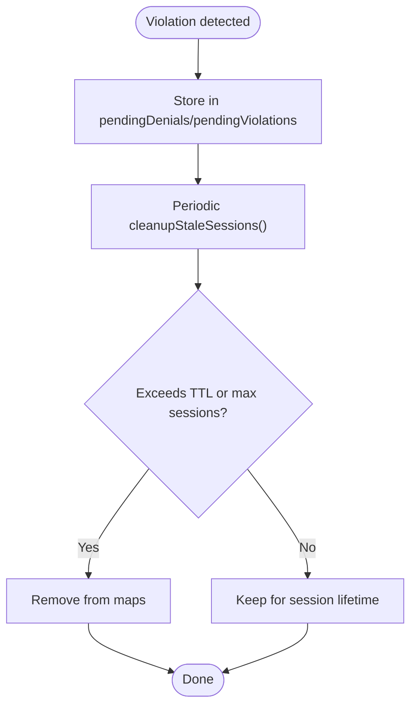
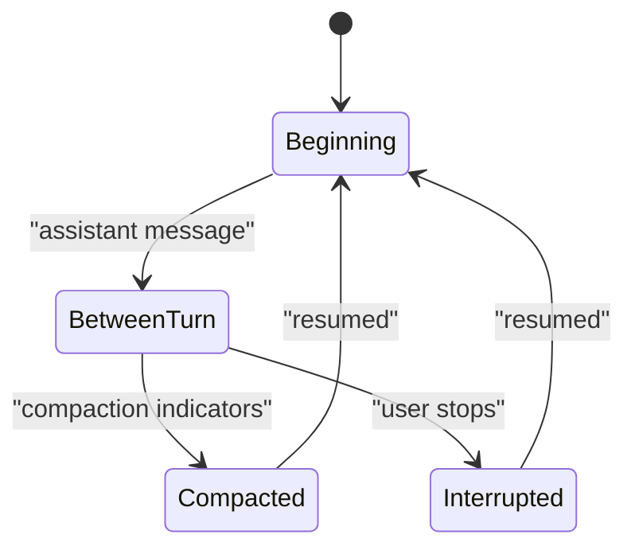
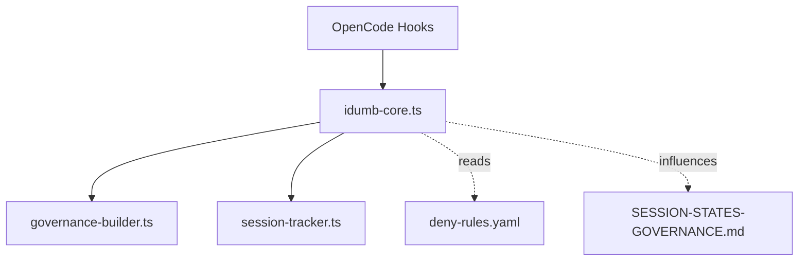

# Permission Events

<cite>
**Referenced Files in This Document**
- [idumb-core.ts](file://src/plugins/idumb-core.ts)
- [deny-rules.yaml](file://src/config/deny-rules.yaml)
- [types.ts](file://src/plugins/lib/types.ts)
- [governance-builder.ts](file://src/plugins/lib/governance-builder.ts)
- [session-tracker.ts](file://src/plugins/lib/session-tracker.ts)
- [SESSION-STATES-GOVERNANCE.md](file://src/router/SESSION-STATES-GOVERNANCE.md)
- [PERMISSION-DENY-RESEARCH-2026-02-04.md](file://.plugin-dev/research/PERMISSION-DENY-RESEARCH-2026-02-04.md)
- [PHASE-1-VALIDATION-GAP-ANALYSIS-2026-02-04.md](file://.plugin-dev/research/PHASE-1-VALIDATION-GAP-ANALYSIS-2026-02-04.md)
- [sync.tsx](file://.plugin-dev/opencode-plugins-and-tools-dev-best-practices.md)
</cite>

## Table of Contents
1. [Introduction](#introduction)
2. [Project Structure](#project-structure)
3. [Core Components](#core-components)
4. [Architecture Overview](#architecture-overview)
5. [Detailed Component Analysis](#detailed-component-analysis)
6. [Dependency Analysis](#dependency-analysis)
7. [Performance Considerations](#performance-considerations)
8. [Troubleshooting Guide](#troubleshooting-guide)
9. [Conclusion](#conclusion)

## Introduction
This document explains iDumb's permission event hooks with a focus on the permission.ask and permission.replied events. It details the permission request/response flow, tool validation logic, agent role-based access control, enforcement mechanisms, violation tracking, and the interplay with session states. It also covers blocking versus logging modes, practical examples for implementing permission interceptors and custom rules, and integration with the chain enforcement system.

## Project Structure
The permission system spans several core files:
- Plugin hooks and enforcement logic live in the main plugin implementation
- Deny rules and permission patterns are defined in a structured YAML configuration
- Shared types and governance builders support role-based permissions and tool matrices
- Session state governance documents define how permission decisions affect agent behavior across conversation states

**Diagram sources**
- [idumb-core.ts](file://src/plugins/idumb-core.ts#L130-L1092)
- [types.ts](file://src/plugins/lib/types.ts#L20-L282)
- [governance-builder.ts](file://src/plugins/lib/governance-builder.ts#L17-L162)
- [session-tracker.ts](file://src/plugins/lib/session-tracker.ts#L47-L143)
- [deny-rules.yaml](file://src/config/deny-rules.yaml#L1-L398)
- [SESSION-STATES-GOVERNANCE.md](file://src/router/SESSION-STATES-GOVERNANCE.md#L1-L288)

**Section sources**
- [idumb-core.ts](file://src/plugins/idumb-core.ts#L130-L1092)
- [deny-rules.yaml](file://src/config/deny-rules.yaml#L1-L398)
- [governance-builder.ts](file://src/plugins/lib/governance-builder.ts#L17-L162)
- [types.ts](file://src/plugins/lib/types.ts#L20-L282)
- [session-tracker.ts](file://src/plugins/lib/session-tracker.ts#L47-L143)
- [SESSION-STATES-GOVERNANCE.md](file://src/router/SESSION-STATES-GOVERNANCE.md#L1-L288)

## Core Components
- Permission event handlers:
  - permission.ask: Determines whether to deny or allow based on agent role and tool permissions
  - permission.replied: Reacts to upstream permission decisions to track outcomes and update history
- Tool interception:
  - tool.execute.before: Enforces first-tool requirements, file-modification restrictions, and general tool permission checks
  - tool.execute.after: Replaces blocked tool outputs with educational guidance and tracks validation failures
- Session lifecycle events:
  - event: Handles session.created, session.idle, session.compacted, session.resumed, and command.executed to manage governance injection and state
- Governance utilities:
  - getAllowedTools: Returns agent-specific allowed tools
  - getRequiredFirstTools: Enforces context-first methodology
  - SessionTracker: Tracks agent role, first-tool usage, violations, and governance injection state

**Section sources**
- [idumb-core.ts](file://src/plugins/idumb-core.ts#L138-L341)
- [idumb-core.ts](file://src/plugins/idumb-core.ts#L648-L741)
- [idumb-core.ts](file://src/plugins/idumb-core.ts#L752-L939)
- [governance-builder.ts](file://src/plugins/lib/governance-builder.ts#L17-L162)
- [types.ts](file://src/plugins/lib/types.ts#L213-L224)

## Architecture Overview
The permission system integrates OpenCode hooks with iDumb's governance logic. The upstream OpenCode permission.ask plugin hook is currently not invoked, so enforcement relies on:
- Agent frontmatter permissions (OpenCode-native)
- Tool interception in tool.execute.before/after
- Event-driven permission.replied handling for tracking and history updates

**Diagram sources**
- [idumb-core.ts](file://src/plugins/idumb-core.ts#L191-L221)
- [PERMISSION-DENY-RESEARCH-2026-02-04.md](file://.plugin-dev/research/PERMISSION-DENY-RESEARCH-2026-02-04.md#L49-L79)
- [deny-rules.yaml](file://src/config/deny-rules.yaml#L1-L398)

## Detailed Component Analysis

### Permission Request Flow (permission.ask)
- Agent role detection: Uses session tracker or message parsing to identify the agent role
- Tool extraction: Parses the tool name from the request
- Allowed tools lookup: Retrieves agent-specific allowed tools
- Decision logic:
  - If agent role is known and tool is not allowed, consult enforcement settings
  - If blocking is enabled, set output.status to deny and provide a guidance message
  - Otherwise, log the violation without blocking
- Tracking: Records pending denials and violations for later output replacement and history entries

**Diagram sources**
- [idumb-core.ts](file://src/plugins/idumb-core.ts#L651-L741)
- [governance-builder.ts](file://src/plugins/lib/governance-builder.ts#L21-L139)

**Section sources**
- [idumb-core.ts](file://src/plugins/idumb-core.ts#L651-L741)
- [governance-builder.ts](file://src/plugins/lib/governance-builder.ts#L21-L139)

### Permission Response Flow (permission.replied)
- On receiving permission.replied events, the plugin:
  - Reads sessionID, status, and tool from event properties
  - If status is deny and a pending denial exists for the session, records a history entry
  - If status is allow, records a separate history entry
- This enables audit trails and downstream processing

**Diagram sources**
- [idumb-core.ts](file://src/plugins/idumb-core.ts#L191-L221)

**Section sources**
- [idumb-core.ts](file://src/plugins/idumb-core.ts#L191-L221)

### Tool Validation Logic and Enforcement
- First-tool enforcement: Tracks whether the agent used a required context tool first; logs violations without blocking
- File modification enforcement: For non-builder agents attempting edit/write, logs violations without blocking
- General tool permission checks: For iDumb agents, if a tool is not in the allowed list, marks output args to signal a blocked tool
- Output replacement: In tool.execute.after, if a pending denial matches the tool, the plugin replaces the output with educational guidance and sets a clear title

**Diagram sources**
- [idumb-core.ts](file://src/plugins/idumb-core.ts#L752-L855)

**Section sources**
- [idumb-core.ts](file://src/plugins/idumb-core.ts#L752-L855)

### Agent Role-Based Access Control
- Allowed tools matrix: Different agents have different capabilities; unknown or non-iDumb agents receive an empty allowed list (no enforcement)
- First-tool requirements: Each agent category has required first tools to ensure context-first behavior
- Scope-based permissions: META agents operate within framework directories; PROJECT agents operate within the user project scope

**Diagram sources**
- [governance-builder.ts](file://src/plugins/lib/governance-builder.ts#L17-L162)
- [types.ts](file://src/plugins/lib/types.ts#L213-L224)

**Section sources**
- [governance-builder.ts](file://src/plugins/lib/governance-builder.ts#L17-L162)
- [types.ts](file://src/plugins/lib/types.ts#L213-L224)

### Violation Tracking and History
- Pending denials and violations are tracked per session using in-memory maps
- Session cleanup removes stale entries to prevent memory leaks
- History entries are added for permission decisions, first-tool violations, and file-modification attempts

**Diagram sources**
- [session-tracker.ts](file://src/plugins/lib/session-tracker.ts#L47-L88)
- [idumb-core.ts](file://src/plugins/idumb-core.ts#L113-L114)

**Section sources**
- [session-tracker.ts](file://src/plugins/lib/session-tracker.ts#L47-L88)
- [idumb-core.ts](file://src/plugins/idumb-core.ts#L113-L114)

### Blocking vs Logging Modes
- Blocking mode: When enabled, permission.ask sets output.status to deny and builds a guidance message; tool.execute.after replaces the output with educational guidance
- Logging mode: When disabled, violations are logged but tools still execute; enforcement is effectively theater

**Section sources**
- [idumb-core.ts](file://src/plugins/idumb-core.ts#L677-L734)
- [PHASE-1-VALIDATION-GAP-ANALYSIS-2026-02-04.md](file://.plugin-dev/research/PHASE-1-VALIDATION-GAP-ANALYSIS-2026-02-04.md#L212-L229)

### Practical Examples

#### Implementing a Permission Interceptor
- Use tool.execute.before to mark blocked tools by invalidating output.args with a special flag
- Use tool.execute.after to replace the output with a guidance message when a pending denial exists

**Section sources**
- [idumb-core.ts](file://src/plugins/idumb-core.ts#L752-L939)

#### Creating Custom Permission Rules
- Define deny patterns in deny-rules.yaml with contextual messages and suggestions
- Reference these patterns in tool.execute.before to block specific commands or tool combinations

**Section sources**
- [deny-rules.yaml](file://src/config/deny-rules.yaml#L1-L398)

#### Integrating with Chain Enforcement
- Chain rules can complement permission enforcement by blocking commands based on prerequisites and violation actions
- Use command.execute.before to enforce chain rules and inject guidance or redirects

**Section sources**
- [idumb-core.ts](file://src/plugins/idumb-core.ts#L953-L1075)

### Relationship Between Permission Events and Session State
- Session states influence when governance is injected and how violations are handled
- During session.start, governance prefixes are injected; during compaction, reminders are re-injected
- Session idle and resumed states update metadata and reset governance injection flags

**Diagram sources**
- [SESSION-STATES-GOVERNANCE.md](file://src/router/SESSION-STATES-GOVERNANCE.md#L59-L176)

**Section sources**
- [SESSION-STATES-GOVERNANCE.md](file://src/router/SESSION-STATES-GOVERNANCE.md#L59-L176)

## Dependency Analysis
The permission system depends on:
- OpenCode hooks (permission.ask, permission.replied, tool.execute.before/after, event)
- iDumb configuration (deny-rules.yaml)
- Governance utilities (allowed tools, first-tool requirements)
- Session state management (trackers, cleanup)

**Diagram sources**
- [idumb-core.ts](file://src/plugins/idumb-core.ts#L130-L1092)
- [governance-builder.ts](file://src/plugins/lib/governance-builder.ts#L17-L162)
- [session-tracker.ts](file://src/plugins/lib/session-tracker.ts#L47-L143)
- [deny-rules.yaml](file://src/config/deny-rules.yaml#L1-L398)
- [SESSION-STATES-GOVERNANCE.md](file://src/router/SESSION-STATES-GOVERNANCE.md#L1-L288)

**Section sources**
- [idumb-core.ts](file://src/plugins/idumb-core.ts#L130-L1092)
- [governance-builder.ts](file://src/plugins/lib/governance-builder.ts#L17-L162)
- [session-tracker.ts](file://src/plugins/lib/session-tracker.ts#L47-L143)
- [deny-rules.yaml](file://src/config/deny-rules.yaml#L1-L398)
- [SESSION-STATES-GOVERNANCE.md](file://src/router/SESSION-STATES-GOVERNANCE.md#L1-L288)

## Performance Considerations
- Hook execution is wrapped in try/catch to avoid breaking OpenCode
- Caching of style content and periodic cleanup of stale sessions mitigate memory growth
- Output replacement occurs only when a violation is pending, minimizing overhead

[No sources needed since this section provides general guidance]

## Troubleshooting Guide
Common issues and resolutions:
- permission.ask hook not triggering: Upstream bug prevents plugin from denying; rely on agent frontmatter permissions and tool.execute.before interception
- Permission enforcement appears as theater: Verify enforcement settings and note that blocking is disabled until upstream issue is resolved
- Violations not visible: Ensure tool.execute.after is replacing outputs and that history entries are being written

**Section sources**
- [PERMISSION-DENY-RESEARCH-2026-02-04.md](file://.plugin-dev/research/PERMISSION-DENY-RESEARCH-2026-02-04.md#L49-L79)
- [idumb-core.ts](file://src/plugins/idumb-core.ts#L857-L939)

## Conclusion
iDumb’s permission system currently operates in LOG-ONLY mode due to an upstream bug affecting the permission.ask plugin hook. The effective enforcement relies on agent frontmatter permissions, tool interception, and event-driven tracking. By integrating deny-rules.yaml patterns and strengthening tool interception, teams can achieve robust permission governance aligned with session states and agent roles. Monitoring upstream fixes will enable restoring dynamic, programmatic permission control.