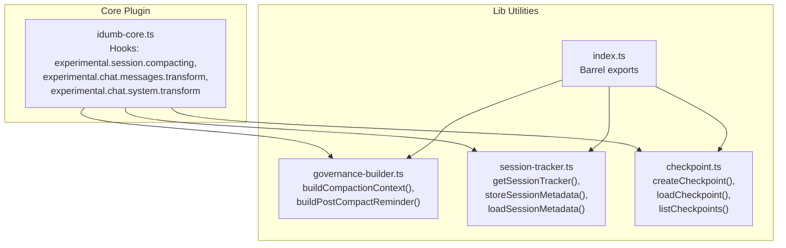
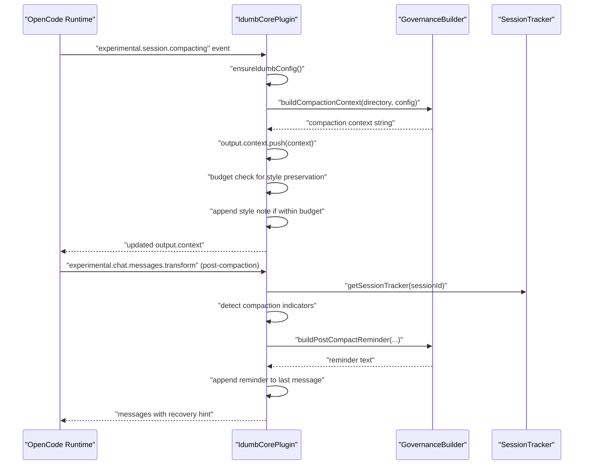
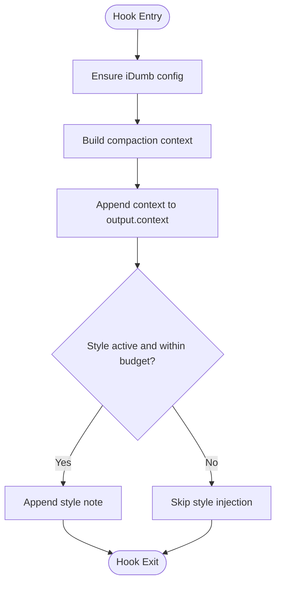
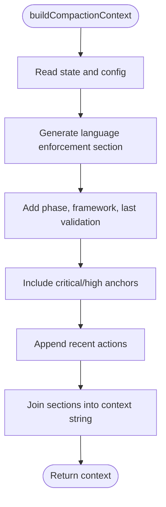
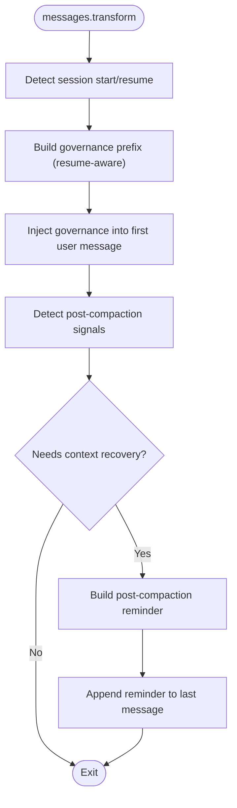
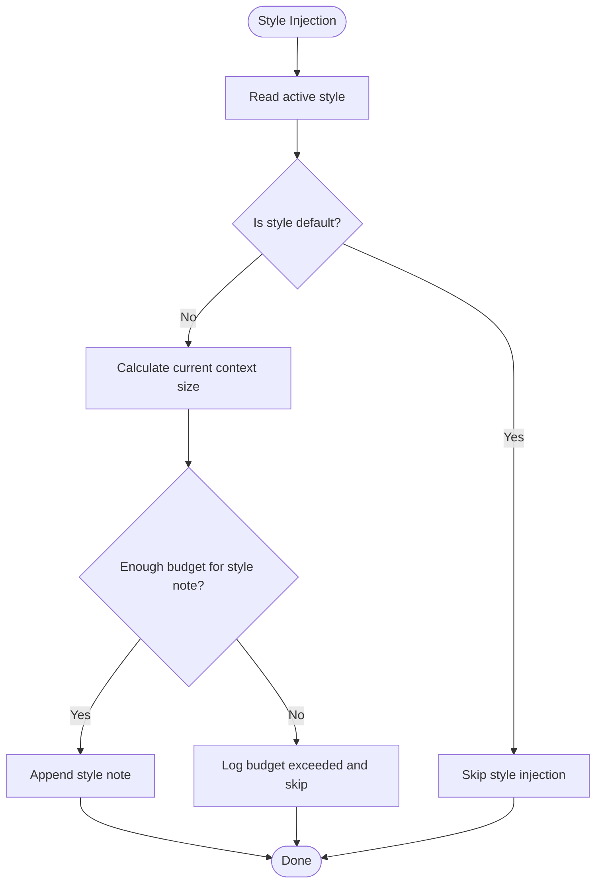
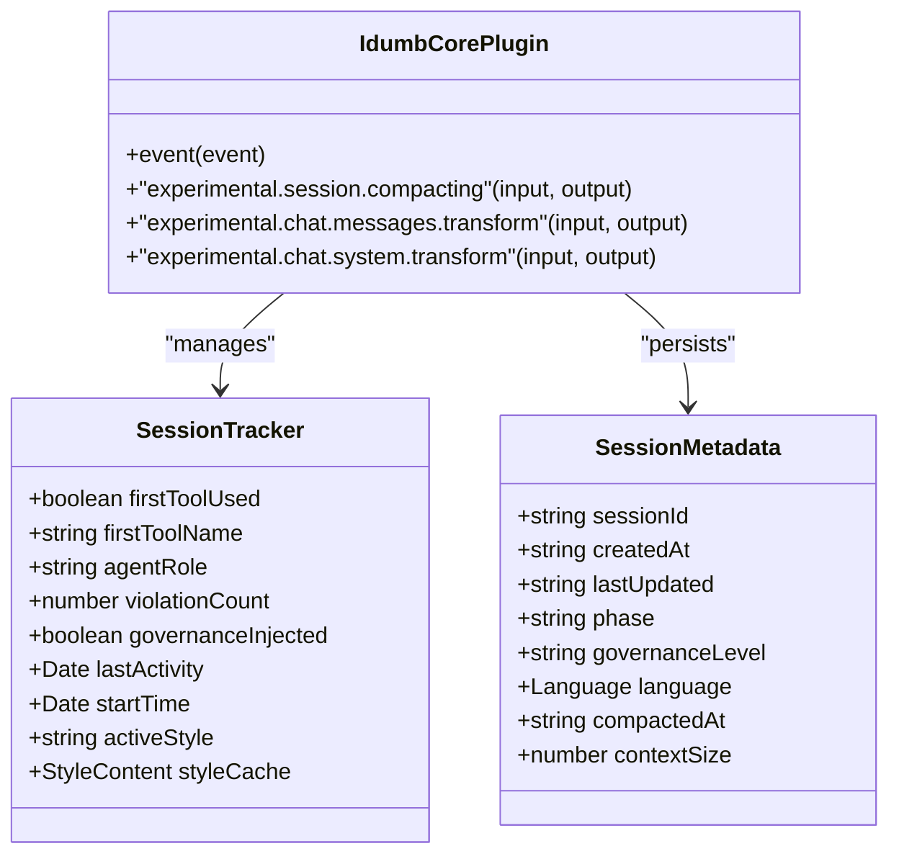
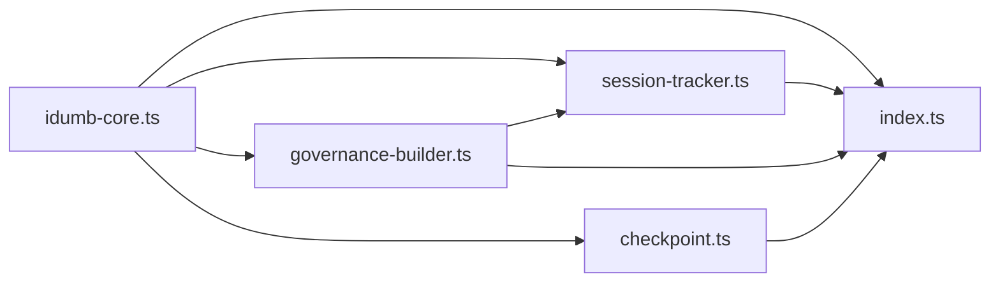

# Session Compaction Hook

<cite>
**Referenced Files in This Document**
- [idumb-core.ts](file://src/plugins/idumb-core.ts)
- [governance-builder.ts](file://src/plugins/lib/governance-builder.ts)
- [session-tracker.ts](file://src/plugins/lib/session-tracker.ts)
- [checkpoint.ts](file://src/plugins/lib/checkpoint.ts)
- [index.ts](file://src/plugins/lib/index.ts)
- [consolidated-plan-v2.md](file://.plugin-dev/implementation-short-plan/consolidated-plan-v2.md)
- [SESSION-STATES-RESEARCH-2026-02-04.md](file://.plugin-dev/research/SESSION-STATES-RESEARCH-2026-02-04.md)
</cite>

## Table of Contents
1. [Introduction](#introduction)
2. [Project Structure](#project-structure)
3. [Core Components](#core-components)
4. [Architecture Overview](#architecture-overview)
5. [Detailed Component Analysis](#detailed-component-analysis)
6. [Dependency Analysis](#dependency-analysis)
7. [Performance Considerations](#performance-considerations)
8. [Troubleshooting Guide](#troubleshooting-guide)
9. [Conclusion](#conclusion)

## Introduction
This document explains iDumb's experimental.session.compacting hook and its supporting infrastructure. It covers how compaction preserves critical context and output style across session compression, how the compaction context is built and injected, and how the system recovers agent behavior after compaction. It also documents character budget management, fallback strategies, and practical guidance for implementing compaction handlers and optimizing performance.

## Project Structure
The compaction hook is part of the iDumb core plugin and integrates with governance builders, session tracking, and style management utilities. The key files are:
- Core plugin with hooks and event handling
- Governance builder for compaction context generation
- Session tracker for runtime state and metadata
- Checkpoint utilities for execution state snapshots
- Library barrel exports for cohesive imports

**Diagram sources**
- [idumb-core.ts](file://src/plugins/idumb-core.ts#L135-L445)
- [governance-builder.ts](file://src/plugins/lib/governance-builder.ts#L578-L634)
- [session-tracker.ts](file://src/plugins/lib/session-tracker.ts#L94-L117)
- [checkpoint.ts](file://src/plugins/lib/checkpoint.ts#L120-L204)
- [index.ts](file://src/plugins/lib/index.ts#L96-L106)

**Section sources**
- [idumb-core.ts](file://src/plugins/idumb-core.ts#L135-L445)
- [governance-builder.ts](file://src/plugins/lib/governance-builder.ts#L578-L634)
- [session-tracker.ts](file://src/plugins/lib/session-tracker.ts#L94-L117)
- [checkpoint.ts](file://src/plugins/lib/checkpoint.ts#L120-L204)
- [index.ts](file://src/plugins/lib/index.ts#L96-L106)

## Core Components
- Compaction hook: Injects governance context and preserves active output style into the compaction buffer.
- Governance builder: Produces the compaction context containing language enforcement, phase, framework, anchors, and recent actions.
- Session tracker: Manages per-session state, metadata persistence, and resumption context.
- Post-compaction recovery: Detects compaction-related signals and injects a reminder with preserved language enforcement and recent context.
- Style management: Ensures output style survives compaction with budget-aware injection.

Key behaviors:
- Context preservation: The compaction context includes language enforcement, phase/framework, critical anchors, and recent actions.
- Style preservation: Active output style is appended as a compact note when budget allows.
- Recovery: After compaction, a reminder is injected to guide agents back on track with preserved language enforcement and recent history.

**Section sources**
- [idumb-core.ts](file://src/plugins/idumb-core.ts#L352-L383)
- [governance-builder.ts](file://src/plugins/lib/governance-builder.ts#L578-L634)
- [session-tracker.ts](file://src/plugins/lib/session-tracker.ts#L204-L244)
- [idumb-core.ts](file://src/plugins/idumb-core.ts#L505-L645)

## Architecture Overview
The compaction lifecycle spans three phases: compaction preparation, compaction execution, and post-compaction recovery.

**Diagram sources**
- [idumb-core.ts](file://src/plugins/idumb-core.ts#L352-L383)
- [idumb-core.ts](file://src/plugins/idumb-core.ts#L505-L645)
- [governance-builder.ts](file://src/plugins/lib/governance-builder.ts#L578-L634)
- [governance-builder.ts](file://src/plugins/lib/governance-builder.ts#L466-L576)
- [session-tracker.ts](file://src/plugins/lib/session-tracker.ts#L94-L117)

## Detailed Component Analysis

### Compaction Hook: Context Injection and Style Preservation
The compaction hook runs when the runtime emits the experimental.session.compacting event. Its responsibilities:
- Build compaction context using governance builder
- Append context to output.context without replacing existing content
- Preserve active output style with budget-aware injection
- Graceful failure handling to avoid breaking the runtime

Implementation highlights:
- Context injection: Appends the generated context to the existing output.context array.
- Style preservation: Reads active style from state, checks remaining budget, and appends a compact style note if space permits.
- Fallback strategy: Wrapped in try/catch; failures are logged silently to prevent runtime interruption.

**Diagram sources**
- [idumb-core.ts](file://src/plugins/idumb-core.ts#L352-L383)

**Section sources**
- [idumb-core.ts](file://src/plugins/idumb-core.ts#L352-L383)

### Compaction Context Generation
The compaction context is produced by the governance builder and includes:
- Language enforcement (absolute requirement)
- Phase and framework
- Critical and high-priority anchors
- Recent actions/history

The context ensures that essential policy and recent state survive compression, enabling coherent agent behavior after resumption.

**Diagram sources**
- [governance-builder.ts](file://src/plugins/lib/governance-builder.ts#L578-L634)

**Section sources**
- [governance-builder.ts](file://src/plugins/lib/governance-builder.ts#L578-L634)

### Post-Compaction Recovery and Agent Behavior
After compaction, the messages transform hook detects signs of context loss and injects a recovery reminder:
- Detection signals: Keywords indicating compaction, context loss phrases, low message counts, and "new session" indicators
- Reminder content: Preserved language enforcement, recent actions, critical anchors, and recommended next steps
- State integration: Uses session tracker to maintain governance injection state and stall detection integration

**Diagram sources**
- [idumb-core.ts](file://src/plugins/idumb-core.ts#L451-L645)
- [governance-builder.ts](file://src/plugins/lib/governance-builder.ts#L466-L576)
- [session-tracker.ts](file://src/plugins/lib/session-tracker.ts#L94-L117)

**Section sources**
- [idumb-core.ts](file://src/plugins/idumb-core.ts#L451-L645)
- [governance-builder.ts](file://src/plugins/lib/governance-builder.ts#L466-L576)
- [session-tracker.ts](file://src/plugins/lib/session-tracker.ts#L94-L117)

### Character Budget Management and Fallback Strategies
Budget management ensures compaction context remains within acceptable size limits:
- Maximum compaction context size: Defined as a constant in the core plugin
- Budget-aware style injection: Checks remaining capacity before appending style note
- Minimal fallback: When budget is exceeded, returns a minimal context fragment

**Diagram sources**
- [idumb-core.ts](file://src/plugins/idumb-core.ts#L365-L378)

**Section sources**
- [idumb-core.ts](file://src/plugins/idumb-core.ts#L122-L122)
- [idumb-core.ts](file://src/plugins/idumb-core.ts#L365-L378)
- [consolidated-plan-v2.md](file://.plugin-dev/implementation-short-plan/consolidated-plan-v2.md#L144-L166)

### Relationship Between Compaction and Session Tracking
Session tracking maintains:
- In-memory session state (agent role, governance injection flag, style cache)
- Metadata persistence (creation/update timestamps, compaction info)
- Resumption context building

These enable accurate compaction and recovery:
- Governance injection state prevents duplicate injections
- Metadata stores compaction timestamps and sizes for auditing
- Resume context helps rebuild agent orientation after long idle periods

**Diagram sources**
- [session-tracker.ts](file://src/plugins/lib/session-tracker.ts#L94-L117)
- [session-tracker.ts](file://src/plugins/lib/session-tracker.ts#L204-L244)
- [idumb-core.ts](file://src/plugins/idumb-core.ts#L135-L323)

**Section sources**
- [session-tracker.ts](file://src/plugins/lib/session-tracker.ts#L94-L117)
- [session-tracker.ts](file://src/plugins/lib/session-tracker.ts#L204-L244)
- [idumb-core.ts](file://src/plugins/idumb-core.ts#L135-L323)

## Dependency Analysis
The compaction system relies on coordinated modules:
- Core plugin depends on governance builder for context generation and on session tracker for runtime state
- Messages transform hook depends on governance builder for reminders and on session tracker for state flags
- Style preservation depends on state reading and budget calculations

**Diagram sources**
- [idumb-core.ts](file://src/plugins/idumb-core.ts#L135-L445)
- [governance-builder.ts](file://src/plugins/lib/governance-builder.ts#L578-L634)
- [session-tracker.ts](file://src/plugins/lib/session-tracker.ts#L94-L117)
- [checkpoint.ts](file://src/plugins/lib/checkpoint.ts#L120-L204)
- [index.ts](file://src/plugins/lib/index.ts#L96-L106)

**Section sources**
- [idumb-core.ts](file://src/plugins/idumb-core.ts#L135-L445)
- [governance-builder.ts](file://src/plugins/lib/governance-builder.ts#L578-L634)
- [session-tracker.ts](file://src/plugins/lib/session-tracker.ts#L94-L117)
- [checkpoint.ts](file://src/plugins/lib/checkpoint.ts#L120-L204)
- [index.ts](file://src/plugins/lib/index.ts#L96-L106)

## Performance Considerations
- Budget-aware style injection prevents oversized context payloads
- Minimal fallback contexts reduce overhead when budgets are tight
- In-memory session tracker avoids frequent disk I/O for runtime decisions
- Post-compaction detection uses lightweight keyword and message-count heuristics

[No sources needed since this section provides general guidance]

## Troubleshooting Guide
Common issues and resolutions:
- Compaction hook failures: The hook is wrapped in try/catch and logs errors silently to avoid runtime interruption. Check logs for detailed error messages.
- Missing context after compaction: Verify that compaction indicators are being detected and that the post-compaction reminder is appended to the last message.
- Style not preserved: Confirm that active style is not default and that budget checks allow for style note injection.
- Session tracking anomalies: Ensure session trackers are initialized on session creation and cleaned up on idle events.

**Section sources**
- [idumb-core.ts](file://src/plugins/idumb-core.ts#L352-L383)
- [idumb-core.ts](file://src/plugins/idumb-core.ts#L505-L645)
- [session-tracker.ts](file://src/plugins/lib/session-tracker.ts#L94-L117)

## Conclusion
iDumb's experimental.session.compacting hook provides robust context preservation and style continuity during session compression. By combining a structured compaction context, budget-aware style injection, and post-compaction recovery mechanisms, the system maintains coherent agent behavior across interruptions. The integration with session tracking and governance builders ensures reliable state management and resumption support.