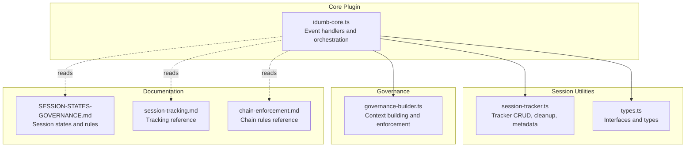
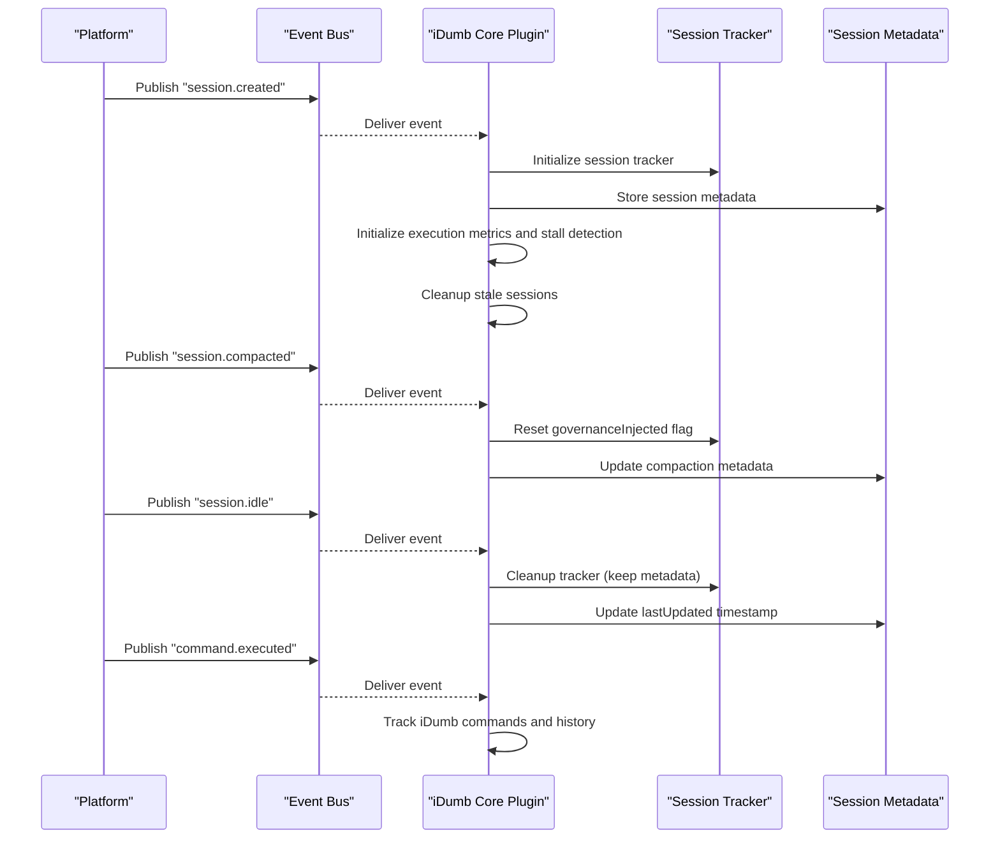
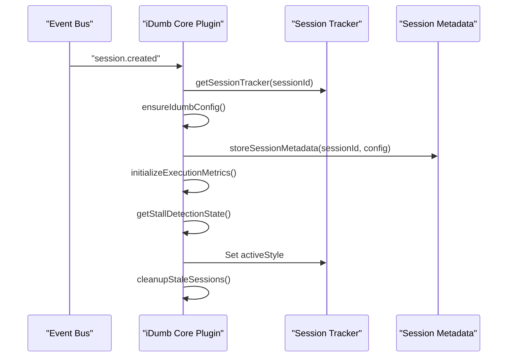
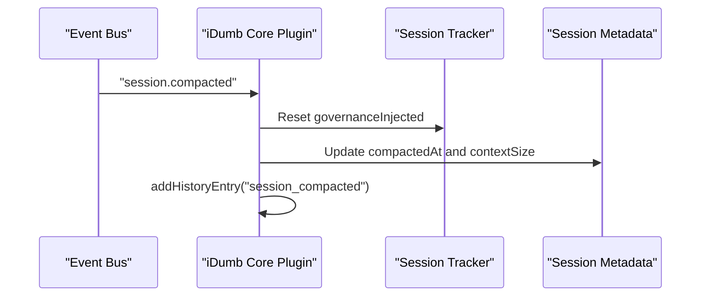
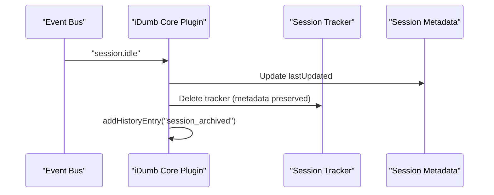
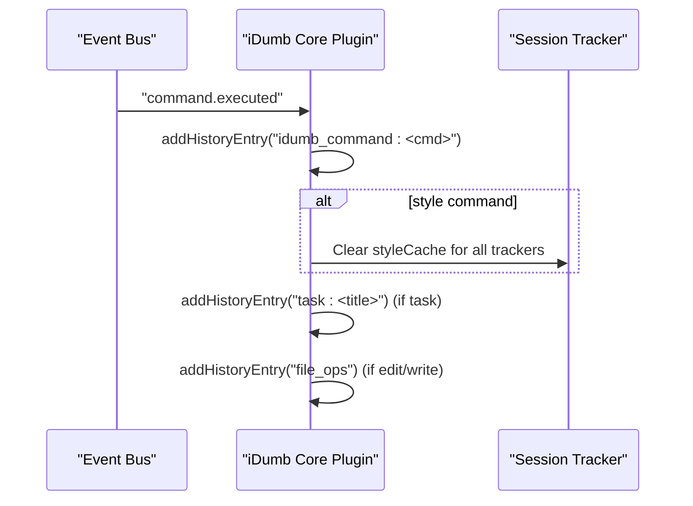
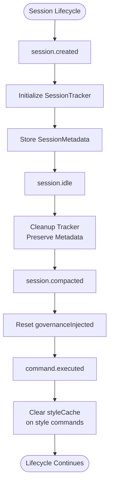
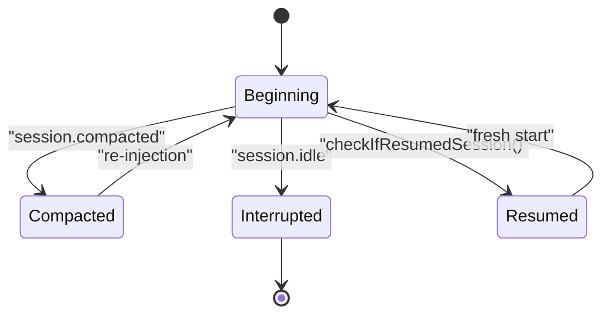
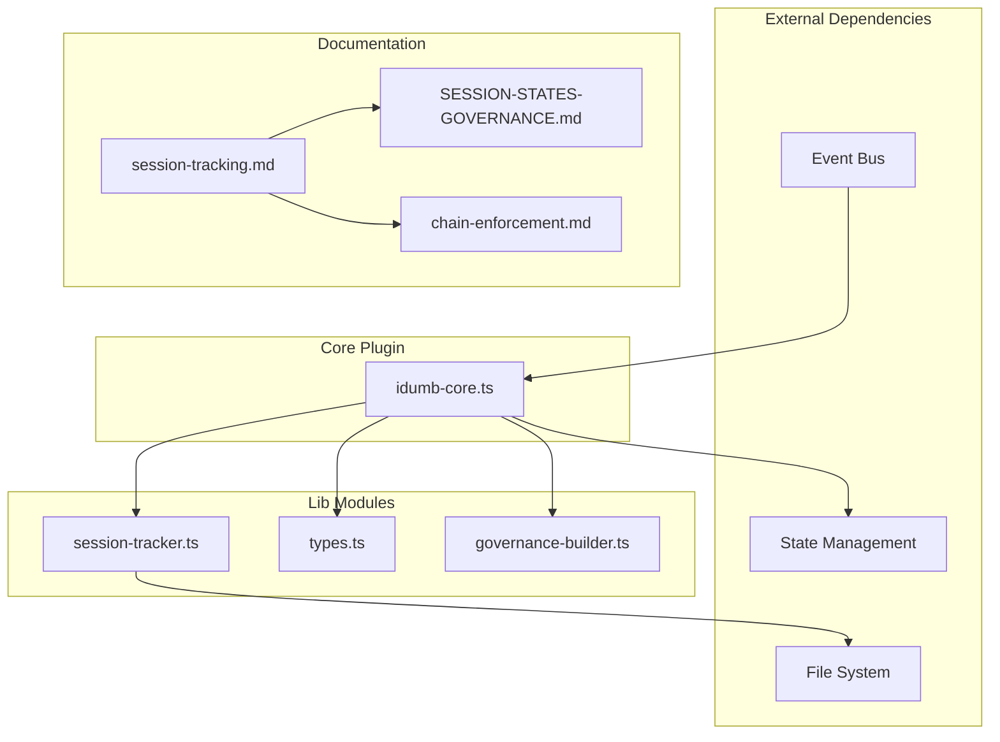

# Session Events

<cite>
**Referenced Files in This Document**
- [idumb-core.ts](file://src/plugins/idumb-core.ts)
- [session-tracker.ts](file://src/plugins/lib/session-tracker.ts)
- [types.ts](file://src/plugins/lib/types.ts)
- [governance-builder.ts](file://src/plugins/lib/governance-builder.ts)
- [SESSION-STATES-GOVERNANCE.md](file://src/router/SESSION-STATES-GOVERNANCE.md)
- [session-tracking.md](file://src/skills/hierarchical-mindfulness/references/session-tracking.md)
- [IMPLEMENTATION-GUIDE.md](file://docs/IMPLEMENTATION-GUIDE.md)
- [hooks.md](file://.claude/skills/opencode-plugin-compliance/references/hooks.md)
- [opencode-plugins-and-tools-dev-best-practices.md](file://.plugin-dev/opencode-plugins-and-tools-dev-best-practices.md)
- [consolidated-plan.md](file://.plugin-dev/implementation-short-plan/consolidated-plan.md)
- [chain-enforcement.md](file://src/skills/hierarchical-mindfulness/references/chain-enforcement.md)
</cite>

## Table of Contents
1. [Introduction](#introduction)
2. [Project Structure](#project-structure)
3. [Core Components](#core-components)
4. [Architecture Overview](#architecture-overview)
5. [Detailed Component Analysis](#detailed-component-analysis)
6. [Dependency Analysis](#dependency-analysis)
7. [Performance Considerations](#performance-considerations)
8. [Troubleshooting Guide](#troubleshooting-guide)
9. [Conclusion](#conclusion)

## Introduction
This document provides comprehensive documentation for iDumb's session lifecycle event hooks. It covers all session events including session.created, session.compacted, session.idle, session.resumed, and command.executed. It explains the event payload structure, timing, and expected behaviors for each event type. It also details session tracking mechanisms, metadata management, and state persistence patterns. Practical examples of implementing session event handlers, error handling strategies, and best practices for session lifecycle management are included. Finally, it documents the relationship between session events and governance enforcement, including how session state affects agent permissions and workflow execution.

## Project Structure
The session lifecycle event system spans several modules:
- Core plugin event handling and orchestration
- Session tracking utilities for in-memory state and metadata persistence
- Governance builders for context injection and enforcement
- Router and skill references defining session states and governance rules
- Implementation guidelines and hook timing sequences

**Diagram sources**
- [idumb-core.ts](file://src/plugins/idumb-core.ts#L138-L189)
- [session-tracker.ts](file://src/plugins/lib/session-tracker.ts#L1-L385)
- [types.ts](file://src/plugins/lib/types.ts#L213-L245)
- [governance-builder.ts](file://src/plugins/lib/governance-builder.ts#L1-L635)
- [SESSION-STATES-GOVERNANCE.md](file://src/router/SESSION-STATES-GOVERNANCE.md#L1-L288)
- [session-tracking.md](file://src/skills/hierarchical-mindfulness/references/session-tracking.md#L1-L329)
- [chain-enforcement.md](file://src/skills/hierarchical-mindfulness/references/chain-enforcement.md#L1-L188)

**Section sources**
- [idumb-core.ts](file://src/plugins/idumb-core.ts#L1-L200)
- [session-tracker.ts](file://src/plugins/lib/session-tracker.ts#L1-L385)
- [types.ts](file://src/plugins/lib/types.ts#L1-L282)
- [governance-builder.ts](file://src/plugins/lib/governance-builder.ts#L1-L635)
- [SESSION-STATES-GOVERNANCE.md](file://src/router/SESSION-STATES-GOVERNANCE.md#L1-L288)
- [session-tracking.md](file://src/skills/hierarchical-mindfulness/references/session-tracking.md#L1-L329)
- [chain-enforcement.md](file://src/skills/hierarchical-mindfulness/references/chain-enforcement.md#L1-L188)

## Core Components
This section outlines the primary components involved in session lifecycle event handling and governance enforcement.

- SessionTracker: In-memory state for each session, including first tool usage, agent role, violation counts, and governance injection flags.
- SessionMetadata: Persistent metadata stored per session, including timestamps, phase, governance level, and language settings.
- GovernanceBuilder: Constructs governance prefixes, post-compaction reminders, and compaction context to ensure continuity.
- Router and Skill References: Define session states, transitions, and governance rules for proper enforcement.

Key responsibilities:
- Track session lifecycle events and maintain in-memory state
- Persist session metadata to disk for resumption
- Enforce governance rules and inject context based on session state
- Manage cleanup and memory management for stale sessions

**Section sources**
- [types.ts](file://src/plugins/lib/types.ts#L213-L245)
- [session-tracker.ts](file://src/plugins/lib/session-tracker.ts#L34-L117)
- [governance-builder.ts](file://src/plugins/lib/governance-builder.ts#L200-L346)
- [SESSION-STATES-GOVERNANCE.md](file://src/router/SESSION-STATES-GOVERNANCE.md#L59-L176)

## Architecture Overview
The session lifecycle event architecture integrates event publishing, plugin subscriptions, and governance enforcement. Events are published by the platform and consumed by plugins, which then update session state, persist metadata, and inject governance context as needed.

**Diagram sources**
- [opencode-plugins-and-tools-dev-best-practices.md](file://.plugin-dev/opencode-plugins-and-tools-dev-best-practices.md#L1016-L1070)
- [idumb-core.ts](file://src/plugins/idumb-core.ts#L138-L280)
- [session-tracker.ts](file://src/plugins/lib/session-tracker.ts#L47-L88)
- [IMPLEMENTATION-GUIDE.md](file://docs/IMPLEMENTATION-GUIDE.md#L641-L715)

**Section sources**
- [opencode-plugins-and-tools-dev-best-practices.md](file://.plugin-dev/opencode-plugins-and-tools-dev-best-practices.md#L1016-L1070)
- [idumb-core.ts](file://src/plugins/idumb-core.ts#L138-L280)
- [session-tracker.ts](file://src/plugins/lib/session-tracker.ts#L47-L88)
- [IMPLEMENTATION-GUIDE.md](file://docs/IMPLEMENTATION-GUIDE.md#L641-L715)

## Detailed Component Analysis

### Session.created Event
Behavior:
- Initializes session tracker
- Ensures configuration exists (auto-generates if missing)
- Stores session metadata with phase and language settings
- Initializes execution metrics and stall detection
- Applies cleanup for stale sessions
- Validates enforcement settings

Payload structure:
- Properties include session info with identifier
- Configuration object with user language settings

Timing:
- Fired immediately upon session creation
- Should be the first event processed for a new session

Expected outcomes:
- New session tracker entry
- Metadata file created
- Metrics and stall detection initialized
- Cleanup performed to prevent memory leaks

**Diagram sources**
- [idumb-core.ts](file://src/plugins/idumb-core.ts#L140-L189)
- [session-tracker.ts](file://src/plugins/lib/session-tracker.ts#L47-L88)
- [governance-builder.ts](file://src/plugins/lib/governance-builder.ts#L200-L346)

**Section sources**
- [idumb-core.ts](file://src/plugins/idumb-core.ts#L140-L189)
- [session-tracker.ts](file://src/plugins/lib/session-tracker.ts#L47-L88)
- [governance-builder.ts](file://src/plugins/lib/governance-builder.ts#L200-L346)

### Session.compacted Event
Behavior:
- Resets governanceInjected flag to ensure context re-injection on next message
- Updates metadata with compaction timestamp and context size
- Records compaction in history

Payload structure:
- Properties include sessionID and contextSize

Timing:
- Fired when context compaction occurs

Expected outcomes:
- Governance prefix will be re-injected on next message
- Metadata updated with compaction details
- History entry created

**Diagram sources**
- [idumb-core.ts](file://src/plugins/idumb-core.ts#L257-L280)
- [session-tracker.ts](file://src/plugins/lib/session-tracker.ts#L269-L280)

**Section sources**
- [idumb-core.ts](file://src/plugins/idumb-core.ts#L257-L280)
- [session-tracker.ts](file://src/plugins/lib/session-tracker.ts#L269-L280)

### Session.idle Event
Behavior:
- Updates metadata with lastUpdated timestamp
- Cleans up session tracker (preserves metadata for potential resumption)
- Archives session statistics to history

Payload structure:
- Properties include sessionID

Timing:
- Fired when a session becomes idle (session ends)

Expected outcomes:
- Metadata updated with idle timestamp
- Tracker removed from memory
- Session archived for potential resumption

**Diagram sources**
- [idumb-core.ts](file://src/plugins/idumb-core.ts#L239-L255)
- [session-tracker.ts](file://src/plugins/lib/session-tracker.ts#L249-L254)

**Section sources**
- [idumb-core.ts](file://src/plugins/idumb-core.ts#L239-L255)
- [session-tracker.ts](file://src/plugins/lib/session-tracker.ts#L249-L254)

### Command.executed Event
Behavior:
- Tracks iDumb commands in history
- Clears style cache when style commands are executed
- Records task completions and file operations

Payload structure:
- Properties include command string

Timing:
- Fired after any command execution

Expected outcomes:
- iDumb commands tracked in history
- Style cache invalidated when style commands are used
- Task and file operation events recorded

**Diagram sources**
- [idumb-core.ts](file://src/plugins/idumb-core.ts#L282-L300)
- [idumb-core.ts](file://src/plugins/idumb-core.ts#L914-L934)

**Section sources**
- [idumb-core.ts](file://src/plugins/idumb-core.ts#L282-L300)
- [idumb-core.ts](file://src/plugins/idumb-core.ts#L914-L934)

### Session Tracking and Metadata Management
Session tracking encompasses both in-memory state and persistent metadata storage. The system maintains:
- SessionTracker: In-memory state with firstToolUsed, agentRole, violationCount, and governanceInjected flags
- SessionMetadata: Persistent JSON files containing timestamps, phase, governance level, and language settings
- Cleanup mechanism: Automatic removal of stale sessions based on TTL and LRU eviction

**Diagram sources**
- [session-tracker.ts](file://src/plugins/lib/session-tracker.ts#L47-L88)
- [session-tracker.ts](file://src/plugins/lib/session-tracker.ts#L204-L244)
- [idumb-core.ts](file://src/plugins/idumb-core.ts#L140-L189)

**Section sources**
- [session-tracker.ts](file://src/plugins/lib/session-tracker.ts#L47-L88)
- [session-tracker.ts](file://src/plugins/lib/session-tracker.ts#L204-L244)
- [idumb-core.ts](file://src/plugins/idumb-core.ts#L140-L189)

### Governance Enforcement and Session States
Session states and governance rules define how the system enforces permissions and manages context:
- S1: Beginning New Conversation - initializes governance prefix and enforces first action requirements
- S2: Compact Message - ensures language enforcement survives compaction and rebuilds context
- S3: Between-Turn - normal tool hooks and violation tracking
- S4: Interrupted - archives session stats and updates metadata
- S5: Resumed Session - re-establishes context with resume information

**Diagram sources**
- [SESSION-STATES-GOVERNANCE.md](file://src/router/SESSION-STATES-GOVERNANCE.md#L59-L176)
- [session-tracking.md](file://src/skills/hierarchical-mindfulness/references/session-tracking.md#L24-L45)

**Section sources**
- [SESSION-STATES-GOVERNANCE.md](file://src/router/SESSION-STATES-GOVERNANCE.md#L59-L176)
- [session-tracking.md](file://src/skills/hierarchical-mindfulness/references/session-tracking.md#L24-L45)

### Practical Implementation Examples
Implementing session event handlers involves subscribing to the event bus and processing each event type appropriately. The following patterns demonstrate how to handle session lifecycle events:

- Session created: Initialize tracker, ensure config, store metadata, initialize metrics and stall detection, and perform cleanup
- Session compacted: Reset governanceInjected flag and update compaction metadata
- Session idle: Update lastUpdated timestamp and clean up tracker while preserving metadata
- Command executed: Track iDumb commands, clear style cache on style commands, record task completions and file operations

Best practices:
- Always handle errors gracefully without breaking the platform
- Keep logging minimal and non-intrusive
- Respect session state transitions and governance rules
- Maintain cleanup routines to prevent memory leaks

**Section sources**
- [IMPLEMENTATION-GUIDE.md](file://docs/IMPLEMENTATION-GUIDE.md#L641-L715)
- [idumb-core.ts](file://src/plugins/idumb-core.ts#L138-L280)

## Dependency Analysis
The session lifecycle event system depends on several core modules and follows a well-defined dependency graph:

**Diagram sources**
- [idumb-core.ts](file://src/plugins/idumb-core.ts#L19-L108)
- [session-tracker.ts](file://src/plugins/lib/session-tracker.ts#L10-L21)
- [governance-builder.ts](file://src/plugins/lib/governance-builder.ts#L10-L12)
- [SESSION-STATES-GOVERNANCE.md](file://src/router/SESSION-STATES-GOVERNANCE.md#L1-L10)
- [session-tracking.md](file://src/skills/hierarchical-mindfulness/references/session-tracking.md#L1-L5)

**Section sources**
- [idumb-core.ts](file://src/plugins/idumb-core.ts#L19-L108)
- [session-tracker.ts](file://src/plugins/lib/session-tracker.ts#L10-L21)
- [governance-builder.ts](file://src/plugins/lib/governance-builder.ts#L10-L12)
- [SESSION-STATES-GOVERNANCE.md](file://src/router/SESSION-STATES-GOVERNANCE.md#L1-L10)
- [session-tracking.md](file://src/skills/hierarchical-mindfulness/references/session-tracking.md#L1-L5)

## Performance Considerations
Memory management:
- Session trackers are stored in-memory with automatic cleanup based on TTL and LRU eviction
- Maximum sessions capped to prevent unbounded growth
- Cleanup runs on session creation and idle events

Disk I/O:
- Session metadata stored as JSON files in .idumb/sessions directory
- Metadata updates only touch lastUpdated field to minimize writes
- Cleanup removes stale trackers and associated pending data

Governance overhead:
- Context injection occurs only when governanceInjected flag is false
- Post-compaction reminders ensure continuity without redundant injections
- Style caching reduces repeated computation for session-specific formatting

## Troubleshooting Guide
Common issues and resolutions:
- Session not found: Ensure sessionID present in event properties and tracker initialized
- Metadata corruption: JSON parsing errors ignored during metadata updates; verify file permissions
- Excessive memory usage: Monitor cleanup frequency and adjust TTL thresholds
- Governance not re-injected: Verify governanceInjected flag reset on compaction and proper context building
- Permission denials: Use pendingDenials and pendingViolations for error transformation and guidance injection

Error handling strategies:
- Wrap event handlers in try-catch blocks to prevent platform disruption
- Log errors to file rather than console to avoid TUI interference
- Validate session state before performing operations
- Implement graceful degradation when external dependencies unavailable

**Section sources**
- [session-tracker.ts](file://src/plugins/lib/session-tracker.ts#L216-L227)
- [idumb-core.ts](file://src/plugins/idumb-core.ts#L711-L714)

## Conclusion
iDumb's session lifecycle event system provides robust session tracking, governance enforcement, and state persistence. The architecture integrates event-driven processing with in-memory tracking and persistent metadata storage. By following the documented patterns and best practices, developers can implement reliable session event handlers that maintain system integrity while supporting complex governance workflows. The system's design emphasizes cleanup, performance, and resilience, ensuring smooth operation across diverse session scenarios.