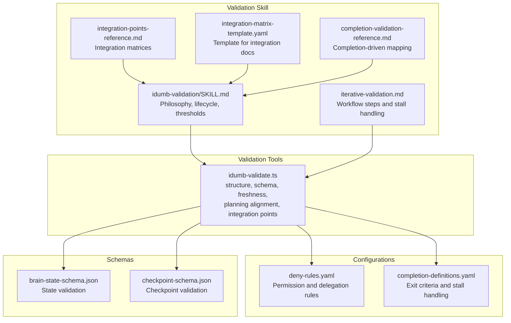
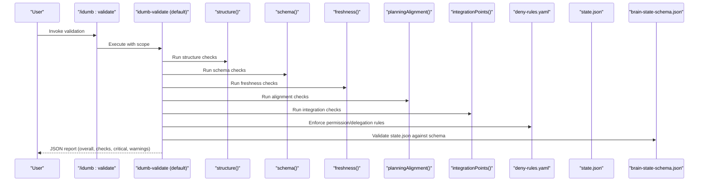
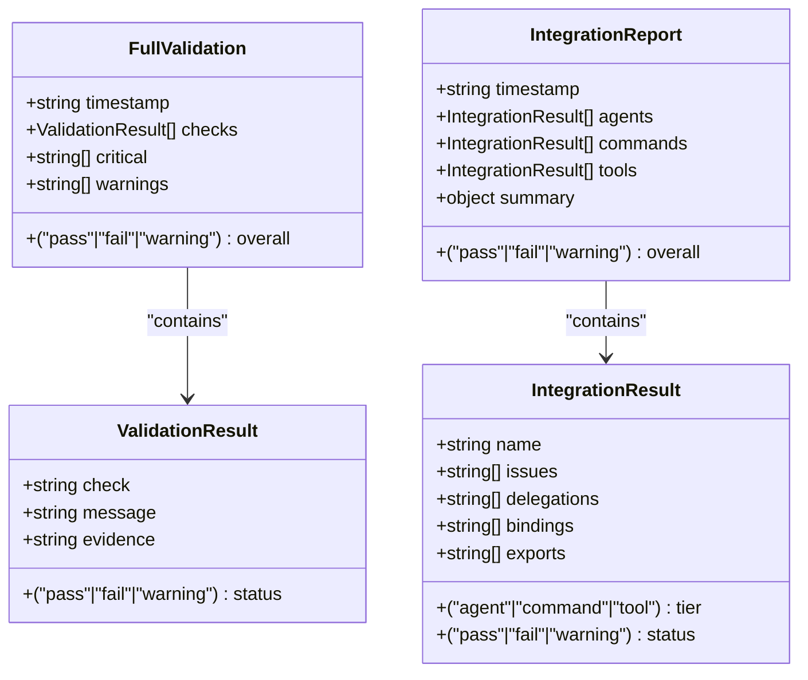
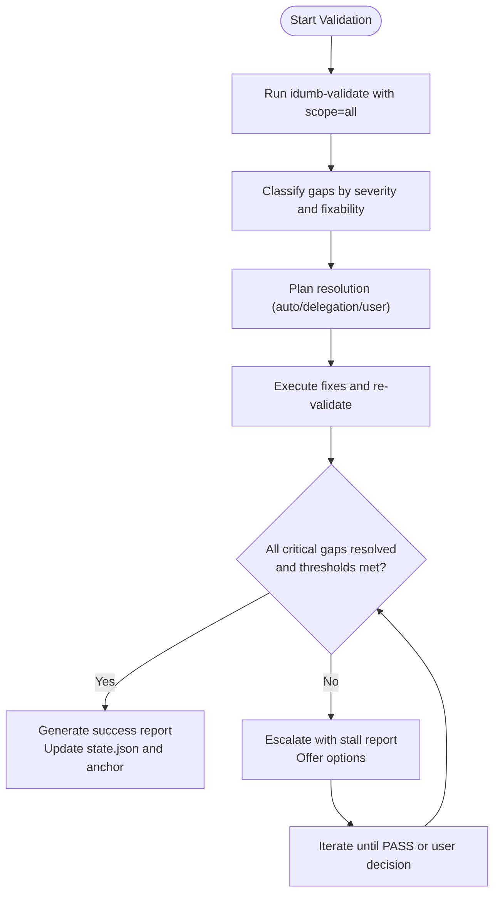
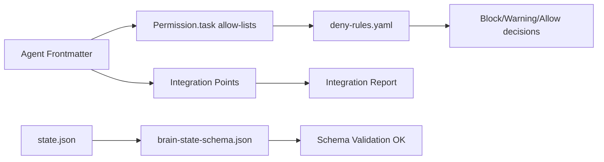
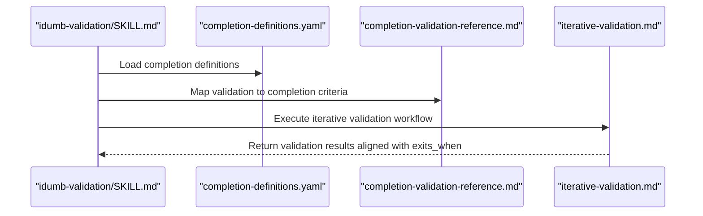
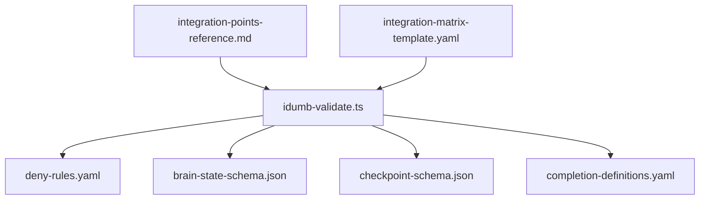

# Validation API

<cite>
**Referenced Files in This Document**
- [idumb-validate.ts](file://src/tools/idumb-validate.ts)
- [SKILL.md](file://src/skills/idumb-validation/SKILL.md)
- [iterative-validation.md](file://src/skills/idumb-validation/workflows/iterative-validation.md)
- [integration-points-reference.md](file://src/skills/idumb-validation/references/integration-points-reference.md)
- [integration-matrix-template.yaml](file://src/skills/idumb-validation/templates/integration-matrix-template.yaml)
- [completion-validation-reference.md](file://src/skills/idumb-validation/references/completion-validation-reference.md)
- [deny-rules.yaml](file://src/config/deny-rules.yaml)
- [completion-definitions.yaml](file://src/config/completion-definitions.yaml)
- [brain-state-schema.json](file://src/schemas/brain-state-schema.json)
- [checkpoint-schema.json](file://src/schemas/checkpoint-schema.json)
</cite>

## Table of Contents
1. [Introduction](#introduction)
2. [Project Structure](#project-structure)
3. [Core Components](#core-components)
4. [Architecture Overview](#architecture-overview)
5. [Detailed Component Analysis](#detailed-component-analysis)
6. [Dependency Analysis](#dependency-analysis)
7. [Performance Considerations](#performance-considerations)
8. [Troubleshooting Guide](#troubleshooting-guide)
9. [Conclusion](#conclusion)
10. [Appendices](#appendices)

## Introduction
This document provides comprehensive API documentation for iDumb’s validation tools and compliance checking functions. It covers:
- Validation tool interfaces and function signatures
- Permission enforcement mechanisms via deny rules and delegation controls
- Configuration validation utilities and schema enforcement
- Validation patterns across the framework (structure, integration, behavior)
- Integration points with the governance system
- Compliance checking procedures aligned with completion-driven definitions
- Practical usage examples and result processing patterns

The validation system is completion-driven: workflows exit when purpose is achieved, not when arbitrary counters expire. It includes iterative gap detection, self-healing workflows, and stall detection with escalation protocols.

## Project Structure
The validation ecosystem spans tools, skills, configurations, schemas, and reference materials:
- Tools: idumb-validate.ts exposes validation runners and integration validators
- Skills: idumb-validation skill defines philosophy, lifecycle, and workflows
- Configurations: deny-rules.yaml and completion-definitions.yaml define enforcement and completion criteria
- Schemas: brain-state-schema.json and checkpoint-schema.json define runtime validation targets
- References: integration matrices, templates, and validation references

**Diagram sources**
- [idumb-validate.ts](file://src/tools/idumb-validate.ts#L1-L1043)
- [SKILL.md](file://src/skills/idumb-validation/SKILL.md#L1-L720)
- [iterative-validation.md](file://src/skills/idumb-validation/workflows/iterative-validation.md#L1-L236)
- [integration-points-reference.md](file://src/skills/idumb-validation/references/integration-points-reference.md#L1-L247)
- [integration-matrix-template.yaml](file://src/skills/idumb-validation/templates/integration-matrix-template.yaml#L1-L141)
- [completion-validation-reference.md](file://src/skills/idumb-validation/references/completion-validation-reference.md#L1-L203)
- [deny-rules.yaml](file://src/config/deny-rules.yaml#L1-L398)
- [completion-definitions.yaml](file://src/config/completion-definitions.yaml#L1-L990)
- [brain-state-schema.json](file://src/schemas/brain-state-schema.json#L1-L112)
- [checkpoint-schema.json](file://src/schemas/checkpoint-schema.json#L1-L199)

**Section sources**
- [idumb-validate.ts](file://src/tools/idumb-validate.ts#L1-L1043)
- [SKILL.md](file://src/skills/idumb-validation/SKILL.md#L1-L720)

## Core Components
This section documents the primary validation APIs and their capabilities.

- idumb-validate tool (default export)
  - Purpose: Run all validation checks and return a comprehensive report
  - Scope parameter: all | structure | schema | freshness | alignment
  - Output: JSON with overall status, checks, critical issues, and warnings
  - Typical usage: invoked by /idumb:validate or via idumb-validate CLI

- structure
  - Validates .idumb/ directory structure and required subdirectories
  - Checks for existence of .idumb/, .idumb/brain/, .idumb/brain/state.json, optional .idumb/brain/governance/
  - Returns pass/fail/warning per check

- schema
  - Validates state.json against brain-state-schema.json
  - Ensures required fields (version, initialized, framework, phase)
  - Checks framework enum values and anchors array type
  - Handles JSON parse errors gracefully

- freshness
  - Checks file ages and marks stale files (default 48 hours)
  - Scans .idumb/brain/state.json and anchors’ created timestamps
  - Returns pass/warning based on staleness

- planningAlignment
  - Detects presence of planning system (.planning/) and related files
  - Compares iDumb framework setting with detected planning presence
  - Warns if mismatch is detected

- integrationPoints
  - Validates integration points across agents, commands, and tools
  - Parses YAML frontmatter for agents, agent bindings for commands, and exports for tools
  - Reports pass/warn/fail per component with issues and metadata

- Schema validation utilities
  - brain-state-schema.json: core governance state validation
  - checkpoint-schema.json: execution checkpoint validation
  - Used by schema tool and runtime checks

**Section sources**
- [idumb-validate.ts](file://src/tools/idumb-validate.ts#L29-L105)
- [idumb-validate.ts](file://src/tools/idumb-validate.ts#L108-L187)
- [idumb-validate.ts](file://src/tools/idumb-validate.ts#L190-L280)
- [idumb-validate.ts](file://src/tools/idumb-validate.ts#L283-L399)
- [idumb-validate.ts](file://src/tools/idumb-validate.ts#L402-L456)
- [idumb-validate.ts](file://src/tools/idumb-validate.ts#L723-L754)
- [brain-state-schema.json](file://src/schemas/brain-state-schema.json#L1-L112)
- [checkpoint-schema.json](file://src/schemas/checkpoint-schema.json#L1-L199)

## Architecture Overview
The validation architecture integrates tools, governance rules, and schemas to enforce compliance and detect gaps iteratively.

**Diagram sources**
- [idumb-validate.ts](file://src/tools/idumb-validate.ts#L29-L105)
- [idumb-validate.ts](file://src/tools/idumb-validate.ts#L108-L187)
- [idumb-validate.ts](file://src/tools/idumb-validate.ts#L190-L280)
- [idumb-validate.ts](file://src/tools/idumb-validate.ts#L283-L399)
- [idumb-validate.ts](file://src/tools/idumb-validate.ts#L402-L456)
- [idumb-validate.ts](file://src/tools/idumb-validate.ts#L723-L754)
- [deny-rules.yaml](file://src/config/deny-rules.yaml#L1-L398)
- [brain-state-schema.json](file://src/schemas/brain-state-schema.json#L1-L112)

## Detailed Component Analysis

### idumb-validate Tool API
- Function signature patterns
  - tool({ description, args, execute(args, context) }): returns a tool runner
  - execute returns a JSON string representing validation results
- Argument validation
  - freshness accepts optional maxAgeHours (number)
  - default tool accepts optional scope (string)
- Result processing
  - Each check yields { check, status, message, evidence? }
  - Overall status computed from check statuses
  - Integration points tool returns categorized results per agent/command/tool

**Diagram sources**
- [idumb-validate.ts](file://src/tools/idumb-validate.ts#L13-L26)
- [idumb-validate.ts](file://src/tools/idumb-validate.ts#L462-L484)

**Section sources**
- [idumb-validate.ts](file://src/tools/idumb-validate.ts#L13-L26)
- [idumb-validate.ts](file://src/tools/idumb-validate.ts#L462-L484)

### Validation Patterns and Compliance Checking
- Completion-driven validation
  - Workflows exit when purpose is achieved, not when counters expire
  - Prohibited patterns: max_iterations, max_retries, timeouts as exit criteria
  - Stall detection escalates with actionable options
- Gap detection lifecycle
  - Initial scan, gap classification (severity and fixability), resolution planning, execution, and final verification
- Integration thresholds
  - Highest tier: 30+ points
  - Middle tier: 15+ points
  - Lowest tier: 10+ points
- Evidence requirements
  - Artifacts, state updates, and history entries must be documented

**Diagram sources**
- [iterative-validation.md](file://src/skills/idumb-validation/workflows/iterative-validation.md#L1-L236)
- [completion-validation-reference.md](file://src/skills/idumb-validation/references/completion-validation-reference.md#L1-L203)

**Section sources**
- [iterative-validation.md](file://src/skills/idumb-validation/workflows/iterative-validation.md#L1-L236)
- [completion-validation-reference.md](file://src/skills/idumb-validation/references/completion-validation-reference.md#L1-L203)

### Permission Enforcement and Delegation Controls
- Deny rules
  - Bash restrictions: catastrophic operations, credential exposure, world-writable permissions
  - Allow-lists per agent for bash commands and file modifications
  - Delegation restrictions: leaf agents cannot delegate; specific targets allowed per coordinator
  - Tool restrictions: certain agents cannot use write/edit tools
  - First-tool requirements: context-first methodology mandates specific tools before execution
- Integration with validation
  - integrationPoints tool validates agent frontmatter permission.task allow-lists and delegation patterns
  - schema tool validates state.json against brain-state-schema.json to ensure governance consistency

**Diagram sources**
- [deny-rules.yaml](file://src/config/deny-rules.yaml#L1-L398)
- [idumb-validate.ts](file://src/tools/idumb-validate.ts#L540-L720)
- [brain-state-schema.json](file://src/schemas/brain-state-schema.json#L1-L112)

**Section sources**
- [deny-rules.yaml](file://src/config/deny-rules.yaml#L1-L398)
- [idumb-validate.ts](file://src/tools/idumb-validate.ts#L540-L720)
- [brain-state-schema.json](file://src/schemas/brain-state-schema.json#L1-L112)

### Configuration Validation Utilities
- completion-definitions.yaml
  - Defines completion-driven exit criteria for all commands and agent loops
  - Includes stall detection and escalation protocols
  - Prohibits arbitrary iteration limits and timeouts as exit criteria
- Integration with validation
  - completion-validation-reference.md maps validation checks to completion definitions
  - iterative-validation.md orchestrates validation cycles aligned with these definitions

**Diagram sources**
- [completion-definitions.yaml](file://src/config/completion-definitions.yaml#L1-L990)
- [completion-validation-reference.md](file://src/skills/idumb-validation/references/completion-validation-reference.md#L1-L203)
- [iterative-validation.md](file://src/skills/idumb-validation/workflows/iterative-validation.md#L1-L236)

**Section sources**
- [completion-definitions.yaml](file://src/config/completion-definitions.yaml#L1-L990)
- [completion-validation-reference.md](file://src/skills/idumb-validation/references/completion-validation-reference.md#L1-L203)
- [iterative-validation.md](file://src/skills/idumb-validation/workflows/iterative-validation.md#L1-L236)

### Practical Usage Examples
- Validating a new agent
  - Use agent-validation-example.md as a reference for structure, integration, and behavior checks
  - Add missing integration points (reads_from, writes_to, validates_against) to meet thresholds
  - Re-validate to confirm threshold met and all checks pass
- Running full validation
  - Invoke default tool with scope=all to execute structure, schema, freshness, and alignment checks
  - Review critical and warning lists to prioritize fixes
- Using integration matrix template
  - Document integration points for any component using integration-matrix-template.yaml
  - Compare against integration-points-reference.md to ensure completeness

**Section sources**
- [SKILL.md](file://src/skills/idumb-validation/SKILL.md#L1-L720)
- [integration-matrix-template.yaml](file://src/skills/idumb-validation/templates/integration-matrix-template.yaml#L1-L141)
- [integration-points-reference.md](file://src/skills/idumb-validation/references/integration-points-reference.md#L1-L247)
- [examples/agent-validation-example.md](file://src/skills/idumb-validation/examples/agent-validation-example.md#L1-L159)

## Dependency Analysis
The validation system depends on governance rules, schemas, and configuration definitions.

**Diagram sources**
- [idumb-validate.ts](file://src/tools/idumb-validate.ts#L1-L1043)
- [deny-rules.yaml](file://src/config/deny-rules.yaml#L1-L398)
- [completion-definitions.yaml](file://src/config/completion-definitions.yaml#L1-L990)
- [brain-state-schema.json](file://src/schemas/brain-state-schema.json#L1-L112)
- [checkpoint-schema.json](file://src/schemas/checkpoint-schema.json#L1-L199)
- [integration-points-reference.md](file://src/skills/idumb-validation/references/integration-points-reference.md#L1-L247)
- [integration-matrix-template.yaml](file://src/skills/idumb-validation/templates/integration-matrix-template.yaml#L1-L141)

**Section sources**
- [idumb-validate.ts](file://src/tools/idumb-validate.ts#L1-L1043)
- [deny-rules.yaml](file://src/config/deny-rules.yaml#L1-L398)
- [completion-definitions.yaml](file://src/config/completion-definitions.yaml#L1-L990)
- [brain-state-schema.json](file://src/schemas/brain-state-schema.json#L1-L112)
- [checkpoint-schema.json](file://src/schemas/checkpoint-schema.json#L1-L199)
- [integration-points-reference.md](file://src/skills/idumb-validation/references/integration-points-reference.md#L1-L247)
- [integration-matrix-template.yaml](file://src/skills/idumb-validation/templates/integration-matrix-template.yaml#L1-L141)

## Performance Considerations
- Filesystem operations: freshness and structure checks traverse .idumb/ and .planning/ directories; cache results where feasible
- JSON parsing: schema tool parses state.json; ensure file integrity to avoid repeated parse errors
- Integration scanning: integrationPoints tool reads YAML frontmatter and TypeScript exports; minimize unnecessary file reads
- Avoid console output: adhere to tool contract to prevent TUI pollution and maintain clean JSON output

## Troubleshooting Guide
- Validation returns fail
  - Review critical list in the JSON report; address blocking issues first
  - Use iterative-validation.md to plan and execute targeted fixes
- Stalls detected
  - Refer to stall detection protocols in completion-validation-reference.md and iterative-validation.md
  - Generate stall report and choose among options: accept partial, provide guidance, abort, or debug
- Permission denials
  - Check deny-rules.yaml for specific messages and suggestions
  - Adjust agent frontmatter permission.task or delegation targets accordingly
- Schema mismatches
  - Validate state.json against brain-state-schema.json
  - Ensure required fields and enums match the schema definition

**Section sources**
- [completion-validation-reference.md](file://src/skills/idumb-validation/references/completion-validation-reference.md#L67-L101)
- [iterative-validation.md](file://src/skills/idumb-validation/workflows/iterative-validation.md#L145-L191)
- [deny-rules.yaml](file://src/config/deny-rules.yaml#L360-L398)
- [brain-state-schema.json](file://src/schemas/brain-state-schema.json#L1-L112)

## Conclusion
iDumb’s validation API provides a robust, completion-driven framework for ensuring governance compliance, integration completeness, and behavioral correctness. By leveraging deny rules, schemas, and iterative validation workflows, teams can detect and resolve gaps systematically while maintaining strong safety and auditability. The integration matrix template and reference materials further support consistent documentation and cross-component validation.

## Appendices

### API Reference Summary

- idumb-validate (default)
  - Args: scope (optional)
  - Returns: JSON with overall, checks, critical, warnings
  - Typical usage: /idumb:validate

- structure
  - Args: none
  - Returns: JSON with pass/fail/warning per check

- schema
  - Args: none
  - Returns: JSON with pass/fail/warning per check

- freshness
  - Args: maxAgeHours (optional)
  - Returns: JSON with pass/warning and staleFiles

- planningAlignment
  - Args: none
  - Returns: JSON with pass/warning/fail and planning presence

- integrationPoints
  - Args: none
  - Returns: JSON with categorized integration results

**Section sources**
- [idumb-validate.ts](file://src/tools/idumb-validate.ts#L29-L105)
- [idumb-validate.ts](file://src/tools/idumb-validate.ts#L108-L187)
- [idumb-validate.ts](file://src/tools/idumb-validate.ts#L190-L280)
- [idumb-validate.ts](file://src/tools/idumb-validate.ts#L283-L399)
- [idumb-validate.ts](file://src/tools/idumb-validate.ts#L402-L456)
- [idumb-validate.ts](file://src/tools/idumb-validate.ts#L723-L754)