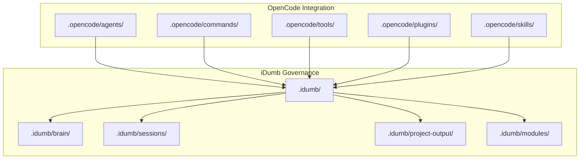
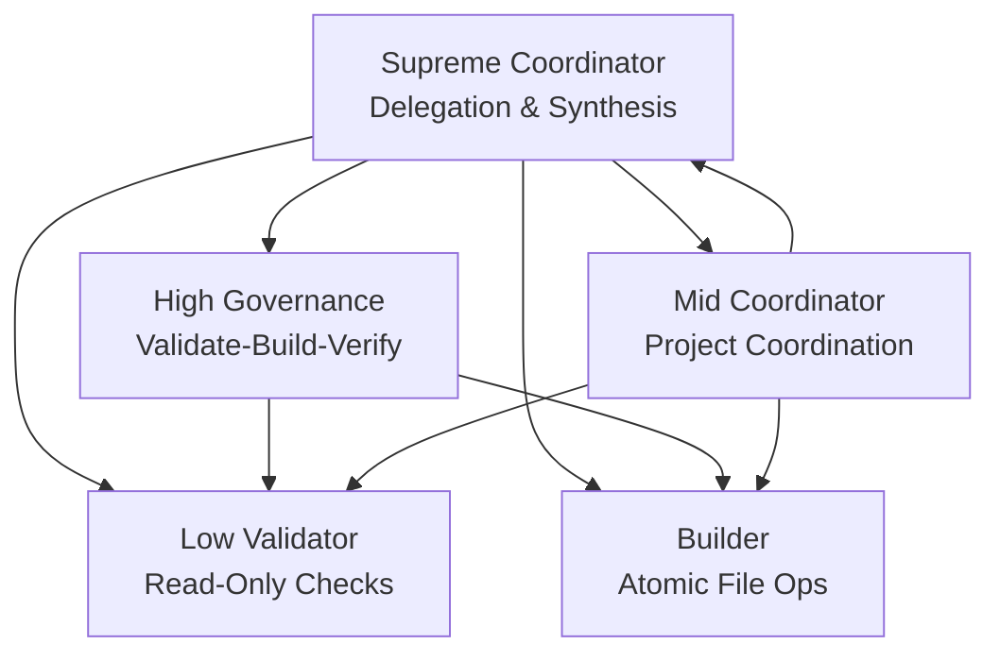
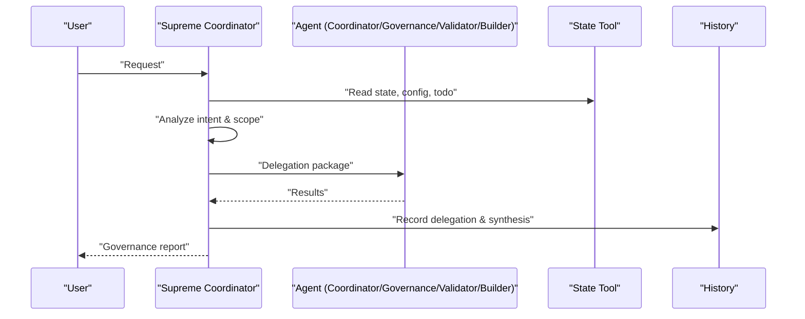
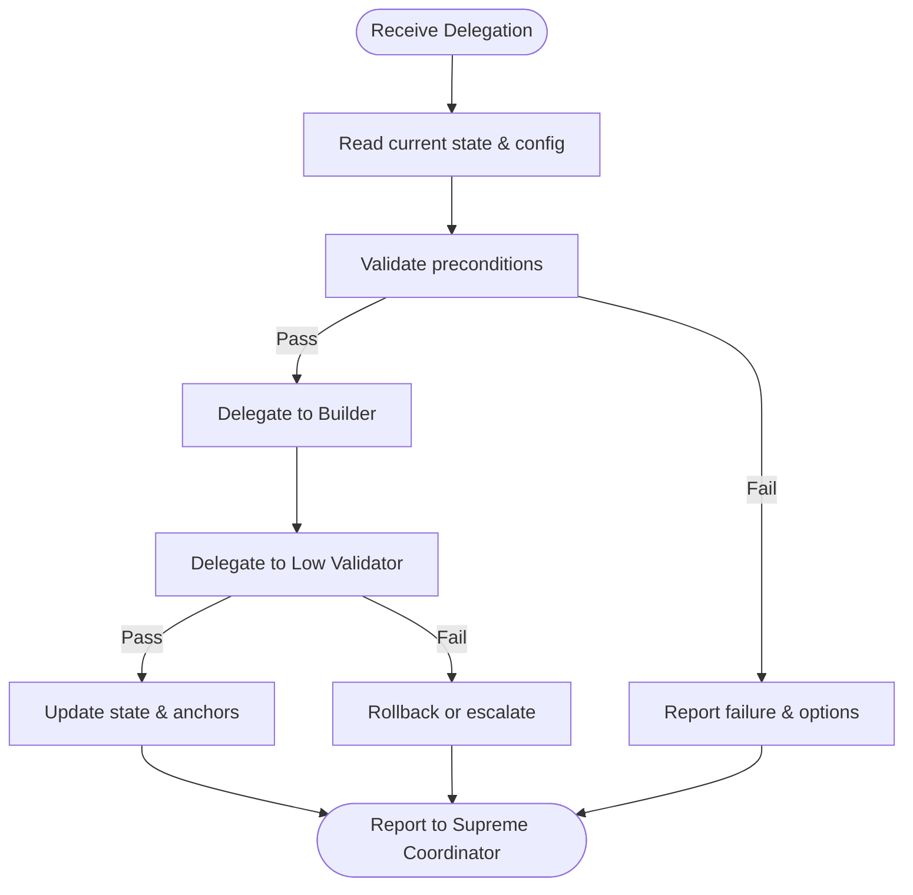
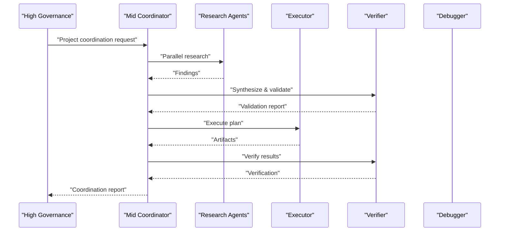
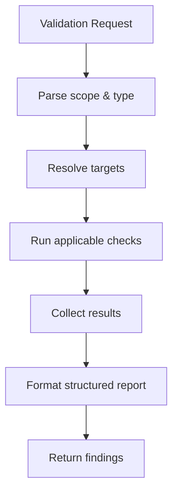
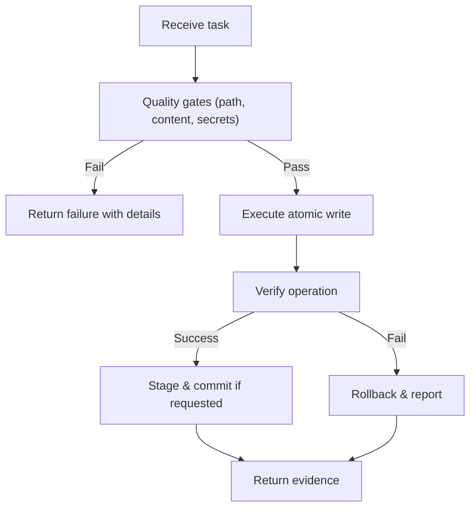
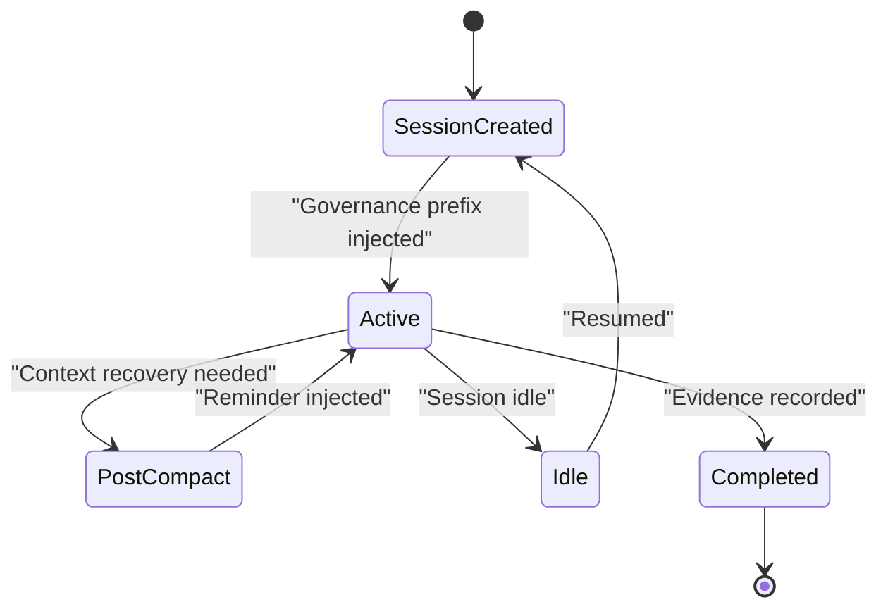
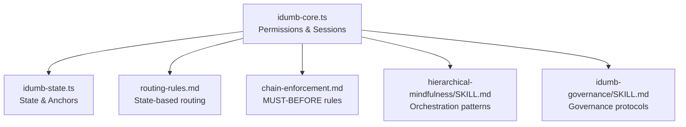

# Agent System

<cite>
**Referenced Files in This Document**
- [AGENTS.md](file://AGENTS.md)
- [idumb-supreme-coordinator.md](file://src/agents/idumb-supreme-coordinator.md)
- [idumb-high-governance.md](file://src/agents/idumb-high-governance.md)
- [idumb-mid-coordinator.md](file://src/agents/idumb-mid-coordinator.md)
- [idumb-low-validator.md](file://src/agents/idumb-low-validator.md)
- [idumb-builder.md](file://src/agents/idumb-builder.md)
- [idumb-core.ts](file://src/plugins/idumb-core.ts)
- [idumb-state.ts](file://src/tools/idumb-state.ts)
- [routing-rules.md](file://src/router/routing-rules.md)
- [chain-enforcement.md](file://src/router/chain-enforcement.md)
- [hierarchical-mindfulness/SKILL.md](file://src/skills/hierarchical-mindfulness/SKILL.md)
- [idumb-governance/SKILL.md](file://src/skills/idumb-governance/SKILL.md)
</cite>

## Table of Contents
1. [Introduction](#introduction)
2. [Project Structure](#project-structure)
3. [Core Components](#core-components)
4. [Architecture Overview](#architecture-overview)
5. [Detailed Component Analysis](#detailed-component-analysis)
6. [Dependency Analysis](#dependency-analysis)
7. [Performance Considerations](#performance-considerations)
8. [Troubleshooting Guide](#troubleshooting-guide)
9. [Conclusion](#conclusion)
10. [Appendices](#appendices)

## Introduction
This document describes the four-tier hierarchical agent architecture of iDumb (Intelligent Delegation Using Managed Boundaries). The system enforces strict delegation, permission, and governance rules across five agent categories: Supreme Coordinator (planning and delegation), High Governance (validation and coordination), Mid Coordinator (project execution), Low Validator (read-only verification), and Builder (file operations). It covers spawning mechanisms, permission definitions, delegation protocols, lifecycle transitions, inter-agent coordination, conflict resolution, monitoring, debugging, and practical examples.

## Project Structure
The agent system is distributed as an installable plugin that places agent profiles, commands, tools, and skills under `.opencode/`, while governance state persists under `.idumb/`. The core plugin (`idumb-core.ts`) intercepts tool usage, enforces permissions, tracks sessions, and manages checkpoints and governance history.

**Diagram sources**
- [AGENTS.md](file://AGENTS.md#L95-L108)
- [idumb-core.ts](file://src/plugins/idumb-core.ts#L1-L14)

**Section sources**
- [AGENTS.md](file://AGENTS.md#L10-L108)

## Core Components
- Supreme Coordinator: Orchestrator that receives all user requests, classifies intent, selects appropriate agents, and synthesizes results with governance evidence.
- High Governance: Meta-level coordinator that validates, builds, and verifies framework changes; enforces validate-build-verify cycles.
- Mid Coordinator: Bridges governance and project execution; coordinates research, planning, verification, and debugging.
- Low Validator: Read-only validation agent that executes discrete checks and returns structured findings.
- Builder: Only agent authorized to write/edit files; performs atomic operations with evidence and commit protocols.

**Section sources**
- [idumb-supreme-coordinator.md](file://src/agents/idumb-supreme-coordinator.md#L1-L710)
- [idumb-high-governance.md](file://src/agents/idumb-high-governance.md#L1-L717)
- [idumb-mid-coordinator.md](file://src/agents/idumb-mid-coordinator.md#L1-L821)
- [idumb-low-validator.md](file://src/agents/idumb-low-validator.md#L1-L865)
- [idumb-builder.md](file://src/agents/idumb-builder.md#L1-L958)

## Architecture Overview
The system enforces a strict “Chain Cannot Break” hierarchy: Milestone → Phase → Plan → Task, with roles coordinator → governance → validator → builder. The plugin intercepts tool usage, enforces permissions, tracks sessions, and maintains governance history. Routing rules and chain enforcement ensure state-appropriate command execution and prerequisites.

**Diagram sources**
- [AGENTS.md](file://AGENTS.md#L81-L89)
- [idumb-supreme-coordinator.md](file://src/agents/idumb-supreme-coordinator.md#L144-L197)
- [idumb-high-governance.md](file://src/agents/idumb-high-governance.md#L142-L206)
- [idumb-mid-coordinator.md](file://src/agents/idumb-mid-coordinator.md#L146-L215)

## Detailed Component Analysis

### Supreme Coordinator
- Role: Entry point for all requests; never executes directly; orchestrates delegation.
- Responsibilities: Intent classification, delegation selection, context establishment, progress monitoring, synthesis, and governance reporting.
- Delegation patterns: Single agent, chain, and parallel delegations depending on complexity.
- Evidence-based reporting: Governance reports, research deliverables, and error reports.

**Diagram sources**
- [idumb-supreme-coordinator.md](file://src/agents/idumb-supreme-coordinator.md#L269-L467)
- [idumb-state.ts](file://src/tools/idumb-state.ts#L80-L179)

**Section sources**
- [idumb-supreme-coordinator.md](file://src/agents/idumb-supreme-coordinator.md#L75-L619)

### High Governance
- Role: Meta-level coordinator for framework operations; validates, builds, verifies, and reports.
- Validate-Build-Verify cycle: Pre-change validation, builder execution, post-change verification.
- Scope: Restricted to `.idumb/`, `.opencode/`, and framework-related directories.

**Diagram sources**
- [idumb-high-governance.md](file://src/agents/idumb-high-governance.md#L252-L437)

**Section sources**
- [idumb-high-governance.md](file://src/agents/idumb-high-governance.md#L73-L635)

### Mid Coordinator
- Role: Bridges governance and project execution; coordinates research, planning, verification, and debugging.
- Strategy: Parallel execution for independent work, sequential for dependencies; escalation to governance for meta-level issues.

**Diagram sources**
- [idumb-mid-coordinator.md](file://src/agents/idumb-mid-coordinator.md#L247-L498)

**Section sources**
- [idumb-mid-coordinator.md](file://src/agents/idumb-mid-coordinator.md#L66-L714)

### Low Validator
- Role: Read-only validation; executes discrete checks (existence, syntax, schema, structure, tests, lint, stubs).
- Constraints: Cannot delegate, cannot modify state, cannot spawn agents; returns structured findings.

**Diagram sources**
- [idumb-low-validator.md](file://src/agents/idumb-low-validator.md#L497-L679)

**Section sources**
- [idumb-low-validator.md](file://src/agents/idumb-low-validator.md#L46-L797)

### Builder
- Role: Only agent authorized to write/edit files; performs atomic operations with quality gates and commit protocols.
- Scope: META paths only (`.idumb/`, `src/`, `.plugin-dev/`); enforces path safety, syntax/schema validation, secrets scanning, and conflict detection.

**Diagram sources**
- [idumb-builder.md](file://src/agents/idumb-builder.md#L547-L700)

**Section sources**
- [idumb-builder.md](file://src/agents/idumb-builder.md#L88-L700)

### Permission Model and Delegation Matrix
- Meta-Governance: Can delegate, task, bash, edit, write.
- Coordinators: Can delegate, task; no write/edit; limited bash.
- Researchers: Read-only; no delegation.
- Validators: Read-only; no delegation.
- Builder: Can edit/write; can run bash; cannot delegate.

**Section sources**
- [AGENTS.md](file://AGENTS.md#L135-L144)

### Spawning Mechanisms and Inter-Agent Communication
- Spawning: Supreme Coordinator constructs delegation packages with context, constraints, success criteria, and report format; delegates via task tool.
- Monitoring: Progress tracked via state history, TODO updates, and checkpoints.
- Handoffs: Structured returns and evidence ensure traceability across agent boundaries.

**Section sources**
- [idumb-supreme-coordinator.md](file://src/agents/idumb-supreme-coordinator.md#L348-L427)

### Lifecycle and State Transitions
- Creation: Session created; plugin initializes config, metrics, stall detection, and output style.
- Activation: Governance prefix injected at session start; reminders after compaction.
- Execution: Tool interception logs violations; first-tool enforcement; file-modification logging.
- Completion: Evidence recorded; history updated; optional commit.

**Diagram sources**
- [idumb-core.ts](file://src/plugins/idumb-core.ts#L138-L341)

**Section sources**
- [idumb-core.ts](file://src/plugins/idumb-core.ts#L130-L341)

### Conflict Resolution and Chain Enforcement
- MUST-BEFORE rules: Enforce prerequisites across initialization, project definition, phase execution, and validation.
- Enforcement levels: HARD_BLOCK (cannot proceed), SOFT_BLOCK (with --force), WARN (continue with warning).
- Auto-correction: Redirects, warnings, and suggestions based on state.

**Section sources**
- [chain-enforcement.md](file://src/router/chain-enforcement.md#L120-L257)
- [routing-rules.md](file://src/router/routing-rules.md#L12-L186)

## Dependency Analysis
The system integrates several layers:
- Plugin hooks enforce permissions and track sessions.
- Tools manage state, anchors, history, and session records.
- Routing and chain enforcement govern command execution and prerequisites.
- Skills provide mindfulness and governance protocols.

**Diagram sources**
- [idumb-core.ts](file://src/plugins/idumb-core.ts#L1-L14)
- [idumb-state.ts](file://src/tools/idumb-state.ts#L1-L557)
- [routing-rules.md](file://src/router/routing-rules.md#L1-L186)
- [chain-enforcement.md](file://src/router/chain-enforcement.md#L1-L257)
- [hierarchical-mindfulness/SKILL.md](file://src/skills/hierarchical-mindfulness/SKILL.md#L1-L357)
- [idumb-governance/SKILL.md](file://src/skills/idumb-governance/SKILL.md#L1-L343)

**Section sources**
- [idumb-core.ts](file://src/plugins/idumb-core.ts#L1-L1092)
- [idumb-state.ts](file://src/tools/idumb-state.ts#L1-L557)

## Performance Considerations
- Parallel delegation: Launch independent work simultaneously to reduce total time.
- Minimal footprint: Validators run read-only checks without side effects.
- Atomic operations: Builder ensures complete success or explicit rollback.
- Context preservation: Anchors and compaction-aware injection minimize rework after context loss.
- Metrics and stall detection: Execution metrics and stall detection support performance tuning.

[No sources needed since this section provides general guidance]

## Troubleshooting Guide
- Permission denials: The plugin denies unauthorized tools and logs violations; adjust agent permissions or escalate appropriately.
- Session resumption: If idle > 48 hours, require user confirmation; use anchors and recent history to rebuild context.
- Chain violations: Hard/soft/block actions guide corrective steps; use remediation options (prerequisite commands, overrides, checkpoints).
- Validation failures: Review structured reports; re-run validators; ensure freshness and schema compliance.
- Monitoring: Use state history, TODO updates, and plugin logs to trace issues.

**Section sources**
- [idumb-core.ts](file://src/plugins/idumb-core.ts#L651-L741)
- [chain-enforcement.md](file://src/router/chain-enforcement.md#L238-L257)
- [idumb-low-validator.md](file://src/agents/idumb-low-validator.md#L628-L677)

## Conclusion
The iDumb agent system enforces a robust, evidence-based governance model through strict delegation, permission enforcement, and validation protocols. The four-tier hierarchy—Supreme Coordinator, High Governance, Mid Coordinator, Low Validator, and Builder—ensures safe, traceable, and auditable operations across framework and project scopes. Skills and plugin hooks provide mindfulness, session awareness, and chain enforcement to maintain integrity and resilience.

[No sources needed since this section summarizes without analyzing specific files]

## Appendices

### Practical Examples
- Research coordination: Supreme Coordinator → Project Researcher → Skeptic Validator → Research Synthesizer → Report.
- Phase execution: Supreme Coordinator → Mid Coordinator → Planner → Plan Checker → Executor → Verifier → Integration Checker → Report.
- Meta change: Supreme Coordinator → High Governance → Low Validator (pre-check) → Builder → Low Validator (post-check) → Report.

**Section sources**
- [idumb-supreme-coordinator.md](file://src/agents/idumb-supreme-coordinator.md#L231-L256)
- [idumb-mid-coordinator.md](file://src/agents/idumb-mid-coordinator.md#L364-L412)
- [idumb-high-governance.md](file://src/agents/idumb-high-governance.md#L154-L188)

### Customization and Configuration
- Output style: System prompt transformation supports configurable output styles; style cache preserved across messages.
- Enforcement settings: Plugin validates enforcement settings at session start; warnings recorded in history.
- Session management: Create, modify, export, and purge sessions; garbage collection trims old artifacts.

**Section sources**
- [idumb-core.ts](file://src/plugins/idumb-core.ts#L384-L440)
- [idumb-state.ts](file://src/tools/idumb-state.ts#L234-L433)