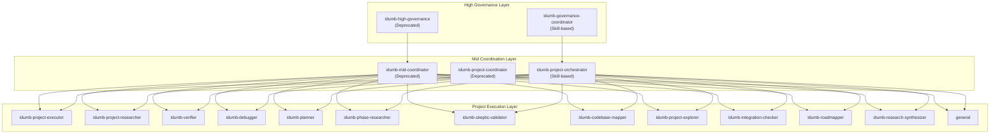
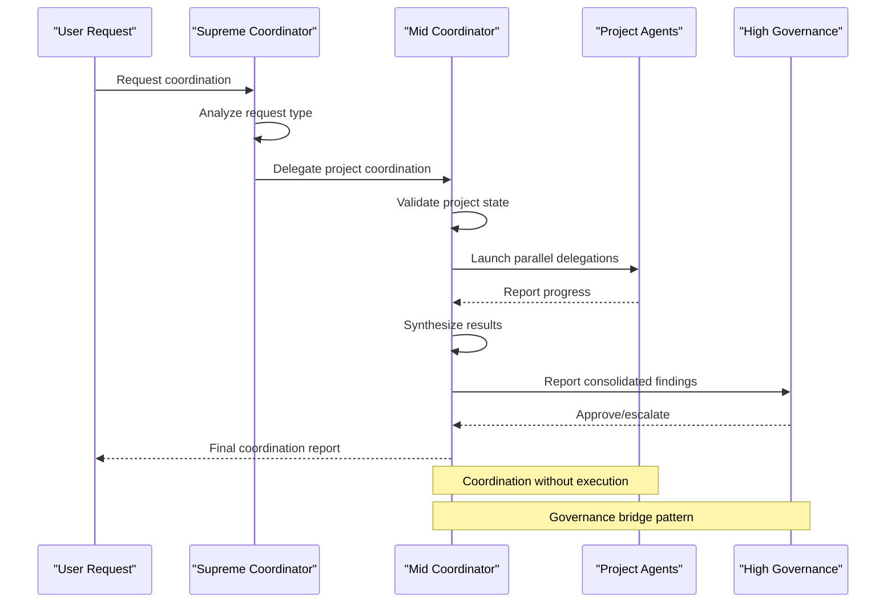
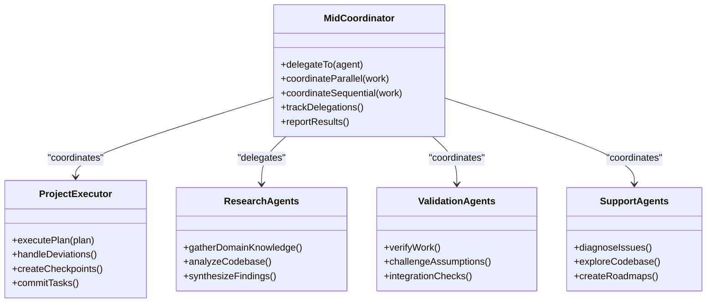
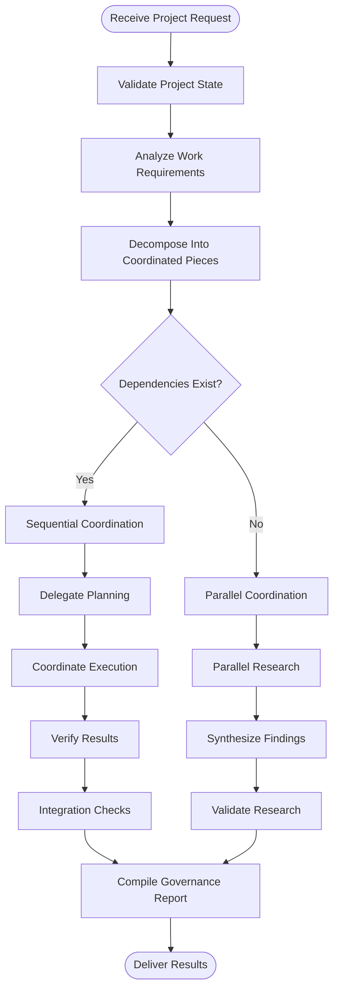
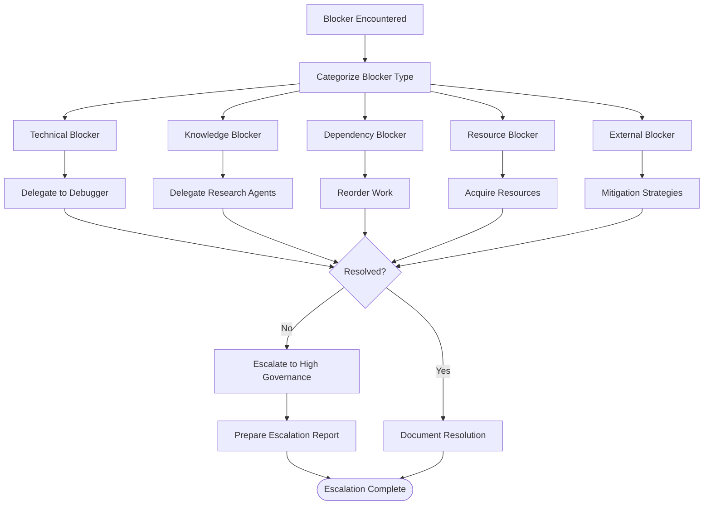
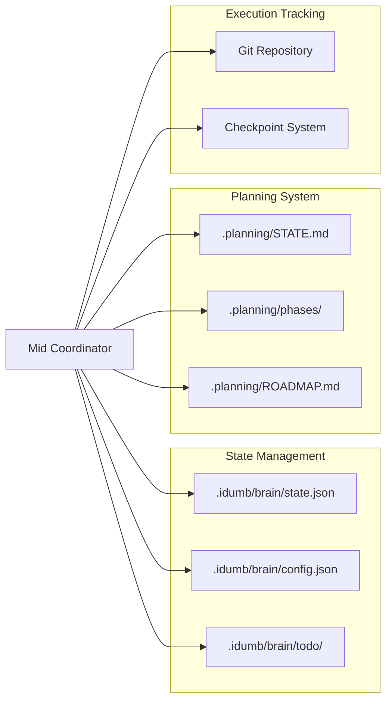

# Mid Coordinator

<cite>
**Referenced Files in This Document**
- [idumb-mid-coordinator.md](file://src/agents/idumb-mid-coordinator.md)
- [idumb-supreme-coordinator.md](file://src/agents/idumb-supreme-coordinator.md)
- [idumb-project-coordinator.md](file://src/agents/idumb-project-coordinator.md)
- [idumb-project-executor.md](file://src/agents/idumb-project-executor.md)
- [execute-phase.md](file://src/commands/idumb/execute-phase.md)
- [execute-phase.md](file://src/workflows/execute-phase.md)
- [discuss-phase.md](file://src/workflows/discuss-phase.md)
- [PHASE-2A-COMPLETION-2026-02-05.md](file://.plugin-dev/PHASE-2A-COMPLETION-2026-02-05.md)
</cite>

## Table of Contents
1. [Introduction](#introduction)
2. [Project Structure](#project-structure)
3. [Core Components](#core-components)
4. [Architecture Overview](#architecture-overview)
5. [Detailed Component Analysis](#detailed-component-analysis)
6. [Dependency Analysis](#dependency-analysis)
7. [Performance Considerations](#performance-considerations)
8. [Troubleshooting Guide](#troubleshooting-guide)
9. [Conclusion](#conclusion)

## Introduction
The Mid Coordinator agent serves as a project-level execution coordinator in the iDumb framework. It bridges high-governance oversight with project execution agents, managing phase workflows, coordinating research efforts, and overseeing implementation progress. As a deprecated component in the transition to skill-based architecture, it remains functional during the migration period while being superseded by the idumb-project-orchestrator skill.

The Mid Coordinator operates under strict delegation-only principles, never executing code directly but orchestrating specialized agents for research, planning, execution, verification, and debugging. It maintains project context, tracks progress across multiple workstreams, and reports consolidated results upstream to high-governance.

## Project Structure
The iDumb framework employs a hierarchical agent architecture with three primary layers:

**Diagram sources**
- [idumb-mid-coordinator.md](file://src/agents/idumb-mid-coordinator.md#L227-L245)
- [idumb-supreme-coordinator.md](file://src/agents/idumb-supreme-coordinator.md#L665-L710)

**Section sources**
- [idumb-mid-coordinator.md](file://src/agents/idumb-mid-coordinator.md#L1-L821)
- [idumb-supreme-coordinator.md](file://src/agents/idumb-supreme-coordinator.md#L1-L710)

## Core Components
The Mid Coordinator manages four primary coordination domains:

### Phase Execution Coordination
Manages end-to-end phase implementation through sequential planning, execution, verification, and integration validation. The coordinator validates prerequisites, launches parallel research when needed, coordinates sequential execution workflows, and compiles comprehensive governance reports.

### Research Coordination
Coordinates parallel research efforts across domain expertise, phase-specific knowledge, and codebase analysis. Utilizes research synthesizers and skeptic validators to produce confidence-rated recommendations and actionable insights.

### Exploration Coordination
Handles codebase exploration and mapping activities for new projects or unfamiliar codebases. Coordinates project explorers, codebase mappers, and domain researchers to establish comprehensive project context.

### Integration Coordination
Manages cross-component validation and integration testing. Coordinates integration checkers, verifiers, and debuggers to ensure system-wide compatibility and functionality.

**Section sources**
- [idumb-mid-coordinator.md](file://src/agents/idumb-mid-coordinator.md#L282-L412)

## Architecture Overview
The Mid Coordinator operates within a three-tier delegation architecture:

**Diagram sources**
- [idumb-supreme-coordinator.md](file://src/agents/idumb-supreme-coordinator.md#L269-L468)
- [idumb-mid-coordinator.md](file://src/agents/idumb-mid-coordinator.md#L247-L498)

The architecture emphasizes separation of concerns through delegation-only operation, ensuring that no agent directly executes project code while maintaining comprehensive oversight and reporting capabilities.

**Section sources**
- [idumb-mid-coordinator.md](file://src/agents/idumb-mid-coordinator.md#L68-L144)
- [idumb-supreme-coordinator.md](file://src/agents/idumb-supreme-coordinator.md#L97-L142)

## Detailed Component Analysis

### Delegation Authority and Agent Relationships
The Mid Coordinator maintains comprehensive delegation authority across all project-level agents:

**Diagram sources**
- [idumb-mid-coordinator.md](file://src/agents/idumb-mid-coordinator.md#L146-L215)

The delegation model follows strict hierarchy rules: agents cannot delegate upward in the hierarchy, cannot handle meta-level work, and must operate within their designated scopes.

**Section sources**
- [idumb-mid-coordinator.md](file://src/agents/idumb-mid-coordinator.md#L146-L226)

### Execution Flow Patterns
The Mid Coordinator implements sophisticated execution flow patterns for different coordination scenarios:

#### Phase Execution Workflow

**Diagram sources**
- [idumb-mid-coordinator.md](file://src/agents/idumb-mid-coordinator.md#L247-L498)

#### Parallel vs Sequential Delegation Strategy
The coordinator employs different delegation strategies based on work dependencies:

**Parallel Delegation Pattern:**
- Research coordination: Domain research, phase research, and codebase mapping
- Independent analysis tasks that can execute simultaneously
- Results synthesized through research synthesizer agent

**Sequential Delegation Pattern:**
- Phase execution: Planning → Plan validation → Execution → Verification → Integration
- Tasks with inherent dependencies requiring ordered completion
- Quality assurance through skeptic validation at critical junctures

**Section sources**
- [idumb-mid-coordinator.md](file://src/agents/idumb-mid-coordinator.md#L195-L225)

### Blocker Resolution and Escalation Protocol
The Mid Coordinator implements comprehensive blocker resolution and escalation procedures:

**Diagram sources**
- [idumb-mid-coordinator.md](file://src/agents/idumb-mid-coordinator.md#L414-L455)

The escalation protocol ensures that project-level blockers are attempted resolution first, with escalation reserved for issues beyond project scope or capability.

**Section sources**
- [idumb-mid-coordinator.md](file://src/agents/idumb-mid-coordinator.md#L414-L455)

### Structured Reporting and Governance Integration
The Mid Coordinator produces comprehensive governance reports in standardized formats:

#### Phase Coordination Complete Report
- Phase identification and status
- Delegation execution tracking
- Parallel execution metrics
- Artifact inventory
- Blocker resolution documentation
- Verification summary
- State update notifications
- Actionable recommendations

#### Research Coordination Complete Report
- Research request and scope
- Researcher deployment tracking
- Synthesis and validation results
- Confidence assessment matrices
- Assumption identification
- Recommendation frameworks
- Artifact documentation

#### Blocker Escalation Report
- Escalation destination and urgency
- Blocker categorization and impact
- Resolution attempts documentation
- Escalation rationale
- Recommended actions
- Impact assessment

**Section sources**
- [idumb-mid-coordinator.md](file://src/agents/idumb-mid-coordinator.md#L500-L673)

## Dependency Analysis
The Mid Coordinator maintains dependencies across multiple framework components:

**Diagram sources**
- [idumb-mid-coordinator.md](file://src/agents/idumb-mid-coordinator.md#L258-L278)

The coordinator relies on persistent state management for context preservation, planning system integration for phase coordination, and execution tracking for progress monitoring.

**Section sources**
- [idumb-mid-coordinator.md](file://src/agents/idumb-mid-coordinator.md#L775-L798)

## Performance Considerations
The Mid Coordinator architecture optimizes performance through strategic delegation patterns:

### Parallel Execution Benefits
- **Time Efficiency**: Parallel research and analysis reduce overall project timeline
- **Resource Utilization**: Multiple agents working simultaneously maximizes throughput
- **Risk Mitigation**: Independent work streams reduce single points of failure
- **Quality Assurance**: Parallel validation through multiple agents improves reliability

### Context Management
- **State Preservation**: Minimal context overhead through state-based coordination
- **Progress Tracking**: Comprehensive TODO system prevents redundant work
- **Checkpoint Protocol**: Atomic checkpoints enable efficient recovery and resumption
- **Evidence Collection**: Structured reporting ensures traceability and auditability

### Governance Integration
- **Hierarchical Delegation**: Maintains proper chain of command and accountability
- **Permission Enforcement**: Strict delegation rules prevent unauthorized operations
- **Escalation Protocols**: Systematic escalation ensures appropriate decision-making authority
- **Reporting Standards**: Standardized formats enable efficient information sharing

## Troubleshooting Guide

### Common Coordination Issues
**Issue**: Agents not responding to delegations
- **Solution**: Verify delegation permissions and agent availability
- **Prevention**: Regular health checks and dependency validation

**Issue**: Blocker resolution failures
- **Solution**: Implement escalation protocols and alternative resolution strategies
- **Prevention**: Comprehensive blocker categorization and mitigation planning

**Issue**: State synchronization problems
- **Solution**: Validate state files and implement recovery procedures
- **Prevention**: Regular state backups and consistency checks

### Migration Considerations
As a deprecated component, the Mid Coordinator requires careful migration planning:

**Transition Path**: 
1. Evaluate current Mid Coordinator usage patterns
2. Identify equivalent skill-based workflows
3. Test migration compatibility
4. Implement gradual transition
5. Monitor performance and functionality

**Migration Benefits**:
- Enhanced modularity through skill-based architecture
- Improved maintainability and extensibility
- Better integration with modern BMAD patterns
- Reduced cognitive load through embedded workflows

**Section sources**
- [PHASE-2A-COMPLETION-2026-02-05.md](file://.plugin-dev/PHASE-2A-COMPLETION-2026-02-05.md#L70-L92)

## Conclusion
The Mid Coordinator agent represents a critical bridge in the iDumb framework's hierarchical coordination architecture. While deprecated in favor of skill-based approaches, it demonstrates sophisticated delegation patterns, comprehensive coordination strategies, and robust governance integration.

Its role in managing project phases, coordinating between specialized agents, and overseeing implementation workflows establishes foundational patterns for modern project orchestration. The transition to skill-based architecture through the idumb-project-orchestrator skill maintains these coordination principles while enhancing modularity, maintainability, and scalability.

The Mid Coordinator's emphasis on delegation-only operation, systematic blocker resolution, and comprehensive reporting continues to influence the broader iDumb framework's approach to project-level execution coordination, ensuring that governance oversight remains paramount while leveraging specialized agent capabilities for optimal project outcomes.