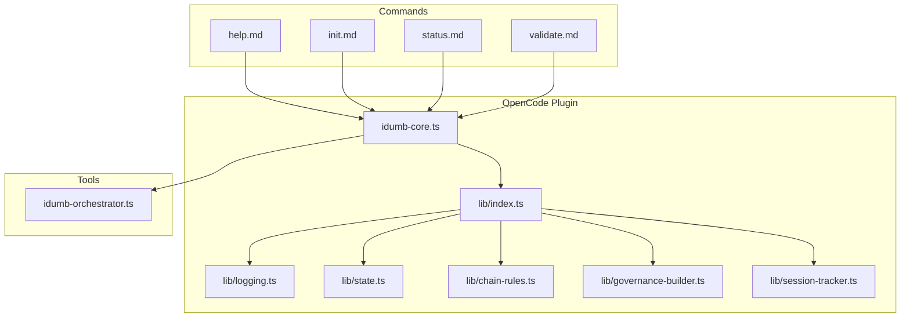
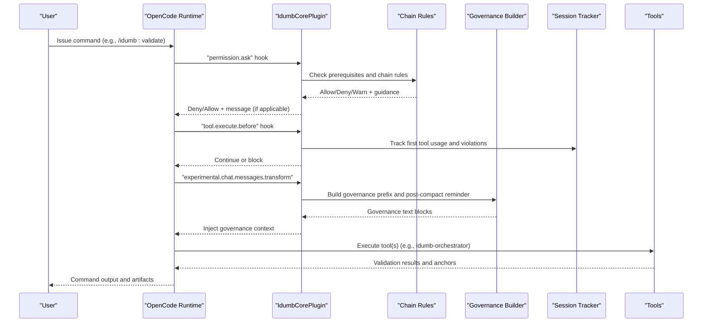
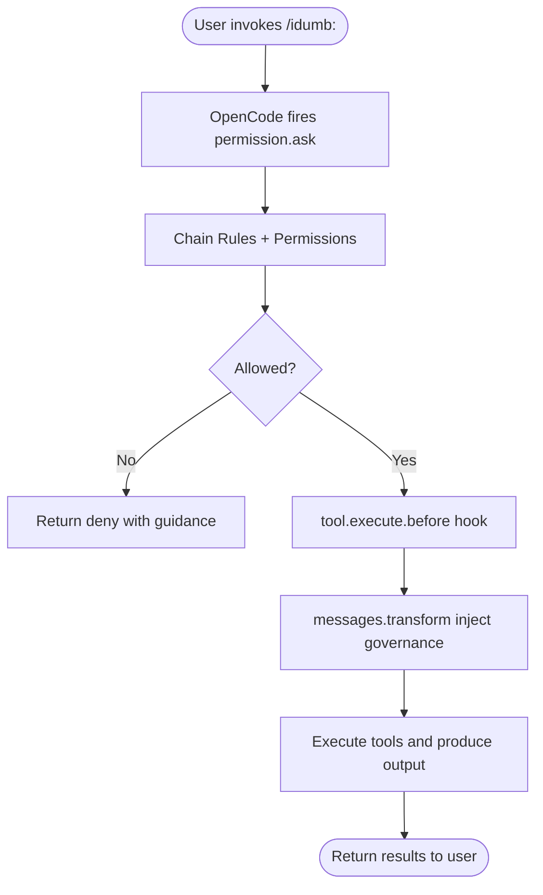
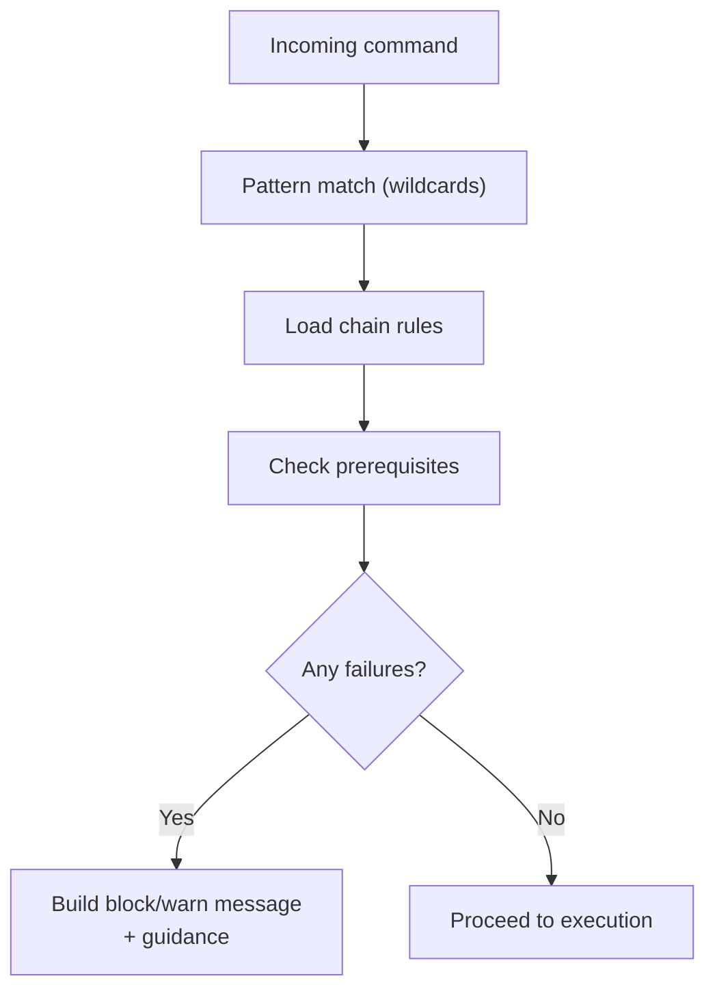
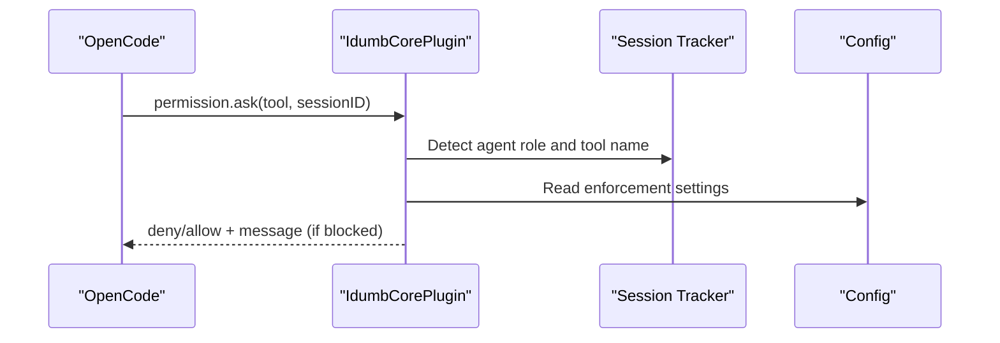
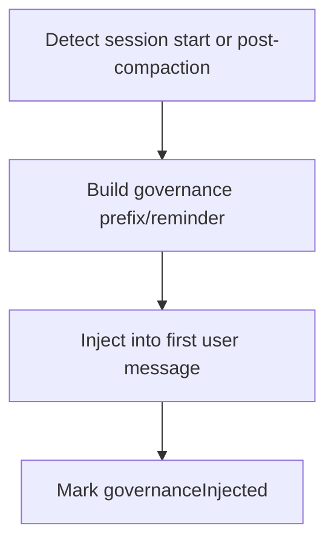
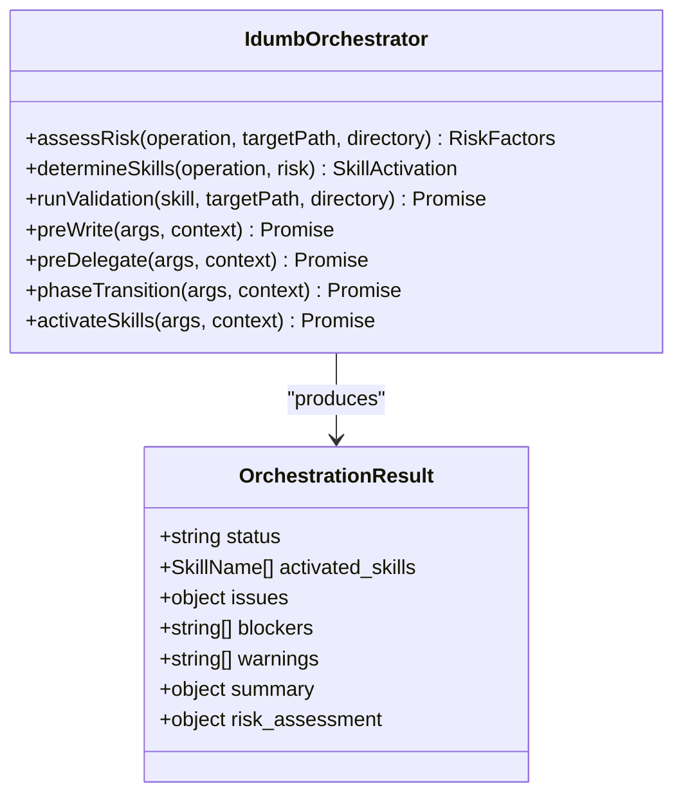
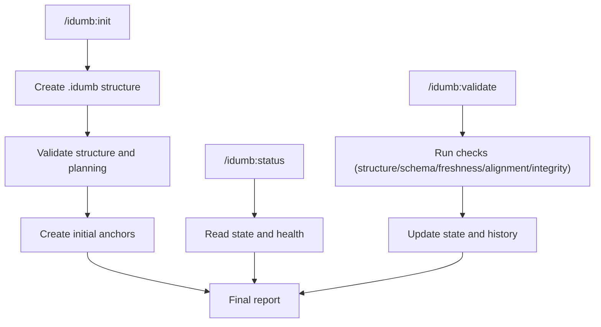
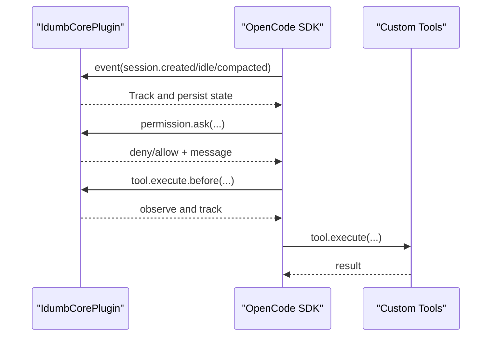
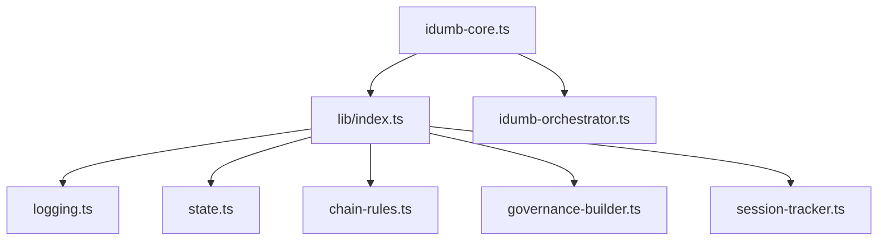

# Command Architecture

<cite>
**Referenced Files in This Document**
- [idumb-core.ts](file://src/plugins/idumb-core.ts)
- [index.ts](file://src/plugins/lib/index.ts)
- [logging.ts](file://src/plugins/lib/logging.ts)
- [state.ts](file://src/plugins/lib/state.ts)
- [chain-rules.ts](file://src/plugins/lib/chain-rules.ts)
- [governance-builder.ts](file://src/plugins/lib/governance-builder.ts)
- [session-tracker.ts](file://src/plugins/lib/session-tracker.ts)
- [opencode.d.ts](file://src/types/opencode.d.ts)
- [idumb-orchestrator.ts](file://src/tools/idumb-orchestrator.ts)
- [help.md](file://src/commands/idumb/help.md)
- [init.md](file://src/commands/idumb/init.md)
- [status.md](file://src/commands/idumb/status.md)
- [validate.md](file://src/commands/idumb/validate.md)
</cite>

## Table of Contents
1. [Introduction](#introduction)
2. [Project Structure](#project-structure)
3. [Core Components](#core-components)
4. [Architecture Overview](#architecture-overview)
5. [Detailed Component Analysis](#detailed-component-analysis)
6. [Dependency Analysis](#dependency-analysis)
7. [Performance Considerations](#performance-considerations)
8. [Troubleshooting Guide](#troubleshooting-guide)
9. [Conclusion](#conclusion)
10. [Appendices](#appendices)

## Introduction
This document explains iDumb’s command architecture and processing pipeline. It covers how commands are registered and invoked, how the OpenCode plugin system orchestrates governance and tool permissions, and how the underlying tool system integrates with commands. It also details command lifecycle management, enforcement rules, error handling, logging, and extensibility patterns. The goal is to make the command flow—from user input to execution—clear and actionable for both technical and non-technical readers.

## Project Structure
The command architecture spans three main areas:
- Commands: Markdown-based command definitions under src/commands/idumb/*.md that define intent, process, and completion format.
- Plugin system: An OpenCode plugin (src/plugins/idumb-core.ts) that intercepts events, enforces chain rules, manages permissions, and injects governance context.
- Tools: Reusable validation and orchestration tools (src/tools/idumb-*.ts) that implement the “what” behind governance decisions.

**Diagram sources**
- [idumb-core.ts](file://src/plugins/idumb-core.ts#L130-L341)
- [index.ts](file://src/plugins/lib/index.ts#L1-L131)
- [logging.ts](file://src/plugins/lib/logging.ts#L1-L118)
- [state.ts](file://src/plugins/lib/state.ts#L1-L189)
- [chain-rules.ts](file://src/plugins/lib/chain-rules.ts#L1-L468)
- [governance-builder.ts](file://src/plugins/lib/governance-builder.ts#L1-L635)
- [session-tracker.ts](file://src/plugins/lib/session-tracker.ts#L1-L385)
- [opencode.d.ts](file://src/types/opencode.d.ts#L1-L101)
- [idumb-orchestrator.ts](file://src/tools/idumb-orchestrator.ts#L1-L527)
- [help.md](file://src/commands/idumb/help.md#L1-L413)
- [init.md](file://src/commands/idumb/init.md#L1-L684)
- [status.md](file://src/commands/idumb/status.md#L1-L398)
- [validate.md](file://src/commands/idumb/validate.md#L1-L518)

**Section sources**
- [idumb-core.ts](file://src/plugins/idumb-core.ts#L130-L341)
- [index.ts](file://src/plugins/lib/index.ts#L1-L131)
- [opencode.d.ts](file://src/types/opencode.d.ts#L1-L101)

## Core Components
- OpenCode plugin entry point: Provides event hooks, permission interception, governance context injection, and compaction support.
- Plugin library: Centralized exports for logging, state, chain rules, governance building, session tracking, and more.
- Command definitions: Markdown-based command specs that describe process, parameters, and completion format.
- Tools: Reusable validation and orchestration utilities that implement governance decisions.

Key responsibilities:
- Event hooks: Track session lifecycle, handle permission requests, inject governance context, and manage compaction.
- Chain enforcement: Enforce MUST-BEFORE and SHOULD-BEFORE command dependencies.
- Governance building: Construct role-specific instructions, tool permissions, and post-compaction reminders.
- State and logging: Persist governance state and maintain bounded logs.

**Section sources**
- [idumb-core.ts](file://src/plugins/idumb-core.ts#L130-L341)
- [index.ts](file://src/plugins/lib/index.ts#L1-L131)
- [logging.ts](file://src/plugins/lib/logging.ts#L1-L118)
- [state.ts](file://src/plugins/lib/state.ts#L1-L189)
- [chain-rules.ts](file://src/plugins/lib/chain-rules.ts#L1-L468)
- [governance-builder.ts](file://src/plugins/lib/governance-builder.ts#L1-L635)
- [session-tracker.ts](file://src/plugins/lib/session-tracker.ts#L1-L385)
- [opencode.d.ts](file://src/types/opencode.d.ts#L1-L101)

## Architecture Overview
The command processing pipeline integrates OpenCode hooks, plugin enforcement, and tool orchestration:

**Diagram sources**
- [idumb-core.ts](file://src/plugins/idumb-core.ts#L651-L741)
- [idumb-core.ts](file://src/plugins/idumb-core.ts#L752-L800)
- [idumb-core.ts](file://src/plugins/idumb-core.ts#L446-L645)
- [chain-rules.ts](file://src/plugins/lib/chain-rules.ts#L34-L118)
- [governance-builder.ts](file://src/plugins/lib/governance-builder.ts#L200-L346)
- [session-tracker.ts](file://src/plugins/lib/session-tracker.ts#L97-L117)
- [idumb-orchestrator.ts](file://src/tools/idumb-orchestrator.ts#L257-L343)

## Detailed Component Analysis

### Command Registration and Invocation
- Commands are defined as Markdown files under src/commands/idumb/*.md. They declare description, agent, and structured process steps.
- Invocation triggers OpenCode hooks, which route to the plugin for enforcement and context injection.
- The plugin evaluates chain rules and permissions before allowing tool execution.

**Diagram sources**
- [idumb-core.ts](file://src/plugins/idumb-core.ts#L651-L741)
- [idumb-core.ts](file://src/plugins/idumb-core.ts#L752-L800)
- [idumb-core.ts](file://src/plugins/idumb-core.ts#L446-L645)
- [chain-rules.ts](file://src/plugins/lib/chain-rules.ts#L34-L118)

**Section sources**
- [help.md](file://src/commands/idumb/help.md#L1-L413)
- [init.md](file://src/commands/idumb/init.md#L1-L684)
- [status.md](file://src/commands/idumb/status.md#L1-L398)
- [validate.md](file://src/commands/idumb/validate.md#L1-L518)

### Chain Enforcement and Parameter Parsing
- Chain rules define MUST-BEFORE and SHOULD-BEFORE dependencies for commands. They support wildcard matching and path placeholders like {phase}.
- Prerequisite checks evaluate filesystem existence, state conditions, and validation evidence.
- Guidance builders construct actionable remediation messages for missing prerequisites.

**Diagram sources**
- [chain-rules.ts](file://src/plugins/lib/chain-rules.ts#L128-L151)
- [chain-rules.ts](file://src/plugins/lib/chain-rules.ts#L183-L291)
- [chain-rules.ts](file://src/plugins/lib/chain-rules.ts#L375-L422)
- [chain-rules.ts](file://src/plugins/lib/chain-rules.ts#L427-L467)

**Section sources**
- [chain-rules.ts](file://src/plugins/lib/chain-rules.ts#L1-L468)

### Permission Interception and Tool Enforcement
- The plugin inspects tool usage against agent roles and enforces:
  - First-tool usage rules (non-blocking warnings for non-compliance).
  - File-modification restrictions for non-builder agents (log-only).
  - Blocking behavior controlled by configuration (blockOnPermissionViolation).
- Violations are tracked and can be transformed into user-friendly messages.

**Diagram sources**
- [idumb-core.ts](file://src/plugins/idumb-core.ts#L651-L741)
- [session-tracker.ts](file://src/plugins/lib/session-tracker.ts#L174-L194)
- [governance-builder.ts](file://src/plugins/lib/governance-builder.ts#L21-L139)

**Section sources**
- [idumb-core.ts](file://src/plugins/idumb-core.ts#L651-L741)
- [governance-builder.ts](file://src/plugins/lib/governance-builder.ts#L1-L140)
- [session-tracker.ts](file://src/plugins/lib/session-tracker.ts#L1-L194)

### Governance Context Injection and Post-Compaction Recovery
- On session start or post-compaction, the plugin builds governance prefixes and reminders tailored to agent roles and current state.
- It detects compaction indicators and semantic context loss to re-inject governance context and provide recovery guidance.

**Diagram sources**
- [idumb-core.ts](file://src/plugins/idumb-core.ts#L446-L645)
- [governance-builder.ts](file://src/plugins/lib/governance-builder.ts#L200-L346)
- [governance-builder.ts](file://src/plugins/lib/governance-builder.ts#L466-L576)

**Section sources**
- [idumb-core.ts](file://src/plugins/idumb-core.ts#L446-L645)
- [governance-builder.ts](file://src/plugins/lib/governance-builder.ts#L1-L635)

### Tool Orchestration and Validation
- The meta orchestrator coordinates validation across security, quality, and performance domains based on operation type and risk assessment.
- It supports dry-run planning, pre-write checks, delegation validation, and phase transitions.

**Diagram sources**
- [idumb-orchestrator.ts](file://src/tools/idumb-orchestrator.ts#L27-L45)
- [idumb-orchestrator.ts](file://src/tools/idumb-orchestrator.ts#L56-L123)
- [idumb-orchestrator.ts](file://src/tools/idumb-orchestrator.ts#L134-L167)
- [idumb-orchestrator.ts](file://src/tools/idumb-orchestrator.ts#L212-L251)
- [idumb-orchestrator.ts](file://src/tools/idumb-orchestrator.ts#L257-L343)

**Section sources**
- [idumb-orchestrator.ts](file://src/tools/idumb-orchestrator.ts#L1-L527)

### Command Lifecycle Management
- Initialization: Creates governance structure, validates completeness, and records anchors and history.
- Status: Reports governance state, health, anchors, and recommendations.
- Validation: Runs comprehensive checks, updates state, and creates validation reports and anchors for critical findings.

**Diagram sources**
- [init.md](file://src/commands/idumb/init.md#L16-L460)
- [status.md](file://src/commands/idumb/status.md#L75-L222)
- [validate.md](file://src/commands/idumb/validate.md#L55-L328)

**Section sources**
- [init.md](file://src/commands/idumb/init.md#L1-L684)
- [status.md](file://src/commands/idumb/status.md#L1-L398)
- [validate.md](file://src/commands/idumb/validate.md#L1-L518)

### Extensibility and OpenCode Integration
- The plugin exposes OpenCode hook contracts for event handling, permission interception, tool execution, and experimental features like compaction and system prompt transformation.
- Tools are declared using the OpenCode tool factory with typed schemas and execute functions.

**Diagram sources**
- [idumb-core.ts](file://src/plugins/idumb-core.ts#L138-L341)
- [idumb-core.ts](file://src/plugins/idumb-core.ts#L651-L741)
- [idumb-core.ts](file://src/plugins/idumb-core.ts#L752-L800)
- [opencode.d.ts](file://src/types/opencode.d.ts#L87-L94)

**Section sources**
- [opencode.d.ts](file://src/types/opencode.d.ts#L1-L101)
- [idumb-core.ts](file://src/plugins/idumb-core.ts#L130-L341)

## Dependency Analysis
The plugin system composes modular libraries that encapsulate distinct concerns:

**Diagram sources**
- [idumb-core.ts](file://src/plugins/idumb-core.ts#L130-L341)
- [index.ts](file://src/plugins/lib/index.ts#L1-L131)
- [logging.ts](file://src/plugins/lib/logging.ts#L1-L118)
- [state.ts](file://src/plugins/lib/state.ts#L1-L189)
- [chain-rules.ts](file://src/plugins/lib/chain-rules.ts#L1-L468)
- [governance-builder.ts](file://src/plugins/lib/governance-builder.ts#L1-L635)
- [session-tracker.ts](file://src/plugins/lib/session-tracker.ts#L1-L385)
- [idumb-orchestrator.ts](file://src/tools/idumb-orchestrator.ts#L1-L527)

**Section sources**
- [index.ts](file://src/plugins/lib/index.ts#L1-L131)

## Performance Considerations
- Logging: Automatic log rotation prevents unbounded growth; bounded history entries limit state expansion.
- Session tracking: TTL-based cleanup and LRU eviction cap memory usage for long-running environments.
- Risk-aware orchestration: Tools select validation suites based on operation and risk, reducing unnecessary work.
- Compaction: Minimal context injection preserves performance while maintaining governance continuity.

[No sources needed since this section provides general guidance]

## Troubleshooting Guide
Common issues and resolutions:
- Initialization failures: Use repair flows and re-run initialization with force flags.
- Validation failures: Address structure and schema issues, then re-run validation with fix flags.
- Permission denials: Follow guidance to delegate to appropriate agents or adjust enforcement settings.
- Stale state warnings: Run validation to refresh context and anchors.

**Section sources**
- [init.md](file://src/commands/idumb/init.md#L606-L617)
- [validate.md](file://src/commands/idumb/validate.md#L439-L485)
- [idumb-core.ts](file://src/plugins/idumb-core.ts#L651-L741)
- [state.ts](file://src/plugins/lib/state.ts#L79-L101)

## Conclusion
iDumb’s command architecture blends declarative command definitions with a robust OpenCode plugin that enforces governance, manages permissions, and orchestrates tool execution. The plugin library modularizes core concerns—logging, state, chain rules, governance building, and session tracking—ensuring maintainability and scalability. Together, these components deliver a secure, auditable, and extensible command processing pipeline.

[No sources needed since this section summarizes without analyzing specific files]

## Appendices

### Command Interface Design and Parameter Parsing
- Commands define process steps and completion formats. Parameters are parsed implicitly from command text and enforced by chain rules and permission hooks.
- Tools expose typed schemas and execute functions, enabling consistent parameter validation and error handling.

**Section sources**
- [help.md](file://src/commands/idumb/help.md#L26-L36)
- [validate.md](file://src/commands/idumb/validate.md#L16-L51)
- [idumb-orchestrator.ts](file://src/tools/idumb-orchestrator.ts#L257-L264)

### Relationship Between Commands and the Underlying Tool System
- Commands delegate work to tools and governance layers. Tools encapsulate validation and orchestration logic, while the plugin ensures proper sequencing and enforcement.

**Section sources**
- [init.md](file://src/commands/idumb/init.md#L27-L34)
- [validate.md](file://src/commands/idumb/validate.md#L74-L93)
- [idumb-orchestrator.ts](file://src/tools/idumb-orchestrator.ts#L212-L251)

### Logging Mechanisms
- File-based logging with automatic rotation and bounded archives. All plugin operations log to a dedicated governance log path.

**Section sources**
- [logging.ts](file://src/plugins/lib/logging.ts#L1-L118)

### Error Handling Strategies
- Hooks wrap operations in try/catch to prevent crashes. Permission and tool interception return structured messages and track violations for auditability.

**Section sources**
- [idumb-core.ts](file://src/plugins/idumb-core.ts#L338-L341)
- [idumb-core.ts](file://src/plugins/idumb-core.ts#L737-L740)