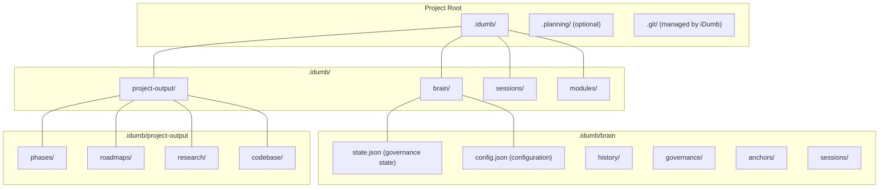
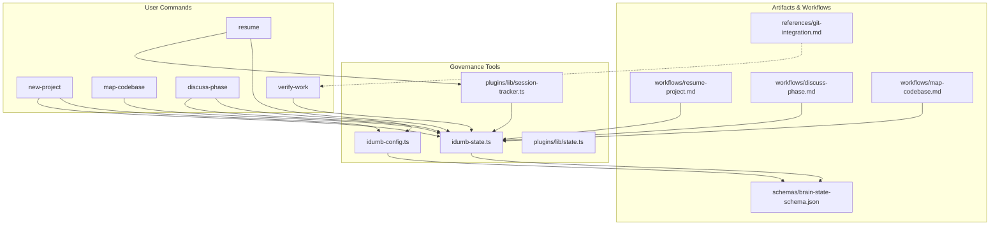
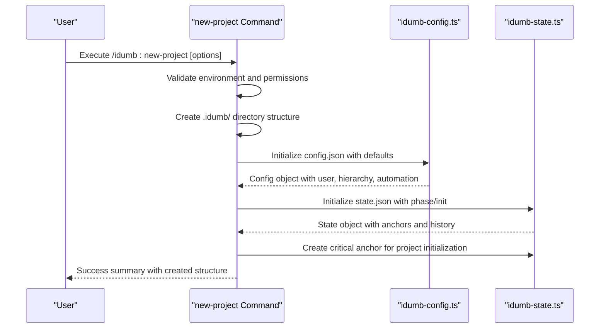
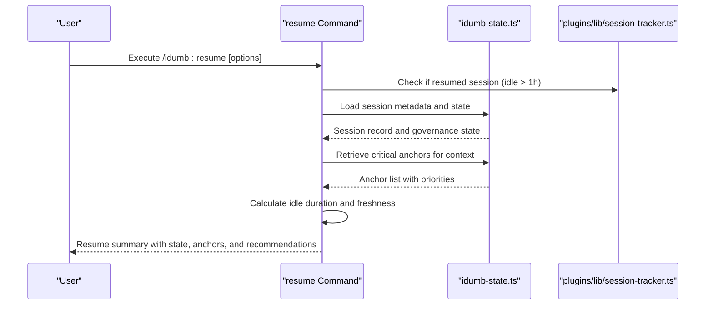
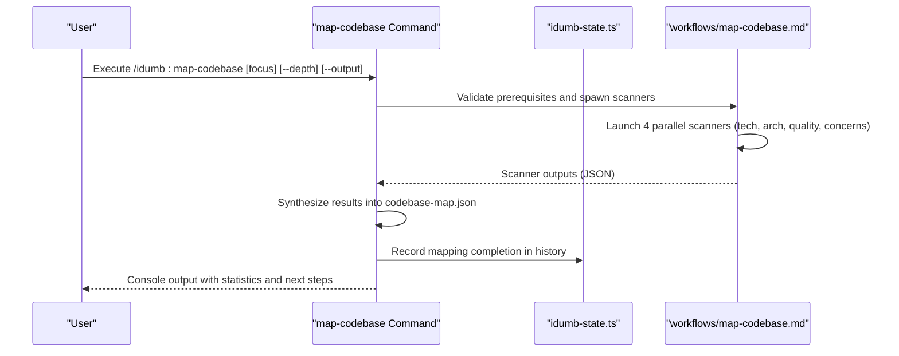
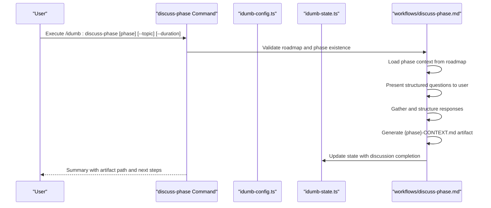
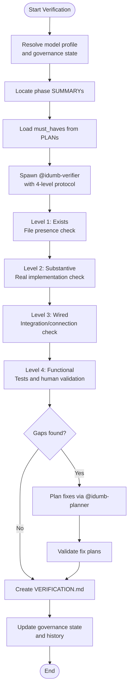
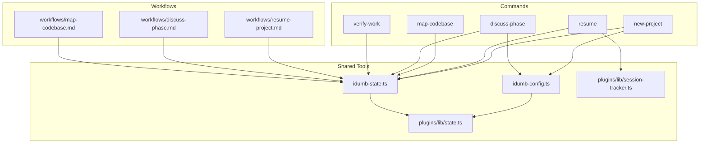

# Project Management Commands

<cite>
**Referenced Files in This Document**
- [new-project.md](file://src/commands/idumb/new-project.md)
- [resume.md](file://src/commands/idumb/resume.md)
- [map-codebase.md](file://src/commands/idumb/map-codebase.md)
- [discuss-phase.md](file://src/commands/idumb/discuss-phase.md)
- [verify-work.md](file://src/commands/idumb/verify-work.md)
- [idumb-config.ts](file://src/tools/idumb-config.ts)
- [idumb-state.ts](file://src/tools/idumb-state.ts)
- [state.ts](file://src/plugins/lib/state.ts)
- [session-tracker.ts](file://src/plugins/lib/session-tracker.ts)
- [resume-project.md](file://src/workflows/resume-project.md)
- [discuss-phase.md](file://src/workflows/discuss-phase.md)
- [map-codebase.md](file://src/workflows/map-codebase.md)
- [config.md](file://src/templates/config.md)
- [context.md](file://src/templates/context.md)
- [git-integration.md](file://src/references/git-integration.md)
- [brain-state-schema.json](file://src/schemas/brain-state-schema.json)
</cite>

## Table of Contents
1. [Introduction](#introduction)
2. [Project Structure](#project-structure)
3. [Core Components](#core-components)
4. [Architecture Overview](#architecture-overview)
5. [Detailed Component Analysis](#detailed-component-analysis)
6. [Dependency Analysis](#dependency-analysis)
7. [Performance Considerations](#performance-considerations)
8. [Troubleshooting Guide](#troubleshooting-guide)
9. [Conclusion](#conclusion)
10. [Appendices](#appendices)

## Introduction
This document provides comprehensive documentation for iDumb's project management commands, focusing on five core capabilities: initializing projects, resuming sessions, mapping codebases, facilitating collaborative discussions, and verifying work. It explains project lifecycle management, session persistence, and context preservation, along with configuration, workspace management, and collaboration features. The guide also covers command integration with version control systems, artifact management, and project documentation, alongside considerations for scaling, multi-team coordination, and enterprise deployment.

## Project Structure
iDumb organizes project governance and artifacts under a dedicated `.idumb/` directory with distinct substructures for brain state, governance, project outputs, and sessions. The system integrates with optional planning frameworks and maintains state consistency across commands and workflows.

**Diagram sources**
- [new-project.md](file://src/commands/idumb/new-project.md#L70-L95)
- [idumb-config.ts](file://src/tools/idumb-config.ts#L372-L391)

**Section sources**
- [new-project.md](file://src/commands/idumb/new-project.md#L14-L48)
- [idumb-config.ts](file://src/tools/idumb-config.ts#L372-L391)

## Core Components
This section outlines the five project management commands and their roles in the iDumb ecosystem.

- new-project: Initializes a new iDumb-governed project with governance structure, configuration, and state management.
- resume: Resumes a previously idle session with context recovery and freshness validation.
- map-codebase: Performs parallel codebase analysis to generate structured maps and documentation.
- discuss-phase: Facilitates collaborative discussion to clarify phase goals, constraints, and approaches.
- verify-work: Validates completed work against acceptance criteria using a four-level verification protocol.

**Section sources**
- [new-project.md](file://src/commands/idumb/new-project.md#L8-L12)
- [resume.md](file://src/commands/idumb/resume.md#L23-L25)
- [map-codebase.md](file://src/commands/idumb/map-codebase.md#L11-L13)
- [discuss-phase.md](file://src/commands/idumb/discuss-phase.md#L10-L12)
- [verify-work.md](file://src/commands/idumb/verify-work.md#L10-L16)

## Architecture Overview
The project management commands integrate with iDumb's governance tools and workflows to maintain state, preserve context, and coordinate collaboration. The architecture emphasizes:
- Centralized governance state via `.idumb/brain/state.json`
- Configuration management through `.idumb/brain/config.json`
- Persistent artifacts in `.idumb/project-output/`
- Session tracking and resumption via `.idumb/sessions/`
- Version control integration for outcomes and checkpoints

**Diagram sources**
- [idumb-config.ts](file://src/tools/idumb-config.ts#L445-L511)
- [idumb-state.ts](file://src/tools/idumb-state.ts#L62-L79)
- [state.ts](file://src/plugins/lib/state.ts#L34-L45)
- [session-tracker.ts](file://src/plugins/lib/session-tracker.ts#L26-L28)
- [resume-project.md](file://src/workflows/resume-project.md#L79-L106)
- [discuss-phase.md](file://src/workflows/discuss-phase.md#L67-L96)
- [map-codebase.md](file://src/workflows/map-codebase.md#L61-L100)
- [brain-state-schema.json](file://src/schemas/brain-state-schema.json#L1-L112)
- [git-integration.md](file://src/references/git-integration.md#L1-L276)

## Detailed Component Analysis

### new-project Command
The new-project command initializes a project with governance structure, configuration, and state. It detects existing frameworks, sets up directory hierarchies, initializes configuration and state, and records critical anchors and history entries.

**Diagram sources**
- [new-project.md](file://src/commands/idumb/new-project.md#L50-L191)
- [idumb-config.ts](file://src/tools/idumb-config.ts#L445-L511)
- [idumb-state.ts](file://src/tools/idumb-state.ts#L62-L79)

Key capabilities:
- Framework detection and selection (planning, bmad, custom)
- Template-based project structure creation
- Configuration initialization with user preferences
- State initialization with governance hierarchy and automation modes
- Critical anchor creation and history recording

**Section sources**
- [new-project.md](file://src/commands/idumb/new-project.md#L14-L48)
- [new-project.md](file://src/commands/idumb/new-project.md#L119-L191)
- [idumb-config.ts](file://src/tools/idumb-config.ts#L326-L415)
- [idumb-state.ts](file://src/tools/idumb-state.ts#L62-L79)

### resume Command
The resume command restores session context after idle periods, validating freshness, loading session metadata, retrieving critical anchors, and presenting a resume summary with recommendations.

**Diagram sources**
- [resume.md](file://src/commands/idumb/resume.md#L64-L268)
- [idumb-state.ts](file://src/tools/idumb-state.ts#L224-L248)
- [session-tracker.ts](file://src/plugins/lib/session-tracker.ts#L269-L280)

Key capabilities:
- Session detection and metadata loading
- Idle duration calculation and freshness validation
- Critical anchor retrieval and context building
- Session status updates and warnings for stale context
- Resume summary with actionable recommendations

**Section sources**
- [resume.md](file://src/commands/idumb/resume.md#L27-L62)
- [resume.md](file://src/commands/idumb/resume.md#L109-L144)
- [session-tracker.ts](file://src/plugins/lib/session-tracker.ts#L269-L332)

### map-codebase Command
The map-codebase command orchestrates parallel scanning agents to analyze technology stacks, architecture, code quality, and concerns, synthesizing results into a unified codebase map and generating human-readable documentation.

**Diagram sources**
- [map-codebase.md](file://src/commands/idumb/map-codebase.md#L75-L290)
- [map-codebase.md](file://src/workflows/map-codebase.md#L61-L100)
- [map-codebase.md](file://src/workflows/map-codebase.md#L323-L350)

Key capabilities:
- Parallel scanner orchestration for technology, architecture, quality, and concerns
- Unified synthesis with derived metrics and health scoring
- Markdown documentation generation for human readability
- Critical finding anchoring for governance continuity
- State updates and history recording

**Section sources**
- [map-codebase.md](file://src/commands/idumb/map-codebase.md#L48-L73)
- [map-codebase.md](file://src/commands/idumb/map-codebase.md#L153-L198)
- [map-codebase.md](file://src/commands/idumb/map-codebase.md#L266-L288)

### discuss-phase Command
The discuss-phase command facilitates structured, collaborative discussions to clarify phase goals, scope, constraints, dependencies, and acceptance criteria, producing a context document for planning.

**Diagram sources**
- [discuss-phase.md](file://src/commands/idumb/discuss-phase.md#L48-L254)
- [discuss-phase.md](file://src/workflows/discuss-phase.md#L67-L96)
- [discuss-phase.md](file://src/workflows/discuss-phase.md#L213-L294)

Key capabilities:
- Phase validation against roadmap and existing context
- Structured Q&A protocol for goal, scope, constraints, dependencies, and definition of done
- Context artifact generation with frontmatter and required sections
- State updates and anchor creation for critical decisions
- Integration with research and planning workflows

**Section sources**
- [discuss-phase.md](file://src/commands/idumb/discuss-phase.md#L40-L46)
- [discuss-phase.md](file://src/commands/idumb/discuss-phase.md#L119-L193)
- [discuss-phase.md](file://src/commands/idumb/discuss-phase.md#L221-L247)

### verify-work Command
The verify-work command performs goal-backward verification across four levels to ensure completed work achieves intended outcomes, diagnosing gaps and generating verification reports.

**Diagram sources**
- [verify-work.md](file://src/commands/idumb/verify-work.md#L39-L113)
- [verify-work.md](file://src/commands/idumb/verify-work.md#L124-L313)

Key capabilities:
- Four-level verification protocol (exists, substantive, wired, functional)
- Gap diagnosis and fix plan generation
- Human verification queue for items requiring human judgment
- Verification report creation and state updates
- Integration with planning and execution workflows

**Section sources**
- [verify-work.md](file://src/commands/idumb/verify-work.md#L18-L37)
- [verify-work.md](file://src/commands/idumb/verify-work.md#L77-L113)
- [verify-work.md](file://src/commands/idumb/verify-work.md#L101-L113)

## Dependency Analysis
The project management commands rely on shared governance tools and workflows to maintain consistency and interoperability.

**Diagram sources**
- [idumb-config.ts](file://src/tools/idumb-config.ts#L445-L511)
- [idumb-state.ts](file://src/tools/idumb-state.ts#L62-L79)
- [state.ts](file://src/plugins/lib/state.ts#L34-L45)
- [session-tracker.ts](file://src/plugins/lib/session-tracker.ts#L26-L28)
- [resume-project.md](file://src/workflows/resume-project.md#L79-L106)
- [discuss-phase.md](file://src/workflows/discuss-phase.md#L67-L96)
- [map-codebase.md](file://src/workflows/map-codebase.md#L61-L100)

**Section sources**
- [idumb-config.ts](file://src/tools/idumb-config.ts#L445-L511)
- [idumb-state.ts](file://src/tools/idumb-state.ts#L62-L79)
- [state.ts](file://src/plugins/lib/state.ts#L34-L45)
- [session-tracker.ts](file://src/plugins/lib/session-tracker.ts#L26-L28)

## Performance Considerations
- Parallel scanning in map-codebase reduces total analysis time by distributing workload across multiple agents.
- State and anchor management employs rotation and trimming to prevent unbounded growth, maintaining performance.
- Session tracking uses in-memory structures with TTL and LRU eviction to manage memory efficiently.
- Git integration ensures only meaningful outcomes are committed, reducing repository bloat and improving bisectability.

[No sources needed since this section provides general guidance]

## Troubleshooting Guide
Common issues and resolutions:
- Initialization conflicts: Use force overwrite or choose a different directory if `.idumb/` already exists.
- Permission errors: Ensure write permissions in the project directory; the system validates write access during initialization.
- Invalid framework or template options: Select from supported values (planning, bmad, custom; web, api, library, cli).
- Missing prerequisites: Run initialization commands before executing project management commands.
- Stale context warnings: Use validation commands to refresh state and re-run workflows as needed.

**Section sources**
- [new-project.md](file://src/commands/idumb/new-project.md#L286-L294)
- [resume.md](file://src/commands/idumb/resume.md#L394-L403)
- [map-codebase.md](file://src/commands/idumb/map-codebase.md#L402-L410)
- [discuss-phase.md](file://src/commands/idumb/discuss-phase.md#L342-L350)
- [verify-work.md](file://src/commands/idumb/verify-work.md#L360-L379)

## Conclusion
iDumb's project management commands provide a robust framework for initializing projects, resuming sessions, analyzing codebases, facilitating collaboration, and verifying work. Through centralized governance state, persistent artifacts, and integrated workflows, teams can maintain context, ensure quality, and scale effectively across complex projects and multi-team environments.

[No sources needed since this section summarizes without analyzing specific files]

## Appendices

### Project Lifecycle Management
- Initialization: new-project sets up governance structure, configuration, and state.
- Session Continuity: resume restores context and validates freshness.
- Analysis: map-codebase generates comprehensive codebase insights.
- Planning: discuss-phase produces structured context for planning.
- Verification: verify-work ensures outcomes meet acceptance criteria.

**Section sources**
- [new-project.md](file://src/commands/idumb/new-project.md#L119-L191)
- [resume.md](file://src/commands/idumb/resume.md#L109-L144)
- [map-codebase.md](file://src/commands/idumb/map-codebase.md#L153-L198)
- [discuss-phase.md](file://src/commands/idumb/discuss-phase.md#L119-L193)
- [verify-work.md](file://src/commands/idumb/verify-work.md#L77-L113)

### Collaboration Features
- Structured discussion protocols in discuss-phase ensure explicit capture of decisions.
- Context artifacts serve as shared references for researchers and planners.
- Anchor-based preservation ensures critical decisions persist across sessions and compaction.

**Section sources**
- [discuss-phase.md](file://src/commands/idumb/discuss-phase.md#L193-L220)
- [discuss-phase.md](file://src/commands/idumb/discuss-phase.md#L248-L253)
- [idumb-state.ts](file://src/tools/idumb-state.ts#L154-L192)

### Version Control Integration
- Git integration commits meaningful outcomes rather than process artifacts.
- Conventional commit formats improve traceability and bisectability.
- Handoff checkpoints and rollback support enable clean recovery.

**Section sources**
- [git-integration.md](file://src/references/git-integration.md#L12-L24)
- [git-integration.md](file://src/references/git-integration.md#L45-L174)
- [git-integration.md](file://src/references/git-integration.md#L219-L248)

### Enterprise Deployment Considerations
- Governance levels and automation modes can be tuned for stricter controls.
- Planning integration settings allow alignment with existing planning systems.
- State schema validation and atomic writes protect against corruption.

**Section sources**
- [config.md](file://src/templates/config.md#L134-L164)
- [config.md](file://src/templates/config.md#L166-L177)
- [brain-state-schema.json](file://src/schemas/brain-state-schema.json#L1-L112)
- [state.ts](file://src/plugins/lib/state.ts#L47-L73)