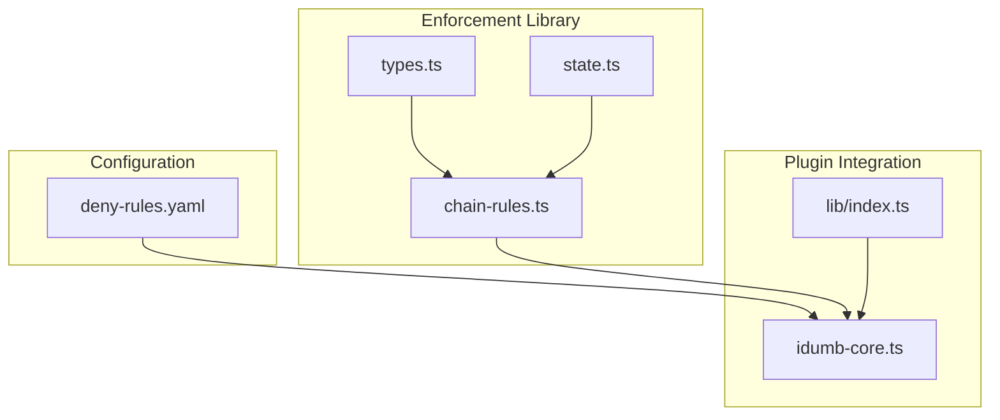
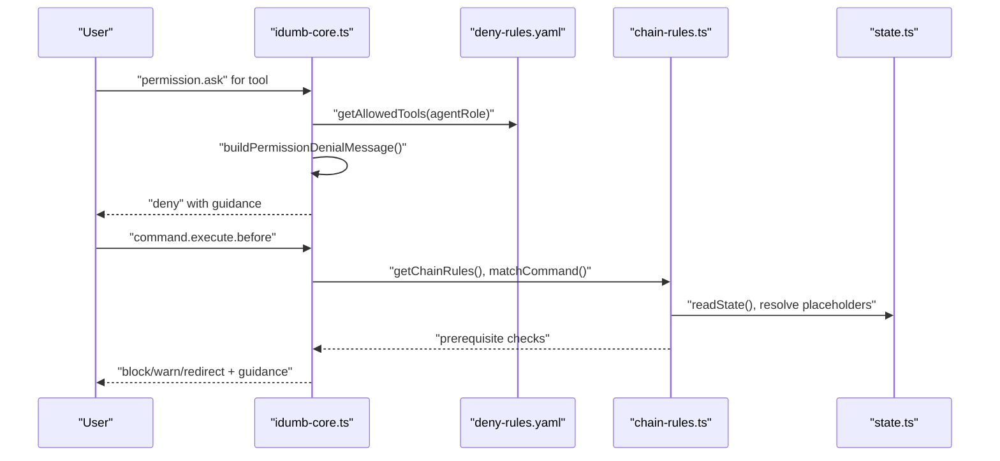
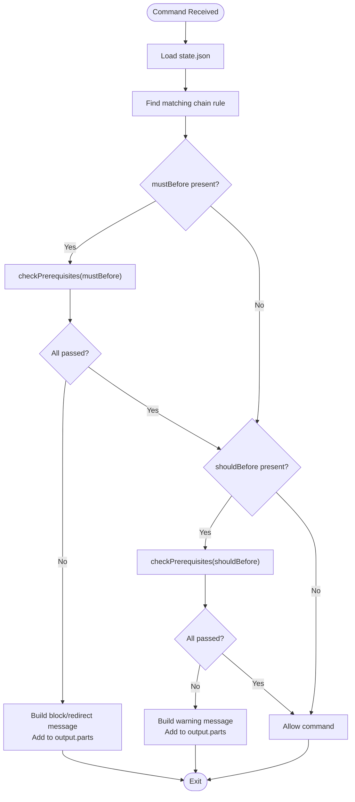
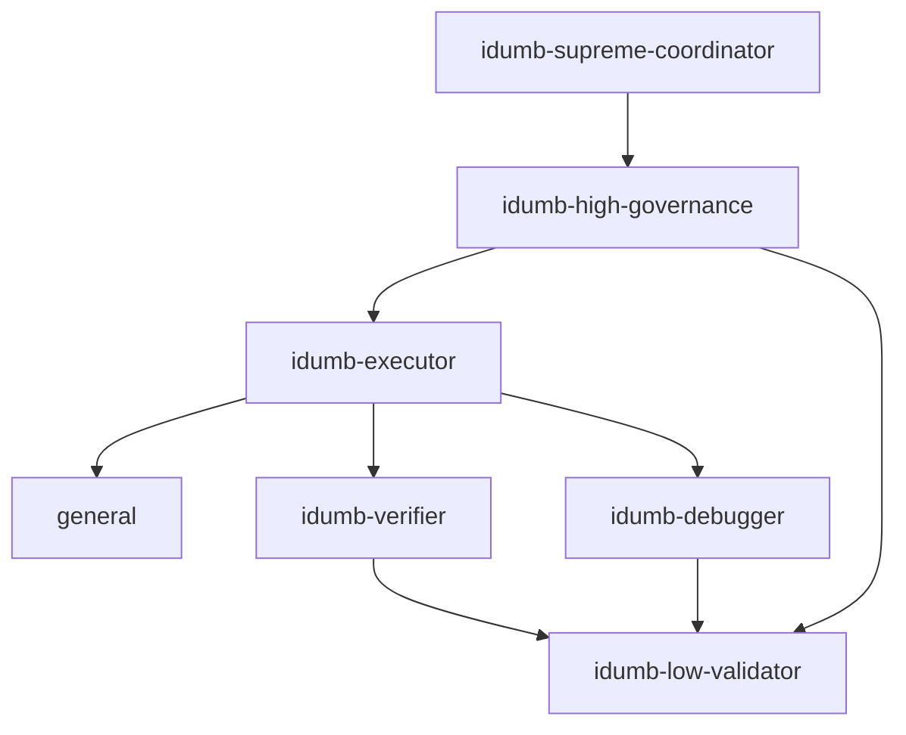
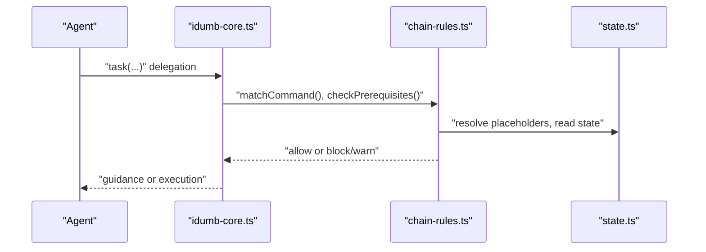
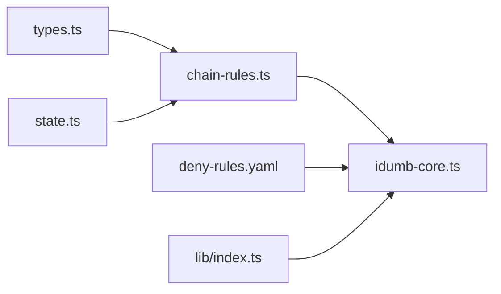

# Permission Deny Rules

<cite>
**Referenced Files in This Document**
- [deny-rules.yaml](file://src/config/deny-rules.yaml)
- [chain-enforcement.md](file://src/router/chain-enforcement.md)
- [chain-rules.ts](file://src/plugins/lib/chain-rules.ts)
- [types.ts](file://src/plugins/lib/types.ts)
- [state.ts](file://src/plugins/lib/state.ts)
- [idumb-core.ts](file://src/plugins/idumb-core.ts)
- [index.ts](file://src/plugins/lib/index.ts)
- [agent-hierarchy.md](file://src/skills/hierarchical-mindfulness/references/agent-hierarchy.md)
- [mindfulness-protocols.md](file://src/skills/hierarchical-mindfulness/references/mindfulness-protocols.md)
- [security-utils.sh](file://src/security/security-utils.sh)
</cite>

## Table of Contents
1. [Introduction](#introduction)
2. [Project Structure](#project-structure)
3. [Core Components](#core-components)
4. [Architecture Overview](#architecture-overview)
5. [Detailed Component Analysis](#detailed-component-analysis)
6. [Dependency Analysis](#dependency-analysis)
7. [Performance Considerations](#performance-considerations)
8. [Troubleshooting Guide](#troubleshooting-guide)
9. [Conclusion](#conclusion)
10. [Appendices](#appendices)

## Introduction
This document explains iDumb’s permission deny rules system: how security policies are configured, evaluated, and enforced across agents and tools. It covers:
- YAML rule syntax and categories (bash denies, allows, delegation restrictions, file permissions, tool restrictions, first-tool requirements, and ask permissions)
- Hierarchical enforcement patterns and delegation boundaries
- Chain rules for command sequencing and prerequisites
- Rule evaluation logic, precedence, and conflict resolution
- Practical examples for custom policies, role-based access controls, and troubleshooting
- Integration with the agent hierarchy and chain enforcement mechanisms
- Best practices for designing robust security policies, maintenance, and audit trails

## Project Structure
The permission system spans configuration, enforcement libraries, and plugin hooks:
- Configuration: deny-rules.yaml defines agent-specific allowances, restrictions, delegation targets, file scopes, tool bans, and first-tool requirements
- Enforcement library: chain-rules.ts implements chain-rule evaluation and prerequisite checking
- Plugin integration: idumb-core.ts orchestrates permission checks, delegation tracking, and output replacement for blocked tools
- Supporting types and state: types.ts and state.ts define shared interfaces and state persistence used by enforcement logic

**Diagram sources**
- [deny-rules.yaml](file://src/config/deny-rules.yaml#L1-L398)
- [chain-rules.ts](file://src/plugins/lib/chain-rules.ts#L1-L468)
- [types.ts](file://src/plugins/lib/types.ts#L1-L282)
- [state.ts](file://src/plugins/lib/state.ts#L1-L189)
- [idumb-core.ts](file://src/plugins/idumb-core.ts#L1-L1092)
- [index.ts](file://src/plugins/lib/index.ts#L1-L131)

**Section sources**
- [deny-rules.yaml](file://src/config/deny-rules.yaml#L1-L398)
- [chain-rules.ts](file://src/plugins/lib/chain-rules.ts#L1-L468)
- [idumb-core.ts](file://src/plugins/idumb-core.ts#L1-L1092)
- [types.ts](file://src/plugins/lib/types.ts#L1-L282)
- [state.ts](file://src/plugins/lib/state.ts#L1-L189)
- [index.ts](file://src/plugins/lib/index.ts#L1-L131)

## Core Components
- Deny rules configuration: Defines agent-specific allowlists and explicit denies for bash commands, delegation, file types, and tools. Includes message templates for consistent user feedback.
- Chain enforcement: Enforces MUST-BEFORE and SHOULD-BEFORE prerequisites for commands, with actions ranging from warnings to hard blocks and redirects.
- Plugin hooks: Intercepts permission asks, tool executions, and commands to evaluate policies and inject governance guidance.

Key rule categories:
- Bash denies and allows: Specific patterns for destructive or risky commands; agent-scoped allowances for safe operations.
- Delegation restrictions and allows: Leaf agents cannot delegate; higher-level agents can delegate to specific targets.
- File permissions: Meta vs. project scope allowlists per agent; restricts who can modify framework vs. user project files.
- Tool restrictions: Prohibits direct file writes/edit for coordinators and validators; validates tool usage against agent roles.
- First-tool requirements: Enforces context-first methodology by requiring specific tools before execution.
- Ask permissions: Minimal prompts for highly destructive operations, with configurability.

**Section sources**
- [deny-rules.yaml](file://src/config/deny-rules.yaml#L14-L398)
- [chain-enforcement.md](file://src/router/chain-enforcement.md#L1-L257)
- [chain-rules.ts](file://src/plugins/lib/chain-rules.ts#L1-L468)
- [idumb-core.ts](file://src/plugins/idumb-core.ts#L647-L1092)

## Architecture Overview
The permission system integrates three layers:
- Policy definition: deny-rules.yaml and chain-enforcement.md
- Evaluation engine: chain-rules.ts and plugin hooks in idumb-core.ts
- State and types: state.ts and types.ts support prerequisite resolution and governance metadata

**Diagram sources**
- [idumb-core.ts](file://src/plugins/idumb-core.ts#L647-L1092)
- [deny-rules.yaml](file://src/config/deny-rules.yaml#L60-L398)
- [chain-rules.ts](file://src/plugins/lib/chain-rules.ts#L34-L118)
- [state.ts](file://src/plugins/lib/state.ts#L34-L45)

## Detailed Component Analysis

### YAML Rule Syntax and Categories
- Versioning and metadata: version, last_updated, author
- Bash denies: pattern, message, suggestion, severity, scope
- Bash allows: agent-specific lists of allowed commands
- Delegation denies: leaf agents cannot delegate; explicit denies per agent
- Delegation allows: targets per agent; supports “general” for project file operations
- File permissions: meta_scope and project_scope allowlists; path globs for framework areas
- Tool restrictions: agent-specific tool bans with contextual messages
- First-tool requirements: required tools per agent for context-first methodology
- Ask permissions: minimal prompts for highly destructive operations with configurability
- Message templates: standardized TUI-safe templates for tool, bash, delegation, and file blocks

Best practices derived from the configuration:
- Prefer allow-specific over deny-broad
- Include contextual messages and suggestions for every deny
- Scope rules to agents and patterns to avoid automation friction

**Section sources**
- [deny-rules.yaml](file://src/config/deny-rules.yaml#L1-L398)

### Chain Rules Implementation
Chain enforcement ensures proper workflow sequencing:
- Rules define must-before and should-before prerequisites
- Prerequisite types: exists (file presence), state (condition on state.json), validation (timestamp checks), one_of (alternative passing)
- Enforcement levels: HARD_BLOCK (cannot proceed), SOFT_BLOCK (override with --force), WARN (continue with warning)
- Skip conditions: readonly commands and emergency bypass flags
- Guidance building: human-readable remediation steps per failure

**Diagram sources**
- [chain-rules.ts](file://src/plugins/lib/chain-rules.ts#L183-L291)
- [chain-rules.ts](file://src/plugins/lib/chain-rules.ts#L375-L467)
- [state.ts](file://src/plugins/lib/state.ts#L34-L45)

**Section sources**
- [chain-enforcement.md](file://src/router/chain-enforcement.md#L14-L118)
- [chain-rules.ts](file://src/plugins/lib/chain-rules.ts#L34-L118)
- [chain-rules.ts](file://src/plugins/lib/chain-rules.ts#L183-L291)
- [chain-rules.ts](file://src/plugins/lib/chain-rules.ts#L375-L467)

### Delegation Restrictions and Security Boundaries
- Leaf agents (e.g., idumb-builder, idumb-low-validator) cannot delegate
- Higher-level agents can delegate to specific targets; “general” enables project file operations
- Coordinators and governance agents cannot write or edit files directly; they must delegate

**Diagram sources**
- [deny-rules.yaml](file://src/config/deny-rules.yaml#L139-L221)
- [agent-hierarchy.md](file://src/skills/hierarchical-mindfulness/references/agent-hierarchy.md#L1-L73)

**Section sources**
- [deny-rules.yaml](file://src/config/deny-rules.yaml#L139-L221)
- [agent-hierarchy.md](file://src/skills/hierarchical-mindfulness/references/agent-hierarchy.md#L1-L73)

### Rule Evaluation Logic, Precedence, and Conflict Resolution
- Precedence:
  - Chain rules take effect during command execution (command.execute.before)
  - Permission asks are evaluated first (permission.ask), then tool execution hooks
  - Specific agent/tool combinations override general denies when explicitly allowed
- Conflict resolution:
  - mustBefore (HARD_BLOCK) takes priority over shouldBefore (WARN)
  - --force overrides SOFT_BLOCK only
  - Emergency flags bypass chain enforcement
  - First-tool and general permission checks are logged; enforcement is currently LOG ONLY for file modifications and general permissions

**Section sources**
- [idumb-core.ts](file://src/plugins/idumb-core.ts#L647-L1092)
- [chain-rules.ts](file://src/plugins/lib/chain-rules.ts#L34-L118)

### Integration with Agent Hierarchy and Chain Enforcement
- Agent hierarchy defines roles and permissions; delegation targets are constrained accordingly
- Chain enforcement enforces workflow prerequisites; state.json drives prerequisite resolution
- Mindfulness protocols guide pre-delegation checks and context awareness

**Diagram sources**
- [idumb-core.ts](file://src/plugins/idumb-core.ts#L953-L1075)
- [chain-rules.ts](file://src/plugins/lib/chain-rules.ts#L128-L173)
- [state.ts](file://src/plugins/lib/state.ts#L34-L45)

**Section sources**
- [agent-hierarchy.md](file://src/skills/hierarchical-mindfulness/references/agent-hierarchy.md#L1-L73)
- [mindfulness-protocols.md](file://src/skills/hierarchical-mindfulness/references/mindfulness-protocols.md#L1-L28)
- [chain-enforcement.md](file://src/router/chain-enforcement.md#L194-L216)

### Practical Examples and Use Cases
- Configure custom bash allowlists for agents:
  - Use agent-specific arrays under bash_allows
  - Prefer glob patterns for safe operations (e.g., git diff*, npm test*)
- Implement role-based access controls:
  - Restrict coordinators from writing/editing files; allow delegation to governance
  - Allow executors to use project-related tools and delegate to validators
- Troubleshoot permission denials:
  - Review deny-rules.yaml for agent-specific allowances and restrictions
  - Check chain-enforcement.md for prerequisite failures
  - Inspect plugin logs for denied events and violation counts

**Section sources**
- [deny-rules.yaml](file://src/config/deny-rules.yaml#L60-L398)
- [chain-enforcement.md](file://src/router/chain-enforcement.md#L194-L216)
- [idumb-core.ts](file://src/plugins/idumb-core.ts#L191-L221)

## Dependency Analysis
The plugin depends on shared types and state utilities for enforcement:
- Types define chain rule interfaces, prerequisite types, and governance structures
- State utilities read/write governance state for prerequisite resolution
- Index exports consolidate imports for clean integration

**Diagram sources**
- [types.ts](file://src/plugins/lib/types.ts#L182-L207)
- [chain-rules.ts](file://src/plugins/lib/chain-rules.ts#L10-L14)
- [state.ts](file://src/plugins/lib/state.ts#L10-L12)
- [index.ts](file://src/plugins/lib/index.ts#L64-L75)

**Section sources**
- [types.ts](file://src/plugins/lib/types.ts#L182-L207)
- [chain-rules.ts](file://src/plugins/lib/chain-rules.ts#L10-L14)
- [state.ts](file://src/plugins/lib/state.ts#L10-L12)
- [index.ts](file://src/plugins/lib/index.ts#L64-L75)

## Performance Considerations
- Minimize filesystem reads by caching state and resolving placeholders efficiently
- Keep rule sets concise and agent-scoped to reduce evaluation overhead
- Avoid excessive logging in hot paths; leverage targeted log entries for violations and guidance

## Troubleshooting Guide
Common issues and resolutions:
- Permission ask hook not enforced:
  - Upstream limitation prevents dynamic permission control via plugin; rely on agent frontmatter permissions and tool.execute.before workarounds
- Chain enforcement bypass:
  - --emergency or --bypass-chain flags skip checks; verify arguments and logs
- Violation tracking:
  - Use plugin history entries and guidance builders to diagnose repeated violations
- File modification attempts:
  - Currently logged; ensure agents follow delegation patterns to avoid unintended writes

**Section sources**
- [.plugin-dev/MASTER-REDESIGN-PLAN-2026-02-04.md](file://.plugin-dev/MASTER-REDESIGN-PLAN-2026-02-04.md#L262-L316)
- [idumb-core.ts](file://src/plugins/idumb-core.ts#L975-L980)
- [idumb-core.ts](file://src/plugins/idumb-core.ts#L191-L221)

## Conclusion
iDumb’s permission deny rules combine explicit agent-scoped allowlists, delegation constraints, and chain enforcement to maintain security and governance integrity. While some enforcement mechanisms are currently LOG ONLY, the configuration-driven approach and clear rule syntax enable precise control over agent capabilities. Integrating with the agent hierarchy and chain enforcement ensures that workflows proceed only when prerequisites are satisfied, and that violations are surfaced with actionable guidance.

## Appendices

### Best Practices for Security Policy Design
- Prefer allow-specific over deny-broad; scope patterns to agents and commands
- Include contextual messages and suggestions for every deny
- Use delegation allows to define clear escalation paths
- Maintain separate meta and project scopes for file permissions
- Enforce first-tool requirements to ensure context-first methodology
- Keep ask permissions minimal and configurable

### Rule Maintenance Guidelines
- Regularly review deny-rules.yaml for outdated patterns and adjust agent allowances
- Align chain rules with project phases and artifacts; update placeholders as needed
- Monitor violation logs and refine policies iteratively

### Audit Trail Generation
- Track permission events, chain violations, and guidance usage in plugin history
- Use session metadata and state snapshots to correlate actions with governance decisions

**Section sources**
- [deny-rules.yaml](file://src/config/deny-rules.yaml#L1-L13)
- [idumb-core.ts](file://src/plugins/idumb-core.ts#L173-L189)
- [state.ts](file://src/plugins/lib/state.ts#L79-L101)