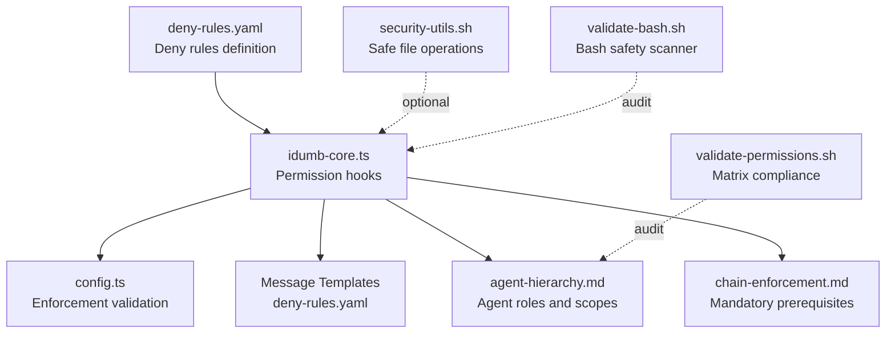
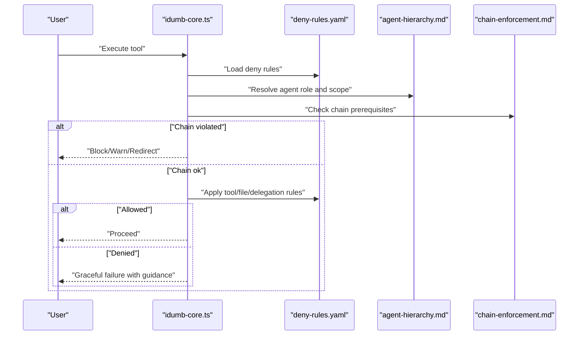
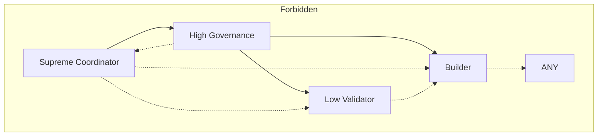
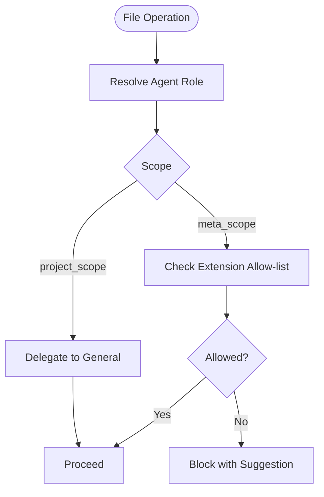
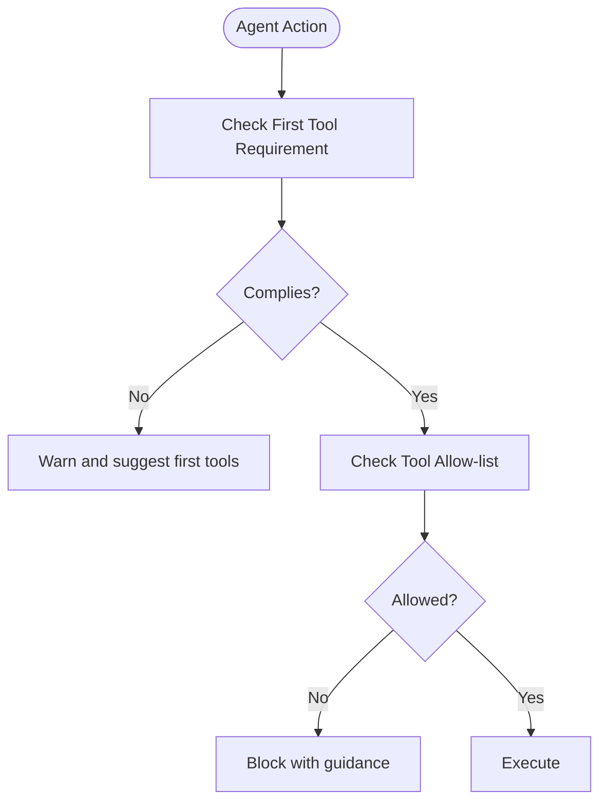
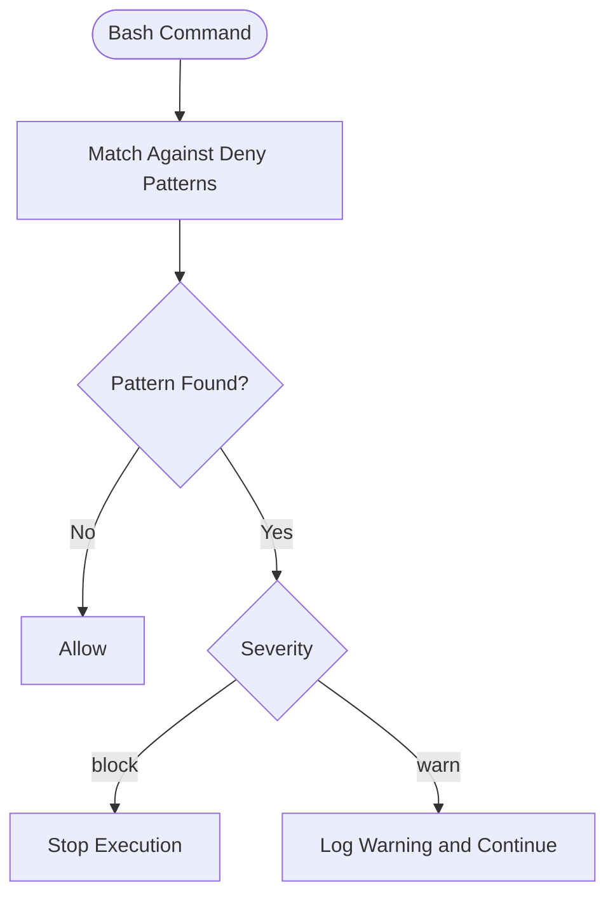
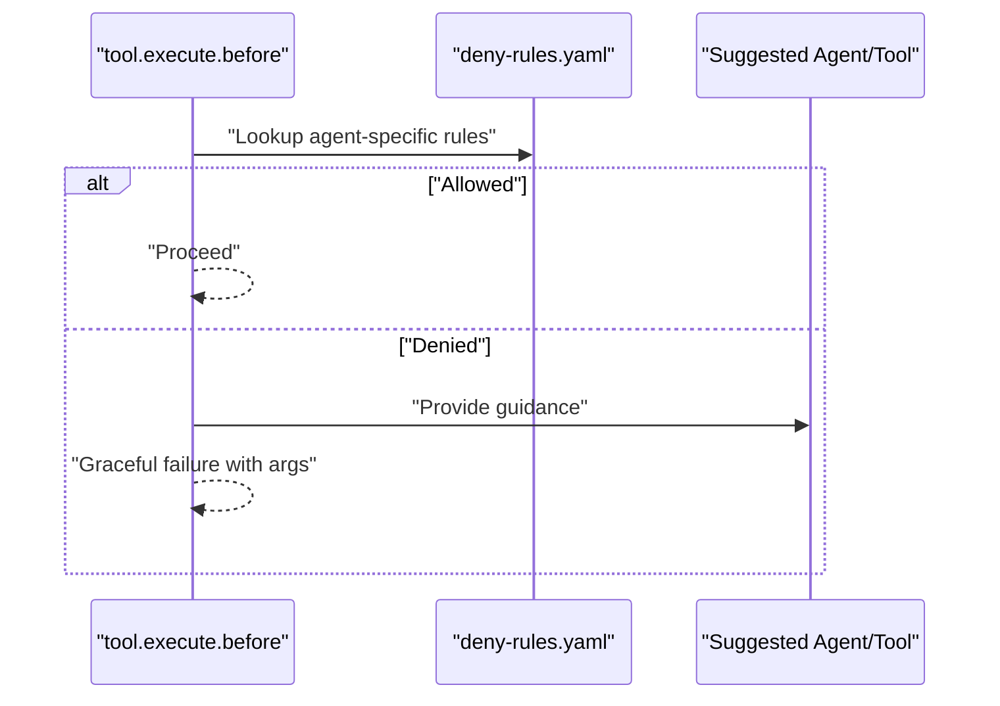
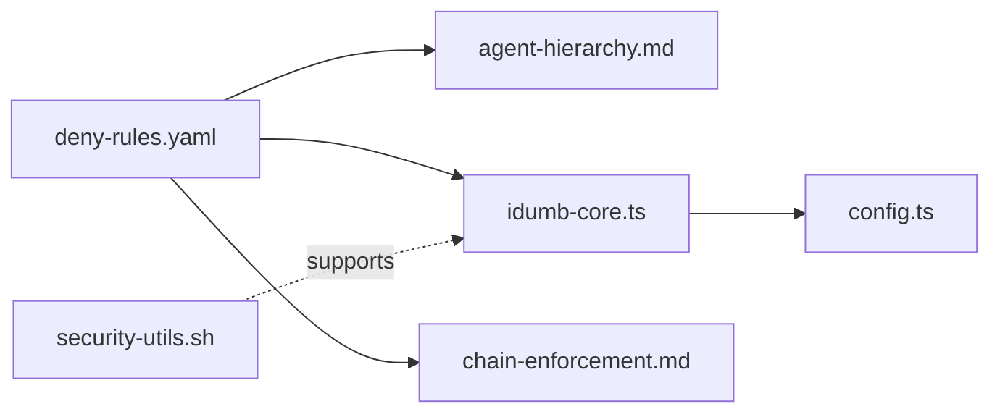

# Deny Rules Configuration

<cite>
**Referenced Files in This Document**
- [deny-rules.yaml](file://src/config/deny-rules.yaml)
- [security-utils.sh](file://src/security/security-utils.sh)
- [bash-executors.ts](file://src/tools/lib/bash-executors.ts)
- [chain-enforcement.md](file://src/router/chain-enforcement.md)
- [agent-hierarchy.md](file://src/skills/hierarchical-mindfulness/references/agent-hierarchy.md)
- [validate-permissions.sh](file://src/skills/idumb-security/scripts/validate-permissions.sh)
- [validate-bash.sh](file://src/skills/idumb-security/scripts/validate-bash.sh)
- [idumb-core.ts](file://src/plugins/idumb-core.ts)
- [config.ts](file://src/plugins/lib/config.ts)
</cite>

## Table of Contents
1. [Introduction](#introduction)
2. [Project Structure](#project-structure)
3. [Core Components](#core-components)
4. [Architecture Overview](#architecture-overview)
5. [Detailed Component Analysis](#detailed-component-analysis)
6. [Dependency Analysis](#dependency-analysis)
7. [Performance Considerations](#performance-considerations)
8. [Troubleshooting Guide](#troubleshooting-guide)
9. [Conclusion](#conclusion)
10. [Appendices](#appendices)

## Introduction
This document explains iDumb’s deny rules configuration system with a focus on the YAML-based deny-rules.yaml. It covers design principles, rule categories (bash restrictions, delegation controls, file permissions, tool restrictions, first-tool requirements), and practical guidance for creating, maintaining, and auditing deny rules. It also connects deny rules to broader governance mechanisms such as the agent hierarchy, chain enforcement, and security utilities.

## Project Structure
The deny rules system centers on a single YAML configuration file and integrates with governance hooks, security scripts, and enforcement utilities across the codebase.

**Diagram sources**
- [deny-rules.yaml](file://src/config/deny-rules.yaml#L1-L398)
- [idumb-core.ts](file://src/plugins/idumb-core.ts#L650-L737)
- [config.ts](file://src/plugins/lib/config.ts#L261-L271)
- [agent-hierarchy.md](file://src/skills/hierarchical-mindfulness/references/agent-hierarchy.md#L1-L246)
- [chain-enforcement.md](file://src/router/chain-enforcement.md#L1-L257)
- [security-utils.sh](file://src/security/security-utils.sh#L1-L239)
- [validate-bash.sh](file://src/skills/idumb-security/scripts/validate-bash.sh#L1-L51)
- [validate-permissions.sh](file://src/skills/idumb-security/scripts/validate-permissions.sh#L1-L45)

**Section sources**
- [deny-rules.yaml](file://src/config/deny-rules.yaml#L1-L398)
- [idumb-core.ts](file://src/plugins/idumb-core.ts#L650-L737)
- [config.ts](file://src/plugins/lib/config.ts#L261-L271)
- [agent-hierarchy.md](file://src/skills/hierarchical-mindfulness/references/agent-hierarchy.md#L1-L246)
- [chain-enforcement.md](file://src/router/chain-enforcement.md#L1-L257)
- [security-utils.sh](file://src/security/security-utils.sh#L1-L239)
- [validate-bash.sh](file://src/skills/idumb-security/scripts/validate-bash.sh#L1-L51)
- [validate-permissions.sh](file://src/skills/idumb-security/scripts/validate-permissions.sh#L1-L45)

## Core Components
- Deny rules definition: YAML-based policy covering bash restrictions, delegation allowances, file permissions, tool restrictions, first-tool requirements, and message templates.
- Governance hooks: Plugin-level hooks enforce rules during tool execution, permission events, and session lifecycle.
- Agent hierarchy: Defines roles, scopes, and delegation patterns that inform deny rule specificity.
- Chain enforcement: Enforces mandatory prerequisites to prevent premature actions.
- Security utilities: Provide safe file operations and validation helpers used by the framework.

**Section sources**
- [deny-rules.yaml](file://src/config/deny-rules.yaml#L1-L398)
- [idumb-core.ts](file://src/plugins/idumb-core.ts#L650-L737)
- [agent-hierarchy.md](file://src/skills/hierarchical-mindfulness/references/agent-hierarchy.md#L1-L246)
- [chain-enforcement.md](file://src/router/chain-enforcement.md#L1-L257)
- [security-utils.sh](file://src/security/security-utils.sh#L1-L239)

## Architecture Overview
The deny rules system operates via a layered enforcement pipeline:
- Configuration: deny-rules.yaml defines explicit allow-lists and scoped restrictions.
- Runtime enforcement: Hooks intercept tool execution and permission events to apply deny rules.
- Context-first methodology: First-tool requirements ensure agents gather context before acting.
- Governance alignment: Agent hierarchy and delegation matrices guide who can delegate to whom.
- Safety utilities: Security helpers support safe file operations and validation.

**Diagram sources**
- [idumb-core.ts](file://src/plugins/idumb-core.ts#L650-L737)
- [deny-rules.yaml](file://src/config/deny-rules.yaml#L1-L398)
- [agent-hierarchy.md](file://src/skills/hierarchical-mindfulness/references/agent-hierarchy.md#L1-L246)
- [chain-enforcement.md](file://src/router/chain-enforcement.md#L1-L257)

## Detailed Component Analysis

### YAML-Based Deny Rules: Structure and Principles
- Versioning and metadata: Tracks version, last updated, and author for auditability.
- Design principles embedded in comments:
  - Specificity: Deny patterns target precise commands, agents, or file globs.
  - Contextual messaging: Every deny includes a message and suggestion.
  - Allow-list over deny-broad: Prefer explicit allow-lists; unspecified items are implicitly denied.
  - No ask permissions: Exceptions requiring user consent are minimized and configurable.

Key categories:
- Bash command restrictions: Categorized by severity (block/warn) and scope (all).
- Bash allows per agent: Explicit allow-lists for each role.
- Delegation restrictions and allows: Who can delegate to whom, with rationale.
- File type permissions: Allow-list approach by file extension and path scope.
- Tool restrictions: Prohibitions on direct file writes/edit for non-executor agents.
- First-tool requirements: Required initial tools per agent for context-first methodology.
- Message templates: Structured, TUI-safe templates for consistent feedback.

Practical examples (described):
- Bash block: Root/home directory deletion and wildcard deletion.
- Bash warn: World-writable permissions and recursive world-writable permissions.
- Credential exposure: SSH key exposure and token echoing.
- Agent-specific bash allows: Builder can stage/add/commit/git operations; Validators can read and test; Executors can run package managers; Coordinators are read-only.
- Delegation denies: Leaf agents cannot delegate.
- Delegation allows: Higher-level agents can delegate to specialized agents and general operations.
- File permissions: Builder can modify framework files in specific paths; Validators and Coordinators are read-only.
- Tool restrictions: Coordinators and High Governance cannot write/edit directly.
- First-tool requirements: Require context-gathering tools before acting.
- Message templates: Structured blocks for blocked tools, bash commands, delegations, and file modifications.

**Section sources**
- [deny-rules.yaml](file://src/config/deny-rules.yaml#L1-L398)

### Agent Roles, Scopes, and Delegation Controls
- Hierarchy levels and categories:
  - Coordinators: Delegation-only, no file operations.
  - Researchers: Read-only analysis agents.
  - Workers (leaf nodes): Low validator (read-only) and Builder (only writer).
- Delegation patterns:
  - Allowed: Coordinator → Governance → Validator/Builder.
  - Forbidden: Upward delegation, skipping layers, or leaf-to-any delegation.
- Delegation depth tracking: Maximum depth enforced to prevent loops.

**Diagram sources**
- [agent-hierarchy.md](file://src/skills/hierarchical-mindfulness/references/agent-hierarchy.md#L173-L192)

**Section sources**
- [agent-hierarchy.md](file://src/skills/hierarchical-mindfulness/references/agent-hierarchy.md#L1-L246)

### Delegation Controls: Who Can Delegate to Whom
- Delegation denies:
  - Builder and Low Validator cannot delegate.
- Delegation allows:
  - Supreme Coordinator can delegate to all agents and general.
  - High Governance can delegate to builders, validators, executors, and general.
  - Mid-level agents can delegate to executors, verifiers, debuggers, validators, and general.
  - Specialized agents can delegate to general or validators.

These rules align with the agent hierarchy and ensure governance integrity.

**Section sources**
- [deny-rules.yaml](file://src/config/deny-rules.yaml#L139-L221)
- [agent-hierarchy.md](file://src/skills/hierarchical-mindfulness/references/agent-hierarchy.md#L173-L192)

### File Type Permissions: Allow-List Approach and Scope Limitations
- Allow-list by extension and path scope per agent:
  - Builder: Meta scope includes documentation, configs, schemas, and plugin sources; restricted to framework paths.
  - Low Validator: Read-only; cannot modify any files.
  - Exec/Verifier/Debugger: Delegate writes to general; otherwise read-only.
  - Coordinators: Cannot write directly.
- Scope distinctions:
  - meta_scope: Framework-related files.
  - project_scope: User project source files (often empty for non-builders).
  - paths: Glob patterns for allowed directories.

**Diagram sources**
- [deny-rules.yaml](file://src/config/deny-rules.yaml#L222-L266)

**Section sources**
- [deny-rules.yaml](file://src/config/deny-rules.yaml#L222-L266)

### Tool Restrictions and First-Tool Requirements
- Tool restrictions:
  - Coordinators and High Governance cannot write/edit directly; delegate to appropriate agents.
  - Low Validator is read-only.
- First-tool requirements:
  - Require context-gathering tools before delegating or executing.
  - Ensures context-first methodology and reduces risky actions.

**Diagram sources**
- [deny-rules.yaml](file://src/config/deny-rules.yaml#L302-L338)

**Section sources**
- [deny-rules.yaml](file://src/config/deny-rules.yaml#L268-L338)

### Bash Command Restrictions: Examples and Severity Classification
- Catastrophic operations (block): Root/home deletion and wildcard deletion.
- Security risks (warn/block): World-writable permissions and recursive world-writable permissions.
- Credential exposure (block/warn): SSH key exposure and token echoing.
- Severity levels:
  - block: Immediate stoppage.
  - warn: Logged with suggestion; continues unless enforced otherwise.

**Diagram sources**
- [deny-rules.yaml](file://src/config/deny-rules.yaml#L17-L63)

**Section sources**
- [deny-rules.yaml](file://src/config/deny-rules.yaml#L17-L63)

### Message Templates and User Feedback
- Templates cover blocked tools, bash commands, delegations, and file modifications.
- Fields include reason, role description, suggestions, and next steps.
- Designed to be TUI-safe and actionable.

**Section sources**
- [deny-rules.yaml](file://src/config/deny-rules.yaml#L358-L398)

### Integration with Governance Hooks and Enforcement
- Plugin hooks intercept tool execution and permission events to apply deny rules.
- Enforcement validation ensures governance settings are properly configured.
- Pending denials are tracked for message transformation and history.

**Diagram sources**
- [idumb-core.ts](file://src/plugins/idumb-core.ts#L650-L737)
- [deny-rules.yaml](file://src/config/deny-rules.yaml#L1-L398)

**Section sources**
- [idumb-core.ts](file://src/plugins/idumb-core.ts#L650-L737)
- [config.ts](file://src/plugins/lib/config.ts#L261-L271)

## Dependency Analysis
- deny-rules.yaml depends on:
  - Agent hierarchy for role-specific scoping.
  - Chain enforcement for prerequisite alignment.
  - Plugin hooks for runtime enforcement.
- Plugin hooks depend on:
  - Deny rules for decision-making.
  - Agent hierarchy for role resolution.
  - Message templates for user feedback.
- Security utilities support safe file operations and validation used by the framework.

**Diagram sources**
- [deny-rules.yaml](file://src/config/deny-rules.yaml#L1-L398)
- [agent-hierarchy.md](file://src/skills/hierarchical-mindfulness/references/agent-hierarchy.md#L1-L246)
- [idumb-core.ts](file://src/plugins/idumb-core.ts#L650-L737)
- [config.ts](file://src/plugins/lib/config.ts#L261-L271)
- [chain-enforcement.md](file://src/router/chain-enforcement.md#L1-L257)
- [security-utils.sh](file://src/security/security-utils.sh#L1-L239)

**Section sources**
- [deny-rules.yaml](file://src/config/deny-rules.yaml#L1-L398)
- [agent-hierarchy.md](file://src/skills/hierarchical-mindfulness/references/agent-hierarchy.md#L1-L246)
- [idumb-core.ts](file://src/plugins/idumb-core.ts#L650-L737)
- [config.ts](file://src/plugins/lib/config.ts#L261-L271)
- [chain-enforcement.md](file://src/router/chain-enforcement.md#L1-L257)
- [security-utils.sh](file://src/security/security-utils.sh#L1-L239)

## Performance Considerations
- Deny rule evaluation should be fast and deterministic.
- Use allow-lists to minimize regex matching overhead.
- Keep message templates concise to reduce rendering cost.
- Leverage existing security utilities for safe file operations to avoid expensive retries.

[No sources needed since this section provides general guidance]

## Troubleshooting Guide
Common issues and resolutions:
- Unexpected deny for a tool:
  - Verify agent-specific allows and delegation rules.
  - Confirm first-tool requirements are met.
- Chain enforcement violation:
  - Ensure prerequisite commands or files exist before proceeding.
  - Use recommended redirects or warnings to recover.
- Permission matrix mismatch:
  - Validate agent files against the permission matrix.
  - Ensure coordinators do not have unintended write/edit permissions.
- Bash script validation failures:
  - Scan scripts for unsafe variable interpolation, unquoted variables, eval/source with variables.
- Safe file operations errors:
  - Use provided security utilities for atomic writes and path sanitization.

**Section sources**
- [chain-enforcement.md](file://src/router/chain-enforcement.md#L192-L253)
- [validate-permissions.sh](file://src/skills/idumb-security/scripts/validate-permissions.sh#L1-L45)
- [validate-bash.sh](file://src/skills/idumb-security/scripts/validate-bash.sh#L1-L51)
- [security-utils.sh](file://src/security/security-utils.sh#L93-L122)

## Conclusion
iDumb’s deny rules configuration enforces strong, context-aware governance through a YAML-driven allow-list approach, agent-scoped permissions, delegation controls, and first-tool requirements. Integrated with plugin hooks, chain enforcement, and security utilities, the system balances automation safety with operational flexibility while maintaining clear, actionable feedback for users.

[No sources needed since this section summarizes without analyzing specific files]

## Appendices

### Practical Rule Maintenance and Best Practices
- Prefer allow-lists over broad denys; unspecified items are implicitly denied.
- Use specific patterns and agent targeting to avoid collateral impact.
- Align deny rules with the agent hierarchy and delegation patterns.
- Keep message templates actionable and TUI-safe.
- Regularly audit deny rules against agent roles and security baselines.
- Use validation scripts to ensure compliance with the permission matrix and bash safety guidelines.

**Section sources**
- [deny-rules.yaml](file://src/config/deny-rules.yaml#L1-L12)
- [agent-hierarchy.md](file://src/skills/hierarchical-mindfulness/references/agent-hierarchy.md#L1-L246)
- [validate-permissions.sh](file://src/skills/idumb-security/scripts/validate-permissions.sh#L1-L45)
- [validate-bash.sh](file://src/skills/idumb-security/scripts/validate-bash.sh#L1-L51)