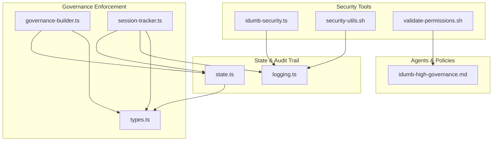
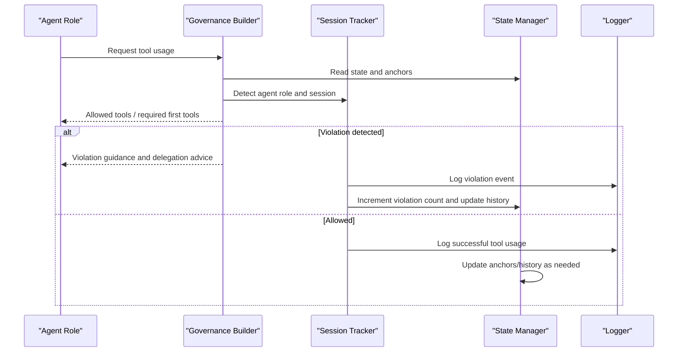
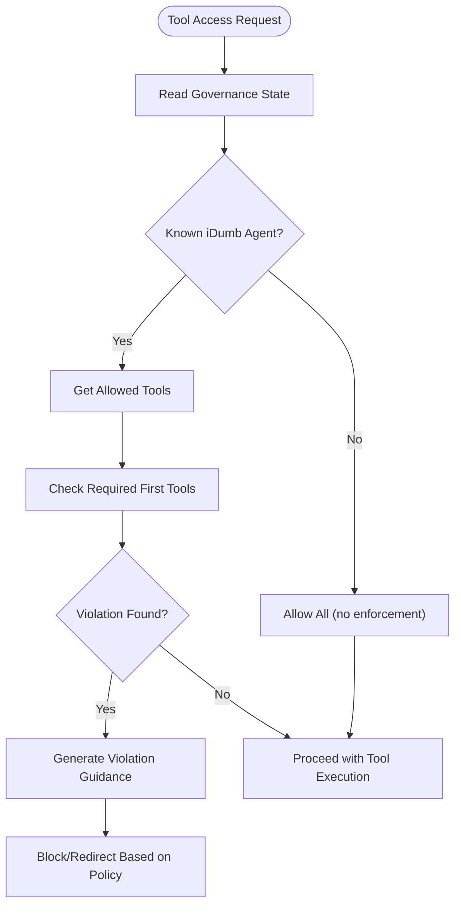
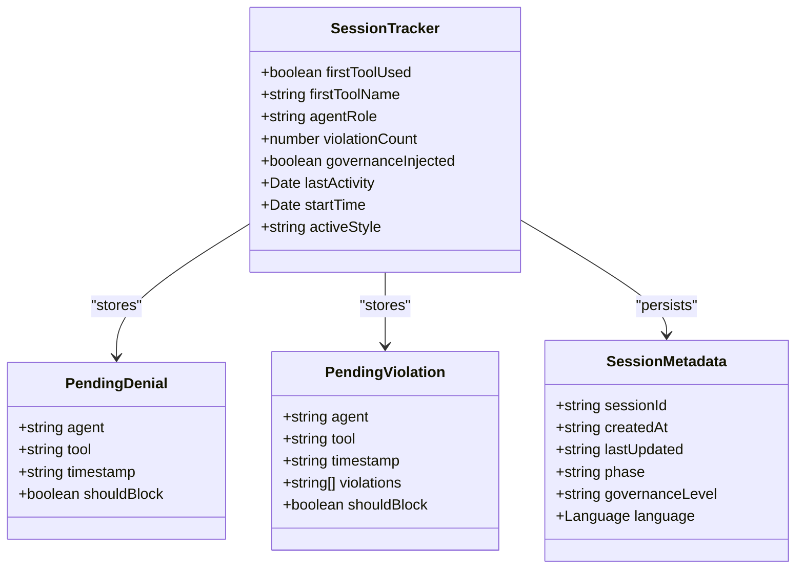
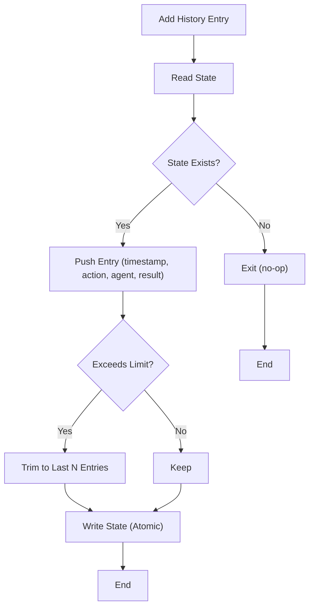
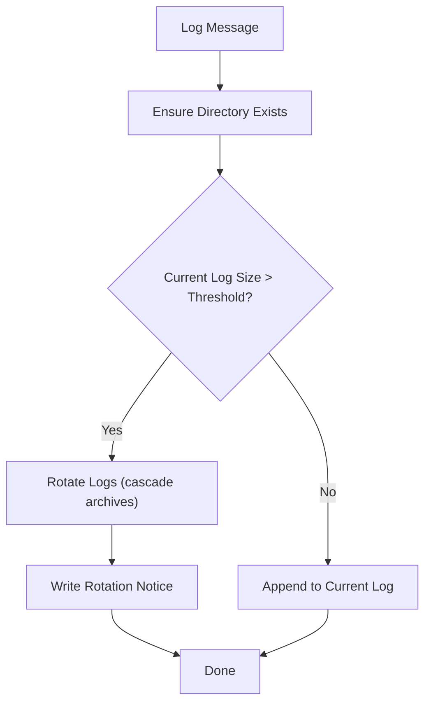
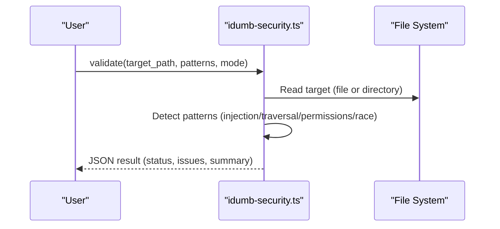
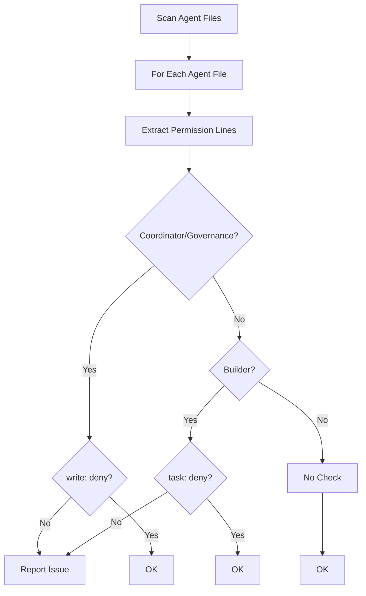
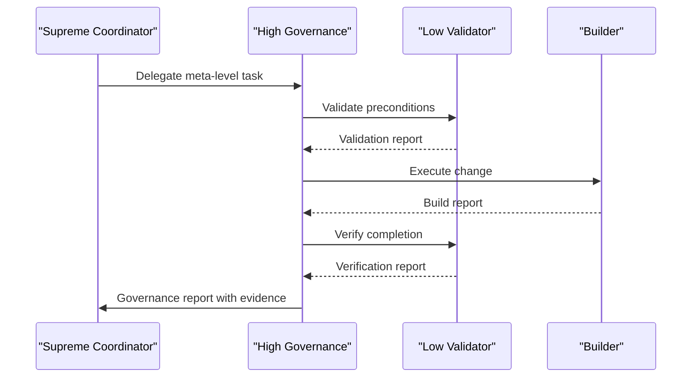
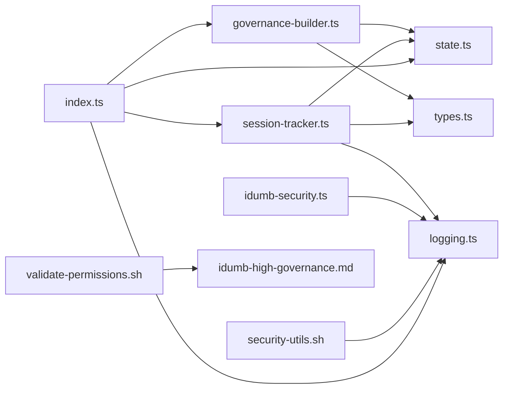

# Permission Auditing

<cite>
**Referenced Files in This Document**
- [governance-builder.ts](file://src/plugins/lib/governance-builder.ts)
- [session-tracker.ts](file://src/plugins/lib/session-tracker.ts)
- [state.ts](file://src/plugins/lib/state.ts)
- [logging.ts](file://src/plugins/lib/logging.ts)
- [types.ts](file://src/plugins/lib/types.ts)
- [idumb-security.ts](file://src/tools/idumb-security.ts)
- [security-utils.sh](file://src/security/security-utils.sh)
- [validate-permissions.sh](file://src/skills/idumb-security/scripts/validate-permissions.sh)
- [idumb-high-governance.md](file://src/agents/idumb-high-governance.md)
- [index.ts](file://src/plugins/lib/index.ts)
</cite>

## Table of Contents
1. [Introduction](#introduction)
2. [Project Structure](#project-structure)
3. [Core Components](#core-components)
4. [Architecture Overview](#architecture-overview)
5. [Detailed Component Analysis](#detailed-component-analysis)
6. [Dependency Analysis](#dependency-analysis)
7. [Performance Considerations](#performance-considerations)
8. [Troubleshooting Guide](#troubleshooting-guide)
9. [Conclusion](#conclusion)
10. [Appendices](#appendices)

## Introduction
This document explains iDumb’s permission auditing and monitoring capabilities. It covers how the system tracks permission violations, delegation attempts, and access patterns; how audit logs are recorded and retained; how compliance is tracked; and how state-based permission enforcement maintains robust audit trails. It also describes alerting and incident response patterns, compliance reporting, security analytics, and integration points with external monitoring systems.

## Project Structure
The permission auditing and monitoring system spans several libraries and tools:
- Governance enforcement and guidance generation
- Session tracking and resumption detection
- State management with anchors and history
- File-based logging with rotation
- Security validation tools and shell utilities
- Static permission matrix validation

**Diagram sources**
- [governance-builder.ts](file://src/plugins/lib/governance-builder.ts#L1-L635)
- [session-tracker.ts](file://src/plugins/lib/session-tracker.ts#L1-L385)
- [state.ts](file://src/plugins/lib/state.ts#L1-L189)
- [logging.ts](file://src/plugins/lib/logging.ts#L1-L118)
- [idumb-security.ts](file://src/tools/idumb-security.ts#L1-L359)
- [security-utils.sh](file://src/security/security-utils.sh#L1-L239)
- [validate-permissions.sh](file://src/skills/idumb-security/scripts/validate-permissions.sh#L1-L45)
- [idumb-high-governance.md](file://src/agents/idumb-high-governance.md#L1-L717)
- [types.ts](file://src/plugins/lib/types.ts#L1-L282)

**Section sources**
- [governance-builder.ts](file://src/plugins/lib/governance-builder.ts#L1-L635)
- [session-tracker.ts](file://src/plugins/lib/session-tracker.ts#L1-L385)
- [state.ts](file://src/plugins/lib/state.ts#L1-L189)
- [logging.ts](file://src/plugins/lib/logging.ts#L1-L118)
- [idumb-security.ts](file://src/tools/idumb-security.ts#L1-L359)
- [security-utils.sh](file://src/security/security-utils.sh#L1-L239)
- [validate-permissions.sh](file://src/skills/idumb-security/scripts/validate-permissions.sh#L1-L45)
- [idumb-high-governance.md](file://src/agents/idumb-high-governance.md#L1-L717)
- [types.ts](file://src/plugins/lib/types.ts#L1-L282)

## Core Components
- Permission matrix and delegation enforcement: Defines allowed tools and required first tools per agent role, and generates governance guidance and violation messages.
- Session tracking: Captures agent roles, violation counts, and pending denials/violations; persists session metadata; detects resumptions and stale state.
- State and audit trail: Manages governance state, anchors for critical decisions, and a bounded history of actions with timestamps and outcomes.
- Logging: Writes structured log entries to a rotating file to preserve auditability without unbounded growth.
- Security validation: Scans bash scripts for injection, traversal, permission bypass, and race conditions; supports quick scans and comprehensive validation.
- Shell security utilities: Provides safe path sanitization, atomic writes, lock acquisition, and JSON validation to prevent unsafe operations.
- Static permission validation: Ensures agent files adhere to expected permission patterns (e.g., coordinators deny write, builders deny task).

**Section sources**
- [governance-builder.ts](file://src/plugins/lib/governance-builder.ts#L21-L139)
- [session-tracker.ts](file://src/plugins/lib/session-tracker.ts#L34-L165)
- [state.ts](file://src/plugins/lib/state.ts#L34-L101)
- [logging.ts](file://src/plugins/lib/logging.ts#L89-L117)
- [idumb-security.ts](file://src/tools/idumb-security.ts#L247-L310)
- [security-utils.sh](file://src/security/security-utils.sh#L94-L122)
- [validate-permissions.sh](file://src/skills/idumb-security/scripts/validate-permissions.sh#L7-L42)

## Architecture Overview
The system enforces permissions at runtime and records all significant events in state and logs. Violations trigger guidance and potential blocking, while session tracking ensures continuity and resumption awareness.

**Diagram sources**
- [governance-builder.ts](file://src/plugins/lib/governance-builder.ts#L366-L457)
- [session-tracker.ts](file://src/plugins/lib/session-tracker.ts#L97-L165)
- [state.ts](file://src/plugins/lib/state.ts#L79-L101)
- [logging.ts](file://src/plugins/lib/logging.ts#L89-L117)

## Detailed Component Analysis

### Permission Matrix and Enforcement
- Allowed tools per role: Tiered permissions for coordinators, workers, researchers, and leaf roles (builders/validators). Unknown or non-iDumb agents bypass enforcement.
- Required first tools: Enforces minimum tool usage for each role to ensure context and safety.
- Governance prefix and guidance: Generates role-specific instructions, warnings, and first-action prompts. Violation guidance explains delegation targets and corrective steps.

**Diagram sources**
- [governance-builder.ts](file://src/plugins/lib/governance-builder.ts#L21-L190)
- [governance-builder.ts](file://src/plugins/lib/governance-builder.ts#L366-L457)

**Section sources**
- [governance-builder.ts](file://src/plugins/lib/governance-builder.ts#L21-L190)
- [governance-builder.ts](file://src/plugins/lib/governance-builder.ts#L366-L457)

### Session Tracking and Monitoring
- In-memory session state: Tracks first tool usage, agent role, violation counts, governance injection status, and activity timestamps.
- Pending denials and violations: Queues validation results for post-processing and error transformation.
- Session metadata persistence: Stores creation/update timestamps, phase, governance level, and language preferences.
- Resumption detection: Identifies sessions resumed after extended inactivity and builds contextual reminders.
- Stale state detection: Computes hours since last validation against configurable thresholds.

**Diagram sources**
- [types.ts](file://src/plugins/lib/types.ts#L213-L245)
- [session-tracker.ts](file://src/plugins/lib/session-tracker.ts#L97-L165)

**Section sources**
- [session-tracker.ts](file://src/plugins/lib/session-tracker.ts#L34-L165)
- [session-tracker.ts](file://src/plugins/lib/session-tracker.ts#L204-L260)
- [session-tracker.ts](file://src/plugins/lib/session-tracker.ts#L269-L332)
- [session-tracker.ts](file://src/plugins/lib/session-tracker.ts#L362-L384)
- [types.ts](file://src/plugins/lib/types.ts#L213-L245)

### State and Audit Trail
- Read/write state: Atomic write pattern prevents corruption; creates directories as needed.
- History management: Adds bounded history entries with timestamps, actions, agents, and results.
- Style anchors: Tracks output style anchors per agent with replace semantics.
- Default state factory: Initializes governance state with versioning and counters.

**Diagram sources**
- [state.ts](file://src/plugins/lib/state.ts#L79-L101)
- [state.ts](file://src/plugins/lib/state.ts#L51-L73)

**Section sources**
- [state.ts](file://src/plugins/lib/state.ts#L34-L101)
- [state.ts](file://src/plugins/lib/state.ts#L111-L149)
- [state.ts](file://src/plugins/lib/state.ts#L174-L188)

### Logging and Retention
- File-based logging: Appends timestamped entries to a dedicated log file under the governance directory.
- Log rotation: Rotates logs when size exceeds threshold, maintaining a fixed number of archived files.
- Silent failure handling: Prevents logging errors from breaking operations.

**Diagram sources**
- [logging.ts](file://src/plugins/lib/logging.ts#L89-L117)
- [logging.ts](file://src/plugins/lib/logging.ts#L36-L79)

**Section sources**
- [logging.ts](file://src/plugins/lib/logging.ts#L17-L79)
- [logging.ts](file://src/plugins/lib/logging.ts#L89-L117)

### Security Validation and Risk Detection
- Pattern-based detection: Scans for injection, path traversal, permission bypass, and race conditions in bash scripts.
- Severity scoring: Aggregates issues by severity and determines pass/fail/partial status based on mode.
- Quick scan: Lightweight scan focusing on critical/high-severity issues.
- Atomic file write and safe operations: Shell utilities provide safe path sanitization, atomic writes, and lock acquisition.

**Diagram sources**
- [idumb-security.ts](file://src/tools/idumb-security.ts#L247-L310)
- [idumb-security.ts](file://src/tools/idumb-security.ts#L194-L230)

**Section sources**
- [idumb-security.ts](file://src/tools/idumb-security.ts#L21-L48)
- [idumb-security.ts](file://src/tools/idumb-security.ts#L247-L310)
- [idumb-security.ts](file://src/tools/idumb-security.ts#L312-L344)
- [security-utils.sh](file://src/security/security-utils.sh#L94-L122)
- [security-utils.sh](file://src/security/security-utils.sh#L139-L183)

### Static Permission Matrix Validation
- Validates agent files against expected permission patterns (e.g., coordinators deny write, builders deny task).
- Iterates over agent profiles and reports issues.

**Diagram sources**
- [validate-permissions.sh](file://src/skills/idumb-security/scripts/validate-permissions.sh#L7-L42)

**Section sources**
- [validate-permissions.sh](file://src/skills/idumb-security/scripts/validate-permissions.sh#L1-L45)

### Compliance and Governance Alignment
- Agent-level delegation and scope: Explicitly defines what each agent can and cannot do, including delegation targets and tool allowances.
- Evidence-based governance: Requires validation before changes, execution by builders, and verification by validators; records outcomes in state history.

**Diagram sources**
- [idumb-high-governance.md](file://src/agents/idumb-high-governance.md#L142-L206)
- [idumb-high-governance.md](file://src/agents/idumb-high-governance.md#L252-L437)

**Section sources**
- [idumb-high-governance.md](file://src/agents/idumb-high-governance.md#L1-L717)

## Dependency Analysis
The following diagram shows key internal dependencies among modules involved in auditing and monitoring.

**Diagram sources**
- [governance-builder.ts](file://src/plugins/lib/governance-builder.ts#L1-L635)
- [session-tracker.ts](file://src/plugins/lib/session-tracker.ts#L1-L385)
- [state.ts](file://src/plugins/lib/state.ts#L1-L189)
- [logging.ts](file://src/plugins/lib/logging.ts#L1-L118)
- [idumb-security.ts](file://src/tools/idumb-security.ts#L1-L359)
- [security-utils.sh](file://src/security/security-utils.sh#L1-L239)
- [validate-permissions.sh](file://src/skills/idumb-security/scripts/validate-permissions.sh#L1-L45)
- [idumb-high-governance.md](file://src/agents/idumb-high-governance.md#L1-L717)
- [index.ts](file://src/plugins/lib/index.ts#L1-L131)

**Section sources**
- [index.ts](file://src/plugins/lib/index.ts#L1-L131)

## Performance Considerations
- Logging overhead: Log rotation and file appends are lightweight; ensure log directory exists before first write to avoid repeated checks.
- State writes: Atomic writes minimize contention; history trimming keeps memory footprint bounded.
- Session tracking: In-memory maps and periodic cleanup prevent memory leaks; TTL and LRU eviction keep session counts manageable.
- Security scans: Pattern scanning is linear in file size; consider batching or limiting concurrency for large directories.

[No sources needed since this section provides general guidance]

## Troubleshooting Guide
- Permission violation guidance: When a tool is blocked, the system returns a concise guidance message with delegation targets and next steps. Use this to remediate and retry.
- Stale state warnings: If state is older than configured thresholds, the system warns and suggests running validation. Address stale state before proceeding.
- Session resumption: On resumption, the system injects a resume context summarizing idle duration, current phase, and active anchors to aid continuity.
- Log retention: If logs appear missing, verify rotation thresholds and archived files. Logs are rotated when exceeding configured size limits.
- Security scan results: Review the aggregated summary and issue details to address critical and high-severity findings.

**Section sources**
- [governance-builder.ts](file://src/plugins/lib/governance-builder.ts#L385-L457)
- [session-tracker.ts](file://src/plugins/lib/session-tracker.ts#L269-L332)
- [session-tracker.ts](file://src/plugins/lib/session-tracker.ts#L362-L384)
- [logging.ts](file://src/plugins/lib/logging.ts#L36-L79)
- [idumb-security.ts](file://src/tools/idumb-security.ts#L288-L309)

## Conclusion
iDumb’s permission auditing and monitoring system combines role-based enforcement, session tracking, stateful audit trails, and security validation to maintain strong governance and compliance. By enforcing delegation, recording actions, and providing actionable guidance, it enables robust oversight, incident response, and continuous compliance.

[No sources needed since this section summarizes without analyzing specific files]

## Appendices

### Practical Audit Scenarios
- Scenario A: Unauthorized write attempt by a coordinator
  - Outcome: Guidance instructs delegation to a builder; violation recorded in state history and logged.
- Scenario B: Missing required first tool usage
  - Outcome: Violation guidance recommends required tools; enforcement blocks until prerequisites are met.
- Scenario C: Stale governance state
  - Outcome: Warning injected; validation recommended; subsequent actions recorded with timestamps.
- Scenario D: Security scan uncovers critical injection risk
  - Outcome: Scan returns critical findings; remediation required before proceeding.

**Section sources**
- [governance-builder.ts](file://src/plugins/lib/governance-builder.ts#L385-L457)
- [session-tracker.ts](file://src/plugins/lib/session-tracker.ts#L362-L384)
- [idumb-security.ts](file://src/tools/idumb-security.ts#L288-L309)

### Compliance Reporting and Security Analytics
- Compliance reporting: Use governance reports and validation reports to compile evidence of actions, state changes, and TODO updates.
- Security analytics: Aggregate security scan summaries, categorize by severity, and track trends over time to identify recurring risks.

**Section sources**
- [idumb-high-governance.md](file://src/agents/idumb-high-governance.md#L440-L598)
- [idumb-security.ts](file://src/tools/idumb-security.ts#L288-L309)

### Privacy, Retention, and Integration
- Privacy: Logging avoids exposing sensitive console output; language enforcement is preserved across compaction.
- Retention: Log rotation caps archival count and size; state history is trimmed to a bounded number of entries.
- Integration: The system exposes structured results and logs suitable for ingestion by external SIEM or monitoring platforms.

**Section sources**
- [logging.ts](file://src/plugins/lib/logging.ts#L17-L79)
- [state.ts](file://src/plugins/lib/state.ts#L79-L101)
- [governance-builder.ts](file://src/plugins/lib/governance-builder.ts#L476-L576)