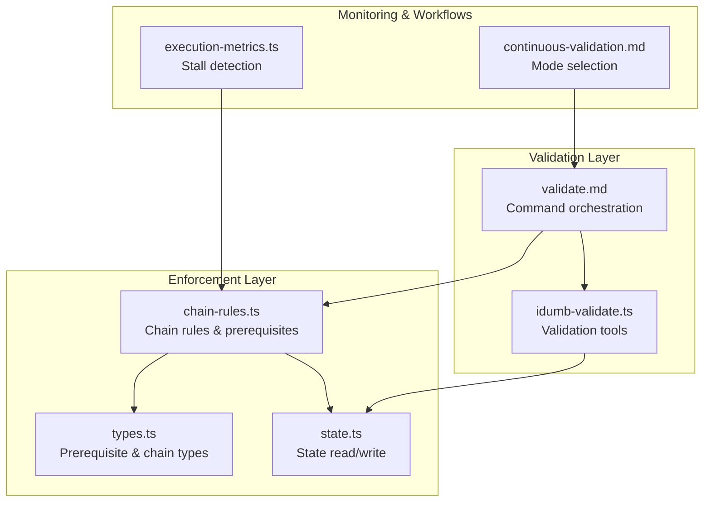
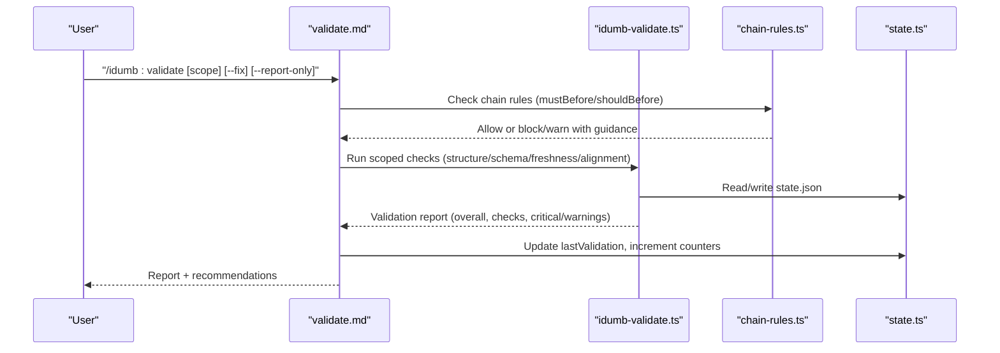
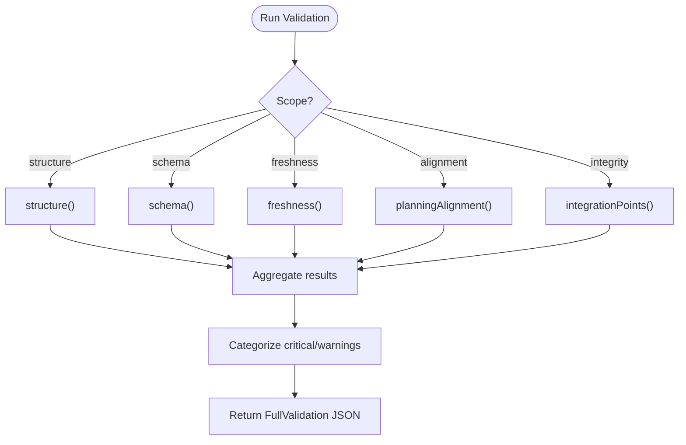
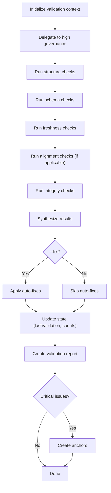
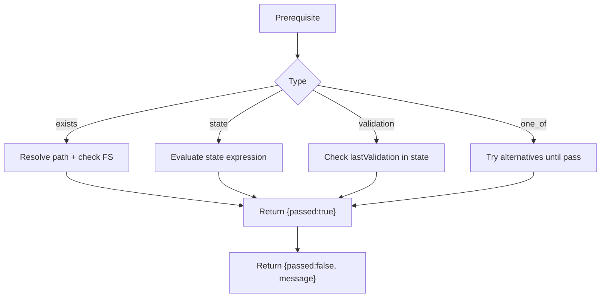
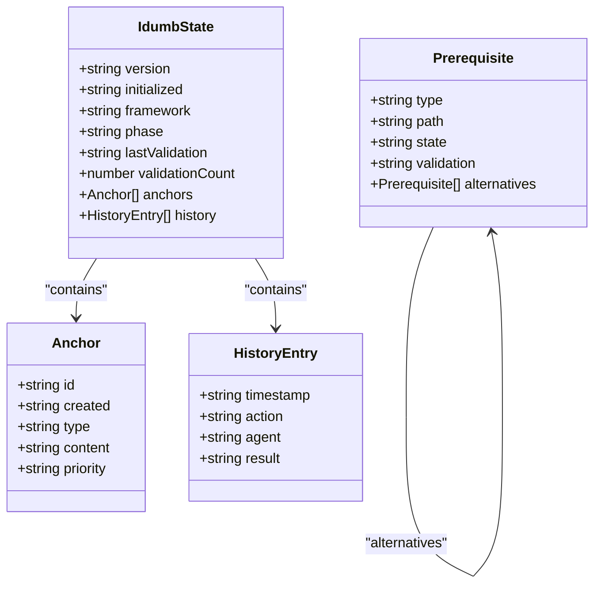
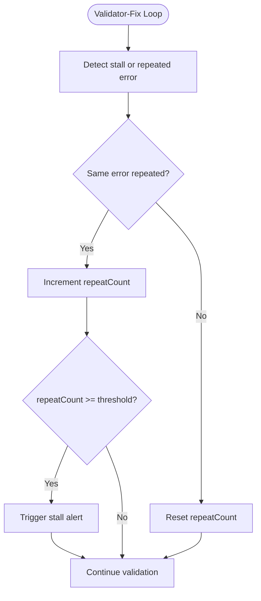
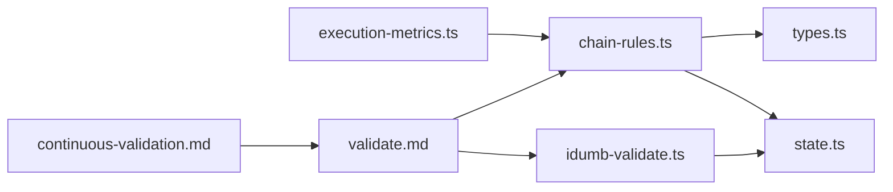

# Prerequisite Validation

<cite>
**Referenced Files in This Document**
- [idumb-validate.ts](file://src/tools/idumb-validate.ts)
- [validate.md](file://src/commands/idumb/validate.md)
- [chain-rules.ts](file://src/plugins/lib/chain-rules.ts)
- [types.ts](file://src/plugins/lib/types.ts)
- [state.ts](file://src/plugins/lib/state.ts)
- [execution-metrics.ts](file://src/plugins/lib/execution-metrics.ts)
- [continuous-validation.md](file://src/workflows/continuous-validation.md)
- [PERMISSION-ENTITIES-DEEP-DIVE-2026-02-04.md](file://.plugin-dev/research/PERMISSION-ENTITIES-DEEP-DIVE-2026-02-04.md)
</cite>

## Table of Contents
1. [Introduction](#introduction)
2. [Project Structure](#project-structure)
3. [Core Components](#core-components)
4. [Architecture Overview](#architecture-overview)
5. [Detailed Component Analysis](#detailed-component-analysis)
6. [Dependency Analysis](#dependency-analysis)
7. [Performance Considerations](#performance-considerations)
8. [Troubleshooting Guide](#troubleshooting-guide)
9. [Conclusion](#conclusion)
10. [Appendices](#appendices)

## Introduction
This document explains iDumb’s prerequisite validation system that ensures proper setup and readiness before agent operations. It covers the validation pipeline that verifies agent readiness, tool availability, and environmental requirements, with emphasis on first-tool requirements and context-first methodology enforcement. It also documents failure handling, retry mechanisms, error reporting, capability/resource validation, caching/performance optimizations, monitoring, and bypass/emergency access procedures.

## Project Structure
The prerequisite validation system spans:
- A validation tool that runs structured checks on project state and artifacts
- A command that orchestrates governance-aligned validation
- Chain enforcement rules that gate commands based on prerequisites
- State and type definitions that define required structures and permissions
- Metrics and continuous validation workflows that monitor and optimize validation behavior

**Diagram sources**
- [idumb-validate.ts](file://src/tools/idumb-validate.ts#L1-L1043)
- [validate.md](file://src/commands/idumb/validate.md#L1-L518)
- [chain-rules.ts](file://src/plugins/lib/chain-rules.ts#L1-L468)
- [types.ts](file://src/plugins/lib/types.ts#L182-L207)
- [state.ts](file://src/plugins/lib/state.ts#L34-L45)
- [execution-metrics.ts](file://src/plugins/lib/execution-metrics.ts#L243-L285)
- [continuous-validation.md](file://src/workflows/continuous-validation.md#L126-L154)

**Section sources**
- [idumb-validate.ts](file://src/tools/idumb-validate.ts#L1-L1043)
- [validate.md](file://src/commands/idumb/validate.md#L1-L518)
- [chain-rules.ts](file://src/plugins/lib/chain-rules.ts#L1-L468)
- [types.ts](file://src/plugins/lib/types.ts#L182-L207)
- [state.ts](file://src/plugins/lib/state.ts#L34-L45)
- [execution-metrics.ts](file://src/plugins/lib/execution-metrics.ts#L243-L285)
- [continuous-validation.md](file://src/workflows/continuous-validation.md#L126-L154)

## Core Components
- Validation toolset: structure, schema, freshness, planning alignment, integration points, frontmatter, and config schema validators
- Command orchestration: defines scope, severity levels, auto-fix behavior, and reporting
- Chain enforcement: enforces MUST-BEFORE/SHOULD-BEFORE prerequisites and provides guidance
- State and types: define required structures and prerequisite primitives
- Monitoring: stall detection and continuous validation mode selection

**Section sources**
- [idumb-validate.ts](file://src/tools/idumb-validate.ts#L29-L456)
- [validate.md](file://src/commands/idumb/validate.md#L10-L518)
- [chain-rules.ts](file://src/plugins/lib/chain-rules.ts#L34-L118)
- [types.ts](file://src/plugins/lib/types.ts#L182-L207)
- [state.ts](file://src/plugins/lib/state.ts#L34-L45)

## Architecture Overview
The validation architecture integrates command-driven orchestration with enforcement rules and state-aware checks. It supports:
- Scoped validation runs (structure, schema, freshness, alignment, integrity)
- Auto-fix and report-only modes
- Guidance building for prerequisite satisfaction
- Continuous validation mode selection

**Diagram sources**
- [validate.md](file://src/commands/idumb/validate.md#L53-L328)
- [idumb-validate.ts](file://src/tools/idumb-validate.ts#L402-L456)
- [chain-rules.ts](file://src/plugins/lib/chain-rules.ts#L183-L291)
- [state.ts](file://src/plugins/lib/state.ts#L34-L45)

## Detailed Component Analysis

### Validation Toolset (idumb-validate.ts)
The validation toolset provides modular checks:
- Structure: Ensures .idumb/ directory and subdirectories exist; validates state.json presence
- Schema: Validates required fields and types in state.json and config.json
- Freshness: Flags stale context files and anchors older than threshold
- Planning alignment: Confirms framework consistency with planning artifacts
- Integration points: Validates YAML frontmatter and exports for agents/commands/tools
- Frontmatter schema: Validates YAML frontmatter against predefined schemas
- Config schema: Validates state.json and config.json against required fields and types

**Diagram sources**
- [idumb-validate.ts](file://src/tools/idumb-validate.ts#L402-L456)

**Section sources**
- [idumb-validate.ts](file://src/tools/idumb-validate.ts#L29-L104)
- [idumb-validate.ts](file://src/tools/idumb-validate.ts#L108-L187)
- [idumb-validate.ts](file://src/tools/idumb-validate.ts#L190-L280)
- [idumb-validate.ts](file://src/tools/idumb-validate.ts#L283-L399)
- [idumb-validate.ts](file://src/tools/idumb-validate.ts#L402-L456)
- [idumb-validate.ts](file://src/tools/idumb-validate.ts#L539-L754)
- [idumb-validate.ts](file://src/tools/idumb-validate.ts#L840-L899)
- [idumb-validate.ts](file://src/tools/idumb-validate.ts#L902-L1042)

### Command Orchestration (/idumb:validate)
The command orchestrates validation with:
- Scope options: all, structure, schema, freshness, alignment, integrity
- Severity levels: structure/schema/integrity are critical; freshness/alignment are warnings
- Auto-fix and report-only flags
- Governance state updates and report generation
- Anchor creation for critical findings

**Diagram sources**
- [validate.md](file://src/commands/idumb/validate.md#L53-L328)

**Section sources**
- [validate.md](file://src/commands/idumb/validate.md#L10-L518)

### Chain Enforcement and Prerequisite Checking
Chain rules enforce MUST-BEFORE and SHOULD-BEFORE dependencies:
- INIT-01: All idumb commands require state.json except init/help
- PROJ-01/02: Roadmap/discuss-phase require PROJECT.md/ROADMAP.md
- PHASE-01/02/03: Execute-phase/verify-work require PLAN.md/execution evidence
- VAL-01: Marking phase complete requires VERIFICATION.md
- Prerequisite types: exists, state, validation, one_of
- Guidance building: actionable steps per failure type

**Diagram sources**
- [chain-rules.ts](file://src/plugins/lib/chain-rules.ts#L183-L267)
- [types.ts](file://src/plugins/lib/types.ts#L182-L191)

**Section sources**
- [chain-rules.ts](file://src/plugins/lib/chain-rules.ts#L34-L118)
- [chain-rules.ts](file://src/plugins/lib/chain-rules.ts#L183-L291)
- [types.ts](file://src/plugins/lib/types.ts#L182-L191)

### State and Types
State and type definitions underpin validation:
- IdumbState: required fields (version, initialized, framework, phase, lastValidation, validationCount, anchors, history)
- Prerequisite types: exists, state, validation, one_of
- READONLY_COMMANDS: status, help, validate, init bypass chain enforcement

**Diagram sources**
- [types.ts](file://src/plugins/lib/types.ts#L20-L51)
- [types.ts](file://src/plugins/lib/types.ts#L182-L191)

**Section sources**
- [types.ts](file://src/plugins/lib/types.ts#L20-L51)
- [types.ts](file://src/plugins/lib/types.ts#L182-L191)
- [state.ts](file://src/plugins/lib/state.ts#L34-L45)

### Monitoring and Retry Mechanisms
- Stall detection: detects repeated validator-fix stalls and triggers remediation
- Continuous validation: selects micro/batch/skip modes based on trigger conditions
- READONLY_COMMANDS: bypass chain enforcement for diagnostics and repair

**Diagram sources**
- [execution-metrics.ts](file://src/plugins/lib/execution-metrics.ts#L256-L285)
- [continuous-validation.md](file://src/workflows/continuous-validation.md#L126-L154)

**Section sources**
- [execution-metrics.ts](file://src/plugins/lib/execution-metrics.ts#L256-L285)
- [continuous-validation.md](file://src/workflows/continuous-validation.md#L126-L154)
- [chain-rules.ts](file://src/plugins/lib/chain-rules.ts#L19-L24)

### Practical Examples and Scenarios
- First-tool requirement: INIT-01 blocks most commands until state.json exists; guidance directs to initialization
- Context-first methodology: PHASE-02 warns if no CONTEXT.md exists before execution; guidance recommends discussing phase context first
- Planning alignment: If planning artifacts are present, framework must match; otherwise skip alignment
- Auto-fix scenarios: Missing directories/files can be auto-created; stale context archived; schema issues filled with defaults when --fix is used

**Section sources**
- [chain-rules.ts](file://src/plugins/lib/chain-rules.ts#L34-L118)
- [validate.md](file://src/commands/idumb/validate.md#L119-L284)

### Validation Failure Handling, Retry, and Reporting
- Blocking vs warning: Block-level violations halt execution; warnings allow continuation with guidance
- Guidance building: Actionable steps mapped to common failure patterns
- Reporting: JSON reports with overall status, categorized issues, and evidence
- Retry: Continuous validation mode selection determines whether to retry or skip

**Section sources**
- [chain-rules.ts](file://src/plugins/lib/chain-rules.ts#L375-L467)
- [validate.md](file://src/commands/idumb/validate.md#L241-L328)
- [continuous-validation.md](file://src/workflows/continuous-validation.md#L126-L154)

### Validation Caching, Performance, and Monitoring
- Performance validation: Scanning efficiency, resource usage, and iteration limits
- Continuous validation: Batch vs micro mode selection based on changed files and time thresholds
- Monitoring: Execution metrics and stall detection for remediation

**Section sources**
- [idumb-validate.ts](file://src/tools/idumb-validate.ts#L521-L532)
- [continuous-validation.md](file://src/workflows/continuous-validation.md#L126-L154)
- [execution-metrics.ts](file://src/plugins/lib/execution-metrics.ts#L243-L285)

### Validation Bypass and Emergency Access
- READONLY_COMMANDS bypass chain enforcement: status, help, validate, init
- Force flags: soft-block bypass via --force
- Emergency bypass: --emergency or --bypass-chain to skip all chain checks
- Permission enforcement: LOG-ONLY mode evidence and suggested agent/tool alternates

**Section sources**
- [chain-rules.ts](file://src/plugins/lib/chain-rules.ts#L19-L24)
- [PERMISSION-ENTITIES-DEEP-DIVE-2026-02-04.md](file://.plugin-dev/research/PERMISSION-ENTITIES-DEEP-DIVE-2026-02-04.md#L481-L484)

## Dependency Analysis
The validation system exhibits layered dependencies:
- Command depends on enforcement rules and validation tools
- Validation tools depend on state for reading/writing governance state
- Enforcement rules depend on state and prerequisite types
- Monitoring informs continuous validation mode selection

**Diagram sources**
- [validate.md](file://src/commands/idumb/validate.md#L53-L328)
- [idumb-validate.ts](file://src/tools/idumb-validate.ts#L402-L456)
- [chain-rules.ts](file://src/plugins/lib/chain-rules.ts#L183-L291)
- [types.ts](file://src/plugins/lib/types.ts#L182-L191)
- [state.ts](file://src/plugins/lib/state.ts#L34-L45)
- [execution-metrics.ts](file://src/plugins/lib/execution-metrics.ts#L243-L285)
- [continuous-validation.md](file://src/workflows/continuous-validation.md#L126-L154)

**Section sources**
- [validate.md](file://src/commands/idumb/validate.md#L53-L328)
- [idumb-validate.ts](file://src/tools/idumb-validate.ts#L402-L456)
- [chain-rules.ts](file://src/plugins/lib/chain-rules.ts#L183-L291)
- [types.ts](file://src/plugins/lib/types.ts#L182-L191)
- [state.ts](file://src/plugins/lib/state.ts#L34-L45)
- [execution-metrics.ts](file://src/plugins/lib/execution-metrics.ts#L243-L285)
- [continuous-validation.md](file://src/workflows/continuous-validation.md#L126-L154)

## Performance Considerations
- Scoped validation reduces overhead by limiting checks to specified areas
- Continuous validation mode selection prevents unnecessary batch runs
- Atomic state writes minimize corruption risk during frequent updates
- Stall detection avoids endless retries on persistent issues

[No sources needed since this section provides general guidance]

## Troubleshooting Guide
Common issues and resolutions:
- Missing state.json: Run initialization to create required structure
- Stale context files: Archive or refresh context; validation will warn
- Planning/framework mismatch: Align framework setting with detected planning system
- Integration point issues: Ensure YAML frontmatter and exports are present
- Chain enforcement block: Follow guidance to satisfy prerequisites before retry

**Section sources**
- [validate.md](file://src/commands/idumb/validate.md#L119-L284)
- [chain-rules.ts](file://src/plugins/lib/chain-rules.ts#L300-L370)
- [idumb-validate.ts](file://src/tools/idumb-validate.ts#L539-L754)

## Conclusion
iDumb’s prerequisite validation system combines command-driven orchestration, enforcement rules, and state-aware checks to ensure readiness before agent operations. It enforces first-tool and context-first methodologies, provides actionable guidance, and supports auto-fix and reporting. Monitoring and continuous validation optimize performance and reliability, while controlled bypass mechanisms enable emergency access when necessary.

[No sources needed since this section summarizes without analyzing specific files]

## Appendices
- Validation scopes and severity levels
- Auto-fix actions and report formats
- Chain rule IDs and enforcement patterns

**Section sources**
- [validate.md](file://src/commands/idumb/validate.md#L30-L518)
- [chain-rules.ts](file://src/plugins/lib/chain-rules.ts#L34-L118)