# Security Policies

<cite>
**Referenced Files in This Document**
- [deny-rules.yaml](file://src/config/deny-rules.yaml)
- [security-utils.sh](file://src/security/security-utils.sh)
- [idumb-security.ts](file://src/tools/idumb-security.ts)
- [sanitize-path.sh](file://src/skills/idumb-security/scripts/sanitize-path.sh)
- [validate-permissions.sh](file://src/skills/idumb-security/scripts/validate-permissions.sh)
- [file-lock.sh](file://src/skills/idumb-security/scripts/file-lock.sh)
- [validate-bash.sh](file://src/skills/idumb-security/scripts/validate-bash.sh)
- [chain-enforcement.md](file://src/router/chain-enforcement.md)
- [chain-rules.ts](file://src/plugins/lib/chain-rules.ts)
- [governance-builder.ts](file://src/plugins/lib/governance-builder.ts)
- [SESSION-STATES-GOVERNANCE.md](file://src/router/SESSION-STATES-GOVERNANCE.md)
- [PERMISSION-DENY-RESEARCH-2026-02-04.md](file://.plugin-dev/research/PERMISSION-DENY-RESEARCH-2026-02-04.md)
- [PERMISSION-DENY-FIXES.md](file://.plugin-dev/research/PERMISSION-DENY-FIXES.md)
- [PHASE0-SYNTHESIS-2026-02-04.md](file://.plugin-dev/research/PHASE0-SYNTHESIS-2026-02-04.md)
- [PHASE-1-VALIDATION-GAP-ANALYSIS-2026-02-04.md](file://.plugin-dev/research/PHASE-1-VALIDATION-GAP-ANALYSIS-2026-02-04.md)
- [ITERATION-LIMITS-LOOP-TERMINATION-2026-02-04.md](file://.plugin-dev/research/ITERATION-LIMITS-LOOP-TERMINATION-2026-02-04.md)
- [session-tracking.md](file://src/skills/hierarchical-mindfulness/references/session-tracking.md)
</cite>

## Table of Contents
1. [Introduction](#introduction)
2. [Project Structure](#project-structure)
3. [Core Components](#core-components)
4. [Architecture Overview](#architecture-overview)
5. [Detailed Component Analysis](#detailed-component-analysis)
6. [Dependency Analysis](#dependency-analysis)
7. [Performance Considerations](#performance-considerations)
8. [Troubleshooting Guide](#troubleshooting-guide)
9. [Conclusion](#conclusion)
10. [Appendices](#appendices)

## Introduction
This document defines iDumb’s security framework with a focus on hierarchical permission modeling, access control policies, and enforcement mechanisms. It explains the deny-rules.yaml configuration system, how policies apply across agent tiers, and the operational controls for timestamp validation, path sanitization, file operations, permission changes, atomic writes, and lock acquisition. It also covers policy inheritance, override mechanisms, audit trails, debugging, compliance checking, and policy evolution.

## Project Structure
Security-related assets are organized across configuration, shell utilities, TypeScript tools, and governance plugins:
- Configuration: deny-rules.yaml governs agent-specific allow/deny rules for bash, delegation, and file scopes.
- Shell utilities: security-utils.sh provides timestamp validation, path sanitization, safe directory creation, permission change validation, atomic writes, and file locking.
- TypeScript tools: idumb-security.ts scans bash scripts for injection, traversal, permission bypass, and race condition patterns.
- Scripts: sanitize-path.sh, validate-permissions.sh, file-lock.sh, and validate-bash.sh provide focused security validations and safe operations.
- Governance and chain enforcement: chain-enforcement.md and chain-rules.ts define MUST-BEFORE dependencies and enforcement levels; governance-builder.ts defines tool permissions and delegation matrices across agent tiers.

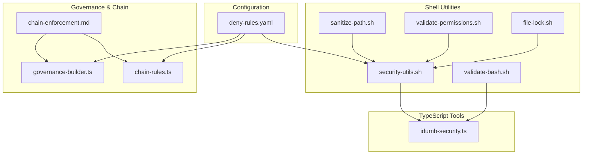

**Diagram sources**
- [deny-rules.yaml](file://src/config/deny-rules.yaml#L1-L398)
- [security-utils.sh](file://src/security/security-utils.sh#L1-L239)
- [idumb-security.ts](file://src/tools/idumb-security.ts#L1-L359)
- [chain-enforcement.md](file://src/router/chain-enforcement.md#L1-L257)
- [chain-rules.ts](file://src/plugins/lib/chain-rules.ts#L1-L468)
- [governance-builder.ts](file://src/plugins/lib/governance-builder.ts#L1-L635)

**Section sources**
- [deny-rules.yaml](file://src/config/deny-rules.yaml#L1-L398)
- [security-utils.sh](file://src/security/security-utils.sh#L1-L239)
- [idumb-security.ts](file://src/tools/idumb-security.ts#L1-L359)
- [chain-enforcement.md](file://src/router/chain-enforcement.md#L1-L257)
- [chain-rules.ts](file://src/plugins/lib/chain-rules.ts#L1-L468)
- [governance-builder.ts](file://src/plugins/lib/governance-builder.ts#L1-L635)

## Core Components
- Deny-rules.yaml: Central policy registry defining bash denies, allows, delegation restrictions/allows, file permissions, tool restrictions, first-tool requirements, and message templates.
- security-utils.sh: Strict-mode utilities for timestamp validation, path sanitization, safe directory creation, permission change validation, atomic writes, mode validation, lock acquisition/release, JSON validation, and safe file operations.
- idumb-security.ts: Static scanner for bash script security issues (injection, traversal, permissions, race conditions) with configurable modes and severity thresholds.
- Governance and chain enforcement: Tool permission matrices and delegation rules per agent tier; MUST-BEFORE dependencies for command sequencing; enforcement levels and recovery procedures.

**Section sources**
- [deny-rules.yaml](file://src/config/deny-rules.yaml#L10-L398)
- [security-utils.sh](file://src/security/security-utils.sh#L9-L239)
- [idumb-security.ts](file://src/tools/idumb-security.ts#L21-L359)
- [governance-builder.ts](file://src/plugins/lib/governance-builder.ts#L21-L139)
- [chain-rules.ts](file://src/plugins/lib/chain-rules.ts#L34-L118)

## Architecture Overview
The security framework enforces policies across three layers:
- Policy Layer: deny-rules.yaml defines agent-specific rules and messages.
- Enforcement Layer: chain-rules.ts and governance-builder.ts translate rules into runtime checks and delegation matrices.
- Operation Layer: security-utils.sh and idumb-security.ts provide atomicity, sanitization, validation, and scanning.

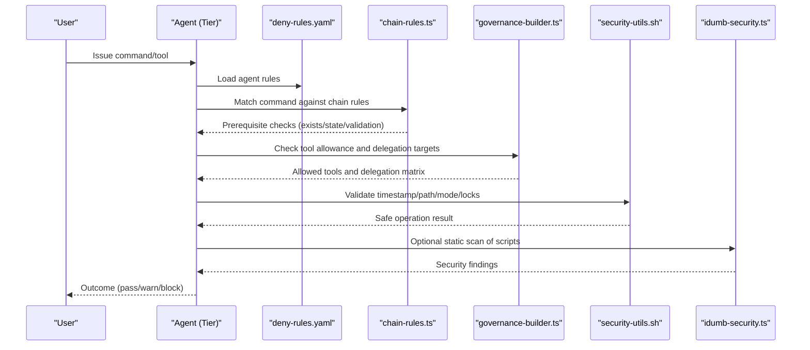

**Diagram sources**
- [deny-rules.yaml](file://src/config/deny-rules.yaml#L18-L398)
- [chain-rules.ts](file://src/plugins/lib/chain-rules.ts#L34-L118)
- [governance-builder.ts](file://src/plugins/lib/governance-builder.ts#L21-L139)
- [security-utils.sh](file://src/security/security-utils.sh#L9-L239)
- [idumb-security.ts](file://src/tools/idumb-security.ts#L194-L309)

## Detailed Component Analysis

### Hierarchical Permission Model and Access Control
- Agent tiers and roles:
  - Coordinators (Tier 1): Delegate-only, read context, and orchestrate META/PROJECT work.
  - Executives/Planners (Tier 2): Delegate to leaf nodes and read context.
  - Researchers/Validators (Tier 3): Read-only exploration/validation.
  - Builders/Validators (Leaf): Execute or validate; builders can write; validators are read-only.
- Tool permissions are defined per agent role and enforced via governance-builder.ts.
- Delegation rules restrict leaf agents from delegating and define allowed targets per coordinator.

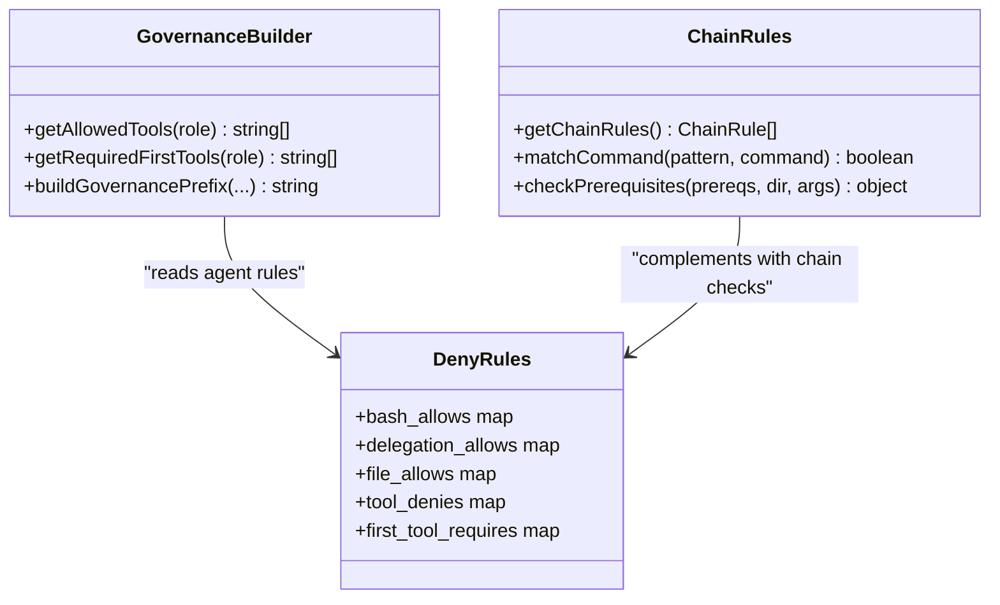

**Diagram sources**
- [governance-builder.ts](file://src/plugins/lib/governance-builder.ts#L21-L139)
- [chain-rules.ts](file://src/plugins/lib/chain-rules.ts#L34-L118)
- [deny-rules.yaml](file://src/config/deny-rules.yaml#L68-L338)

**Section sources**
- [governance-builder.ts](file://src/plugins/lib/governance-builder.ts#L21-L139)
- [deny-rules.yaml](file://src/config/deny-rules.yaml#L139-L221)

### Deny-Rules Configuration System
- Structure:
  - version, last_updated, author metadata.
  - bash_denies: specific patterns with severity and scope.
  - bash_allows: per-agent explicit allowances.
  - delegation_denies/delegation_allows: restrict or enable delegation targets.
  - file_allows: META/project scope and path allowlists.
  - tool_denies: restrict specific tools for certain agents.
  - first_tool_requires: required tool sequence per agent.
  - ask_permissions: minimal exceptions requiring user confirmation.
  - message_templates: TUI-safe messages for policy violations.
- Design principles emphasize specificity, contextual messaging, allow-listing, and minimal ask permissions.

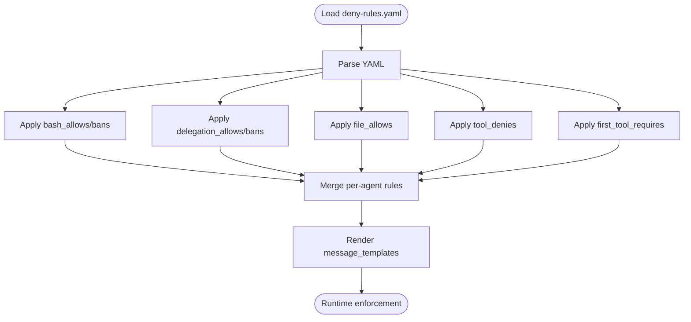

**Diagram sources**
- [deny-rules.yaml](file://src/config/deny-rules.yaml#L10-L398)

**Section sources**
- [deny-rules.yaml](file://src/config/deny-rules.yaml#L1-L398)

### Timestamp Validation
- Purpose: Ensure ISO-like timestamps conform to expected format before processing.
- Implementation: security-utils.sh validates timestamp format and supports cross-platform date arithmetic for staleness checks.

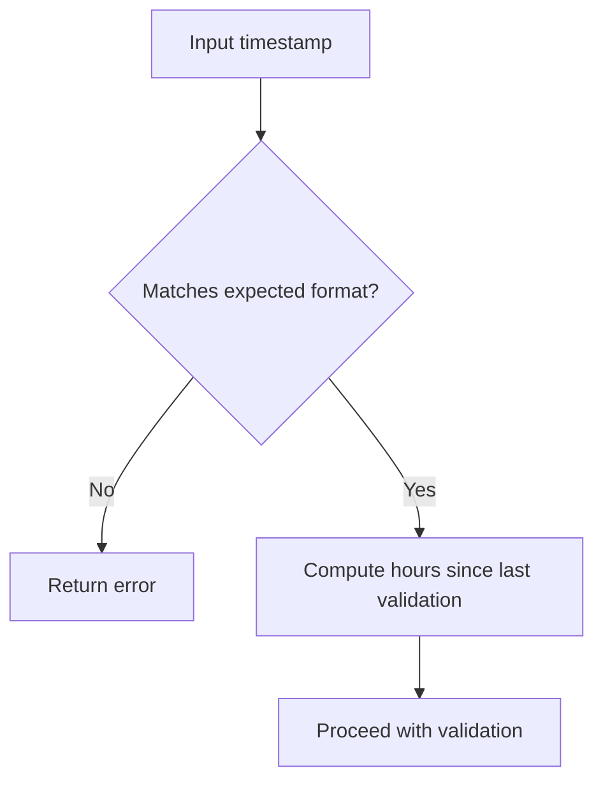

**Diagram sources**
- [security-utils.sh](file://src/security/security-utils.sh#L10-L58)

**Section sources**
- [security-utils.sh](file://src/security/security-utils.sh#L10-L58)

### Path Sanitization and File Operation Security
- Sanitization: Remove dangerous sequences and characters; prevent absolute paths; normalize separators.
- Safe directory creation: Validate sanitized paths before mkdir -p.
- File operations: safe_file_operation validates existence/readability; atomic_write writes to temp then moves atomically; validate_json_file checks JSON validity.

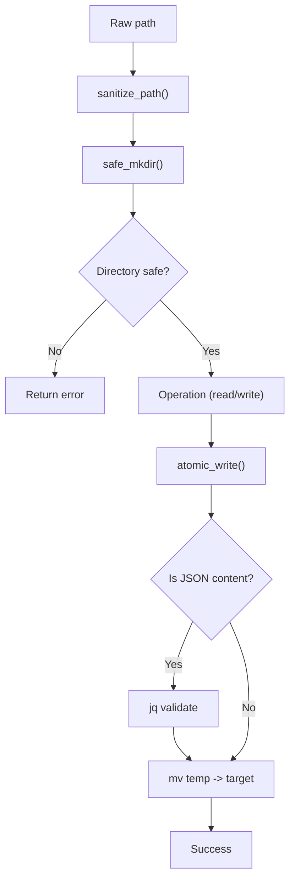

**Diagram sources**
- [security-utils.sh](file://src/security/security-utils.sh#L18-L122)
- [sanitize-path.sh](file://src/skills/idumb-security/scripts/sanitize-path.sh#L7-L29)

**Section sources**
- [security-utils.sh](file://src/security/security-utils.sh#L18-L122)
- [sanitize-path.sh](file://src/skills/idumb-security/scripts/sanitize-path.sh#L7-L29)

### Permission Change Validation and Atomic Writes
- Permission change validation ensures only safe transitions (e.g., adding task: deny to leaf agents; removing write: allow from coordinators).
- Atomic writes create a temp file, optionally validate JSON, then move atomically to avoid partial writes.
- Lock acquisition prevents race conditions during concurrent writes.

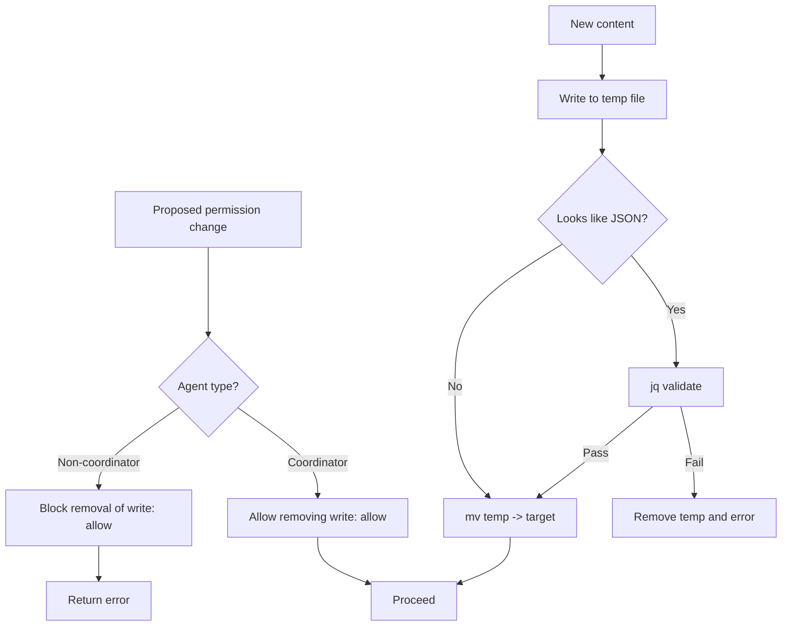

**Diagram sources**
- [security-utils.sh](file://src/security/security-utils.sh#L60-L122)

**Section sources**
- [security-utils.sh](file://src/security/security-utils.sh#L60-L122)

### Lock Acquisition Procedures
- acquire_lock attempts flock if available; otherwise uses a simple file-based lock with timeout.
- release_lock cleans up flock fd or removes the lock file.

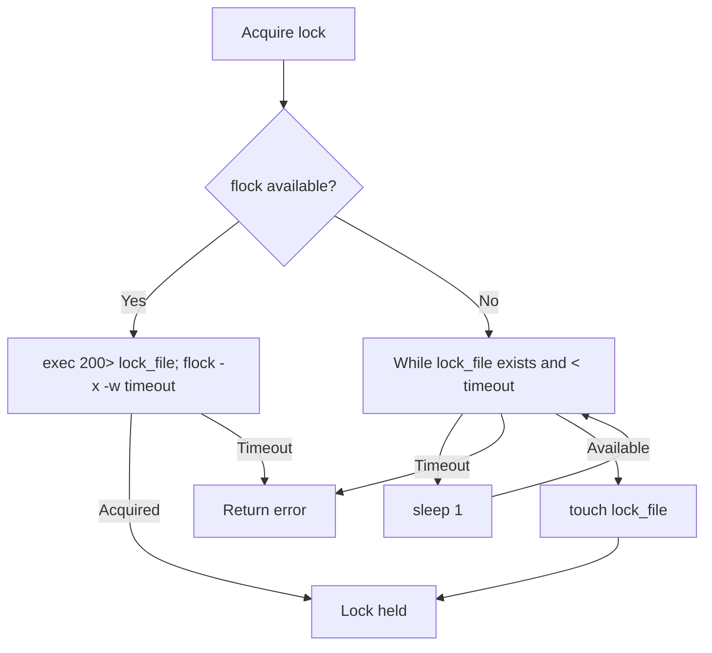

**Diagram sources**
- [security-utils.sh](file://src/security/security-utils.sh#L139-L183)

**Section sources**
- [security-utils.sh](file://src/security/security-utils.sh#L139-L183)

### Policy Application Across Agent Tiers
- Tool permissions: governance-builder.ts enumerates allowed tools per agent tier and enforces delegation-only for coordinators.
- Delegation: deny-rules.yaml restricts leaf agents from delegating; delegation_allows defines allowed targets per coordinator.
- First-tool requirements: enforce context-first methodology per agent tier.

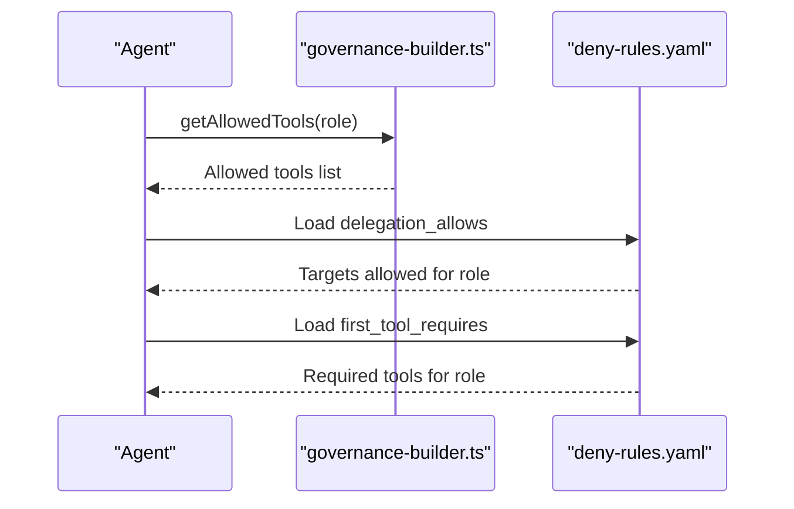

**Diagram sources**
- [governance-builder.ts](file://src/plugins/lib/governance-builder.ts#L21-L139)
- [deny-rules.yaml](file://src/config/deny-rules.yaml#L157-L338)

**Section sources**
- [governance-builder.ts](file://src/plugins/lib/governance-builder.ts#L21-L139)
- [deny-rules.yaml](file://src/config/deny-rules.yaml#L157-L338)

### Chain Enforcement and Timestamp Validation
- Chain rules define MUST-BEFORE and SHOULD-BEFORE dependencies for commands and phases.
- Prerequisite types include file existence, state conditions, and validation freshness.
- Enforcement levels: HARD_BLOCK (no override), SOFT_BLOCK (override with --force), WARN (continue with warning).
- Skip conditions: emergency mode and readonly commands bypass enforcement.

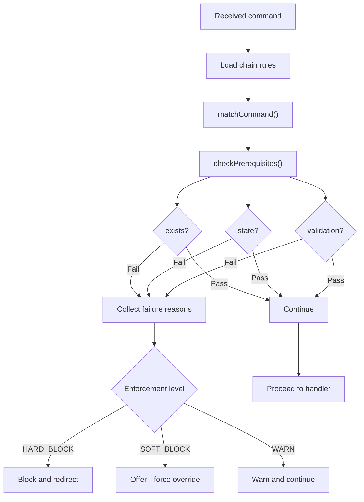

**Diagram sources**
- [chain-enforcement.md](file://src/router/chain-enforcement.md#L14-L257)
- [chain-rules.ts](file://src/plugins/lib/chain-rules.ts#L183-L291)

**Section sources**
- [chain-enforcement.md](file://src/router/chain-enforcement.md#L14-L257)
- [chain-rules.ts](file://src/plugins/lib/chain-rules.ts#L183-L291)

### Policy Violation Handling and Audit Trails
- Violations produce structured messages with reasons, suggestions, and next steps.
- Chain enforcement logs violations, offers remediation, and records decisions.
- Audit trails: iterations.log, checkpoints/, and audit/ directories support event sourcing and override logging.

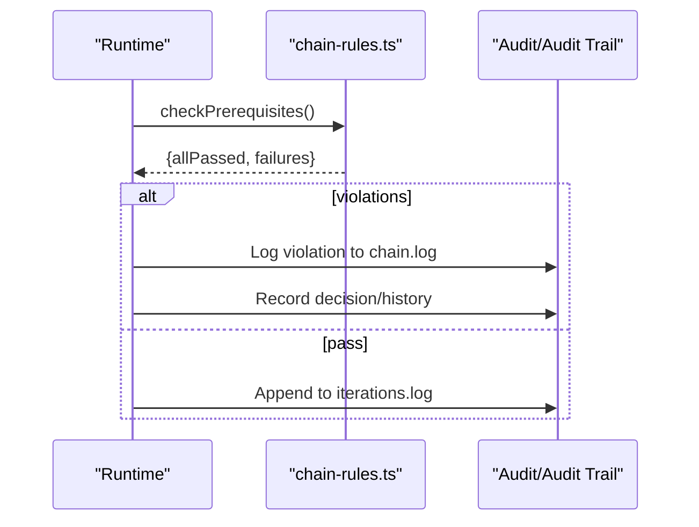

**Diagram sources**
- [chain-enforcement.md](file://src/router/chain-enforcement.md#L238-L253)
- [ITERATION-LIMITS-LOOP-TERMINATION-2026-02-04.md](file://.plugin-dev/research/ITERATION-LIMITS-LOOP-TERMINATION-2026-02-04.md#L413-L457)

**Section sources**
- [chain-enforcement.md](file://src/router/chain-enforcement.md#L238-L253)
- [ITERATION-LIMITS-LOOP-TERMINATION-2026-02-04.md](file://.plugin-dev/research/ITERATION-LIMITS-LOOP-TERMINATION-2026-02-04.md#L413-L457)

### Practical Examples
- Example: Builder cannot delegate; attempt to spawn tasks yields a delegation_blocked message with suggestions.
- Example: Coordinator cannot write; attempting filesystem_write_file triggers tool_blocked with delegation guidance.
- Example: Atomic write of JSON content fails if invalid; atomic_write removes temp and returns error.
- Example: Chain enforcement blocks /idumb:execute-phase without PLAN.md; suggests redirecting to /idumb:plan-phase.

**Section sources**
- [deny-rules.yaml](file://src/config/deny-rules.yaml#L140-L221)
- [security-utils.sh](file://src/security/security-utils.sh#L93-L122)
- [chain-enforcement.md](file://src/router/chain-enforcement.md#L64-L94)

## Dependency Analysis
- deny-rules.yaml is consumed by:
  - governance-builder.ts (tool permissions, delegation)
  - chain-rules.ts (contextual enforcement)
  - security-utils.sh (policy-driven safety checks)
- idumb-security.ts complements runtime checks with static analysis.
- Session governance and state persistence support audit and recovery.

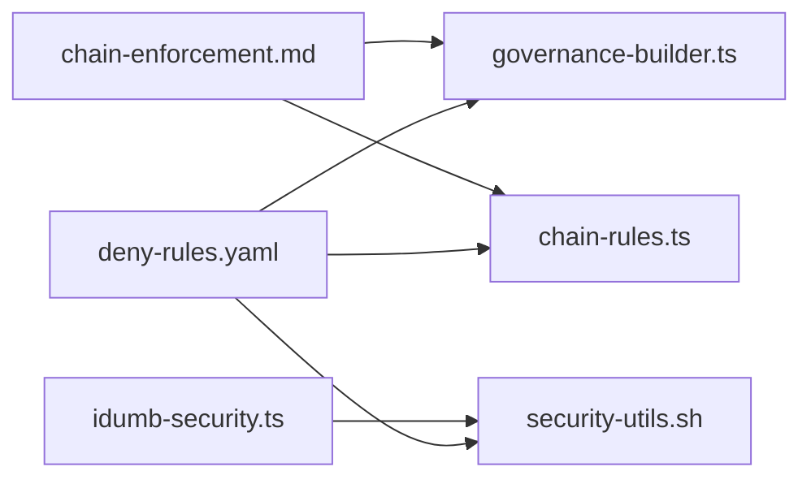

**Diagram sources**
- [deny-rules.yaml](file://src/config/deny-rules.yaml#L1-L398)
- [governance-builder.ts](file://src/plugins/lib/governance-builder.ts#L21-L139)
- [chain-rules.ts](file://src/plugins/lib/chain-rules.ts#L34-L118)
- [security-utils.sh](file://src/security/security-utils.sh#L1-L239)
- [idumb-security.ts](file://src/tools/idumb-security.ts#L1-L359)
- [chain-enforcement.md](file://src/router/chain-enforcement.md#L1-L257)

**Section sources**
- [deny-rules.yaml](file://src/config/deny-rules.yaml#L1-L398)
- [governance-builder.ts](file://src/plugins/lib/governance-builder.ts#L21-L139)
- [chain-rules.ts](file://src/plugins/lib/chain-rules.ts#L34-L118)
- [security-utils.sh](file://src/security/security-utils.sh#L1-L239)
- [idumb-security.ts](file://src/tools/idumb-security.ts#L1-L359)
- [chain-enforcement.md](file://src/router/chain-enforcement.md#L1-L257)

## Performance Considerations
- Static scanning: idumb-security.ts operates on single files; directory scanning should be invoked per file to minimize overhead.
- Path sanitization and atomic writes: keep patterns minimal and targeted to reduce regex cost and disk churn.
- Chain enforcement: prerequisite checks are lightweight but avoid redundant file system calls by caching resolved paths.

## Troubleshooting Guide
- Policy debugging:
  - Use validate-permissions.sh to check agent permission matrices for coordinators and builders.
  - Use validate-bash.sh to scan scripts for injection and traversal vulnerabilities.
  - Use idumb-security.ts to run comprehensive scans with configurable modes.
- Compliance checking:
  - Ensure agent roles align with deny-rules.yaml: no broad "*": deny patterns; prefer specific allows.
  - Verify delegation_allows and delegation_denies match the intended hierarchy.
- Policy evolution:
  - Follow research documents to update agent frontmatter and remove incorrect deny patterns.
  - Integrate deny-rules.yaml dynamically and add tool.execute.before hooks where feasible.

**Section sources**
- [validate-permissions.sh](file://src/skills/idumb-security/scripts/validate-permissions.sh#L7-L34)
- [validate-bash.sh](file://src/skills/idumb-security/scripts/validate-bash.sh#L7-L42)
- [idumb-security.ts](file://src/tools/idumb-security.ts#L247-L359)
- [PERMISSION-DENY-FIXES.md](file://.plugin-dev/research/PERMISSION-DENY-FIXES.md#L23-L49)
- [PERMISSION-DENY-RESEARCH-2026-02-04.md](file://.plugin-dev/research/PERMISSION-DENY-RESEARCH-2026-02-04.md#L286-L320)

## Conclusion
iDumb’s security framework combines a precise deny-rules.yaml policy registry with runtime enforcement via governance-builder.ts and chain-rules.ts, and operational safeguards through security-utils.sh and idumb-security.ts. The system enforces hierarchical permissions, delegation constraints, and safe file operations while maintaining auditability and recoverability.

## Appendices

### Policy Inheritance and Override Mechanisms
- Inheritance: Tool permissions and delegation derive from agent tier; first-tool requirements cascade per role.
- Overrides: SOFT_BLOCK allows --force; emergency_mode bypass skips chain checks; ask_permissions provide minimal user confirmations.

**Section sources**
- [chain-enforcement.md](file://src/router/chain-enforcement.md#L162-L236)
- [deny-rules.yaml](file://src/config/deny-rules.yaml#L343-L357)

### Session States and Governance Injection
- Session states influence governance depth; root sessions receive full governance context, while resumed sessions re-establish delegation chains.

**Section sources**
- [SESSION-STATES-GOVERNANCE.md](file://src/router/SESSION-STATATES-GOVERNANCE.md#L1-L200)
- [session-tracking.md](file://src/skills/hierarchical-mindfulness/references/session-tracking.md#L206-L260)