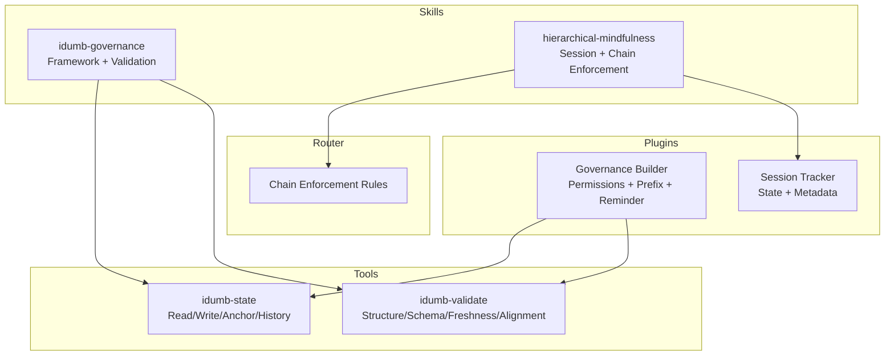
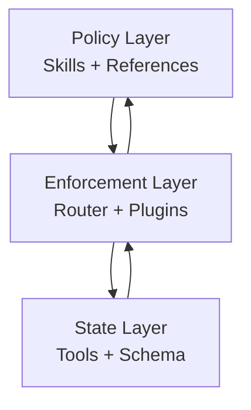
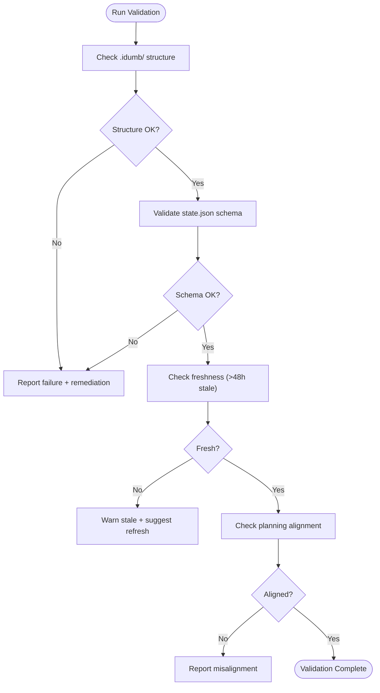
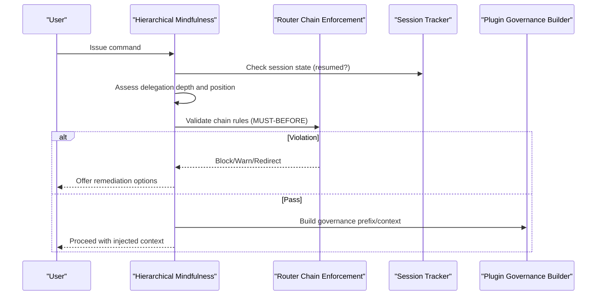
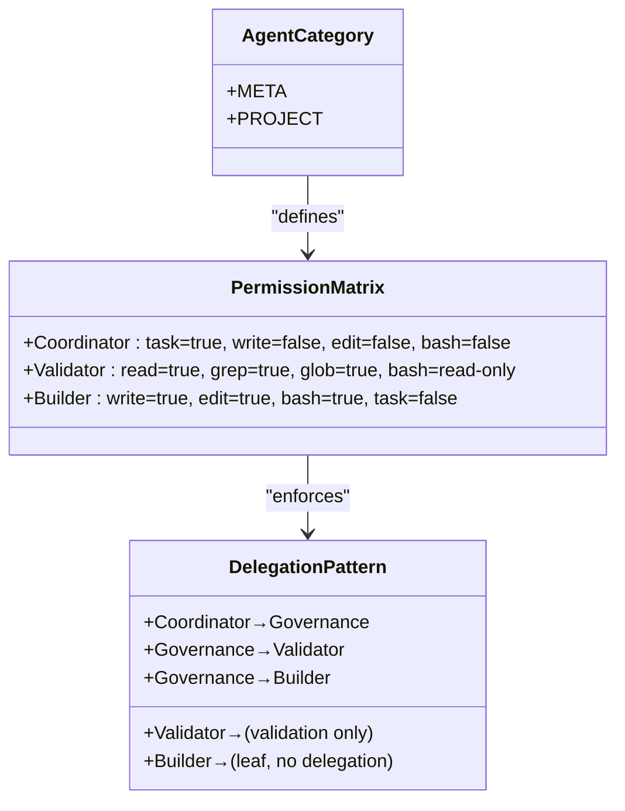
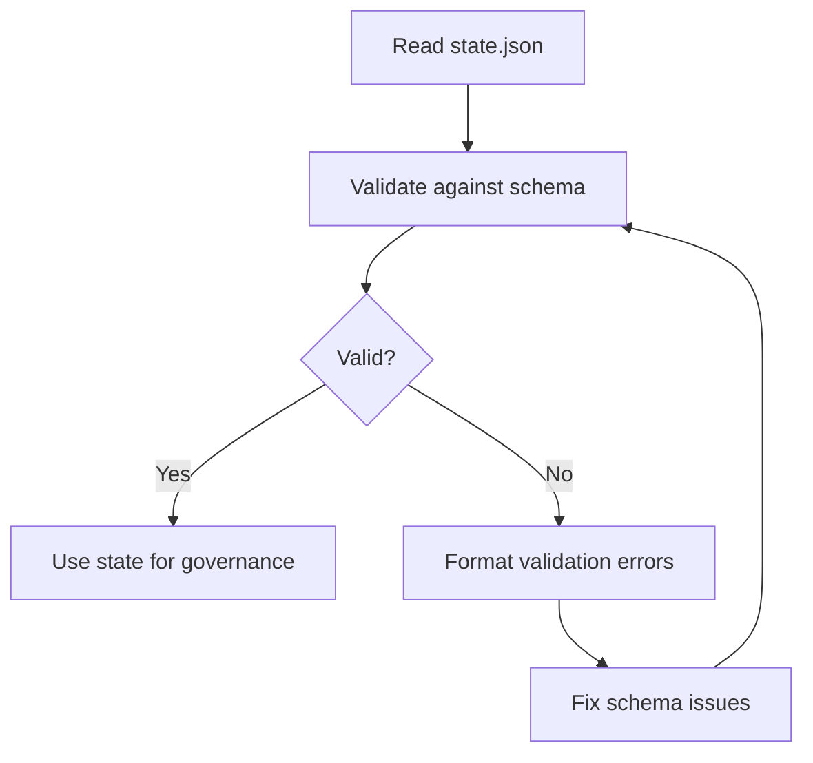
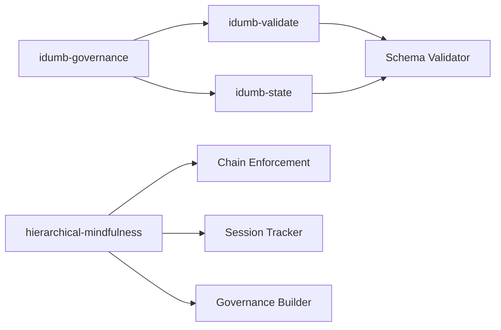

# Governance Skills

<cite>
**Referenced Files in This Document**
- [SKILL.md](file://src/skills/idumb-governance/SKILL.md)
- [SKILL.md](file://src/skills/hierarchical-mindfulness/SKILL.md)
- [agent-hierarchy.md](file://src/skills/hierarchical-mindfulness/references/agent-hierarchy.md)
- [chain-enforcement.md](file://src/skills/hierarchical-mindfulness/references/chain-enforcement.md)
- [SESSION-STATES-GOVERNANCE.md](file://src/router/SESSION-STATES-GOVERNANCE.md)
- [governance-builder.ts](file://src/plugins/lib/governance-builder.ts)
- [session-tracker.ts](file://src/plugins/lib/session-tracker.ts)
- [schema-validator.ts](file://src/plugins/lib/schema-validator.ts)
- [idumb-state.ts](file://src/tools/idumb-state.ts)
- [idumb-validate.ts](file://src/tools/idumb-validate.ts)
- [chain-enforcement.md](file://src/router/chain-enforcement.md)
</cite>

## Table of Contents
1. [Introduction](#introduction)
2. [Project Structure](#project-structure)
3. [Core Components](#core-components)
4. [Architecture Overview](#architecture-overview)
5. [Detailed Component Analysis](#detailed-component-analysis)
6. [Dependency Analysis](#dependency-analysis)
7. [Performance Considerations](#performance-considerations)
8. [Troubleshooting Guide](#troubleshooting-guide)
9. [Conclusion](#conclusion)
10. [Appendices](#appendices)

## Introduction
This document explains two complementary governance skills that keep iDumb projects safe, aligned, and resilient:
- idumb-governance: Defines the framework structure, agent categories, permission matrix, and state schema validation used across the system.
- hierarchical-mindfulness: Focuses on session state awareness, delegation depth tracking, and chain enforcement during execution to prevent governance drift and maintain mindful orchestration.

Both skills share the goal of ensuring that every action traces back to clear authority and evidence, but they operate at different layers: idumb-governance establishes the “what” (structure, permissions, schema), while hierarchical-mindfulness ensures the “how” (awareness, depth, chain integrity) during runtime.

## Project Structure
The governance system spans skills, router rules, plugin builders, tools, and state management:

- Skills define policies and patterns:
  - idumb-governance: Framework structure, agent categories, validation protocols, anchoring, planning integration, compaction survival, and error handling.
  - hierarchical-mindfulness: Session states, delegation depth, chain enforcement, and mindfulness triggers.
- Router enforces command chains and prerequisites.
- Plugins build governance context, enforce permissions, and track sessions.
- Tools manage state, validation, and anchoring.

**Diagram sources**
- [SKILL.md](file://src/skills/idumb-governance/SKILL.md#L1-L343)
- [SKILL.md](file://src/skills/hierarchical-mindfulness/SKILL.md#L1-L357)
- [chain-enforcement.md](file://src/router/chain-enforcement.md#L1-L257)
- [governance-builder.ts](file://src/plugins/lib/governance-builder.ts#L1-L635)
- [session-tracker.ts](file://src/plugins/lib/session-tracker.ts#L1-L385)
- [idumb-state.ts](file://src/tools/idumb-state.ts#L1-L599)
- [idumb-validate.ts](file://src/tools/idumb-validate.ts#L1-L1043)

**Section sources**
- [SKILL.md](file://src/skills/idumb-governance/SKILL.md#L1-L343)
- [SKILL.md](file://src/skills/hierarchical-mindfulness/SKILL.md#L1-L357)
- [SESSION-STATES-GOVERNANCE.md](file://src/router/SESSION-STATES-GOVERNANCE.md#L1-L288)

## Core Components
- idumb-governance
  - Agent categories: META (framework) vs PROJECT (user code), with scope-based permissions.
  - Validation protocols: structure, schema, freshness, planning alignment.
  - Context anchoring: critical, high, and normal priorities with limits.
  - Planning integration: wrap-and-don’t-break approach with sync protocol.
  - Compaction survival: anchors and recent history injection.
  - Error handling: structured failure reporting and remediation guidance.
- hierarchical-mindfulness
  - Session states: beginning, compacted, between-turn, interrupted, resumed.
  - Delegation depth tracking: strict levels with max depth and loop detection.
  - Chain enforcement: MUST-BEFORE rules for initialization, project, phase execution, and validation.
  - Mindfulness triggers: pause points for depth, loops, context window, and resumption.

**Section sources**
- [SKILL.md](file://src/skills/idumb-governance/SKILL.md#L49-L202)
- [SKILL.md](file://src/skills/idumb-governance/SKILL.md#L118-L166)
- [SKILL.md](file://src/skills/idumb-governance/SKILL.md#L168-L230)
- [SKILL.md](file://src/skills/idumb-governance/SKILL.md#L232-L257)
- [SKILL.md](file://src/skills/idumb-governance/SKILL.md#L259-L287)
- [SKILL.md](file://src/skills/hierarchical-mindfulness/SKILL.md#L55-L94)
- [SKILL.md](file://src/skills/hierarchical-mindfulness/SKILL.md#L147-L179)
- [SKILL.md](file://src/skills/hierarchical-mindfulness/SKILL.md#L181-L227)
- [SKILL.md](file://src/skills/hierarchical-mindfulness/SKILL.md#L230-L252)

## Architecture Overview
The governance architecture integrates policy, runtime enforcement, and state:

- Policy layer (skills) defines:
  - Agent categories and permissions.
  - Validation schemas and anchoring rules.
  - Session state lifecycle and mindfulness protocols.
- Enforcement layer (router + plugins) enforces:
  - Chain rules for commands and phases.
  - Tool permissions and first-tool requirements.
  - Session resumption and compaction reminders.
- State layer (tools + schema) maintains:
  - Governance state with anchors and history.
  - JSON schema validation for state and checkpoints.

**Diagram sources**
- [SKILL.md](file://src/skills/idumb-governance/SKILL.md#L1-L343)
- [SKILL.md](file://src/skills/hierarchical-mindfulness/SKILL.md#L1-L357)
- [chain-enforcement.md](file://src/router/chain-enforcement.md#L1-L257)
- [governance-builder.ts](file://src/plugins/lib/governance-builder.ts#L1-L635)
- [schema-validator.ts](file://src/plugins/lib/schema-validator.ts#L1-L285)
- [idumb-state.ts](file://src/tools/idumb-state.ts#L1-L599)

## Detailed Component Analysis

### idumb-governance: Framework Structure and Validation
- Agent categories and scope:
  - META agents (framework): idumb-supreme-coordinator, idumb-high-governance, idumb-meta-builder (only META writer), idumb-meta-validator (read-only).
  - PROJECT agents (user code): idumb-project-coordinator, idumb-project-executor (only PROJECT writer), idumb-project-validator, idumb-project-explorer.
- Validation protocols:
  - Structure: .idumb/brain/state.json must exist; optional .idumb/brain/governance/ and .idumb/anchors/.
  - Schema: state.json must include version, initialized, framework, phase, lastValidation, validationCount, anchors[], history[].
  - Freshness: files older than 48 hours are stale; review anchors older than 48h.
  - Planning alignment: if planning detected, verify .planning/PROJECT.md, .planning/ROADMAP.md, and phase alignment.
- Context anchoring:
  - Types: decision, context, checkpoint; priorities: critical, high, normal.
  - Limits: max 20 anchors; prune normal first, preserve critical.
- Planning integration:
  - Wrap, don’t break: intercept via plugin hooks; validate post-execution; track state separately.
  - Sync protocol: read PROJECT.md for current phase and update state.json.
- Compaction survival:
  - Inject: current phase/framework, critical/high anchors, recent history (last 5).
  - What gets lost: normal anchors (unless recent), history beyond last 5, detailed validation reports.
- Error handling:
  - Validation failures: report reasons, evidence, remediation; do not auto-fix without delegation.
  - State corruption: detect, salvage what’s readable, recommend re-init, preserve anchors if possible.
  - Missing dependencies: inform to run /idumb:init; do not auto-create structure.

**Diagram sources**
- [SKILL.md](file://src/skills/idumb-governance/SKILL.md#L118-L166)
- [idumb-validate.ts](file://src/tools/idumb-validate.ts#L28-L187)

**Section sources**
- [SKILL.md](file://src/skills/idumb-governance/SKILL.md#L49-L202)
- [SKILL.md](file://src/skills/idumb-governance/SKILL.md#L118-L166)
- [SKILL.md](file://src/skills/idumb-governance/SKILL.md#L168-L230)
- [SKILL.md](file://src/skills/idumb-governance/SKILL.md#L232-L257)
- [SKILL.md](file://src/skills/idumb-governance/SKILL.md#L259-L287)
- [idumb-validate.ts](file://src/tools/idumb-validate.ts#L28-L187)
- [schema-validator.ts](file://src/plugins/lib/schema-validator.ts#L162-L227)

### hierarchical-mindfulness: Session State Awareness and Chain Enforcement
- Session states and lifecycle:
  - Beginning new conversation, compacted, between-turn, interrupted, resumed.
  - Resumption detection: idle 1–48 hours; inject resume context and active anchors.
  - Language enforcement must survive compaction; post-compaction reminders include recent actions and critical anchors.
- Delegation depth tracking:
  - Levels: root session (user), primary agent (coordinator), mid-level (governance), validator, builder.
  - Max depth: 4; exceeding indicates potential loop; return decrements depth.
- Chain enforcement:
  - MUST-BEFORE rules for initialization (/idumb:init), project (/idumb:roadmap, /idumb:discuss-phase), phase execution (/idumb:execute-phase), and validation (phase complete, commit changes).
  - Enforcement levels: HARD_BLOCK (no override), SOFT_BLOCK (override with --force), WARN (continue after warning).
- Mindfulness triggers:
  - Pause when delegation depth > 4, same agent repeats, chain violation, context window > 80%, session idle > 1 hour.
  - Force checkpoint before phase transitions, major structural changes, after 10+ iterations, before potential breaking operations, when session shows stall.

**Diagram sources**
- [SKILL.md](file://src/skills/hierarchical-mindfulness/SKILL.md#L55-L94)
- [SKILL.md](file://src/skills/hierarchical-mindfulness/SKILL.md#L147-L179)
- [chain-enforcement.md](file://src/router/chain-enforcement.md#L1-L257)
- [session-tracker.ts](file://src/plugins/lib/session-tracker.ts#L269-L280)
- [governance-builder.ts](file://src/plugins/lib/governance-builder.ts#L200-L346)

**Section sources**
- [SKILL.md](file://src/skills/hierarchical-mindfulness/SKILL.md#L55-L94)
- [SKILL.md](file://src/skills/hierarchical-mindfulness/SKILL.md#L147-L179)
- [SESSION-STATES-GOVERNANCE.md](file://src/router/SESSION-STATES-GOVERNANCE.md#L59-L177)
- [chain-enforcement.md](file://src/router/chain-enforcement.md#L1-L257)
- [session-tracker.ts](file://src/plugins/lib/session-tracker.ts#L269-L280)
- [governance-builder.ts](file://src/plugins/lib/governance-builder.ts#L200-L346)

### Agent Categories, Permission Matrix, and Delegation Patterns
- Agent categories:
  - META: idumb-supreme-coordinator, idumb-high-governance, idumb-meta-builder (only META writer), idumb-meta-validator (read-only).
  - PROJECT: idumb-project-coordinator, idumb-project-executor (only PROJECT writer), idumb-project-validator, idumb-project-explorer.
- Permission matrix:
  - Coordinators: task allowed, no write/edit/bash; can delegate.
  - Validators: read-only validation; grep/glob/read allowed.
  - Builders: write/edit/bash allowed; cannot delegate.
- Valid delegation patterns:
  - Coordinator → Governance → Validator → Builder.
  - Forbidden: upward delegation, skipping levels, validator or builder delegating.

**Diagram sources**
- [agent-hierarchy.md](file://src/skills/hierarchical-mindfulness/references/agent-hierarchy.md#L20-L192)
- [governance-builder.ts](file://src/plugins/lib/governance-builder.ts#L94-L139)

**Section sources**
- [agent-hierarchy.md](file://src/skills/hierarchical-mindfulness/references/agent-hierarchy.md#L20-L192)
- [governance-builder.ts](file://src/plugins/lib/governance-builder.ts#L94-L139)

### State Schema Validation and Tools
- State schema validation:
  - Uses JSON Schema (draft-07 compatible) to validate .idumb/brain/state.json and checkpoints.
  - Provides structured error/warning reporting.
- State management tools:
  - Read/write state, anchor creation, history recording, session records, export, list, purge old sessions.
  - Enforces pruning of anchors/history to limits and archives excess entries.

**Diagram sources**
- [schema-validator.ts](file://src/plugins/lib/schema-validator.ts#L162-L227)
- [idumb-state.ts](file://src/tools/idumb-state.ts#L62-L79)
- [idumb-state.ts](file://src/tools/idumb-state.ts#L154-L192)

**Section sources**
- [schema-validator.ts](file://src/plugins/lib/schema-validator.ts#L162-L227)
- [idumb-state.ts](file://src/tools/idumb-state.ts#L62-L79)
- [idumb-state.ts](file://src/tools/idumb-state.ts#L154-L192)

## Dependency Analysis
- idumb-governance depends on:
  - Validation tools for structure/schema/freshness/planning alignment.
  - State tools for reading/writing anchors/history.
- hierarchical-mindfulness depends on:
  - Router chain enforcement for MUST-BEFORE rules.
  - Session tracker for resumption detection and metadata.
  - Plugin governance builder for language enforcement, first-action-required, and post-compaction reminders.
- Cross-cutting:
  - Both skills rely on JSON schema validation for state integrity.
  - Session state governs when and how context is injected.

**Diagram sources**
- [SKILL.md](file://src/skills/idumb-governance/SKILL.md#L1-L343)
- [SKILL.md](file://src/skills/hierarchical-mindfulness/SKILL.md#L1-L357)
- [chain-enforcement.md](file://src/router/chain-enforcement.md#L1-L257)
- [session-tracker.ts](file://src/plugins/lib/session-tracker.ts#L1-L385)
- [governance-builder.ts](file://src/plugins/lib/governance-builder.ts#L1-L635)
- [schema-validator.ts](file://src/plugins/lib/schema-validator.ts#L1-L285)
- [idumb-validate.ts](file://src/tools/idumb-validate.ts#L1-L1043)
- [idumb-state.ts](file://src/tools/idumb-state.ts#L1-L599)

**Section sources**
- [chain-enforcement.md](file://src/router/chain-enforcement.md#L1-L257)
- [governance-builder.ts](file://src/plugins/lib/governance-builder.ts#L1-L635)
- [session-tracker.ts](file://src/plugins/lib/session-tracker.ts#L1-L385)
- [schema-validator.ts](file://src/plugins/lib/schema-validator.ts#L1-L285)
- [idumb-validate.ts](file://src/tools/idumb-validate.ts#L1-L1043)
- [idumb-state.ts](file://src/tools/idumb-state.ts#L1-L599)

## Performance Considerations
- Minimize unnecessary validations: use freshness thresholds and targeted validation scopes.
- Limit anchors/history growth: rely on pruning and archiving to keep state compact.
- Avoid deep delegation loops: monitor delegation depth and loop indicators.
- Reduce context window pressure: inject minimal required context per delegation and leverage anchors for continuity.

[No sources needed since this section provides general guidance]

## Troubleshooting Guide
Common governance issues and remedies:
- Missing .idumb/ or state.json:
  - Remediation: run /idumb:init; do not auto-create structure.
- Validation failures:
  - Remediation: inspect evidence, fix schema/structure, rerun validation.
- Stale context:
  - Remediation: run /idumb:validate; refresh anchors; confirm freshness.
- Planning misalignment:
  - Remediation: ensure .planning/PROJECT.md and .planning/ROADMAP.md; align phases.
- Chain violations:
  - Remediation: follow on_violation actions (redirect/block/warn); use --force if allowed; log decisions.
- Session resumption drift:
  - Remediation: confirm governance level, phase alignment, and active anchors; rebuild context if needed.
- Delegation loops or excessive depth:
  - Remediation: pause delegation, audit chain, return to parent, and refactor.

**Section sources**
- [SKILL.md](file://src/skills/idumb-governance/SKILL.md#L259-L287)
- [chain-enforcement.md](file://src/router/chain-enforcement.md#L192-L253)
- [session-tracker.ts](file://src/plugins/lib/session-tracker.ts#L269-L280)
- [governance-builder.ts](file://src/plugins/lib/governance-builder.ts#L363-L457)

## Conclusion
idumb-governance and hierarchical-mindfulness are complementary:
- idumb-governance defines the “framework structure, permissions, and schema,” ensuring the system is well-formed and evidence-based.
- hierarchical-mindfulness ensures the “runtime awareness and chain integrity,” preventing governance drift and maintaining mindful orchestration.

Together, they provide robust governance: a strong foundation (structure + schema) and vigilant runtime oversight (session states + chain enforcement).

[No sources needed since this section summarizes without analyzing specific files]

## Appendices

### Configuration Examples and Integration Patterns
- Agent delegation patterns:
  - Coordinator → Governance → Validator → Builder (strict chain).
  - Forbidden: upward delegation, skipping levels, validator or builder delegating.
- Planning integration:
  - Wrap commands; validate post-execution; update state.json phase after planning operations.
- Session resumption:
  - Detect idle 1–48 hours; inject current phase, critical anchors, pending TODOs, and recent history.
- Tool usage:
  - idumb-state: read, write, anchor, history, getAnchors, create/list/export/modify sessions.
  - idumb-validate: structure, schema, freshness, planningAlignment, integrationPoints, default (full).

**Section sources**
- [agent-hierarchy.md](file://src/skills/hierarchical-mindfulness/references/agent-hierarchy.md#L173-L192)
- [SKILL.md](file://src/skills/idumb-governance/SKILL.md#L204-L230)
- [SESSION-STATES-GOVERNANCE.md](file://src/router/SESSION-STATES-GOVERNANCE.md#L151-L177)
- [idumb-state.ts](file://src/tools/idumb-state.ts#L82-L152)
- [idumb-validate.ts](file://src/tools/idumb-validate.ts#L401-L456)

### Practical Usage Scenarios
- Starting a new session:
  - Inject governance prefix with language enforcement and first-action-required; initialize execution metrics and stall detection.
- Executing a phase:
  - Ensure PLAN.md exists; run /idumb:execute-phase; verify SUMMARY.md for evidence; then /idumb:verify-work.
- Recovering from a chain violation:
  - Redirect to prerequisite command, optionally override with --force, or cancel; record decision in history.
- Managing delegation depth:
  - Monitor depth; pause when exceeding 4; ensure each delegation increments depth and returns decrement it.

**Section sources**
- [SESSION-STATES-GOVERNANCE.md](file://src/router/SESSION-STATES-GOVERNANCE.md#L61-L86)
- [chain-enforcement.md](file://src/router/chain-enforcement.md#L120-L160)
- [SKILL.md](file://src/skills/hierarchical-mindfulness/SKILL.md#L230-L252)