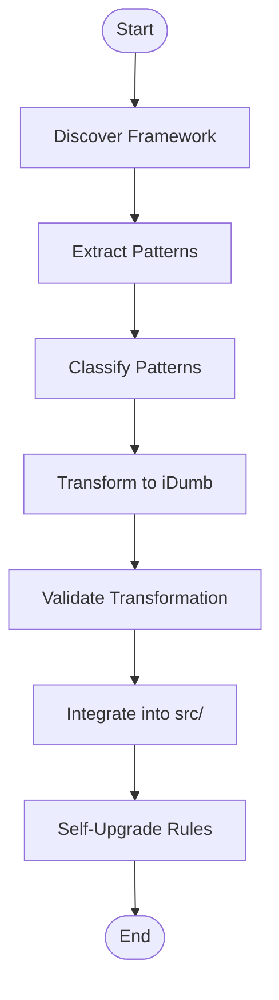

# Skill Development Guide

<cite>
**Referenced Files in This Document**
- [README.md](file://README.md)
- [SKILL.md](file://src/skills/idumb-meta-builder/SKILL.md)
- [validate-module.js](file://src/skills/idumb-meta-builder/scripts/validate-module.js)
- [SKILL.md](file://src/skills/idumb-validation/SKILL.md)
- [integration-matrix-template.yaml](file://src/skills/idumb-validation/templates/integration-matrix-template.yaml)
- [SKILL.md](file://src/skills/idumb-governance/SKILL.md)
- [SKILL.md](file://src/skills/idumb-project-validation/SKILL.md)
- [SKILL.md](file://src/skills/idumb-stress-test/SKILL.md)
- [SKILL.md](file://src/skills/idumb-security/SKILL.md)
- [SKILL.md](file://src/skills/idumb-performance/SKILL.md)
- [SKILL.md](file://src/skills/idumb-code-quality/SKILL.md)
- [SKILL.md](file://src/skills/idumb-meta-orchestrator/SKILL.md)
- [SKILL.md](file://src/skills/output-style-enforcement/SKILL.md)
- [SKILL.md](file://src/skills/hierarchical-mindfulness/SKILL.md)
- [SKILL.md](file://src/skills/web-search/SKILL.md)
- [SKILL.md](file://src/skills/mermaid-diagrams/SKILL.md)
- [SKILL.md](file://src/skills/brainstorming/SKILL.md)
- [SKILL.md](file://src/skills/find-skills/SKILL.md)
- [SKILL.md](file://src/skills/frontend-design/SKILL.md)
- [SKILL.md](file://src/skills/web-design-guidelines/SKILL.md)
- [SKILL.md](file://src/skills/systematic-debugging/SKILL.md)
- [SKILL.md](file://src/skills/agent-browser/SKILL.md)
- [SKILL.md](file://src/skills/skill-creator/SKILL.md)
- [init_skill.py](file://src/skills/skill-creator/scripts/init_skill.py)
- [package_skill.py](file://src/skills/skill-creator/scripts/package_skill.py)
- [quick_validate.py](file://src/skills/skill-creator/scripts/quick_validate.py)
- [SKILL.md](file://src/skills/skill-creator/SKILL.md)
- [SKILL.md](file://src/skills/skill-creator/SKILL.md)
- [SKILL.md](file://src/skills/skill-creator/SKILL.md)
</cite>

## Table of Contents
1. [Introduction](#introduction)
2. [Project Structure](#project-structure)
3. [Core Components](#core-components)
4. [Architecture Overview](#architecture-overview)
5. [Detailed Component Analysis](#detailed-component-analysis)
6. [Dependency Analysis](#dependency-analysis)
7. [Performance Considerations](#performance-considerations)
8. [Troubleshooting Guide](#troubleshooting-guide)
9. [Conclusion](#conclusion)
10. [Appendices](#appendices)

## Introduction
This guide explains how to develop, validate, and customize skills within the iDumb hierarchical governance framework. It covers the skill template system, integration point requirements, validation patterns, script-based development, packaging, module schema, self-upgrade protocols, and best practices for performance and debugging. The content is grounded in the repository’s skills and supporting tools that enable meta-learning, validation, and governance enforcement.

## Project Structure
Skills are organized under dedicated directories with per-skill documentation and optional scripts. The meta-builder skill provides a comprehensive ingestion and transformation pipeline, while the validation skill defines a three-layer validation model and integration matrix. Other skills provide specialized capabilities such as governance, project validation, stress testing, security, performance, and more.

**Diagram sources**
- [SKILL.md](file://src/skills/idumb-meta-builder/SKILL.md)
- [SKILL.md](file://src/skills/idumb-validation/SKILL.md)
- [SKILL.md](file://src/skills/idumb-governance/SKILL.md)
- [SKILL.md](file://src/skills/idumb-project-validation/SKILL.md)
- [SKILL.md](file://src/skills/idumb-stress-test/SKILL.md)
- [SKILL.md](file://src/skills/idumb-security/SKILL.md)
- [SKILL.md](file://src/skills/idumb-performance/SKILL.md)
- [SKILL.md](file://src/skills/idumb-code-quality/SKILL.md)
- [SKILL.md](file://src/skills/idumb-meta-orchestrator/SKILL.md)
- [SKILL.md](file://src/skills/output-style-enforcement/SKILL.md)
- [SKILL.md](file://src/skills/hierarchical-mindfulness/SKILL.md)
- [SKILL.md](file://src/skills/web-search/SKILL.md)
- [SKILL.md](file://src/skills/mermaid-diagrams/SKILL.md)
- [SKILL.md](file://src/skills/brainstorming/SKILL.md)
- [SKILL.md](file://src/skills/find-skills/SKILL.md)
- [SKILL.md](file://src/skills/frontend-design/SKILL.md)
- [SKILL.md](file://src/skills/web-design-guidelines/SKILL.md)
- [SKILL.md](file://src/skills/systematic-debugging/SKILL.md)
- [SKILL.md](file://src/skills/agent-browser/SKILL.md)
- [SKILL.md](file://src/skills/skill-creator/SKILL.md)

**Section sources**
- [README.md](file://README.md#L41-L60)

## Core Components
- idumb-meta-builder: Provides framework ingestion, classification, transformation, validation, integration, and self-upgrade. Includes scripts for module validation and templates for module structure.
- idumb-validation: Defines a three-layer validation model (structure, integration, behavior), integration matrix, and iterative gap detection workflow.
- Supporting skills: idumb-governance, idumb-project-validation, idumb-stress-test, idumb-security, idumb-performance, idumb-code-quality, idumb-meta-orchestrator, output-style-enforcement, hierarchical-mindfulness, web-search, mermaid-diagrams, brainstorming, find-skills, frontend-design, web-design-guidelines, systematic-debugging, agent-browser, and skill-creator.

These components collectively enable a robust skill development lifecycle from concept to deployment, with strong emphasis on governance, integration, and validation.

**Section sources**
- [SKILL.md](file://src/skills/idumb-meta-builder/SKILL.md#L1-L120)
- [SKILL.md](file://src/skills/idumb-validation/SKILL.md#L70-L120)
- [SKILL.md](file://src/skills/idumb-governance/SKILL.md)
- [SKILL.md](file://src/skills/idumb-project-validation/SKILL.md)
- [SKILL.md](file://src/skills/idumb-stress-test/SKILL.md)
- [SKILL.md](file://src/skills/idumb-security/SKILL.md)
- [SKILL.md](file://src/skills/idumb-performance/SKILL.md)
- [SKILL.md](file://src/skills/idumb-code-quality/SKILL.md)
- [SKILL.md](file://src/skills/idumb-meta-orchestrator/SKILL.md)
- [SKILL.md](file://src/skills/output-style-enforcement/SKILL.md)
- [SKILL.md](file://src/skills/hierarchical-mindfulness/SKILL.md)
- [SKILL.md](file://src/skills/web-search/SKILL.md)
- [SKILL.md](file://src/skills/mermaid-diagrams/SKILL.md)
- [SKILL.md](file://src/skills/brainstorming/SKILL.md)
- [SKILL.md](file://src/skills/find-skills/SKILL.md)
- [SKILL.md](file://src/skills/frontend-design/SKILL.md)
- [SKILL.md](file://src/skills/web-design-guidelines/SKILL.md)
- [SKILL.md](file://src/skills/systematic-debugging/SKILL.md)
- [SKILL.md](file://src/skills/agent-browser/SKILL.md)
- [SKILL.md](file://src/skills/skill-creator/SKILL.md)

## Architecture Overview
The skill development architecture centers on the meta-builder’s ingestion and transformation pipeline, validated by the validation skill’s integration matrix and three-layer validation model. Governance and orchestration skills enforce chain rules and permissions, while specialized skills support quality, security, performance, and debugging.

**Diagram sources**
- [SKILL.md](file://src/skills/idumb-meta-builder/SKILL.md#L106-L133)
- [SKILL.md](file://src/skills/idumb-validation/SKILL.md#L72-L116)
- [SKILL.md](file://src/skills/idumb-governance/SKILL.md)
- [SKILL.md](file://src/skills/idumb-meta-orchestrator/SKILL.md)
- [SKILL.md](file://src/skills/idumb-security/SKILL.md)
- [SKILL.md](file://src/skills/idumb-performance/SKILL.md)
- [SKILL.md](file://src/skills/idumb-code-quality/SKILL.md)
- [SKILL.md](file://src/skills/idumb-project-validation/SKILL.md)
- [SKILL.md](file://src/skills/idumb-stress-test/SKILL.md)
- [SKILL.md](file://src/skills/output-style-enforcement/SKILL.md)

## Detailed Component Analysis

### Meta-Builder: Ingestion, Transformation, Validation, Integration, Evolution
The meta-builder skill defines a seven-phase pipeline for transforming external frameworks into iDumb-compatible components. It includes scripts for validation and templates for module structure.

**Diagram sources**
- [SKILL.md](file://src/skills/idumb-meta-builder/SKILL.md#L135-L297)

Key elements:
- Discovery: Scans framework root, identifies components, extracts metadata.
- Pattern extraction: Captures agent/persona, workflow steps, tool logic, governance rules.
- Classification: Hierarchical organization by concepts, families, and concrete implementations.
- Transformation: Maps external constructs to iDumb agents, workflows, tools, modules with governance enhancements.
- Validation: Multi-layer checks (schema, integration, completeness, governance).
- Integration: Writes transformed components into src/agents, src/workflows, src/tools, src/skills.
- Evolution: Learns from validation feedback to refine transformation rules.

Validation script highlights:
- Schema validation enforces required fields, enums, semver version, ISO timestamp, kebab-case name, coverage score range.
- Integration validation checks presence of required sections and agent bindings.
- Completeness validation verifies required sections and exit/error handling.
- Governance validation checks state operations, history recording, and anchors for complex workflows.

**Section sources**
- [SKILL.md](file://src/skills/idumb-meta-builder/SKILL.md#L135-L320)
- [validate-module.js](file://src/skills/idumb-meta-builder/scripts/validate-module.js#L105-L293)

### Validation Framework: Three-Layer Model and Integration Matrix
The validation skill defines a three-layer model and an integration matrix template to ensure components meet structure, integration, and behavior requirements.

**Diagram sources**
- [SKILL.md](file://src/skills/idumb-validation/SKILL.md#L89-L116)
- [SKILL.md](file://src/skills/idumb-validation/SKILL.md#L450-L560)

Integration matrix template supports documenting reads_from, writes_to, validates_against, triggers, triggered_by, depends_on, blocks, relates_to, conflicts_with, and calculating total integration points against tier thresholds.

**Section sources**
- [SKILL.md](file://src/skills/idumb-validation/SKILL.md#L72-L116)
- [integration-matrix-template.yaml](file://src/skills/idumb-validation/templates/integration-matrix-template.yaml#L1-L141)

### Script-Based Development: Meta-Builder and Validation Scripts
The meta-builder provides scripts for ingestion, transformation, validation, and evolution. The validation module script performs layered checks on generated modules.

**Diagram sources**
- [SKILL.md](file://src/skills/idumb-meta-builder/SKILL.md#L354-L372)
- [validate-module.js](file://src/skills/idumb-meta-builder/scripts/validate-module.js#L295-L391)
- [SKILL.md](file://src/skills/idumb-validation/SKILL.md#L450-L560)

**Section sources**
- [SKILL.md](file://src/skills/idumb-meta-builder/SKILL.md#L391-L435)
- [validate-module.js](file://src/skills/idumb-meta-builder/scripts/validate-module.js#L1-L401)
- [SKILL.md](file://src/skills/idumb-validation/SKILL.md#L450-L560)

### Skill Packaging and Module Schema Requirements
Packaging follows iDumb conventions:
- Naming: kebab-case for module names; semantic versioning for version fields.
- Frontmatter: required fields include type, name, version, workflow_type, complexity, created, created_by, validated_by, coverage_score, status.
- Sections: Overview, Workflow Steps, Checkpoints, Integration Points, Validation Criteria; optional but recommended: Exit Conditions, Error Handling, Step Dependencies.
- Governance: state operations, history recording, anchors for complex workflows.

Self-upgrade protocol:
- Collect feedback from validation failures and integration issues.
- Update transformation rules and regenerate affected outputs.
- Version control tagging and archival of failed transformations for analysis.

**Section sources**
- [validate-module.js](file://src/skills/idumb-meta-builder/scripts/validate-module.js#L105-L189)
- [SKILL.md](file://src/skills/idumb-meta-builder/SKILL.md#L299-L320)

### Guidelines for Creating Custom Skills
- Naming conventions: kebab-case for module names; semantic versioning.
- Integration patterns: define integration points using the integration matrix template; ensure minimum thresholds per tier.
- Testing procedures: run structure, integration, and behavior checks; iterate until gaps are resolved or documented; maintain evidence.
- Validation checklist: confirm required files, formats, sections, and absence of forbidden patterns; ensure documented connections and sufficient integration points.

**Section sources**
- [validate-module.js](file://src/skills/idumb-meta-builder/scripts/validate-module.js#L105-L189)
- [integration-matrix-template.yaml](file://src/skills/idumb-validation/templates/integration-matrix-template.yaml#L1-L141)
- [SKILL.md](file://src/skills/idumb-validation/SKILL.md#L665-L710)

### Step-by-Step Example: From Concept to Deployment
1. Define the skill concept and governance fit.
2. Use the meta-builder to discover and extract patterns from a reference framework.
3. Classify patterns into iDumb’s hierarchy.
4. Transform external constructs to iDumb equivalents with governance enhancements.
5. Validate using the module validator and the validation skill’s integration matrix.
6. Integrate transformed components into src/.
7. Iterate on feedback to evolve transformation rules.
8. Package and release with proper frontmatter and versioning.

**Section sources**
- [SKILL.md](file://src/skills/idumb-meta-builder/SKILL.md#L135-L297)
- [SKILL.md](file://src/skills/idumb-validation/SKILL.md#L450-L560)

### Skill Dependency Management, Versioning, and Compatibility
- Dependency management: Use integration matrices to track reads_from, writes_to, validates_against, depends_on, blocks, relates_to, conflicts_with.
- Versioning: Enforce semantic versioning and validate timestamps; keep coverage_score aligned with validation outcomes.
- Compatibility: Ensure chain enforcement rules and permission matrices align with iDumb hierarchy; validate governance layers to prevent breaking changes.

**Section sources**
- [validate-module.js](file://src/skills/idumb-meta-builder/scripts/validate-module.js#L148-L167)
- [integration-matrix-template.yaml](file://src/skills/idumb-validation/templates/integration-matrix-template.yaml#L18-L108)

### Best Practices for Performance Optimization and Debugging
- Performance: Prefer modular tools and workflows; minimize unnecessary state reads/writes; leverage checkpoints and anchors for efficient recovery.
- Debugging: Use systematic debugging techniques, condition-based waiting, find-polluter utilities, and root cause tracing; maintain logs and history entries for traceability.

**Section sources**
- [SKILL.md](file://src/skills/idumb-performance/SKILL.md)
- [SKILL.md](file://src/skills/systematic-debugging/SKILL.md)

## Dependency Analysis
The validation skill orchestrates governance checks across agents, tools, commands, workflows, schemas, and configurations. The meta-builder feeds validated outputs into the broader ecosystem, while specialized skills enforce quality, security, and performance.

**Diagram sources**
- [SKILL.md](file://src/skills/idumb-validation/SKILL.md#L72-L116)
- [SKILL.md](file://src/skills/idumb-governance/SKILL.md)
- [SKILL.md](file://src/skills/idumb-meta-orchestrator/SKILL.md)
- [SKILL.md](file://src/skills/idumb-security/SKILL.md)
- [SKILL.md](file://src/skills/idumb-performance/SKILL.md)
- [SKILL.md](file://src/skills/idumb-code-quality/SKILL.md)
- [SKILL.md](file://src/skills/idumb-project-validation/SKILL.md)
- [SKILL.md](file://src/skills/idumb-stress-test/SKILL.md)
- [SKILL.md](file://src/skills/idumb-meta-builder/SKILL.md#L273-L297)

**Section sources**
- [SKILL.md](file://src/skills/idumb-validation/SKILL.md#L72-L116)
- [SKILL.md](file://src/skills/idumb-meta-builder/SKILL.md#L273-L297)

## Performance Considerations
- Modular design: Keep skills focused and composable; reuse tools and templates.
- Governance-aware operations: Use state tools and checkpoints to avoid redundant computations.
- Validation efficiency: Prioritize critical gaps and re-validate only affected subsystems.
- Stress testing: Apply pressure tests iteratively and document outcomes for continuous improvement.

[No sources needed since this section provides general guidance]

## Troubleshooting Guide
Common issues and resolutions:
- Missing required fields or invalid formats: Ensure frontmatter compliance and kebab-case naming; verify semver and ISO timestamps.
- Insufficient integration points: Use the integration matrix template to document and increase connections; address reads_from, writes_to, validates_against, and dependencies.
- Validation failures: Fix critical issues first; update coverage_score; re-run validation; escalate persistent stalls with documented evidence.
- Governance violations: Align permissions and chain enforcement; ensure only builders write; maintain delegation tracking and state updates.

**Section sources**
- [validate-module.js](file://src/skills/idumb-meta-builder/scripts/validate-module.js#L105-L189)
- [integration-matrix-template.yaml](file://src/skills/idumb-validation/templates/integration-matrix-template.yaml#L18-L108)
- [SKILL.md](file://src/skills/idumb-validation/SKILL.md#L564-L607)

## Conclusion
This guide provides a comprehensive blueprint for developing, validating, and evolving skills within iDumb. By leveraging the meta-builder’s ingestion and transformation pipeline, the validation skill’s three-layer model, and the integration matrix, developers can build robust, governed, and interoperable skills. Adhering to naming conventions, integration patterns, and validation procedures ensures high-quality deployments and continuous self-improvement through feedback-driven evolution.

[No sources needed since this section summarizes without analyzing specific files]

## Appendices

### Appendix A: Skill Creator Scripts
The skill-creator skill provides initialization, packaging, and quick validation utilities to streamline skill development.

- Initialization: Creates boilerplate files and templates for a new skill.
- Packaging: Assembles skill artifacts according to iDumb conventions.
- Quick validation: Runs basic checks to catch common issues early.

**Section sources**
- [SKILL.md](file://src/skills/skill-creator/SKILL.md)
- [init_skill.py](file://src/skills/skill-creator/scripts/init_skill.py)
- [package_skill.py](file://src/skills/skill-creator/scripts/package_skill.py)
- [quick_validate.py](file://src/skills/skill-creator/scripts/quick_validate.py)