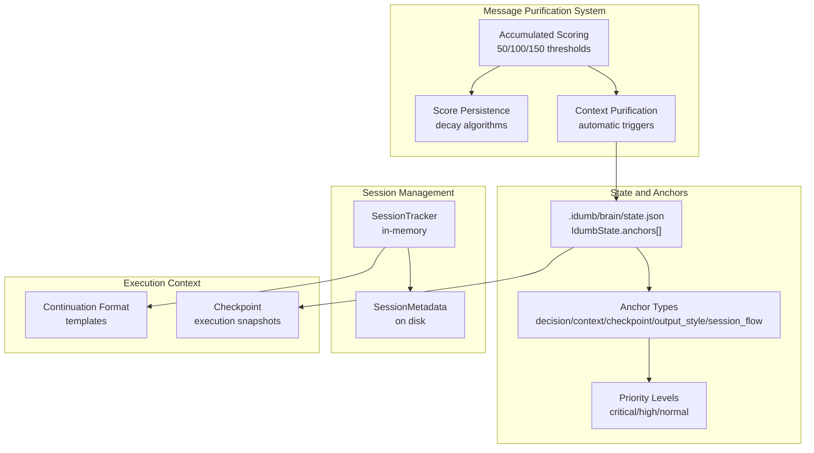
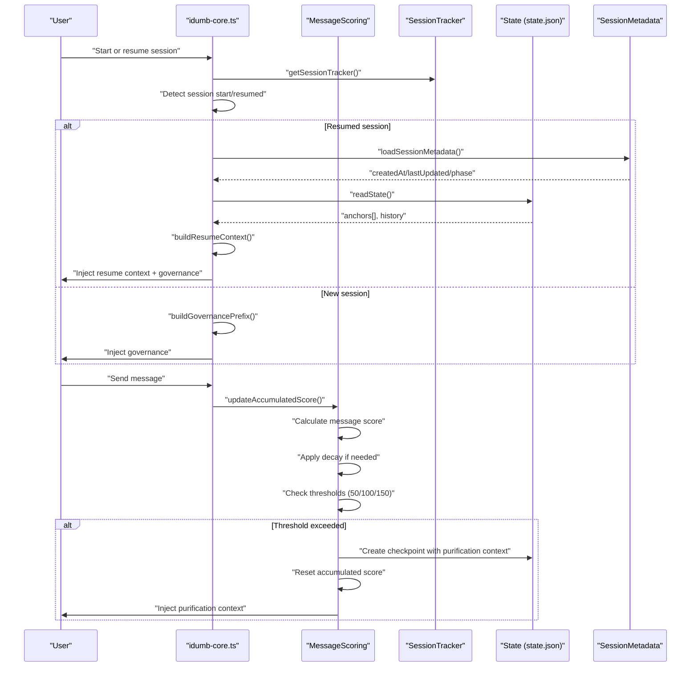
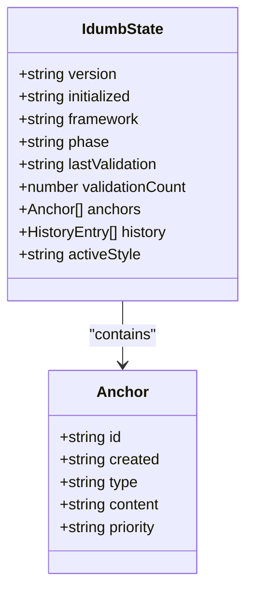
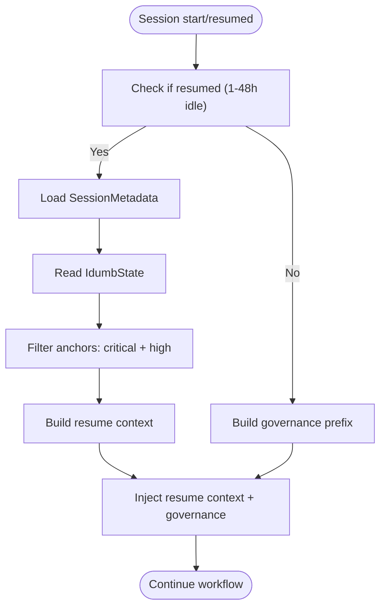
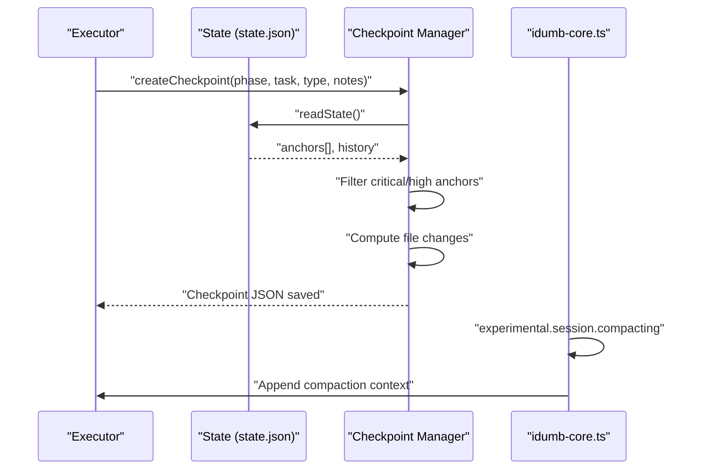
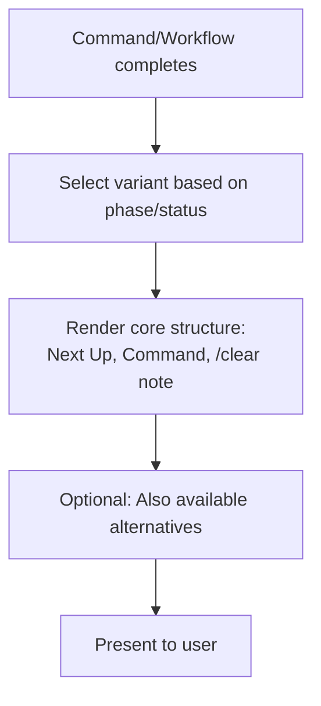
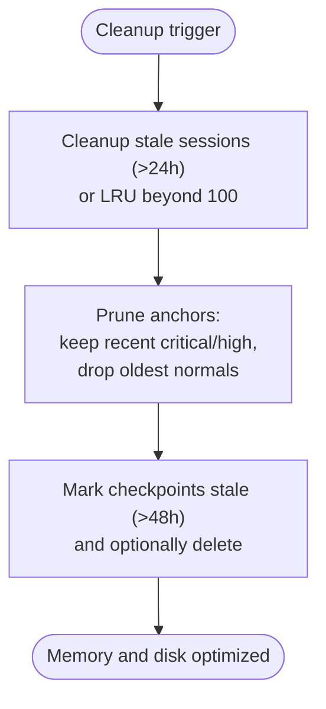
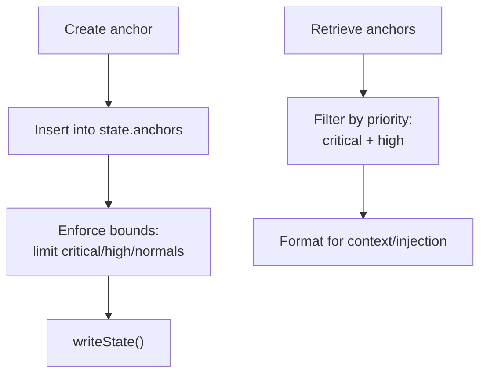
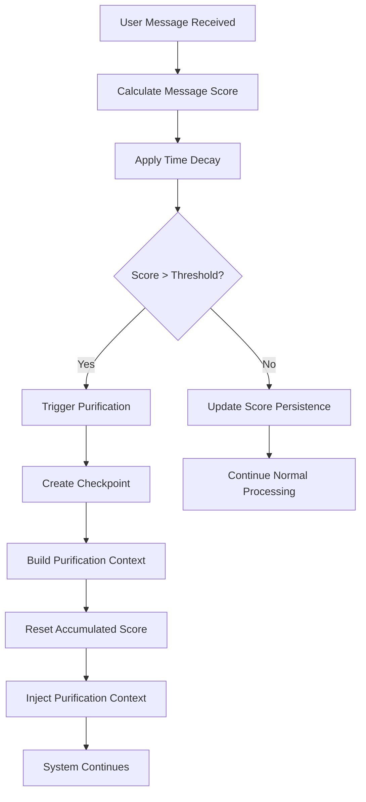
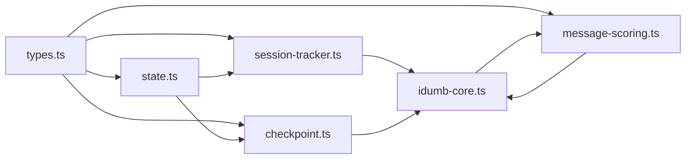

# Context Preservation

<cite>
**Referenced Files in This Document**
- [continuation-format.md](file://src/references/continuation-format.md)
- [checkpoints.md](file://src/references/checkpoints.md)
- [session-tracker.ts](file://src/plugins/lib/session-tracker.ts)
- [types.ts](file://src/plugins/lib/types.ts)
- [state.ts](file://src/plugins/lib/state.ts)
- [checkpoint.ts](file://src/plugins/lib/checkpoint.ts)
- [idumb-core.ts](file://src/plugins/idumb-core.ts)
- [context.md](file://src/templates/context.md)
- [resumed-session.md](file://src/skills/hierarchical-mindfulness/examples/resumed-session.md)
- [resume.md](file://src/commands/idumb/resume.md)
- [MESSAGE-INTERCEPTION-SPEC.md](file://.plugin-dev/research/MESSAGE-INTERCEPTION-SPEC.md)
- [NEW-SESSION-VALIDATION.md](file://.plugin-dev/research/NEW-SESSION-VALIDATION.md)
- [message-scoring.ts](file://src/plugins/lib/message-scoring.ts)
- [message-scoring.test.ts](file://src/plugins/lib/__tests__/message-scoring.test.ts)
</cite>

## Update Summary
**Changes Made**
- Added comprehensive documentation for the new Message Context Purification System
- Updated purification workflow with sophisticated scoring mechanisms and multi-level triggers
- Documented accumulation scoring with decay algorithms and threshold-based purification
- Added detailed coverage of purification context injection and score persistence
- Enhanced anchor system documentation to include purification context preservation

## Table of Contents
1. [Introduction](#introduction)
2. [Project Structure](#project-structure)
3. [Core Components](#core-components)
4. [Architecture Overview](#architecture-overview)
5. [Detailed Component Analysis](#detailed-component-analysis)
6. [Dependency Analysis](#dependency-analysis)
7. [Performance Considerations](#performance-considerations)
8. [Troubleshooting Guide](#troubleshooting-guide)
9. [Conclusion](#conclusion)

## Introduction
This document explains iDumb's context preservation mechanisms with a focus on the continuation format and the anchor system. It details how critical decisions, context, and checkpoints are preserved across state changes and session compaction. It covers the anchor prioritization system (critical, high, normal), automatic cleanup algorithms that maintain optimal memory usage, and practical examples of anchor creation, retrieval, filtering, and formatting for context injection. It also clarifies the relationship between anchors and session resumption, ensuring workflow continuity across interruptions.

**Updated** Integrated the new Message Context Purification System with sophisticated scoring mechanisms, accumulation triggers, and purification workflows that prevent context pollution through intelligent message processing and automated context management.

## Project Structure
The context preservation system spans several modules:
- Anchor and state management: persistent anchors stored in state.json
- Session tracking: in-memory trackers and metadata persistence
- Checkpoint management: execution snapshots capturing context anchors
- Message transformation hooks: inject governance and resumption context
- **Message Context Purification System**: intelligent scoring, accumulation, and purification workflows
- Templates and references: define continuation and checkpoint formats

**Diagram sources**
- [state.ts](file://src/plugins/lib/state.ts#L174-L189)
- [types.ts](file://src/plugins/lib/types.ts#L38-L44)
- [session-tracker.ts](file://src/plugins/lib/session-tracker.ts#L35-L117)
- [checkpoint.ts](file://src/plugins/lib/checkpoint.ts#L123-L204)
- [continuation-format.md](file://src/references/continuation-format.md#L16-L36)
- [message-scoring.ts](file://src/plugins/lib/message-scoring.ts#L24-L28)

**Section sources**
- [state.ts](file://src/plugins/lib/state.ts#L174-L189)
- [types.ts](file://src/plugins/lib/types.ts#L38-L44)
- [session-tracker.ts](file://src/plugins/lib/session-tracker.ts#L35-L117)
- [checkpoint.ts](file://src/plugins/lib/checkpoint.ts#L123-L204)
- [continuation-format.md](file://src/references/continuation-format.md#L16-L36)
- [message-scoring.ts](file://src/plugins/lib/message-scoring.ts#L1-L464)

## Core Components
- Anchor model and priorities: anchors are typed and prioritized, persisted in state.json, and filtered for context injection.
- Session resumption: detects resumed sessions and builds contextual reminders to maintain workflow continuity.
- Checkpointing: captures critical and high-priority anchors at execution boundaries for recovery.
- Continuation format: standardized presentation of next steps to keep context clean and actionable.
- **Message Context Purification System**: intelligent scoring of message complexity, accumulation with decay, and automatic purification triggers at 50/100/150 point thresholds.
- Automatic cleanup: memory and disk cleanup policies to maintain performance and storage hygiene.

**Section sources**
- [types.ts](file://src/plugins/lib/types.ts#L38-L44)
- [session-tracker.ts](file://src/plugins/lib/session-tracker.ts#L269-L332)
- [checkpoint.ts](file://src/plugins/lib/checkpoint.ts#L123-L204)
- [continuation-format.md](file://src/references/continuation-format.md#L16-L36)
- [message-scoring.ts](file://src/plugins/lib/message-scoring.ts#L24-L28)

## Architecture Overview
The system integrates hooks and utilities to preserve and recover context across interruptions and compactions, with enhanced message processing for context purification.

**Diagram sources**
- [idumb-core.ts](file://src/plugins/idumb-core.ts#L451-L649)
- [message-scoring.ts](file://src/plugins/lib/message-scoring.ts#L331-L388)

**Section sources**
- [idumb-core.ts](file://src/plugins/idumb-core.ts#L451-L649)
- [session-tracker.ts](file://src/plugins/lib/session-tracker.ts#L269-L332)
- [state.ts](file://src/plugins/lib/state.ts#L34-L45)
- [message-scoring.ts](file://src/plugins/lib/message-scoring.ts#L331-L388)

## Detailed Component Analysis

### Anchor System and Priorities
- Anchor types: decision, context, checkpoint, output_style, session_flow.
- Priority levels: critical, high, normal.
- Persistence: anchors stored in state.json under IdumbState.anchors.
- Filtering: commonly used to select critical and high anchors for context injection and checkpointing.

**Diagram sources**
- [types.ts](file://src/plugins/lib/types.ts#L20-L36)
- [types.ts](file://src/plugins/lib/types.ts#L38-L44)

**Section sources**
- [types.ts](file://src/plugins/lib/types.ts#L38-L44)
- [state.ts](file://src/plugins/lib/state.ts#L174-L189)

### Session Resumption and Resume Context
- Resumption detection: identifies sessions idle between 1 and 48 hours.
- Resume context construction: includes idle duration, previous session date, current phase, and active anchors.
- Conditional injection: prepends resume context to governance prefix when resuming.

**Diagram sources**
- [session-tracker.ts](file://src/plugins/lib/session-tracker.ts#L269-L332)
- [idumb-core.ts](file://src/plugins/idumb-core.ts#L465-L493)

**Section sources**
- [session-tracker.ts](file://src/plugins/lib/session-tracker.ts#L269-L332)
- [idumb-core.ts](file://src/plugins/idumb-core.ts#L465-L493)
- [resumed-session.md](file://src/skills/hierarchical-mindfulness/examples/resumed-session.md#L1-L182)

### Checkpointing and Session Compaction
- Checkpoint creation: captures git hash, file changes, and critical/high anchors.
- Compaction hook: injects context before model receives truncated context.
- Automatic cleanup: preserves critical/high anchors across compaction and limits checkpoint count.

**Diagram sources**
- [checkpoint.ts](file://src/plugins/lib/checkpoint.ts#L123-L204)
- [idumb-core.ts](file://src/plugins/idumb-core.ts#L347-L378)

**Section sources**
- [checkpoint.ts](file://src/plugins/lib/checkpoint.ts#L123-L204)
- [idumb-core.ts](file://src/plugins/idumb-core.ts#L347-L378)

### Continuation Format
- Standardized presentation of next steps after commands or workflows.
- Core structure emphasizes clarity, actionable commands, and context hygiene (/clear guidance).
- Variants cover executing next plans, final plans, planning vs researching, and milestone completions.

**Diagram sources**
- [continuation-format.md](file://src/references/continuation-format.md#L16-L135)

**Section sources**
- [continuation-format.md](file://src/references/continuation-format.md#L16-L283)

### Automatic Cleanup Algorithms
- In-memory session cleanup: evicts stale sessions older than 24 hours or applies LRU eviction beyond 100 concurrent sessions.
- Anchor pruning: maintains a bounded number of anchors, keeping recent critical and high anchors and discarding older normal anchors.
- Checkpoint lifecycle: marks checkpoints as stale after 48 hours and supports deletion.

**Diagram sources**
- [session-tracker.ts](file://src/plugins/lib/session-tracker.ts#L54-L88)
- [state.ts](file://src/plugins/lib/state.ts#L175-L189)
- [checkpoint.ts](file://src/plugins/lib/checkpoint.ts#L231-L241)

**Section sources**
- [session-tracker.ts](file://src/plugins/lib/session-tracker.ts#L54-L88)
- [state.ts](file://src/plugins/lib/state.ts#L175-L189)
- [checkpoint.ts](file://src/plugins/lib/checkpoint.ts#L231-L241)

### Anchor Creation, Retrieval, Filtering, and Formatting
- Creation: add an anchor with type, content, and optional priority; prune to bounds after insertion.
- Retrieval: filter anchors by priority for context injection or checkpointing.
- Formatting: serialize content for compatibility (e.g., style anchors) and apply replacement policies per agent.
- Examples of anchor types and priorities are documented in command references and checkpoint definitions.

**Diagram sources**
- [state.ts](file://src/plugins/lib/state.ts#L155-L189)
- [checkpoint.ts](file://src/plugins/lib/checkpoint.ts#L171-L177)
- [resume.md](file://src/commands/idumb/resume.md#L156-L220)

**Section sources**
- [state.ts](file://src/plugins/lib/state.ts#L155-L189)
- [checkpoint.ts](file://src/plugins/lib/checkpoint.ts#L171-L177)
- [resume.md](file://src/commands/idumb/resume.md#L156-L220)

### Relationship Between Anchors and Session Resumption
- Active anchors (critical + high) are highlighted during resumption to refresh context quickly.
- Resume context informs the user of idle duration, previous session timing, current phase, and key decisions.
- This ensures continuity without requiring the user to re-explain prior decisions or recent progress.

**Section sources**
- [session-tracker.ts](file://src/plugins/lib/session-tracker.ts#L303-L332)
- [resumed-session.md](file://src/skills/hierarchical-mindfulness/examples/resumed-session.md#L32-L140)

### Message Context Purification System
**Updated** The new Message Context Purification System provides sophisticated protection against context pollution through intelligent message processing and automated purification workflows.

#### Scoring Mechanisms and Thresholds
- **Multi-level thresholds**: 50 (warning), 100 (purification trigger), 150 (emergency halt)
- **Accumulated scoring**: Tracks complexity over time with automatic decay
- **Score components**: Word count (base 1pt per 10 words), file context (+3 per file), code blocks (+3 each), URLs (+2 each)
- **Bonus scoring**: +5 for >100 words, +10 for >200 words

#### Accumulation and Decay Algorithm
- **Time-based decay**: 10% reduction per hour elapsed since last update
- **Score persistence**: Maintains state across sessions in `.idumb/brain/sessions/{sessionId}-score.json`
- **History tracking**: Stores up to 50 recent score events for analysis
- **Session age factor**: Adjusts scores based on recency (1.0x for <10min, 0.2x for >60min)

#### Purification Workflow
- **Automatic triggers**: Creates checkpoints and purification context when thresholds exceeded
- **Critical context preservation**: Ensures critical and high-priority anchors survive purification
- **Context injection**: Provides structured recovery information for seamless workflow continuation
- **Score reset**: Clears accumulated score after purification to prevent cascading triggers

**Diagram sources**
- [message-scoring.ts](file://src/plugins/lib/message-scoring.ts#L266-L297)
- [message-scoring.ts](file://src/plugins/lib/message-scoring.ts#L304-L322)
- [message-scoring.ts](file://src/plugins/lib/message-scoring.ts#L331-L388)

**Section sources**
- [message-scoring.ts](file://src/plugins/lib/message-scoring.ts#L24-L28)
- [message-scoring.ts](file://src/plugins/lib/message-scoring.ts#L266-L297)
- [message-scoring.ts](file://src/plugins/lib/message-scoring.ts#L304-L322)
- [message-scoring.ts](file://src/plugins/lib/message-scoring.ts#L331-L388)
- [message-scoring.ts](file://src/plugins/lib/message-scoring.ts#L417-L463)

### Integration with Main Message Processing Pipeline
**Updated** The purification system integrates seamlessly with the main message transformation pipeline through the `experimental.chat.messages.transform` hook.

#### Message Processing Flow
1. **Session start detection**: Identifies new conversations and resumes
2. **Governance injection**: Prepares and injects appropriate context
3. **Message scoring**: Evaluates incoming messages for complexity
4. **Purification triggers**: Activates when thresholds exceeded
5. **Context preservation**: Ensures critical information survives purification

#### Technical Implementation
- **Score persistence**: Uses `.idumb/brain/sessions/` directory structure
- **Session isolation**: Each session maintains its own score state
- **TUI-safe operations**: All operations designed to work within OpenCode constraints
- **Graceful degradation**: System continues functioning even if purification fails

**Section sources**
- [idumb-core.ts](file://src/plugins/idumb-core.ts#L451-L649)
- [message-scoring.ts](file://src/plugins/lib/message-scoring.ts#L214-L259)

## Dependency Analysis
The anchor and session systems depend on shared types and state management utilities. Checkpointing depends on state and file-change detection. Message transformation hooks depend on session tracking and state to build contextual prefixes. **Updated** The purification system depends on the message scoring library and integrates with the core plugin through the messages.transform hook.

**Diagram sources**
- [types.ts](file://src/plugins/lib/types.ts#L38-L44)
- [state.ts](file://src/plugins/lib/state.ts#L34-L45)
- [session-tracker.ts](file://src/plugins/lib/session-tracker.ts#L35-L117)
- [checkpoint.ts](file://src/plugins/lib/checkpoint.ts#L123-L204)
- [idumb-core.ts](file://src/plugins/idumb-core.ts#L451-L649)
- [message-scoring.ts](file://src/plugins/lib/message-scoring.ts#L1-L464)

**Section sources**
- [types.ts](file://src/plugins/lib/types.ts#L38-L44)
- [state.ts](file://src/plugins/lib/state.ts#L34-L45)
- [session-tracker.ts](file://src/plugins/lib/session-tracker.ts#L35-L117)
- [checkpoint.ts](file://src/plugins/lib/checkpoint.ts#L123-L204)
- [idumb-core.ts](file://src/plugins/idumb-core.ts#L451-L649)
- [message-scoring.ts](file://src/plugins/lib/message-scoring.ts#L1-L464)

## Performance Considerations
- Memory management: in-memory session eviction prevents unbounded growth; consider adjusting TTL and max sessions based on workload.
- Anchor pruning: maintains bounded anchor lists to reduce state size and improve read/write performance.
- Checkpoint aging: marking checkpoints stale after 48 hours reduces unnecessary disk usage.
- Context injection budgeting: compaction preserves minimal style context to avoid exceeding character budgets.
- **Message scoring overhead**: Score calculations are lightweight but should be monitored in high-volume scenarios.
- **Storage efficiency**: Score files are small and automatically cleaned up during session cleanup.

## Troubleshooting Guide
- Resumption context not injected: verify session resumption detection and that resume context is prepended to governance prefix.
- Missing anchors in context: confirm anchor filtering for critical/high and that state is readable.
- Checkpoint not created: ensure state is available, file changes are computed, and checkpoint directory exists.
- Excessive memory usage: review cleanup thresholds and consider reducing max sessions or TTL.
- **Purification not triggered**: check accumulation scoring and threshold logic; ensure integration with message transformation hooks.
- **Score persistence issues**: verify `.idumb/brain/sessions/` directory permissions and availability.
- **Context loss during purification**: ensure critical anchors are properly tagged and that purification context is being injected.

**Section sources**
- [session-tracker.ts](file://src/plugins/lib/session-tracker.ts#L269-L332)
- [checkpoint.ts](file://src/plugins/lib/checkpoint.ts#L123-L204)
- [state.ts](file://src/plugins/lib/state.ts#L34-L45)
- [idumb-core.ts](file://src/plugins/idumb-core.ts#L347-L378)
- [message-scoring.ts](file://src/plugins/lib/message-scoring.ts#L214-L259)

## Conclusion
iDumb's context preservation relies on a robust anchor system, precise session resumption logic, and disciplined checkpointing. The anchor prioritization (critical, high, normal) ensures essential context is retained across interruptions and compaction. Automatic cleanup algorithms maintain performance and storage efficiency. **Updated** The new Message Context Purification System provides sophisticated protection against context pollution through intelligent scoring, accumulation with decay, and automated purification triggers at 50/100/150 point thresholds. This system ensures workflow continuity while preventing context bloat and maintaining optimal conversation quality. Together, these mechanisms sustain workflow continuity and enable reliable session resumption with minimal user intervention.