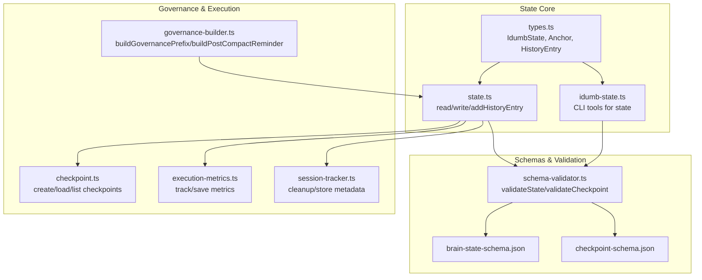
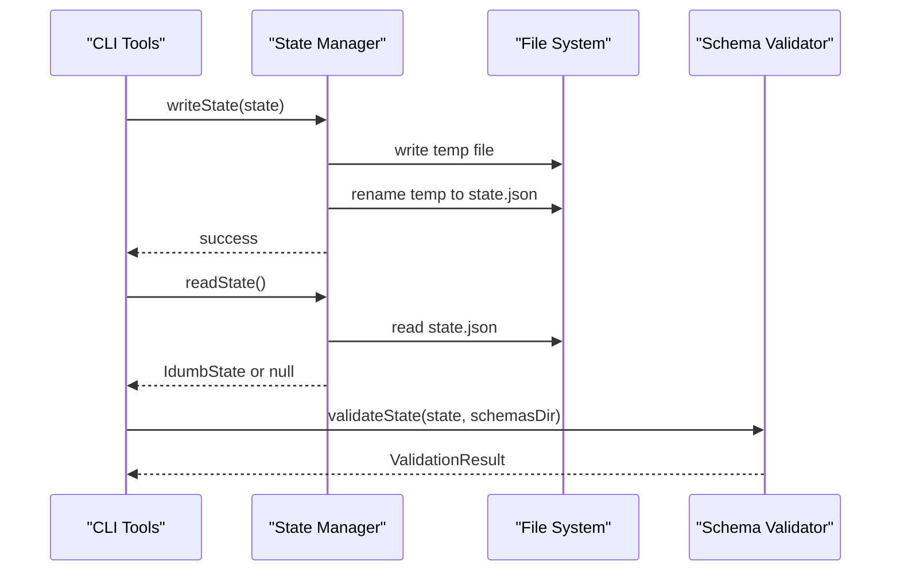
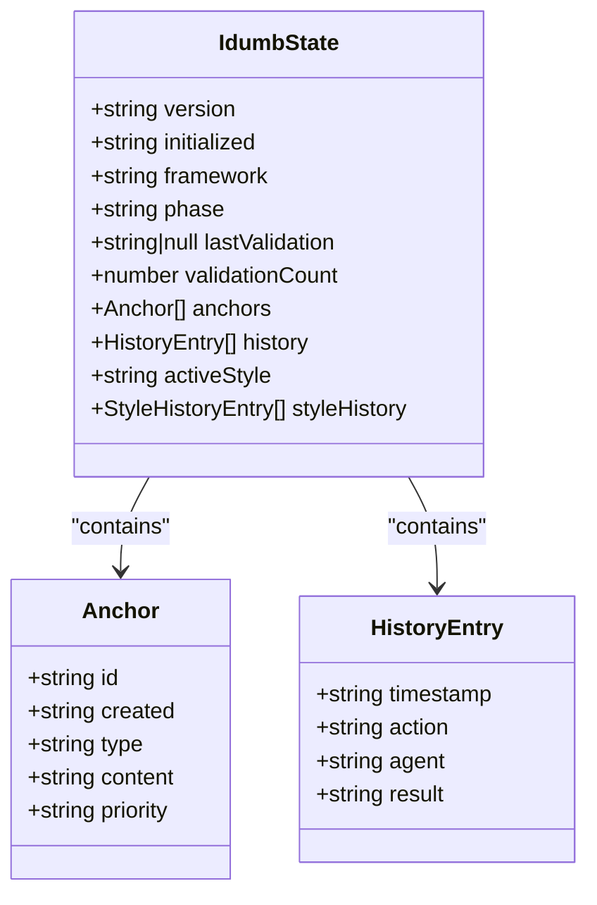
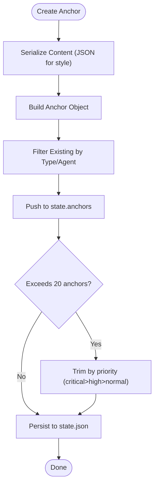
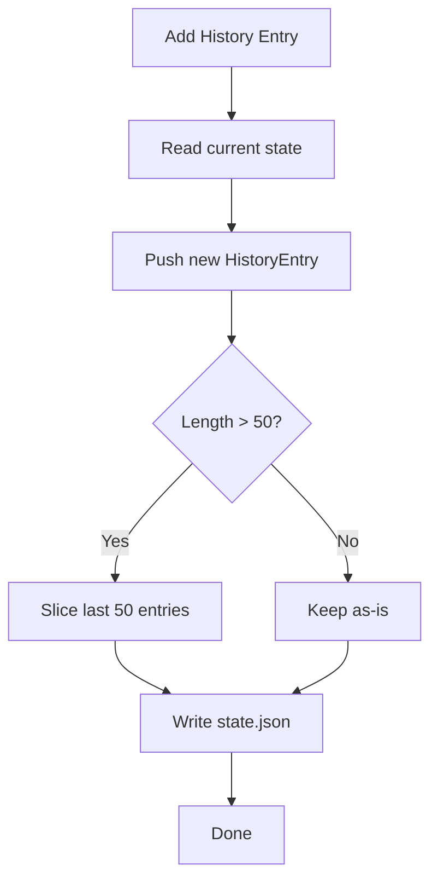
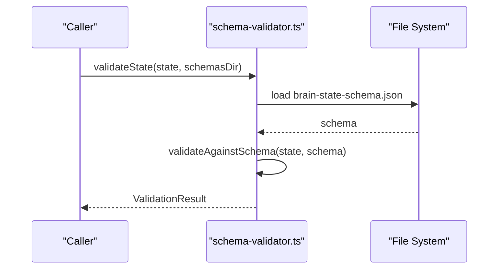
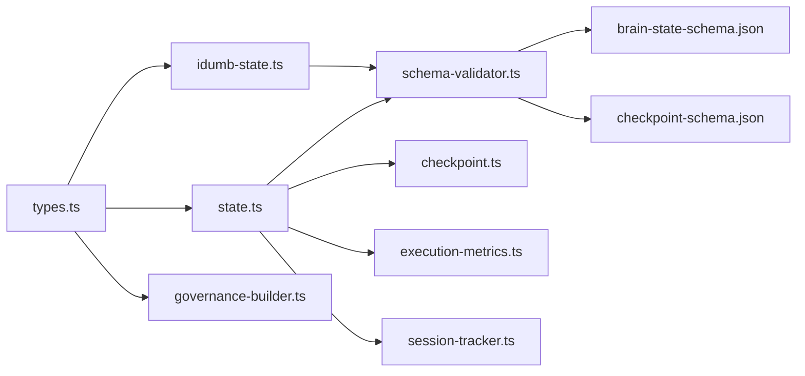

# State Architecture

<cite>
**Referenced Files in This Document**
- [src/plugins/lib/types.ts](file://src/plugins/lib/types.ts)
- [src/plugins/lib/state.ts](file://src/plugins/lib/state.ts)
- [src/tools/idumb-state.ts](file://src/tools/idumb-state.ts)
- [src/schemas/brain-state-schema.json](file://src/schemas/brain-state-schema.json)
- [src/schemas/checkpoint-schema.json](file://src/schemas/checkpoint-schema.json)
- [src/plugins/lib/schema-validator.ts](file://src/plugins/lib/schema-validator.ts)
- [src/plugins/lib/checkpoint.ts](file://src/plugins/lib/checkpoint.ts)
- [src/plugins/lib/session-tracker.ts](file://src/plugins/lib/session-tracker.ts)
- [src/plugins/lib/governance-builder.ts](file://src/plugins/lib/governance-builder.ts)
- [src/plugins/lib/execution-metrics.ts](file://src/plugins/lib/execution-metrics.ts)
- [src/commands/idumb/validate.md](file://src/commands/idumb/validate.md)
- [src/commands/idumb/debug.md](file://src/commands/idumb/debug.md)
</cite>

## Table of Contents
1. [Introduction](#introduction)
2. [Project Structure](#project-structure)
3. [Core Components](#core-components)
4. [Architecture Overview](#architecture-overview)
5. [Detailed Component Analysis](#detailed-component-analysis)
6. [Dependency Analysis](#dependency-analysis)
7. [Performance Considerations](#performance-considerations)
8. [Troubleshooting Guide](#troubleshooting-guide)
9. [Conclusion](#conclusion)

## Introduction
This document explains iDumb’s state architecture with a focus on the IdumbState interface, state.json schema, Anchor context preservation, HistoryEntry audit trails, and governance metadata. It also covers validation procedures, integrity checks, checkpointing, and practical debugging techniques. The goal is to provide a clear understanding of how state is modeled, persisted, validated, and manipulated across the system.

## Project Structure
The state architecture spans several modules:
- Core state interfaces and types
- State persistence and manipulation utilities
- JSON schema definitions and runtime validators
- Governance-aware state consumers and producers
- Execution checkpoints and metrics
- Debugging and validation commands

**Diagram sources**
- [src/plugins/lib/types.ts](file://src/plugins/lib/types.ts#L20-L51)
- [src/plugins/lib/state.ts](file://src/plugins/lib/state.ts#L34-L101)
- [src/tools/idumb-state.ts](file://src/tools/idumb-state.ts#L13-L78)
- [src/schemas/brain-state-schema.json](file://src/schemas/brain-state-schema.json#L1-L112)
- [src/schemas/checkpoint-schema.json](file://src/schemas/checkpoint-schema.json#L1-L199)
- [src/plugins/lib/schema-validator.ts](file://src/plugins/lib/schema-validator.ts#L211-L248)
- [src/plugins/lib/governance-builder.ts](file://src/plugins/lib/governance-builder.ts#L200-L346)
- [src/plugins/lib/checkpoint.ts](file://src/plugins/lib/checkpoint.ts#L123-L204)
- [src/plugins/lib/execution-metrics.ts](file://src/plugins/lib/execution-metrics.ts#L30-L95)
- [src/plugins/lib/session-tracker.ts](file://src/plugins/lib/session-tracker.ts#L97-L117)

**Section sources**
- [src/plugins/lib/types.ts](file://src/plugins/lib/types.ts#L20-L51)
- [src/plugins/lib/state.ts](file://src/plugins/lib/state.ts#L18-L73)
- [src/tools/idumb-state.ts](file://src/tools/idumb-state.ts#L50-L78)
- [src/schemas/brain-state-schema.json](file://src/schemas/brain-state-schema.json#L1-L112)
- [src/schemas/checkpoint-schema.json](file://src/schemas/checkpoint-schema.json#L1-L199)
- [src/plugins/lib/schema-validator.ts](file://src/plugins/lib/schema-validator.ts#L211-L248)
- [src/plugins/lib/governance-builder.ts](file://src/plugins/lib/governance-builder.ts#L200-L346)
- [src/plugins/lib/checkpoint.ts](file://src/plugins/lib/checkpoint.ts#L123-L204)
- [src/plugins/lib/execution-metrics.ts](file://src/plugins/lib/execution-metrics.ts#L30-L95)
- [src/plugins/lib/session-tracker.ts](file://src/plugins/lib/session-tracker.ts#L97-L117)

## Core Components
- IdumbState: The central governance state object persisted in .idumb/brain/state.json. It includes versioning, initialization timestamps, framework type, phase tracking, validation metrics, anchors, and history.
- Anchor: A context-preserving entry with id, created timestamp, type, content, and priority. Anchors survive compaction and are used for governance and recovery.
- HistoryEntry: An audit trail entry capturing action, agent, result, and timestamp.
- Validation: Runtime schema validation of state and checkpoints using JSON Schema draft-07 compatible validators.
- Persistence: Atomic write/read helpers and CLI tools for state manipulation.

Key implementation references:
- IdumbState and Anchor interfaces: [src/plugins/lib/types.ts](file://src/plugins/lib/types.ts#L20-L51)
- State read/write and history: [src/plugins/lib/state.ts](file://src/plugins/lib/state.ts#L34-L101)
- CLI state tools: [src/tools/idumb-state.ts](file://src/tools/idumb-state.ts#L61-L179)
- Schema definitions: [src/schemas/brain-state-schema.json](file://src/schemas/brain-state-schema.json#L1-L112), [src/schemas/checkpoint-schema.json](file://src/schemas/checkpoint-schema.json#L1-L199)
- Schema validation: [src/plugins/lib/schema-validator.ts](file://src/plugins/lib/schema-validator.ts#L211-L248)

**Section sources**
- [src/plugins/lib/types.ts](file://src/plugins/lib/types.ts#L20-L51)
- [src/plugins/lib/state.ts](file://src/plugins/lib/state.ts#L34-L101)
- [src/tools/idumb-state.ts](file://src/tools/idumb-state.ts#L61-L179)
- [src/schemas/brain-state-schema.json](file://src/schemas/brain-state-schema.json#L1-L112)
- [src/schemas/checkpoint-schema.json](file://src/schemas/checkpoint-schema.json#L1-L199)
- [src/plugins/lib/schema-validator.ts](file://src/plugins/lib/schema-validator.ts#L211-L248)

## Architecture Overview
The state architecture centers on a single canonical state file (.idumb/brain/state.json) that is:
- Persisted atomically to prevent corruption
- Validated against a strict JSON Schema
- Consumed by governance builders, validators, and executors
- Augmented with anchors and history for context preservation and auditability

**Diagram sources**
- [src/plugins/lib/state.ts](file://src/plugins/lib/state.ts#L51-L73)
- [src/plugins/lib/state.ts](file://src/plugins/lib/state.ts#L34-L45)
- [src/plugins/lib/schema-validator.ts](file://src/plugins/lib/schema-validator.ts#L211-L227)

## Detailed Component Analysis

### IdumbState Interface and state.json Schema
IdumbState captures the governance state with:
- version: Semantic version of the framework
- initialized: ISO 8601 timestamp of initialization
- framework: Enumerated framework type
- phase: Current project phase
- lastValidation: Last validation timestamp or null
- validationCount: Total validations passed
- anchors: Up to 20 Anchor entries
- history: Up to 50 HistoryEntry records
- activeStyle and styleHistory: Output style tracking (Phase 0 Memory Management)

Schema constraints:
- Required fields: version, initialized, framework, phase
- AdditionalProperties disabled to prevent unknown fields
- Max lengths and enums for safety and stability

References:
- Interface: [src/plugins/lib/types.ts](file://src/plugins/lib/types.ts#L20-L36)
- Schema: [src/schemas/brain-state-schema.json](file://src/schemas/brain-state-schema.json#L1-L112)

**Diagram sources**
- [src/plugins/lib/types.ts](file://src/plugins/lib/types.ts#L20-L51)
- [src/schemas/brain-state-schema.json](file://src/schemas/brain-state-schema.json#L54-L108)

**Section sources**
- [src/plugins/lib/types.ts](file://src/plugins/lib/types.ts#L20-L36)
- [src/schemas/brain-state-schema.json](file://src/schemas/brain-state-schema.json#L6-L52)

### Anchor Interface and Priority Levels
Anchors preserve critical context across compaction and state changes:
- id: Unique identifier with pattern constraint
- created: ISO 8601 timestamp
- type: Enumerated anchor types
- content: Serialized content (up to 1000 chars)
- priority: critical/high/normal determines survival during trimming

Usage patterns:
- Style anchors: Serialized JSON content with agent and style metadata
- Governance anchors: Decision, context, checkpoint, and output_style types
- Compaction policies: Preserve critical/high, trim normal entries

References:
- Anchor interface: [src/plugins/lib/types.ts](file://src/plugins/lib/types.ts#L38-L44)
- Style anchor creation: [src/plugins/lib/state.ts](file://src/plugins/lib/state.ts#L111-L149)
- Anchor retrieval: [src/plugins/lib/state.ts](file://src/plugins/lib/state.ts#L154-L168)
- Schema constraints: [src/schemas/brain-state-schema.json](file://src/schemas/brain-state-schema.json#L54-L84)

**Diagram sources**
- [src/plugins/lib/state.ts](file://src/plugins/lib/state.ts#L111-L149)
- [src/schemas/brain-state-schema.json](file://src/schemas/brain-state-schema.json#L37-L44)

**Section sources**
- [src/plugins/lib/types.ts](file://src/plugins/lib/types.ts#L38-L44)
- [src/plugins/lib/state.ts](file://src/plugins/lib/state.ts#L111-L168)
- [src/schemas/brain-state-schema.json](file://src/schemas/brain-state-schema.json#L54-L84)

### HistoryEntry Structure and Audit Trails
HistoryEntry enables auditability and agent activity tracking:
- timestamp: ISO 8601
- action: Human-readable action description
- agent: Agent responsible
- result: pass/fail/partial/warn

Management:
- Append new entries
- Limit to 50 most recent entries
- Automatic trimming when adding beyond capacity

References:
- HistoryEntry interface: [src/plugins/lib/types.ts](file://src/plugins/lib/types.ts#L46-L51)
- History management: [src/plugins/lib/state.ts](file://src/plugins/lib/state.ts#L79-L101)
- Schema constraints: [src/schemas/brain-state-schema.json](file://src/schemas/brain-state-schema.json#L85-L108)

**Diagram sources**
- [src/plugins/lib/state.ts](file://src/plugins/lib/state.ts#L79-L101)
- [src/schemas/brain-state-schema.json](file://src/schemas/brain-state-schema.json#L45-L52)

**Section sources**
- [src/plugins/lib/types.ts](file://src/plugins/lib/types.ts#L46-L51)
- [src/plugins/lib/state.ts](file://src/plugins/lib/state.ts#L79-L101)
- [src/schemas/brain-state-schema.json](file://src/schemas/brain-state-schema.json#L85-L108)

### State Validation Procedures and Integrity Checks
Runtime validation ensures state and checkpoints conform to schemas:
- validateState: Loads brain-state-schema.json and validates IdumbState
- validateCheckpoint: Loads checkpoint-schema.json and validates checkpoint objects
- formatValidationErrors: Produces human-readable summaries

Validation points:
- Required fields present
- Types and formats match (e.g., date-time, enum values)
- Length constraints respected (maxItems, maxLength)
- AdditionalProperties disabled to prevent unknown keys

References:
- Validation functions: [src/plugins/lib/schema-validator.ts](file://src/plugins/lib/schema-validator.ts#L211-L262)
- State schema: [src/schemas/brain-state-schema.json](file://src/schemas/brain-state-schema.json#L1-L112)
- Checkpoint schema: [src/schemas/checkpoint-schema.json](file://src/schemas/checkpoint-schema.json#L1-L199)

**Diagram sources**
- [src/plugins/lib/schema-validator.ts](file://src/plugins/lib/schema-validator.ts#L211-L227)
- [src/schemas/brain-state-schema.json](file://src/schemas/brain-state-schema.json#L1-L112)

**Section sources**
- [src/plugins/lib/schema-validator.ts](file://src/plugins/lib/schema-validator.ts#L211-L262)
- [src/schemas/brain-state-schema.json](file://src/schemas/brain-state-schema.json#L1-L112)
- [src/schemas/checkpoint-schema.json](file://src/schemas/checkpoint-schema.json#L1-L199)

### Migration Strategies
While explicit migration functions are not shown in the analyzed files, the system supports forward-compatibility through:
- JSON Schema validation to detect incompatible changes
- AdditionalProperties disabled to prevent unknown fields
- Explicit trimming and rotation of history/anchors to keep state bounded

Recommended migration practices:
- Add new optional fields to IdumbState with sensible defaults
- Increment version and update schema accordingly
- Provide validation warnings for deprecated fields
- Use anchors to preserve critical context across upgrades

[No sources needed since this section provides general guidance]

### State Manipulation and Inspection Techniques
Common operations:
- Read state: [src/plugins/lib/state.ts](file://src/plugins/lib/state.ts#L34-L45), [src/tools/idumb-state.ts](file://src/tools/idumb-state.ts#L61-L72)
- Write state: [src/plugins/lib/state.ts](file://src/plugins/lib/state.ts#L51-L73), [src/tools/idumb-state.ts](file://src/tools/idumb-state.ts#L74-L78)
- Add anchor: [src/plugins/lib/state.ts](file://src/plugins/lib/state.ts#L111-L149), [src/tools/idumb-state.ts](file://src/tools/idumb-state.ts#L112-L150)
- Record history: [src/plugins/lib/state.ts](file://src/plugins/lib/state.ts#L79-L101), [src/tools/idumb-state.ts](file://src/tools/idumb-state.ts#L152-L179)
- Get anchors for compaction: [src/tools/idumb-state.ts](file://src/tools/idumb-state.ts#L181-L206)

Inspection:
- Use CLI tools to read/print state
- Validate state with schema-validator
- Inspect governance prefixes and post-compact reminders

**Section sources**
- [src/plugins/lib/state.ts](file://src/plugins/lib/state.ts#L34-L101)
- [src/tools/idumb-state.ts](file://src/tools/idumb-state.ts#L61-L179)

### Debugging Approaches
- Use /idumb:debug to apply scientific debugging methodology
- Maintain debug session state via idumb-state anchors
- Leverage governance builders to reconstruct context after interruptions
- Inspect execution metrics and checkpoints for stall detection

References:
- Debug command: [src/commands/idumb/debug.md](file://src/commands/idumb/debug.md#L1-L564)
- Governance context building: [src/plugins/lib/governance-builder.ts](file://src/plugins/lib/governance-builder.ts#L466-L576)
- Execution metrics and stall detection: [src/plugins/lib/execution-metrics.ts](file://src/plugins/lib/execution-metrics.ts#L100-L285)

**Section sources**
- [src/commands/idumb/debug.md](file://src/commands/idumb/debug.md#L1-L564)
- [src/plugins/lib/governance-builder.ts](file://src/plugins/lib/governance-builder.ts#L466-L576)
- [src/plugins/lib/execution-metrics.ts](file://src/plugins/lib/execution-metrics.ts#L100-L285)

## Dependency Analysis
State architecture dependencies:
- types.ts defines shared interfaces consumed by state.ts, idumb-state.ts, and governance-builder.ts
- state.ts and idumb-state.ts both read/write state.json and depend on schema-validator.ts for validation
- checkpoint.ts depends on state.ts for context and on schema-validator.ts for checkpoint validation
- execution-metrics.ts and session-tracker.ts depend on state.ts for freshness checks and metadata
- governance-builder.ts depends on state.ts for building governance context and reminders

**Diagram sources**
- [src/plugins/lib/types.ts](file://src/plugins/lib/types.ts#L20-L51)
- [src/plugins/lib/state.ts](file://src/plugins/lib/state.ts#L34-L101)
- [src/tools/idumb-state.ts](file://src/tools/idumb-state.ts#L61-L179)
- [src/plugins/lib/schema-validator.ts](file://src/plugins/lib/schema-validator.ts#L211-L248)
- [src/plugins/lib/checkpoint.ts](file://src/plugins/lib/checkpoint.ts#L123-L204)
- [src/plugins/lib/execution-metrics.ts](file://src/plugins/lib/execution-metrics.ts#L30-L95)
- [src/plugins/lib/session-tracker.ts](file://src/plugins/lib/session-tracker.ts#L97-L117)
- [src/plugins/lib/governance-builder.ts](file://src/plugins/lib/governance-builder.ts#L200-L346)

**Section sources**
- [src/plugins/lib/types.ts](file://src/plugins/lib/types.ts#L20-L51)
- [src/plugins/lib/state.ts](file://src/plugins/lib/state.ts#L34-L101)
- [src/tools/idumb-state.ts](file://src/tools/idumb-state.ts#L61-L179)
- [src/plugins/lib/schema-validator.ts](file://src/plugins/lib/schema-validator.ts#L211-L248)
- [src/plugins/lib/checkpoint.ts](file://src/plugins/lib/checkpoint.ts#L123-L204)
- [src/plugins/lib/execution-metrics.ts](file://src/plugins/lib/execution-metrics.ts#L30-L95)
- [src/plugins/lib/session-tracker.ts](file://src/plugins/lib/session-tracker.ts#L97-L117)
- [src/plugins/lib/governance-builder.ts](file://src/plugins/lib/governance-builder.ts#L200-L346)

## Performance Considerations
- Atomic writes: state.ts uses temporary files and atomic rename to prevent corruption and reduce partial writes.
- Bounded collections: Anchors trimmed to 20 and history trimmed to 50 to control growth.
- In-memory caches: session-tracker maintains lightweight in-memory state with TTL and LRU eviction.
- Minimal IO: Validation reads schemas from disk; consider caching schemas in memory for frequent checks.

[No sources needed since this section provides general guidance]

## Troubleshooting Guide
Common issues and resolutions:
- State file missing or corrupted: readState returns null/default; use CLI tools to recreate or repair.
- Validation failures: Use schema-validator to identify missing fields, wrong types, or extra properties.
- Excessive history/anchors: Use garbage collection tools to trim and archive old entries.
- Stale state: Use governance builders to detect staleness and recommend validation.
- Emergency halt: Check execution metrics and checkpoint directories for stall conditions.

References:
- Validation command: [src/commands/idumb/validate.md](file://src/commands/idumb/validate.md#L1-L518)
- Schema validation: [src/plugins/lib/schema-validator.ts](file://src/plugins/lib/schema-validator.ts#L267-L284)
- Garbage collection: [src/tools/idumb-state.ts](file://src/tools/idumb-state.ts#L439-L552)
- Staleness detection: [src/plugins/lib/session-tracker.ts](file://src/plugins/lib/session-tracker.ts#L362-L384)
- Emergency halt: [src/plugins/lib/execution-metrics.ts](file://src/plugins/lib/execution-metrics.ts#L310-L372)

**Section sources**
- [src/commands/idumb/validate.md](file://src/commands/idumb/validate.md#L1-L518)
- [src/plugins/lib/schema-validator.ts](file://src/plugins/lib/schema-validator.ts#L267-L284)
- [src/tools/idumb-state.ts](file://src/tools/idumb-state.ts#L439-L552)
- [src/plugins/lib/session-tracker.ts](file://src/plugins/lib/session-tracker.ts#L362-L384)
- [src/plugins/lib/execution-metrics.ts](file://src/plugins/lib/execution-metrics.ts#L310-L372)

## Conclusion
iDumb’s state architecture provides a robust, schema-validated, and bounded governance model centered on state.json. Through Anchor-based context preservation, HistoryEntry audit trails, and strict validation, the system ensures integrity, recoverability, and transparency. The included tools and patterns enable safe state manipulation, debugging, and migration while maintaining performance and reliability.